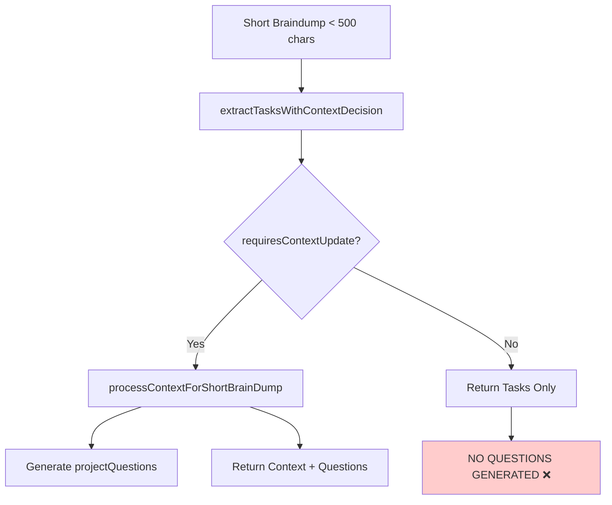
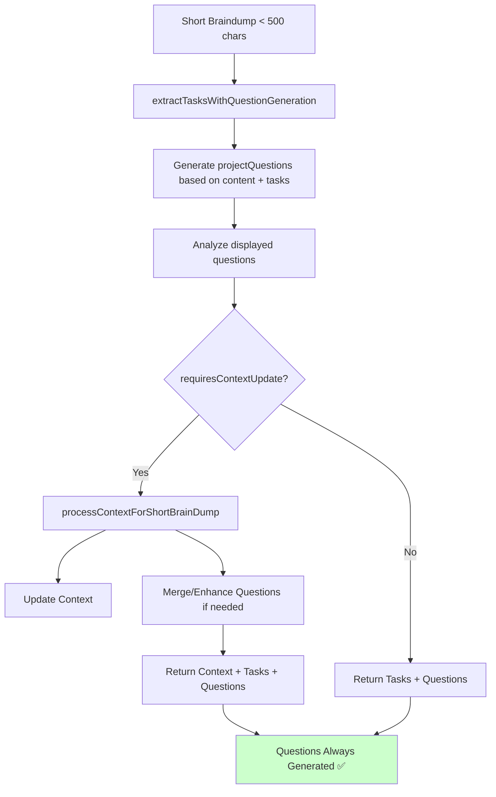

# Short Brain Dump Question Generation Fix

## Problem Statement

Short braindumps (<500 characters) on existing projects currently only generate new project questions when a context update is triggered. However, many short braindumps are task-focused and don't require context updates, meaning no new questions are generated even though the braindump content could provide valuable insights for future questions.

### Current Flow Analysis



### The Problem in Detail

1. **Task-Only Braindumps Get No Questions**: When a user adds simple tasks like "Fix the login bug" or "Review PR #123", no context update is triggered, and thus no new questions are generated to guide future braindumps.

2. **Lost Opportunity for Learning**: Even short, task-focused braindumps contain valuable information about what the user is working on, which could inform better questions.

3. **Inconsistent User Experience**: Users might notice that sometimes questions update (when context changes) and sometimes they don't (task-only dumps), creating confusion.

## Proposed Solution

### Core Change: Generate Questions During Task Extraction

Move question generation into the task extraction phase, ensuring questions are always generated based on the braindump content, regardless of whether context updates are needed.

### New Flow



## Implementation Details

### 1. Update LLM Prompts

Create a new prompt template that combines task extraction with question generation:

```typescript
// In PromptTemplateService
getTaskExtractionWithQuestionsPrompt(params: {
  content: string;
  projectContext?: any;
  displayedQuestions?: any[];
  existingQuestions?: any[];
}): string {
  return `Extract tasks and generate project questions from this braindump.

  Braindump Content: ${params.content}

  Current Project Context: ${JSON.stringify(params.projectContext)}

  Questions Currently Displayed: ${JSON.stringify(params.displayedQuestions)}

  Existing Project Questions: ${JSON.stringify(params.existingQuestions)}

  Respond with:
  {
    "tasks": [...],
    "requiresContextUpdate": boolean,
    "contextUpdateReason": "...",
    "questionAnalysis": {
      "questionsAnswered": [...],
      "answerQuality": "partial|complete|none"
    },
    "projectQuestions": [
      // Generate 3-5 NEW questions based on the braindump content and extracted tasks
      // These should help guide future braindumps
      // Consider what information is missing or what next steps might be
    ]
  }`;
}
```

### 2. Update Short Braindump Stream Processor

```typescript
// In ShortBrainDumpStreamProcessor
async extractTasksWithContextDecision(params: {
  content: string;
  projectId: string;
  displayedQuestions?: any[];
  userId: string;
}) {
  // Fetch current project context and questions
  const project = await this.fetchProjectWithQuestions(params.projectId);

  // Use new combined prompt
  const prompt = this.promptTemplateService.getTaskExtractionWithQuestionsPrompt({
    content: params.content,
    projectContext: project,
    displayedQuestions: params.displayedQuestions,
    existingQuestions: project.project_questions
  });

  const result = await this.llmService.generateStructuredResponse(prompt);

  return {
    tasks: result.tasks,
    requiresContextUpdate: result.requiresContextUpdate,
    contextUpdateReason: result.contextUpdateReason,
    questionAnalysis: result.questionAnalysis,
    projectQuestions: result.projectQuestions // Now always included
  };
}
```

### 3. Update Stream Endpoint

```typescript
// In stream-short/+server.ts
// After task extraction
const validatedTaskResult = await processor.extractTasksWithContextDecision({...});

// Always have projectQuestions now
let finalProjectQuestions = validatedTaskResult.projectQuestions;

// If context update happens, it might refine/add to questions
if (validatedTaskResult.requiresContextUpdate) {
  const contextResult = await processor.processContextForShortBrainDump({...});

  // Merge questions if context processing generated additional ones
  if (contextResult.projectQuestions?.length) {
    finalProjectQuestions = mergeQuestions(
      validatedTaskResult.projectQuestions,
      contextResult.projectQuestions
    );
  }
}

// Include in final result
const finalResult = {
  ...
  projectQuestions: finalProjectQuestions,
  ...
};
```

## Edge Cases to Consider

### 1. Duplicate Question Prevention

- **Issue**: Multiple braindumps might generate similar questions
- **Solution**: Implement question deduplication based on semantic similarity
- **Implementation**: Check existing questions and filter out near-duplicates

### 2. Question Relevance Decay

- **Issue**: Old questions become less relevant over time
- **Solution**: Implement question rotation/archiving
- **Implementation**: Track question age and usage, archive after N braindumps without answers

### 3. Minimal Content Braindumps

- **Issue**: Very short braindumps like "done" or "fixed it" provide little context
- **Solution**: Fall back to refresh existing questions or generate based on recent task history
- **Implementation**: Set minimum content threshold for meaningful question generation

### 4. Question Overload

- **Issue**: Too many questions accumulate, overwhelming users
- **Solution**: Limit active questions to 5-7, archive others
- **Implementation**: Implement question prioritization based on project phase and recent activity

### 5. Context-Task Mismatch

- **Issue**: Task-based questions might conflict with context-based questions
- **Solution**: Ensure question generation considers both task specifics and broader context
- **Implementation**: Pass full project context to task extraction for holistic question generation

### 6. Rapid Sequential Braindumps

- **Issue**: User makes multiple short braindumps in quick succession
- **Solution**: Batch question generation or throttle updates
- **Implementation**: Cache recent questions and update every N minutes or N braindumps

### 7. Project Without Context

- **Issue**: New projects might not have enough context for meaningful questions
- **Solution**: Generate exploratory questions to build context
- **Implementation**: Detect low-context projects and adjust question strategy

## Migration & Rollback Plan

### Migration Steps

1. Deploy new prompt templates
2. Update short braindump processor with backward compatibility
3. Test with subset of users
4. Monitor question quality metrics
5. Full rollout

### Rollback Strategy

- Feature flag to toggle new question generation
- Keep old flow as fallback for 2 weeks
- Monitor error rates and user feedback

## Success Metrics

1. **Question Generation Rate**: 100% of short braindumps should generate questions
2. **Question Relevance**: User engagement with questions should increase by 20%
3. **Error Rate**: No increase in processing failures
4. **Performance**: Question generation should add <500ms to processing time

## Testing Strategy

### Unit Tests

```typescript
describe('Short braindump question generation', () => {
	it('should generate questions for task-only braindumps', async () => {
		const result = await processor.extractTasksWithContextDecision({
			content: 'Fix login bug',
			projectId: 'test-project',
			displayedQuestions: [],
			userId: 'test-user'
		});

		expect(result.projectQuestions).toBeDefined();
		expect(result.projectQuestions.length).toBeGreaterThan(0);
		expect(result.requiresContextUpdate).toBe(false);
	});

	it('should handle minimal content gracefully', async () => {
		const result = await processor.extractTasksWithContextDecision({
			content: 'done',
			projectId: 'test-project',
			displayedQuestions: [],
			userId: 'test-user'
		});

		expect(result.projectQuestions).toBeDefined();
		// Should either generate generic questions or refresh existing ones
	});
});
```

### Integration Tests

- Test full flow from frontend to database
- Verify question persistence
- Test concurrent braindump handling
- Verify question deduplication

### E2E Tests

- User creates short task-focused braindump
- Verify questions appear in UI
- Verify questions persist across sessions
- Test question cycling in next braindump

## Implementation Timeline

1. **Phase 1** (Day 1-2): Update prompts and core logic
2. **Phase 2** (Day 3-4): Update stream processors and endpoints
3. **Phase 3** (Day 5): Add deduplication and edge case handling
4. **Phase 4** (Day 6-7): Testing and monitoring setup
5. **Phase 5** (Day 8+): Gradual rollout with monitoring

## Conclusion

This fix ensures that all braindumps, regardless of size or content focus, contribute to the evolution of project questions. This creates a more consistent and valuable user experience where every interaction with the system helps it better understand and guide the user's project.
