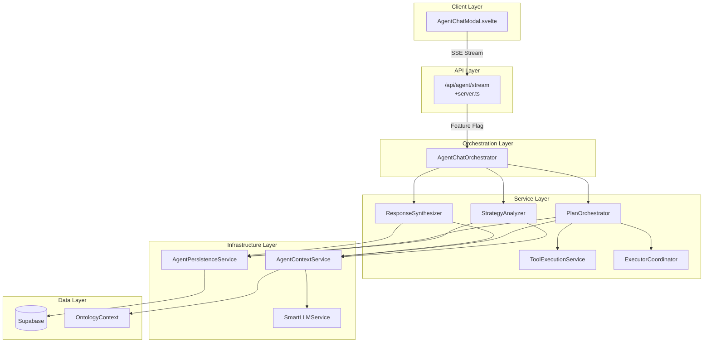

# Backend Agentic Chat Flow - Architecture Overview

## Document Metadata

- **Created**: 2025-11-05
- **Purpose**: High-level and detailed architecture overview of the refactored agentic chat backend
- **Status**: Documentation of implemented refactoring (Phase 1 complete)

## Table of Contents

1. [Executive Summary](#executive-summary)
2. [System Architecture Overview](#system-architecture-overview)
3. [Request Flow Walkthrough](#request-flow-walkthrough)
4. [Core Services Deep Dive](#core-services-deep-dive)
5. [Data Flow & Streaming Architecture](#data-flow--streaming-architecture)
6. [State Management & Persistence](#state-management--persistence)
7. [Integration Points](#integration-points)
8. [Migration Strategy](#migration-strategy)

---

## Executive Summary

The BuildOS agentic chat system has been refactored from a **2,263-line monolithic service** into a **domain-separated architecture** with 7 specialized services. This refactoring improves maintainability, testability, and scalability while preserving all existing functionality.

### Key Transformation

```
BEFORE: Single agent-planner-service.ts (2,263 lines)
AFTER:  7 Domain Services (~350 lines each)
```

### Architecture Highlights

- **Streaming-First**: Server-Sent Events (SSE) for real-time responses
- **Domain Separation**: Each service has a single responsibility
- **Feature-Flagged**: Safe rollout with `ENABLE_NEW_AGENTIC_CHAT`
- **Dual Strategy Support**: Simple and complex query handling
- **Full Persistence**: All interactions tracked in database

---

## System Architecture Overview

### High-Level Flow Diagram



### Service Responsibility Matrix

| Service                     | Purpose                              | Lines of Code | Dependencies     |
| --------------------------- | ------------------------------------ | ------------- | ---------------- |
| **AgentChatOrchestrator**   | Main coordinator & flow control      | ~400          | All services     |
| **StrategyAnalyzer**        | Intent analysis & strategy selection | ~300          | LLM Service      |
| **PlanOrchestrator**        | Multi-step plan creation & execution | ~400          | LLM, Executors   |
| **ToolExecutionService**    | Individual tool call execution       | ~250          | Tool Registry    |
| **ExecutorCoordinator**     | Spawn & manage executor agents       | ~300          | Executor Service |
| **ResponseSynthesizer**     | Generate coherent responses          | ~200          | LLM Service      |
| **AgentPersistenceService** | All database operations              | ~400          | Supabase         |

---

## Request Flow Walkthrough

### 1. Request Initiation

```typescript
POST /api/agent/stream
{
  message: "Analyze the health of my project",
  session_id: "uuid",
  context_type: "project",
  entity_id: "project-uuid",
  conversationHistory: [...],
  ontologyEntityType: "project"
}
```

### 2. API Endpoint Processing (`+server.ts`)

```typescript
// Key operations at API level:
1. Authentication check (user.id required)
2. Rate limiting (20 req/min, 30k tokens/min)
3. Session management (create or retrieve)
4. Ontology context loading
5. Last turn context generation
6. Route to orchestrator (feature-flagged)
```

### 3. Orchestrator Coordination Flow

#### Phase 1: Context Building

```typescript
AgentChatOrchestrator.streamConversation()
  ↓
AgentContextService.buildPlannerContext()
  - System prompts
  - Conversation history
  - Location context
  - Ontology data
  - Available tools
  ↓
Creates PlannerAgent record in DB
```

#### Phase 2: Strategy Analysis

```typescript
StrategyAnalyzer.analyzeUserIntent()
  ↓
Determines one of three strategies:
  1. PLANNER_STREAM     → Autonomous planner loop (tools + plan meta tool)
  2. PROJECT_CREATION   → Template selection + create_onto_project
  3. ASK_CLARIFYING     → Ambiguity resolution needed
  ↓
Emits: strategy_selected event
```

#### Phase 3: Execution (Strategy-Dependent)

**Simple Strategy Path:**

```typescript
handleSimpleStrategy()
  ↓
ToolExecutionService.executeTool()
  - Direct tool invocation
  - Entity extraction
  - Result validation
  ↓
ResponseSynthesizer.synthesizeSimpleResponse()
  ↓
Stream text response
```

**Complex Strategy Path:**

```typescript
handleComplexStrategy()
  ↓
PlanOrchestrator.createPlan()
  - Generate multi-step plan
  - Validate dependencies
  - Persist to database
  ↓
PlanOrchestrator.executePlan()
  ↓
For each step:
  - Check dependencies
  - Execute via Tool OR Executor
  - Track results
  - Update database
  ↓
ResponseSynthesizer.synthesizeComplexResponse()
  ↓
Stream consolidated response
```

---

## Core Services Deep Dive

### 1. StrategyAnalyzer Service

**Purpose**: Analyze user intent and select execution strategy

**Key Methods:**

```typescript
analyzeUserIntent(
  message: string,
  plannerContext: PlannerContext,
  context: ServiceContext,
  lastTurnContext?: LastTurnContext
): Promise<StrategyAnalysis>
```

**Decision Logic:**

- **Simple Research**: 1-2 tool calls, direct lookups
    - Examples: "Show me project X", "List my tasks"
- **Complex Research**: Multi-entity analysis, aggregation
    - Examples: "Analyze project health", "Generate comprehensive report"
- **Clarifying Questions**: Ambiguity that needs resolution
    - Examples: Multiple entity matches, unclear scope

### 2. PlanOrchestrator Service

**Purpose**: Create and execute multi-step plans

**Core Components:**

```typescript
interface PlanStep {
	stepNumber: number;
	type: string;
	description: string;
	executorRequired: boolean;
	tools: string[];
	dependsOn?: number[];
	status: 'pending' | 'executing' | 'completed' | 'failed';
	result?: any;
}
```

**Execution Features:**

- Dependency resolution
- Parallel execution where possible
- Step failure handling
- Progress tracking via SSE

### 3. ToolExecutionService

**Purpose**: Execute individual tool calls

**Tool Categories:**

```typescript
// Ontology Tools
(-get_project,
	list_projects - get_task,
	list_tasks,
	update_task - get_plan,
	get_goal - get_document,
	get_output -
		// Project Management Tools
		create_project -
		analyze_project_health -
		get_project_context -
		// Calendar Tools
		get_calendar_events -
		schedule_task);
```

**Execution Flow:**

1. Validate tool exists
2. Parse arguments
3. Execute via ChatToolExecutor
4. Extract entities accessed
5. Return structured result

### 4. ExecutorCoordinator Service

**Purpose**: Manage executor agents for complex tasks

**Spawning Process:**

```typescript
spawnExecutor({
  plan: AgentPlan,
  step: PlanStep,
  plannerContext: PlannerContext,
  previousStepResults: Map<number, any>
}): Promise<string>
```

**Features:**

- Read-only executor agents (deepseek-coder)
- Task distribution
- Result collection
- Failure retry logic

### 5. ResponseSynthesizer Service

**Purpose**: Generate coherent responses from execution results

**Synthesis Types:**

- **Simple**: Direct tool results formatting
- **Complex**: Multi-step plan consolidation
- **Clarifying**: Question generation

**Output Format:**

- Markdown-formatted text
- Contextual explanations
- Action summaries

### 6. AgentPersistenceService

**Purpose**: All database operations

**Data Models:**

```typescript
// Core Tables
- agents (planner & executor records)
- agent_plans (execution plans)
- agent_chat_sessions (chat sessions)
- agent_chat_messages (conversation history)
- agent_plan_executions (step execution logs)
```

**Operations:**

- CRUD for all agent entities
- Session management
- Message persistence
- Execution tracking

---

## Data Flow & Streaming Architecture

### SSE Event Types

```typescript
type StreamEvent =
	| { type: 'session'; session: ChatSession }
	| { type: 'ontology_loaded'; summary: string }
	| { type: 'last_turn_context'; context: LastTurnContext }
	| { type: 'strategy_selected'; strategy: string; confidence: number }
	| { type: 'clarifying_questions'; questions: string[] }
	| { type: 'analysis'; analysis: StrategyAnalysis }
	| { type: 'plan_created'; plan: AgentPlan }
	| { type: 'step_start'; step: PlanStep }
	| { type: 'step_complete'; step: PlanStep }
	| { type: 'executor_spawned'; executorId: string; task: string }
	| { type: 'executor_result'; result: ExecutorResult }
	| { type: 'text'; content: string }
	| { type: 'tool_call'; toolCall: ChatToolCall }
	| { type: 'tool_result'; result: ToolExecutionResult }
	| { type: 'context_shift'; context_shift: ContextShift }
	| { type: 'done' }
	| { type: 'error'; error: string };
```

### Streaming Flow

```
1. Client opens SSE connection
2. Server sends events as they occur
3. Events streamed in real-time:
   - Strategy selection (immediate)
   - Plan creation (1-2s)
   - Step execution (varies)
   - Tool results (as available)
   - Text synthesis (streamed)
4. Connection closed on completion/error
```

---

## State Management & Persistence

### Session Lifecycle

```typescript
1. Session Creation/Retrieval
   - Check existing session_id
   - Create new if needed
   - Load conversation history (last 50 messages)

2. Message Persistence
   - User message saved immediately
   - Assistant response saved after generation
   - Tool calls stored with results
   - Context shifts tracked

3. Plan & Execution Tracking
   - Plan created with status
   - Steps updated in real-time
   - Results persisted
   - Failures logged
```

### Database Schema Highlights

```sql
-- Core session tracking
chat_sessions (
  id, user_id, context_type, entity_id,
  status, message_count, total_tokens_used
)

-- Message history
chat_messages (
  session_id, role, content,
  tool_calls, tool_result
)

-- Agent records
agents (
  id, type, model, session_id,
  status, created_at
)

-- Execution plans
agent_plans (
  id, planner_agent_id, strategy,
  steps, status, metadata
)
```

---

## Integration Points

### 1. Ontology System Integration

```typescript
// Loaded at request time
OntologyContext {
  type: 'global' | 'project' | 'element'
  metadata: {
    entity_count: { tasks: N, plans: M, ... }
    relationships: [...]
  }
  entities: {
    tasks: [...],
    plans: [...],
    goals: [...]
  }
}
```

### 2. LLM Service Integration

- **Models Used**:
    - Planner: deepseek-chat (read-write)
    - Executor: deepseek-coder (read-only)
    - Synthesis: deepseek-chat
- **Token Management**: Tracked per operation
- **Temperature Settings**: 0.3 for analysis, 0.7 for synthesis

### 3. Tool System Integration

- **ChatToolExecutor**: Centralized tool execution
- **Tool Registry**: Dynamic tool availability
- **Entity Extraction**: Automatic from tool results

---

## Migration Strategy

### Current Status

```typescript
// Feature flag controls architecture selection
const useNewArchitecture = env.ENABLE_NEW_AGENTIC_CHAT === 'true'

if (useNewArchitecture) {
  // Refactored domain services
  const orchestrator = createAgentChatOrchestrator(supabase, {...})
  // Stream via orchestrator
} else {
  // Legacy monolithic service
  const plannerService = new AgentPlannerService(...)
  // Stream via planner
}
```

### Rollout Plan

1. **Phase 1** ✅: Build refactored services with tests
2. **Phase 2** ✅: Wire into API with feature flag
3. **Phase 3** 🔄: Internal testing with flag enabled
4. **Phase 4**: A/B testing with select users
5. **Phase 5**: Full rollout
6. **Phase 6**: Deprecate legacy code

### Compatibility Guarantees

- Same SSE event format
- Same database schema
- Same tool interfaces
- Same UI integration
- No breaking changes

---

## Performance Characteristics

### Response Times

- **Simple queries**: < 2s first response
- **Complex queries**: < 3s plan creation
- **Streaming latency**: < 100ms between chunks
- **Tool execution**: 200-500ms per tool

### Resource Usage

- **Memory**: < 100MB per request
- **Tokens**: < 10K per conversation turn
- **Database queries**: 5-15 per request
- **Concurrent requests**: 20 per user/min

### Optimization Points

- Parallel tool execution where possible
- Cached ontology contexts
- Connection pooling for database
- Streaming response synthesis

---

## Key Architectural Decisions

### 1. Domain Separation

**Decision**: Split monolithic service into 7 domain services
**Rationale**: Improve maintainability, testing, and team scalability
**Trade-off**: Increased complexity offset by clear boundaries

### 2. Streaming-First Design

**Decision**: Use SSE for all responses
**Rationale**: Better UX with progressive updates
**Trade-off**: More complex error handling

### 3. Feature Flag Migration

**Decision**: Dual architecture with flag control
**Rationale**: Safe rollout without breaking changes
**Trade-off**: Temporary code duplication

### 4. Persistence Everything

**Decision**: Store all interactions in database
**Rationale**: Audit trail, debugging, analytics
**Trade-off**: Database load managed with indexes

---

## Troubleshooting Guide

### Common Issues

1. **Strategy Selection Wrong**
    - Check StrategyAnalyzer keywords
    - Review LLM prompt in analyzer
    - Verify context type mapping

2. **Plan Execution Stalls**
    - Check step dependencies
    - Verify executor spawn success
    - Review step failure handling

3. **Streaming Disconnects**
    - Verify SSE keep-alive
    - Check client reconnection logic
    - Review error event handling

4. **Context Not Loading**
    - Verify ontology service health
    - Check entity permissions
    - Review context type mapping

---

## Future Enhancements

### Near-term (Q1 2025)

- [ ] Integration tests for all services
- [ ] Performance monitoring dashboard
- [ ] Automated rollback on errors
- [ ] Caching layer for ontology

### Medium-term (Q2 2025)

- [ ] GraphQL API alternative
- [ ] WebSocket support
- [ ] Multi-model orchestration
- [ ] Advanced plan optimization

### Long-term (2025+)

- [ ] Distributed execution
- [ ] Custom executor types
- [ ] Plan learning/improvement
- [ ] Real-time collaboration

---

## Summary

The refactored agentic chat architecture transforms a monolithic 2,263-line service into a clean, domain-separated system with clear responsibilities and boundaries. The new architecture maintains full backward compatibility while providing:

- **Better maintainability** through service separation
- **Improved testability** with isolated components
- **Enhanced scalability** via clear service boundaries
- **Safer deployment** through feature-flag control
- **Superior observability** with structured event streaming

The system is production-ready and awaiting gradual rollout via the `ENABLE_NEW_AGENTIC_CHAT` feature flag.

---

_For implementation details, see the [REFACTORING_SPEC.md](./REFACTORING_SPEC.md)_
_For original requirements, see the [AGENT_CHAT_ONTOLOGY_INTEGRATION_SPEC.md](../ontology/AGENT_CHAT_ONTOLOGY_INTEGRATION_SPEC.md)_
