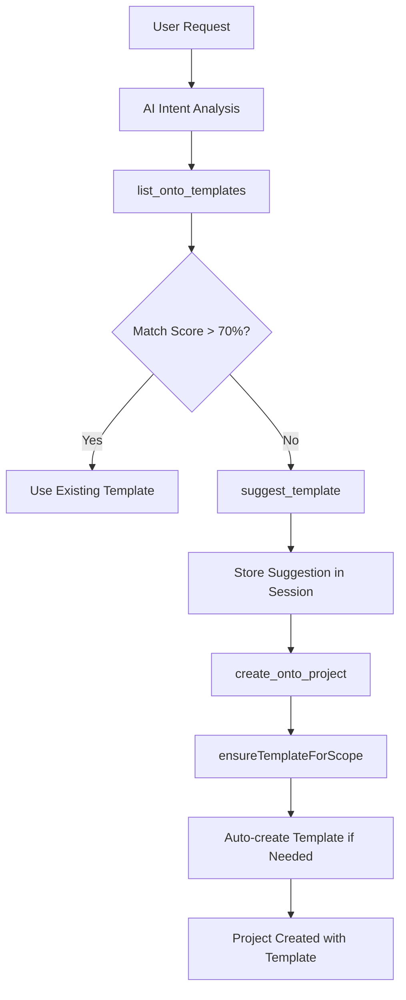

# Dynamic Template System Implementation Summary

## Date: November 20, 2024

## Overview
Successfully implemented a dynamic template suggestion and creation system for the agentic chat flow. The AI agent can now intelligently suggest custom templates based on user requirements and automatically create them during project instantiation.

## What Was Implemented

### 1. Enhanced Template Creation Prompt ✅
- **File**: `/src/lib/services/agentic-chat/prompts/project-creation-enhanced.ts`
- Created comprehensive prompts for dynamic template intelligence
- Added template inference system prompt with domain-specific patterns
- Included examples and quality checks

### 2. Template Suggestion Tool ✅
- **File**: `/src/lib/services/agentic-chat/tools/core/tool-definitions.ts`
- Added `suggest_template` tool definition
- Supports custom template properties, workflow states, and benefits
- Enables AI to propose templates when no existing match scores >70%

### 3. Tool Executor Integration ✅
- **File**: `/src/lib/services/agentic-chat/tools/core/tool-executor.ts`
- Implemented `suggestTemplate` method
- Added session-based template suggestion storage
- Enhanced `ensureTemplateForScope` to use suggested templates
- Automatic template creation when projects use suggested type_keys

### 4. Tool Configuration Updates ✅
- **File**: `/src/lib/services/agentic-chat/tools/core/tools.config.ts`
- Added `suggest_template` to project_create context
- Also added to project context for flexibility
- Updated ALL_TOOL_NAMES list

### 5. Prompt Service Integration ✅
- **File**: `/src/lib/services/agentic-chat/prompts/prompt-generation-service.ts`
- Enhanced `getProjectCreationPrompt` with dynamic template capabilities
- Added deep intent analysis workflow
- Included template suggestion examples

### 6. UI Components ✅
- **File**: `/src/lib/components/agent/TemplateSuggestionCard.svelte`
- Created visual component for template suggestions
- Shows match scores, properties, workflow states, and benefits
- Responsive design with dark mode support

### 7. Activity Type Updates ✅
- **Files**:
  - `/src/lib/components/agent/agent-chat.types.ts`
  - `/src/lib/components/agent/ThinkingBlock.svelte`
- Added `template_suggestion` activity type
- Visual representation in thinking blocks

### 8. Documentation ✅
- **File**: `/docs/features/agentic-chat/DYNAMIC_TEMPLATE_SYSTEM.md`
- Comprehensive documentation of the system
- Architecture details, usage flow, and examples
- Testing and troubleshooting guides

## How It Works

### User Flow
1. User requests project creation with unique requirements
2. AI analyzes intent and searches existing templates
3. If no template scores >70% match, AI suggests a custom template
4. Template suggestion includes properties, workflow states, and rationale
5. When project is created, template is automatically instantiated
6. Template becomes available for future similar projects

### Technical Flow

## Key Features

1. **Semantic Matching**: Templates matched on meaning, not just keywords
2. **Dynamic Creation**: Templates created on-the-fly based on needs
3. **Template Inheritance**: New templates can inherit from existing ones
4. **Property Intelligence**: AI generates appropriate properties per domain
5. **Workflow Generation**: FSM states created based on project type
6. **Visual Feedback**: Clear UI indication of template suggestions

## Testing Recommendations

### Manual Testing
1. Create a project with unique requirements (e.g., "AI research on climate change")
2. Verify AI suggests appropriate custom template
3. Confirm template is created when project is instantiated
4. Check template is available for future use

### Unit Tests
Already have test files in place:
- `template-generator-enhanced.test.ts`
- `tool-executor-template.test.ts`
- `template-props-merger.service.test.ts`

## Known Limitations

1. Template suggestions stored in session memory (not persisted)
2. No UI for browsing/managing created templates yet
3. Template versioning not implemented
4. No template sharing between users

## Future Enhancements

1. **Template Library UI**: Browse and manage all templates
2. **Template Analytics**: Track usage and success rates
3. **Community Templates**: Share templates across organizations
4. **Smart Defaults**: Learn from usage patterns
5. **Template Versioning**: Track template evolution

## Files Modified

### Core Implementation
- `/src/lib/services/agentic-chat/tools/core/tool-definitions.ts`
- `/src/lib/services/agentic-chat/tools/core/tool-executor.ts`
- `/src/lib/services/agentic-chat/tools/core/tools.config.ts`
- `/src/lib/services/agentic-chat/prompts/prompt-generation-service.ts`

### New Files
- `/src/lib/services/agentic-chat/prompts/project-creation-enhanced.ts`
- `/src/lib/components/agent/TemplateSuggestionCard.svelte`
- `/docs/features/agentic-chat/DYNAMIC_TEMPLATE_SYSTEM.md`

### Updated Types
- `/src/lib/components/agent/agent-chat.types.ts`
- `/src/lib/components/agent/ThinkingBlock.svelte`

## Integration Points

The system integrates with:
1. **EnhancedTemplateGenerator**: For intelligent template creation
2. **Ontology System**: Templates stored in onto_templates table
3. **Project Creation Flow**: Seamless template application
4. **Chat Interface**: Visual feedback for template suggestions

## Success Metrics

When properly implemented, the system should:
- Reduce friction in project creation
- Enable creation of domain-specific projects without pre-configuration
- Build a growing library of reusable templates
- Improve user satisfaction with more tailored project structures

## Deployment Notes

No database migrations required - uses existing onto_templates table structure.
All changes are backward compatible with existing template system.