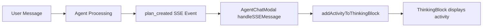

# Plan Display Enhancement Specification

## Overview

This document specifies how to enhance the display of agent-created plans in the BuildOS agentic chat interface, focusing on making plan details more visible and elegant in the thinking block UI when agents create complex multi-step plans.

## Problem Statement

Currently, when an agent creates a plan to execute a complex task:
1. The plan is only shown as a simple activity entry: "Plan created with X steps"
2. Plan steps are displayed in a basic list without visual hierarchy
3. Rich metadata (tools, dependencies, progress) is not visible
4. There's no real-time progress tracking as steps execute

## Current Implementation Analysis

### Data Flow



### Current Display

```typescript
// AgentChatModal.svelte - lines 1118-1132
case 'plan_created':
  currentPlan = event.plan;
  currentActivity = `Executing plan with ${event.plan?.steps?.length || 0} steps...`;
  agentState = 'executing_plan';
  addActivityToThinkingBlock(
    `Plan created with ${event.plan?.steps?.length || 0} steps`,
    'plan_created',
    {
      plan: event.plan,
      stepCount: event.plan?.steps?.length || 0
    }
  );
  break;
```

### ThinkingBlock Current Rendering

```svelte
<!-- ThinkingBlock.svelte - lines 216-234 -->
{#if planSteps && planSteps.length > 0}
  <div class="ml-4 mt-0.5 space-y-0.5 text-slate-600 dark:text-slate-400">
    {#each planSteps as step, i}
      <div class="flex gap-1.5 text-[10px] leading-tight">
        <span class="w-4 shrink-0 text-right text-slate-500">{i + 1}.</span>
        <span class="min-w-0 flex-1">{step.description || 'Unnamed step'}</span>
      </div>
    {/each}
  </div>
{/if}
```

## Enhanced Plan Display Design

### 1. Rich Plan Visualization Component

Create a dedicated `PlanVisualization.svelte` component with:

#### Visual Elements
- **Plan Header**: Title, progress bar, metadata pills
- **Step Timeline**: Visual flow with dependencies
- **Live Status**: Real-time updates as steps execute
- **Tool Indicators**: Icons showing required tools
- **Error States**: Clear failure visualization

#### Component Structure

```svelte
<!-- PlanVisualization.svelte -->
<script lang="ts">
  import type { AgentPlan, AgentPlanStep } from '@buildos/shared-types';
  import {
    CheckCircle2, Circle, Clock, AlertCircle,
    Wrench, GitBranch, Zap, ChevronDown
  } from 'lucide-svelte';

  interface Props {
    plan: AgentPlan;
    currentStep?: number;
    isCollapsed?: boolean;
    onToggle?: () => void;
  }

  let { plan, currentStep, isCollapsed = false, onToggle }: Props = $props();

  // Calculate progress
  const completedSteps = $derived(
    plan.steps.filter(s => s.status === 'completed').length
  );
  const progressPercent = $derived(
    (completedSteps / plan.steps.length) * 100
  );

  // Extract unique tools
  const uniqueTools = $derived(
    [...new Set(plan.steps.flatMap(s => s.tools || []))]
  );

  // Check for dependencies
  const hasDependencies = $derived(
    plan.steps.some(s => s.dependsOn && s.dependsOn.length > 0)
  );

  function getStepIcon(step: AgentPlanStep) {
    switch (step.status) {
      case 'completed': return CheckCircle2;
      case 'executing': return Clock;
      case 'failed': return AlertCircle;
      default: return Circle;
    }
  }

  function getStepColor(status: string) {
    switch (status) {
      case 'completed': return 'text-green-500';
      case 'executing': return 'text-blue-500';
      case 'failed': return 'text-red-500';
      default: return 'text-gray-400';
    }
  }
</script>

<div class="plan-visualization">
  <!-- Collapsible Header -->
  <button
    onclick={onToggle}
    class="plan-header"
    aria-expanded={!isCollapsed}
  >
    <div class="flex items-center gap-2">
      <ChevronDown
        class="h-4 w-4 transition-transform {isCollapsed ? '-rotate-90' : ''}"
      />
      <span class="plan-icon">📋</span>
      <span class="font-semibold">Execution Plan</span>
      <span class="text-xs text-gray-500">
        {completedSteps}/{plan.steps.length} steps
      </span>
    </div>

    <!-- Progress Bar -->
    <div class="plan-progress">
      <div class="progress-track">
        <div
          class="progress-fill"
          style="width: {progressPercent}%"
        ></div>
      </div>
    </div>

    <!-- Metadata Pills -->
    <div class="plan-metadata">
      {#if plan.metadata?.estimatedDuration}
        <span class="meta-pill">
          <Clock class="h-3 w-3" />
          ~{formatDuration(plan.metadata.estimatedDuration)}
        </span>
      {/if}

      {#if hasDependencies}
        <span class="meta-pill">
          <GitBranch class="h-3 w-3" />
          Dependencies
        </span>
      {/if}

      {#if uniqueTools.length > 0}
        <span class="meta-pill">
          <Wrench class="h-3 w-3" />
          {uniqueTools.length} tools
        </span>
      {/if}

      {#if plan.steps.some(s => s.executorRequired)}
        <span class="meta-pill">
          <Zap class="h-3 w-3" />
          Executors
        </span>
      {/if}
    </div>
  </button>

  <!-- Expandable Step Details -->
  {#if !isCollapsed}
    <div class="plan-steps">
      {#each plan.steps as step, i}
        {@const Icon = getStepIcon(step)}
        {@const isActive = currentStep === step.stepNumber}

        <div
          class="step-item"
          class:active={isActive}
          class:completed={step.status === 'completed'}
        >
          <!-- Step Connector Line -->
          {#if i > 0}
            <div class="step-connector">
              {#if step.dependsOn?.includes(plan.steps[i-1].stepNumber)}
                <div class="connector-line dependency"></div>
              {:else}
                <div class="connector-line"></div>
              {/if}
            </div>
          {/if}

          <!-- Step Content -->
          <div class="step-content">
            <div class="step-header">
              <Icon class="h-4 w-4 {getStepColor(step.status)}" />
              <span class="step-number">Step {step.stepNumber}</span>
              <span class="step-type">{step.type}</span>
            </div>

            <div class="step-description">
              {step.description}
            </div>

            <!-- Tools Required -->
            {#if step.tools && step.tools.length > 0}
              <div class="step-tools">
                {#each step.tools as tool}
                  <span class="tool-badge" title={tool}>
                    {formatToolName(tool)}
                  </span>
                {/each}
              </div>
            {/if}

            <!-- Dependencies -->
            {#if step.dependsOn && step.dependsOn.length > 0}
              <div class="step-deps">
                Depends on: {step.dependsOn.map(d => `Step ${d}`).join(', ')}
              </div>
            {/if}

            <!-- Error Display -->
            {#if step.error}
              <div class="step-error">
                <AlertCircle class="h-3 w-3" />
                {step.error}
              </div>
            {/if}

            <!-- Result Preview (if completed) -->
            {#if step.result && step.status === 'completed'}
              <div class="step-result">
                ✓ {formatResult(step.result)}
              </div>
            {/if}
          </div>
        </div>
      {/each}
    </div>
  {/if}
</div>
```

### 2. Enhanced Activity Entry in ThinkingBlock

Modify ThinkingBlock to use the new component:

```svelte
<!-- In ThinkingBlock.svelte -->
{#each block.activities as activity (activity.id)}
  {#if activity.activityType === 'plan_created' && activity.metadata?.plan}
    <!-- Use dedicated plan visualization -->
    <PlanVisualization
      plan={activity.metadata.plan}
      currentStep={activity.metadata.currentStep}
      isCollapsed={planCollapseStates.get(activity.id) ?? false}
      onToggle={() => togglePlanCollapse(activity.id)}
    />
  {:else}
    <!-- Existing activity display -->
    <div class="flex items-start gap-1.5">
      <!-- ... existing activity rendering ... -->
    </div>
  {/if}
{/each}
```

### 3. Real-time Progress Updates

#### Update Handlers in AgentChatModal

```typescript
// Track plan execution state
let activePlans = $state<Map<string, PlanExecutionState>>(new Map());

interface PlanExecutionState {
  planId: string;
  currentStep: number;
  stepStatuses: Record<number, string>;
  startTime: Date;
}

// Enhanced SSE handlers
case 'step_start':
  updatePlanStep(currentPlan?.id, event.step?.stepNumber, 'executing');
  addActivityToThinkingBlock(
    `Executing: ${event.step?.description}`,
    'step_start',
    { step: event.step, planId: currentPlan?.id }
  );
  break;

case 'step_complete':
  updatePlanStep(currentPlan?.id, event.step?.stepNumber, 'completed');
  addActivityToThinkingBlock(
    `Completed: ${event.step?.description}`,
    'step_complete',
    { step: event.step, planId: currentPlan?.id, result: event.step?.result }
  );
  break;

case 'executor_spawned':
  addActivityToThinkingBlock(
    `Executor started for: ${event.task?.description}`,
    'executor_spawned',
    {
      executorId: event.executorId,
      task: event.task,
      planId: currentPlan?.id
    }
  );
  break;

// Update plan visualization in real-time
function updatePlanStep(planId: string, stepNumber: number, status: string) {
  if (!planId) return;

  // Update plan execution state
  const state = activePlans.get(planId) || {
    planId,
    currentStep: stepNumber,
    stepStatuses: {},
    startTime: new Date()
  };

  state.currentStep = stepNumber;
  state.stepStatuses[stepNumber] = status;
  activePlans.set(planId, state);

  // Update thinking block activity
  updateThinkingBlockActivity(currentThinkingBlockId, (activity) => {
    if (activity.activityType === 'plan_created' &&
        activity.metadata?.plan?.id === planId) {
      // Update plan steps with new status
      const updatedPlan = {
        ...activity.metadata.plan,
        steps: activity.metadata.plan.steps.map(step =>
          step.stepNumber === stepNumber
            ? { ...step, status }
            : step
        )
      };

      return {
        ...activity,
        metadata: {
          ...activity.metadata,
          plan: updatedPlan,
          currentStep: stepNumber
        }
      };
    }
    return activity;
  });
}
```

### 4. Styling & Visual Polish

```css
/* Plan Visualization Styles */
.plan-visualization {
  @apply rounded-lg border border-purple-200 bg-gradient-to-br from-purple-50 to-blue-50
         p-3 shadow-sm dark:border-purple-800 dark:from-purple-950/30 dark:to-blue-950/30;
}

.plan-header {
  @apply w-full space-y-2 text-left;
}

.plan-progress {
  @apply mt-2;
}

.progress-track {
  @apply h-2 w-full overflow-hidden rounded-full bg-gray-200 dark:bg-gray-700;
}

.progress-fill {
  @apply h-full bg-gradient-to-r from-purple-500 to-blue-500
         transition-all duration-500 ease-out;
  animation: shimmer 2s ease-in-out infinite;
}

@keyframes shimmer {
  0%, 100% { opacity: 1; }
  50% { opacity: 0.8; }
}

.plan-metadata {
  @apply flex flex-wrap gap-1.5 mt-2;
}

.meta-pill {
  @apply inline-flex items-center gap-1 rounded-full bg-white/80 px-2 py-0.5
         text-[10px] font-medium text-purple-700 shadow-sm
         dark:bg-purple-900/50 dark:text-purple-300;
}

.plan-steps {
  @apply mt-3 space-y-3;
}

.step-item {
  @apply relative pl-6 transition-all duration-300;
}

.step-item.active {
  @apply scale-[1.02] bg-blue-50/50 -mx-2 px-8 py-2 rounded-md
         dark:bg-blue-950/30;
}

.step-item.completed {
  @apply opacity-75;
}

.step-connector {
  @apply absolute left-2 top-0 bottom-0;
}

.connector-line {
  @apply absolute left-1/2 top-0 h-full w-0.5 -translate-x-1/2
         bg-gradient-to-b from-purple-300 to-blue-300
         dark:from-purple-700 dark:to-blue-700;
}

.connector-line.dependency {
  @apply w-1 bg-gradient-to-b from-orange-400 to-purple-400
         dark:from-orange-600 dark:to-purple-600;
}

.step-content {
  @apply space-y-1.5 rounded-md bg-white/60 p-2 text-xs
         shadow-sm dark:bg-slate-900/60;
}

.step-header {
  @apply flex items-center gap-2;
}

.step-number {
  @apply font-semibold text-purple-900 dark:text-purple-100;
}

.step-type {
  @apply rounded bg-purple-100 px-1.5 py-0.5 text-[10px] font-mono
         text-purple-700 dark:bg-purple-900/50 dark:text-purple-300;
}

.step-description {
  @apply text-slate-700 leading-relaxed dark:text-slate-300;
}

.step-tools {
  @apply flex flex-wrap gap-1 mt-1;
}

.tool-badge {
  @apply inline-block rounded-full bg-blue-100 px-2 py-0.5 text-[10px]
         font-mono text-blue-700 dark:bg-blue-900/50 dark:text-blue-300;
}

.step-deps {
  @apply text-[10px] italic text-orange-600 dark:text-orange-400;
}

.step-error {
  @apply mt-1 flex items-start gap-1 rounded bg-red-100 p-1.5
         text-[10px] text-red-700 dark:bg-red-900/30 dark:text-red-300;
}

.step-result {
  @apply mt-1 rounded bg-green-100 p-1 text-[10px] text-green-700
         dark:bg-green-900/30 dark:text-green-300;
}

/* Animation for active step */
.step-item.active .step-content {
  animation: pulse-border 2s ease-in-out infinite;
}

@keyframes pulse-border {
  0%, 100% {
    box-shadow: 0 0 0 0 rgba(59, 130, 246, 0.5);
  }
  50% {
    box-shadow: 0 0 0 4px rgba(59, 130, 246, 0.2);
  }
}
```

### 5. Helper Functions

```typescript
// Format tool names for display
function formatToolName(tool: string): string {
  const toolNameMap: Record<string, string> = {
    'create_onto_task': '📝 Create',
    'update_onto_task': '✏️ Update',
    'search_tasks': '🔍 Search',
    'schedule_task': '📅 Schedule',
    'get_calendar_events': '📆 Calendar',
    // ... more mappings
  };
  return toolNameMap[tool] || tool.replace(/_/g, ' ');
}

// Format duration for display
function formatDuration(ms: number): string {
  const seconds = Math.floor(ms / 1000);
  const minutes = Math.floor(seconds / 60);
  const hours = Math.floor(minutes / 60);

  if (hours > 0) return `${hours}h ${minutes % 60}m`;
  if (minutes > 0) return `${minutes}m`;
  return `${seconds}s`;
}

// Format step result for preview
function formatResult(result: any): string {
  if (typeof result === 'string') return result;
  if (result.message) return result.message;
  if (result.success !== undefined) {
    return result.success ? 'Success' : 'Failed';
  }
  return 'Completed';
}
```

## Implementation Checklist

### Phase 1: Core Visualization Component ⏳
- [ ] Create `PlanVisualization.svelte` component
- [ ] Implement collapsible header with metadata
- [ ] Add progress bar calculation
- [ ] Create step timeline display
- [ ] Add tool and dependency indicators

### Phase 2: Integration ⏳
- [ ] Import component in `ThinkingBlock.svelte`
- [ ] Add conditional rendering for plan activities
- [ ] Implement collapse state management
- [ ] Wire up to existing plan data

### Phase 3: Real-time Updates ⏳
- [ ] Add plan execution state tracking
- [ ] Implement step status updates
- [ ] Create update handlers for SSE events
- [ ] Add live progress animation

### Phase 4: Visual Polish ⏳
- [ ] Implement gradient backgrounds
- [ ] Add smooth animations
- [ ] Create pulse effect for active steps
- [ ] Add shimmer effect to progress bar
- [ ] Ensure dark mode compatibility

### Phase 5: Testing & Refinement ⏳
- [ ] Test with various plan sizes
- [ ] Verify dependency visualization
- [ ] Test real-time updates
- [ ] Ensure mobile responsiveness
- [ ] Add accessibility attributes

## Success Metrics

1. **Clarity**: Users can immediately understand plan structure
2. **Progress Visibility**: Real-time progress is obvious
3. **Information Density**: All metadata visible without clutter
4. **Performance**: Smooth animations without lag
5. **Accessibility**: Screen reader compatible

## Technical Considerations

### Performance
- Use CSS animations instead of JS where possible
- Batch DOM updates for smooth rendering
- Lazy-render collapsed content
- Use `$derived` for computed values

### Accessibility
- Proper ARIA labels for progress
- Keyboard navigation support
- Screen reader announcements for updates
- Sufficient color contrast

### Error Handling
- Graceful fallback for missing data
- Clear error state visualization
- Retry mechanisms for failed steps

## Testing Scenarios

1. **Basic Plans**
   - 2-3 step simple plans
   - Verify all elements render

2. **Complex Plans**
   - 10+ steps with dependencies
   - Multiple tool requirements
   - Nested executor tasks

3. **Real-time Updates**
   - Step status changes
   - Progress bar updates
   - Error handling

4. **Responsive Design**
   - Mobile viewport
   - Tablet viewport
   - Dark mode

## Related Files

| File | Purpose |
|------|---------|
| `AgentChatModal.svelte` | Main chat component (lines 1118-1152) |
| `ThinkingBlock.svelte` | Activity display (lines 216-234) |
| `agent-chat.types.ts` | Type definitions |
| `agent.types.ts` | Plan structure types |

## Progress Log

### 2025-11-20: Specification Complete
- ✅ Analyzed current implementation
- ✅ Designed enhanced visualization component
- ✅ Created detailed styling specifications
- ✅ Defined real-time update mechanisms
- ✅ Created implementation checklist

### Next Steps
1. Create `PlanVisualization.svelte` component
2. Integrate with ThinkingBlock
3. Implement real-time updates
4. Add animations and polish
5. Test end-to-end flow

---

**Status**: Ready for Implementation 🚀