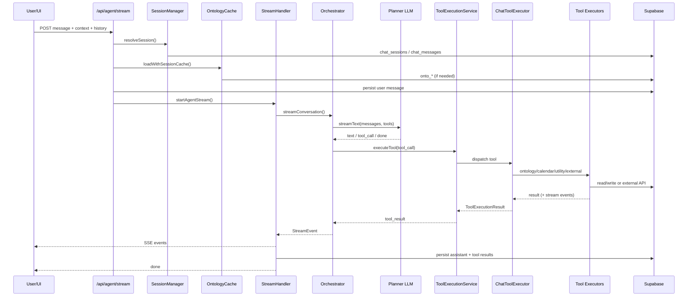

<!-- apps/web/docs/features/agentic-chat/README.md -->

# Agentic Chat Flow (Canonical)

> **Last updated:** 2026-01-30
> **Scope:** End-to-end Agentic Chat flow (UI -> API -> orchestration -> tools -> persistence)
> **Replaces:** All prior Agentic Chat flow docs in this folder and legacy audits.

This document is the single source of truth for the Agentic Chat flow. It traces:

- API calls and streaming behavior
- SSE event admission + client handling
- Context types and how they shape prompts/tools
- Planner vs executor interactions
- Tool execution and external/internal APIs
- Data models and persistence
- Known gaps and improvement opportunities

---

## 1. Entry Points (Code Map)

| Layer         | Primary Entry                                                                     | Purpose                                  |
| ------------- | --------------------------------------------------------------------------------- | ---------------------------------------- |
| UI            | `apps/web/src/lib/components/agent/AgentChatModal.svelte`                         | Chat UI + SSE handling                   |
| API           | `apps/web/src/routes/api/agent/stream/+server.ts`                                 | SSE stream endpoint                      |
| Orchestration | `apps/web/src/lib/services/agentic-chat/orchestration/agent-chat-orchestrator.ts` | Planner loop + tool + plan orchestration |
| Tooling       | `apps/web/src/lib/services/agentic-chat/tools/core/tool-executor-refactored.ts`   | Tool dispatch to executors               |
| Persistence   | `apps/web/src/lib/services/agentic-chat/persistence/agent-persistence-service.ts` | Agent/plan/session persistence           |

Supporting services:

- Context assembly: `apps/web/src/lib/services/agent-context-service.ts`
- Session management: `apps/web/src/routes/api/agent/stream/services/session-manager.ts`
- SSE lifecycle: `apps/web/src/routes/api/agent/stream/services/stream-handler.ts`
- Tool execution: `apps/web/src/lib/services/agentic-chat/execution/tool-execution-service.ts`
- Plan execution: `apps/web/src/lib/services/agentic-chat/planning/plan-orchestrator.ts`
- Executor runtime: `apps/web/src/lib/services/agent-executor-service.ts`

---

## 2. API Calls (Client -> Server)

### 2.1 Primary endpoints

| Method | Endpoint                          | Who calls         | Purpose                                    |
| ------ | --------------------------------- | ----------------- | ------------------------------------------ |
| POST   | `/api/agent/stream`               | UI                | Starts SSE stream for a chat turn          |
| GET    | `/api/agent/stream`               | UI                | Lists or fetches sessions                  |
| POST   | `/api/agent/prewarm`              | UI                | Prewarm context caches for focus selection |
| POST   | `/api/agentic-chat/agent-message` | UI / agent bridge | Agent-to-agent "message suggestion"        |

### 2.2 Tool-driven internal endpoints

Tools call these internal APIs (via `BaseExecutor.apiRequest()`):

- `/api/onto/projects/instantiate`
- `/api/onto/tasks/create`
- `/api/onto/goals/create`
- `/api/onto/plans/create`
- `/api/onto/documents/create`
- `/api/onto/edges/link`, `/api/onto/edges/unlink`
- `/api/onto/projects/reorganize` (graph reorg)
- `/api/onto/...` update / delete routes

These requests include `Authorization` and `X-Change-Source: chat` headers. See `apps/web/src/lib/services/agentic-chat/tools/core/executors/base-executor.ts`.

### 2.3 External APIs

| Tool           | Provider                                       | File                                                                               |
| -------------- | ---------------------------------------------- | ---------------------------------------------------------------------------------- |
| `web_search`   | Tavily                                         | `apps/web/src/lib/services/agentic-chat/tools/websearch/`                          |
| `web_visit`    | Direct HTTP + optional LLM markdown conversion | `apps/web/src/lib/services/agentic-chat/tools/webvisit/`                           |
| Calendar tools | Google Calendar API                            | `apps/web/src/lib/services/agentic-chat/tools/core/executors/calendar-executor.ts` |

---

## 3. End-to-End Flow (UI -> Stream -> Orchestrator)

### 3.1 Optional: Prewarm

When the chat opens or focus changes, UI calls `/api/agent/prewarm`:

1. Resolves or creates a `chat_sessions` record (if no session)
2. Loads lightweight location + linked-entity context
3. Stores caches in `chat_sessions.agent_metadata` (`locationContextCache`, `linkedEntitiesCache`)

### 3.2 Chat turn (POST /api/agent/stream)

High-level sequence:

```
UI (AgentChatModal)
  -> POST /api/agent/stream
    -> SessionManager.resolveSession()
    -> OntologyCacheService.loadWithSessionCache()
    -> MessagePersister.persistUserMessage()
    -> StreamHandler.startAgentStream()
      -> AgentChatOrchestrator.streamConversation()
        -> AgentContextService.buildPlannerContext()
        -> ToolSelectionService.selectTools()
        -> EnhancedLLMWrapper.streamText()
           -> tool calls -> ToolExecutionService -> ChatToolExecutor -> Executors
        -> optional agent_create_plan -> PlanOrchestrator -> ExecutorCoordinator -> AgentExecutorService
      -> StreamHandler persists assistant + tool results
```

### 3.2.1 Sequence diagram (Mermaid)



### 3.3 StreamHandler responsibilities

`apps/web/src/routes/api/agent/stream/services/stream-handler.ts`

- Sends initial `context_usage` snapshot (fast estimate)
- Builds/refreshes `LastTurnContext`
- Runs orchestrator and maps events to SSE
- Guarantees event ordering: `error` (if any) then `done`
- Persists assistant message + tool results at end

---

## 4. SSE Event Contract (What the Client Receives)

Events emitted by the orchestrator (and stream layer) are mapped to SSE via:
`apps/web/src/routes/api/agent/stream/utils/event-mapper.ts`.

### 4.1 Primary SSE event types

| Event                                  | Source                       | When emitted                                        |
| -------------------------------------- | ---------------------------- | --------------------------------------------------- |
| `session`                              | StreamHandler                | Session resolved / created                          |
| `context_usage`                        | StreamHandler + Orchestrator | Quick estimate + compression-aware usage            |
| `focus_active`                         | StreamHandler                | Focus resolved for session                          |
| `last_turn_context`                    | Orchestrator + StreamHandler | Initial context + refreshed on completion           |
| `agent_state`                          | Orchestrator                 | `thinking` -> `executing_plan` -> `waiting_on_user` |
| `text`                                 | Planner loop                 | Streaming assistant text                            |
| `tool_call`                            | Planner / Plan step          | LLM requested tool execution                        |
| `tool_result`                          | ToolExecutionService         | Tool result (may include context shift)             |
| `operation`                            | StreamHandler / Orchestrator | Human-readable tool activity (no raw IDs)           |
| `plan_created`                         | Plan tool                    | Planner created a plan                              |
| `plan_ready_for_review`                | Plan tool                    | Drafted plan awaiting review                        |
| `plan_review`                          | Plan tool                    | Reviewer verdict                                    |
| `step_start` / `step_complete`         | Plan executor                | Plan step lifecycle                                 |
| `executor_spawned` / `executor_result` | Executor coordinator         | Executor runs                                       |
| `context_shift`                        | StreamHandler                | Tool-triggered context change                       |
| `clarifying_questions`                 | Project creation analyzer    | When clarification is required                      |
| `error`                                | StreamHandler / Orchestrator | Error occurred                                      |
| `done`                                 | StreamHandler / Orchestrator | Always sent at end                                  |

#### Operation Event Schema

When the agent performs list/search/read/create/update/delete actions, emit an
`operation` event with human-readable names:

```
{
  action: "list" | "search" | "read" | "create" | "update" | "delete",
  entity_type: "document" | "task" | "goal" | "plan" | "project" | "milestone" | "risk" | "requirement",
  entity_name: string,
  status: "start" | "success" | "error",
  entity_id?: string
}
```

If the name is unknown, resolve minimal metadata (title/name) before emitting.

### 4.2 SSE ordering guarantee

The stream guarantees:

1. `error` is sent before `done` if any error occurs.
2. `done` is always sent (success or failure).
3. Stream is always closed in `finally`.

---

## 5. Context Types and Focus

### 5.1 ChatContextType values

Defined in `packages/shared-types/src/chat.types.ts`:

```
'global'
'project'
'calendar'
'general'
'project_create'
'project_audit'
'project_forecast'
'daily_brief_update'
'ontology'
'brain_dump'
```

Notes:

- `general` is normalized to `global`.
- `project_*` contexts use project-specific prompts and tools.

### 5.2 Focus vs context

**Context type** selects the mode (prompt + tools). **Project focus** adds a target project/entity.

Focus is stored in `chat_sessions.agent_metadata.focus` and includes:

- `projectId`, `projectName`
- Optional `focusType` (entity type) + `focusEntityId`

### 5.3 LastTurnContext

`LastTurnContext` provides continuity across turns, derived from:

- Recent messages
- Tool calls and tool results
- Context shifts

Generated by `generateLastTurnContext()` in:
`apps/web/src/routes/api/agent/stream/utils/context-utils.ts`.

---

## 6. Planner <-> Executor Interactions

### 6.1 Planner loop

Planner execution is streamed via `AgentChatOrchestrator.runPlannerLoop()`:

- Builds planner messages (system + context snapshot + history + user message)
- Streams text from the LLM
- Executes tool calls in sequence
- Updates context on context shift
- Emits `agent_state`, `text`, `tool_call`, `tool_result`, `done`

### 6.2 Plan tool (`agent_create_plan`)

Planner can call `agent_create_plan` (virtual tool):

- Creates `agent_plans` record
- Emits `plan_created`
- Executes plan automatically OR returns draft for review

Execution modes:

- `auto_execute` (default)
- `draft_only` (return plan to user)
- `agent_review` (reviewer LLM gate)

### 6.3 Executor runtime

When a plan step requires an executor:

1. `ExecutorCoordinator.spawnExecutor()`
2. `AgentExecutorService.executeTask()` runs a focused LLM loop
3. Results are persisted in `agent_chat_sessions`, `agent_chat_messages`, `agent_executions`
4. Orchestrator receives `executor_result` and continues plan execution

<a name="project-creation-flow"></a>

### 6.4 Project creation flow (project_create context)

The `project_create` context is a guided flow that emphasizes structure and completeness:

1. **Clarification gate**: `ProjectCreationAnalyzer` may emit `clarifying_questions` before planning proceeds.
2. **Plan/tool decision**: Planner decides whether to call `agent_create_plan` or to execute tools directly.
3. **Project instantiation**: `create_onto_project` is expected to create the project plus its related entities and relationships (including `context_document` when available).
4. **Context shift**: `create_onto_project` returns a `context_shift` to the new project, which the stream layer persists and sends to the client.

See the tool-to-API mapping doc for the detailed API payloads and relationship expectations:
`apps/web/docs/features/agentic-chat/TOOL_API_MAPPING.md`.

---

## 7. Tool System (Selection + Execution)

### 7.1 Tool selection

Tool selection is performed by `ToolSelectionService` and `StrategyAnalyzer`:

- Default tools are chosen from `tools.config.ts` based on context
- Planner may call tools outside the selection; system expands tool pool on miss

### 7.2 Tool execution pipeline

```
LLM tool_call
  -> ToolExecutionService
    -> ChatToolExecutor
      -> Domain executor (ontology/calendar/utility/external)
      -> Tool result + optional stream events
```

Tool execution is logged in `chat_tool_executions`.

### 7.3 Tool categories and underlying APIs

| Category       | Tools                                                               | Execution path          | Primary data/API                    |
| -------------- | ------------------------------------------------------------------- | ----------------------- | ----------------------------------- |
| Ontology read  | `list_onto_*`, `search_*`, `get_*`                                  | `OntologyReadExecutor`  | Supabase `onto_*` tables            |
| Ontology write | `create_onto_*`, `update_onto_*`, `delete_onto_*`                   | `OntologyWriteExecutor` | Internal `/api/onto/*` endpoints    |
| Utility        | `get_field_info`, `get_entity_relationships`, `get_linked_entities` | `UtilityExecutor`       | Supabase + OntologyContextLoader    |
| Calendar       | `list_calendar_events`, `create_calendar_event`, etc                | `CalendarExecutor`      | Google Calendar API + `onto_events` |
| External       | `web_search`, `web_visit`, `get_buildos_overview`                   | `ExternalExecutor`      | Tavily + HTTP fetch + LLM           |

### 7.4 Tool-to-API mappings (detailed)

For a full mapping of each tool to its API endpoints, data tables, and context-shift behavior, see:
`apps/web/docs/features/agentic-chat/TOOL_API_MAPPING.md`.

---

## 8. Data Models (Persistence)

Key tables used by the flow:

| Table                                                                            | Purpose                                                        |
| -------------------------------------------------------------------------------- | -------------------------------------------------------------- |
| `chat_sessions`                                                                  | User conversation sessions (context type, entity id, metadata) |
| `chat_messages`                                                                  | User/assistant/tool messages for chat sessions                 |
| `chat_tool_executions`                                                           | Tool usage logs for chat sessions                              |
| `chat_compressions`                                                              | Compressed history snapshots                                   |
| `chat_context_cache`                                                             | Cached context snippets                                        |
| `agents`                                                                         | Planner + executor agent records                               |
| `agent_plans`                                                                    | Multi-step plans from planner                                  |
| `agent_chat_sessions`                                                            | Planner/executor sub-sessions                                  |
| `agent_chat_messages`                                                            | Messages within agent sub-sessions                             |
| `agent_executions`                                                               | Executor run metadata and results                              |
| `onto_projects`, `onto_tasks`, `onto_goals`, `onto_plans`, `onto_documents`, ... | Ontology domain model                                          |
| `onto_edges`                                                                     | Entity relationship graph                                      |
| `onto_events`, `project_calendars`                                               | Calendar integration                                           |

---

## 9. Known Gaps, Bugs, and Opportunities

These are current issues observed directly in the codebase:

1. **Context type override can ignore user input**
    - `StreamHandler` uses session context when `session.entity_id` is set, even if the request provides a new `context_type`.
    - Impact: switching context in UI can be ignored during the same session.
    - File: `apps/web/src/routes/api/agent/stream/services/stream-handler.ts`

2. **`focus_changed` event is defined but never emitted**
    - UI handles `focus_changed`, but server only sends `focus_active`.
    - Opportunity: emit `focus_changed` when focus updates occur in `SessionManager.resolveProjectFocus()`.
    - File: `apps/web/src/routes/api/agent/stream/services/session-manager.ts`

3. **Telemetry/debug events are dropped on the floor (dev visibility gap)**
    - Orchestrator emits `telemetry` (`tool_selection`, `tool_selection_miss`, `tool_execution`) and `debug_context` (gated by `DEBUG_AGENT_CONTEXT` / `VITE_DEBUG_AGENT_CONTEXT`), but `event-mapper` does not map them to SSE and the UI has no handler.
    - **Plan (dev-only UI):**
        1. Extend `AgentSSEMessage` with `telemetry` + `debug_context` payloads in `packages/shared-types/src/agent.types.ts`.
        2. Add mappings in `apps/web/src/routes/api/agent/stream/utils/event-mapper.ts`.
        3. In `apps/web/src/lib/components/agent/AgentChatModal.svelte`, surface these events only when `dev === true` (e.g., append to the thinking block as `telemetry`/`debug` activities).
        4. Optional hard gate: only forward these events from the server in debug/dev modes.
    - Files: `agent-chat-orchestrator.ts`, `debug-context-builder.ts`, `event-mapper.ts`, `AgentChatModal.svelte`

4. **Tool call attribution can blur planner vs plan-step tools**
    - `StreamHandler` aggregates all `tool_call` events into one list and persists them on the assistant message.
    - Plan-step tool calls (emitted by `PlanOrchestrator`) may be attributed to the assistant turn, reducing audit clarity.
    - **Plan:**
        1. Add origin metadata to tool events (e.g., `source: 'planner' | 'plan_step'` + optional `stepNumber`).
        2. Track planner vs plan-step tool calls separately in `StreamHandler`.
        3. Persist planner tool calls on the assistant message; persist plan-step tool calls on executor records or in `chat_messages.metadata.tool_call_sources`.
        4. Update the UI to label plan-step tool activity inside the plan execution timeline.
    - Files: `plan-orchestrator.ts`, `agent-chat-orchestrator.ts`, `stream-handler.ts`, `AgentChatModal.svelte`

5. **Context cache invalidation is time-based only**
    - Prewarm caches are TTL-based; ontology changes during TTL can yield stale context.
    - Opportunity: invalidate on ontology mutations or attach `last_updated_at` signals.
    - Files: `agent/prewarm`, `AgentSessionMetadata` caches

---

## 10. Suggested Next Improvements (Non-breaking)

1. Emit `focus_changed` SSE event when focus metadata changes.
2. Map `telemetry` and `debug_context` to SSE and surface them in the UI when `dev === true`.
3. Add tool call origin metadata and persist plan-step tool calls separately from planner tool calls.
4. Add optional server-side cap on `conversation_history` length to protect throughput.
5. Add cache invalidation hooks for ontology writes (invalidate session caches on write tools).

---

## 11. Appendix: Key Files by Concern

- UI SSE handling: `apps/web/src/lib/components/agent/AgentChatModal.svelte`
- SSE stream handler: `apps/web/src/routes/api/agent/stream/services/stream-handler.ts`
- Orchestrator: `apps/web/src/lib/services/agentic-chat/orchestration/agent-chat-orchestrator.ts`
- Planner context: `apps/web/src/lib/services/agent-context-service.ts`
- Plan executor: `apps/web/src/lib/services/agentic-chat/planning/plan-orchestrator.ts`
- Tool executor: `apps/web/src/lib/services/agentic-chat/tools/core/tool-executor-refactored.ts`
- Executor service: `apps/web/src/lib/services/agent-executor-service.ts`
- Tool to API mapping: `apps/web/docs/features/agentic-chat/TOOL_API_MAPPING.md`
