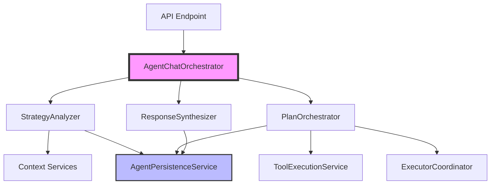

# Agentic Chat System - Architecture Refactoring Specification

<!-- todocheck -->

## Document Metadata

- **Version**: 1.0.0
- **Date**: 2025-11-05
- **Author**: Senior Engineering Team
- **Status**: Implementation Ready
- **Related Specs**:
    - [Original Integration Spec](../ontology/AGENT_CHAT_ONTOLOGY_INTEGRATION_SPEC.md)
    - [Phase 2-5 Implementation](../ontology/AGENT_CHAT_ONTOLOGY_INTEGRATION_SPEC_PHASES_2-5.md)

## Progress Log

- **2025-11-05**
    - Completed domain service extraction with unit tests across `apps/web/src/lib/services/agentic-chat/**`, covering persistence, analysis, planning, execution, synthesis, and orchestration layers.
    - Added dependency factory in `apps/web/src/lib/services/agentic-chat/index.ts` to compose the refactored stack with existing LLM, executor, and context services.
    - Integrated feature-flagged orchestration path in `apps/web/src/routes/api/agent/stream/+server.ts`, guarded by `ENABLE_NEW_AGENTIC_CHAT` to safely switch between legacy and refactored flows.
    - Expanded shared streaming contract in `apps/web/src/lib/services/agentic-chat/shared/types.ts` and wired handler updates in `apps/web/src/lib/components/agent/ChatInterface.svelte` and `apps/web/src/lib/components/agent/AgentChatModal.svelte` to surface plan and executor lifecycle events.

### Implementation Notes (2025-11-05)

- Integration tests remain outstanding for each service; backfill once Supabase harness and end-to-end fixtures are available.
- Coordinate rollout of `ENABLE_NEW_AGENTIC_CHAT` with DevOps; keep disabled by default until QA validates streaming parity and persistence behavior.
- Monitor front-end event handling for new executor lifecycle events to ensure analytics, transcripts, and UI states remain consistent before expanding rollout.

## Executive Summary

The current agent chat system has grown into a 2,263-line monolithic service (`agent-planner-service.ts`) that violates core architectural principles. This specification outlines a complete domain-based service separation refactor that will improve maintainability, testability, and scalability while preserving all existing functionality.

## Current State Analysis

### Architecture Problems

1. **Monolithic Service (2,263 lines)**
    - `agent-planner-service.ts` handles everything from strategy analysis to database operations
    - Violates Single Responsibility Principle
    - Difficult to test, maintain, and reason about

2. **Mixed Abstraction Levels**
    - High-level orchestration mixed with low-level database operations
    - Business logic intertwined with infrastructure concerns

3. **Dual Strategy Paths**
    - Legacy: `analyzeMessageComplexity` → `handleToolQuery` / `handleComplexQuery`
    - Enhanced: `analyzeUserIntent` → `executeStrategy` → research methods
    - Creates maintenance burden and potential inconsistencies

4. **Incomplete Streaming**
    - Enhanced flow doesn't properly stream events
    - Callbacks can't yield in async generators

### Current Flow

```mermaid
graph TD
    A[AgentChatModal.svelte] --> B[/api/agent/stream]
    B --> C[agent-planner-service.ts]
    C --> D[Strategy Analysis]
    C --> E[Plan Creation]
    C --> F[Tool Execution]
    C --> G[Executor Spawning]
    C --> H[Database Operations]
    C --> I[Response Generation]
```

## Target Architecture

### Service Decomposition



### Service Responsibilities

#### 1. **AgentChatOrchestrator** (Main Coordinator)

- **Purpose**: High-level flow control and service coordination
- **Responsibilities**:
    - Coordinate between all services
    - Manage streaming to client
    - Handle context initialization
    - Error boundary and recovery

#### 2. **StrategyAnalyzer** (Intent & Strategy)

- **Purpose**: Analyze user intent and select execution strategy
- **Responsibilities**:
    - Analyze message complexity
    - Select strategy (simple/complex/clarifying)
    - Estimate resource requirements
    - Generate strategy metadata

#### 3. **PlanOrchestrator** (Plan Management)

- **Purpose**: Create and execute multi-step plans
- **Responsibilities**:
    - Generate execution plans
    - Manage step dependencies
    - Coordinate parallel/sequential execution
    - Track plan progress

#### 4. **ToolExecutionService** (Tool Calls)

- **Purpose**: Execute individual tool calls
- **Responsibilities**:
    - Execute tool functions
    - Validate tool results
    - Extract entities from results
    - Handle tool errors

#### 5. **ExecutorCoordinator** (Agent Spawning)

- **Purpose**: Manage executor agents for complex tasks
- **Responsibilities**:
    - Spawn executor agents
    - Distribute tasks
    - Collect results
    - Handle executor failures

#### 6. **ResponseSynthesizer** (Response Generation)

- **Purpose**: Generate final user responses
- **Responsibilities**:
    - Synthesize results into coherent response
    - Format responses for streaming
    - Generate last turn context
    - Handle clarifying questions

#### 7. **AgentPersistenceService** (Database Layer)

- **Purpose**: All database operations
- **Responsibilities**:
    - Agent CRUD operations
    - Plan persistence
    - Message storage
    - Session management

## Implementation Plan

### Phase 1: Foundation Setup

#### 1.1 Create Folder Structure

```
apps/web/src/lib/services/agentic-chat/
├── orchestration/
│   ├── agent-chat-orchestrator.ts
│   ├── agent-chat-orchestrator.test.ts
│   └── types.ts
├── analysis/
│   ├── strategy-analyzer.ts
│   ├── strategy-analyzer.test.ts
│   └── types.ts
├── planning/
│   ├── plan-orchestrator.ts
│   ├── plan-orchestrator.test.ts
│   └── types.ts
├── execution/
│   ├── tool-execution-service.ts
│   ├── tool-execution-service.test.ts
│   ├── executor-coordinator.ts
│   ├── executor-coordinator.test.ts
│   └── types.ts
├── synthesis/
│   ├── response-synthesizer.ts
│   ├── response-synthesizer.test.ts
│   └── types.ts
├── persistence/
│   ├── agent-persistence-service.ts
│   ├── agent-persistence-service.test.ts
│   └── types.ts
├── shared/
│   ├── types.ts
│   ├── constants.ts
│   └── utils.ts
└── index.ts
```

#### 1.2 Shared Types Definition

```typescript
// shared/types.ts
export interface ServiceContext {
	sessionId: string;
	userId: string;
	contextType: ChatContextType;
	entityId?: string;
	ontologyContext?: OntologyContext;
	lastTurnContext?: LastTurnContext;
}

export interface ExecutionResult {
	success: boolean;
	data?: any;
	error?: Error;
	metadata?: Record<string, any>;
}
```

### Phase 2: Service Implementation Order

1. **AgentPersistenceService** (Week 1)
    - Easiest to extract
    - No dependencies on other new services
    - ~400 lines of code to move

2. **StrategyAnalyzer** (Week 1)
    - Clear boundaries
    - Independent logic
    - ~300 lines of code

3. **ToolExecutionService** (Week 2)
    - Well-defined responsibility
    - Reusable across strategies
    - ~250 lines of code

4. **ResponseSynthesizer** (Week 2)
    - Clear input/output
    - Stateless operations
    - ~200 lines of code

5. **PlanOrchestrator** (Week 3)
    - Depends on ToolExecutionService
    - Complex coordination logic
    - ~400 lines of code

6. **ExecutorCoordinator** (Week 3)
    - Depends on PlanOrchestrator
    - Parallel execution logic
    - ~300 lines of code

7. **AgentChatOrchestrator** (Week 4)
    - Ties everything together
    - Main flow control
    - ~250 lines of code

### Phase 3: Migration Strategy

#### 3.1 Parallel Development

- Keep existing `agent-planner-service.ts` unchanged
- Build new services in `/agentic-chat` folder
- Write comprehensive tests first
- Validate against existing behavior

#### 3.2 Feature Flag Controlled

```typescript
const USE_NEW_AGENTIC_CHAT = process.env.ENABLE_NEW_AGENTIC_CHAT === 'true';

export const POST: RequestHandler = async (request) => {
	if (USE_NEW_AGENTIC_CHAT) {
		return handleWithNewArchitecture(request);
	}
	return handleWithLegacyArchitecture(request);
};
```

#### 3.3 Gradual Rollout

1. Internal testing with feature flag
2. A/B testing with select users
3. Full rollout
4. Deprecate legacy code

## Testing Strategy

### Test Coverage Requirements

- Unit tests: 90% coverage minimum
- Integration tests: Full flow coverage
- Stream tests: SSE event validation
- Error tests: All failure scenarios

### Test Structure

```typescript
describe('ServiceName', () => {
	describe('Core Functionality', () => {
		it('should handle happy path', async () => {});
		it('should handle edge cases', async () => {});
	});

	describe('Error Handling', () => {
		it('should gracefully handle failures', async () => {});
		it('should propagate errors correctly', async () => {});
	});

	describe('Streaming', () => {
		it('should yield events in correct order', async () => {});
		it('should handle backpressure', async () => {});
	});
});
```

## API Contract Preservation

### SSE Event Structure (Must Maintain)

```typescript
type AgentSSEEvent =
	| { type: 'session'; session: ChatSession }
	| { type: 'ontology_loaded'; summary: string }
	| { type: 'last_turn_context'; context: LastTurnContext }
	| { type: 'strategy_selected'; strategy: string; confidence: number }
	| { type: 'clarifying_questions'; questions: string[] }
	| { type: 'analysis'; analysis: any }
	| { type: 'plan_created'; plan: any }
	| { type: 'text'; content: string }
	| { type: 'tool_call'; tool_call: any }
	| { type: 'tool_result'; result: any }
	| { type: 'done' }
	| { type: 'error'; error: string };
```

## Performance Considerations

### Optimization Targets

- Response time: < 2s for simple queries
- Streaming latency: < 100ms between chunks
- Memory usage: < 100MB per request
- Token usage: < 10K per conversation turn

### Caching Strategy

```typescript
class ContextCache {
	private cache = new Map<string, CachedContext>();

	async get(key: string): Promise<CachedContext | null> {
		const cached = this.cache.get(key);
		if (cached && !this.isExpired(cached)) {
			return cached;
		}
		return null;
	}
}
```

## Error Handling

### Error Categories

1. **User Errors**: Invalid input, unauthorized access
2. **System Errors**: Database failures, service unavailable
3. **Integration Errors**: LLM failures, tool execution errors
4. **Business Logic Errors**: Invalid strategy, plan failures

### Error Recovery Strategy

```typescript
class ErrorRecovery {
	async withRetry<T>(
		operation: () => Promise<T>,
		maxRetries: number = 3,
		backoff: number = 1000
	): Promise<T> {
		for (let i = 0; i < maxRetries; i++) {
			try {
				return await operation();
			} catch (error) {
				if (i === maxRetries - 1) throw error;
				await this.delay(backoff * Math.pow(2, i));
			}
		}
		throw new Error('Max retries exceeded');
	}
}
```

## Monitoring & Observability

### Key Metrics

- Strategy selection distribution
- Average response time by strategy
- Tool execution success rate
- Error rate by category
- Token usage by operation

### Logging Standards

```typescript
logger.info('[ServiceName] Operation started', {
	sessionId,
	userId,
	operation: 'analyzeIntent',
	metadata: { contextType, messageLength }
});
```

## Migration Checklist

### Pre-Implementation

- [ ] Review and approve this specification
- [x] Set up feature flag infrastructure
- [x] Create folder structure
- [x] Define shared types

### Implementation

- [ ] Phase 1: AgentPersistenceService
    - [x] Write unit tests
    - [x] Implement service
    - [ ] Integration tests
- [ ] Phase 2: StrategyAnalyzer
    - [x] Write unit tests
    - [x] Implement service
    - [ ] Integration tests
- [ ] Phase 3: ToolExecutionService
    - [x] Write unit tests
    - [x] Implement service
    - [ ] Integration tests
- [ ] Phase 4: ResponseSynthesizer
    - [x] Write unit tests
    - [x] Implement service
    - [ ] Integration tests
- [ ] Phase 5: PlanOrchestrator
    - [x] Write unit tests
    - [x] Implement service
    - [ ] Integration tests
- [ ] Phase 6: ExecutorCoordinator
    - [x] Write unit tests
    - [x] Implement service
    - [ ] Integration tests
- [ ] Phase 7: AgentChatOrchestrator
    - [x] Write unit tests
    - [x] Implement service
    - [ ] Integration tests

### Post-Implementation

- [ ] Full integration testing
- [ ] Performance testing
- [ ] A/B testing setup
- [ ] Documentation update
- [ ] Team training

### Progress Log

- Added `ExecutorCoordinator` service with unit tests and wired it into the planning layer via `ExecutorSpawnParams` for richer executor task context.
- Extracted `AgentChatOrchestrator` to coordinate strategy analysis, planning, execution, and synthesis; introduced `createAgentChatOrchestrator` factory for dependency wiring and reuse.
- Updated `/api/agent/stream` endpoint to support a feature-flagged rollout (`ENABLE_NEW_AGENTIC_CHAT`) that streams through the new architecture while preserving the legacy planner as fallback.
- Normalized tool call arguments and persistence of tool results to handle both legacy and refactored payload shapes.
- Extended shared streaming event types to cover clarifying questions and strategy selection so the UI can remain compatible during rollout.

## Success Criteria

### Technical Metrics

- ✅ No service file > 500 lines
- ✅ Test coverage > 90%
- ✅ All existing functionality preserved
- ✅ Streaming properly implemented
- ✅ Response time improved or maintained

### Business Metrics

- ✅ No increase in error rates
- ✅ User satisfaction maintained
- ✅ Development velocity improved
- ✅ Maintenance burden reduced

## Risks & Mitigations

| Risk                            | Likelihood | Impact | Mitigation                               |
| ------------------------------- | ---------- | ------ | ---------------------------------------- |
| Breaking existing functionality | Medium     | High   | Comprehensive testing, feature flags     |
| Performance degradation         | Low        | Medium | Performance testing, monitoring          |
| Incomplete migration            | Low        | High   | Phased approach, clear checkpoints       |
| Team resistance                 | Low        | Low    | Documentation, training, gradual rollout |

## Appendix

### A. File Size Analysis

- Current: `agent-planner-service.ts` - 2,263 lines
- Target: 7 services × ~350 lines = ~2,450 lines total
- Net increase: ~200 lines (due to better organization)

### B. Dependency Graph

```
AgentChatOrchestrator
├── StrategyAnalyzer
├── PlanOrchestrator
│   ├── ToolExecutionService
│   └── ExecutorCoordinator
├── ResponseSynthesizer
└── AgentPersistenceService (used by all)
```

### C. Related Documentation

- [Original Ontology Integration Spec](../ontology/AGENT_CHAT_ONTOLOGY_INTEGRATION_SPEC.md)
- [BuildOS Style Guide](../../technical/components/BUILDOS_STYLE_GUIDE.md)
- [API Documentation](../../technical/api/README.md)

---

**Approved By**: \***\*\*\*\*\***\_\_\_\***\*\*\*\*\*** **Date**: \***\*\*\*\*\***\_\_\_\***\*\*\*\*\***

**Implementation Start Date**: \***\*\*\*\*\***\_\_\_\***\*\*\*\*\***

**Target Completion Date**: \***\*\*\*\*\***\_\_\_\***\*\*\*\*\***
