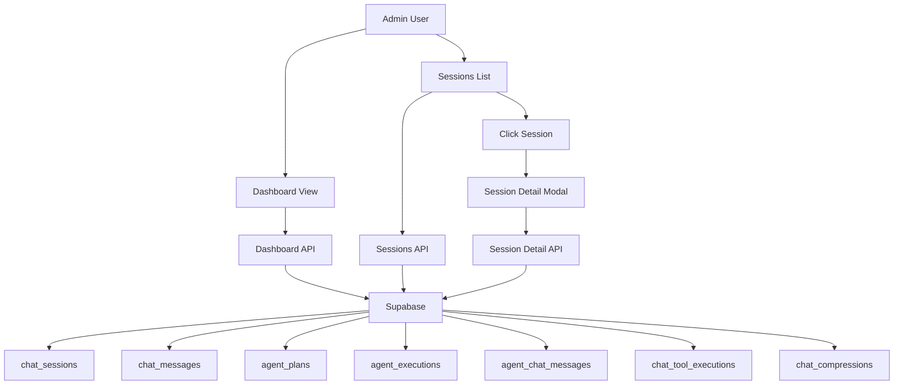

<!-- apps/web/docs/features/chat-system/ADMIN_MONITORING.md -->

# 📊 Admin Chat Monitoring System

## Overview

The Admin Chat Monitoring System provides comprehensive visibility into AI chat sessions, multi-agent conversations, tool executions, and system performance. Built for quick auditing and analysis, the system uses a modal-based UI that allows admins to rapidly review sessions without losing context.

**Implementation Date**: October 2024
**Status**: ✅ Complete and Production Ready

## 🎯 Key Features

- **Real-time Dashboard**: KPIs for sessions, tokens, agents, and costs
- **Session Management**: List, filter, search, and inspect all chat sessions
- **Agent Visibility**: View multi-agent plans and planner-executor conversations
- **Tool Monitoring**: Track all tool executions with success/failure rates
- **Cost Analytics**: Token usage tracking with cost estimates
- **Quick Audit Modal**: Pop-out modal for rapid session inspection
- **Export Functionality**: Export session data in JSON/CSV formats
- **Compression Tracking**: Monitor conversation compression effectiveness

## 🏗️ System Architecture

### Component Structure

```
Admin Monitoring System
├─ Dashboard (/admin/chat)
│  ├─ KPI Cards (8 metrics)
│  ├─ Activity Feed (real-time)
│  ├─ Strategy Distribution
│  └─ Top Users List
│
├─ Session List (/admin/chat/sessions)
│  ├─ Search & Filters
│  ├─ Paginated Session Cards
│  └─ Session Detail Modal
│
└─ API Endpoints
   ├─ /api/admin/chat/dashboard
   ├─ /api/admin/chat/sessions
   ├─ /api/admin/chat/sessions/[id]
   └─ /api/admin/chat/export
```

### Data Flow



## 📁 Implementation Files

### UI Components

```bash
/apps/web/src/routes/admin/chat/
├── +page.svelte                       # Dashboard with KPIs
└── sessions/
    └── +page.svelte                   # Session list with filters

/apps/web/src/lib/components/admin/
├── AdminPageHeader.svelte             # Shared header component
└── SessionDetailModal.svelte          # NEW: Modal for session details
```

### API Endpoints

```bash
/apps/web/src/routes/api/admin/chat/
├── dashboard/+server.ts               # Dashboard KPIs
├── export/+server.ts                  # Data export
├── sessions/+server.ts                # Session list
└── sessions/[id]/+server.ts           # Session detail
```

### Database Tables Used

```sql
-- Core tables
chat_sessions          -- Session metadata
chat_messages          -- Conversation messages
admin_users           -- Admin permission check

-- Multi-agent tables
agent_plans           -- Planner agent plans
agent_executions      -- Executor tasks
agent_chat_messages   -- Agent-to-agent conversations

-- Performance tables
chat_tool_executions  -- Tool call history
chat_compressions     -- Compression analytics
```

## 🚀 Quick Start

### Accessing the Admin Interface

1. Navigate to `/admin/chat` (requires admin permission)
2. View dashboard with real-time KPIs
3. Click "Chat Monitoring" or navigate to `/admin/chat/sessions`
4. Use filters to find specific sessions
5. Click any session card to open detail modal

### User Flow

```
Admin Dashboard → Chat Monitoring
                    ↓
              Sessions List
              (Search/Filter)
                    ↓
         Click Session Card
                    ↓
        Modal Opens with:
        - Session metrics
        - Agent plans
        - Executor conversations
        - Tool executions
        - Full conversation
                    ↓
        Close modal to return
        to list (preserves state)
```

## 📊 Dashboard Features

### KPI Cards (8 Metrics)

#### User Engagement

- **Total Sessions**: All sessions in timeframe
- **Active Sessions**: Currently active conversations
- **Total Messages**: Cumulative message count
- **Avg Messages/Session**: Engagement metric
- **Unique Users**: Distinct user count

#### Agent Performance

- **Total Agents**: Multi-agent instances created
- **Active Plans**: Plans currently executing
- **Agent Success Rate**: Completion vs. failure rate
- **Avg Plan Complexity**: Steps per plan

#### Cost & Usage

- **Total Tokens Used**: Combined chat + agent tokens
- **Estimated Cost**: Based on DeepSeek pricing ($0.21/1M tokens)
- **Avg Tokens/Session**: Cost per conversation
- **Token Trend**: % change from previous period

#### Quality Metrics

- **Compression Effectiveness**: Token savings from compression
- **Tool Success Rate**: Successful tool executions
- **Avg Response Time**: LLM response latency
- **Error Rate**: Sessions with errors

### Timeframe Filters

- **24 Hours**: Real-time monitoring
- **7 Days**: Weekly analysis (default)
- **30 Days**: Monthly trends

### Activity Feed

Real-time feed showing:

- Recent user messages
- Assistant responses
- Tool executions
- Token usage per interaction

### Strategy Distribution

Pie chart showing:

- **Direct**: Simple single-step tasks
- **Complex**: Multi-step coordinated plans

### Top Users

Ranked list by:

- Session count
- Message volume
- Token usage

## 🔍 Session List Features

### Search & Filters

#### Search

- User email
- Session ID
- Fuzzy matching

#### Filters

- **Status**: All, Active, Completed, Failed
- **Context Type**: Global, Project, Task, Calendar
- **Timeframe**: 24h, 7d, 30d

### Session Cards Display

Each card shows:

- **Title**: Auto-generated or user-set
- **User Info**: Email and name
- **Timestamps**: Created and updated
- **Context**: Type and ID
- **Metrics**:
    - Message count
    - Token usage
    - Tool call count
    - Cost estimate
- **Badges**:
    - 🤖 Multi-Agent (has agent plan)
    - ✨ Compressed (compression applied)
    - ⚠️ Has Errors (error messages present)

### Pagination

- Configurable page size (default: 20)
- Page navigation
- Total count display

## 🎭 Session Detail Modal

### Modal Features

**UX Benefits:**

- Quick inspection without losing list context
- Click backdrop or X to close
- Stays on same page
- Preserves filters and search state

### Information Displayed

#### Session Metrics (Top Bar)

- Message count
- Total tokens
- Tool call count
- Estimated cost

#### Agent Plan (Expandable)

Shows if multi-agent system was used:

- Strategy type (direct/complex)
- Execution steps list
- Plan status

#### Executor Conversations (Expandable)

**Agent-to-agent messages** with clear labeling:

- 🔵 **Planner → Executor**: Instructions from planner
- 🟣 **Executor Response**: Executor's response
- Markdown rendering
- Token usage per message
- Collapsible per execution step

#### Tool Executions (Expandable)

List of all tools called:

- Tool name
- Success/failure indicator (✓/✗)
- Execution time (ms)
- Timestamp

#### Compressions

Token savings achieved:

- Original token count
- Compressed token count
- Percentage reduction
- Timestamp

#### Conversation Thread

Full user ↔ assistant conversation:

- User messages (🔵 avatar)
- Assistant responses (🟣 avatar)
- Markdown rendered content
- Token usage per message
- Error messages highlighted (if any)
- Scrollable with max height

## 🔐 Security & Permissions

### Admin Permission Check

All admin endpoints verify:

```typescript
// Check admin_users table
const { data: adminUser, error: adminError } = await supabase
	.from('admin_users')
	.select('user_id')
	.eq('user_id', user.id)
	.single();

if (adminError || !adminUser) {
	return ApiResponse.forbidden('Admin access required');
}
```

### Access Control

- ✅ Authentication required (Supabase Auth)
- ✅ Admin user verification
- ✅ Row-level security (RLS) policies
- ✅ No direct database access from client

### Data Privacy

- Only admins can view all user sessions
- User emails visible (for admin purposes)
- No password or auth token exposure
- Audit trail of admin access (via Supabase logs)

## 📡 API Reference

### GET /api/admin/chat/dashboard

**Description**: Fetch dashboard KPIs and analytics

**Query Parameters:**

```typescript
{
  timeframe?: '24h' | '7d' | '30d'  // Default: '7d'
}
```

**Response:**

```typescript
{
  success: true,
  data: {
    kpis: {
      // User Engagement
      totalSessions: number;
      activeSessions: number;
      totalMessages: number;
      avgMessagesPerSession: number;
      uniqueUsers: number;

      // Agent Performance
      totalAgents: number;
      activePlans: number;
      agentSuccessRate: number;
      avgPlanComplexity: number;

      // Cost & Usage
      totalTokensUsed: number;
      estimatedCost: number;
      avgTokensPerSession: number;
      tokenTrend: { direction: 'up' | 'down', value: number };

      // Quality Metrics
      compressionEffectiveness: number;
      toolSuccessRate: number;
      avgResponseTime: number;
      errorRate: number;
    },
    activity_feed: Array<{
      timestamp: string;
      type: 'user' | 'assistant';
      user_email: string;
      session_id: string;
      details: string;
      tokens_used: number;
    }>,
    strategy_distribution: {
      direct: number;
      complex: number;
    },
    top_users: Array<{
      user_id: string;
      email: string;
      session_count: number;
      message_count: number;
      tokens_used: number;
    }>
  }
}
```

### GET /api/admin/chat/sessions

**Description**: List chat sessions with filtering and pagination

**Query Parameters:**

```typescript
{
  timeframe?: '24h' | '7d' | '30d';  // Default: '7d'
  status?: 'active' | 'completed' | 'failed';
  context_type?: 'global' | 'project' | 'calendar' | 'project_create' | 'project_audit' | 'project_forecast' | 'daily_brief_update' | 'brain_dump' | 'ontology';
  search?: string;  // Search by email or session ID
  page?: number;    // Default: 1
  limit?: number;   // Default: 20
}
```

**Response:**

```typescript
{
  success: true,
  data: {
    sessions: Array<{
      id: string;
      title: string;
      user: {
        id: string;
        email: string;
        name: string;
      };
      message_count: number;
      total_tokens: number;
      tool_call_count: number;
      context_type: string;
      status: string;
      created_at: string;
      updated_at: string;
      has_agent_plan: boolean;
      has_compression: boolean;
      has_errors: boolean;
      cost_estimate: number;
    }>,
    total: number;
    page: number;
    limit: number;
    total_pages: number;
  }
}
```

### GET /api/admin/chat/sessions/[id]

**Description**: Get detailed session information including agent conversations

**Path Parameters:**

- `id`: Session UUID

**Response:**

```typescript
{
  success: true,
  data: {
    session: {
      id: string;
      title: string;
      user: { id: string; email: string; name: string };
      context_type: string;
      context_id: string | null;
      status: string;
      message_count: number;
      total_tokens: number;
      tool_call_count: number;
      created_at: string;
      updated_at: string;
      cost_estimate: number;
    },
    messages: Array<ChatMessage>,
    agent_plan: {
      id: string;
      strategy: 'direct' | 'complex';
      steps: string[];
      status: string;
      created_at: string;
      updated_at: string;
    } | null,
    agent_executions: Array<{
      id: string;
      step_number: number;
      status: string;
      messages: Array<AgentChatMessage>;  // Agent-to-agent conversations
    }>,
    tool_executions: Array<ToolExecution>,
    compressions: Array<Compression>
  }
}
```

### GET /api/admin/chat/export

**Description**: Export session data

**Query Parameters:**

```typescript
{
  timeframe?: '24h' | '7d' | '30d';
  format?: 'json' | 'csv';  // Default: 'json'
}
```

**Response:**

- JSON: Full data export
- CSV: Flattened session data

## 🎨 UI Components

### SessionDetailModal.svelte

**Props:**

```typescript
{
  sessionId: string | null;  // Session to display
  onClose: () => void;       // Close callback
}
```

**Key Features:**

- Auto-loads data when sessionId changes
- Expandable sections with state management
- Markdown rendering for all messages
- Backdrop click to close
- Loading and error states
- Responsive design (max-w-6xl, max-h-90vh)

**State Management:**

```typescript
let isLoading = $state(true);
let error = $state<string | null>(null);
let sessionData = $state<any>(null);

// Expandable sections
let showAgentPlan = $state(true);
let showExecutions = $state(true);
let showTools = $state(false);
let expandedExecutions = $state<Set<string>>(new Set());
```

## 🧪 Testing the System

### Manual Testing Checklist

#### Dashboard

- [ ] Navigate to `/admin/chat`
- [ ] Verify all 8 KPI cards load
- [ ] Switch timeframes (24h, 7d, 30d)
- [ ] Check activity feed updates
- [ ] Verify strategy distribution chart
- [ ] Check top users list

#### Session List

- [ ] Navigate to `/admin/chat/sessions`
- [ ] Test search by email
- [ ] Test search by session ID
- [ ] Filter by status
- [ ] Filter by context type
- [ ] Test pagination
- [ ] Verify session badges display

#### Session Modal

- [ ] Click any session card
- [ ] Modal opens with all sections
- [ ] Agent plan displays if present
- [ ] Executor conversations show messages
- [ ] Tool executions list correctly
- [ ] Conversation thread renders markdown
- [ ] Close modal with X button
- [ ] Close modal with backdrop click
- [ ] Verify state preserved after close

#### Security

- [ ] Non-admin user gets 403 error
- [ ] Unauthenticated user gets 401 error
- [ ] Admin user can access all features

### Database Queries to Verify

```sql
-- Check session aggregation
SELECT
  COUNT(*) as total_sessions,
  SUM(message_count) as total_messages,
  SUM(total_tokens_used) as total_tokens
FROM chat_sessions
WHERE created_at >= NOW() - INTERVAL '7 days';

-- Check agent activity
SELECT
  COUNT(*) as total_plans,
  COUNT(*) FILTER (WHERE status = 'executing') as active_plans
FROM agent_plans
WHERE created_at >= NOW() - INTERVAL '7 days';

-- Check tool success rate
SELECT
  COUNT(*) as total_executions,
  COUNT(*) FILTER (WHERE success = true) as successful
FROM chat_tool_executions
WHERE created_at >= NOW() - INTERVAL '7 days';
```

## 🔧 Troubleshooting

### Common Issues

#### "Column chat_messages.tokens_used does not exist"

**Problem**: Using wrong column name for token tracking

**Solution**:

- `chat_messages` uses `total_tokens`, `prompt_tokens`, `completion_tokens`
- `agent_chat_messages` uses `tokens_used`

```typescript
// ✅ CORRECT
const { data } = await supabase.from('chat_messages').select('total_tokens');

// ❌ WRONG
const { data } = await supabase.from('chat_messages').select('tokens_used');
```

#### Dashboard shows zero for all metrics

**Possible causes:**

1. No data in timeframe
2. Admin permission not granted
3. Database query error

**Debug:**

```typescript
// Check console for errors
console.error('Dashboard error:', err);

// Verify admin access
SELECT * FROM admin_users WHERE user_id = 'your-user-id';

// Check data exists
SELECT COUNT(*) FROM chat_sessions;
```

#### Modal not closing

**Problem**: Event handler not working

**Solution**: Use proper Svelte event syntax

```svelte
<!-- ✅ CORRECT -->
<div onclick={handleBackdropClick}>

<!-- ❌ WRONG -->
<div on:click={handleBackdropClick}>
```

## 📈 Performance Considerations

### Query Optimization

**Dashboard API** makes 12+ queries:

- Uses parallel queries where possible
- Filters with timeframe first
- Uses `.single()` for admin check
- Aggregates in application layer

**Session List API**:

- Paginated (default 20 per page)
- Uses range queries for offset
- Joins user data in single query
- Separate queries for flags (has_agent_plan, etc.)

**Session Detail API**:

- Single session query with user join
- Batches message queries by execution_id
- Uses `in` operator for batch fetching

### Caching Strategies

Currently no caching implemented. Consider:

- Redis for dashboard KPIs (5-minute TTL)
- Session list page cache (1-minute TTL)
- CDN caching for static assets

### Monitoring

Track these metrics:

- Dashboard API response time (target: <2s)
- Session list API response time (target: <1s)
- Modal load time (target: <500ms)
- Database query count per request

## 🚀 Deployment

### Environment Variables

No additional environment variables needed beyond standard Supabase setup:

```env
PUBLIC_SUPABASE_URL=your-supabase-url
PUBLIC_SUPABASE_ANON_KEY=your-anon-key
PRIVATE_SUPABASE_SERVICE_KEY=your-service-key
```

### Database Setup

Ensure these tables exist (from migrations):

- `admin_users` - Admin permission table
- `chat_sessions`, `chat_messages`
- `agent_plans`, `agent_executions`, `agent_chat_messages`
- `chat_tool_executions`, `chat_compressions`

### Admin User Setup

Add admin users manually:

```sql
-- Grant admin access
INSERT INTO admin_users (user_id)
VALUES ('user-uuid-here')
ON CONFLICT (user_id) DO NOTHING;
```

### Vercel Deployment

No special configuration needed:

- Routes auto-deployed with SvelteKit
- API endpoints use edge runtime
- Client-side JavaScript bundled automatically

## 🔮 Future Enhancements

### Planned Features

- [ ] Real-time dashboard updates (Supabase Realtime)
- [ ] Advanced analytics charts (Chart.js/D3)
- [ ] Session comparison tool
- [ ] User behavior analytics
- [ ] Cost alerting system
- [ ] Session replay functionality
- [ ] LLM response quality scoring
- [ ] A/B testing framework for prompts
- [ ] Export to CSV with custom fields
- [ ] Scheduled reports via email

### Nice-to-Have Features

- [ ] Dark mode toggle
- [ ] Custom dashboard layouts
- [ ] Saved filter presets
- [ ] Session tagging/categorization
- [ ] Integration with analytics platforms
- [ ] Mobile-optimized admin view

## 📚 Related Documentation

- [Admin UI Specification](./ADMIN_UI_SPECIFICATION.md) - Original design spec
- [Chat System README](./README.md) - Main chat system docs
- [Database Schema Analysis](./DATABASE_SCHEMA_ANALYSIS.md) - Schema reference
- [Tool Executor API Pattern](./TOOL_EXECUTOR_API_PATTERN.md) - Tool implementation
- [Multi-Agent Chat](./multi-agent-chat/) - Multi-agent system docs

---

**Implementation Status**: ✅ Complete and Production Ready
**Last Updated**: October 2024
**Version**: 1.0.0
**Maintainer**: BuildOS Team
