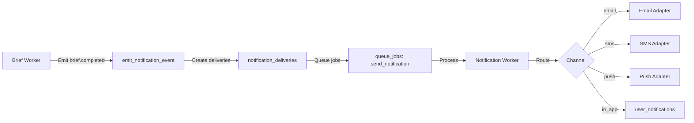

<!-- apps/web/docs/features/notifications/implementation/NOTIFICATION_PHASE3_IMPLEMENTATION.md -->

# Notification System Phase 3 - Daily Brief Notifications (Current)

**Status:** Active
**Version:** 2.0
**Date:** 2026-02-05
**Owner:** BuildOS Engineering

---

## Overview

Phase 3 delivers **daily brief notifications** to users via the event-driven notification system. This is now **explicit opt-in**: no auto-subscribe and no default-enabled channels.

Key outcomes:

- `brief.completed` and `brief.failed` events are emitted by the brief worker.
- Deliveries are created only for users with **active subscriptions** created via explicit opt-in (`created_by` set) or `admin_only=true`.
- Preferences are **one row per user** with **defaults disabled**.
- Email/SMS use daily brief toggles; push/in-app use global channel toggles.

---

## Current Behavior

### Subscription + Preference Gating

A delivery is created only when **both** are true:

1. `notification_subscriptions` contains an active row for the event (`brief.completed` or `brief.failed`) with `created_by IS NOT NULL` or `admin_only = true`.
2. `user_notification_preferences` allows the channel:
    - Email: `should_email_daily_brief = true`
    - SMS: `should_sms_daily_brief = true`
    - Push: `push_enabled = true`
    - In-App: `in_app_enabled = true`

Missing preferences **fail closed** (no deliveries).

### Event Emission

The brief worker emits events after generation:

```typescript
await supabase.rpc('emit_notification_event', {
	p_event_type: 'brief.completed',
	p_event_source: 'worker_job',
	p_target_user_id: userId,
	p_payload: {
		brief_id: briefId,
		brief_date: briefDate,
		timezone
	}
});
```

### Delivery Processing

The notification worker:

- Loads the delivery
- Enriches payload (title/body)
- Checks preferences again (fail closed)
- Sends via adapter

Adapters:

- Email: `apps/worker/src/workers/notification/emailAdapter.ts`
- SMS: `apps/worker/src/workers/notification/smsAdapter.ts`
- Push: `apps/worker/src/workers/notification/notificationWorker.ts`
- In-App: inserts into `user_notifications` with `delivery_id` + `event_id`

### Ontology Brief Emails

When `is_ontology_brief` is true, the email adapter uses `ontology_daily_briefs` content.

---

## Data Flow



---

## Key Files

**Workers**

- `apps/worker/src/workers/brief/briefWorker.ts`
- `apps/worker/src/workers/notification/notificationWorker.ts`
- `apps/worker/src/workers/notification/emailAdapter.ts`
- `apps/worker/src/workers/notification/smsAdapter.ts`
- `apps/worker/src/workers/notification/preferenceChecker.ts`

**Web**

- `apps/web/src/routes/api/notification-preferences/+server.ts`
- `apps/web/src/lib/components/settings/NotificationPreferences.svelte`
- `apps/web/src/lib/services/notification-preferences.service.ts`

**Migrations**

- `supabase/migrations/20260205_001_notification_opt_in_defaults.sql`
- `supabase/migrations/20260205_002_emit_notification_event_opt_in.sql`
- `supabase/migrations/20260205_003_user_notifications_linkage.sql`

---

## API Contract

**GET** `/api/notification-preferences?daily_brief=true`

- Returns only `should_email_daily_brief` and `should_sms_daily_brief`.

**PUT** `/api/notification-preferences`

- Upserts preferences.
- Activates/deactivates subscriptions for `brief.completed` and `brief.failed`.

---

## Defaults

New users start with all channels disabled:

```
push_enabled = false
email_enabled = false
sms_enabled = false
in_app_enabled = false
should_email_daily_brief = false
should_sms_daily_brief = false
```

---

## Testing Checklist (Current)

### Prerequisites

- Run migrations in `supabase/migrations` (including 2026-02-05 opt-in updates).

### Manual Verification

1. **Opt-in via API**

```bash
curl -X PUT "https://your-domain.com/api/notification-preferences" \
  -H "Authorization: Bearer YOUR_SESSION_TOKEN" \
  -H "Content-Type: application/json" \
  -d '{"should_email_daily_brief":true}'
```

2. **Check subscription created**

```sql
SELECT * FROM notification_subscriptions
WHERE user_id = 'your-user-id'
  AND event_type IN ('brief.completed','brief.failed');
```

3. **Generate a brief** and verify:

- `notification_events` entry exists
- `notification_deliveries` created for opted-in channels
- `queue_jobs.metadata` includes `event_id` + `event_type`

4. **Channel-specific checks**

- Email: `emails` + `email_recipients` created
- SMS: `sms_messages` created
- In-app: `user_notifications` contains `delivery_id` + `event_id`

---

## Troubleshooting

**No notification created**

- Verify subscription `is_active = true` and `created_by IS NOT NULL`.
- Verify preferences allow the channel.
- Verify brief worker emitted `brief.completed`.

**Email not sent**

- Check `emails` table entry and webhook logs.

**SMS not sent**

- Verify phone verified and user not opted out.
- Check SMS safety checks (quiet hours / rate limits).

---

## Related Docs

- `/apps/web/docs/technical/api/endpoints/notification-preferences.md`
- `/apps/web/docs/technical/api/endpoints/daily-briefs.md`
- `/docs/notification-audit.md`
