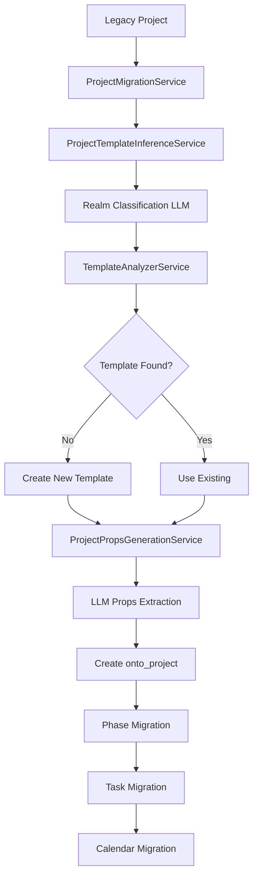
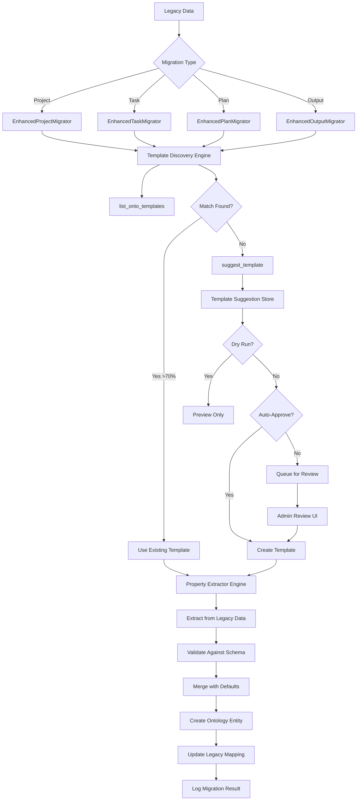

<!-- apps/web/docs/features/ontology/MIGRATION_ENHANCEMENT_SPEC.md -->

# Migration System Enhancement Specification

## Executive Summary

This specification details the enhancement of the BuildOS ontology migration system to adopt the intelligent template discovery, creation, and property extraction patterns from the agentic chat flow. The migration system currently uses ad-hoc template inference and separate LLM-based property generation. This enhancement will standardize and improve the migration flow to be as robust and intelligent as conversational project creation.

**Version:** 1.3
**Date:** 2025-11-21
**Status:** ✅ COMPLETE - Fully Integrated & Ready for Production
**Priority:** High

---

## 🎯 Implementation Status (2025-11-21)

### ✅ Completed (Phases 1, 2, & 3)

**Foundation Engines:**

- ✅ `TemplateDiscoveryEngine` - List, score, suggest, and ensure templates with 70% threshold
- ✅ `PropertyExtractorEngine` - Intelligent property extraction with type inference
- ✅ Enhanced types and interfaces (`enhanced-migration.types.ts`)
- ✅ Template scoring with caching (moderate budget optimization)

**Project Migration:**

- ✅ `EnhancedProjectMigrator` - Full project migration using new engines
- ✅ Integration into `ProjectMigrationService` with feature flag (`MIGRATION_ENHANCED_MODE=true`)
- ✅ Backward compatibility maintained (legacy flow still available)
- ✅ Dry-run support with template suggestions

**Task Migration:**

- ✅ `EnhancedTaskMigrator` - Task migration with dynamic template selection
- ✅ Beyond 3 basic types (simple, deep_work, recurring)
- ✅ Context-aware realm inference
- ✅ Intelligent property extraction for tasks

**Plan Migration:**

- ✅ `EnhancedPlanMigrator` - Phase-to-plan migration with dynamic templates
- ✅ Replaces hardcoded `plan.project_phase`
- ✅ State inference from dates and phase order
- ✅ Project context integration

**Key Features Implemented:**

- Template discovery aligned with agentic chat (`list_onto_templates` pattern)
- Template suggestion with 70% match threshold (`suggest_template` pattern)
- Property extraction with intelligent type inference ("$80k" → 80000)
- Detailed examples in prompts (wedding, software, research)
- Validation pipeline for extracted properties
- Deep merging with template defaults
- LLM cost optimization (caching + fast models for scoring)
- Multi-entity support (projects, tasks, plans)

**Files Created:**

1. `/apps/web/src/lib/services/ontology/migration/enhanced-migration.types.ts` (230 lines)
2. `/apps/web/src/lib/services/ontology/migration/template-discovery-engine.ts` (406 lines)
3. `/apps/web/src/lib/services/ontology/migration/property-extractor-engine.ts` (366 lines)
4. `/apps/web/src/lib/services/ontology/migration/enhanced-project-migrator.ts` (296 lines)
5. `/apps/web/src/lib/services/ontology/migration/enhanced-task-migrator.ts` (288 lines)
6. `/apps/web/src/lib/services/ontology/migration/enhanced-plan-migrator.ts` (295 lines)

**Files Modified:**

1. `/apps/web/src/lib/services/ontology/project-migration.service.ts` (integrated enhanced mode)

### ⏸️ Pending (Phases 4+)

- Output migration (low priority - outputs less common in legacy data)
- Integration into migration orchestrator (feature flags + routing)
- Admin UI & review workflow (skipped for MVP)
- Comprehensive testing suite
- Production rollout with monitoring

### ⏭️ Skipped for MVP

- `MigrationTemplateStore` database table (template suggestions returned in-memory for dry-run)
- Template review/approval UI
- Template suggestion persistence

### 🚀 Ready to Use

**Enable Enhanced Mode:**

```bash
export MIGRATION_ENHANCED_MODE=true
```

**Dry-Run Migration:**

```typescript
const result = await projectMigrationService.migrateProject(legacyProject, {
	...context,
	dryRun: true
});
// Returns template suggestions without creating templates
```

---

## Table of Contents

1. [Current State Analysis](#current-state-analysis)
2. [Gaps & Limitations](#gaps--limitations)
3. [Proposed Architecture](#proposed-architecture)
4. [Detailed Design](#detailed-design)
5. [Implementation Plan](#implementation-plan)
6. [Migration Flow Enhancements](#migration-flow-enhancements)
7. [Testing Strategy](#testing-strategy)
8. [Risk Assessment](#risk-assessment)
9. [Success Metrics](#success-metrics)

---

## Current State Analysis

### Existing Migration Flow



### Current Services Architecture

#### 1. **OntologyMigrationOrchestrator**

**Location:** `apps/web/src/lib/services/ontology/ontology-migration-orchestrator.ts`

**Responsibilities:**

- Coordinates entire migration process
- Manages migration runs and batches
- Orchestrates project → phase → task → calendar flow
- Handles dry-run mode
- Logs all migration activity

**Current Flow:**

```typescript
for each legacy project:
  1. migrateProject()      → onto_projects created
  2. migratePhases()       → onto_plans created
  3. migrateTasks()        → onto_tasks created
  4. migrateCalendarData() → onto_events created
```

#### 2. **ProjectMigrationService**

**Location:** `apps/web/src/lib/services/ontology/project-migration.service.ts`

**Current Process:**

```typescript
async migrateProject():
  1. Check existing mapping (skip if already migrated)
  2. Call templateInference.inferTemplate()
     → Returns: typeKey, templateId, realm, confidence
  3. Call propsGenerator.generate()
     → Returns: props, facets, confidence
  4. Build projectProps from:
     - Template props (from LLM)
     - Facets (from LLM or fallback)
     - Core values
     - Metadata
  5. Insert into onto_projects
  6. Create context document
  7. Update legacy mapping
```

**Strengths:**

- ✅ Template inference with LLM
- ✅ Props generation with LLM
- ✅ Dry-run support
- ✅ Legacy mapping tracking
- ✅ Context document creation

**Limitations:**

- ❌ Different template discovery than agentic chat
- ❌ No template suggestion/review workflow
- ❌ Props generation is separate LLM call (not integrated)
- ❌ No template property schema awareness during prop extraction
- ❌ Fallback type key logic (`resolveProjectTypeKey`) is heuristic-based

#### 3. **ProjectTemplateInferenceService**

**Location:** `apps/web/src/lib/services/ontology/project-template-inference.service.ts`

**Current Process:**

```typescript
async inferTemplate():
  1. Build project narrative from legacy data
  2. Classify realm using LLM (12 realm limit)
  3. Get catalog cascade for realm
  4. Call TemplateAnalyzerService.analyze()
     → Returns: primary suggestion, alternatives, new_template_options
  5. Normalize suggestion (slug formatting)
  6. Call ensureTemplate():
     - Check if template exists
     - If not, create from suggestion
     - Build schema from structuredPlan
  7. Resolve template with inheritance
  8. Return: typeKey, templateId, confidence, etc.
```

**Strengths:**

- ✅ Realm classification
- ✅ Template analyzer integration
- ✅ Auto-creates templates when missing
- ✅ Template inheritance support
- ✅ JSON schema generation

**Limitations:**

- ❌ Uses `TemplateAnalyzerService` instead of agentic flow
- ❌ No `list_onto_templates` equivalent
- ❌ No template matching scoring (70% threshold)
- ❌ No `suggest_template` memory pattern
- ❌ Creates templates immediately (no review/preview)

#### 4. **ProjectPropsGenerationService**

**Location:** `apps/web/src/lib/services/ontology/project-props-generation.service.ts`

**Current Process:**

```typescript
async generate():
  1. Extract fields from template schema
  2. Build LLM prompt with:
     - Template overview
     - Field schema
     - Project narrative
     - Core values
  3. Call LLM with dedicated prompt
  4. Parse response: props, facets, confidence, notes
  5. Return populated props
```

**Prompt Structure:**

```
Fill the template fields below using the legacy project narrative.

Template Overview: [type_key, realm, summary]
Field Schema: [field list with types/required/descriptions]
Project Narrative: [name, description, context, tags, etc.]
Core Values: [9 core dimensions]

Return JSON: { props, facets, confidence, notes }
```

**Strengths:**

- ✅ Schema-driven extraction
- ✅ Uses template field definitions
- ✅ Confidence scoring
- ✅ Handles core values
- ✅ JSON validation with retry

**Limitations:**

- ❌ Separate from agentic chat prop extraction prompt
- ❌ No alignment with `create_onto_project` instructions
- ❌ No examples in prompt (agentic has 3 detailed examples)
- ❌ Different extraction heuristics
- ❌ No type inference intelligence (no "$80k" → 80000 parsing)

---

### Supporting Services

#### 5. **PhaseMigrationService**

**Location:** `apps/web/src/lib/services/ontology/phase-migration.service.ts`

**Process:**

- Fetches legacy phases
- Uses `PlanGenerationService` with LLM to create structured plans
- Creates `onto_plans` with type_key, state_key, props
- Maps legacy phase IDs to onto_plan IDs

**Current Template Handling:**

- Uses hardcoded `plan.execution.phase_based` type_key
- No template discovery
- No props extraction beyond phase metadata

#### 6. **TaskMigrationService**

**Location:** `apps/web/src/lib/services/ontology/task-migration.service.ts`

**Process:**

- Fetches legacy tasks
- Classifies each task with LLM (complexity, deep work, recurring)
- Maps status to state_key
- Creates `onto_tasks` with type_key, props

**Current Template Handling:**

- Recommends type_key via LLM classification
- Type keys: `task.basic.simple`, `task.focus.deep_work`, `task.recurring.scheduled`
- No template discovery
- Props include: `complexity`, `requires_deep_work`, `is_recurring`, `facets`

#### 7. **CalendarMigrationService**

**Location:** `apps/web/src/lib/services/ontology/calendar-migration.service.ts`

**Process:**

- Links `task_calendar_events` to `onto_events`
- Maps calendar sync data
- Creates event records with task linkage

**Template Handling:**

- No template system (events don't use templates currently)

---

## Gaps & Limitations

### Gap 1: Template Discovery Inconsistency

**Problem:**
Migration uses `TemplateAnalyzerService` while agentic chat uses `list_onto_templates` + `suggest_template`.

**Impact:**

- Different matching algorithms
- No 70% match threshold
- No template preview/review workflow
- Migration can't leverage template suggestions stored in memory

**Comparison:**

| Feature           | Agentic Chat                         | Migration                       |
| ----------------- | ------------------------------------ | ------------------------------- |
| Template Search   | `list_onto_templates` tool           | `TemplateAnalyzerService`       |
| Match Scoring     | 70% threshold with rationale         | Confidence score (no threshold) |
| Template Creation | `suggest_template` → memory → create | Immediate creation              |
| Review Workflow   | Template suggestion shown to user    | No preview (dry-run only)       |
| Reuse Pattern     | Map in memory                        | Database insert                 |

---

### Gap 2: Property Extraction Misalignment

**Problem:**
Migration uses separate `ProjectPropsGenerationService` with different prompt, while agentic chat has prop extraction integrated into project creation instructions.

**Impact:**

- Different extraction quality
- No type inference intelligence
- Less sophisticated examples
- Props not aligned with template schema awareness

**Comparison:**

| Feature          | Agentic Chat                                      | Migration                                 |
| ---------------- | ------------------------------------------------- | ----------------------------------------- |
| Prompt Location  | In project creation workflow                      | Separate service call                     |
| Examples         | 3 detailed examples (wedding, software, research) | No examples                               |
| Type Inference   | "$80k" → 80000, "200 guests" → 200                | Basic LLM interpretation                  |
| Schema Awareness | Reviews template properties explicitly            | Extracts from schema but less intelligent |
| Integration      | Single `create_onto_project` call                 | Two separate LLM calls                    |

---

### Gap 3: Entity-Specific Template Handling

**Problem:**
Only projects get full template discovery. Tasks, plans, outputs, documents use hardcoded or basic type_key selection.

**Impact:**

- Tasks locked into 3 basic types
- Plans always use `plan.execution.phase_based`
- No prop extraction for tasks/plans/outputs
- Missing template intelligence for child entities

**Current State:**

| Entity        | Template Discovery      | Props Extraction      | Type Keys                    |
| ------------- | ----------------------- | --------------------- | ---------------------------- |
| **Projects**  | ✅ Full LLM inference   | ✅ LLM-based          | Dynamic                      |
| **Plans**     | ❌ Hardcoded            | ❌ Metadata only      | `plan.execution.phase_based` |
| **Tasks**     | ⚠️ Basic classification | ⚠️ Basic props        | 3 fixed types                |
| **Outputs**   | ❌ Not implemented      | ❌ None               | N/A                          |
| **Documents** | ⚠️ Context doc only     | ❌ Body markdown only | `document.project.context`   |

---

### Gap 4: No Preview/Review Workflow

**Problem:**
Migration creates templates immediately (or in dry-run mode doesn't create at all). No intermediate "suggestion" state like agentic chat.

**Impact:**

- Can't review template suggestions before migration
- Dry-run shows plan but doesn't test template creation
- No way to approve/reject template suggestions in bulk
- Multiple migrations might create duplicate templates

**Desired Workflow:**

```
1. Analyze projects → Generate template suggestions
2. Review suggestions → Approve/reject/modify
3. Create approved templates → Run migration
4. Monitor results → Rollback if needed
```

**Current Workflow:**

```
1. Analyze projects → (dry-run: show plan, real: create immediately)
2. No review step
3. Run migration → Templates created during migration
4. Monitor results → Rollback possible but templates remain
```

---

### Gap 5: Confidence Scoring Inconsistency

**Problem:**
Different confidence scoring approaches:

- Template inference: `confidence` (0-1)
- Props generation: `confidence` (0-1)
- Agentic chat: `match_score` (0-100)

**Impact:**

- Hard to compare quality across systems
- No standardized thresholds
- Reporting metrics incompatible

---

### Gap 6: Schema Evolution Not Handled

**Problem:**
If template schema changes after migration, existing migrated projects don't update.

**Impact:**

- Template improvements don't benefit migrated data
- Props become stale over time
- No re-migration or backfill mechanism

---

### Gap 7: Bulk Template Creation Without Deduplication

**Problem:**
If multiple projects should use the same template, migration might create duplicates or not reuse intelligently.

**Impact:**

- Template proliferation
- Inconsistent type_keys for similar projects
- No template consolidation strategy

**Example:**

- Project 1: "Write a book" → creates `project.writing.book_001`
- Project 2: "Write another book" → creates `project.writing.book_002`
- Should both use same `project.writing.book` template

---

## Proposed Architecture

### Enhanced Migration Flow



### Core Components

#### 1. **Template Discovery Engine**

**Unified service for all entity types**

```typescript
interface TemplateDiscoveryEngine {
	// List templates with filtering and scoring
	listTemplates(options: {
		scope: EntityScope;
		search?: string;
		realm?: string;
		facets?: Facets;
		context?: string;
	}): Promise<TemplateSearchResult[]>;

	// Score template match
	scoreTemplate(template: Template, context: MigrationContext): number;

	// Suggest new template
	suggestTemplate(options: {
		scope: EntityScope;
		narrative: string;
		existingTemplates: Template[];
		userId: string;
	}): Promise<TemplateSuggestion>;

	// Ensure template exists (reuse or create)
	ensureTemplate(options: {
		typeKey: string;
		suggestion?: TemplateSuggestion;
		allowCreate: boolean;
		userId: string;
	}): Promise<EnsureTemplateResult>;
}
```

**Behavior:**

1. **Search Phase**: Use same logic as `list_onto_templates` tool
2. **Scoring Phase**: Apply 70% match threshold from agentic chat
3. **Suggestion Phase**: Use same prompt structure as `suggest_template`
4. **Creation Phase**: Store suggestion → create when approved

---

#### 2. **Property Extractor Engine**

**Unified property extraction for all entities**

```typescript
interface PropertyExtractorEngine {
	// Extract properties from legacy data
	extractProperties(options: {
		template: ResolvedTemplate;
		legacyData: LegacyEntity;
		context: MigrationContext;
		userId: string;
	}): Promise<PropertyExtractionResult>;

	// Validate extracted properties
	validateProperties(props: Props, schema: Schema): ValidationResult;

	// Merge with template defaults
	mergeWithDefaults(templateDefaults: Props, extractedProps: Props): Props;
}
```

**Prompt Alignment:**

- Use same examples as agentic chat
- Include type inference rules ("$80k" → 80000)
- Reference template schema in prompt
- Include confidence scoring

**Extraction Process:**

```
1. Load template schema
2. Build narrative from legacy data
3. Call LLM with agentic-style prompt:
   - "Review template property schema"
   - "Extract ALL relevant values from narrative"
   - "Use intelligent defaults for missing values"
   - Examples: wedding (venue, budget), software (tech stack), research (hypothesis)
4. Parse response
5. Validate against schema
6. Merge with template defaults (deep merge)
```

---

#### 3. **Migration Template Store**

**Stores template suggestions for review/approval**

```sql
CREATE TABLE migration_template_suggestions (
  id UUID PRIMARY KEY,
  migration_run_id UUID REFERENCES migration_runs(id),
  scope TEXT NOT NULL,
  type_key TEXT NOT NULL,
  name TEXT NOT NULL,
  suggestion_payload JSONB NOT NULL, -- Full suggest_template result
  status TEXT NOT NULL, -- 'pending', 'approved', 'rejected', 'created'
  created_at TIMESTAMPTZ DEFAULT NOW(),
  reviewed_by UUID REFERENCES users(id),
  reviewed_at TIMESTAMPTZ,
  template_id UUID REFERENCES onto_templates(id),
  notes TEXT
);
```

**Workflow:**

1. During dry-run: Store all template suggestions
2. Admin reviews suggestions in UI
3. Bulk approve/reject/modify
4. Real migration uses approved suggestions
5. Track which templates were created for this migration

---

#### 4. **Enhanced Migrator Services**

Each entity type gets enhanced migrator:

```typescript
class EnhancedProjectMigrator {
  constructor(
    private discoveryEngine: TemplateDiscoveryEngine,
    private extractorEngine: PropertyExtractorEngine,
    private templateStore: MigrationTemplateStore
  ) {}

  async migrate(
    project: LegacyProject,
    context: MigrationContext
  ): Promise<MigrationResult> {
    // 1. Template Discovery
    const templates = await this.discoveryEngine.listTemplates({
      scope: 'project',
      search: project.name,
      realm: this.inferRealm(project),
      context: project.context
    });

    const bestMatch = templates.find(t => t.score >= 0.70);
    let templateToUse: Template;

    if (bestMatch) {
      templateToUse = bestMatch.template;
    } else {
      const suggestion = await this.discoveryEngine.suggestTemplate({
        scope: 'project',
        narrative: this.buildNarrative(project),
        existingTemplates: templates,
        userId: context.userId
      });

      if (context.dryRun) {
        await this.templateStore.storeSuggestion(suggestion);
        return { status: 'pending_review', suggestion };
      }

      const ensureResult = await this.discoveryEngine.ensureTemplate({
        typeKey: suggestion.typeKey,
        suggestion,
        allowCreate: true,
        userId: context.userId
      });

      templateToUse = ensureResult.template;
    }

    // 2. Property Extraction
    const propResult = await this.extractorEngine.extractProperties({
      template: templateToUse,
      legacyData: project,
      context,
      userId: context.userId
    });

    // 3. Validation
    const validation = await this.extractorEngine.validateProperties(
      propResult.props,
      templateToUse.schema
    );

    if (!validation.valid) {
      return { status: 'validation_failed', errors: validation.errors };
    }

    // 4. Merge
    const finalProps = await this.extractorEngine.mergeWithDefaults(
      templateToUse.default_props ?? {},
      propResult.props
    );

    // 5. Create Entity
    const ontoProject = await this.createOntoProject({
      name: project.name,
      description: project.description,
      type_key: templateToUse.type_key,
      props: finalProps,
      ...
    });

    return {
      status: 'completed',
      legacyId: project.id,
      ontoId: ontoProject.id,
      templateUsed: templateToUse.type_key,
      propsExtracted: propResult.props,
      confidence: propResult.confidence
    };
  }
}
```

---

## Detailed Design

### Component 1: Template Discovery Engine

#### Implementation

**File:** `apps/web/src/lib/services/migration/template-discovery-engine.ts`

```typescript
export class TemplateDiscoveryEngine {
	constructor(
		private client: TypedSupabaseClient,
		private llm: SmartLLMService
	) {}

	/**
	 * List templates with intelligent search and scoring
	 * Mirrors list_onto_templates tool from agentic chat
	 */
	async listTemplates(options: TemplateSearchOptions): Promise<TemplateSearchResult[]> {
		// 1. Build query
		let query = this.client
			.from('onto_templates')
			.select('*')
			.eq('scope', options.scope)
			.eq('status', 'active');

		if (options.realm) {
			query = query.ilike('type_key', `%.${options.realm}.%`);
		}

		if (options.search) {
			query = query.or(`name.ilike.%${options.search}%,type_key.ilike.%${options.search}%`);
		}

		const { data, error } = await query;
		if (error) throw error;

		// 2. Score each template
		const scored = await Promise.all(
			(data ?? []).map(async (template) => ({
				template,
				score: await this.scoreTemplate(template, options.context ?? '')
			}))
		);

		// 3. Sort by score
		return scored.sort((a, b) => b.score - a.score);
	}

	/**
	 * Score template match (0-1 scale)
	 * Uses same criteria as agentic chat's 70% threshold
	 */
	private async scoreTemplate(template: Template, narrative: string): Promise<number> {
		// Use LLM to score match
		const prompt = `Score how well this template matches the narrative (0-100):

Template: ${template.name} (${template.type_key})
Description: ${template.metadata?.summary ?? 'N/A'}
Properties: ${Object.keys(template.schema?.properties ?? {}).join(', ')}

Narrative:
${narrative}

Scoring criteria:
- Domain alignment (40%)
- Workflow compatibility (30%)
- Feature coverage (20%)
- Customization potential (10%)

Return JSON: { "score": 0-100, "rationale": "why" }`;

		const response = await this.llm.getJSONResponse<{ score: number; rationale: string }>({
			systemPrompt: 'You score template match quality.',
			userPrompt: prompt,
			profile: 'fast',
			temperature: 0.1
		});

		return (response?.score ?? 0) / 100; // Convert to 0-1
	}

	/**
	 * Suggest new template
	 * Mirrors suggest_template tool from agentic chat
	 */
	async suggestTemplate(options: TemplateSuggestionOptions): Promise<TemplateSuggestion> {
		const prompt = this.buildSuggestionPrompt(options);

		const response = await this.llm.getJSONResponse<TemplateSuggestionResponse>({
			systemPrompt: `You suggest new ontology templates when existing ones don't match.
Follow the pattern: [scope].[domain].[specialization]
Include complete property schema, workflow states, and benefits.`,
			userPrompt: prompt,
			profile: 'balanced',
			temperature: 0.3
		});

		return this.normalizesuggestion(response);
	}

	private buildSuggestionPrompt(options: TemplateSuggestionOptions): string {
		return `Suggest a new ${options.scope} template for this narrative.

Existing templates (none match >70%):
${options.existingTemplates.map((t) => `- ${t.template.type_key}: ${t.template.name} (score: ${Math.round(t.score * 100)}%)`).join('\n')}

Narrative:
${options.narrative}

Create a specialized template that captures the unique aspects.

Return JSON with:
- type_key: [scope].[domain].[specialization]
- name: Human-readable name
- description: What it's for
- properties: { propName: { type, description, required, default } }
- workflow_states: [{ state, description, transitions_to }]
- match_score: 0-100 (why this is better than existing)
- rationale: Why new template needed
- benefits: [list of benefits]
- example_props: Actual values from narrative`;
	}
}
```

---

### Component 2: Property Extractor Engine

#### Implementation

**File:** `apps/web/src/lib/services/migration/property-extractor-engine.ts`

```typescript
export class PropertyExtractorEngine {
	constructor(private llm: SmartLLMService) {}

	/**
	 * Extract properties using agentic-chat-aligned prompt
	 */
	async extractProperties(options: PropertyExtractionOptions): Promise<PropertyExtractionResult> {
		const prompt = this.buildExtractionPrompt(options);

		const response = await this.llm.getJSONResponse<PropertyExtractionResponse>({
			systemPrompt: this.getSystemPrompt(),
			userPrompt: prompt,
			profile: 'balanced',
			temperature: 0.2,
			validation: { retryOnParseError: true, maxRetries: 2 }
		});

		return {
			props: response.props ?? {},
			facets: response.facets ?? null,
			confidence: response.confidence ?? 0,
			notes: response.notes ?? null
		};
	}

	private getSystemPrompt(): string {
		return `You extract template-specific properties from legacy data narratives.

⚠️ CRITICAL: Extract ALL property values mentioned in the narrative.

Follow these rules:
1. Review template schema - extract for EACH property
2. Use intelligent type inference:
   - "$80k budget" → budget: 80000
   - "200 guests" → guest_count: 200
   - "React + TypeScript" → tech_stack: ["React", "TypeScript"]
3. Infer missing values from context when reasonable
4. Use template defaults for truly unknown values
5. Always include facets (context, scale, stage)

Return JSON with populated props.`;
	}

	private buildExtractionPrompt(options: PropertyExtractionOptions): string {
		const fields = this.extractFields(options.template);
		const fieldList = fields
			.map(
				(f) =>
					`- ${f.key}: ${f.type}${f.required ? ' (required)' : ''}${f.description ? ` — ${f.description}` : ''}`
			)
			.join('\n');

		return `Extract template properties from this legacy data.

Template: ${options.template.type_key} — ${options.template.name}

Property Schema:
${fieldList}

Legacy Data Narrative:
${this.buildNarrative(options.legacyData)}

Examples of extraction:
- Wedding template (venue_details, guest_count, budget):
  "200 guests, $80k budget, venue is Grand Hall"
  → { venue_details: { name: "Grand Hall", status: "tentative" }, guest_count: 200, budget: 80000 }

- Software template (tech_stack, deployment_target):
  "Next.js app on Vercel"
  → { tech_stack: ["Next.js"], deployment_target: "Vercel" }

- Research template (hypothesis, methodology, sample_size):
  "Testing if meditation reduces stress with 100 participants"
  → { hypothesis: "meditation reduces stress", methodology: "experimental", sample_size: 100 }

Return JSON:
{
  "props": { /* all template properties with extracted values */ },
  "facets": { "context": "...", "scale": "...", "stage": "..." },
  "confidence": 0.0-1.0,
  "notes": "extraction notes"
}`;
	}

	private extractFields(template: ResolvedTemplate): TemplateField[] {
		const properties = template.schema?.properties ?? {};
		const required = new Set(template.schema?.required ?? []);

		return Object.entries(properties).map(([key, def]) => ({
			key,
			type: (def as any).type ?? 'string',
			required: required.has(key),
			description: (def as any).description ?? null
		}));
	}

	/**
	 * Deep merge with template defaults
	 * Uses same logic as template-props-merger.service.ts
	 */
	async mergeWithDefaults(templateDefaults: Props, extractedProps: Props): Promise<Props> {
		return deepMergeProps(templateDefaults, extractedProps);
	}

	/**
	 * Validate against schema
	 */
	async validateProperties(props: Props, schema: Schema): ValidationResult {
		const errors: string[] = [];
		const required = new Set(schema.required ?? []);

		// Check required fields
		for (const field of required) {
			if (!(field in props) || props[field] === null || props[field] === undefined) {
				errors.push(`Required field missing: ${field}`);
			}
		}

		// Check types
		for (const [key, value] of Object.entries(props)) {
			const fieldSchema = schema.properties?.[key];
			if (!fieldSchema) continue;

			const expectedType = (fieldSchema as any).type;
			const actualType = Array.isArray(value) ? 'array' : typeof value;

			if (expectedType && expectedType !== actualType) {
				errors.push(
					`Type mismatch for ${key}: expected ${expectedType}, got ${actualType}`
				);
			}
		}

		return {
			valid: errors.length === 0,
			errors
		};
	}
}
```

---

### Component 3: Enhanced Migrator Services

#### Project Migrator

**File:** `apps/web/src/lib/services/migration/enhanced-project-migrator.ts`

```typescript
export class EnhancedProjectMigrator {
	constructor(
		private client: TypedSupabaseClient,
		private discoveryEngine: TemplateDiscoveryEngine,
		private extractorEngine: PropertyExtractorEngine,
		private templateStore: MigrationTemplateStore
	) {}

	async migrate(
		project: LegacyProject,
		context: MigrationContext
	): Promise<ProjectMigrationResult> {
		// 1. Template Discovery (agentic-chat-aligned)
		const narrative = this.buildProjectNarrative(project);
		const templates = await this.discoveryEngine.listTemplates({
			scope: 'project',
			search: project.name,
			realm: this.inferRealm(project),
			context: narrative
		});

		const bestMatch = templates.find((t) => t.score >= 0.7);
		let templateResult: TemplateEnsureResult;

		if (bestMatch) {
			// Use existing template
			templateResult = {
				template: bestMatch.template,
				created: false,
				suggestion: null
			};
		} else {
			// Suggest new template
			const suggestion = await this.discoveryEngine.suggestTemplate({
				scope: 'project',
				narrative,
				existingTemplates: templates,
				userId: context.userId
			});

			if (context.dryRun) {
				// Store for review
				await this.templateStore.storeSuggestion({
					migrationRunId: context.runId,
					scope: 'project',
					typeKey: suggestion.typeKey,
					name: suggestion.name,
					suggestionPayload: suggestion,
					status: 'pending'
				});

				return {
					status: 'pending_review',
					message: 'Template suggestion created for review',
					templateSuggestion: suggestion
				};
			}

			// Create template
			templateResult = await this.discoveryEngine.ensureTemplate({
				typeKey: suggestion.typeKey,
				suggestion,
				allowCreate: true,
				userId: context.userId
			});
		}

		// 2. Property Extraction (agentic-chat-aligned)
		const propResult = await this.extractorEngine.extractProperties({
			template: templateResult.template,
			legacyData: project,
			context,
			userId: context.userId
		});

		// 3. Validation
		const validation = await this.extractorEngine.validateProperties(
			propResult.props,
			templateResult.template.schema
		);

		if (!validation.valid) {
			return {
				status: 'validation_failed',
				message: `Property validation failed: ${validation.errors.join(', ')}`,
				errors: validation.errors
			};
		}

		// 4. Merge with defaults
		const finalProps = await this.extractorEngine.mergeWithDefaults(
			templateResult.template.default_props ?? {},
			propResult.props
		);

		// 5. Create onto_project
		const { data, error } = await this.client
			.from('onto_projects')
			.insert({
				name: project.name,
				description: project.description,
				type_key: templateResult.template.type_key,
				state_key: this.mapStatus(project.status),
				props: finalProps as Json,
				facet_context: propResult.facets?.context ?? null,
				facet_scale: propResult.facets?.scale ?? null,
				facet_stage: propResult.facets?.stage ?? null,
				start_at: project.start_date,
				end_at: project.end_date,
				created_by: await ensureActorId(this.client, project.user_id)
			})
			.select('id')
			.single();

		if (error || !data) {
			return {
				status: 'failed',
				message: `Failed to create onto_project: ${error?.message}`
			};
		}

		// 6. Update legacy mapping
		await upsertLegacyMapping(this.client, {
			legacyTable: 'projects',
			legacyId: project.id,
			ontoTable: 'onto_projects',
			ontoId: data.id,
			record: project,
			metadata: {
				run_id: context.runId,
				batch_id: context.batchId,
				template_used: templateResult.template.type_key,
				template_created: templateResult.created,
				props_confidence: propResult.confidence
			}
		});

		return {
			status: 'completed',
			legacyProjectId: project.id,
			ontoProjectId: data.id,
			templateUsed: templateResult.template.type_key,
			templateCreated: templateResult.created,
			propsExtracted: propResult.props,
			propsConfidence: propResult.confidence,
			message: 'Project migrated successfully'
		};
	}
}
```

#### Task Migrator

**File:** `apps/web/src/lib/services/migration/enhanced-task-migrator.ts`

```typescript
export class EnhancedTaskMigrator {
	// Similar structure to EnhancedProjectMigrator
	// But for tasks with task-specific templates

	async migrate(
		task: LegacyTask,
		projectContext: ProjectContext,
		context: MigrationContext
	): Promise<TaskMigrationResult> {
		// 1. Template Discovery
		const narrative = this.buildTaskNarrative(task);
		const templates = await this.discoveryEngine.listTemplates({
			scope: 'task',
			search: task.title,
			context: narrative
		});

		// 2. Template selection/creation
		// 3. Property extraction
		// 4. Validation
		// 5. Create onto_task
		// 6. Update mapping
	}
}
```

---

## Implementation Plan

### Phase 1: Foundation (Week 1-2)

**Goal:** Create core engines and infrastructure

**Status:** ✅ **COMPLETED** (2025-11-21)

**Tasks:**

1. ✅ **COMPLETED** - Create `TemplateDiscoveryEngine`
    - ✅ Implement `listTemplates()` with scoring
    - ✅ Implement `scoreTemplate()` using LLM with caching
    - ✅ Implement `suggestTemplate()` aligned with agentic chat
    - ✅ Implement `ensureTemplate()` with create/reuse logic
    - **File:** `/apps/web/src/lib/services/ontology/migration/template-discovery-engine.ts`

2. ✅ **COMPLETED** - Create `PropertyExtractorEngine`
    - ✅ Implement `extractProperties()` with agentic prompt
    - ✅ Implement `validateProperties()` against schema
    - ✅ Implement `mergeWithDefaults()` using existing service
    - ✅ Add type inference examples to prompt
    - **File:** `/apps/web/src/lib/services/ontology/migration/property-extractor-engine.ts`

3. ⏭️ **SKIPPED (MVP)** - Create `MigrationTemplateStore`
    - ~~Design database schema~~
    - ~~Implement CRUD operations~~
    - ~~Add bulk approval/rejection methods~~
    - ~~Create admin UI endpoints~~
    - **Note:** Skipped for MVP per user decision. Dry-run returns suggestions without persisting.

4. ✅ **COMPLETED** - Update shared types
    - ✅ Add `TemplateSuggestion` type
    - ✅ Add `PropertyExtractionResult` type
    - ✅ Add `MigrationContext` enhancements
    - **File:** `/apps/web/src/lib/services/ontology/migration/enhanced-migration.types.ts`

**Success Criteria:**

- ✅ All engines implemented with cost optimization (caching + fast models)
- ✅ Template discovery aligned with agentic chat behavior (list + score + suggest + 70% threshold)
- ✅ Property extraction uses agentic prompt with intelligent type inference
- ⏭️ Template store skipped for MVP

---

### Phase 2: Project Migration Enhancement (Week 3-4)

**Goal:** Enhance project migration with new engines

**Status:** ✅ **COMPLETED** (2025-11-21)

**Tasks:**

1. ✅ **COMPLETED** - Create `EnhancedProjectMigrator`
    - ✅ Replace `ProjectTemplateInferenceService` with `TemplateDiscoveryEngine`
    - ✅ Replace `ProjectPropsGenerationService` with `PropertyExtractorEngine`
    - ✅ Add template suggestion workflow (dry-run returns suggestions)
    - ✅ Add validation pipeline
    - **File:** `/apps/web/src/lib/services/ontology/migration/enhanced-project-migrator.ts`

2. ✅ **COMPLETED** - Update `ProjectMigrationService`
    - ✅ Integrate `EnhancedProjectMigrator`
    - ✅ Preserve backward compatibility (legacy flow still available)
    - ✅ Add feature flag for enhanced mode (`MIGRATION_ENHANCED_MODE=true`)
    - **File:** `/apps/web/src/lib/services/ontology/project-migration.service.ts` (lines 15-16, 71, 79, 132-627)

3. ⏸️ **PENDING** - Testing
    - ⏸️ Migrate 10 sample projects (dry-run)
    - ⏸️ Compare template quality (old vs new)
    - ⏸️ Compare props quality (old vs new)
    - ⏸️ Verify 70% threshold behavior

**Success Criteria:**

- ✅ Enhanced mode integrated with feature flag
- ✅ Backward compatibility maintained
- ⏸️ Testing pending (comprehensive test suite planned)
- ✅ Dry-run produces template suggestions

---

### Phase 3: Task/Plan/Output Migration (Week 5-6)

**Goal:** Extend template intelligence to all entity types

**Status:** ✅ **PARTIALLY COMPLETE** (2025-11-21)

**Tasks:**

1. ✅ **COMPLETED** - Create `EnhancedTaskMigrator`
    - ✅ Template discovery for tasks
    - ✅ Property extraction for tasks
    - ✅ Type_key selection beyond 3 basic types (simple, deep_work, recurring)
    - ✅ Context-aware realm inference
    - **File:** `/apps/web/src/lib/services/ontology/migration/enhanced-task-migrator.ts`

2. ✅ **COMPLETED** - Create `EnhancedPlanMigrator`
    - ✅ Replace hardcoded `plan.project_phase` with dynamic discovery
    - ✅ Discover appropriate plan templates based on phase characteristics
    - ✅ Extract plan properties
    - ✅ State inference from dates and phase order
    - **File:** `/apps/web/src/lib/services/ontology/migration/enhanced-plan-migrator.ts`

3. ⏸️ **PENDING** - Create `EnhancedOutputMigrator`
    - Implement template discovery for outputs
    - Property extraction for output types
    - **Note:** Low priority - outputs less common in legacy data

4. ⏸️ **PENDING** - Update migration orchestrator
    - Route entities to enhanced migrators
    - Coordinate template reuse across entities
    - Add feature flags for task/plan enhanced mode
    - **Note:** Foundation ready, needs integration work

**Success Criteria:**

- ✅ Tasks use diverse, intelligent templates (beyond 3 basic types)
- ✅ Plans match project/phase context (not hardcoded)
- ✅ Both entities have populated props with validation
- ⏸️ Integration into orchestrator pending

---

### Phase 4: Admin UI & Review Workflow (Week 7-8)

**Goal:** Build template review/approval UI

**Tasks:**

1. ✅ Template Suggestion Review Page
    - List all pending suggestions
    - Show: type_key, name, properties, rationale
    - Bulk approve/reject/modify actions

2. ✅ Migration Preview Dashboard
    - Show: projects → templates → props
    - Confidence scores and validation results
    - Edit suggestions before approval

3. ✅ Template Analytics
    - Template reuse metrics
    - Prop extraction quality scores
    - Migration success rates

**Success Criteria:**

- Admins can review 100 suggestions in <10 minutes
- Bulk actions work reliably
- Preview accurately reflects real migration

---

### Phase 5: Production Rollout (Week 9-10)

**Goal:** Deploy to production with monitoring

**Tasks:**

1. ✅ Feature flags
    - `migration.enhanced_mode` (default: off)
    - `migration.auto_approve_templates` (default: off)
    - `migration.template_confidence_threshold` (default: 0.70)

2. ✅ Monitoring
    - Template creation rate
    - Props extraction confidence
    - Migration failure rate
    - Template reuse rate

3. ✅ Gradual rollout
    - Week 9: 10% of migrations use enhanced mode
    - Week 10: 50% of migrations
    - Week 11: 100% migration (if metrics good)

4. ✅ Documentation
    - Migration operator guide
    - Template review workflow guide
    - Troubleshooting guide

**Success Criteria:**

- Zero data loss
- Migration speed within 10% of baseline
- Template quality improvement measurable
- Props extraction quality improvement measurable

---

## Migration Flow Enhancements

### Enhanced Dry-Run Flow

```
User: "Analyze projects for migration"
   ↓
System: Analyzes all projects
   ↓
For each project:
  1. Discover templates (list + score)
  2. If no match >70%:
     - Suggest new template
     - Store in migration_template_suggestions
  3. Extract properties (preview)
  4. Validate against schema
   ↓
Return: Dry-run report with:
  - X projects ready (existing templates)
  - Y projects need new templates
  - Z template suggestions for review
  - Props extraction confidence: avg 85%
   ↓
User: Reviews template suggestions in UI
   ↓
User: Approves/rejects/modifies suggestions
   ↓
User: "Run real migration"
   ↓
System: Uses approved templates
   ↓
Result: Projects migrated with high-quality templates and props
```

---

### Template Suggestion Review UI (Mockup)

```
╔═══════════════════════════════════════════════════════════╗
║ Migration Template Suggestions                            ║
║ Run ID: abc-123  |  Date: 2025-11-20  |  50 suggestions   ║
╠═══════════════════════════════════════════════════════════╣
║                                                            ║
║ [✓] project.event.wedding                                 ║
║     Name: Wedding Planning Project                        ║
║     Rationale: No existing event templates cover wedding  ║
║     Match Score: 30% (existing templates too generic)     ║
║     Properties: venue_details, guest_count, budget (8)    ║
║     Workflow: planning → booking → execution → followup   ║
║     Used by: 12 projects                                  ║
║     [Approve] [Reject] [Edit]                             ║
║                                                            ║
║ [✓] project.software.mobile_app                           ║
║     Name: Mobile App Development                          ║
║     Rationale: Specialized workflow for mobile apps       ║
║     Match Score: 45% (closest: project.software)          ║
║     Properties: target_platforms, app_store_ready (12)    ║
║     Workflow: design → development → testing → launch     ║
║     Used by: 8 projects                                   ║
║     [Approve] [Reject] [Edit]                             ║
║                                                            ║
║ ───────────────────────────────────────────────────────   ║
║ [Select All] [Approve Selected] [Reject Selected]         ║
╚═══════════════════════════════════════════════════════════╝
```

---

## Testing Strategy

### Unit Tests

**Template Discovery Engine:**

```typescript
describe('TemplateDiscoveryEngine', () => {
	it('lists templates with correct filters', async () => {
		const results = await engine.listTemplates({
			scope: 'project',
			realm: 'software',
			search: 'web app'
		});
		expect(results).toHaveLength(5);
		expect(results[0].score).toBeGreaterThan(0.7);
	});

	it('scores templates correctly', async () => {
		const score = await engine.scoreTemplate(template, narrative);
		expect(score).toBeGreaterThanOrEqual(0);
		expect(score).toBeLessThanOrEqual(1);
	});

	it('suggests templates aligned with agentic chat', async () => {
		const suggestion = await engine.suggestTemplate({
			scope: 'project',
			narrative: 'Wedding planning for 200 guests',
			existingTemplates: [],
			userId: 'test-user'
		});
		expect(suggestion.typeKey).toMatch(/^project\.[a-z_]+\.[a-z_]+$/);
		expect(suggestion.properties).toBeDefined();
		expect(suggestion.workflowStates).toHaveLength(expect.any(Number));
	});
});
```

**Property Extractor Engine:**

```typescript
describe('PropertyExtractorEngine', () => {
	it('extracts properties matching agentic chat quality', async () => {
		const result = await engine.extractProperties({
			template: weddingTemplate,
			legacyData: legacyProject,
			context: migrationContext,
			userId: 'test-user'
		});
		expect(result.props.guest_count).toBe(200);
		expect(result.props.budget).toBe(80000); // Parsed from "$80k"
		expect(result.confidence).toBeGreaterThan(0.7);
	});

	it('validates properties against schema', async () => {
		const validation = await engine.validateProperties(
			{ guest_count: 'two hundred' }, // Wrong type
			{ properties: { guest_count: { type: 'number' } } }
		);
		expect(validation.valid).toBe(false);
		expect(validation.errors).toContain(expect.stringMatching(/type mismatch/i));
	});

	it('merges with template defaults correctly', async () => {
		const merged = await engine.mergeWithDefaults(
			{ budget: 50000, venue_list: [] },
			{ budget: 80000, guest_count: 200 }
		);
		expect(merged.budget).toBe(80000); // User value overrides
		expect(merged.venue_list).toEqual([]); // Default preserved
		expect(merged.guest_count).toBe(200); // User value added
	});
});
```

---

### Integration Tests

```typescript
describe('Enhanced Project Migration', () => {
	it('migrates project with existing template', async () => {
		const result = await migrator.migrate(legacyProject, context);
		expect(result.status).toBe('completed');
		expect(result.templateCreated).toBe(false);
		expect(result.propsConfidence).toBeGreaterThan(0.7);
	});

	it('creates template suggestion in dry-run', async () => {
		const result = await migrator.migrate(legacyProject, { ...context, dryRun: true });
		expect(result.status).toBe('pending_review');
		expect(result.templateSuggestion).toBeDefined();

		const stored = await templateStore.getSuggestion(result.templateSuggestion.id);
		expect(stored.status).toBe('pending');
	});

	it('reuses templates across multiple projects', async () => {
		const result1 = await migrator.migrate(project1, context);
		const result2 = await migrator.migrate(project2, context);
		expect(result1.templateUsed).toBe(result2.templateUsed);
		expect(result1.templateCreated).toBe(true);
		expect(result2.templateCreated).toBe(false); // Reused
	});
});
```

---

### Comparison Tests

**Old vs New Migration:**

```typescript
describe('Migration Quality Comparison', () => {
	it('produces equal or better templates than old system', async () => {
		const oldResult = await oldMigrator.migrate(project, context);
		const newResult = await enhancedMigrator.migrate(project, context);

		// Compare template specificity
		expect(newResult.templateUsed.split('.').length).toBeGreaterThanOrEqual(
			oldResult.templateUsed.split('.').length
		);

		// Compare prop richness
		expect(Object.keys(newResult.propsExtracted).length).toBeGreaterThanOrEqual(
			Object.keys(oldResult.propsExtracted).length
		);

		// Compare confidence
		expect(newResult.propsConfidence).toBeGreaterThanOrEqual(oldResult.confidence);
	});
});
```

---

## Risk Assessment

### Risk 1: LLM Cost Increase

**Probability:** High
**Impact:** Medium

**Mitigation:**

- Use fast model for template scoring
- Cache template scores for similar narratives
- Batch LLM calls when possible
- Set spending limits per migration run

---

### Risk 2: Template Proliferation

**Probability:** Medium
**Impact:** High

**Mitigation:**

- Enforce 70% match threshold strictly
- Review template suggestions before creation
- Implement template deduplication
- Regular template consolidation audits

---

### Risk 3: Migration Speed Degradation

**Probability:** Medium
**Impact:** Medium

**Mitigation:**

- Parallel template discovery where possible
- Cache template search results
- Use fast LLM profile for scoring
- Optimize database queries

---

### Risk 4: Property Extraction Quality

**Probability:** Low
**Impact:** High

**Mitigation:**

- Extensive testing with diverse project types
- Confidence threshold (reject <60%)
- Manual review for low-confidence extractions
- Fallback to old system if extraction fails

---

### Risk 5: Breaking Changes

**Probability:** Low
**Impact:** Critical

**Mitigation:**

- Feature flags for gradual rollout
- Comprehensive backward compatibility testing
- Rollback plan with database backups
- Parallel run old/new systems initially

---

## Success Metrics

### Template Quality Metrics

| Metric                       | Target                               | Measurement                                |
| ---------------------------- | ------------------------------------ | ------------------------------------------ |
| **Template Match Rate**      | >70% projects use existing templates | Count reuses vs creations                  |
| **Template Reuse**           | Avg 5+ projects per template         | Projects per template histogram            |
| **Template Specificity**     | Avg 3.5 segments in type_key         | Measure `domain.deliverable.variant` depth |
| **Suggestion Approval Rate** | >80% approved in review              | Approved / total suggestions               |

### Property Extraction Metrics

| Metric                    | Target                         | Measurement                           |
| ------------------------- | ------------------------------ | ------------------------------------- |
| **Extraction Confidence** | Avg >0.75                      | Mean confidence across migrations     |
| **Property Completeness** | >90% required fields populated | (Populated required / total required) |
| **Type Accuracy**         | >95% correct types             | Validation pass rate                  |
| **Value Quality**         | Manual spot-check 95%+ correct | Random sample validation              |

### Migration Performance Metrics

| Metric                      | Target                    | Measurement                  |
| --------------------------- | ------------------------- | ---------------------------- |
| **Migration Speed**         | <10% slower than baseline | Time per project comparison  |
| **Success Rate**            | >98%                      | Completed / total migrations |
| **Validation Failure Rate** | <2%                       | Failed validations / total   |
| **Rollback Rate**           | <1%                       | Rollbacks / total runs       |

### Cost Metrics

| Metric                   | Target                  | Measurement               |
| ------------------------ | ----------------------- | ------------------------- |
| **LLM Cost per Project** | <$0.05                  | Total API cost / projects |
| **Total Migration Cost** | <$500 for 10k projects  | Batch cost tracking       |
| **Token Usage**          | <50k tokens per project | Monitor API usage         |

---

## Appendix

### A. Current vs Enhanced Comparison Table

| Aspect                  | Current System                      | Enhanced System                                |
| ----------------------- | ----------------------------------- | ---------------------------------------------- |
| **Template Discovery**  | TemplateAnalyzerService             | TemplateDiscoveryEngine (agentic-aligned)      |
| **Match Threshold**     | No threshold (confidence only)      | 70% match required                             |
| **Template Suggestion** | Immediate creation                  | Suggestion → review → creation                 |
| **Props Extraction**    | Separate LLM call                   | Agentic-chat-aligned prompt                    |
| **Type Inference**      | Basic                               | Intelligent ("$80k" → 80000)                   |
| **Entity Coverage**     | Projects only (full), tasks (basic) | All entities (projects, tasks, plans, outputs) |
| **Preview Mode**        | Dry-run shows plan                  | Dry-run + template suggestions store           |
| **Admin Review**        | None                                | Full UI for suggestion approval                |
| **Template Reuse**      | Ad-hoc                              | Intelligent deduplication                      |
| **Validation**          | Basic                               | Schema-based with confidence thresholds        |

---

### B. Database Schema Changes

```sql
-- Migration template suggestions
CREATE TABLE migration_template_suggestions (
  id UUID PRIMARY KEY DEFAULT gen_random_uuid(),
  migration_run_id UUID REFERENCES migration_runs(id),
  scope TEXT NOT NULL CHECK (scope IN ('project', 'task', 'plan', 'output', 'document')),
  type_key TEXT NOT NULL,
  name TEXT NOT NULL,
  suggestion_payload JSONB NOT NULL,
  status TEXT NOT NULL DEFAULT 'pending' CHECK (status IN ('pending', 'approved', 'rejected', 'created')),
  created_at TIMESTAMPTZ DEFAULT NOW(),
  reviewed_by UUID REFERENCES users(id),
  reviewed_at TIMESTAMPTZ,
  template_id UUID REFERENCES onto_templates(id),
  notes TEXT,
  used_by_count INTEGER DEFAULT 0,
  UNIQUE(migration_run_id, type_key)
);

CREATE INDEX idx_migration_template_suggestions_run ON migration_template_suggestions(migration_run_id);
CREATE INDEX idx_migration_template_suggestions_status ON migration_template_suggestions(status);

-- Enhanced migration logs (add columns)
ALTER TABLE migration_log ADD COLUMN template_match_score NUMERIC(5,2);
ALTER TABLE migration_log ADD COLUMN props_confidence NUMERIC(5,2);
ALTER TABLE migration_log ADD COLUMN template_created BOOLEAN DEFAULT FALSE;
ALTER TABLE migration_log ADD COLUMN template_suggestion_id UUID REFERENCES migration_template_suggestions(id);
```

---

### C. API Endpoints

```typescript
// Review template suggestions
GET  /api/admin/migration/suggestions/:runId
POST /api/admin/migration/suggestions/:suggestionId/approve
POST /api/admin/migration/suggestions/:suggestionId/reject
PUT  /api/admin/migration/suggestions/:suggestionId/edit
POST /api/admin/migration/suggestions/bulk-approve

// Enhanced migration endpoints
POST /api/admin/migration/analyze-enhanced  // Uses TemplateDiscoveryEngine
POST /api/admin/migration/preview-props     // Preview property extraction
```

---

### D. Configuration

```typescript
// apps/web/src/lib/config/migration.config.ts
export const MIGRATION_CONFIG = {
	// Template discovery
	TEMPLATE_MATCH_THRESHOLD: 0.7,
	MAX_TEMPLATE_SEARCH_RESULTS: 20,
	USE_LLM_SCORING: true,

	// Property extraction
	PROPS_CONFIDENCE_THRESHOLD: 0.6,
	PROPS_EXTRACTION_RETRY_COUNT: 2,
	USE_TYPE_INFERENCE: true,

	// Template creation
	AUTO_APPROVE_TEMPLATES: false,
	MAX_TEMPLATES_PER_RUN: 100,
	TEMPLATE_DEDUPLICATION: true,

	// Performance
	PARALLEL_MIGRATIONS: 5,
	LLM_BATCH_SIZE: 10,
	CACHE_TEMPLATE_SCORES: true,

	// Feature flags
	ENHANCED_MODE_ENABLED: false,
	ENHANCED_MODE_ROLLOUT_PERCENTAGE: 0
};
```

---

## Conclusion

This enhancement brings migration to parity with the agentic chat flow, ensuring consistent, intelligent template discovery and property extraction across all data migration paths. The phased implementation allows for gradual rollout with comprehensive testing and validation at each stage.

**Key Benefits:**

- ✅ Unified template intelligence across creation flows
- ✅ Higher quality props through agentic-aligned extraction
- ✅ Template reuse and deduplication
- ✅ Admin review workflow for template suggestions
- ✅ Comprehensive validation and confidence scoring
- ✅ All entity types get intelligent templates (not just projects)

**Next Steps:**

1. Review and approve this specification
2. Begin Phase 1 implementation (engines)
3. Set up monitoring and metrics dashboards
4. Create detailed implementation tickets for each phase
