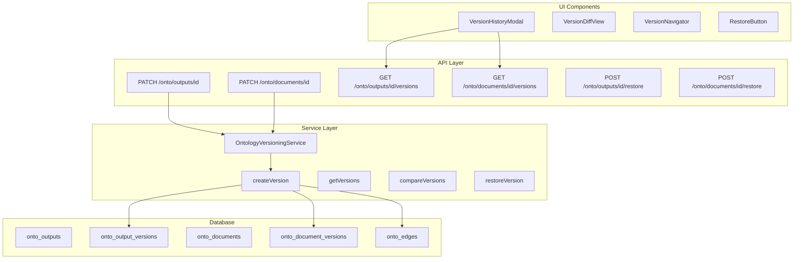

<!-- apps/web/docs/features/ontology/VERSIONING_IMPLEMENTATION_SPEC.md -->

# Ontology Versioning Implementation Specification

## Document Version

- **Version**: 1.0.0
- **Date**: 2025-11-24
- **Author**: System Architecture Team
- **Status**: APPROVED FOR IMPLEMENTATION

## Table of Contents

1. [Executive Summary](#executive-summary)
2. [Problem Statement](#problem-statement)
3. [Design Principles](#design-principles)
4. [Architecture Overview](#architecture-overview)
5. [Database Design](#database-design)
6. [API Specifications](#api-specifications)
7. [Service Layer Design](#service-layer-design)
8. [UI Component Design](#ui-component-design)
9. [Migration Strategy](#migration-strategy)
10. [Implementation Phases](#implementation-phases)
11. [Testing Requirements](#testing-requirements)
12. [Success Metrics](#success-metrics)

---

## Executive Summary

This specification outlines the implementation of a comprehensive versioning system for the BuildOS Ontology feature, specifically for `onto_outputs` and `onto_documents`. The system will provide complete audit trails, version comparison capabilities, and rollback functionality - essential features for the "Palantir of projects" vision.

### Key Deliverables

- ✅ Automatic version creation on all updates
- ✅ GitHub-like diff visualization
- ✅ Version history navigation
- ✅ Rollback capability
- ✅ Lineage tracking via edges

### Timeline

- **Phase 1**: Core versioning (3 days)
- **Phase 2**: API layer (2 days)
- **Phase 3**: UI components (3 days)
- **Phase 4**: Advanced features (2 days)
- **Total**: 10 development days

---

## Problem Statement

### Current State

The ontology versioning system has critical gaps:

1. **onto_outputs**: Version table exists but is completely unused
2. **onto_documents**: Only creates version 1 on template generation, no subsequent versions
3. **No version management**: No incrementing, retrieval, or comparison
4. **Data loss risk**: Updates overwrite existing data without history
5. **No audit trail**: Cannot track changes over time

### Target State

A fully functional versioning system that:

- Creates versions automatically on every update
- Maintains immutable version history
- Provides GitHub-like diff visualization
- Enables version navigation and rollback
- Tracks lineage through the edges system

---

## Design Principles

### 1. Immutable Append-Only

- Never modify existing versions
- Each version is a complete snapshot
- Versions are linked via foreign keys

### 2. Automatic & Transparent

- Version creation happens automatically on updates
- No additional user action required
- Version numbers increment sequentially

### 3. Storage Efficient

- Small content stored in `props.content`
- Large content uses `storage_uri` pattern
- Metadata tracked separately from content

### 4. User-Friendly

- GitHub-like diff visualization
- Clear version navigation
- One-click rollback capability

---

## Architecture Overview



---

## Database Design

### Version Tables (Existing)

#### onto_output_versions

```sql
CREATE TABLE onto_output_versions (
    id uuid PRIMARY KEY DEFAULT gen_random_uuid(),
    output_id uuid NOT NULL REFERENCES onto_outputs(id) ON DELETE CASCADE,
    number int NOT NULL,
    storage_uri text NOT NULL,
    props jsonb NOT NULL DEFAULT '{}'::jsonb,
    created_by uuid NOT NULL,
    created_at timestamptz NOT NULL DEFAULT now(),
    UNIQUE (output_id, number)
);
```

#### onto_document_versions

```sql
CREATE TABLE onto_document_versions (
    id uuid PRIMARY KEY DEFAULT gen_random_uuid(),
    document_id uuid NOT NULL REFERENCES onto_documents(id) ON DELETE CASCADE,
    number int NOT NULL,
    storage_uri text NOT NULL,
    embedding vector(1536),
    props jsonb NOT NULL DEFAULT '{}'::jsonb,
    created_by uuid NOT NULL,
    created_at timestamptz NOT NULL DEFAULT now(),
    UNIQUE (document_id, number)
);
```

### Props JSON Structure

```typescript
interface VersionProps {
	// Content (Phase 1: embedded, Phase 2: external storage)
	content?: string; // For small content (<100KB)
	content_type?: 'markdown' | 'html' | 'json';
	content_hash?: string; // SHA256 hash for integrity
	size_bytes?: number; // Content size

	// Metadata
	change_summary?: string; // User-provided or auto-generated
	tags?: string[]; // Version tags (e.g., "milestone", "review")
	source?: 'user' | 'ai' | 'system' | 'fsm';

	// Context
	trigger?: 'manual' | 'auto_save' | 'fsm_transition' | 'api';
	fsm_state?: string; // State at time of version
	template_key?: string; // Template used (if applicable)

	// Snapshot of main entity fields
	snapshot?: {
		title?: string;
		state_key?: string;
		type_key?: string;
		facets?: Record<string, string>;
		[key: string]: any;
	};
}
```

### Edge Relationships

```sql
-- Version lineage
INSERT INTO onto_edges (src_id, src_kind, rel, dst_id, dst_kind, props)
VALUES
    (output_id, 'output', 'has_version', version_id, 'output_version',
     '{"version_number": 2, "is_latest": true}'::jsonb);

-- Version derivation
INSERT INTO onto_edges (src_id, src_kind, rel, dst_id, dst_kind, props)
VALUES
    (version_id, 'output_version', 'derived_from', prev_version_id, 'output_version',
     '{"relationship": "previous_version"}'::jsonb);
```

---

## API Specifications

### 1. Fix Existing Update Endpoints

#### PATCH /api/onto/outputs/[id]/+server.ts

```typescript
export const PATCH: RequestHandler = async ({ params, request, locals }) => {
	const { id } = params;
	const updates = await request.json();
	const supabase = locals.supabase;
	const userId = locals.session?.user?.id;

	// Start transaction
	const { data: output, error: fetchError } = await supabase
		.from('onto_outputs')
		.select('*, onto_output_versions(number)')
		.eq('id', id)
		.single();

	if (fetchError) return ApiResponse.error('Output not found', 404);

	// Create new version BEFORE updating main record
	const versionNumber = await createOutputVersion(supabase, id, output, updates, userId);

	// Update main record
	const { data: updated, error: updateError } = await supabase
		.from('onto_outputs')
		.update({
			...updates,
			updated_at: new Date().toISOString()
		})
		.eq('id', id)
		.select()
		.single();

	if (updateError) return ApiResponse.error(updateError.message, 500);

	return ApiResponse.success({
		...updated,
		version_number: versionNumber
	});
};
```

#### PATCH /api/onto/documents/[id]/+server.ts

```typescript
export const PATCH: RequestHandler = async ({ params, request, locals }) => {
	const { id } = params;
	const updates = await request.json();
	const supabase = locals.supabase;
	const userId = locals.session?.user?.id;

	// Fetch current document with latest version
	const { data: document, error: fetchError } = await supabase
		.from('onto_documents')
		.select('*, onto_document_versions(number)')
		.eq('id', id)
		.single();

	if (fetchError) return ApiResponse.error('Document not found', 404);

	// Create new version
	const versionNumber = await createDocumentVersion(supabase, id, document, updates, userId);

	// Update main record
	const { data: updated, error: updateError } = await supabase
		.from('onto_documents')
		.update({
			...updates,
			updated_at: new Date().toISOString()
		})
		.eq('id', id)
		.select()
		.single();

	if (updateError) return ApiResponse.error(updateError.message, 500);

	return ApiResponse.success({
		...updated,
		version_number: versionNumber
	});
};
```

### 2. New Version Management Endpoints

#### GET /api/onto/outputs/[id]/versions/+server.ts

```typescript
interface VersionListResponse {
	versions: {
		id: string;
		number: number;
		created_at: string;
		created_by: string;
		change_summary?: string;
		size_bytes?: number;
		tags?: string[];
	}[];
	total: number;
	latest: number;
}

export const GET: RequestHandler = async ({ params, url, locals }) => {
	const { id } = params;
	const limit = Number(url.searchParams.get('limit')) || 20;
	const offset = Number(url.searchParams.get('offset')) || 0;

	const {
		data: versions,
		error,
		count
	} = await locals.supabase
		.from('onto_output_versions')
		.select('*', { count: 'exact' })
		.eq('output_id', id)
		.order('number', { ascending: false })
		.range(offset, offset + limit - 1);

	if (error) return ApiResponse.error(error.message, 500);

	const latest = versions?.[0]?.number || 0;

	return ApiResponse.success({
		versions:
			versions?.map((v) => ({
				id: v.id,
				number: v.number,
				created_at: v.created_at,
				created_by: v.created_by,
				change_summary: v.props?.change_summary,
				size_bytes: v.props?.size_bytes,
				tags: v.props?.tags
			})) || [],
		total: count || 0,
		latest
	});
};
```

#### GET /api/onto/outputs/[id]/versions/[number]/+server.ts

```typescript
export const GET: RequestHandler = async ({ params, locals }) => {
	const { id, number } = params;

	const { data: version, error } = await locals.supabase
		.from('onto_output_versions')
		.select('*')
		.eq('output_id', id)
		.eq('number', Number(number))
		.single();

	if (error) return ApiResponse.error('Version not found', 404);

	// If content is in storage_uri, fetch it
	if (version.storage_uri && !version.props?.content) {
		const content = await fetchFromStorage(version.storage_uri);
		version.props = { ...version.props, content };
	}

	return ApiResponse.success(version);
};
```

#### POST /api/onto/outputs/[id]/versions/compare/+server.ts

```typescript
interface CompareRequest {
	from_version: number;
	to_version: number;
}

interface CompareResponse {
	from: VersionDetails;
	to: VersionDetails;
	diffs: FieldDiff[];
	summary: {
		fields_changed: number;
		lines_added: number;
		lines_removed: number;
	};
}

export const POST: RequestHandler = async ({ params, request, locals }) => {
	const { id } = params;
	const { from_version, to_version } = await request.json();

	// Fetch both versions
	const [fromData, toData] = await Promise.all([
		fetchVersion(locals.supabase, id, from_version),
		fetchVersion(locals.supabase, id, to_version)
	]);

	if (!fromData || !toData) {
		return ApiResponse.error('Version not found', 404);
	}

	// Create diffs
	const diffs = createVersionDiffs(fromData, toData);

	return ApiResponse.success({
		from: fromData,
		to: toData,
		diffs,
		summary: calculateDiffSummary(diffs)
	});
};
```

#### POST /api/onto/outputs/[id]/restore/[number]/+server.ts

```typescript
export const POST: RequestHandler = async ({ params, locals }) => {
	const { id, number } = params;
	const userId = locals.session?.user?.id;

	// Fetch the version to restore
	const { data: version, error: versionError } = await locals.supabase
		.from('onto_output_versions')
		.select('*')
		.eq('output_id', id)
		.eq('number', Number(number))
		.single();

	if (versionError) return ApiResponse.error('Version not found', 404);

	// Extract content from version
	const restoredData = version.props?.snapshot || {};
	if (version.props?.content) {
		restoredData.props = {
			...restoredData.props,
			content: version.props.content
		};
	}

	// Create a new version for the restore operation
	const newVersion = await createOutputVersion(
		locals.supabase,
		id,
		null, // Current state will be fetched
		{
			...restoredData,
			restored_from_version: Number(number)
		},
		userId,
		`Restored from version ${number}`
	);

	// Update the main record
	const { data: updated, error: updateError } = await locals.supabase
		.from('onto_outputs')
		.update({
			...restoredData,
			updated_at: new Date().toISOString()
		})
		.eq('id', id)
		.select()
		.single();

	if (updateError) return ApiResponse.error(updateError.message, 500);

	return ApiResponse.success({
		...updated,
		version_number: newVersion,
		restored_from: Number(number)
	});
};
```

### 3. Similar Endpoints for Documents

The same pattern applies for documents:

- `GET /api/onto/documents/[id]/versions`
- `GET /api/onto/documents/[id]/versions/[number]`
- `POST /api/onto/documents/[id]/versions/compare`
- `POST /api/onto/documents/[id]/restore/[number]`

---

## Service Layer Design

### OntologyVersioningService

Location: `/apps/web/src/lib/services/ontology/versioning.service.ts`

```typescript
import type { SupabaseClient } from '@supabase/supabase-js';
import type { Json } from '$lib/database.types';
import { createFieldDiff, type FieldDiff } from '$lib/utils/diff';

export class OntologyVersioningService {
	constructor(private supabase: SupabaseClient) {}

	/**
	 * Create a new version for an output
	 */
	async createOutputVersion(
		outputId: string,
		currentData: any,
		updates: any,
		userId: string,
		changeSummary?: string
	): Promise<number> {
		// Get the latest version number
		const { data: latestVersion } = await this.supabase
			.from('onto_output_versions')
			.select('number')
			.eq('output_id', outputId)
			.order('number', { ascending: false })
			.limit(1)
			.single();

		const nextNumber = (latestVersion?.number || 0) + 1;

		// Prepare version data
		const versionData = {
			output_id: outputId,
			number: nextNumber,
			storage_uri: `outputs/${outputId}/v${nextNumber}`,
			props: {
				content: updates.props?.content || currentData?.props?.content,
				content_type: 'json',
				change_summary: changeSummary || this.generateChangeSummary(currentData, updates),
				source: 'user',
				trigger: 'manual',
				snapshot: {
					name: updates.name || currentData?.name,
					type_key: updates.type_key || currentData?.type_key,
					state_key: updates.state_key || currentData?.state_key,
					facet_stage: updates.facet_stage || currentData?.facet_stage
				},
				size_bytes: JSON.stringify(updates).length
			} as Json,
			created_by: userId
		};

		// Insert version
		const { error: versionError } = await this.supabase
			.from('onto_output_versions')
			.insert(versionData);

		if (versionError) throw versionError;

		// Create edge relationships
		await this.createVersionEdges(outputId, versionData.id, nextNumber);

		return nextNumber;
	}

	/**
	 * Create a new version for a document
	 */
	async createDocumentVersion(
		documentId: string,
		currentData: any,
		updates: any,
		userId: string,
		changeSummary?: string
	): Promise<number> {
		// Get the latest version number
		const { data: latestVersion } = await this.supabase
			.from('onto_document_versions')
			.select('number')
			.eq('document_id', documentId)
			.order('number', { ascending: false })
			.limit(1)
			.single();

		const nextNumber = (latestVersion?.number || 0) + 1;

		// Prepare version data
		const versionData = {
			document_id: documentId,
			number: nextNumber,
			storage_uri: `documents/${documentId}/v${nextNumber}.md`,
			props: {
				content: updates.props?.body_markdown || currentData?.props?.body_markdown,
				content_type: 'markdown',
				change_summary: changeSummary || this.generateChangeSummary(currentData, updates),
				source: 'user',
				trigger: 'manual',
				snapshot: {
					title: updates.title || currentData?.title,
					type_key: updates.type_key || currentData?.type_key,
					state_key: updates.state_key || currentData?.state_key
				},
				size_bytes: (updates.props?.body_markdown || '').length
			} as Json,
			created_by: userId
		};

		// Insert version
		const { data: inserted, error: versionError } = await this.supabase
			.from('onto_document_versions')
			.insert(versionData)
			.select()
			.single();

		if (versionError) throw versionError;

		// Generate embedding if content changed
		if (updates.props?.body_markdown) {
			await this.generateAndStoreEmbedding(inserted.id, updates.props.body_markdown);
		}

		// Create edge relationships
		await this.createVersionEdges(documentId, inserted.id, nextNumber, 'document');

		return nextNumber;
	}

	/**
	 * Get version history with diffs
	 */
	async getVersionHistory(entityId: string, entityType: 'output' | 'document', limit = 20) {
		const table = entityType === 'output' ? 'onto_output_versions' : 'onto_document_versions';
		const idField = entityType === 'output' ? 'output_id' : 'document_id';

		const { data: versions, error } = await this.supabase
			.from(table)
			.select('*')
			.eq(idField, entityId)
			.order('number', { ascending: false })
			.limit(limit);

		if (error) throw error;

		// Create comparisons between consecutive versions
		const comparisons = [];
		for (let i = 0; i < versions.length - 1; i++) {
			const diffs = this.createVersionDiffs(versions[i + 1], versions[i]);
			comparisons.push({
				from: versions[i + 1],
				to: versions[i],
				diffs,
				hasChanges: diffs.length > 0
			});
		}

		return {
			versions,
			comparisons,
			latest: versions[0]?.number || 0
		};
	}

	/**
	 * Compare two specific versions
	 */
	async compareVersions(
		entityId: string,
		entityType: 'output' | 'document',
		fromVersion: number,
		toVersion: number
	): Promise<FieldDiff[]> {
		const table = entityType === 'output' ? 'onto_output_versions' : 'onto_document_versions';
		const idField = entityType === 'output' ? 'output_id' : 'document_id';

		const [fromData, toData] = await Promise.all([
			this.supabase
				.from(table)
				.select('*')
				.eq(idField, entityId)
				.eq('number', fromVersion)
				.single(),
			this.supabase
				.from(table)
				.select('*')
				.eq(idField, entityId)
				.eq('number', toVersion)
				.single()
		]);

		if (fromData.error || toData.error) {
			throw new Error('Version not found');
		}

		return this.createVersionDiffs(fromData.data, toData.data);
	}

	/**
	 * Restore to a specific version
	 */
	async restoreVersion(
		entityId: string,
		entityType: 'output' | 'document',
		versionNumber: number,
		userId: string
	) {
		const table = entityType === 'output' ? 'onto_output_versions' : 'onto_document_versions';
		const mainTable = entityType === 'output' ? 'onto_outputs' : 'onto_documents';
		const idField = entityType === 'output' ? 'output_id' : 'document_id';

		// Fetch the version to restore
		const { data: version, error } = await this.supabase
			.from(table)
			.select('*')
			.eq(idField, entityId)
			.eq('number', versionNumber)
			.single();

		if (error) throw error;

		// Extract the snapshot data
		const restoredData = version.props?.snapshot || {};

		// Add content if it exists
		if (version.props?.content) {
			restoredData.props = {
				...restoredData.props,
				[entityType === 'output' ? 'content' : 'body_markdown']: version.props.content
			};
		}

		// Create a new version for the restore
		const newVersionNumber =
			entityType === 'output'
				? await this.createOutputVersion(
						entityId,
						null,
						restoredData,
						userId,
						`Restored from version ${versionNumber}`
					)
				: await this.createDocumentVersion(
						entityId,
						null,
						restoredData,
						userId,
						`Restored from version ${versionNumber}`
					);

		// Update the main record
		const { data: updated, error: updateError } = await this.supabase
			.from(mainTable)
			.update({
				...restoredData,
				updated_at: new Date().toISOString()
			})
			.eq('id', entityId)
			.select()
			.single();

		if (updateError) throw updateError;

		return {
			...updated,
			version_number: newVersionNumber,
			restored_from: versionNumber
		};
	}

	// Private helper methods

	private generateChangeSummary(oldData: any, newData: any): string {
		const changes: string[] = [];

		if (newData.name && oldData?.name !== newData.name) {
			changes.push('Updated name');
		}
		if (newData.title && oldData?.title !== newData.title) {
			changes.push('Updated title');
		}
		if (newData.state_key && oldData?.state_key !== newData.state_key) {
			changes.push(`State: ${oldData?.state_key} → ${newData.state_key}`);
		}
		if (newData.props?.content || newData.props?.body_markdown) {
			changes.push('Content updated');
		}

		return changes.length > 0 ? changes.join(', ') : 'Updated';
	}

	private createVersionDiffs(fromVersion: any, toVersion: any): FieldDiff[] {
		const diffs: FieldDiff[] = [];
		const fromSnapshot = fromVersion.props?.snapshot || {};
		const toSnapshot = toVersion.props?.snapshot || {};

		// Compare snapshot fields
		const fields = [
			{ key: 'title', label: 'Title' },
			{ key: 'name', label: 'Name' },
			{ key: 'state_key', label: 'State' },
			{ key: 'type_key', label: 'Type' },
			{ key: 'facet_stage', label: 'Stage' }
		];

		for (const field of fields) {
			const diff = createFieldDiff(
				field.key,
				field.label,
				fromSnapshot[field.key],
				toSnapshot[field.key]
			);

			if (diff.hasChanges) {
				diffs.push(diff);
			}
		}

		// Compare content
		if (fromVersion.props?.content !== toVersion.props?.content) {
			diffs.push(
				createFieldDiff(
					'content',
					'Content',
					fromVersion.props?.content || '',
					toVersion.props?.content || ''
				)
			);
		}

		return diffs;
	}

	private async createVersionEdges(
		entityId: string,
		versionId: string,
		versionNumber: number,
		entityType: 'output' | 'document' = 'output'
	) {
		// Create has_version edge
		await this.supabase.from('onto_edges').insert({
			src_id: entityId,
			src_kind: entityType,
			rel: 'has_version',
			dst_id: versionId,
			dst_kind: `${entityType}_version`,
			props: {
				version_number: versionNumber,
				is_latest: true
			} as Json
		});

		// Update previous version's is_latest flag
		if (versionNumber > 1) {
			await this.supabase
				.from('onto_edges')
				.update({
					props: {
						version_number: versionNumber - 1,
						is_latest: false
					} as Json
				})
				.eq('src_id', entityId)
				.eq('dst_kind', `${entityType}_version`)
				.eq('props->version_number', versionNumber - 1);
		}
	}

	private async generateAndStoreEmbedding(versionId: string, content: string) {
		// TODO: Implement OpenAI embedding generation
		// For now, this is a placeholder
		console.log('Embedding generation for version:', versionId);
	}
}

// Export singleton instance
export const versioningService = new OntologyVersioningService(supabase);
```

---

## UI Component Design

### 1. VersionHistoryModal Component

Location: `/apps/web/src/lib/components/ontology/VersionHistoryModal.svelte`

```svelte
<script lang="ts">
	import { createEventDispatcher } from 'svelte';
	import { ChevronLeft, ChevronRight, Clock, RotateCcw, GitBranch } from 'lucide-svelte';
	import Modal from '$lib/components/ui/Modal.svelte';
	import Button from '$lib/components/ui/Button.svelte';
	import DiffView from '$lib/components/ui/DiffView.svelte';
	import type { FieldDiff } from '$lib/utils/diff';

	interface Props {
		isOpen: boolean;
		entityId: string;
		entityType: 'output' | 'document';
		entityTitle?: string;
	}

	let { isOpen = $bindable(), entityId, entityType, entityTitle }: Props = $props();

	const dispatch = createEventDispatcher();

	interface Version {
		id: string;
		number: number;
		created_at: string;
		created_by: string;
		props: {
			change_summary?: string;
			snapshot?: any;
			content?: string;
		};
	}

	interface Comparison {
		from: Version;
		to: Version;
		diffs: FieldDiff[];
		hasChanges: boolean;
	}

	let versions = $state<Version[]>([]);
	let comparisons = $state<Comparison[]>([]);
	let currentIndex = $state(0);
	let loading = $state(false);
	let error = $state<string | null>(null);

	let currentComparison = $derived(comparisons[currentIndex]);

	async function loadVersionHistory() {
		loading = true;
		error = null;

		try {
			const endpoint = `/api/onto/${entityType}s/${entityId}/versions`;
			const response = await fetch(endpoint);

			if (!response.ok) throw new Error('Failed to load versions');

			const data = await response.json();
			versions = data.data.versions;

			// Create comparisons
			comparisons = [];
			for (let i = 0; i < versions.length - 1; i++) {
				const compareResponse = await fetch(
					`/api/onto/${entityType}s/${entityId}/versions/compare`,
					{
						method: 'POST',
						headers: { 'Content-Type': 'application/json' },
						body: JSON.stringify({
							from_version: versions[i + 1].number,
							to_version: versions[i].number
						})
					}
				);

				if (compareResponse.ok) {
					const compareData = await compareResponse.json();
					comparisons.push(compareData.data);
				}
			}

			// Start at most recent
			currentIndex = 0;
		} catch (err) {
			error = err instanceof Error ? err.message : 'Failed to load history';
		} finally {
			loading = false;
		}
	}

	async function restoreVersion(versionNumber: number) {
		const confirmed = confirm(
			`Are you sure you want to restore to version ${versionNumber}? This will create a new version.`
		);

		if (!confirmed) return;

		try {
			const response = await fetch(
				`/api/onto/${entityType}s/${entityId}/restore/${versionNumber}`,
				{ method: 'POST' }
			);

			if (!response.ok) throw new Error('Failed to restore version');

			dispatch('restored', { version: versionNumber });
			isOpen = false;
		} catch (err) {
			alert(
				'Failed to restore version: ' +
					(err instanceof Error ? err.message : 'Unknown error')
			);
		}
	}

	function formatDate(dateStr: string): string {
		return new Date(dateStr).toLocaleString();
	}

	$effect(() => {
		if (isOpen && entityId) {
			loadVersionHistory();
		}
	});
</script>

<Modal {isOpen} onClose={() => (isOpen = false)} size="xl">
	<div slot="header" class="flex items-center gap-2">
		<GitBranch class="w-5 h-5 text-primary-600" />
		<h2 class="text-xl font-semibold">
			Version History: {entityTitle || 'Untitled'}
		</h2>
	</div>

	<div class="h-[70vh] flex flex-col">
		{#if loading}
			<div class="flex items-center justify-center h-full">
				<div class="text-center">
					<div
						class="animate-spin rounded-full h-10 w-10 border-b-2 border-primary-600 mx-auto mb-4"
					></div>
					<p class="text-gray-600 dark:text-gray-400">Loading version history...</p>
				</div>
			</div>
		{:else if error}
			<div class="flex items-center justify-center h-full">
				<div class="text-center">
					<p class="text-rose-600 dark:text-rose-400">{error}</p>
				</div>
			</div>
		{:else if comparisons.length === 0}
			<div class="flex items-center justify-center h-full">
				<div class="text-center">
					<Clock class="w-12 h-12 text-gray-400 mx-auto mb-4" />
					<p class="text-gray-600 dark:text-gray-400">No version history available</p>
				</div>
			</div>
		{:else}
			<!-- Version Navigation -->
			<div
				class="sticky top-0 z-10 bg-white dark:bg-gray-900 border-b border-gray-200 dark:border-gray-700 px-6 py-4"
			>
				<div class="flex items-center justify-between">
					<div>
						<div class="text-sm font-semibold">
							Version {currentComparison.from.number} → Version {currentComparison.to
								.number}
						</div>
						<div class="text-xs text-gray-500 dark:text-gray-400 mt-1">
							{currentComparison.to.props.change_summary || 'No summary'}
						</div>
					</div>

					<div class="flex items-center gap-2">
						<span class="text-sm text-gray-500">
							{currentIndex + 1} of {comparisons.length}
						</span>
						<Button
							onclick={() => (currentIndex = Math.max(0, currentIndex - 1))}
							disabled={currentIndex === 0}
							variant="outline"
							size="sm"
						>
							<ChevronLeft class="w-4 h-4" />
						</Button>
						<Button
							onclick={() =>
								(currentIndex = Math.min(comparisons.length - 1, currentIndex + 1))}
							disabled={currentIndex === comparisons.length - 1}
							variant="outline"
							size="sm"
						>
							<ChevronRight class="w-4 h-4" />
						</Button>
						<Button
							onclick={() => restoreVersion(currentComparison.from.number)}
							variant="outline"
							size="sm"
							class="ml-4"
						>
							<RotateCcw class="w-4 h-4 mr-1" />
							Restore v{currentComparison.from.number}
						</Button>
					</div>
				</div>

				<!-- Version metadata -->
				<div class="flex items-center gap-4 mt-3 text-xs text-gray-500 dark:text-gray-400">
					<div class="flex items-center gap-1">
						<Clock class="w-3 h-3" />
						<span>{formatDate(currentComparison.from.created_at)}</span>
					</div>
					<span>→</span>
					<div class="flex items-center gap-1">
						<Clock class="w-3 h-3" />
						<span>{formatDate(currentComparison.to.created_at)}</span>
					</div>
				</div>
			</div>

			<!-- Diff Content -->
			<div class="flex-1 overflow-auto p-6">
				<DiffView
					diffs={currentComparison.diffs}
					fromVersionLabel="Version {currentComparison.from.number}"
					toVersionLabel="Version {currentComparison.to.number}"
					showFieldPriority={true}
				/>
			</div>
		{/if}
	</div>
</Modal>
```

### 2. VersionIndicator Component

Location: `/apps/web/src/lib/components/ontology/VersionIndicator.svelte`

```svelte
<script lang="ts">
	import { GitBranch, Clock } from 'lucide-svelte';

	interface Props {
		versionNumber?: number;
		updatedAt?: string;
		onClick?: () => void;
		class?: string;
	}

	let { versionNumber, updatedAt, onClick, class: className = '' }: Props = $props();

	function formatTime(dateStr: string): string {
		const date = new Date(dateStr);
		const now = new Date();
		const diff = now.getTime() - date.getTime();
		const hours = Math.floor(diff / (1000 * 60 * 60));

		if (hours < 1) return 'Just now';
		if (hours < 24) return `${hours}h ago`;
		if (hours < 168) return `${Math.floor(hours / 24)}d ago`;
		return date.toLocaleDateString();
	}
</script>

{#if versionNumber}
	<button
		onclick={onClick}
		class="inline-flex items-center gap-1.5 px-2.5 py-1 rounded-md text-xs font-medium
               bg-gray-100 dark:bg-gray-800 text-gray-700 dark:text-gray-300
               hover:bg-gray-200 dark:hover:bg-gray-700 transition-colors {className}"
		title="View version history"
	>
		<GitBranch class="w-3.5 h-3.5" />
		<span>v{versionNumber}</span>
		{#if updatedAt}
			<span class="text-gray-500 dark:text-gray-400">•</span>
			<Clock class="w-3 h-3" />
			<span>{formatTime(updatedAt)}</span>
		{/if}
	</button>
{/if}
```

### 3. Integration in Output/Document Views

Update the existing component headers to include version indicator:

```svelte
<!-- In OutputDetailView.svelte or DocumentEditor.svelte -->
<script>
	import VersionIndicator from '$lib/components/ontology/VersionIndicator.svelte';
	import VersionHistoryModal from '$lib/components/ontology/VersionHistoryModal.svelte';

	let showVersionHistory = $state(false);
	let currentVersion = $state(1);
	let lastUpdated = $state(new Date().toISOString());
</script>

<div class="flex items-center justify-between mb-4">
	<h1 class="text-2xl font-bold">{title}</h1>
	<VersionIndicator
		versionNumber={currentVersion}
		updatedAt={lastUpdated}
		onClick={() => (showVersionHistory = true)}
	/>
</div>

<VersionHistoryModal
	bind:isOpen={showVersionHistory}
	entityId={outputId}
	entityType="output"
	entityTitle={title}
	onrestored={(e) => {
		// Reload the entity
		loadOutput();
	}}
/>
```

---

## Migration Strategy

### Phase 1: Create Initial Versions for Existing Data

```sql
-- Create version 1 for all existing outputs without versions
INSERT INTO onto_output_versions (output_id, number, storage_uri, props, created_by, created_at)
SELECT
    o.id,
    1,
    'outputs/' || o.id || '/v1',
    jsonb_build_object(
        'content', o.props,
        'content_type', 'json',
        'change_summary', 'Initial version (migrated)',
        'source', 'migration',
        'snapshot', jsonb_build_object(
            'name', o.name,
            'type_key', o.type_key,
            'state_key', o.state_key,
            'facet_stage', o.facet_stage
        )
    ),
    o.created_by,
    o.created_at
FROM onto_outputs o
LEFT JOIN onto_output_versions v ON v.output_id = o.id
WHERE v.id IS NULL;

-- Similar for documents
INSERT INTO onto_document_versions (document_id, number, storage_uri, props, created_by, created_at)
SELECT
    d.id,
    1,
    'documents/' || d.id || '/v1.md',
    jsonb_build_object(
        'content', d.props->>'body_markdown',
        'content_type', 'markdown',
        'change_summary', 'Initial version (migrated)',
        'source', 'migration',
        'snapshot', jsonb_build_object(
            'title', d.title,
            'type_key', d.type_key,
            'state_key', d.state_key
        )
    ),
    d.created_by,
    d.created_at
FROM onto_documents d
LEFT JOIN onto_document_versions v ON v.document_id = d.id
WHERE v.id IS NULL;
```

### Phase 2: Create Edges for Versions

```sql
-- Create has_version edges for all versions
INSERT INTO onto_edges (src_id, src_kind, rel, dst_id, dst_kind, props)
SELECT
    output_id,
    'output',
    'has_version',
    id,
    'output_version',
    jsonb_build_object('version_number', number, 'is_latest', true)
FROM onto_output_versions;

-- Update is_latest for non-latest versions
UPDATE onto_edges
SET props = jsonb_set(props, '{is_latest}', 'false')
WHERE dst_kind = 'output_version'
AND (props->>'version_number')::int < (
    SELECT MAX(number)
    FROM onto_output_versions
    WHERE output_id = onto_edges.src_id
);
```

---

## Implementation Phases

### Phase 1: Core Versioning (3 days)

- [ ] Create OntologyVersioningService
- [ ] Fix PATCH endpoints for outputs
- [ ] Fix PATCH endpoints for documents
- [ ] Implement version creation logic
- [ ] Create migration scripts
- [ ] Unit tests for service layer

### Phase 2: API Layer (2 days)

- [ ] Create version list endpoints
- [ ] Create version retrieval endpoints
- [ ] Create comparison endpoints
- [ ] Create restore endpoints
- [ ] API integration tests

### Phase 3: UI Components (3 days)

- [ ] Build VersionHistoryModal component
- [ ] Build VersionIndicator component
- [ ] Integrate DiffView with ontology
- [ ] Add version UI to output pages
- [ ] Add version UI to document pages
- [ ] E2E tests for UI flows

### Phase 4: Advanced Features (2 days)

- [ ] Implement storage_uri for large content
- [ ] Add version branching support
- [ ] Implement version merging
- [ ] Add batch version operations
- [ ] Performance optimization

---

## Testing Requirements

### Unit Tests

Location: `/apps/web/src/lib/services/ontology/versioning.service.test.ts`

```typescript
import { describe, it, expect, beforeEach } from 'vitest';
import { OntologyVersioningService } from './versioning.service';

describe('OntologyVersioningService', () => {
	describe('createOutputVersion', () => {
		it('should create version 1 for new output', async () => {
			// Test implementation
		});

		it('should increment version number', async () => {
			// Test implementation
		});

		it('should create edge relationships', async () => {
			// Test implementation
		});
	});

	describe('compareVersions', () => {
		it('should detect field changes', async () => {
			// Test implementation
		});

		it('should handle content changes', async () => {
			// Test implementation
		});
	});

	describe('restoreVersion', () => {
		it('should restore to previous version', async () => {
			// Test implementation
		});

		it('should create new version for restore', async () => {
			// Test implementation
		});
	});
});
```

### Integration Tests

```typescript
// API endpoint tests
describe('Version API Endpoints', () => {
	describe('PATCH /api/onto/outputs/[id]', () => {
		it('should create version on update', async () => {
			// Test implementation
		});
	});

	describe('GET /api/onto/outputs/[id]/versions', () => {
		it('should return version list', async () => {
			// Test implementation
		});
	});

	describe('POST /api/onto/outputs/[id]/restore/[number]', () => {
		it('should restore to specific version', async () => {
			// Test implementation
		});
	});
});
```

### E2E Tests

```typescript
// Playwright tests
test('Version history modal', async ({ page }) => {
	// Navigate to output detail page
	// Click version indicator
	// Verify modal opens
	// Navigate through versions
	// Test restore functionality
});
```

---

## Success Metrics

### Technical Metrics

- ✅ 100% of updates create versions
- ✅ Version numbers increment correctly
- ✅ All versions are immutable
- ✅ Restore operations succeed
- ✅ < 200ms version creation time
- ✅ < 500ms version comparison time

### User Experience Metrics

- ✅ Users can view version history
- ✅ Users can compare any two versions
- ✅ Users can restore previous versions
- ✅ Diff view clearly shows changes
- ✅ Version navigation is intuitive

### Data Integrity Metrics

- ✅ No data loss during updates
- ✅ All versions have audit trail
- ✅ Lineage properly tracked via edges
- ✅ Storage efficient (< 10% overhead)

---

## Appendix

### A. Field Configuration for Diffs

```typescript
const OUTPUT_FIELD_CONFIG = {
	name: { label: 'Name', priority: 1 },
	type_key: { label: 'Type', priority: 2 },
	state_key: { label: 'State', priority: 2 },
	facet_stage: { label: 'Stage', priority: 3 },
	props: { label: 'Properties', priority: 4 }
};

const DOCUMENT_FIELD_CONFIG = {
	title: { label: 'Title', priority: 1 },
	type_key: { label: 'Type', priority: 2 },
	state_key: { label: 'State', priority: 2 },
	body_markdown: { label: 'Content', priority: 3 }
};
```

### B. Storage URI Patterns

```
outputs/{output_id}/v{version_number}
documents/{document_id}/v{version_number}.md
templates/{template_id}/v{version_number}.json
```

### C. Version Tag Examples

```typescript
const versionTags = [
	'milestone', // Major milestone version
	'review', // Version for review
	'approved', // Approved version
	'published', // Published version
	'draft', // Draft version
	'archived' // Archived version
];
```

---

## Document History

- **v1.0.0** (2025-11-24): Initial specification created
