# 📝 AI Prompt Templates

This directory contains all AI prompt templates used in BuildOS for brain dump processing, task extraction, and content generation.

## 🏗️ System Architecture

The prompt system is built around modular, reusable components that can be composed for different processing scenarios. For detailed architecture information, see [`architecture.md`](./architecture.md).

**Main Implementation**: `src/lib/services/promptTemplate.service.ts` orchestrates all prompt generation with supporting utilities in `src/lib/services/prompts/core/`.

## 📁 Directory Structure

### `/brain-dump/` - Brain Dump Processing
Contains prompts for the core brain dump feature:

#### `/new-project/` - New Project Creation
- Prompts for creating projects from scratch
- Handles different input lengths and complexity levels
- Includes phase generation and task organization

#### `/existing-project/` - Project Updates
- Prompts for updating existing projects
- Includes dual-processing architecture for efficiency
- Handles both major updates and quick task additions

### `/daily-briefs/` - Daily Brief Generation
- Prompts for generating personalized daily summaries
- Includes context awareness and user preference handling
- Email formatting and delivery templates

## Decision Tree Flow

```mermaid
graph TD
    A[Braindump Input] --> B{Project Selected?}
    B -->|No| C[Create New Project]
    B -->|Yes| D{Braindump Length}

    C --> E{Length Check}
    E -->|≥500 chars| F[new-project-long-braindump]
    E -->|<500 chars| G[new-project-short-braindump]

    D -->|≥500 chars| H[existing-project-long-braindump]
    D -->|<500 chars| I{Dual Processing}

    I -->|Step 1| J[dual-processing-task-extraction]
    J --> K{Context Update Needed?}
    K -->|Yes| L[existing-project-context-update]
    K -->|No| M[dual-processing-questions]
```

## Token Estimates

| Prompt Type            | System Prompt | User Prompt               | Total Estimate      | Notes                       |
| ---------------------- | ------------- | ------------------------- | ------------------- | --------------------------- |
| New Project Long       | ~1,800 tokens | 500+ chars (~125+ tokens) | ~2,000-3,000 tokens | Fixed system prompt         |
| New Project Short      | ~1,800 tokens | <500 chars (<125 tokens)  | ~1,925-2,000 tokens | Fixed system prompt         |
| Existing Project Long  | ~1,600 tokens | 500+ chars + project data | ~3,000-5,000 tokens | Variable based on project   |
| Existing Project Short | ~1,400 tokens | <500 chars + questions    | ~2,000-3,000 tokens | Variable based on questions |
| Context Update         | ~1,200 tokens | Project data              | ~2,500-4,000 tokens | Highly variable             |
| Task Synthesis         | ~2,400 tokens | Project tasks data        | ~3,500-6,000 tokens | Depends on task count       |

## Metadata Standards

Each prompt document includes:

- **Purpose**: Clear description of when this prompt is used
- **Decision Path**: How the system arrives at this prompt
- **Input Requirements**: Required data and parameters
- **Output Schema**: Expected JSON structure
- **Token Estimates**: Breakdown of prompt token usage
- **Critical Rules**: Key constraints and requirements
- **System Prompt**: The system instructions
- **User Prompt Template**: The user message template
- **Example Output**: Sample successful response

## Key Principles

1. **Explicit Task Creation**: Tasks are only created when explicitly mentioned in the braindump
2. **No Proactive Generation**: System does not add preparatory or follow-up tasks unless instructed
3. **Date Validation**: All dates must be today or future, never in the past
4. **Context Preservation**: When updating, all existing context is preserved
5. **Structured Output**: All responses use consistent JSON schemas

## Prompt Auditing (Development Only)

In development mode, the system automatically saves the actual prompts sent to the LLM for auditing and debugging purposes. This feature helps developers:

- Verify the exact prompts being generated
- Debug prompt issues and unexpected LLM behavior
- Monitor token usage and optimize prompt length
- Ensure prompts match the documented templates

### How It Works

1. **Automatic Capture**: When `NODE_ENV !== 'production'`, prompts are automatically saved before LLM calls
2. **File Overwriting**: Each scenario type overwrites its corresponding audit file when triggered
3. **Token Estimates**: Each audit file includes estimated token counts for budgeting
4. **Metadata Tracking**: Contextual information like user ID, project ID, and timestamps are included

### Audit File Locations

Audit files are saved in the same directory structure as the prompt documentation:

- `/docs/prompts/new-project/new-project-*-prompt.md`
- `/docs/prompts/existing-project/existing-project-*-prompt.md`
- `/docs/prompts/dual-processing/dual-processing-*-prompt.md`
- `/docs/prompts/task-synthesis/task-synthesis-*-prompt.md`

### Triggering Audits

Audits are triggered automatically when processing braindumps in development:

1. Navigate to the braindump interface
2. Submit a braindump (with or without a selected project)
3. Check the corresponding `/docs/prompts/` directory for the generated audit file
4. The console will log `✅ Prompt audit saved: [filename]` when successful

### Audit File Format

Each audit file contains:

- Generation timestamp
- Metadata (user ID, project ID, braindump length, etc.)
- Full system prompt
- Full user prompt
- Token estimates (rough approximation using character count / 4)

**Note**: These audit files are excluded from version control and are for local development only.
