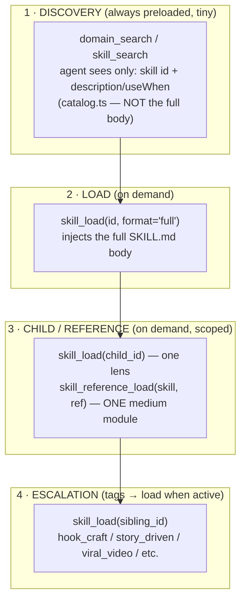
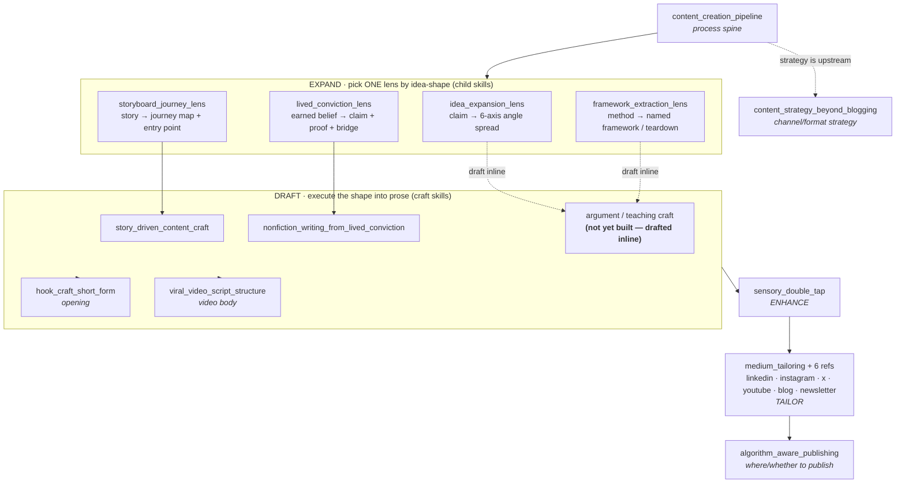
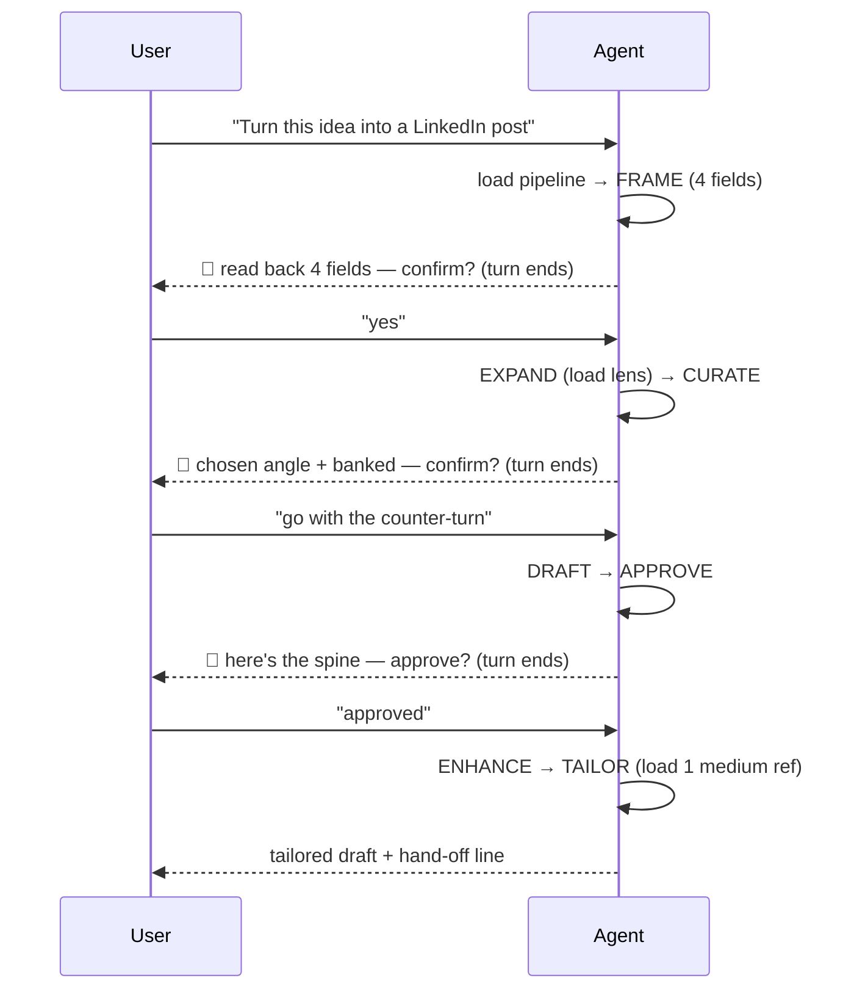

# Content Creation Skill Family — How It Works

> One-pager. The agentic-chat skill system that walks an agent from a raw idea to a
> ship-ready draft. Covers the runtime layers, the pipeline, the skill map, and the
> multi-turn gate model.
>
> Skills live in `apps/web/src/lib/services/agentic-chat/tools/skills/definitions/`.
> Authoring rules: `../skills/AUTHORING_GUIDE.md`.

---

## TL;DR

A **process-spine** skill (`content_creation_pipeline`) owns the _order of operations_ and the
_human gates_, and routes the actual craft to specialist skills. It does not pick channels and
it does not post. One idea in → one tailored, ship-ready draft out, across several user turns.

The design rule: **the spine orchestrates; the craft skills do the work.** Escalations are
_tags, not loads_ — the spine names a skill and only loads it when that lens becomes the active
step. Nothing is duplicated.

---

## The four runtime layers

How an agent actually gets from "user has an idea" to "loaded the right guidance." Each load is a
full agent-loop round trip, so the system is built to load the _least_ needed, _when_ needed.



Key facts (verified in the runtime):

- **Discovery is cheap and lean.** The agent sees only the `description` / catalog `useWhen` for each
  skill before loading — that text is the _entire_ routing API, so it must be in user vocabulary and
  must not collide between siblings.
- **Bodies load on demand, not preloaded.** Enriching a SKILL.md body costs nothing at the discovery
  layer — it only arrives when the agent calls `skill_load(format='full')`.
- **One medium reference at a time.** `medium_tailoring` carries six reference modules; the agent loads
  exactly one (`skill_reference_load`) for the target medium. Loading more is wasted context.
- **Escalation is unrestricted by id.** Any registered skill can be loaded when it becomes the active
  step; the spine names it as a tag and moves on.

---

## The pipeline — 8 stages, 3 gates

```
1. FRAME      Who exactly · what pain · the ONE idea · the target medium     🚦 confirm
2. EXPAND     Choose a framework (lens) → find the shape                      (route → child lens)
3. CURATE     Choose one path · bank the rest by name                         🚦 confirm
4. DRAFT      Write the plain spine in the shape the lens implies            (the hinge — see map)
5. APPROVE    Show the spine before any polish                                🚦 confirm
6. ENHANCE    Sensory double-tap: reinforce 2–4 beats, medium-aware          (route → sensory_double_tap)
7. TAILOR     Fit ONE medium's native format + amplification                 (route → medium_tailoring + 1 ref)
8. SHIP       Hand off: voice pass · post/schedule · what-comes-next          → hand off
```

The pipeline is fixed. Only two things vary: the **lens** chosen at Expand, and the **target medium**
carried from Frame all the way through.

---

## The skill map



**Reading the map:**

- The four **lenses** (Expand) are chosen by the _shape of the idea_: a claim, a story, an earned
  belief, or a teachable method. Each produces a _shape_, not prose.
- At **Draft**, the shape is executed into a spine. Story/conviction shapes have dedicated craft
  executors; claim/framework shapes are drafted inline (see Known Gaps).
- **Enhance → Tailor** are tactical: reinforce a few beats, then fit one medium's format.
- **Strategy skills** (`content_strategy_beyond_blogging`, `algorithm_aware_publishing`) sit
  _outside_ the pipeline — they decide _which channel / whether to publish_, which is upstream of
  formatting. The pipeline takes the medium as an input; it never picks the channel.

---

## Multi-turn gate & state model

The three 🚦 gates are **between-turn** decision points, not in-turn pauses. There is no
`pause_for_user_input` primitive — the agent ends its turn at a gate, the user replies on the next
turn, and the agent resumes from conversation history.



**Durable state carried across turns** = the 4 Frame fields, the chosen angle, and the banked angles
(by name). On resume the agent must pick up at the next stage — never re-Frame an already-framed idea.

---

## Known gaps (as of 2026-06-25)

- **Missing draft executors.** Claim-shaped (`idea_expansion_lens`) and framework-shaped
  (`framework_extraction_lens`) drafts have no dedicated craft skill — they're drafted inline with
  only `hook_craft_short_form` for the opening. Two skills would close this: an **argument/POV craft**
  and a **teaching/how-to craft** skill.
- **Resume-state guidance.** The multi-turn model above is how the runtime behaves, but the spine
  doesn't yet give the agent an explicit state block to restate each turn — a weak model can re-Frame
  or skip a gate on resume.
- **Executor depth asymmetry.** `nonfiction_writing_from_lived_conviction` (the conviction-path
  executor) is thinner than the lens that feeds it and lacks a worked example.

---

## File index

| Role | Skill id | Path |
| --- | --- | --- |
| Spine | `content_creation_pipeline` | `definitions/content_creation_pipeline/SKILL.md` |
| Lens (claim) | `idea_expansion_lens` | `definitions/idea_expansion_lens/SKILL.md` |
| Lens (story) | `storyboard_journey_lens` | `definitions/storyboard_journey_lens/SKILL.md` |
| Lens (conviction) | `lived_conviction_lens` | `definitions/lived_conviction_lens/SKILL.md` |
| Lens (method) | `framework_extraction_lens` | `definitions/framework_extraction_lens/SKILL.md` |
| Enhance | `sensory_double_tap` | `definitions/sensory_double_tap/SKILL.md` |
| Tailor | `medium_tailoring` (+ `references/*.md`) | `definitions/medium_tailoring/SKILL.md` |
| Craft (story) | `story_driven_content_craft` | `definitions/story_driven_content_craft/SKILL.md` |
| Craft (essay) | `nonfiction_writing_from_lived_conviction` | `definitions/nonfiction_writing_from_lived_conviction/SKILL.md` |
| Craft (opening) | `hook_craft_short_form` | `definitions/hook_craft_short_form/SKILL.md` |
| Craft (video) | `viral_video_script_structure` | `definitions/viral_video_script_structure/SKILL.md` |
| Strategy (channel) | `content_strategy_beyond_blogging` | `definitions/content_strategy_beyond_blogging/SKILL.md` |
| Strategy (publish) | `algorithm_aware_publishing` (+ refs) | `definitions/algorithm_aware_publishing/SKILL.md` |

Wiring: `skills/registry.ts` (`ALL_SKILLS`) · discovery `tools/domains/catalog.ts` · wrapper
`skills/marketing-content.skill.ts`.
