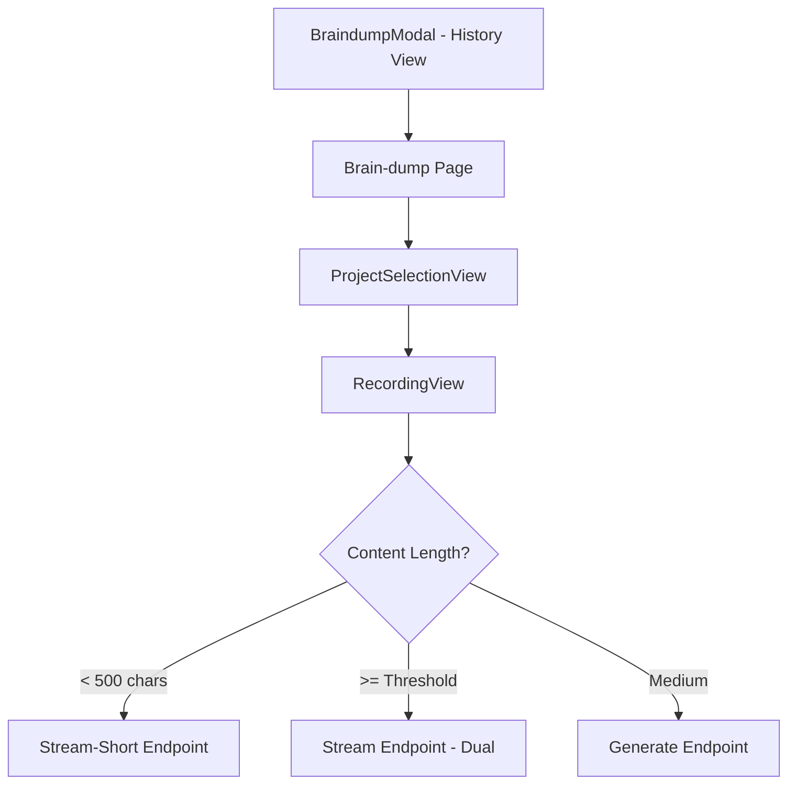

<!-- apps/web/docs/technical/audits/BRAINDUMP_FLOW_AUDIT_2025.md -->

# Brain Dump Flow Audit Report

_Date: AUGUST 29 2025_
_Auditor: Claude Code_

## Executive Summary

This audit analyzed the complete brain dump flow from UI to backend, focusing on the different processing paths, endpoints, services, and prompt templates. The system is sophisticated with multiple processing modes based on content length and project context, but there are several critical issues and opportunities for improvement.

## System Architecture Overview

### Processing Flows

The brain dump system has **4 distinct processing paths**:

1. **Short New Project** (< 500 chars, no project selected)
2. **Short Existing Project** (< 500 chars, project selected) - Uses streaming
3. **Long Content Dual Processing** (>= certain threshold) - Parallel context + task extraction
4. **Standard Single Processing** (medium length) - Sequential processing

### Thresholds

- **Short content**: < 500 characters → Special streaming endpoint
- **Dual processing**: Triggered by `shouldUseDualProcessing()` function based on:
    - Brain dump length + existing project context length
    - Threshold values defined in `/src/lib/constants/brain-dump-thresholds.ts`

## Flow Mapping

### 1. UI Entry Points



### 2. Endpoints

| Endpoint                       | Method         | Purpose                 | Processing Type                     |
| ------------------------------ | -------------- | ----------------------- | ----------------------------------- |
| `/api/braindumps/generate`     | POST           | Parse & Save operations | Single processing                   |
| `/api/braindumps/stream`       | POST           | Long content streaming  | Dual processing                     |
| `/api/braindumps/stream-short` | POST           | Short content streaming | Task-first with conditional context |
| `/api/braindumps/draft`        | GET/POST/PATCH | Draft management        | N/A                                 |
| `/api/transcribe`              | POST           | Audio transcription     | N/A                                 |

### 3. Services

- **BrainDumpService**: Frontend service orchestrating API calls
- **BrainDumpProcessor**: Main processing engine with LLM integration
- **ShortBrainDumpStreamProcessor**: Specialized processor for short content
- **PromptTemplateService**: Manages all prompt templates and formatting
- **OperationsExecutor**: Executes CRUD operations on database

## Critical Findings

### 🔴 Critical Issues

#### 1. **Type Mismatches in Prompt JSON Schemas**

**Issue**: The prompt templates expect different field names than TypeScript types in several places.

**Examples**:

- Tasks in prompts use `project_ref` for new projects, but TypeScript expects `project_id`
- Prompts return `compartmentalization_note` at root level, but TypeScript expects it in `metadata`
- Question analysis structure inconsistent between prompts

**Impact**: Potential runtime errors, data loss, or failed operations

**Fix Required**:

```typescript
// In ParsedOperation interface - needs to support both:
data: {
  project_id?: string;  // For existing projects
  project_ref?: string; // For new project references
  // ... other fields
}
```

#### 2. **Inconsistent Recurring Task Validation**

**Issue**: Recurring tasks have different validation rules in prompts vs backend.

**Prompt Requirements**:

- `start_date` REQUIRED if `task_type` is "recurring"
- `recurrence_pattern` REQUIRED if recurring
- `recurrence_ends` optional (defaults to project end date)

**TypeScript Types**: Missing explicit validation for these requirements

**Fix Required**: Add runtime validation in `OperationValidator` class

#### 3. **Project Questions Flow Issues**

**Issue**: Question generation and analysis happens in multiple places with potential duplication:

- Task extraction in dual processing
- Context processing (sometimes)
- Short braindump processing

**Impact**:

- Duplicate questions may be generated
- Question status updates may be missed
- Inconsistent `projectQuestions` structure in responses

### 🟡 Important Issues

#### 4. **Dual Processing Threshold Logic**

**Issue**: The threshold calculation is duplicated in frontend and backend.

**Location**:

- Frontend: Uses `shouldUseDualProcessing()` from constants
- Backend: Also uses the same function

**Risk**: If thresholds change, both places need updates

**Recommendation**: Centralize threshold decision in backend only

#### 5. **Error Handling Gaps**

**Issue**: Partial failures in operations execution not properly communicated to user.

**Example**: When 3/5 tasks succeed but 2 fail, the UI shows success but mentions failures in small text.

**Recommendation**: Implement clearer partial success UI states

#### 6. **Memory Management**

**Issue**: Processor cache in `/api/braindumps/generate/+server.ts` has limits but may still cause memory issues.

**Current**:

- MAX_CACHE_SIZE = 50
- CACHE_TTL = 10 minutes

**Recommendation**: Monitor memory usage and adjust limits based on production metrics

### 🟢 Positive Findings

1. **Comprehensive Prompt Engineering**: Excellent prompt templates with clear instructions and validation
2. **Streaming Support**: Good implementation of SSE for real-time progress updates
3. **Draft Management**: Robust draft saving and recovery system
4. **User Instruction Detection**: Prompts scan for meta-instructions about processing preferences
5. **Context Preservation**: Update operations properly merge rather than replace content

## Recommendations

### Immediate Actions (Priority 1)

1. **Fix Type Definitions**

    ```typescript
    // Update brain-dump.ts
    export interface ParsedOperation {
    	id: string;
    	table: TableName;
    	operation: OperationType;
    	data: {
    		// Support both patterns
    		project_id?: string;
    		project_ref?: string;
    		[key: string]: any;
    	};
    	// ... rest of fields
    }
    ```

2. **Add Recurring Task Validator**

    ```typescript
    // In OperationValidator class
    validateRecurringTask(task: any): ValidationResult {
      if (task.task_type === 'recurring') {
        if (!task.start_date) {
          return { valid: false, error: 'Recurring tasks require start_date' };
        }
        if (!task.recurrence_pattern) {
          return { valid: false, error: 'Recurring tasks require recurrence_pattern' };
        }
      }
      return { valid: true };
    }
    ```

3. **Fix Question Generation Flow**
    - Centralize question generation to task extraction phase only
    - Remove duplicate question generation from context processing
    - Ensure `projectQuestions` is always included in response (even if empty array)

### Short-term Improvements (Priority 2)

4. **Improve Partial Failure Handling**
    - Create dedicated UI component for showing operation results
    - Implement retry mechanism for failed operations
    - Log failed operations for debugging

5. **Optimize Prompt Templates**
    - Reduce token usage by removing redundant instructions
    - Create separate prompts for different scenarios (new vs existing project)
    - Consider using smaller models for simple extractions

6. **Add Comprehensive Testing**
    - Unit tests for prompt template outputs
    - Integration tests for different flow paths
    - End-to-end tests for critical paths

### Long-term Enhancements (Priority 3)

7. **Implement Prompt Versioning**
    - Version control for prompts
    - A/B testing capability
    - Rollback mechanism for prompt changes

8. **Add Analytics**
    - Track processing times by flow type
    - Monitor LLM token usage
    - Measure operation success rates

9. **Enhance Streaming Experience**
    - Show live preview of extracted tasks
    - Allow user to cancel/modify during processing
    - Implement progressive enhancement

## JSON Schema Alignment Issues

### Current Prompt Output Structure

```json
{
	"title": "string",
	"summary": "string",
	"insights": "string",
	"tags": ["string"],
	"compartmentalization_note": "string", // ⚠️ At root level
	"operations": [
		{
			"table": "projects|tasks",
			"operation": "create|update",
			"ref": "string", // ⚠️ Used for new projects
			"data": {
				"project_ref": "string" // ⚠️ For linking to new projects
			}
		}
	],
	"questionAnalysis": {}, // ⚠️ Optional, inconsistent
	"projectQuestions": [] // ⚠️ Optional, inconsistent
}
```

### Expected TypeScript Structure

```typescript
interface BrainDumpParseResult {
  title: string;
  summary: string;
  insights: string;
  operations: ParsedOperation[];
  tags?: string[];
  metadata: {
    compartmentalization_note?: string; // ⚠️ In metadata
    // ... other metadata
  };
  questionAnalysis?: Record<string, {...}>;
  projectQuestions?: Array<{...}>;
}
```

### Required Alignment

1. Move `compartmentalization_note` to metadata object in prompts
2. Standardize `ref` vs `project_ref` usage
3. Always include `questionAnalysis` and `projectQuestions` (even if empty)
4. Validate all operations have unique IDs

## Conclusion

The brain dump flow is well-architected with sophisticated processing paths, but requires immediate attention to type mismatches and validation gaps. The streaming implementation and prompt engineering are particularly strong, but the system would benefit from better error handling and clearer separation of concerns in question generation.

### Overall Assessment

- **Functionality**: 8/10 - Works well for most cases
- **Reliability**: 6/10 - Type mismatches pose risks
- **Maintainability**: 7/10 - Good structure, needs better documentation
- **Performance**: 8/10 - Good caching and streaming
- **User Experience**: 7/10 - Could improve error feedback

### Recommended Next Steps

1. Fix type mismatches immediately (1-2 days)
2. Implement validation improvements (2-3 days)
3. Add comprehensive tests (3-5 days)
4. Deploy monitoring for production insights (ongoing)

---

_End of Audit Report_
