<!-- apps/web/docs/technical/email/GMAIL-INGESTION-AND-PROJECT-RELEVANCE-ARCHITECTURE.md -->

# Gmail Ingestion and Project Relevance Architecture

**Created:** 2026-07-22  
**Status:** Research complete; audited 2026-07-22 against the deployed Phase 1/2 implementation and
the live Gmail API quota page  
**Scope:** Read-only discovery, project relevance, daily-brief inputs, and user-reviewed update
proposals  
**Out of scope:** Sending email, modifying Gmail, downloading attachments, autonomous project
changes, and a full-mailbox search index. Agentic-chat email tools are a parallel track specified in
[AGENT-CHAT-GMAIL-TOOLS-SPEC.md](AGENT-CHAT-GMAIL-TOOLS-SPEC.md); they reuse the same read gateway
and proposal rules but are not part of this ingestion pipeline.

## Decision summary

BuildOS should not make a Gmail API request against every connected mailbox every five minutes as
its primary synchronization strategy. The scalable design is:

1. perform a bounded, user-visible initial scan when background email awareness is enabled;
2. use Gmail `watch` plus authenticated Google Cloud Pub/Sub notifications to learn that a mailbox
   changed;
3. coalesce notifications into an idempotent per-connection queue job;
4. call `history.list` from the last durable history cursor and fetch metadata only for newly added
   messages;
5. retrieve a small set of plausible projects with deterministic and lexical matching before
   fetching a body or invoking a model;
6. show possible project links and possible updates in a review inbox;
7. let the daily brief consume reviewed or high-confidence signals, not raw mailbox contents; and
8. use a slower, state-aware safety sweep because Gmail documents that notifications can be delayed
   or dropped.

Working hours should control processing latency and model batching, not whether BuildOS observes an
email. Pub/Sub delivery and cursor capture should remain active at all times. During working hours,
classification can run within a few minutes; outside working hours, low-priority candidates can be
batched for 10–30 minutes or held for the next daily-brief preflight.

The first product release should be smaller than the final architecture: a user-configured initial
scan, a **Check for project email** control, and one catch-up sync shortly before the daily brief.
For the internal pilot, the recommended scan is 30 days or up to 1,000 messages per account. This is
large enough to test recall and cost before BuildOS turns on continuous push ingestion.

## Current implementation baseline (verified in code 2026-07-22)

This design builds on what is already deployed, not on a blank slate.

**Deployed and verified:**

- Multi-account read-only OAuth: `GmailReadOAuthService`
  (`apps/web/src/lib/server/gmail-read-oauth.service.ts`) with PKCE/nonce/single-use state, a
  dedicated `PRIVATE_GMAIL_READ_CLIENT_ID` OAuth client, strict `gmail.readonly` scope policing at
  both the service and RPC layer, AES-256-GCM account-bound token encryption, and a five-connection
  cap. Schema and RPCs live in migration `20260722000000_gmail_read_connections.sql`
  (`user_email_connections`, `email_connection_credentials`, `email_capability_grants`,
  `email_oauth_states`, `email_access_audit_events`).
- Server-only read gateway: `gmail-read-gateway.ts` (GET-only `messages.list`/`messages.get`,
  response-size and MIME caps, HTML→text sanitization, attachment blocking, content-free audit
  rows), plus encrypted 15-minute pagination cursors (`gmail-read-cursor.ts`) and in-memory
  per-user/per-connection rate limits.
- UI: the profile Email tab with connect/label/reconnect/disconnect and bounded multi-account
  search/read.

**Not yet built (the subject of this document):** Gmail queue job types, sync-state/observation/
candidate/rule/proposal tables, the Pub/Sub webhook, watch registration, project email profiles,
the classifier lane, the review surface, and agent chat email tools.

**Hygiene status (2026-07-22):** the Gmail modules are typed against a hand-authored schema
mirror (`apps/web/src/lib/server/gmail-database.types.ts`) that matches migration
`20260722000000` exactly; no `SupabaseClient<any>` remains in the Gmail modules. The generated
types (`packages/shared-types/src/database.types.ts`) still lack these tables because `pnpm
gen:all` requires an authenticated Supabase CLI (`--allow-stale` silently keeps stale output
otherwise). Once regeneration runs, swap the mirror for re-exports per its header comment.

## The important product distinction

There are three different operations, and the UI and data model should not blur them:

1. **Observe:** BuildOS notices a provider message ID and reads enough metadata to evaluate it.
2. **Suggest:** BuildOS proposes that an email belongs to a project or contains a possible task,
   decision, risk, event, or progress update.
3. **Apply:** A user accepts a proposal and creates or updates durable BuildOS project data.

V1 may observe and suggest. It must not automatically apply project mutations. An email is untrusted
external input; a sentence inside an email must never be treated as an instruction to an agent or as
authorization to update a project.

## Why fixed five-minute polling is the wrong default

The proposed schedule of every five minutes from 08:00–18:00 and every ten minutes otherwise creates
204 Gmail checks per connected account per day:

- 10 working hours × 12 checks/hour = 120;
- 14 other hours × 6 checks/hour = 84;
- total = 204 checks/account/day.

With three accounts, that is 612 calls per BuildOS user per day even when no new mail exists. At
1,000 users with three connected accounts, it becomes 612,000 Gmail calls per day; at 10,000 users,
6.12 million calls per day before fetching a single message.

Under Google's current Gmail API quota model, `history.list` costs 2 units, `messages.list` costs 5,
`messages.get` costs 20, and `watch` costs 100. The Gmail project also has per-minute and daily
thresholds, and Google changed this model in May 2026. The larger cost is not only Gmail quota: fixed
polling creates empty jobs, database writes, logs, retries, and model-triggering opportunities that
grow with connected accounts instead of with actual mailbox activity.

### Options considered

| Option                              | Freshness               | Empty work | Operational complexity | Recommendation                                      |
| ----------------------------------- | ----------------------- | ---------- | ---------------------- | --------------------------------------------------- |
| Five/ten-minute mailbox polling     | 5–10 minutes            | High       | Low initially          | Pilot fallback only                                 |
| Daily-brief-only scan               | Up to one day           | Low        | Low                    | Good first learning release, insufficient long term |
| Gmail Pub/Sub only                  | Usually seconds         | Very low   | Medium                 | Insufficient alone because notifications can drop   |
| Pub/Sub plus state-aware catch-up   | Seconds to a few mins   | Low        | Medium                 | Target architecture                                 |
| Full mailbox index and vector store | Fast semantic retrieval | Very high  | Very high              | Explicitly deferred                                 |

Google describes Pub/Sub push as the mechanism that avoids the network and compute costs of polling.
Google also says notifications can occasionally be delayed or dropped, so the correct answer is a
hybrid: push-triggered incremental sync plus a bounded fallback.

## Recommended end-to-end flow

```mermaid
flowchart LR
    A["Gmail mailbox changes"] --> B["Google Pub/Sub notification"]
    B --> C["Authenticated BuildOS webhook"]
    C --> D["Coalesced per-connection sync signal"]
    D --> E["sync_gmail_connection queue job"]
    E --> F["Gmail history.list from durable cursor"]
    F --> G["New message IDs and minimal metadata"]
    G --> H["Cheap rules and project candidate retrieval"]
    H -->|"not a candidate"| I["Discard or retain operational ID only"]
    H -->|"candidate"| J["Bounded safe-text fetch"]
    J --> K["Tool-free relevance classifier"]
    K --> L["Email relevance review inbox"]
    L -->|"confirm"| M["Project link or update proposal"]
    L -->|"reject"| N["User rule and evaluation feedback"]
    M --> O["Daily brief and project activity context"]
```



### 1. Pub/Sub ingress

Create one topic and one authenticated push subscription in the dedicated Gmail Read Google Cloud
project. Grant `roles/pubsub.publisher` on the topic only to
`gmail-api-push@system.gserviceaccount.com`.

The webhook must:

- verify the Google-signed OIDC JWT, signature, issuer, audience, expected service-account email,
  and `email_verified` claim;
- require the exact expected subscription and reject oversized or malformed envelopes;
- decode only the documented `emailAddress` and `historyId` payload;
- treat `emailAddress` as a routing hint, never as authorization;
- map it to exactly one active connection sync-state row, then re-run the normal connection,
  capability, credential-kind, and scope checks before Gmail access;
- atomically retain the highest observed history ID and enqueue a deduplicated sync job; and
- acknowledge quickly without fetching messages or calling an LLM inline.

Gmail history IDs can exceed safe JavaScript number precision. Keep them as strings or lossless
database numerics and compare them without converting to `number`.

### 2. Watch registration and renewal

In the continuous-sync architecture, register a watch before starting the initial backfill. Persist
the returned baseline `historyId` and expiration, then backfill recent messages and run a final delta
from that baseline. Provider message IDs make this race-safe and idempotent. Before Pub/Sub ships,
the manual/daily-brief pilot can capture a baseline from `getProfile` and use the same final-delta
pattern without a watch.

Google requires each watch to be renewed at least every seven days and recommends daily renewal.
BuildOS should renew daily with per-account jitter, using a database lease so multiple Railway
replicas cannot renew the same connection concurrently.

Watch the mailbox broadly, but ask `history.list` for `messageAdded` changes and discard drafts,
spam, and trash. Watching only `INBOX` reduces notifications but can miss legitimate project mail
that a Gmail filter archives immediately. This choice should be tested in the internal pilot.

**Pilot constraint:** the Gmail Read OAuth app is still in External/Testing mode, where Google
expires refresh tokens after seven days. Until restricted-scope verification completes (or the
pilot accounts move under an Internal-mode Workspace client), every connection will drop into
`reconnect_required` roughly weekly. Phases A and B tolerate this because a manual or brief-time
trigger surfaces the reconnect prompt; Phase C continuous sync should not be considered reliable
before verification, and its health monitoring must treat expired-grant reconnects as an expected
category rather than an incident.

### 3. Incremental synchronization

Each `sync_gmail_connection` job should:

1. lock or lease one connection's sync state;
2. validate ownership, active read capability, credential kind, and exact stored Gmail scopes;
3. call paginated `history.list` from `last_processed_history_id`;
4. collect and deduplicate newly added provider message IDs;
5. fetch `messages.get?format=metadata` in bounded batches;
6. persist only the approved minimal observation and relevance state;
7. advance `last_processed_history_id` only after every page is durably processed; and
8. record content-free run metrics.

Duplicate, delayed, and out-of-order notifications are normal. The job must be safe to replay. A
notification that arrives while a job is active should update the pending high-water mark rather
than create parallel work.

If Gmail returns `404` because the stored history ID is no longer available, run a bounded recent
resync, not an unlimited mailbox import. Google says history is often available for at least a week
but may sometimes cover a shorter period.

### 4. State-aware safety sweep

The worker scheduler may run every five minutes, but it should query only indexed sync-state rows
whose `next_sync_due_at` has passed. It should not call Gmail for every account on every scheduler
tick.

Suggested targets after Pub/Sub is enabled:

| Condition                                 | Catch-up behavior                                |
| ----------------------------------------- | ------------------------------------------------ |
| Active work hours and no successful sync  | Run a delta after 30 minutes of silence          |
| Outside work hours                        | Run a delta after 1–2 hours of silence           |
| Daily brief due soon                      | Force a catch-up 10–15 minutes before generation |
| Watch expires within 24 hours             | Renew with jitter                                |
| Pub/Sub incident or elevated delivery lag | Temporarily tighten the fallback interval        |
| Reconnect or expired history cursor       | Bounded recent resync                            |

Default working hours can come from `users.timezone` and a new 08:00–18:00 weekday preference, but
the user should be able to change them. Working hours affect classification SLA and fallback
freshness, not security or retention.

## Initial connection ingestion

Do not start by indexing years of mail. The initial scan exists to establish useful project matches,
not to recreate Gmail inside BuildOS.

### Recommended scan choices

The user should choose the account, projects, time window, and maximum message count before the
scan. Product presets make the cost understandable without removing that control:

| Preset                   | Window  | Message cap/account | Intended use                               |
| ------------------------ | ------- | ------------------- | ------------------------------------------ |
| Quick                    | 7 days  | 250                 | Low-friction external-user first scan      |
| Recommended internal V1  | 30 days | 1,000               | DJ pilot and relevance evaluation          |
| Deep, explicit expansion | 90 days | 3,000               | Only after the first result and cost recap |

All presets:

- require the user to enable **Find project-related email** for each connected account;
- exclude spam, trash, and drafts, while including sent mail so relationships and prior thread
  context can be learned;
- inspect headers and safe snippets first rather than submitting 1,000 bodies to a model;
- fetch sanitized body text only for the strongest candidates;
- never fetch attachments or remote URLs;
- stop and show partial progress when a quota, time, model-cost, or content limit is reached; and
- allow the user to narrow the scan by Gmail label or broaden it with another explicit scan.

A 1,000-message metadata scan uses roughly 20,000 Gmail quota units for `messages.get`, plus list
pages. Under the current 6,000-unit per-minute per-user limit, it must be resumable and spread over
at least roughly four minutes per account rather than dispatched as one burst. This is an ingestion
job with progress and checkpoints, not a synchronous connect-screen request.

The connection flow should let the user choose which active projects and which accounts participate.
For DJ's pilot, the 9takes mailbox can be evaluated primarily against 9takes, the BuildOS mailbox
against BuildOS, and the Cadre mailbox against Cadre while still permitting cross-project matches.
This account-to-project prior is a ranking hint, not a hard authorization boundary.

### Race-free order for continuous sync

1. create the sync-state row;
2. register `watch` and persist its baseline cursor;
3. enqueue the bounded backfill;
4. deduplicate on `(connection_id, provider_message_id)`;
5. run `history.list` from the watch baseline; and
6. mark initial ingestion complete only when backfill and catch-up both finish.

During the earlier manual/daily-brief pilot, replace step 2 with a `getProfile` history baseline and
keep the same deduplication and final-delta requirements.

## How to determine project relevance

Relevance should be a cascade, not one large LLM prompt over the inbox.

### Stage A — Build a flexible, versioned project email profile

The profile should not be one frozen AI-written paragraph. It is a small structured retrieval
document with separately weighted fields:

- **identity:** project name, intentional aliases, product names, and unique vocabulary;
- **actors:** known client, vendor, teammate, stakeholder, and service email addresses or domains;
- **artifacts:** linked document, repository, product, and customer domains or URLs;
- **identifiers:** task, ticket, contract, invoice, campaign, event, and external-system IDs;
- **semantic context:** a capped recent summary, current goals, deliverables, and active workstreams;
- **negative evidence:** nearby projects, misleading generic words, excluded senders/domains, and
  concepts that look similar but should not match;
- **user rules:** Gmail labels, senders, domains, recipient aliases, or threads explicitly mapped or
  suppressed by the user; and
- **recency layer:** recent collaborators, identifiers, and focus terms that expire or refresh
  without rewriting the stable identity fields.

Build a new version after a material project change or a bounded TTL, not for every email. The UI
should expose aliases, important people/domains, and exclusions so the user can correct the profile;
derived context can remain system-managed and cite its BuildOS source.

The profile is used as a retrieval index, not as a global prompt. Sender/domain fingerprints,
identifiers, aliases, and user rules shortlist at most three to five plausible projects. Lightweight
full-text scoring over subject and snippet then ranks that shortlist. Only ambiguous candidates
reach a model, and the model sees the shortlist instead of every project. A conceptual score is:

```text
project candidate score =
  confirmed thread/rule evidence
  + actor/domain overlap
  + unique identifier or artifact overlap
  + subject/snippet lexical similarity
  + recent-project and source-account priors
  - negative-profile evidence
```

This structure is what makes the profile flexible: exact evidence catches obvious mail, semantic
context catches changing language, negative evidence separates similar projects, and corrections
become durable rules. Reuse the ownership checks and compact data-loading approach behind
`project_context_snapshot`, but do not send the entire project graph to the email classifier.

### Stage B — Deterministic candidate generation

Run cheap evidence before reading a body:

**Strong positive signals**

- the provider thread was already confirmed for the project;
- the user created an always-link rule for the sender, domain, recipient alias, or Gmail label;
- a participant is a known project member or actor;
- the subject contains a unique project alias, external identifier, or known project URL; or
- the message is a reply in a confirmed project thread.

**Medium signals**

- sender domain or participants overlap a project profile;
- project keywords appear in subject or snippet;
- timing and participants overlap a linked calendar event; or
- the connected-account label is a strong prior for the project.

**Negative signals unless explicitly overridden**

- spam, trash, drafts, bulk marketing, list mail, social updates, and generic promotions;
- no-reply or automated traffic with no known project identifier; and
- messages older than the selected ingestion window.

Automated messages are not universally irrelevant—GitHub, Stripe, Vercel, travel, and procurement
notifications may matter—so user rules must be able to override negative priors.

### Stage C — Bounded, batched model classification

Only candidate messages enter the model lane. Supply:

- source account and provider IDs;
- sanitized subject, participants, date, and a capped snippet/body excerpt;
- a shortlist of plausible project profiles rather than every project; and
- a strict response schema containing `project_id`, confidence, evidence categories, update types,
  and `abstain`.

The classifier must have no tools, no Gmail write authority, and no project mutation authority. It
must run through the approved zero-data-retention path with data collection denied. Strip quoted
history, signatures, trackers, HTML, remote references, and attachment contents before the call.

Use a cheap classifier, not an autonomous agent loop. Group approximately 20–25 metadata/snippet
records with a reused compact project-profile block into one schema-constrained call. Each message
receives one independent output object and can abstain. Escalate only a small ambiguous subset to
sanitized body excerpts or a stronger model. Never let the model decide how many more emails to
fetch, which projects to inspect, or whether to retry itself.

Treat all message text as untrusted data. Prompt text such as “ignore previous instructions” cannot
change the schema, access another account, request more project context, or invoke an operation.

### Stage D — Confidence policy

Initial policy:

| Outcome                       | Policy                                                          |
| ----------------------------- | --------------------------------------------------------------- |
| Deterministic user rule       | Auto-link the email reference; still create no project entity   |
| Very high model confidence    | Show prominently as a suggested project link                    |
| Medium confidence             | Put in **Needs review** with the top two project choices        |
| Low confidence or ambiguity   | Abstain and discard transient content                           |
| Possible task/update detected | Create a local proposal only after the project link is accepted |

Do not enable model-only auto-linking until an internal labeled set demonstrates at least 99%
precision for the exact cohort and the UI offers an obvious undo path. Even then, creating tasks,
events, decisions, risks, or project logs remains a separate approval decision.

### Stage E — Learn from corrections

The review UI should support:

- **Link to project**;
- **Choose another project**;
- **Not relevant**;
- **Always link this sender/domain/label to this project**;
- **Never suggest this sender/domain**; and
- **Turn this into…** task, event, decision, risk, note, or progress proposal.

Prefer explicit deterministic rules learned from these actions before attempting model
personalization. Feedback becomes an evaluation record; it must not silently broaden mailbox access
or retention.

## Daily brief behavior

The daily brief should be a consumer of the email relevance pipeline, not the only synchronization
mechanism and not an excuse to ingest a mailbox wholesale.

Ten to fifteen minutes before a user's brief:

1. enqueue a deduplicated catch-up sync for each opted-in connection;
2. wait within a bounded deadline, then generate even if one mailbox is unavailable;
3. include confirmed project links and optionally a small **Email updates to review** section for
   high-confidence suggestions; and
4. cite the source account and provider message/thread reference without storing or printing an
   entire email body.

The brief can say “Three possible BuildOS email updates need review.” It should not state an
unconfirmed model inference as project fact.

## Proposed storage model

This is a design target, not authorization to create a migration yet.

### `email_connection_sync_state`

- `connection_id` primary key;
- mode: `off | manual | brief_only | continuous`;
- watch baseline/current/processed/pending history IDs;
- watch expiration and last renewal;
- initial backfill state and cursor;
- last notification, attempt, success, and error category;
- `next_sync_due_at`, lease owner, and lease expiry;
- working-hours preference reference; and
- created/updated timestamps.

### `email_message_observations`

- user and connection IDs;
- provider message and thread IDs;
- internal date and minimal label categories;
- keyed, per-user participant/domain fingerprints needed for matching;
- processing status and retention expiry;
- no raw body, raw MIME, attachment, or OAuth data; and
- unique `(connection_id, provider_message_id)`.

Subject, participant addresses, and snippets are restricted data. Prefer request-lifetime use. If
the review UX requires a temporary cache, encrypt one bounded display payload with a short expiry and
delete it after review.

### `email_project_profiles`

The Stage A retrieval document needs a durable, versioned home; it is not the same thing as the
prompt-oriented `project_context_snapshot`:

- project and user IDs;
- version, status (`active | superseded`), and the material-change or TTL reason it was built;
- structured matching fields (identity aliases, actor addresses/domains, artifact domains,
  external identifiers) stored as queryable columns/JSONB, not prose;
- capped semantic context and negative-evidence text;
- recency-layer fields with their own refresh timestamp;
- source references to the BuildOS entities each field was derived from; and
- created/updated timestamps.

User-authored rules stay in `email_project_rules`; the profile holds derived and curated matching
data only, so a profile rebuild can never delete a user correction.

### `email_project_candidates`

- observation, project, and user IDs;
- confidence and classifier/rule version;
- evidence categories without copied message text;
- state: `suggested | confirmed | rejected | superseded | expired`;
- decision actor/time; and
- unique active candidate per observation/project.

### `email_project_rules`

- user, optional connection, and project IDs;
- rule kind: sender, domain, recipient alias, Gmail label, or thread;
- encrypted or normalized match value as appropriate;
- action: `suggest | auto_link_reference | suppress`;
- provenance and created/disabled timestamps.

### `email_project_update_proposals`

- confirmed project link;
- proposed entity kind and bounded encrypted proposal payload;
- state: `proposed | accepted | rejected | expired`;
- exact user approval and resulting entity ID; and
- no capability to send or modify email.

### `email_sync_runs`

Content-free operational metrics only: trigger, pages, history records, candidate counts, provider
quota units, timings, cursor outcome, and safe error category.

## Mapping onto the current BuildOS architecture

- The public Pub/Sub webhook belongs in the web application because the Gmail read gateway and token
  boundary already live there.
- The webhook should use the existing `queue_jobs` and `add_queue_job` dedup primitive.
- Add explicit queue types for initial backfill, incremental sync, relevance classification, watch
  renewal, and retention cleanup.
- Follow the existing `sync_calendar` pattern: the Railway worker claims a job and calls a private,
  authenticated web endpoint when an operation must remain inside the web app's Gmail credential
  boundary (`calendarSyncWorker.ts` → `/api/webhooks/calendar-sync-job` with
  `PRIVATE_BUILDOS_WEBHOOK_SECRET` is the working reference).
- Respect Vercel function limits: the calendar callback pattern works because each call is small. A
  1,000-message backfill spread over four-plus minutes of quota pacing cannot be one web request.
  Each worker→web call must process one bounded batch (for example, one `history.list` page or at
  most ~50 metadata fetches), persist a checkpoint, and return; the worker loop owns iteration,
  pacing, and retry. The web endpoint must be safe to call again with the same checkpoint.
- Queue metadata contains IDs and cursors only, never subjects, bodies, recipients, or model prompts.
- Reuse user timezone handling from the daily-brief scheduler.
- Reuse `project_context_snapshot`'s compact, TTL-gated project context approach and per-project
  deduplication.
- Feed confirmed email signals into the canonical ontology/daily-brief loaders only after the email
  pipeline has its own access, retention, and prompt-injection tests.

Do not give the general Railway worker a raw Gmail client or copy Gmail encryption keys into every
processor merely for convenience. If a later dedicated ingestion service is needed, give it a
separate service identity and the minimum read-only secret set.

## Cost and quota controls

Track quota units rather than only request counts:

```text
daily quota units ≈
  accounts × watch renewals × 100
  + history pages × 2
  + search/list pages × 5
  + fetched messages × 20
```

Controls:

- initial scan caps per account and per minute;
- token buckets per Gmail account and Google Cloud project;
- notification debounce and one active sync lease per connection;
- batch metadata fetches for latency, while remembering batching does not remove Gmail quota cost;
- body fetch only after deterministic candidate generation;
- one classification result per new message version, with model calls batched and thread
  inheritance used where safe;
- capped body characters and shortlisted projects;
- daily per-user model and Gmail budgets with graceful deferral;
- exponential backoff for `429` and retryable provider failures; and
- feature flags and kill switches for backfill, push ingress, classification, and daily-brief use.

Because Google's current 80-million-unit daily threshold and future billing details can change, do
not design to the threshold. Instrument quota from the first internal account and forecast by active
connections, messages added, bodies fetched, and classifications performed.

### Concrete model-cost envelope

BuildOS already routes structured JSON through several inexpensive OpenRouter models. Current list
prices on 2026-07-22 are:

| Candidate model       | Input / 1M tokens | Output / 1M tokens | Role in pilot                          |
| --------------------- | ----------------- | ------------------ | -------------------------------------- |
| Nex-N2-Mini           | $0.025            | $0.10              | Cheapest challenger; benchmark first   |
| DeepSeek V4 Flash     | $0.098            | $0.196             | Recommended initial baseline           |
| Gemini 3.1 Flash Lite | $0.25             | $1.50              | Higher-cost quality/control challenger |

Price alone does not select the model. Nex-N2-Mini is new and single-provider; all three must be
tested for project recall, false matches, abstention, schema validity, prompt-injection resistance,
provider retention eligibility, and availability before one becomes the production lane.

For a conservative budget illustration that includes repeated compact project-profile context,
assume every 20-message batch uses 8,000 input tokens and 1,200 output tokens. Scanning all 1,000
metadata/snippet records takes 50 calls, 400,000 input tokens, and 60,000 output tokens:

| Candidate model       | Classify all 1,000 | If rules leave only 30% | Incremental deep review of 50\* |
| --------------------- | ------------------ | ----------------------- | ------------------------------- |
| Nex-N2-Mini           | about $0.016       | about $0.005            | about $0.004                    |
| DeepSeek V4 Flash     | about $0.051       | about $0.015            | about $0.012                    |
| Gemini 3.1 Flash Lite | about $0.190       | about $0.057            | about $0.040                    |

\*Deep review assumes 2,000 input and 200 output tokens for each of 50 candidates. Figures exclude
retries and future price changes and must be replaced with provider-reported usage from the pilot.

The implication is important: even the intentionally wasteful “classify every metadata record”
case is measured in cents per 1,000 messages with these models. The safer architecture still filters
first because it reduces privacy exposure, latency, false positives, and dependence on a provider—not
only cost.

For steady state, Pub/Sub and `history.list` should produce work only when a mailbox changes; an
account with no new email produces no classification call. At 50 new messages per account per day,
classifying every message with the same DeepSeek assumptions is about $0.08/account/month, or about
$0.23/month for three accounts, before retries. Deterministic filtering to 30% lowers the modeled
portion to roughly $0.07/month across three accounts. Actual usage, not these estimates, decides the
production budget.

Initial pilot ceilings:

- reserve at most **$0.25 per account** for an initial scan and stop before dispatch if the durable
  reservation would exceed it;
- require a new explicit budget confirmation for the 90-day deep-expansion preset instead of
  silently inheriting the first scan's allowance;
- cap ongoing classification at **$0.02 per account/day** and **$1 per user/month**, deferring
  low-priority work when either limit is reached;
- store provider-reported cost, model, tokens, scan ID, and candidate counts without message text;
- price and reserve every paid attempt before it is sent, then settle the reservation from actual
  provider usage; and
- fail closed when price, ZDR eligibility, reservation, or usage accounting is unavailable.

These are guardrails for the experiment, not permanent product economics. Phase A should report
cost per observed message, model candidate, reviewed suggestion, and confirmed useful project
signal so later limits are evidence-based.

## What comparable products teach us

### Shortwave: powerful, but deliberately expensive

Shortwave describes a full-email AI search system using traditional search, metadata, embeddings, a
per-user vector namespace, heuristic reranking, cross-encoders, LLM calls, and substantial CPU/GPU
infrastructure. It first uses metadata and heuristics, then loads full content only for the reduced
candidate set. The sequencing is useful for BuildOS; the full-mailbox indexing footprint is not an
appropriate starting point for BuildOS.

### Front: rules remain valuable

Front routes conversations using deterministic sender, domain, subject, body, inbox, and tag rules.
This supports making user rules a first-class layer rather than expecting a model to rediscover the
same project relationship on every email.

### Linear, Todoist, and ClickUp: explicit intake is the reliable baseline

- Linear gives teams explicit email intake addresses and sends resulting items to a triage queue.
- Todoist lets users forward directly to a specific project or task, then optionally uses Email
  Assist to extract task details.
- ClickUp's primary documented Gmail flow lets the user attach an opened email to an existing or new
  task.

The shared lesson is that explicit routing and review remain important even in AI-enabled products.
BuildOS can be smarter by suggesting the project automatically, but it should retain an explicit,
auditable intake path.

## Phased delivery plan

### Phase A — Relevance learning loop

**Goal:** learn what “relevant to a project” means before continuous ingestion.

- add account-level opt-in and initial-scan disclosure;
- offer user-configurable scan parameters and run the recommended 30-day/up-to-1,000-message
  backfill for each of DJ's three accounts;
- implement project email profiles and deterministic candidate generation;
- run a controlled relevance bakeoff over the same sampled messages:
    - A: explicit rules and hard identifiers only;
    - B: structured profile plus lexical retrieval;
    - C: retrieval plus a cheap batched classifier; and
    - D: optional offline embedding challenger, without creating a production mailbox vector index;
- show suggestions in an email relevance review surface;
- add **Check for project email** and user feedback rules;
- store no bodies or attachments; and
- do not feed unreviewed suggestions into project state.

Review all proposed positives and a stratified random sample of apparent negatives; reviewing only
suggestions cannot measure missed relevant email. Aim for at least 100 adjudicated messages per
account, while ensuring each known project has positive examples where the mailbox contains them.

**Gate:** at least 300 reviewed pilot decisions across the three accounts, candidate recall at least
95%, high-confidence precision at least 90%, wrong-project rate under 1%, the initial cost ceiling
holding, wrong-account isolation tests passing, and no content leakage in logs or queue metadata.

**Immediate implementation order:**

1. define the versioned project-profile schema and a read-only profile preview for DJ's projects;
2. define the scan manifest, checkpoints, quota counters, and fail-closed model-cost reservation;
3. implement the metadata-only scan and variants A/B without model calls;
4. add the tool-free batch-classifier harness for variants C/D behind an internal flag;
5. add the review/adjudication surface and evaluation report; and
6. choose a model and thresholds only after the three-account bakeoff, then decide whether Phase B
   is warranted.

### Phase B — Daily-brief catch-up

**Goal:** produce useful email awareness once per day without always-on ingestion.

- establish history cursors;
- run a catch-up 10–15 minutes before the brief;
- show confirmed updates and a small review count;
- add partial-account and stale-sync disclosure; and
- measure quota/model cost per useful suggestion.

**Gate:** suggestion precision at least 90%, median review burden acceptable, and daily brief never
presents an unconfirmed inference as fact.

### Phase C — Push-triggered continuous sync

**Goal:** fresh signals without fixed mailbox polling.

- provision topic, authenticated push subscription, and IAM;
- implement watch registration, daily renewal, stop, and health monitoring;
- add the coalescing webhook and incremental sync jobs;
- add 30-minute work-hours and 1–2-hour off-hours fallback sweeps;
- handle expired history with bounded resync; and
- roll out behind `gmail_continuous_sync` to the internal cohort.

**Gate:** p95 work-hours sync lag under five minutes, no duplicate visible suggestions, recovery from
dropped/out-of-order notifications proven, and quota budgets healthy.

### Phase D — Project update proposals

**Goal:** convert confirmed relevant email into useful BuildOS changes.

- extract proposed tasks, events, decisions, risks, notes, and progress updates;
- require exact project and payload review before creating durable entities;
- preserve connection/message/thread provenance;
- feed accepted changes into project review signals and daily briefs; and
- define disconnect behavior for accepted derived records.

**Gate:** proposal acceptance/rejection metrics, undo behavior, prompt-injection suite, and explicit
product approval for every entity mutation type.

### Phase E — Optional semantic retrieval

Consider a short-lived or confirmed-email-only embedding index only if measured candidate recall is
insufficient. A full mailbox vector index requires a new privacy, retention, Google verification,
security, and cost decision. It is not part of Phases A–D.

## Evaluation and observability

Track without message content:

- notification-to-sync and message-to-suggestion latency;
- notification, history, and bounded-resync counts;
- duplicate and out-of-order notification rate;
- Gmail quota units per connected account/day;
- metadata/body fetch ratio;
- candidates per observed message and model calls per candidate;
- suggestion confirmation, correction, rejection, and expiration rates;
- candidate recall on a reviewed sample;
- precision, wrong-project rate, and abstention rate;
- cost per confirmed useful project signal;
- daily-brief email-signal usage; and
- retention/deletion backlog.

Initial quality targets:

- at least 95% candidate recall on the labeled internal sample;
- at least 90% precision for suggestions shown as high confidence;
- under 1% wrong-project suggestion rate;
- zero autonomous project mutations;
- zero message content in logs, analytics, queue metadata, or audit rows; and
- p95 continuous-sync freshness under five minutes during working hours.

## Decisions required before implementation

1. Is the default opt-in mode `manual`, `brief_only`, or `continuous`? Recommendation: `manual` for
   external users, `continuous` only for the internal pilot.
2. Which initial scan preset is appropriate? Recommendation: 7 days/250 messages for the public
   default, 30 days/up to 1,000 per account for the internal evaluation, and an explicit 90-day
   expansion only after showing the first scan's cost and results.
3. May temporary encrypted subject/snippet data be stored for a review queue, and for how long?
   Recommendation: avoid it in Phase A if on-demand display performs adequately; otherwise seven
   days maximum.
4. Are sent messages included? Recommendation: include them in the bounded initial scan and in
   already-linked threads, but prioritize newly received messages during continuous sync.
5. Can a user-authored sender/domain rule auto-link an email reference? Recommendation: yes, but it
   still cannot create a project entity.
6. Which accepted project entity types survive Gmail disconnect? Recommendation: user-accepted
   project records remain, while provider links and transient email data are deleted; disclose this
   choice during acceptance and disconnect.
7. Which zero-data-retention model route is approved for unsolicited email content? No model lane
   ships until this is explicit and fail-closed.

## Definition of done

- Each connected account has independent opt-in, watch, cursor, quota, and deletion state.
- New-mail observation is event-driven with tested fallback recovery.
- Initial and recovery syncs are bounded and resumable.
- Provider IDs make every stage idempotent and preserve account provenance.
- Deterministic rules precede model processing.
- The model is tool-free, ZDR, schema-constrained, and prompt-injection tested.
- Unreviewed email cannot change project state or trigger an email action.
- Daily briefs distinguish confirmed facts from suggestions.
- Disconnect stops the watch and deletes sync state, transient content, and unaccepted candidates.
- Operators can disable watches, ingestion, AI classification, daily-brief consumption, and project
  proposal creation independently.

## References

### Google and infrastructure

- [Configure Gmail push notifications](https://developers.google.com/workspace/gmail/api/guides/push)
- [Synchronize clients with Gmail](https://developers.google.com/workspace/gmail/api/guides/sync)
- [Gmail API usage limits](https://developers.google.com/workspace/gmail/api/reference/quota)
- [Authenticate Pub/Sub push subscriptions](https://cloud.google.com/pubsub/docs/authenticate-push-subscriptions)
- [OpenRouter zero-data-retention controls](https://openrouter.ai/docs/guides/features/zdr)

### Model pricing checked 2026-07-22

- [Nex-N2-Mini on OpenRouter](https://openrouter.ai/nex-agi/nex-n2-mini)
- [DeepSeek V4 Flash on OpenRouter](https://openrouter.ai/deepseek/deepseek-v4-flash/api?sort=price)
- [Gemini 3.1 Flash Lite on OpenRouter](https://openrouter.ai/google/gemini-3.1-flash-lite/pricing)

### Comparable product patterns

- [Shortwave: A deep dive into email AI](https://www.shortwave.com/blog/deep-dive-into-worlds-smartest-email-ai/)
- [Shortwave AI filters and sender rules](https://www.shortwave.com/docs/guides/customize-your-shortwave-settings/)
- [Front routing and triage rules](https://help.front.com/en/articles/2120)
- [Linear issue intake via email](https://linear.app/docs/creating-issues)
- [Todoist email forwarding and Email Assist](https://www.todoist.com/help/articles/forward-emails-to-todoist-JPJ1V339)
- [ClickUp: add Gmail messages to tasks](https://help.clickup.com/hc/en-us/articles/12664128434583-Add-emails-to-tasks)
