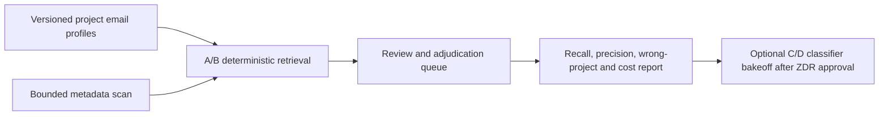

<!-- apps/web/docs/technical/email/HANDOFF-PHASE-A-PROJECT-RELEVANCE.md -->

# Handoff — Gmail Project Relevance Phase A

**Created:** 2026-07-22
**Status:** A0 is complete for authoring, and Slice 1's model-free compiler plus read-only preview
are implemented. The profile/rule migration is authored and disposable-database tested but has not
been applied to production. Slice 2's synthetic scan-control-plane implementation contract is ready;
no queue, Gmail scan, classifier, or review UI has been created.
**Tracker:** `tasker/36-gmail-project-relevance-phase-a.md`
**Architecture:**
[GMAIL-INGESTION-AND-PROJECT-RELEVANCE-ARCHITECTURE.md](GMAIL-INGESTION-AND-PROJECT-RELEVANCE-ARCHITECTURE.md)
**Next handoff:**
[HANDOFF-PHASE-A-SLICE-2-SCAN-CONTROL-PLANE.md](HANDOFF-PHASE-A-SLICE-2-SCAN-CONTROL-PLANE.md)

## Objective

Prove that BuildOS can find project-relevant email across DJ's three connected accounts with high
recall, low wrong-project risk, bounded Gmail/model cost, and zero autonomous project mutations.
Phase A is a learning and evaluation loop. It is not continuous ingestion and it does not update a
project from an email without review.

## Production baseline

- Three active, read-only Gmail/Workspace connections already exist for DJ.
- The provider gateway supports bounded multi-account metadata search and on-demand sanitized body
  retrieval; it has no Gmail mutation method.
- The profile Email UI and DJ-only chat tools are production-validated.
- Gmail durable traces and audit metadata are content-free.
- Generated Supabase types now include the Gmail tables and RPCs. `gmail-database.types.ts` is a
  thin compatibility/narrowing layer over `@buildos/shared-types`, not a hand-authored column
  mirror.
- The workspace is linked to production project `iwifjtlebphefldmwbkh` (`build_os`). Stable CLI
  `2.90.0` successfully lists projects/migrations and generates types; installed CLI `2.109.1`
  hangs on those management/type operations in this environment.
- Migration `20260722000000` exists locally and remotely. The broader ledger is not reconciled:
  remote history contains only `20260716000000` and `20260722000000`, while local history contains
  many earlier migrations and duplicate version prefixes. The adopted
  [exact-file forward protocol](SUPABASE-MIGRATION-LEDGER-BASELINE.md) forbids mass repair and
  repository-wide `db push` while allowing reviewed new migrations to move forward independently.

## Locked pilot decisions

1. Phase A is manually started. No Gmail watch, Pub/Sub subscription, or recurring poll is added.
2. The pilot window is 30 days, capped at 1,000 messages per account, with account and project
   selection written into an immutable scan manifest.
3. Inbox and sent mail are included; spam, trash, and drafts are excluded.
4. Start metadata-only. Do not store bodies or attachments. Fetch a sanitized body only on demand
   for an explicitly opened review item.
5. Temporary encrypted subject/snippet storage is not part of the first slice. If review latency
   makes it necessary, add it through a separate decision and flag with a seven-day maximum.
6. A user rule may auto-link an email reference to a project. It cannot create a task, event,
   decision, risk, note, or progress update.
7. Variants A/B are model-free. Variants C/D remain disabled until an explicit ZDR route is
   selected and enforced fail-closed.
8. Disconnect deletes transient observations, unaccepted candidates, and provider links.
   User-accepted BuildOS records remain.
9. Phase A surfaces require both `GMAIL_RELEVANCE_PHASE_A_ENABLED=true` and an exact user match in
   `GMAIL_RELEVANCE_PHASE_A_USER_IDS`. Wildcards are unsupported.

## The project email profile contract

The profile is a structured retrieval index, not an LLM-authored paragraph. Each profile version
must preserve field provenance so a reviewer can explain why an email became a candidate.

| Field group       | Examples                                                           | Source / lifecycle                             |
| ----------------- | ------------------------------------------------------------------ | ---------------------------------------------- |
| Identity          | project name, aliases, products, unique vocabulary                 | stable; user-editable                          |
| Actors            | people, sender addresses, domains, client/vendor relationships     | project graph + accepted corrections           |
| Artifacts         | repository, document, customer, product and contract URLs/domains  | linked artifacts                               |
| Identifiers       | ticket, invoice, contract, campaign, event and external-system IDs | project/task/event content                     |
| Semantic context  | capped current summary, goals, deliverables and active workstreams | derived; source-cited; bounded                 |
| Negative evidence | nearby projects, generic terms, excluded senders/domains           | user correction + deterministic compiler rules |
| User rules        | always/never sender, domain, label or thread mappings              | explicit user action                           |
| Recency layer     | recent collaborators, identifiers and focus terms                  | expiring TTL; does not rewrite stable identity |

Every compiled version needs `profile_version`, `compiler_version`, `source_snapshot_at`, a stable
profile hash, field-level source references, and a diff from the previous version. Rebuild only on
material source changes or TTL expiry.

## Phase A data and observability boundary

The first schema and every queue payload must follow this boundary:

| Data class                | Allowed durable data                                                                                        | Forbidden durable data                                                         | Disconnect behavior                                                                           |
| ------------------------- | ----------------------------------------------------------------------------------------------------------- | ------------------------------------------------------------------------------ | --------------------------------------------------------------------------------------------- |
| Profile                   | version/compiler hashes, bounded structured terms, field-level BuildOS source references, exclusions        | Gmail content or provider credentials                                          | keep; it is derived from BuildOS project data                                                 |
| Scan manifest/checkpoint  | opaque user/connection/project IDs, window, caps, cursor envelope, policy/config hashes, counts, state      | email address, Gmail query text, subject/snippet/body, participants, Gmail URL | cancel run and delete connection checkpoint/cursor                                            |
| Message observation       | connection ID, provider message/thread ID, received date, normalized evidence hashes, lifecycle state       | subject, snippet, body, attachment data, raw headers, participant addresses    | delete unless it has an accepted local record; then remove provider-resolvable fields         |
| Candidate/review decision | opaque observation/project IDs, variant/version, evidence categories, scores, confidence, reviewer decision | copied message content or model free-form reasoning                            | delete unaccepted candidate; keep accepted BuildOS decision without mailbox-resolvable fields |
| Accepted BuildOS result   | project/entity ID, explicit user decision, source type `email`, timestamps                                  | credentials or retained mailbox content                                        | keep the user-created BuildOS result; remove transient Gmail linkage                          |

Logs, traces, analytics, queue metadata, and error reports may contain only opaque BuildOS/run/
connection/project IDs, operation and policy versions, state enums, counts, booleans, reserved/used
budgets, durations, retry numbers, and fixed error codes. They must never contain email addresses,
queries, provider message/thread IDs, cursors, Gmail links, profile terms, project aliases, sender or
recipient data, domains, headers, subject, snippet, body, attachment metadata/content, or model
free-form output.

Synthetic fixtures for the first PR must cover at least two users, three connections, overlapping
project vocabulary, generic-term decoys, negative evidence, a malicious-instruction message, a
disconnect during a run, and resume/cancel behavior. Use invented addresses and content only; no
real mailbox export belongs in the repository.

## Prerequisite A0 — environment and migration hygiene

Current state before the remaining implementation slices:

- completed: authenticate/link production and verify the intended project;
- completed: verify `20260722000000` exists locally and remotely;
- completed: adopt the exact-file forward protocol for the sparse remote ledger and duplicate local
  migration-version prefixes;
- completed: generate fresh database types without `--allow-stale` using
  `BUILDOS_SUPABASE_CLI_VERSION=2.90.0`;
- keep the now-documented default-off `GMAIL_RELEVANCE_PHASE_A_ENABLED` and
  `GMAIL_RELEVANCE_MODEL_ENABLED` flags disabled in deployment policy;
- completed: write the retention/deletion matrix and content-free observability field allowlist;
  and
- completed: prepare synthetic project/profile/message fixtures with no real mailbox content.

Any Phase A production apply must use the exact-file forward protocol and record its verification
receipt before types or runtime code depend on the new tables.

## Five-slice implementation order

### 1. Profile schema, compiler, and read-only preview

- Completed foundation: lock the versioned TypeScript profile/explicit-rule field contract.
- Completed foundation: implement and test a deterministic, bounded compiler with ownership
  enforcement, field provenance, negative evidence, recency TTLs, stable hashes, and explainable
  source-deletion diffs.
- Completed: compile canonical owned project data only, including allowlisted project properties,
  collaborators/domains, bounded active work, artifacts, identifiers, nearby-project negatives,
  and expiring recency evidence.
- Completed: add `/admin/gmail-relevance`, a read-only preview for the exact-user pilot that shows
  compiled fields, provenance, version, source snapshot, and stable hash.
- Completed locally: author `20260723000000_gmail_relevance_project_profiles.sql` with current
  profile pointers, immutable sequential versions, encrypted exact-match rules, RLS, owner and
  connection-scope enforcement, and bounded JSON constraints.
- Remaining: final SQL review, exact-file production apply, read-only schema verification, remote
  ledger receipt, and fresh production type generation.
- Do not read Gmail and do not invoke a model in this slice.

**Exit:** representative DJ projects compile deterministically, ownership tests pass, and a human
can explain every profile field from the preview.

### 2. Scan manifest, checkpoints, quota ledger, and reservations

- The build-ready storage, state-machine, atomicity, access, test, and exit contract is now locked
  in
  [HANDOFF-PHASE-A-SLICE-2-SCAN-CONTROL-PLANE.md](HANDOFF-PHASE-A-SLICE-2-SCAN-CONTROL-PLANE.md).
- This slice is synthetic. It must prove orchestration and fail-closed budgets without importing or
  calling the Gmail gateway or a model.
- Add a manually created scan manifest bound to user, connection IDs, project IDs, time window,
  message cap, query policy, and immutable configuration hash.
- Add resumable per-account checkpoints and idempotency keys.
- Reserve Gmail quota/time before dispatch and model cost before any future classifier batch.
- Define terminal states for complete, partial, cancelled, quota-stopped, failed, and expired runs.

**Exit:** a synthetic 3-account run can pause/resume/cancel without duplicate observations, and
every read is rejected when its manifest budget is exhausted.

### 3. Metadata-only scan and variants A/B

- Read only provider IDs, account provenance, participants, internal date, subject, labels, and a
  capped safe snippet needed for deterministic scoring.
- Variant A uses explicit rules, confirmed threads, actors/domains, artifacts, and identifiers.
- Variant B adds structured-profile lexical scoring and negative evidence.
- Store hashes/evidence/counts, not bodies or attachments. Keep content out of job payloads, logs,
  traces, audit metadata, analytics, and error reports.

**Exit:** the bounded DJ pilot can scan each account, produce explainable candidates, and finish
inside the Gmail/time budget without a model call.

### 4. Review, adjudication, and evaluation report

- Show candidate account/project provenance and evidence categories.
- Support link, choose another project, not relevant, always-link, and never-suggest decisions.
- Sample all proposed positives plus stratified apparent negatives; reviewing positives alone
  cannot measure recall.
- Produce versioned recall, high-confidence precision, wrong-project, abstention, review-burden,
  Gmail quota, and cost reports by account/project/variant.

**Exit:** at least 300 adjudications are possible, including at least 100 per account and positive
examples for each known project where the mailbox contains them.

### 5. Tool-free C/D classifier bakeoff

- Start only after the ZDR route is explicit and enforced by code.
- C batches about 20–25 shortlisted metadata/snippet records into a schema-constrained cheap
  classifier with `abstain`.
- D is an offline embedding or stronger-model challenger; it does not create a production mailbox
  vector index.
- The classifier has no tools, cannot select accounts/projects to fetch, and cannot retry itself.

**Exit:** a written bakeoff compares A/B/C/D quality and cost on the same adjudicated set. No model
or threshold becomes production default merely because the implementation exists.

## Intended storage boundary

The first migration is expected to introduce narrowly scoped equivalents of:

- `email_project_profiles` and immutable profile versions;
- `email_sync_runs` / scan manifests;
- per-connection scan checkpoints and budget counters;
- `email_message_observations` containing provider IDs, provenance, hashes, dates, and lifecycle;
- `email_project_candidates` containing project ID, evidence categories, scores, variant/version,
  and review state; and
- `email_project_rules` containing explicit user decisions.

Exact table names and constraints must be finalized against existing conventions before migration.
All tables require owner-scoped RLS, service-role policies where needed, content-free audit fields,
idempotency constraints, and disconnect/deletion tests.

## First PR boundary

The first Phase A PR should contain only A0/A1 foundations:

- verified Supabase link/type generation;
- schema for versioned profiles and explicit user rules;
- deterministic compiler with fixtures and ownership tests;
- read-only profile preview behind `GMAIL_RELEVANCE_PHASE_A_ENABLED`; and
- documentation of retention, deletion, and observability allowlists.

It must not contain a production Gmail scan, queue consumer, model call, watch, polling schedule,
Pub/Sub setup, durable email body, or automatic project mutation.

## Phase A gates

- At least 300 reviewed decisions, with at least 100 per connected account.
- Candidate recall at least 95% on the adjudicated sample.
- High-confidence precision at least 90%.
- Wrong-project rate under 1%.
- Zero wrong-user/wrong-account reads.
- Zero raw content in logs, traces, analytics, queue metadata, or error reports.
- Initial scan cost at or below $0.25 per account, excluding human review time.
- No email suggestion creates or changes a project entity without explicit user acceptance.

Failure to meet a gate keeps Phase B off. It does not justify expanding the scan window, storing a
mailbox, or turning on a more expensive model without a new decision.

## Verification commands for the first PR

Run the narrow schema/compiler tests, migration lint/up/down checks against a disposable database,
`pnpm --filter @buildos/web check`, the focused Gmail suites, and the full agentic tools tree. Add a
production-like smoke only after the metadata scan exists and is behind the exact-user pilot gate.

Current verification: the Phase A compiler/source/config suites pass 14/14 and the existing focused
Gmail suites pass 90/90 (104/104 combined). Svelte's component autofixer reports no issues for the
preview. The workspace-wide Svelte check has no Gmail/Phase A diagnostic; it remains non-green only
because a separate in-progress agent-chat edit has two `ActivityEntry` narrowing errors in
`agent-chat-sse-handler.ts`.

The profile/rule migration also completed a clean transactional apply in disposable PostgreSQL 16.
The verification exercised a valid owned profile/version/rule insert, current-version sync, and
expected rejection of wrong-owner profiles, out-of-sequence versions, direct version updates, and
connectionless thread rules. This is a local receipt only; production has not been changed.
