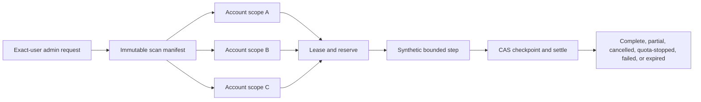

<!-- apps/web/docs/technical/email/HANDOFF-PHASE-A-SLICE-2-SCAN-CONTROL-PLANE.md -->

# Handoff — Gmail Relevance Phase A, Slice 2 Scan Control Plane

**Created:** 2026-07-23  
**Status:** Ready to implement after the Slice 1 profile/rule migration receives its exact-file
production verification receipt. Slice 2 is a synthetic control-plane build: it must not call Gmail
or a model.  
**Tracker:** `tasker/36-gmail-project-relevance-phase-a.md`  
**Parent handoff:**
[HANDOFF-PHASE-A-PROJECT-RELEVANCE.md](HANDOFF-PHASE-A-PROJECT-RELEVANCE.md)  
**Architecture:**
[GMAIL-INGESTION-AND-PROJECT-RELEVANCE-ARCHITECTURE.md](GMAIL-INGESTION-AND-PROJECT-RELEVANCE-ARCHITECTURE.md)  
**Migration protocol:**
[SUPABASE-MIGRATION-LEDGER-BASELINE.md](SUPABASE-MIGRATION-LEDGER-BASELINE.md)

## Objective

Build and prove the content-free machinery that will eventually control a bounded Gmail relevance
scan. A manually created run must bind its accounts, projects, profile versions, time window,
message limits, and operational budgets into one immutable manifest. Each account must then be able
to lease bounded synthetic work, checkpoint, retry, pause, resume, cancel, expire, and stop at its
budget without producing duplicate work.

Slice 2 proves orchestration safety before Slice 3 introduces a Gmail provider read.



## Current baseline

- Three independent read-only Gmail/Workspace connections already exist for DJ's BuildOS user.
- Slice 1's deterministic project-profile compiler and exact-user read-only preview are implemented
  and tested locally.
- `20260723000000_gmail_relevance_project_profiles.sql` is transactional and disposable-database
  verified, but it has not been applied to production.
- Focused Gmail plus Phase A tests pass 104/104, and shared generated database types build.
- `GMAIL_RELEVANCE_PHASE_A_ENABLED` and `GMAIL_RELEVANCE_MODEL_ENABLED` remain default off. The
  Phase A surface also requires an exact match in `GMAIL_RELEVANCE_PHASE_A_USER_IDS`.
- No Phase A scan queue, provider read, classifier, observation, candidate, or review UI exists.
- The production migration ledger remains intentionally sparse. Repository-wide `db push`, bulk
  repair, and opportunistic legacy migration cleanup are prohibited.

## Hard boundary for this slice

Slice 2 may create manifests, account/project scopes, leases, checkpoints, quota reservations,
state transitions, safe events, and synthetic tests. It must not:

- call `GmailReadGateway`, Google APIs, OpenRouter, an embedding provider, or any model;
- register a Gmail watch, Pub/Sub subscription, recurring poll, cron, or daily-brief hook;
- create a message observation, candidate, review decision, or BuildOS project entity;
- persist an email address, Gmail query, provider message/thread ID, raw cursor, Gmail link, profile
  term, project alias, sender/recipient, domain, header, label, subject, snippet, body, attachment, or
  free-form model output;
- place a cursor or provider identifier in `queue_jobs.metadata`, logs, traces, analytics, audits,
  or error text;
- enable the Phase A or model flags in production; or
- add any send, draft, label, archive, delete, mark-read, or other Gmail mutation path.

The synthetic executor should have no import path to the Gmail gateway. That structural separation
is part of the exit test.

## Locked pilot manifest

One manifest represents one deliberate user request and is immutable after creation. Canonicalize
and sort its IDs and policy fields before calculating a SHA-256 `manifest_hash`.

| Manifest field          | Phase A value or rule                                                     |
| ----------------------- | ------------------------------------------------------------------------- |
| Start mode              | manual only                                                               |
| Connection selection    | explicit owned active connection IDs; no implicit “all accounts”          |
| Project selection       | explicit owned project/profile-version IDs                                |
| Window                  | 30 days                                                                   |
| Message cap             | 1,000 per account                                                         |
| Mail policy             | inbox + sent; exclude spam, trash, and drafts                             |
| Query representation    | fixed `query_policy_version` enum; never durable Gmail query text         |
| Metadata batch ceiling  | at most 50 future message metadata reads per worker/web invocation        |
| Gmail budget            | derived by a versioned quota policy; ceiling sized for 20,000 fetch units |
| Raw-content byte budget | 0                                                                         |
| Model token/cost budget | 0 for Slice 2 and variants A/B                                            |
| Configuration           | compiler, profile, policy, serializer, and control-plane versions/hashes  |
| Expiration              | explicit `expires_at`; no unbounded pending run                           |

The Gmail estimate is approximately 20,000 quota units for 1,000 future `messages.get` operations,
plus list pages. Store the exact ceiling chosen by the versioned quota policy in each account scope;
do not calculate it from mutable application defaults after the manifest exists. Slice 2 consumes
only simulated units, but must enforce the same reservation path Slice 3 will use.

## Proposed storage contract

Finalize names against repository conventions during implementation, but keep these responsibilities
separate. Do not overload `queue_jobs` as the source of truth.

### `email_relevance_scan_runs`

The immutable run manifest plus aggregate lifecycle:

- opaque `id`, `user_id`, and client `idempotency_key_hash`;
- `state`, `terminal_reason_code`, `pause_requested_at`, `cancel_requested_at`, and lifecycle
  timestamps;
- `window_start`, `window_end`, `message_cap_per_connection`, and `query_policy_version`;
- `control_plane_version`, `serializer_version`, `manifest_hash`, and immutable configuration JSON
  constrained to an exact content-free shape and small byte ceiling;
- global time/quota ceilings and reserved/used counters;
- `raw_content_byte_budget = 0`, `model_token_budget = 0`, and `model_cost_budget_micros = 0`; and
- `expires_at`, created/started/completed timestamps, and safe aggregate counts.

The client idempotency key must never be stored in plaintext. A unique `(user_id,
idempotency_key_hash)` constraint makes a repeated create request return the original run.

### `email_relevance_scan_projects`

The immutable project side of the manifest:

- `run_id`, `project_id`, `profile_id`, `profile_version`, and `profile_hash`;
- one unique row per `(run_id, project_id)`; and
- insertion-time ownership and active-profile-version validation.

The worker uses the captured version. A later profile compile does not silently change an existing
scan.

### `email_relevance_scan_connections`

One independently resumable scope per selected account:

- `run_id`, `connection_id`, state, terminal reason, and unique `(run_id, connection_id)`;
- immutable account message/time/quota ceilings copied from the manifest policy;
- `checkpoint_version`, pages/steps/messages-seen counters, attempts, and safe timestamps;
- encrypted cursor envelope and key version only when Slice 3 needs it; Slice 2 should keep this
  null and use a synthetic step number;
- lease token hash, lease owner identifier, lease expiry, and next-attempt time;
- quota/time reserved and used counters; and
- a fixed `last_error_code`, never an upstream or free-form error message.

Only the credential-bound web service may decrypt a future cursor. A worker or queue message receives
only opaque run/scope IDs, an expected checkpoint version, and a single-use processing token.

### Reservation and event records

Use an append-only reservation/settlement ledger or an equivalently auditable atomic RPC. Every
entry contains only run/scope IDs, resource kind, fixed operation code, reserved/settled quantity,
state, attempt, policy version, and timestamps. Valid resource kinds for Slice 2 are `gmail_quota`,
`runtime_ms`, `raw_content_bytes`, `model_tokens`, and `model_cost_micros`; the last three must never
reserve a positive value in Slice 2.

Optional lifecycle events must use a database allowlist of event names and fixed reason codes. Do
not add a generic JSON “context,” “metadata,” or free-form “message” column that can become a content
leak.

## State machine

Run states:

```text
pending -> running <-> paused
   |          |          |
   +----------+----------+-> completed | partial | cancelled | quota_stopped | failed | expired
```

Connection states may also use `leased` and `retry_wait` while non-terminal. A pause is a durable
request: no new lease may start while it is set, and resuming clears it without changing a
checkpoint. Enforce transitions through an RPC or trigger rather than trusting application callers.

- `completed`: every account scope completed inside its budgets.
- `partial`: at least one scope completed and at least one ended in a non-success terminal state.
- `cancelled`: cancellation was requested before any useful scope completed, or every unfinished
  scope was cancelled.
- `quota_stopped`: the next reservation would exceed a manifest ceiling and no useful account scope
  completed.
- `failed`: a fixed non-retryable error ended the run and no scope completed.
- `expired`: the manifest expired before completion. Lease expiry alone is recoverable and must not
  make the run terminal.

Pause and cancellation are cooperative but bounded. The executor checks `pause_requested_at` and
`cancel_requested_at` before leasing, before a synthetic/provider operation, and before checkpoint
commit. It must not start another operation after either request or after budget exhaustion. A
completed in-flight operation may settle once if its lease is still valid; its checkpoint is the
resume boundary.

## Atomicity and replay rules

1. Validate the exact-user Phase A gate, user ownership, active/read-enabled connection state,
   project ownership, profile version, limits, and expiry before manifest creation.
2. Create the run, project scopes, and connection scopes in one transaction. Hash the canonical
   manifest and reject any later mutation of its immutable columns.
3. Claim one account scope with a compare-and-swap on state, `checkpoint_version`, and lease expiry.
   At most one live lease may exist per scope.
4. Atomically reserve the worst-case units for the next bounded step before dispatch. If price,
   policy, budget state, or reservation accounting is unavailable, stop closed.
5. Execute a deterministic synthetic step outside the transaction.
6. Commit only when the lease token hash and expected checkpoint version still match. Increment the
   checkpoint exactly once, settle actual usage, and release or renew the lease in the same
   transaction.
7. Treat repeated delivery as normal. A stale worker cannot settle, advance, or enqueue from an old
   checkpoint.
8. Derive the aggregate run state from its account scopes; do not let a caller write an arbitrary
   terminal result.

Disconnect or account deletion must request cancellation, invalidate the connection lease, clear
its checkpoint/cursor material, and terminalize the scope while preserving content-free aggregate
counts needed to explain the run outcome. It must not affect another connection's checkpoint.
Deleting a project before a run starts should fail the run safely; deleting it mid-run should
prevent new relevance work for that project in Slice 3.

## Access and queue boundaries

- Authenticated browser users may read only their own safe run/progress rows through RLS.
- Manifest creation and cancellation go through server endpoints; direct browser insert/update is
  denied.
- Service-role mutations still validate the run's user, connection ownership, project ownership,
  Phase A gate, expected version, processing token, and budget.
- The first implementation may drive the synthetic executor directly from tests or a private
  server endpoint. If it uses `queue_jobs`, add one dedicated job type whose metadata serializer
  accepts only `run_id`, `connection_scope_id`, `checkpoint_version`, and an opaque processing
  token.
- Follow the bounded `sync_calendar` worker-to-private-web pattern only when queue execution is
  added. The web boundary retains Gmail credentials; the Railway worker must not receive Gmail
  encryption keys or a Gmail client.

## Suggested implementation map

Keep pure policy/state logic independently testable:

- `apps/web/src/lib/server/gmail-relevance/scan-manifest.ts` — input validation, canonicalization,
  hashing, and immutable manifest contract;
- `apps/web/src/lib/server/gmail-relevance/scan-state.ts` — allowed transitions and aggregate state;
- `apps/web/src/lib/server/gmail-relevance/scan-budget.ts` — versioned unit estimates,
  reserve/settle checks, and fail-closed results;
- `apps/web/src/lib/server/gmail-relevance/scan-control-plane.ts` — ownership-checked persistence,
  leasing, checkpointing, cancellation, and safe status reads;
- focused colocated tests for each module and one synthetic three-account integration suite;
- one new uniquely versioned migration for the run/scope/reservation schema and atomic RPCs; and
- a minimal exact-user admin control/status route only if needed to exercise the lifecycle. It
  should not display or request mailbox content.

Do not add Slice 3 provider code to these modules. A future metadata scanner should depend on this
control plane, not the reverse.

## Build order

1. Complete the exact-file production apply and verification receipt for
   `20260723000000_gmail_relevance_project_profiles.sql`, regenerate production types, and rerun
   focused tests. Do not use repository-wide `db push`.
2. Lock TypeScript manifest, state, budget, job-metadata, and fixed-error-code schemas with pure
   tests. Keep model/content budgets at zero.
3. Author a uniquely versioned transactional Slice 2 migration with constraints, RLS, immutable
   manifest guards, ownership checks, transition enforcement, atomic lease/reserve/settle RPCs, and
   disconnect cleanup.
4. Verify the migration in a disposable database, including negative ownership, replay, budget,
   transition, and content-boundary cases. Production apply remains a separate reviewed action.
5. Implement the server control plane and deterministic synthetic executor behind the exact-user
   Phase A gate.
6. Prove the three-account lifecycle and run the leak tests. Update this handoff with the exact test
   counts and migration receipt.
7. Stop. Write the Slice 3 metadata-only A/B retrieval handoff before importing or calling the Gmail
   gateway.

## Required test matrix

- Two synthetic users; reject a foreign connection, project, profile, run, or checkpoint.
- Three connections and multiple projects with deterministic ID sorting and the same manifest hash
  regardless of input order.
- Repeated create with one idempotency key returns one run; altered input with the same key fails.
- Concurrent lease attempts produce one winner; stale leases recover without duplicate checkpoint
  advancement.
- Replayed queue/private-endpoint delivery is a no-op after successful settlement.
- Pause/resume across all three scopes completes with every synthetic step exactly once.
- Cancellation before dispatch and during a run starts no further step and reaches the correct
  aggregate state.
- The next operation is denied before execution when Gmail quota or runtime would exceed its
  ceiling. Reserved, settled, and used counters never become negative or exceed the manifest.
- Raw-content and model reservations are always rejected because their budgets are zero.
- Disconnect clears only the affected connection's checkpoint/cursor material, terminalizes that
  scope, and prevents further leases.
- Expiry, retry exhaustion, partial success, and every terminal state follow the locked transition
  table.
- Database rows, serialized jobs, logs, audits, traces, errors, and test snapshots pass an explicit
  forbidden-field/value leak scan.
- Source/static test proves the synthetic executor does not import the Gmail gateway or model code.

Use invented fixtures only. No real mailbox address, message, query, cursor, provider ID, or profile
term belongs in the repository or test output.

## Exit criteria

Slice 2 is complete only when:

- an immutable, ownership-checked three-account manifest is created idempotently;
- every account pauses, resumes, retries, cancels, expires, and stops at budget without duplicate
  checkpoint advancement;
- every synthetic operation reserves before execution and fails closed when the next reservation
  is unavailable or too large;
- all content/model budgets remain zero and no provider/model call is reachable;
- queue metadata and observability contain only the approved content-free fields;
- disconnect/account deletion invalidates only the affected scope;
- migration and RLS tests pass in a disposable database;
- the global Phase A flag remains off by default and the model flag remains off; and
- the handoff records exact verification results and names Slice 3 as the next separately reviewed
  boundary.

Passing Slice 2 does not authorize a Gmail scan. It only establishes that Slice 3 can add bounded,
metadata-only reads on top of a tested control plane.
