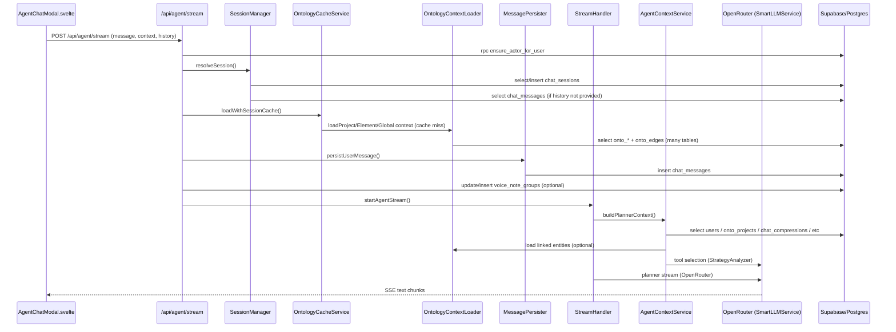

<!-- apps/web/docs/technical/issues/AGENT_CHAT_REQUEST_TRACE.md -->

# Agent Chat Request Trace (AgentChatModal → Backend)

Scope: Trace the request path that starts in `apps/web/src/lib/components/agent/AgentChatModal.svelte` and ends in `/api/agent/stream`, and enumerate API calls + database operations observed in code. This is a static code audit; actual runtime latency still needs profiling.

---

## Quick Summary (Likely Blockers Before First Assistant Token)

These are the **blocking** steps on the server path before the first streamed text can appear:

1. **Auth + actor resolution** (`ensure_actor_for_user` RPC).
2. **Session resolution** (select/insert `chat_sessions`, optional `chat_messages` load).
3. **Ontology context load** (large multi-table reads if cache miss).
4. **Persist user message** (`chat_messages` insert; optional `voice_note_groups` update/insert).
5. **Context build** (`AgentContextService.buildPlannerContext`): user prefs + location context + linked entities + usage snapshot.
6. **Tool selection** (LLM call via OpenRouter).
7. **Planner model stream** (LLM call via OpenRouter).

Everything above is on the critical path to the **first text tokens**. Prewarm calls, deferred compression, and tool execution are _usually_ off the critical path (or happen after first text).

---

## Mermaid Sequence Diagram (Send Message Path)

---

## Frontend → Backend API Calls (from AgentChatModal)

All calls originate in `apps/web/src/lib/components/agent/AgentChatModal.svelte`.

### 1) Core chat streaming

- **POST `/api/agent/stream`**
    - Trigger: `sendMessage()` when user sends a message.
    - Payload includes: message, session_id, context_type, entity_id, conversation_history, projectFocus, lastTurnContext, stream_run_id, voiceNoteGroupId.
    - **This is the critical path** for first response tokens.

### 2) Context prewarm (best-effort)

- **POST `/api/agent/prewarm`**
    - Trigger: `$effect` when chat opens or focus/context changes.
    - Purpose: warm location + linked-entity cache.
    - **Not on the send-message critical path**, but can increase backend load.

### 3) Session resume

- **GET `/api/chat/sessions/:id?includeVoiceNotes=1`**
    - Trigger: `loadChatSession()` when `initialChatSessionId` is set.
    - Restores session + messages + voice notes.

### 4) Session close

- **POST `/api/chat/sessions/:id/close`**
    - Trigger: `handleClose()` when modal closes.
    - Updates context fields and may queue classification.

### 5) Agent-to-agent automation

- **POST `/api/agentic-chat/agent-message`**
    - Trigger: `requestAgentToAgentMessage()` in agent-to-agent mode.
    - Runs a separate LLM call to generate a message.

### 6) Project list (agent-to-agent wizard)

- **GET `/api/onto/projects`**
    - Trigger: `loadAgentProjects()` when agent-to-agent wizard needs projects.

### 7) Braindump save

- **POST `/api/onto/braindumps`**
    - Trigger: `saveBraindump()` when saving a braindump.

---

## Backend: `/api/agent/stream` — Step-by-Step (Critical Path)

Source: `apps/web/src/routes/api/agent/stream/+server.ts` + services.

### Step 1: Auth + actor resolution

- **RPC**: `ensure_actor_for_user`
    - File: `apps/web/src/routes/api/agent/stream/+server.ts`
    - **SQL**: Supabase RPC (Postgres function)

### Step 2: Session resolution

`SessionManager.resolveSession()`

- **Select** `chat_sessions` by `id + user_id` (if session_id provided).
- **Insert** `chat_sessions` (if session_id missing → new session).
- **Select** `chat_messages` (load recent history if not provided).

### Step 3: Focus metadata update (optional)

`SessionManager.resolveProjectFocus()`

- **Update** `chat_sessions.agent_metadata` (if focus changed).

### Step 4: Ontology context load (cache miss)

`OntologyCacheService.loadWithSessionCache()`

- If cache miss → `OntologyContextLoader.*`
- **Multiple table selects** (see OntologyContextLoader query list below).

### Step 5: Persist user message

`MessagePersister.persistUserMessage()`

- **Insert** `chat_messages`

### Step 6: Attach voice note group (optional)

If `voice_note_group_id` exists:

- **Update** `voice_note_groups` (link group → message)
- **Insert** `voice_note_groups` (if missing)
- **Update** `voice_note_groups` (retry on conflict)

### Step 7: StreamHandler orchestration

`StreamHandler.startAgentStream() → runOrchestration()`
Blocking steps before LLM streaming:

- **Load recent tool results** (if needed): select `chat_messages` where `role='tool'`.
- **Usage snapshot**: selects `chat_compressions`, `chat_sessions` (compression metadata).
- **Planner context build** (`AgentContextService.buildPlannerContext()`):
    - user profile (select `users`, select `onto_projects.props`)
    - location context (may call `ChatContextService`, see below)
    - linked entities (optional: `OntologyContextLoader.loadLinkedEntitiesContext`)
- **Create planner agent record**: insert `agents`.
- **Tool selection** (LLM call, OpenRouter).
- **Planner stream** (LLM call, OpenRouter) → first text tokens.

### Step 8: Persist assistant + tool results

After stream completes:

- **Insert** `chat_messages` (assistant)
- **Insert** `chat_messages` (tool results, role=tool)
- **Update** `chat_sessions.agent_metadata` (single consolidated write)

---

## SQL / DB Query Map (by Component)

> These are **Supabase table operations/RPCs** observed in code. Actual SQL is generated by PostgREST.

### A) `/api/agent/stream` (core chat)

**RPC**

- `ensure_actor_for_user`

**Tables**

- `chat_sessions`: select, insert, update
- `chat_messages`: select (history/tool results), insert (user/assistant/tool/system)
- `voice_note_groups`: update, insert
- `chat_compressions`: select (usage snapshot)
- `agents`: insert (planner agent record)

### B) Ontology context (cache miss)

`OntologyContextLoader` (used by `OntologyCacheService` and linked-entity prewarm)

**Tables**

- `onto_projects`
- `onto_tasks`
- `onto_goals`
- `onto_plans`
- `onto_documents`
- `onto_milestones`
- `onto_risks`
- `onto_requirements`
- `onto_signals`
- `onto_insights`
- `onto_edges`

### C) `AgentContextService` (planner context)

**Tables**

- `users` (profile + preferences)
- `onto_projects` (project preferences)
- `chat_compressions` (latest summary for deferred compression)
- `chat_sessions` (compressed_at for usage snapshot)

**Conditional via `ChatContextService` (legacy contexts)**

- `projects`, `tasks`, `notes`, `brain_dumps`, `phases`
- `onto_events` (calendar context, after `ensure_actor_for_user` RPC)

### D) `/api/agent/prewarm`

**RPC**

- `ensure_actor_for_user` (via `ensureActorId`)

**Tables**

- `chat_sessions` (select/insert/update)
- `chat_context_cache` (if `ChatContextService.cacheContext()` is used)
- `onto_edges` + `onto_*` tables (linked-entity prewarm)
- `projects`, `tasks`, `notes`, `brain_dumps`, `phases`, `users` (location context)
- `onto_events` (calendar context)

### E) Session resume + close

**GET `/api/chat/sessions/:id`**

- `chat_sessions` (select)
- `chat_messages` (select user/assistant)
- `voice_note_groups` (select, if includeVoiceNotes)
- `voice_notes` (select, if includeVoiceNotes)

**POST `/api/chat/sessions/:id/close`**

- `chat_sessions` (select + update)

### F) Agent-to-agent helper

**POST `/api/agentic-chat/agent-message`**
**RPC**

- `ensure_actor_for_user`
- `current_actor_has_project_access`

**Tables**

- `onto_projects` (select)
- `llm_usage_logs` (insert; via SmartLLMService)

### G) Project list (agent-to-agent wizard)

**GET `/api/onto/projects`**
**RPC**

- `ensure_actor_for_user`

**Tables**

- `onto_project_members` (select)
- `onto_projects` (select + aggregate counts via relations)

### H) Braindump save

**POST `/api/onto/braindumps`**

- `onto_braindumps` (insert)

### I) Tool execution logging + external tools

Triggered when planner/executor invokes tools:
**Tables**

- `chat_tool_executions` (insert tool execution logs)
- `web_page_visits` (web_search/web_visit logs)
- `onto_*` tables (read/write tools)
- `onto_edges` (relationship tools)
- `project_calendars`, `onto_events` (calendar tools)

---

## External API Calls (Network)

### OpenRouter (LLM)

Used by `SmartLLMService` for:

- Tool selection (StrategyAnalyzer)
- Planner streaming response
- Executor tasks / plan synthesis / response synthesis
- Agent-to-agent helper
- Chat compression and title generation (when not deferred)

Endpoint: `https://openrouter.ai/api/v1/chat/completions`

### Web search / web visit tools

Executed by `ExternalExecutor` (if planner chooses):

- `web_search`, `web_visit`
- Logs to `web_page_visits`

---

## Likely Latency Hotspots (Code-Based Assessment)

Ordered roughly by impact before first text token:

1. **Ontology context load** (multi-table reads in `OntologyContextLoader`)
2. **Planner context build** (user prefs + linked entities + usage snapshot)
3. **Tool selection LLM call** (extra OpenRouter round-trip)
4. **Planner LLM stream** (OpenRouter latency + model choice)
5. **Session resolution + history load** (large `chat_messages` load)
6. **Persistence** (multiple inserts/updates to `chat_messages`, `chat_sessions`, `voice_note_groups`)

---

## File Pointers (Key Entry Points)

- Frontend: `apps/web/src/lib/components/agent/AgentChatModal.svelte`
- Stream API: `apps/web/src/routes/api/agent/stream/+server.ts`
- Stream lifecycle: `apps/web/src/routes/api/agent/stream/services/stream-handler.ts`
- Session management: `apps/web/src/routes/api/agent/stream/services/session-manager.ts`
- Ontology cache: `apps/web/src/routes/api/agent/stream/services/ontology-cache.ts`
- Ontology loader: `apps/web/src/lib/services/ontology-context-loader.ts`
- Context building: `apps/web/src/lib/services/agent-context-service.ts`
- LLM client: `apps/web/src/lib/services/smart-llm-service.ts`
- Tool execution: `apps/web/src/lib/services/agentic-chat/tools/core/tool-executor-refactored.ts`
