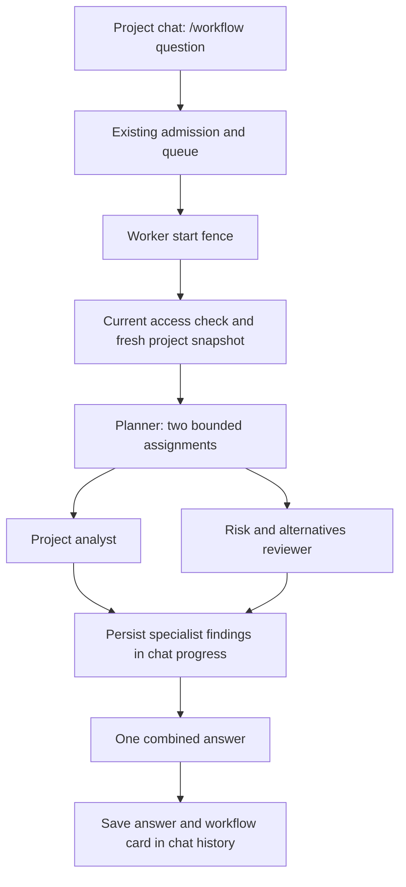

<!-- apps/worker/src/workers/agentic-chat/djflow-prototype.md -->

# Chat workflow prototype

Implemented 2026-09-12. This is the first runnable experiment from
[the architecture proposal](./djflow-architecture.md).

## What you can test

Open `/workflow-lab`, choose a project, and ask what to prioritize, what is missing,
or which assumptions need checking. The page sends `/workflow <question>` through
the existing chat session, admission, queue, worker, and durable stream.

The worker gathers a fresh project snapshot, asks a planner for two assignments,
runs a project analyst and a risk/alternatives reviewer, and combines their reports.
The chat shows five steps with expandable assignments and findings. The final
answer streams while synthesis runs. The completed answer and reports are saved
together; normal chat history can reopen them. See the [build list](./djflow-build-list.md)
for the next pieces and their validation status.

This pilot reads saved project context. It does not browse, execute domain tools,
or save suggested tasks. Research capture and stated-future capture are explicitly
disabled for these turns. Chat messages, progress, provider usage, and diagnostics
are still persisted.

## Run locally

Use the existing isolated QA environment file. Stop any other worker or gate using
that database before starting this runner.

```sh
pnpm exec turbo build --filter='@buildos/worker^...' --concurrency=1
AGENTIC_GATE_ENV_FILE=.env.agentic-gate.local pnpm agentic:workflow --smoke
```

Open `http://127.0.0.1:5188/workflow-lab`. Sign in with `AGENTIC_TEST_USER_EMAIL`
and `AGENTIC_TEST_USER_PASSWORD` from that file. The smoke test creates and retains
**Workflow lab · Cedar House demo**, including its completed chat, for inspection.
Select that project to run another question. Omit `--smoke` to start the services
without creating a fixture or spending on an automated review. Ctrl-C stops both
services. `WORKFLOW_PROTOTYPE_PORT` changes the web port; the worker uses the next port.

The runner checks that the QA database differs from both normal app env files. It
enables only the authenticated QA user's UUID through
`AGENTIC_CHAT_WORKFLOW_PROTOTYPE_USER_IDS`, independently in web and worker. For a
separate internal deployment, set that same explicit comma-separated UUID list in
both services. Empty, malformed, or wildcard values grant no access.

Useful questions:

- What should we prioritize next, and which missing facts could change that order?
- Where does this project depend on assumptions that have not been verified?
- Give me a realistic next-week plan and challenge its weakest dependencies.

Use `/workflow` for **each** review. Other chat messages retain ordinary chat behavior.
Use the existing Stop button to cancel. Navigation alone does not cancel a turn.

## The implemented boundary



| Concern      | Prototype behavior                                                                                                                   |
| ------------ | ------------------------------------------------------------------------------------------------------------------------------------ |
| Ownership    | One existing queue job and one worker turn                                                                                           |
| Context      | Worker refreshes a bounded snapshot after a current actor-explicit access check                                                      |
| Admission    | Existing preparation contract remains; some context work is still duplicated                                                         |
| Plan         | Only two assignment strings; malformed/unavailable planner uses an explicitly labeled fixed plan                                     |
| Agents       | Separate model messages; neither specialist sees the other's output                                                                  |
| Concurrency  | Reuses the worker provider capacity; one slot serializes specialists, two allow overlap                                              |
| Limits       | Four logical passes; completion ceilings 900/3,200/3,200/3,200; configured provider ceiling still applies                            |
| Time         | Existing turn deadline and per-attempt timeout; context caller limited to 20 seconds                                                 |
| Model policy | Explicit low reasoning effort on OpenRouter workflow passes; ordinary chat policy unchanged                                          |
| Failure      | One specialist may produce a labeled partial answer; both failing stops synthesis                                                    |
| Streaming    | Final editor chunks use the existing batched text publisher; an incomplete editor stream fails instead of completing the answer step |
| Cancellation | Parent abort reaches each child and capacity wait; leases release when calls unwind                                                  |
| Persistence  | Durable semantic progress before the next stage; bounded report previews in final message metadata                                   |
| Recovery     | Realtime/reconciliation can replay progress; completed chat history restores reports                                                 |
| Restart      | No workflow checkpoint/resume implementation yet; existing worker recovery rules apply                                               |

The completion caps include hidden reasoning. The first live attempt exhausted both
specialist caps entirely in reasoning and returned no report. Explicit low effort
plus the revised ceiling produced complete reports. OpenRouter documents the
[reasoning controls](https://openrouter.ai/docs/guides/best-practices/reasoning-tokens);
support varies by model/provider. Direct OpenAI-compatible routes keep their existing
reasoning policy. Provider retries remain bounded by the existing client and deadline;
four logical passes is **not** a promise of four physical requests or a hard dollar cap.

## What this experiment does not prove

The saved-context snapshot can omit older or lower-priority records. Individual
strings are truncated at 5,000 characters; a packet above 64,000 characters is rejected.
Each specialist report preview is limited to about 6,000 characters. Models must
state missing evidence rather than assume this is the entire project database.

This uses multiple contexts with the same configured model. Different roles do not
guarantee independent judgment or better answers. Compare the recommendations to
ordinary project chat before adding more agents or tools. Progress and accepted
specialist findings arrive first; answer text starts during synthesis. Planning and
specialist generation still precede that first answer text. Lightweight admission
is not implemented yet, so submission still waits for web preparation.

Completed findings survive in the chat event ledger and assistant metadata; they are
not durable step claims. A crash does not resume halfway through the workflow. Pending
context DB reads may finish after cancellation, but their late results cannot launch
model work. Failed/cancelled runs without a final assistant message retain their
durable turn projection; normal completed-message history does not reconstruct those
cards yet.

## Validation and next decisions

The focused suites cover cohort/scope rejection, no pre-fence model work, direct-chat
delegation, provider ceilings, one/two-slot capacity, partial failure, planner fallback,
cancellation, safe report rendering, restored history, and suppression of automatic
domain capture. The live smoke drives the actual transport and compares project plus
eight domain tables before and after. Evidence and logs go to `output/workflow-prototype`.

The repository's full `pnpm agentic:gate` remains a separate release requirement.
The smoke does not establish general answer quality, restart recovery, or production
readiness. Keep the rollback lane and internal cohort restriction until that gate and
a broader workflow evaluation pass.

After testing this interaction, the next architectural work is worker-owned admission
and an immutable workflow input, then durable step/cost records and recovery. Add a
web researcher only after defining evidence provenance and private-data egress for
that role. The larger proposal remains the roadmap, not a description of implemented
guarantees.
