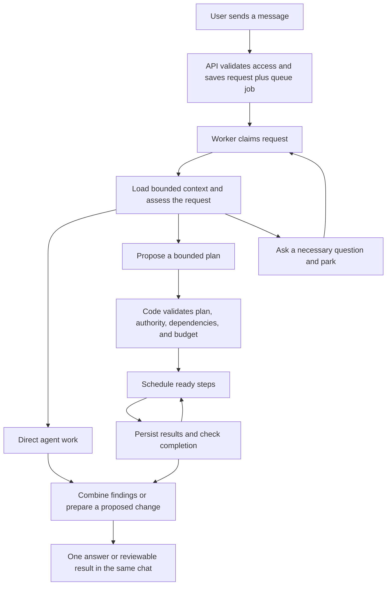

<!-- apps/worker/src/workers/agentic-chat/djflow-review.md -->

# DJ Flow: architecture assessment and a smaller first build

Date: 2026-09-12. Status: proposal, based on the working checkout and the supplied
Anthropic PDF. This is a source review, not verification of the deployed system.
The original `djflow.md` remains the working notes; this review does not change runtime code.

## 1. The product behavior to build

The direction is sound: accept a request durably, let a worker gather context and
decide how to approach it, then coordinate bounded work and return a coherent result.
The draft overstates how much of that lifecycle is already reusable without changes.

Use three concepts consistently:

- **Chat session:** the conversation and its history.
- **Request/run:** one objective the system is working on, with a durable identity.
- **Step:** a bounded unit of work within that objective, with its own execution attempts.

Queue a reference to the request/run, not the entire chat. Opening a chat need not
start work; sending a message does. Most requests can finish with one agent. A
multi-agent plan is an execution choice inside the worker.

One visible request should remain understandable across short replies, background
work, clarification, and reconnects. Ending a chat transport turn must not make an
unfinished objective appear completed. Existing turn and agent-run records can map
to this identity during migration; simple messages need not allocate duplicate roots.

## 2. What the checkout actually contains

| Area                            | Evidence                                                                                                                                                                             | Assessment                                                                                                                                                                                                  |
| ------------------------------- | ------------------------------------------------------------------------------------------------------------------------------------------------------------------------------------ | ----------------------------------------------------------------------------------------------------------------------------------------------------------------------------------------------------------- |
| Durable chat admission          | `worker-turn-admission.server.ts:85` calls `create_agentic_chat_turn_with_job`; its migration creates the session when needed, turn, input artifact, message, and queue job          | Keep the atomic admission and duplicate handling. The broad queue architecture already exists.                                                                                                              |
| Context before admission        | `worker-turn-preparation.server.ts:503–600` restores prepared history/context or loads history, resolves trusted context, and builds the prompt; the route calls it before admission | Your desired worker-owned context assembly is a real boundary change. Current queueing does not remove this web-request work.                                                                               |
| Chat execution                  | `consumer.ts:64` dispatches `agentic_chat_turn`; `turn-executor.ts:365` claims and runs it                                                                                           | Reuse durable identity, cancellation, input validation, and stream recovery where their contracts fit.                                                                                                      |
| Chat write policy               | `provider/write-routing.ts:48` distinguishes small independent writes from complex writes; `provider/turn-phase.ts` controls review and execution                                    | The draft's mandatory three-way disposition and universal contract-first description are stale. Small writes can use batch review without a turn contract; answer-only turns need no read-only declaration. |
| Headless agent work             | `agentRunWorker.ts:1232` uses generation-fenced claims; `:1344` stages writes only when review is required                                                                           | Useful execution infrastructure, but its write authority differs from chat. There is not one shared reviewed commit path today.                                                                             |
| Deep research                   | `deepResearchOrchestrator.ts:47` fixes child count at two                                                                                                                            | A useful parent/child coordination precedent, not a generic scheduler already proven for arbitrary plans.                                                                                                   |
| Recovery                        | `agentRunStrandedSweep.ts:459–486` re-enqueues unstarted ordinary jobs but fails stranded running ones                                                                               | Recovering liveness is not the same as resuming work. Safe arbitrary-step replay is still work to build.                                                                                                    |
| Planning experiment             | `packages/agent-orchestrator/src/application/route-mode/` contains model routing and a compiler that selects among fixed plan shapes                                                 | Reuse and evaluate this experiment. Do not describe a general model-authored planner as shipped.                                                                                                            |
| Dependency execution experiment | `workflow-engine.ts:193–315` runs dependency-ready steps in parallel and collects artifacts; `:320` keeps run state in memory                                                        | Dependencies and staged execution exist experimentally. Durable production integration is missing.                                                                                                          |
| Tool-call dependencies          | `toolExecutionGraph.ts` validates dependencies and worker resource conflicts                                                                                                         | Useful scheduling concepts already exist one level below agents. Tool parallelism alone does not require multiple agents.                                                                                   |
| Project loop                    | `projectLoopWorker.ts:3078–3165` runs four generators serially, checking accumulated cost before each                                                                                | These are structured generations. Parallelizing them changes budget admission and failure behavior; enabling tools changes the product further.                                                             |

The archived July evaluation is also relevant. Its routing mitigation scored 61/72,
and the recorded A2 workflow comparison has no scored workflow outputs. That is
historical evidence of unresolved routing and evaluation problems, not a result for
today's chat runtime or a verdict against multi-agent work. See
`docs/architecture/agent-first-orchestration/A2_PROGRESS.md` and the package's
`src/testing/harness/results/README.md`.

The accurate starting point is: **BuildOS has several useful pieces with different
contracts, plus an experimental workflow engine. It needs a coherent durable lifecycle
and evidence that decomposition improves the intended requests.**

## 3. The target architecture



Give each layer a narrow responsibility:

1. **API/admission:** authenticate, authorize the initial scope and attachment
   references, bind server-owned limits, persist the command and wake-up atomically,
   return a handle. No model call is needed here.
2. **Context assembly:** a shared service called by the worker builds the bounded
   starting context and supports further scoped reads. Prepared context is an optional
   cache with versions and freshness checks. Preserve web-owned capability discovery
   until it has a portable, trusted implementation; do not import web code into the worker.
3. **Reasoning:** the acting model answers, asks, or proposes a plan. Its existing
   first pass can make this decision; do not add a mandatory router call to every message.
4. **Scheduling:** deterministic code persists and advances dependencies, limits
   concurrency, handles retries and waits, and rejects stale results.
5. **Execution:** one reusable bounded agent loop, configured by capability and task.
   A researcher or drafter is a configuration, not an independently invented runtime.
6. **Completion/delivery:** combine evidence, report unresolved work, and deliver through
   the conversation. Domain writes pass through an explicitly integrated commit boundary.

Plan only the work that can be specified with available information. Independent
research branches can be planned together. Discovery may justify another stage later.
Do not require a transition-model call after every batch when completion is already known.

### Storage choice

Define lifecycle semantics before choosing tables. Prefer a small orchestration layer
with adapters to existing execution primitives; do not merge chat, agent runs, and
project loops as the first milestone.

`agent_runs` is a candidate for step executions, conditional on proving its recovery,
capacity, budget, and permission behavior under the new parent. Reuse its ledger
through a well-defined accounting interface. If extending it requires widespread
template-specific exceptions, use dedicated orchestration state with an adapter.
Neither reuse nor a new table is inherently the cleaner design.

For the first version, persisted state is authoritative and events project progress
to the UI and logs. Full event sourcing requires a versioned, replay-complete event
contract; an append-only table alone does not provide that.

## 4. Simplify the interfaces

The user-facing interface is **message → visible work → result**, with a compact plan
only when useful. Show labels such as “Reviewing your project,” “Researching options,”
and “Combining findings.” Show a question when input is required, a stop control, and
one final result with supporting sources. Put agent names, graphs, retries, and detailed
cost accounting in an expandable inspection view.

Use a small model-facing assignment:

```ts
type StepProposal = {
	key: string;
	capability: string;
	objective: string;
	boundaries: string[];
	dependsOn: string[];
	inputRefs: string[];
	expectedOutput: string;
	doneWhen: string[];
};
```

The runtime adds identity, attempts, leases, permission scope, allowed tools, budget,
and validators. The model cannot grant authority or invent accessible input references.
Keep the proposal small even if the internal execution record is richer.

Return a bounded result containing status, summary, artifact references, evidence,
and unresolved questions. Keep transcripts available for debugging, but do not copy
them into every agent's context. A deterministic context builder is a service; it
does not need an agent persona or a model call.

Context needs explicit rules:

- Initial history ends at the triggering message. Later messages are explicit steering
  events or new requests, not accidental additions to a delayed worker's snapshot.
- Scope and capabilities come from trusted server policy. Recheck access on reads and
  after long waits. Attachment and retrieved-document instructions are source content,
  not replacements for the user's objective or runtime policy.
- Artifacts carry source references, versions or timestamps, and unresolved conflicts.
  Explicit artifact IDs do not replace authorization or private-data egress controls.
- Summaries have a total context budget and expandable source references. Ten summaries
  do not cost the same as two unless more information is dropped or compressed.
- Specialists may persist execution artifacts through the runtime while lacking authority
  to change the user's projects. These are different classes of writes.

## 5. Correct the lifecycle before implementing the pseudocode

These are design defects in `djflow.md`, not newly reproduced production failures.

| Draft assumption                                                                                                                           | Required correction                                                                                                                                                                                                                                              |
| ------------------------------------------------------------------------------------------------------------------------------------------ | ---------------------------------------------------------------------------------------------------------------------------------------------------------------------------------------------------------------------------------------------------------------- |
| The coordinator holds a root-row lock while calling `planStage`, the transition model, and synthesis (§6)                                  | Claim and reserve in a short transaction; perform model/network work outside it; accept the result in a second transaction conditional on ownership and plan revision.                                                                                           |
| `queue.enqueueMany` is called inside a transaction without using that transaction; step completion queues the next tick afterward (§6, §9) | Persist state plus its wake-up together. Use the existing Postgres queue inside the same RPC/transaction, or a transactional outbox. Otherwise a crash can leave runnable work unwoken.                                                                          |
| `wave.some(isInFlight)` returns before expired leases are reaped (§6)                                                                      | Process expiry first, or distinguish live from expired work in the predicate. A dead worker must not block its own recovery check.                                                                                                                               |
| Every next wave is released after the prior wave ends (§6, §8)                                                                             | Define which dependency outcomes satisfy a step. Required failed inputs block or skip dependents; `best_effort` does not authorize consuming missing evidence.                                                                                                   |
| Layering is equivalent to optimal dependency scheduling (§8)                                                                               | A full-wave barrier is a simple first implementation, but it makes an unrelated slow step delay dependents of already-finished steps. General scheduling should select ready nodes.                                                                              |
| A generation check at step start rejects all late writes (§9)                                                                              | Atomically check the current attempt/lease, cancellation, and plan revision at result commit and at effect authorization. Separate worker-attempt generation from plan revision.                                                                                 |
| `(step, attempt, draft_key)` prevents duplicate logical outputs across retries (§4)                                                        | It deduplicates within an attempt. Select one accepted result per logical step/revision; use stable logical effect keys for domain mutations across attempts. Retain rejected attempt artifacts only as trace.                                                   |
| Reserving makes overspend impossible (§13, §15)                                                                                            | Bound dispatch and track uncertain charges. The existing SQL explicitly records overruns for reconciliation. Distinguish a step allocation from provider-call reservations so money is not reserved twice. Include planning, synthesis, retries, and paid tools. |
| Pause states and a TTL solve interaction (§12)                                                                                             | Persist question ID and expected revision; bind the answer to them, release execution capacity while waiting, and reacquire on resume. Disconnect must not strand a `live` run forever.                                                                          |
| New statuses can be used without model changes (§4–§6)                                                                                     | `synthesizing` is used but not included in the listed existing enum. Dependency-blocked work also needs a representation that is not accidentally claimable as queued work. Define status, phase, and wait reason explicitly.                                    |
| The coordinator can change phase and just exit (§6)                                                                                        | Every nonterminal runnable transition needs a durable next wake-up, including planning, synthesis, and resumed input. Waiting states need a known wake condition.                                                                                                |

PostgreSQL holds row locks until transaction end, and competing updates wait on them.
That is why model calls must sit outside the locked transaction.
[PostgreSQL locking documentation](https://www.postgresql.org/docs/current/explicit-locking.html).

Keep separate time limits for a provider call, an execution attempt, active run work,
and waiting for a user. A durable run can outlive a worker invocation while still having
deadlines. “No wall-clock ceiling” is not a complete lifecycle policy.

Read-only specialists avoid conflicting domain mutations, but their evidence can still
be stale or contradictory. Before a proposed change commits, check current entity
versions, reconcile conflicts, and apply the existing authorization and review policy.
An LLM reviewer and user approval serve different purposes; do not conflate them.

## 6. What to keep, remove, and defer in the design

**Keep:** worker execution; model-proposed plans with code-enforced limits; explicit
dependencies; bounded evidence packets; one voice to the user; scoped specialists;
durable progress; conditional writes; outcome-based evaluation.

**Remove or rewrite:**

- “Already built this three times,” “only a planner is missing,” and “reuse as-is.”
  Replace them with the evidence table above and explicit integration requirements.
- “One new table.” The draft itself introduces stages, artifacts, and events.
- “Identical outputs” and “~4× faster” for the project loop. Four concurrent calls have
  overhead, provider limits, and a shared budget; speedup depends on their actual durations.
- “The sweep is the good one.” Its conservative failure behavior has a purpose; neither
  it nor chat's recovery should be generalized without their distinct effect semantics.
- “Subagents as tools hands authority to the model.” A tool can submit a validated plan
  or dispatch request to this same durable scheduler. The interface spelling does not
  decide who enforces concurrency, cost, or permissions.
- The universal mandatory disposition description. Match current direct-read and
  simple-write behavior before proposing another mode.

**Defer:** migrating project loops and scheduled/event entry points; arbitrary deep
hierarchies; a large named-agent registry; multi-day external-event waits; a transition
model for every stage; full event sourcing; new public Flow branding. Basic completion
checks, cancellation, budgets, and crash behavior belong in the first build.

The unused supervisor implementation is a cleanup candidate, not a dependency of this
architecture. Its package export, build entries, web shims, and tests still reference
the surface. Remove that cluster only after verifying consumers. Preserve the active
`loop/finalization-guard.ts` used by `terminalTextIntegrity.ts`.

The PDF supports starting small, selective decomposition, context control, and measuring
value. Its page 23 token comparison is too broad to use as a BuildOS forecast: Anthropic's
engineering report gives approximately 15× tokens versus ordinary chats, and 4× for agents
versus chats. Those are different baselines. Measure against BuildOS's current agentic
chat on matched requests. [Anthropic research-system report](https://www.anthropic.com/engineering/multi-agent-research-system).

## 7. The first build and its success criteria

Start with the chat experience the user asked for. The project loop can be a later
consumer or a separate latency experiment; it should not determine the first architecture.

1. **Prove admission → worker context → visible result.** Accept a minimal durable
   command with trusted scope and optional cache references. Have the worker build and
   record the actual context it uses. Show acknowledgement immediately, then real progress.
   Measure admission time separately from useful-result time; moving a query does not
   eliminate its cost.
2. **Run one fixed two-branch workflow through chat.** For a request such as “Use my
   project plan and external evidence to recommend a launch approach,” gather scoped
   context, run two clearly divided investigations when independent, then synthesize
   one answer. Use a shared brief where either investigation needs project context.
   Keep domain operations read-only. Establish duplicate delivery, retry, cancellation,
   worker restart, reconnect, and truthful partial-result behavior here.
3. **Let the worker choose and declare a bounded plan.** Reuse suitable schemas and
   compilation code from the experiment. Limit the first version to a small capability
   set and two concurrent specialists. Preserve a direct path; repair an invalid plan
   once, then return an honest limitation or safe direct result.
4. **Add one resumable question and one proposed-change case.** Prove that answering
   resumes the correct objective without repeating successful steps. Integrate domain
   commits only after the read-only execution and proposal mapping are established.

Use mocked agents first to test lifecycle behavior without model spend. Then compare
with the current single-agent lane on a small, fresh set of representative requests,
with repeated runs and reviewable evidence. Include simple questions, ambiguous scope,
independent research, dependent tasks, partial failure, and an edit request.

Score requested-outcome completion, factual support, unnecessary questions, duplicate
work, latency, total model/tool cost, and recovery correctness. A valid DAG is necessary
but does not show that the plan was useful. Keep schema validity and forced-transition
share as diagnostics rather than the product success metric.

For runtime Agentic Chat change sets, run `pnpm agentic:gate` under
`docs/testing/agentic-chat-gate.md`, preserve its scorecard, and obey the repository's
machine-wide validation limits. This prose-only review did not run that gate and makes
no claim that live regressions are fixed.

## 8. How to reorganize the working design

Use eight short sections in the main design; move implementation details into linked
notes once those details are ready to implement:

1. **User experience and vocabulary:** message, request/run, step, one result.
2. **Current architecture and evidence:** existing boundaries, useful code, known gaps.
3. **Target ownership:** API, context, reasoning, scheduler, execution, completion.
4. **Contracts and context:** command, plan, assignment, result, authority, source data.
5. **Lifecycle:** queueing, dependencies, attempts, waits, cancellation, recovery, delivery.
6. **Mutation and cost policy:** what may change, who authorizes it, what may be spent.
7. **First build and evaluation:** the chat slice and evidence required to expand it.
8. **Deferred decisions:** other entry points, broader reuse, advanced planning, naming.

The first implementation decision is who owns context preparation and the durable
request lifecycle. Resolve that boundary before committing to `agent_runs` as a universal
execution table. The next decision is which concrete chat requests benefit from separated
investigations; their measured behavior should drive the planner's capabilities.
