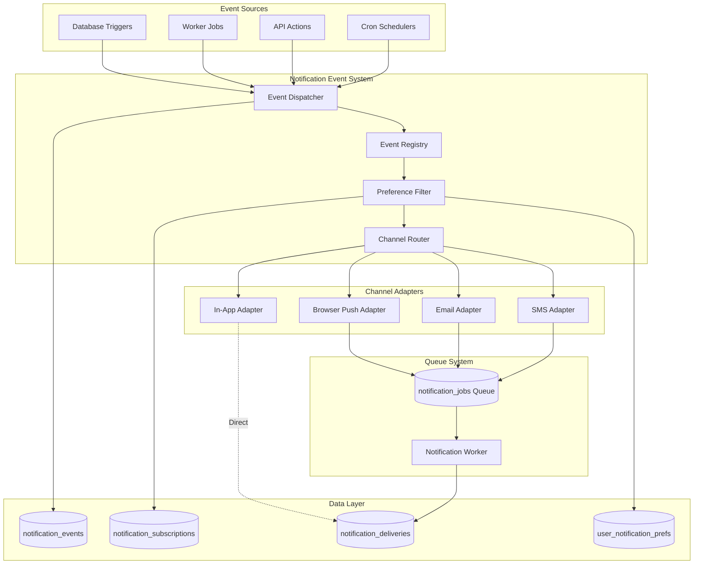
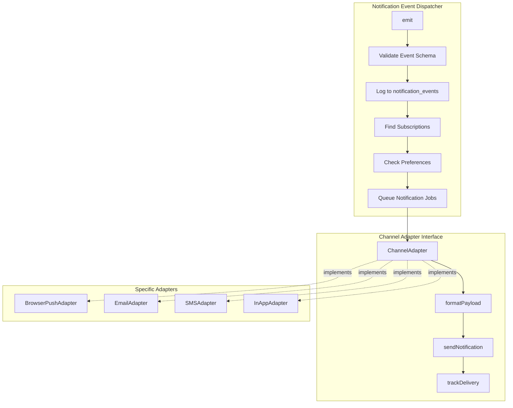
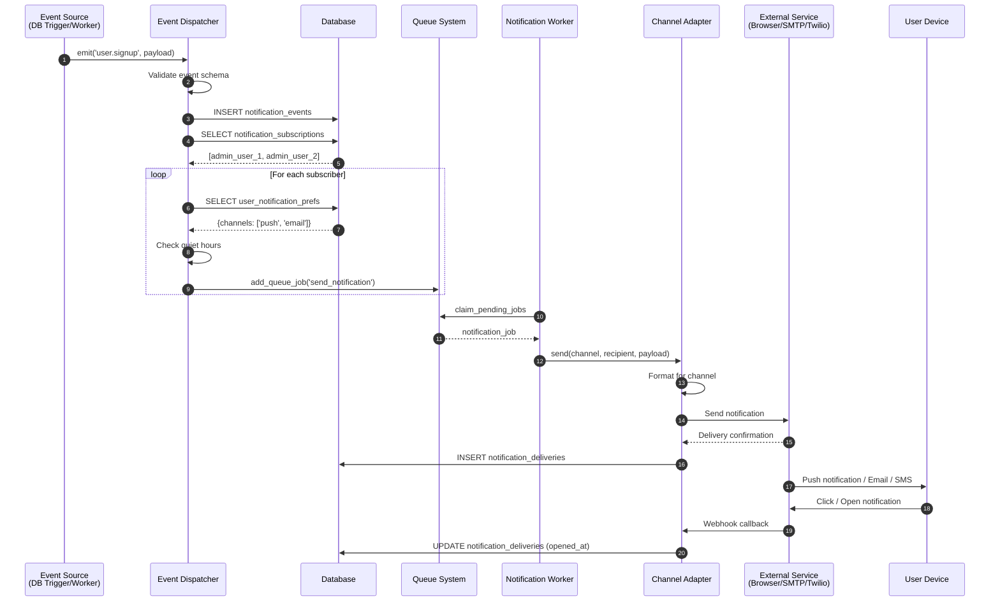
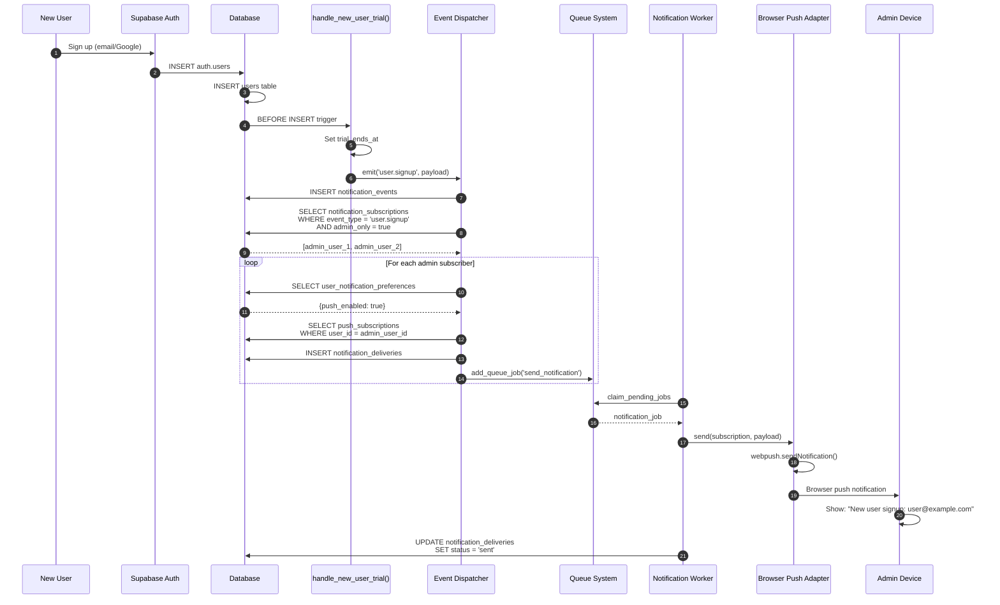
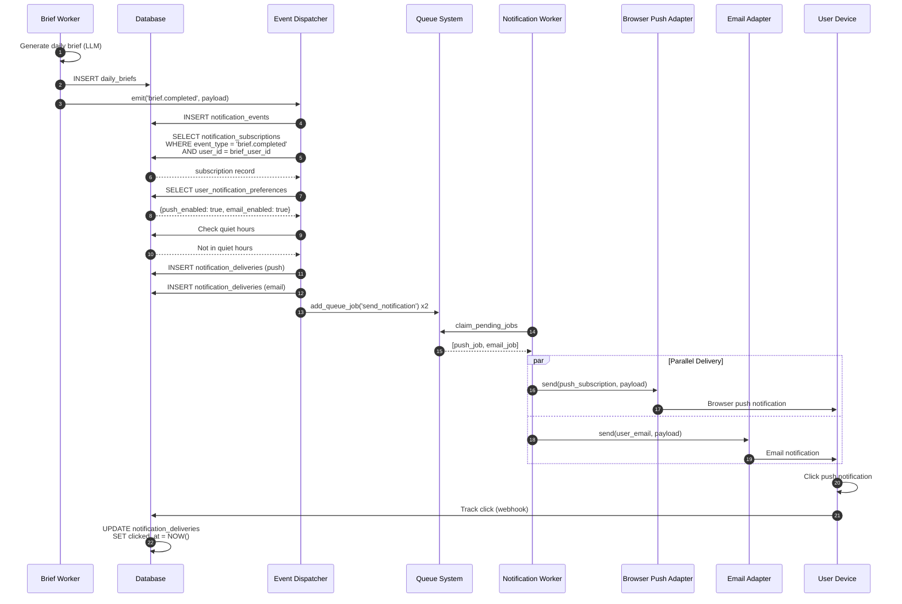

# Extensible Notification System Design

**Status:** Design Specification
**Version:** 1.0
**Last Updated:** 2025-10-05
**Author:** Architecture Team

---

## Table of Contents

1. [Executive Summary](#executive-summary)
2. [System Overview](#system-overview)
3. [Architecture](#architecture)
4. [Database Schema](#database-schema)
5. [Event Registry](#event-registry)
6. [Channel Adapters](#channel-adapters)
7. [Use Case Flows](#use-case-flows)
8. [Implementation Phases](#implementation-phases)
9. [Code Examples](#code-examples)
10. [Testing Strategy](#testing-strategy)
11. [Monitoring & Observability](#monitoring--observability)
12. [Migration Path](#migration-path)

---

## Executive Summary

### Problem Statement

BuildOS currently lacks a unified, extensible notification system. Notifications are currently handled through:

- **In-app notifications**: Generic stackable notification system (UI-only)
- **Email**: Daily briefs via worker service
- **SMS**: Event reminders via Twilio
- **No cross-cutting notification infrastructure** for system events

### Solution

Design and implement an **event-driven notification system** that:

✅ **Decouples event sources from delivery channels**
✅ **Supports multi-channel delivery** (browser push, email, SMS, in-app)
✅ **Provides granular user preferences** per event type and channel
✅ **Enables admin-only events** for system monitoring
✅ **Scales horizontally** using existing queue infrastructure
✅ **Tracks delivery and engagement** for all channels
✅ **Easily extensible** for new event types and channels

### Initial Use Cases

**Phase 1: Admin Notifications**

- **Event**: User signup (`user.signup`)
- **Audience**: Admin users only
- **Channels**: Browser push (future: Slack, email digest)
- **Purpose**: Monitor new user signups in real-time

**Phase 2: User Notifications**

- **Event**: Daily brief complete (`brief.completed`)
- **Audience**: Individual users
- **Channels**: Browser push, email (already exists), SMS (optional)
- **Purpose**: Notify users when their daily brief is ready

### Key Metrics

- **Delivery Rate**: % of notifications successfully delivered
- **Engagement Rate**: % of notifications clicked/opened
- **Opt-Out Rate**: % of users disabling notification types
- **Channel Preference**: Distribution across channels (push/email/SMS)

---

## System Overview

### Architecture Layers



### Core Principles

1. **Event-Driven Architecture**
   - Events are immutable facts about things that happened
   - Event sources emit events without knowing about subscribers
   - Subscribers react to events independently

2. **Separation of Concerns**
   - **Event** = What happened (user.signup, brief.completed)
   - **Subscription** = Who cares about what events
   - **Preference** = How they want to be notified
   - **Delivery** = Actual notification sent via channel

3. **Preference-First Design**
   - Users opt-in to notifications (not opt-out)
   - Granular control per event type and channel
   - Quiet hours, frequency limits, channel preferences

4. **Queue-Based Delivery**
   - All notifications go through queue system
   - Retry logic for failed deliveries
   - Idempotent operations
   - Audit trail of all attempts

5. **Extensibility**
   - Adding new event types: Register in event registry
   - Adding new channels: Implement adapter interface
   - No changes to core dispatcher logic

---

## Architecture

### Component Diagram



### Sequence Diagram: Event to Delivery



---

## Database Schema

### notification_events

**Purpose:** Immutable log of all notification-worthy events

```sql
CREATE TABLE notification_events (
  id UUID PRIMARY KEY DEFAULT uuid_generate_v4(),
  event_type TEXT NOT NULL,           -- 'user.signup', 'brief.completed'
  event_source TEXT NOT NULL,          -- 'database_trigger', 'worker_job', 'api_action'

  -- Event data
  actor_user_id UUID REFERENCES users(id),  -- Who caused the event (null for system)
  target_user_id UUID REFERENCES users(id), -- Who is affected (null for system-wide)
  payload JSONB NOT NULL,              -- Event-specific data

  -- Metadata
  created_at TIMESTAMPTZ DEFAULT NOW(),
  metadata JSONB,                      -- Additional context

  -- Indexes
  CONSTRAINT valid_event_type CHECK (event_type ~ '^[a-z]+\.[a-z_]+$')
);

CREATE INDEX idx_notification_events_type ON notification_events(event_type);
CREATE INDEX idx_notification_events_target_user ON notification_events(target_user_id);
CREATE INDEX idx_notification_events_created_at ON notification_events(created_at DESC);
```

**Example Event:**

```json
{
  "id": "uuid",
  "event_type": "user.signup",
  "event_source": "database_trigger",
  "actor_user_id": "new-user-id",
  "target_user_id": null,
  "payload": {
    "user_email": "user@example.com",
    "signup_method": "google_oauth",
    "referral_source": "organic"
  },
  "created_at": "2025-10-05T12:00:00Z"
}
```

---

### notification_subscriptions

**Purpose:** Who subscribes to what events

```sql
CREATE TABLE notification_subscriptions (
  id UUID PRIMARY KEY DEFAULT uuid_generate_v4(),
  user_id UUID REFERENCES users(id) ON DELETE CASCADE NOT NULL,
  event_type TEXT NOT NULL,

  -- Subscription scope
  is_active BOOLEAN DEFAULT TRUE,
  admin_only BOOLEAN DEFAULT FALSE,   -- Only admins can subscribe

  -- Filters (optional)
  filters JSONB,                      -- Event-specific filters

  -- Metadata
  created_at TIMESTAMPTZ DEFAULT NOW(),
  updated_at TIMESTAMPTZ DEFAULT NOW(),
  created_by UUID REFERENCES users(id), -- For audit trail

  -- Prevent duplicates
  UNIQUE(user_id, event_type)
);

CREATE INDEX idx_notif_subs_user_id ON notification_subscriptions(user_id);
CREATE INDEX idx_notif_subs_event_type ON notification_subscriptions(event_type);
CREATE INDEX idx_notif_subs_active ON notification_subscriptions(is_active) WHERE is_active = true;
```

**Example Subscriptions:**

```sql
-- Admin subscribes to user signups
INSERT INTO notification_subscriptions (user_id, event_type, admin_only)
VALUES ('admin-user-id', 'user.signup', true);

-- User subscribes to their own daily briefs
INSERT INTO notification_subscriptions (user_id, event_type)
VALUES ('user-id', 'brief.completed', false);
```

---

### user_notification_preferences

**Purpose:** Per-user, per-event-type, per-channel preferences

```sql
CREATE TABLE user_notification_preferences (
  id UUID PRIMARY KEY DEFAULT uuid_generate_v4(),
  user_id UUID REFERENCES users(id) ON DELETE CASCADE NOT NULL,
  event_type TEXT NOT NULL,

  -- Channel preferences
  push_enabled BOOLEAN DEFAULT TRUE,
  email_enabled BOOLEAN DEFAULT TRUE,
  sms_enabled BOOLEAN DEFAULT FALSE,
  in_app_enabled BOOLEAN DEFAULT TRUE,

  -- Delivery preferences
  priority TEXT DEFAULT 'normal',    -- 'urgent', 'normal', 'low'
  batch_enabled BOOLEAN DEFAULT FALSE, -- Batch multiple notifications
  batch_interval_minutes INTEGER,    -- Batch every N minutes

  -- Quiet hours
  quiet_hours_enabled BOOLEAN DEFAULT FALSE,
  quiet_hours_start TIME DEFAULT '22:00:00',
  quiet_hours_end TIME DEFAULT '08:00:00',
  timezone TEXT DEFAULT 'UTC',

  -- Frequency limits
  max_per_day INTEGER,               -- Null = unlimited
  max_per_hour INTEGER,

  -- Metadata
  created_at TIMESTAMPTZ DEFAULT NOW(),
  updated_at TIMESTAMPTZ DEFAULT NOW(),

  UNIQUE(user_id, event_type)
);

CREATE INDEX idx_user_notif_prefs_user_id ON user_notification_preferences(user_id);
CREATE INDEX idx_user_notif_prefs_event_type ON user_notification_preferences(event_type);
```

**Default Preferences:**

```sql
-- Auto-create default preferences when user subscribes
CREATE OR REPLACE FUNCTION create_default_notification_prefs()
RETURNS TRIGGER AS $$
BEGIN
  INSERT INTO user_notification_preferences (user_id, event_type)
  VALUES (NEW.user_id, NEW.event_type)
  ON CONFLICT (user_id, event_type) DO NOTHING;

  RETURN NEW;
END;
$$ LANGUAGE plpgsql;

CREATE TRIGGER create_notif_prefs_on_subscribe
AFTER INSERT ON notification_subscriptions
FOR EACH ROW EXECUTE FUNCTION create_default_notification_prefs();
```

---

### notification_deliveries

**Purpose:** Track all notification deliveries across all channels

```sql
CREATE TABLE notification_deliveries (
  id UUID PRIMARY KEY DEFAULT uuid_generate_v4(),

  -- Event relationship
  event_id UUID REFERENCES notification_events(id) ON DELETE CASCADE,
  subscription_id UUID REFERENCES notification_subscriptions(id),

  -- Recipient
  recipient_user_id UUID REFERENCES users(id) ON DELETE CASCADE NOT NULL,

  -- Channel details
  channel TEXT NOT NULL,              -- 'push', 'email', 'sms', 'in_app'
  channel_identifier TEXT,            -- Push endpoint, email address, phone number

  -- Delivery status
  status TEXT NOT NULL DEFAULT 'pending',  -- 'pending', 'sent', 'delivered', 'failed', 'bounced'

  -- Payload
  payload JSONB NOT NULL,             -- Channel-specific formatted payload

  -- Tracking
  sent_at TIMESTAMPTZ,
  delivered_at TIMESTAMPTZ,
  opened_at TIMESTAMPTZ,
  clicked_at TIMESTAMPTZ,
  failed_at TIMESTAMPTZ,

  -- Retry tracking
  attempts INTEGER DEFAULT 0,
  max_attempts INTEGER DEFAULT 3,
  last_error TEXT,

  -- External tracking IDs
  external_id TEXT,                   -- Provider message ID
  tracking_id TEXT,                   -- Internal tracking ID

  -- Metadata
  created_at TIMESTAMPTZ DEFAULT NOW(),
  updated_at TIMESTAMPTZ DEFAULT NOW(),

  CONSTRAINT valid_channel CHECK (channel IN ('push', 'email', 'sms', 'in_app')),
  CONSTRAINT valid_status CHECK (status IN ('pending', 'sent', 'delivered', 'failed', 'bounced', 'opened', 'clicked'))
);

CREATE INDEX idx_notif_deliveries_event_id ON notification_deliveries(event_id);
CREATE INDEX idx_notif_deliveries_recipient ON notification_deliveries(recipient_user_id);
CREATE INDEX idx_notif_deliveries_status ON notification_deliveries(status);
CREATE INDEX idx_notif_deliveries_channel ON notification_deliveries(channel);
CREATE INDEX idx_notif_deliveries_created_at ON notification_deliveries(created_at DESC);
```

---

### notification_jobs (Queue Integration)

**Extends existing queue_jobs table with new job type:**

```sql
-- Add to existing queue_type enum
ALTER TYPE queue_type ADD VALUE 'send_notification';

-- Metadata schema for send_notification jobs
{
  "event_id": "uuid",
  "recipient_user_id": "uuid",
  "channel": "push|email|sms|in_app",
  "delivery_id": "uuid",
  "payload": {
    "title": "New User Signup",
    "body": "user@example.com just signed up",
    "action_url": "/admin/users",
    "icon_url": "/icons/user-signup.png"
  }
}
```

---

## Event Registry

### Event Type Definitions

```typescript
// packages/shared-types/src/notifications.types.ts

export type EventType =
  // Admin Events (restricted)
  | "user.signup"
  | "user.trial_expired"
  | "payment.failed"
  | "error.critical"

  // User Events (per-user)
  | "brief.completed"
  | "brief.failed"
  | "brain_dump.processed"
  | "task.due_soon"
  | "project.phase_scheduled"
  | "calendar.sync_failed";

export interface NotificationEvent<T = any> {
  event_type: EventType;
  event_source:
    | "database_trigger"
    | "worker_job"
    | "api_action"
    | "cron_scheduler";
  actor_user_id?: string;
  target_user_id?: string;
  payload: T;
  metadata?: Record<string, any>;
}

// Event-specific payload interfaces
export interface UserSignupEventPayload {
  user_id: string;
  user_email: string;
  signup_method: "email" | "google_oauth";
  referral_source?: string;
}

export interface BriefCompletedEventPayload {
  brief_id: string;
  brief_date: string;
  timezone: string;
  task_count: number;
  project_count: number;
}
```

### Event Registry Implementation

```typescript
// apps/worker/src/services/notification-event-registry.ts

export interface EventDefinition {
  type: EventType;
  adminOnly: boolean;
  description: string;
  defaultChannels: NotificationChannel[];
  payloadSchema: z.ZodSchema;
}

export const EVENT_REGISTRY: Record<EventType, EventDefinition> = {
  "user.signup": {
    type: "user.signup",
    adminOnly: true,
    description: "New user signs up for BuildOS",
    defaultChannels: ["push", "in_app"],
    payloadSchema: z.object({
      user_id: z.string().uuid(),
      user_email: z.string().email(),
      signup_method: z.enum(["email", "google_oauth"]),
      referral_source: z.string().optional(),
    }),
  },

  "brief.completed": {
    type: "brief.completed",
    adminOnly: false,
    description: "Daily brief generation complete",
    defaultChannels: ["push", "email"],
    payloadSchema: z.object({
      brief_id: z.string().uuid(),
      brief_date: z.string(),
      timezone: z.string(),
      task_count: z.number(),
      project_count: z.number(),
    }),
  },

  // ... more events
};
```

---

## Channel Adapters

### Adapter Interface

```typescript
// apps/worker/src/services/notifications/adapters/base-adapter.ts

export interface NotificationPayload {
  title: string;
  body: string;
  action_url?: string;
  icon_url?: string;
  image_url?: string;
  data?: Record<string, any>;
}

export interface DeliveryResult {
  success: boolean;
  external_id?: string;
  error?: string;
}

export abstract class ChannelAdapter {
  abstract channel: NotificationChannel;

  /**
   * Format generic notification payload for this channel
   */
  abstract formatPayload(
    event: NotificationEvent,
    payload: NotificationPayload,
  ): any;

  /**
   * Send notification via this channel
   */
  abstract send(
    recipient: string,
    formattedPayload: any,
  ): Promise<DeliveryResult>;

  /**
   * Track delivery status
   */
  async trackDelivery(
    deliveryId: string,
    result: DeliveryResult,
  ): Promise<void> {
    await supabase
      .from("notification_deliveries")
      .update({
        status: result.success ? "sent" : "failed",
        sent_at: result.success ? new Date().toISOString() : null,
        failed_at: result.success ? null : new Date().toISOString(),
        external_id: result.external_id,
        last_error: result.error,
        attempts: supabase.raw("attempts + 1"),
      })
      .eq("id", deliveryId);
  }
}
```

### Browser Push Adapter

```typescript
// apps/worker/src/services/notifications/adapters/push-adapter.ts

import webpush from "web-push";

export class BrowserPushAdapter extends ChannelAdapter {
  channel: NotificationChannel = "push";

  formatPayload(event: NotificationEvent, payload: NotificationPayload): any {
    return {
      title: payload.title,
      body: payload.body,
      icon:
        payload.icon_url ||
        "/AppImages/android/android-launchericon-192-192.png",
      badge: "/AppImages/android/android-launchericon-96-96.png",
      tag: event.event_type,
      requireInteraction: false,
      data: {
        url: payload.action_url,
        event_type: event.event_type,
        ...payload.data,
      },
    };
  }

  async send(
    subscription: string, // JSON stringified PushSubscription
    formattedPayload: any,
  ): Promise<DeliveryResult> {
    try {
      const pushSubscription = JSON.parse(subscription);

      await webpush.sendNotification(
        pushSubscription,
        JSON.stringify(formattedPayload),
        {
          TTL: 60 * 60 * 24, // 24 hours
          urgency: "normal",
        },
      );

      return { success: true };
    } catch (error: any) {
      if (error.statusCode === 410) {
        // Subscription expired - mark for cleanup
        return { success: false, error: "Subscription expired" };
      }
      return { success: false, error: error.message };
    }
  }
}
```

### Email Adapter

```typescript
// apps/worker/src/services/notifications/adapters/email-adapter.ts

export class EmailAdapter extends ChannelAdapter {
  channel: NotificationChannel = "email";

  formatPayload(event: NotificationEvent, payload: NotificationPayload): any {
    return {
      subject: payload.title,
      html: this.renderTemplate(event, payload),
      text: payload.body,
    };
  }

  async send(email: string, formattedPayload: any): Promise<DeliveryResult> {
    try {
      // Reuse existing email infrastructure
      const result = await emailService.send({
        to: email,
        subject: formattedPayload.subject,
        html: formattedPayload.html,
        text: formattedPayload.text,
      });

      return { success: true, external_id: result.messageId };
    } catch (error: any) {
      return { success: false, error: error.message };
    }
  }

  private renderTemplate(
    event: NotificationEvent,
    payload: NotificationPayload,
  ): string {
    // Template rendering logic
    return `
      <div style="font-family: sans-serif;">
        <h2>${payload.title}</h2>
        <p>${payload.body}</p>
        ${payload.action_url ? `<a href="${payload.action_url}">View Details</a>` : ""}
      </div>
    `;
  }
}
```

### In-App Adapter

```typescript
// apps/worker/src/services/notifications/adapters/in-app-adapter.ts

export class InAppAdapter extends ChannelAdapter {
  channel: NotificationChannel = "in_app";

  formatPayload(event: NotificationEvent, payload: NotificationPayload): any {
    return {
      type: "info",
      title: payload.title,
      message: payload.body,
      action_url: payload.action_url,
    };
  }

  async send(userId: string, formattedPayload: any): Promise<DeliveryResult> {
    try {
      // Insert into user_notifications table (existing infrastructure)
      await supabase.from("user_notifications").insert({
        user_id: userId,
        type: formattedPayload.type,
        title: formattedPayload.title,
        message: formattedPayload.message,
        action_url: formattedPayload.action_url,
      });

      return { success: true };
    } catch (error: any) {
      return { success: false, error: error.message };
    }
  }
}
```

---

## Use Case Flows

### Use Case 1: Admin Notification on User Signup

#### Flow Diagram



#### Implementation

**1. Database Trigger (Event Source)**

```sql
-- apps/web/supabase/migrations/YYYYMMDD_add_user_signup_notification.sql

CREATE OR REPLACE FUNCTION handle_new_user_trial()
RETURNS TRIGGER AS $$
BEGIN
  -- Existing trial logic
  NEW.subscription_status := 'trialing';
  NEW.trial_ends_at := NOW() + INTERVAL '14 days';

  -- NEW: Emit user signup event
  PERFORM emit_notification_event(
    p_event_type := 'user.signup',
    p_event_source := 'database_trigger',
    p_actor_user_id := NEW.id,
    p_payload := jsonb_build_object(
      'user_id', NEW.id,
      'user_email', NEW.email,
      'signup_method', COALESCE(NEW.provider, 'email'),
      'referral_source', NEW.referral_source
    )
  );

  RETURN NEW;
END;
$$ LANGUAGE plpgsql;
```

**2. Event Emission Function**

```sql
-- RPC function to emit events
CREATE OR REPLACE FUNCTION emit_notification_event(
  p_event_type TEXT,
  p_event_source TEXT,
  p_actor_user_id UUID DEFAULT NULL,
  p_target_user_id UUID DEFAULT NULL,
  p_payload JSONB DEFAULT '{}'::jsonb
)
RETURNS UUID AS $$
DECLARE
  v_event_id UUID;
  v_subscription RECORD;
  v_prefs RECORD;
  v_delivery_id UUID;
BEGIN
  -- Insert event
  INSERT INTO notification_events (
    event_type,
    event_source,
    actor_user_id,
    target_user_id,
    payload
  ) VALUES (
    p_event_type,
    p_event_source,
    p_actor_user_id,
    p_target_user_id,
    p_payload
  ) RETURNING id INTO v_event_id;

  -- Find subscriptions
  FOR v_subscription IN
    SELECT * FROM notification_subscriptions
    WHERE event_type = p_event_type
      AND is_active = true
  LOOP
    -- Get preferences
    SELECT * INTO v_prefs
    FROM user_notification_preferences
    WHERE user_id = v_subscription.user_id
      AND event_type = p_event_type;

    -- Check quiet hours (simplified - full logic in worker)
    IF v_prefs.quiet_hours_enabled THEN
      -- Skip for now, worker will handle
    END IF;

    -- Queue notifications for enabled channels
    IF v_prefs.push_enabled THEN
      INSERT INTO notification_deliveries (
        event_id,
        subscription_id,
        recipient_user_id,
        channel,
        payload,
        status
      ) VALUES (
        v_event_id,
        v_subscription.id,
        v_subscription.user_id,
        'push',
        p_payload,
        'pending'
      ) RETURNING id INTO v_delivery_id;

      -- Queue job
      PERFORM add_queue_job(
        p_user_id := v_subscription.user_id,
        p_job_type := 'send_notification',
        p_metadata := jsonb_build_object(
          'event_id', v_event_id,
          'delivery_id', v_delivery_id,
          'channel', 'push'
        )
      );
    END IF;

    -- Repeat for other enabled channels (email, SMS)
  END LOOP;

  RETURN v_event_id;
END;
$$ LANGUAGE plpgsql;
```

**3. Admin Subscription Seeding**

```sql
-- Seed admin subscriptions for user.signup event
INSERT INTO notification_subscriptions (user_id, event_type, admin_only)
SELECT
  id,
  'user.signup',
  true
FROM users
WHERE is_admin = true
ON CONFLICT (user_id, event_type) DO NOTHING;

-- Seed default preferences
INSERT INTO user_notification_preferences (user_id, event_type, push_enabled)
SELECT
  id,
  'user.signup',
  true
FROM users
WHERE is_admin = true
ON CONFLICT (user_id, event_type) DO NOTHING;
```

---

### Use Case 2: User Notification on Daily Brief Complete

#### Flow Diagram



#### Implementation

**1. Worker Event Emission**

```typescript
// apps/worker/src/workers/brief/briefWorker.ts (line 255)

async function processBrief(job: ProcessingJob<BriefMetadata>) {
  const { userId, briefDate, timezone } = job.metadata;

  // ... existing brief generation logic

  const brief = await generateBrief(userId, briefDate, timezone);

  // Save brief
  await supabase.from("daily_briefs").insert(brief);

  // EXISTING: Realtime notification
  await notifyUser("brief_completed", {
    briefId: brief.id,
    briefDate,
    timezone,
  });

  // NEW: Emit notification event
  await notificationEventDispatcher.emit("brief.completed", {
    event_source: "worker_job",
    target_user_id: userId,
    payload: {
      brief_id: brief.id,
      brief_date: briefDate,
      timezone,
      task_count: brief.task_count,
      project_count: brief.project_count,
    },
  });

  // Queue email job (existing)
  if (userPrefs.email_daily_brief) {
    await queue.add("generate_brief_email", userId, { briefId: brief.id });
  }
}
```

**2. User Subscription (Auto-Created)**

```sql
-- Auto-subscribe users to their own brief completions
CREATE OR REPLACE FUNCTION auto_subscribe_brief_completions()
RETURNS TRIGGER AS $$
BEGIN
  -- When user enables email_daily_brief preference
  -- Auto-create notification subscription
  IF NEW.email_daily_brief = true THEN
    INSERT INTO notification_subscriptions (user_id, event_type)
    VALUES (NEW.user_id, 'brief.completed')
    ON CONFLICT (user_id, event_type) DO UPDATE
    SET is_active = true;
  END IF;

  RETURN NEW;
END;
$$ LANGUAGE plpgsql;

CREATE TRIGGER auto_subscribe_on_brief_preference
AFTER INSERT OR UPDATE ON user_brief_preferences
FOR EACH ROW EXECUTE FUNCTION auto_subscribe_brief_completions();
```

**3. Notification Settings UI**

```svelte
<!-- apps/web/src/lib/components/settings/BriefNotificationPreferences.svelte -->
<script lang="ts">
  import { onMount } from 'svelte';
  import { notificationPreferencesService } from '$lib/services/notification-preferences.service';

  let preferences = $state<UserNotificationPreferences | null>(null);

  onMount(async () => {
    preferences = await notificationPreferencesService.get('brief.completed');
  });

  async function updateChannel(channel: string, enabled: boolean) {
    await notificationPreferencesService.update('brief.completed', {
      [`${channel}_enabled`]: enabled
    });
  }
</script>

<div class="space-y-4">
  <h3 class="font-semibold">Daily Brief Notifications</h3>

  {#if preferences}
    <label class="flex items-center gap-3">
      <input
        type="checkbox"
        checked={preferences.push_enabled}
        onchange={(e) => updateChannel('push', e.currentTarget.checked)}
      />
      <div>
        <div class="font-medium">Browser Push</div>
        <p class="text-sm text-gray-600">
          Get instant notifications when your daily brief is ready
        </p>
      </div>
    </label>

    <label class="flex items-center gap-3">
      <input
        type="checkbox"
        checked={preferences.email_enabled}
        onchange={(e) => updateChannel('email', e.currentTarget.checked)}
      />
      <div>
        <div class="font-medium">Email</div>
        <p class="text-sm text-gray-600">
          Receive brief in your inbox (recommended)
        </p>
      </div>
    </label>

    <label class="flex items-center gap-3">
      <input
        type="checkbox"
        checked={preferences.sms_enabled}
        onchange={(e) => updateChannel('sms', e.currentTarget.checked)}
      />
      <div>
        <div class="font-medium">SMS</div>
        <p class="text-sm text-gray-600">
          Text message notification (standard rates apply)
        </p>
      </div>
    </label>
  {/if}
</div>
```

---

## Implementation Phases

### Phase 1: Foundation (Week 1-2)

**Goal:** Core notification event system with admin-only user signup notifications

**Tasks:**

1. ✅ Database schema
   - Create `notification_events` table
   - Create `notification_subscriptions` table
   - Create `user_notification_preferences` table
   - Create `notification_deliveries` table
   - Add RLS policies

2. ✅ Event dispatcher
   - Create `emit_notification_event()` RPC function
   - Implement event validation
   - Implement subscription lookup
   - Implement preference filtering

3. ✅ Browser push infrastructure (from previous research)
   - Service worker with push handlers
   - VAPID key generation
   - Push subscription management
   - Frontend preferences UI

4. ✅ User signup event
   - Modify `handle_new_user_trial()` trigger
   - Seed admin subscriptions
   - Test end-to-end flow

**Success Criteria:**

- Admins receive browser push when new users sign up
- All events logged to `notification_events`
- Deliveries tracked in `notification_deliveries`

---

### Phase 2: Queue Integration (Week 3)

**Goal:** Move notification delivery to queue system

**Tasks:**

1. ✅ Notification worker
   - Create `processNotification` job handler
   - Integrate with existing queue system
   - Implement retry logic

2. ✅ Channel adapter interface
   - Define `ChannelAdapter` base class
   - Implement `BrowserPushAdapter`
   - Implement `InAppAdapter`

3. ✅ Modify event dispatcher
   - Queue jobs instead of immediate send
   - Batch deliveries per user

**Success Criteria:**

- Notifications sent via queue system
- Failed notifications retry with exponential backoff
- Queue statistics show notification jobs

---

### Phase 3: User Notifications (Week 4)

**Goal:** Add user-facing notifications for daily brief completion

**Tasks:**

1. ✅ Brief completion event
   - Emit event from brief worker
   - Auto-subscribe users to their briefs
   - Default preference creation

2. ✅ Email adapter
   - Implement `EmailAdapter`
   - Reuse existing email infrastructure
   - Template rendering

3. ✅ Settings UI
   - Brief notification preferences page
   - Channel toggles
   - Quiet hours configuration

**Success Criteria:**

- Users receive notifications when brief completes
- Users can control notification channels
- Quiet hours respected

---

### Phase 4: Advanced Features (Week 5-6)

**Goal:** SMS support, batching, analytics

**Tasks:**

1. ✅ SMS adapter
   - Implement `SMSAdapter`
   - Integrate with existing Twilio infrastructure
   - Rate limiting

2. ✅ Notification batching
   - Batch multiple events into digest
   - Configurable interval (hourly, daily)
   - Smart grouping by event type

3. ✅ Analytics dashboard
   - Delivery rate by channel
   - Engagement metrics (opens, clicks)
   - Event type breakdown
   - User opt-out tracking

4. ✅ Additional events
   - `task.due_soon`
   - `project.phase_scheduled`
   - `calendar.sync_failed`

**Success Criteria:**

- All channels operational
- Batching reduces notification fatigue
- Admin dashboard shows metrics

---

## Code Examples

### Event Dispatcher Service

```typescript
// apps/worker/src/services/notification-event-dispatcher.ts

export class NotificationEventDispatcher {
  private adapters: Map<NotificationChannel, ChannelAdapter>;

  constructor() {
    this.adapters = new Map([
      ["push", new BrowserPushAdapter()],
      ["email", new EmailAdapter()],
      ["sms", new SMSAdapter()],
      ["in_app", new InAppAdapter()],
    ]);
  }

  /**
   * Emit a notification event
   * This is the main entry point for all notifications
   */
  async emit<T = any>(
    eventType: EventType,
    options: {
      event_source: string;
      actor_user_id?: string;
      target_user_id?: string;
      payload: T;
      metadata?: Record<string, any>;
    },
  ): Promise<string> {
    // Validate event type
    const eventDef = EVENT_REGISTRY[eventType];
    if (!eventDef) {
      throw new Error(`Unknown event type: ${eventType}`);
    }

    // Validate payload
    eventDef.payloadSchema.parse(options.payload);

    // Use RPC function for atomic event creation + subscription lookup
    const { data, error } = await supabase.rpc("emit_notification_event", {
      p_event_type: eventType,
      p_event_source: options.event_source,
      p_actor_user_id: options.actor_user_id,
      p_target_user_id: options.target_user_id,
      p_payload: options.payload,
    });

    if (error) {
      console.error(
        "[NotificationEventDispatcher] Failed to emit event:",
        error,
      );
      throw error;
    }

    return data; // event_id
  }

  /**
   * Process notification job (called by worker)
   */
  async process(job: NotificationJob): Promise<void> {
    const { event_id, delivery_id, channel } = job.metadata;

    // Get delivery record
    const { data: delivery } = await supabase
      .from("notification_deliveries")
      .select("*")
      .eq("id", delivery_id)
      .single();

    if (!delivery) {
      throw new Error(`Delivery ${delivery_id} not found`);
    }

    // Get adapter
    const adapter = this.adapters.get(channel);
    if (!adapter) {
      throw new Error(`No adapter for channel: ${channel}`);
    }

    // Send notification
    const result = await adapter.send(
      delivery.channel_identifier,
      delivery.payload,
    );

    // Track result
    await adapter.trackDelivery(delivery_id, result);

    if (!result.success) {
      throw new Error(result.error);
    }
  }
}

export const notificationEventDispatcher = new NotificationEventDispatcher();
```

---

### Notification Preferences Service

```typescript
// apps/web/src/lib/services/notification-preferences.service.ts

export class NotificationPreferencesService {
  /**
   * Get preferences for an event type
   */
  async get(eventType: EventType): Promise<UserNotificationPreferences> {
    const supabase = createSupabaseBrowser();

    const { data, error } = await supabase
      .from("user_notification_preferences")
      .select("*")
      .eq("event_type", eventType)
      .single();

    if (error && error.code !== "PGRST116") {
      throw error;
    }

    // Return default preferences if not found
    return data || this.getDefaults(eventType);
  }

  /**
   * Update preferences
   */
  async update(
    eventType: EventType,
    updates: Partial<UserNotificationPreferences>,
  ): Promise<void> {
    const supabase = createSupabaseBrowser();

    const { error } = await supabase
      .from("user_notification_preferences")
      .upsert({
        event_type: eventType,
        ...updates,
        updated_at: new Date().toISOString(),
      });

    if (error) throw error;
  }

  /**
   * Subscribe to an event type
   */
  async subscribe(eventType: EventType): Promise<void> {
    const supabase = createSupabaseBrowser();

    const { error } = await supabase.from("notification_subscriptions").insert({
      event_type: eventType,
      is_active: true,
    });

    if (error && error.code !== "23505") {
      // Ignore duplicate errors
      throw error;
    }
  }

  /**
   * Unsubscribe from an event type
   */
  async unsubscribe(eventType: EventType): Promise<void> {
    const supabase = createSupabaseBrowser();

    const { error } = await supabase
      .from("notification_subscriptions")
      .update({ is_active: false })
      .eq("event_type", eventType);

    if (error) throw error;
  }

  private getDefaults(eventType: EventType): UserNotificationPreferences {
    const eventDef = EVENT_REGISTRY[eventType];

    return {
      event_type: eventType,
      push_enabled: eventDef.defaultChannels.includes("push"),
      email_enabled: eventDef.defaultChannels.includes("email"),
      sms_enabled: eventDef.defaultChannels.includes("sms"),
      in_app_enabled: eventDef.defaultChannels.includes("in_app"),
      priority: "normal",
      batch_enabled: false,
      quiet_hours_enabled: false,
      quiet_hours_start: "22:00:00",
      quiet_hours_end: "08:00:00",
      timezone: Intl.DateTimeFormat().resolvedOptions().timeZone,
    };
  }
}

export const notificationPreferencesService =
  new NotificationPreferencesService();
```

---

## Testing Strategy

### Unit Tests

**Event Dispatcher Tests:**

```typescript
// apps/worker/src/services/__tests__/notification-event-dispatcher.test.ts

describe("NotificationEventDispatcher", () => {
  test("emits user.signup event", async () => {
    const eventId = await notificationEventDispatcher.emit("user.signup", {
      event_source: "database_trigger",
      actor_user_id: "test-user-id",
      payload: {
        user_id: "test-user-id",
        user_email: "test@example.com",
        signup_method: "email",
      },
    });

    expect(eventId).toBeDefined();

    // Verify event logged
    const { data: event } = await supabase
      .from("notification_events")
      .select("*")
      .eq("id", eventId)
      .single();

    expect(event.event_type).toBe("user.signup");
  });

  test("validates payload schema", async () => {
    await expect(
      notificationEventDispatcher.emit("user.signup", {
        event_source: "test",
        payload: { invalid: "payload" }, // Missing required fields
      }),
    ).rejects.toThrow();
  });
});
```

**Channel Adapter Tests:**

```typescript
describe("BrowserPushAdapter", () => {
  const adapter = new BrowserPushAdapter();

  test("formats payload correctly", () => {
    const formatted = adapter.formatPayload(mockEvent, {
      title: "Test Notification",
      body: "Test body",
      action_url: "/test",
    });

    expect(formatted).toHaveProperty("title");
    expect(formatted).toHaveProperty("body");
    expect(formatted.data.url).toBe("/test");
  });

  test("handles subscription expiration", async () => {
    const expiredSubscription = JSON.stringify({
      endpoint: "expired-endpoint",
      keys: { p256dh: "key", auth: "auth" },
    });

    const result = await adapter.send(expiredSubscription, mockPayload);

    expect(result.success).toBe(false);
    expect(result.error).toContain("expired");
  });
});
```

### Integration Tests

**End-to-End Flow Test:**

```typescript
describe("User Signup Notification Flow", () => {
  test("admins receive push notification on user signup", async () => {
    // Setup: Create admin subscription
    await supabase.from("notification_subscriptions").insert({
      user_id: ADMIN_USER_ID,
      event_type: "user.signup",
      admin_only: true,
    });

    // Simulate user signup
    const newUser = await createTestUser("newuser@example.com");

    // Wait for event processing
    await sleep(2000);

    // Verify event created
    const { data: events } = await supabase
      .from("notification_events")
      .select("*")
      .eq("event_type", "user.signup")
      .eq("actor_user_id", newUser.id);

    expect(events).toHaveLength(1);

    // Verify delivery queued
    const { data: deliveries } = await supabase
      .from("notification_deliveries")
      .select("*")
      .eq("event_id", events[0].id)
      .eq("recipient_user_id", ADMIN_USER_ID);

    expect(deliveries).toHaveLength(1);
    expect(deliveries[0].channel).toBe("push");
  });
});
```

---

## Monitoring & Observability

### Metrics to Track

**Delivery Metrics:**

- Notification sent rate (per channel, per event type)
- Delivery success rate
- Average delivery time
- Failed delivery rate with error breakdown

**Engagement Metrics:**

- Open rate (email, push)
- Click-through rate
- Time to engagement (from sent to opened)
- Opt-out rate per event type

**System Health:**

- Queue depth for notification jobs
- Processing latency
- Retry rate
- Channel adapter health

### Dashboard Queries

```sql
-- Delivery rate by channel (last 24 hours)
SELECT
  channel,
  COUNT(*) FILTER (WHERE status = 'sent') as sent_count,
  COUNT(*) as total_count,
  ROUND(COUNT(*) FILTER (WHERE status = 'sent')::numeric / COUNT(*) * 100, 2) as success_rate
FROM notification_deliveries
WHERE created_at > NOW() - INTERVAL '24 hours'
GROUP BY channel;

-- Engagement by event type (last 7 days)
SELECT
  ne.event_type,
  COUNT(DISTINCT nd.id) as total_deliveries,
  COUNT(DISTINCT nd.id) FILTER (WHERE nd.opened_at IS NOT NULL) as opened_count,
  COUNT(DISTINCT nd.id) FILTER (WHERE nd.clicked_at IS NOT NULL) as clicked_count,
  ROUND(
    COUNT(DISTINCT nd.id) FILTER (WHERE nd.opened_at IS NOT NULL)::numeric /
    COUNT(DISTINCT nd.id) * 100,
    2
  ) as open_rate
FROM notification_events ne
JOIN notification_deliveries nd ON nd.event_id = ne.id
WHERE ne.created_at > NOW() - INTERVAL '7 days'
GROUP BY ne.event_type
ORDER BY total_deliveries DESC;

-- Failed deliveries with error breakdown
SELECT
  channel,
  last_error,
  COUNT(*) as failure_count
FROM notification_deliveries
WHERE status = 'failed'
  AND created_at > NOW() - INTERVAL '24 hours'
GROUP BY channel, last_error
ORDER BY failure_count DESC
LIMIT 10;
```

### Admin Dashboard Component

```svelte
<!-- apps/web/src/routes/admin/notifications/+page.svelte -->
<script lang="ts">
  import { onMount } from 'svelte';
  import { notificationAnalyticsService } from '$lib/services/notification-analytics.service';

  let metrics = $state<NotificationMetrics | null>(null);

  onMount(async () => {
    metrics = await notificationAnalyticsService.getMetrics('24h');
  });
</script>

<div class="space-y-6">
  <h1 class="text-2xl font-bold">Notification Analytics</h1>

  {#if metrics}
    <!-- Delivery Rate by Channel -->
    <div class="grid grid-cols-4 gap-4">
      {#each metrics.channels as channel}
        <div class="bg-white p-4 rounded-lg shadow">
          <h3 class="font-semibold">{channel.name}</h3>
          <p class="text-3xl font-bold">{channel.success_rate}%</p>
          <p class="text-sm text-gray-600">
            {channel.sent_count} / {channel.total_count} delivered
          </p>
        </div>
      {/each}
    </div>

    <!-- Event Type Breakdown -->
    <div class="bg-white p-6 rounded-lg shadow">
      <h3 class="font-semibold mb-4">Event Type Performance</h3>
      <table class="w-full">
        <thead>
          <tr>
            <th>Event Type</th>
            <th>Deliveries</th>
            <th>Open Rate</th>
            <th>Click Rate</th>
          </tr>
        </thead>
        <tbody>
          {#each metrics.event_types as event}
            <tr>
              <td>{event.type}</td>
              <td>{event.total_deliveries}</td>
              <td>{event.open_rate}%</td>
              <td>{event.click_rate}%</td>
            </tr>
          {/each}
        </tbody>
      </table>
    </div>
  {/if}
</div>
```

---

## Migration Path

### Phase 1: Parallel Run (Week 1-2)

**Goal:** Run new system alongside existing notification infrastructure

**Steps:**

1. Deploy new schema without breaking changes
2. Emit events for new event types only (`user.signup`)
3. Keep existing daily brief email/SMS unchanged
4. Monitor metrics in admin dashboard

**Rollback Plan:**

- All new tables isolated
- No changes to existing flows
- Can disable with feature flag

---

### Phase 2: Gradual Migration (Week 3-4)

**Goal:** Migrate daily briefs to new system

**Steps:**

1. Enable `brief.completed` event emission
2. Keep existing email job for 1 week (redundancy)
3. Compare delivery rates
4. Migrate users in batches (10%, 50%, 100%)

**Success Criteria:**

- Delivery rate matches or exceeds existing system
- No user complaints
- Engagement metrics stable or improved

---

### Phase 3: Full Cutover (Week 5+)

**Goal:** Deprecate old notification infrastructure

**Steps:**

1. Remove redundant email jobs from brief worker
2. Migrate all notification types to new system
3. Remove old code paths
4. Archive unused tables

**Validation:**

- All event types tracked in analytics
- All channels operational
- User preferences migrated
- No legacy code remaining

---

## Related Documentation

**Architecture:**

- [Web-Worker Architecture](/docs/architecture/diagrams/WEB-WORKER-ARCHITECTURE.md)
- [Queue System Flow](/docs/architecture/diagrams/QUEUE-SYSTEM-FLOW.md)
- [Deployment Topology](/docs/DEPLOYMENT_TOPOLOGY.md)

**Research:**

- [PWA Browser Push Notifications Research](/thoughts/shared/research/2025-10-05_15-30-00_pwa-browser-push-notifications-research.md)
- [Admin User System Research](/thoughts/shared/research/[date]_admin-user-system-research.md)
- [Daily Brief Notification Research](/thoughts/shared/research/[date]_daily-brief-notification-research.md)

**Implementation:**

- [Browser Push Implementation (Phase 1)](/docs/architecture/BROWSER-PUSH-IMPLEMENTATION.md)
- [Notification Worker Implementation](/apps/worker/docs/features/notifications/README.md)

---

## Summary

This extensible notification system provides BuildOS with a scalable, multi-channel notification infrastructure that:

✅ **Decouples event sources from delivery** - Add new events without touching delivery logic
✅ **Supports all channels** - Browser push, email, SMS, in-app with unified interface
✅ **User-controlled preferences** - Granular control per event type and channel
✅ **Admin-first rollout** - Start with admin notifications, expand to users
✅ **Built on existing infrastructure** - Leverages queue system, database, adapters
✅ **Fully auditable** - Track every event and delivery
✅ **Horizontally scalable** - Queue-based architecture supports multiple workers

**Next Steps:**

1. Review and approve design
2. Create database migration for schema
3. Implement Phase 1 (Admin notifications for user signup)
4. Deploy and monitor for 1 week
5. Proceed to Phase 2 (User notifications for daily briefs)

**Estimated Timeline:** 6-8 weeks to full implementation
**Estimated Effort:** 120-160 hours total development time
