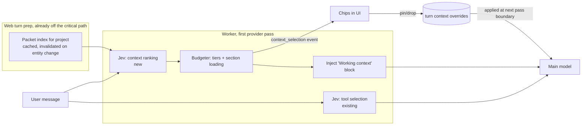

<!-- docs/architecture/JEV_CONTEXT_RANKER_2026-09-22.md -->

# Jev Context Ranker: visible, steerable context for every project turn

Status: **spec; the shared core is built** (for published specialists first) in
`CONTEXT_FINDER_2026-09-22.md`. The chat chips below are not built. DJ's decisions (2026-09-22):
chips are **steerable with no waiting**, and v1 is **ambitious**: it ranks down to the section
level inside documents.

## The idea in one paragraph

When the user sends a message inside a project, Jev scores every entity in the project against
that message. It sees each entity as a condensed packet: document title, description, and
headings; task title, state, and due date; goals, plans, milestones, and risks likewise. The
highest-scoring items, and the highest-scoring sections inside the top documents, are loaded into
the main model's context. The same ranking streams to the UI as **chips** in about 0.4 seconds, so
the user sees what the model is working from before it answers. Tapping a chip pins it or drops
it. The change takes effect at the model's next step, so a pin or drop can still land within the
current turn. Nobody waits for approval.

This is human-in-the-loop over _context_, not over _actions_. Most products show the tool calls
after the fact. This one shows the model's working set before it answers and lets the user edit
that set.

## Why this beats what we do today

Today (`packages/agentic-chat-runtime/src/context/context-loader.ts`) a project turn loads a
**recency-capped** slice: the 18 most recent tasks, 20 documents, and 12 each of goals, plans,
and milestones. Tasks keep an 80-character description in the prompt. Documents contribute
**titles only**, with no body and no headings. Risks aren't loaded at all. Two things follow:

- If the relevant thing is old or deep in a document, the model either doesn't know it exists
  or has to spend tool round trips finding it. Each round trip is a full provider pass.
- The user has no view of what the model "knows" on a turn, so a wrong answer can't be traced
  to missing context.

The ranker changes the selection rule from _recent_ to _relevant to this message_. It also turns
the selection into something the user can see and edit.

## What the user sees

```
 You: what did we decide about the pricing tiers for contractors?

 ┌ Working from ──────────────────────────────────────────────────────┐
 │ 📄 Pricing Strategy › Contractor tiers   ● 0.94                     │
 │ 📄 Samos Offers › Bid Desk               ● 0.81                     │
 │ 🎯 Launch paid tier by Q4                ● 0.77                     │
 │ ☑ Draft contractor price sheet (due Oct 3)   ◐ 0.58  nearby         │
 │ ⚠ Contractors balk at monthly billing        ◐ 0.52  nearby         │
 │                                              + 3 more · 214 checked │
 └─────────────────────────────────────────────────────────────────────┘
 Assistant: You settled on three tiers…
```

- **Timing:** the chips fade in about 0.4s after send, before the first token of the answer.
- **Tiers:** a solid dot ● means **loaded**: the content is in the model's context. A half dot ◐
  means **nearby**: the model sees only the title and summary, and fetches more with a tool if it
  needs to. Items that score below the nearby threshold don't appear.
- **Section chips:** `Pricing Strategy › Contractor tiers` names the specific heading that was
  loaded. Expanding the chip lists every scored heading in that document, with the loaded ones
  checked.
- **Live "touched" state:** when the model reads an entity during the turn, its chip gets a
  small "read" tick. That includes nearby chips and entities that weren't ranked at all; an
  unranked entity arrives as a new chip marked _found by model_. The strip then shows both what
  Jev predicted and what the model actually used.
- **Pin and drop:** tapping a chip opens a popover with the score, the reason ("mentions
  contractor pricing"), and two actions:
    - **Pin:** load this into context now, and keep it pinned for the rest of the session.
    - **Drop:** remove it from context and suppress it for the rest of the session.
    - If the model is between steps, the edit applies at the next step. If the turn has already
      finished, it applies from the next message. The popover says which of the two will happen.
- **Search to add:** a `+` at the end of the strip opens a type-ahead over all project entities,
  so the user can pin something Jev missed. That miss is also the best training label we get.
- **History:** the strip stays attached to the user message, so reopening a chat shows what each
  turn worked from.
- **Admin:** the workflow inspector gets the full score table per turn.

## How it works



### 1. Packets (web turn prep)

`worker-turn-preparation.server.ts` already builds the project context during turn prep, which
runs before the worker picks up the job. Packet building goes in the same place, and the result
is stored on the prepared artifact. The worker makes no additional database round trip.

Each entity becomes one packet of about 150 to 300 characters. The fields come from existing
columns, so there is no schema change for the packets themselves:

| Kind             | Packet fields                                                                                                                                             |
| ---------------- | --------------------------------------------------------------------------------------------------------------------------------------------------------- |
| Document         | title, `description` (200 chars), `type_key`, position in the doc tree, and H1–H3 headings from the stored `onto_documents.outline` (max 15 per document) |
| Task             | title, `state_key`, priority, `due_at`, description (160 chars)                                                                                           |
| Goal / Milestone | name/title, state, target/due date, description (160 chars)                                                                                               |
| Plan             | name, state, description (160 chars)                                                                                                                      |
| Risk             | title, impact × probability, state, content (160 chars)                                                                                                   |

- **Outline landmine:** `onto_documents.outline` is a stored heading cache, but
  `getDocumentOutline` recomputes it from `content` on every call. Packets read the stored
  column, fall back to `extractOutline()` when the cache is stale (`isOutlineStale`), and write
  the result back.
- **Size:** a 200-entity project comes to about 50KB, well under Jev's request limit (the tool
  selector already sends 60–70KB).
- **Recall prefilter for big projects:** above about 250 entities, the candidate set is cut
  down by merging three lists:
    - the top 120 matches from `onto_search_semantic`, the existing pgvector embeddings;
    - the 40 most recently touched entities;
    - everything linked to the focused entity, plus current pins.

    This is a two-stage pipeline: embeddings supply recall, and Jev supplies precision.

The packet index is cached per project in the existing materialized fast-context cache, keyed by
project and a change counter. Only the embeddings prefilter runs on every message.

### 2. Ranking (worker, first pass, in parallel with tool selection)

The ranker plugs into `turn-provider.ts` at the `if (initial)` block, the same place
`toolSelector.select` runs today. Both Jev calls run **concurrently**. That puts roughly zero
extra time on the critical path: the turn already waits about 340ms (p50) for tool selection,
and the ranker hides inside that wait.

There is one Jev decisions call through the generic `JevClient`
(`packages/smart-llm/src/jev-client.ts`). The tool selector keeps its own fetch and isn't
touched.

- **State:** the current request, the last 6 conversation turns (used only to resolve
  references), the focused entity if there is one, and the list of packets.
- **Questions:** one `noul` question per entity: _"Would the content of `packets[i]` help answer
  or act on `current_request`?"_ Documents that have headings also get one `noul` question per
  heading: _"Would section `packets[i].headings[j]` help…?"_. Sections are scored **in the same
  call**, so section-level ranking costs no second round trip.
- **Question cap:** about 300 questions per call. When a project exceeds that, heading questions
  go first to the documents with the highest prefilter scores.
- **Rules:** the same injection-safe rules the tool selector uses. User text can't change the
  policy, and relevance judgments grant no authority.
- **Unknown:** does Jev's latency grow with the number of questions? The offline eval answers
  this before anything else is built. If it does, ranking splits into an entity call and a
  heading call for the top 3 documents only, which adds about 400ms.

### 3. Budgeter (code, not the model)

> **Superseded by the 2026-09-22 eval.** Jev's scores aren't calibrated, so fixed thresholds fail
> both ways: narrow questions score their answers at 0.3–0.5, and broad questions plateau at
> 0.7–0.9. Use the rank-relative "adaptive v2" rule in
> [the eval results](../research/jev-context-ranker-2026-09-22/README.md): load in full the items
> scoring at least max(0.25, 0.6 × top), up to 10, packed so that items that don't fit are
> skipped; show the next 20 as summaries. The table below is kept as history.

The thresholds below are starting values, biased toward recall. They get retuned from the
ledger.

| Tier       | Rule                     | Goes into the prompt                                                                                                                                                                                               |
| ---------- | ------------------------ | ------------------------------------------------------------------------------------------------------------------------------------------------------------------------------------------------------------------ |
| **Loaded** | p ≥ 0.65, max 8 entities | Tasks, goals, milestones, plans, and risks: the full record. Documents: the loaded sections' text (headings with p ≥ 0.5, max 3 sections per document), or the first 1,500 chars when the document has no headings |
| **Nearby** | 0.35 ≤ p < 0.65, max 12  | The packet line only, with an ID the model can fetch by                                                                                                                                                            |
| Hidden     | p < 0.35                 | Nothing. The existing recency-based "Loaded Context" stays as a baseline in v1                                                                                                                                     |

- **Hard budget:** the loaded content is capped at 14K characters. Items are trimmed lowest
  score first.
- **Pins:** pinned items are always loaded and count against the budget first.
- **Drops:** dropped items are excluded even when Jev scores them high.
- **Injection:** the injected block is a system message titled _"Working context for this
  message (selected for relevance; fetch anything else with tools)"_, added with
  `appendSystemInstruction`. It goes after the stable system prompt, so it doesn't disturb the
  prompt's cache prefix. The cross-turn cache is already dead above about 6K characters of
  system prompt, per the 09-18 tool-selection eval.

### 4. Chips stream (worker to UI)

- **New event:** `context_selection` in the `AgentStreamEventV1` stream (phase `prompt`). It is
  published as soon as the budgeter finishes, so it arrives before the first `text_delta`. It is
  also persisted through `persist_agentic_chat_semantic_event` so the chips survive a reload.
- **Payload:** `{ items: [{ kind, id, title, p, tier, reason?, sections?: [{ heading, p, loaded }] }], checked: number, ranker: { status, durationMs } }`.
- **"Read" ticks:** these need no new event. The UI adapter matches existing `tool_call` events
  (`get_onto_*_details`, `read_document_section`, and so on) against chip IDs.
- **New component:** `apps/web/src/lib/components/agent/ContextChips.svelte`. It is rendered by
  `AgentMessageList.svelte` under the user message and styled with Inkprint tokens. The kind
  icons come from the central Lucide exports.

### 5. Steering (pin and drop mid-turn)

- **Endpoint:** `POST /api/agent/v2/turns/[turnRunId]/context` takes `{ op: 'pin' | 'drop',
kind, id }` and returns an `ApiResponse`. It writes to a new small table,
  `chat_session_context_overrides` (session, entity, op, created_at, with RLS scoped to the
  session owner).
- **Worker side:** at every pass boundary after the first, the provider loop reads the overrides
  for the turn. That is one indexed query, skipped when the realtime channel has signalled no
  change. The loop then appends:
    - for a pin: _"The user pinned X — here is its content"_;
    - for a drop: _"The user removed X from context; do not rely on it"_.

    A text-only turn has no later pass, so the override applies from the next message. That is
    why the popover says which case applies.

- **Session scope:** overrides persist for the session. On the next turn, the budgeter reads
  them before injecting.

### 6. Ledger: the eval comes almost for free

Each turn stores a receipt: model, duration, cost, candidate count, and every probability. From
the turn's own events we can then get labels without asking the user:

- **Miss:** the model fetched an entity Jev scored below the nearby threshold, or the user
  pinned or searched for one.
- **Waste:** a loaded item that the model never cited or read, or that the user dropped.
- **Hit:** a loaded item that the model's answer cited or its tools read.

The admin workflow inspector (Tasker 91) gets a _Context_ tab showing this table. Threshold
retuning and a future "replace the recency slice" decision both run off this ledger.

## Rollout

The flag is `AGENTIC_CHAT_JEV_CONTEXT=off|shadow|chips|on`. It defaults to `off`, and each stage
is gated on DJ's approval.

1. **Offline eval** (paid, but cheap: Jev costs about $0.001 per turn). Replay about 40 real
   messages from DJ's projects, including the Samos project and the book project, and hand-label
   what should have loaded. This answers three questions:
    - Does Jev beat the embeddings-only baseline?
    - How does latency grow with the question count?
    - Are the thresholds right?
2. **Shadow:** rank on live turns, write receipts, change nothing. Worst-case latency is zero.
3. **Chips:** show the chips and allow pins and drops, but inject only the pinned items. This
   tests whether the view alone builds trust.
4. **On:** inject the loaded tier. Compare turns with and without it on tool round trips per
   turn, time to first token, and cost.
5. **Later, measured:** shrink or remove the recency-based "Loaded Context" section once the
   ledger shows the ranker's recall is at least as good. The prompt should get smaller.

**Fallback:** if Jev times out (1.5s), errors, or the project isn't focused, the turn runs
exactly as it does today, and the chip strip shows _"Context: default"_.

## Costs and performance

- **Jev:** about $0.0006–0.0015 per project turn. Latency sits in parallel with the existing
  tool-selection call, and the timeout is 1.5s.
- **Main model:** the injected block adds up to about 14K characters on turns where items load.
  The expected savings are the one or two tool round trips per turn now spent finding things,
  and each round trip is a full provider pass. The net effect is likely cheaper and faster, but
  that is unproven until stage 4 measures it.
- **Web prep:** building the packets reuses the cached context load. On a cache miss it adds one
  query, about 30–60ms, and that happens off the chat's critical path.

## Out of scope for v1

- Global and cross-project chat: only project-focused turns are ranked.
- Ranking chat history, emails, or calendar.
- Embedding headings separately.
- Replacing the recency slice (that is stage 5).

## Build order (for when this is approved)

1. The offline eval script in `apps/worker/scripts/jev-context-eval.ts`, using the packet
   builder plus the `JevClient` question builder. This needs paid-run approval.
2. The packet builder and cache, in shared runtime, with unit tests on real project fixtures.
3. The `JevContextRanker` port in the worker, with shadow mode and receipts.
4. The `context_selection` event, `ContextChips.svelte`, and the adapter's read-tick matching.
5. The overrides table, the endpoint, and pass-boundary application.
6. The budgeter injection behind the `on` flag, plus the inspector's Context tab.

## Landmines

- `jev-tool-selector.ts` was written in another session. Put the ranker in a new file, and
  **don't merge the two calls**. The combined payload could break the 64K-token Jev limit, and
  the tool selector's eval baseline would be lost.
- Web deploys were failing as of 2026-09-18 (Vite couldn't resolve `@buildos/shared-types`).
  Confirm web is deploying before stage 3, or the chips will be live in the worker with no UI.
- Other sessions sweep in-flight edits with "updates" commits. Commit with an explicit pathspec.
