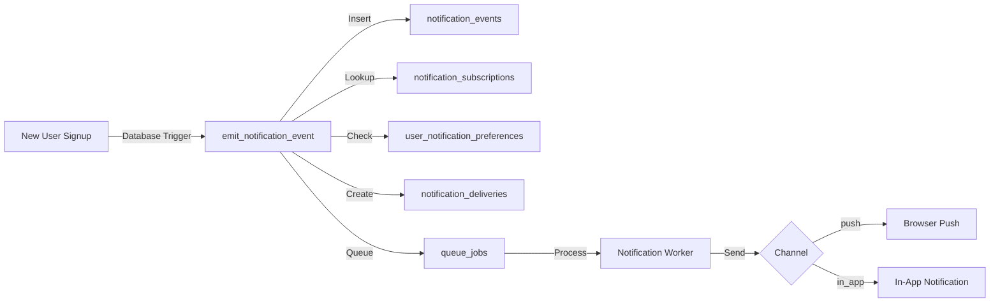

<!-- docs/architecture/NOTIFICATION_SYSTEM_PHASE1_IMPLEMENTATION.md -->

# Notification System Phase 1 - Implementation Guide

**Status:** Ready for Deployment
**Version:** 1.0
**Last Updated:** 2025-10-06
**Author:** BuildOS Engineering Team

---

**Update (2026-02-05):** The production notification system now enforces explicit opt-in.
`user_notification_preferences` is one row per user with defaults set to false, subscriptions are
activated only via explicit opt-in (`created_by` set) or `admin_only=true`, and
`emit_notification_event` fails closed when preferences are missing. See
`supabase/migrations/20260205_001_notification_opt_in_defaults.sql` and
`supabase/migrations/20260205_002_emit_notification_event_opt_in.sql` for the current logic.

## Overview

Phase 1 of the Extensible Notification System implements **admin-only user signup notifications** via browser push and in-app channels. This serves as the foundation for a scalable, multi-channel notification infrastructure.

### What's Implemented

✅ **Database Schema** - All core notification tables and RPC functions
✅ **Shared Types** - TypeScript types for cross-app consistency
✅ **Event Dispatcher** - Postgres RPC function for emitting events
✅ **Worker Processor** - Background job processing for notifications
✅ **Browser Push** - Service worker + subscription management
✅ **In-App Notifications** - Integration with existing notification system
✅ **User Preferences** - Global per-user channel preferences
✅ **Admin Subscriptions** - Auto-subscribe admins to user.signup events

### Architecture



---

## Files Created

### Migration Files

- `/apps/web/supabase/migrations/20251006_notification_system_phase1.sql`
    - Creates all notification tables
    - Adds `send_notification` to queue_type enum
    - Creates `emit_notification_event` RPC function
    - Sets up RLS policies
    - Seeds admin subscriptions
    - Updates `handle_new_user_trial` trigger

### Shared Types

- `/packages/shared-types/src/notification.types.ts`
    - Event types and payloads
    - Channel and delivery interfaces
    - Job metadata types
    - Analytics types

### Worker

- `/apps/worker/src/workers/notification/notificationWorker.ts`
    - Main notification processor
    - Browser push adapter
    - In-app notification adapter
    - Delivery tracking

### Web Services

- `/apps/web/src/lib/services/notification-preferences.service.ts`
    - Preference management
    - Subscription management
    - Default preferences

- `/apps/web/src/lib/services/browser-push.service.ts`
    - Push subscription management
    - Permission handling
    - Service worker integration

### Static Assets

- `/apps/web/static/sw.js`
    - Service worker for push notifications
    - Handles push events
    - Tracks clicks and dismissals

---

## Database Tables

### notification_events

Immutable log of all notification-worthy events.

**Key Columns:**

- `event_type` - Domain.action format (e.g., `user.signup`)
- `event_source` - Where event originated
- `actor_user_id` - Who caused the event
- `target_user_id` - Who is affected
- `payload` - Event-specific data

**Example:**

```json
{
	"event_type": "user.signup",
	"actor_user_id": "uuid-of-new-user",
	"payload": {
		"user_email": "user@example.com",
		"signup_method": "google_oauth"
	}
}
```

### notification_subscriptions

Defines who subscribes to which events.

**Key Columns:**

- `user_id` - Subscriber
- `event_type` - Event to subscribe to
- `is_active` - Subscription status
- `admin_only` - Restricted to admins

**Seed Data:**

```sql
-- All admins auto-subscribed to user.signup
INSERT INTO notification_subscriptions (user_id, event_type, admin_only)
SELECT user_id, 'user.signup', true
FROM admin_users;
```

### user_notification_preferences

Per-user, per-event preferences.

**Key Columns:**

- `push_enabled`, `email_enabled`, `sms_enabled`, `in_app_enabled`
- `quiet_hours_enabled`, `quiet_hours_start`, `quiet_hours_end`
- `max_per_day`, `max_per_hour`

**Defaults:**

- Push: Enabled
- In-App: Enabled
- Email/SMS: Disabled

### notification_deliveries

Tracks all notification deliveries.

**Key Columns:**

- `channel` - push, email, sms, in_app
- `status` - pending, sent, delivered, failed
- `attempts` - Retry count
- `sent_at`, `delivered_at`, `opened_at`, `clicked_at`

### push_subscriptions

Browser push subscription data.

**Key Columns:**

- `endpoint` - Push service URL
- `p256dh_key`, `auth_key` - Encryption keys
- `is_active` - Subscription status

---

## Environment Variables

### Required

```bash
# VAPID Keys for Web Push
# Generate with: npx web-push generate-vapid-keys
PUBLIC_VAPID_PUBLIC_KEY=your_public_key_here
VAPID_PRIVATE_KEY=your_private_key_here
VAPID_SUBJECT=mailto:support@buildos.com

# Supabase (already configured)
PUBLIC_SUPABASE_URL=your_supabase_url
PRIVATE_SUPABASE_SERVICE_KEY=your_service_key
```

### Optional

```bash
# Worker polling configuration
NOTIFICATION_POLL_INTERVAL=5000  # ms between polls
```

---

## Setup Instructions

### 1. Generate VAPID Keys

```bash
npx web-push generate-vapid-keys
```

Copy output to `.env` files in both apps:

**apps/web/.env:**

```bash
PUBLIC_VAPID_PUBLIC_KEY=BN...
```

**apps/worker/.env:**

```bash
VAPID_PUBLIC_KEY=BN...
VAPID_PRIVATE_KEY=...
VAPID_SUBJECT=mailto:support@buildos.com
```

### 2. Run Database Migration

```bash
cd apps/web
npx supabase db push
```

Or manually run the migration file against your Supabase instance.

### 3. Update TypeScript Types

```bash
cd apps/web
pnpm run db:types
```

This will regenerate `database.types.ts` with the new notification tables.

### 4. Install Dependencies

```bash
# Install web-push in worker
cd apps/worker
pnpm add web-push

# Shared types already updated
cd packages/shared-types
pnpm build
```

### 5. Start Services

```bash
# Terminal 1: Worker
cd apps/worker
pnpm dev

# Terminal 2: Web
cd apps/web
pnpm dev
```

---

## Usage

### For Admins

1. **Enable Push Notifications:**

```typescript
import { browserPushService } from '$lib/services/browser-push.service';

// Request permission and subscribe
await browserPushService.subscribe();
```

2. **Manage Preferences:**

```typescript
import { notificationPreferencesService } from '$lib/services/notification-preferences.service';

// Get preferences for user.signup events
const prefs = await notificationPreferencesService.get('user.signup');

// Update preferences
await notificationPreferencesService.update('user.signup', {
	push_enabled: true,
	in_app_enabled: true
});
```

### For Developers

**Emit Custom Events:**

```typescript
// From API or worker
import { createServiceClient } from '@buildos/supabase-client';

const supabase = createServiceClient();

const { data: eventId } = await supabase.rpc('emit_notification_event', {
	p_event_type: 'user.signup',
	p_event_source: 'api_action',
	p_actor_user_id: userId,
	p_payload: {
		user_email: email,
		signup_method: 'google_oauth'
	}
});
```

**Track Delivery:**

```sql
-- Check delivery status
SELECT * FROM notification_deliveries
WHERE recipient_user_id = 'your-user-id'
ORDER BY created_at DESC;

-- View event log
SELECT * FROM notification_events
WHERE event_type = 'user.signup'
ORDER BY created_at DESC;
```

---

## Testing

### 1. Test User Signup Event

Create a new user and verify admins receive notification:

```bash
# In psql or Supabase SQL Editor
SELECT emit_notification_event(
  'user.signup'::text,
  'database_trigger'::text,
  'test-user-id'::uuid,
  NULL::uuid,
  '{"user_email": "test@example.com", "signup_method": "email"}'::jsonb
);

-- Check queued jobs
SELECT * FROM queue_jobs
WHERE job_type = 'send_notification'
ORDER BY created_at DESC;

-- Check deliveries
SELECT * FROM notification_deliveries
WHERE event_id IN (
  SELECT id FROM notification_events
  WHERE event_type = 'user.signup'
)
ORDER BY created_at DESC;
```

### 2. Test Browser Push

```typescript
// In browser console
const subscription = await navigator.serviceWorker.ready.then((reg) =>
	reg.pushManager.getSubscription()
);
console.log('Subscribed:', subscription !== null);
```

### 3. Test Worker Processing

Check worker logs for:

```
[NotificationWorker] Processing notification job {job-id} for delivery {delivery-id} (push)
[NotificationWorker] Successfully sent notification {delivery-id}
```

---

## Monitoring

### Admin Dashboard Queries

**Delivery success rate (last 24h):**

```sql
SELECT
  channel,
  COUNT(*) FILTER (WHERE status = 'sent') as sent_count,
  COUNT(*) as total_count,
  ROUND(COUNT(*) FILTER (WHERE status = 'sent')::numeric / COUNT(*) * 100, 2) as success_rate
FROM notification_deliveries
WHERE created_at > NOW() - INTERVAL '24 hours'
GROUP BY channel;
```

**Recent events:**

```sql
SELECT
  event_type,
  actor_user_id,
  payload->>'user_email' as user_email,
  created_at
FROM notification_events
ORDER BY created_at DESC
LIMIT 10;
```

**Failed deliveries:**

```sql
SELECT
  channel,
  last_error,
  COUNT(*) as failure_count
FROM notification_deliveries
WHERE status = 'failed'
  AND created_at > NOW() - INTERVAL '24 hours'
GROUP BY channel, last_error
ORDER BY failure_count DESC;
```

---

## Troubleshooting

### No Notifications Received

1. **Check subscription:**

```sql
SELECT * FROM notification_subscriptions
WHERE user_id = 'your-user-id'
AND event_type = 'user.signup';
```

2. **Check preferences:**

```sql
SELECT * FROM user_notification_preferences
WHERE user_id = 'your-user-id'
AND event_type = 'user.signup';
```

3. **Check push subscription:**

```sql
SELECT * FROM push_subscriptions
WHERE user_id = 'your-user-id'
AND is_active = true;
```

### Worker Not Processing Jobs

1. **Check worker is running:**

```bash
curl http://localhost:3001/health
```

2. **Check pending jobs:**

```sql
SELECT * FROM queue_jobs
WHERE job_type = 'send_notification'
AND status = 'pending';
```

3. **Check worker logs:**

```bash
# Look for notification worker activity
[NotificationWorker] Processing notification jobs
```

### Service Worker Issues

1. **Clear and re-register:**

```javascript
navigator.serviceWorker.getRegistrations().then((registrations) => {
	registrations.forEach((reg) => reg.unregister());
});
// Reload page
```

2. **Check registration:**

```javascript
navigator.serviceWorker.ready.then((reg) => {
	console.log('Service Worker ready:', reg);
});
```

---

## Next Steps (Phase 2)

- [ ] Email adapter for brief.completed events
- [ ] SMS adapter via Twilio integration
- [ ] Notification batching/digest
- [ ] User notification preferences UI
- [ ] Admin analytics dashboard
- [ ] Webhook callbacks for delivery tracking

---

## Related Documentation

- **Design Spec:** `/docs/architecture/EXTENSIBLE-NOTIFICATION-SYSTEM-DESIGN.md`
- **Web Worker Architecture:** `/docs/architecture/diagrams/WEB-WORKER-ARCHITECTURE.md`
- **Queue System:** `/docs/architecture/diagrams/QUEUE-SYSTEM-FLOW.md`
- **Deployment Topology:** `/docs/DEPLOYMENT_TOPOLOGY.md`

---

## Support

For issues or questions:

- Review worker logs: `/apps/worker/logs`
- Check database migrations: `/apps/web/supabase/migrations`
- Test RPC functions in Supabase SQL Editor
- Monitor queue_jobs table for job status

**Migration File:** `20251006_notification_system_phase1.sql`
**Queue Job Type:** `send_notification`
**Event Types:** `user.signup` (Phase 1)
