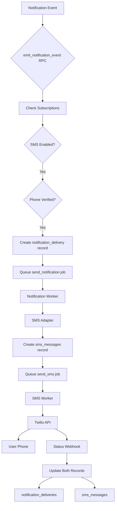

# SMS Notification Channel Design

## Overview

This document specifies the design and implementation plan for integrating SMS as a delivery channel within BuildOS's extensible notification system. While the SMS infrastructure (Twilio integration, phone verification, and SMS messaging) already exists, it is not yet integrated with the notification system's event-driven architecture.

## Current State

### ✅ Existing Infrastructure

**SMS System** (Independent)

- **Database Tables**:
  - `sms_messages` - Message history and status tracking
  - `user_sms_preferences` - Phone numbers, verification status, preferences
  - `sms_templates` - Reusable message templates
- **Services**:
  - `TwilioClient` (`packages/twilio-service/`) - Twilio API wrapper
  - `SMSService` (web app) - Frontend SMS operations
  - SMS Worker (`apps/worker/src/workers/smsWorker.ts`) - Message processing
- **APIs**:
  - `POST /api/sms/verify` - Start phone verification
  - `POST /api/sms/verify/confirm` - Confirm verification code
  - `POST /api/webhooks/twilio/status` - Delivery status callbacks
- **Features**:
  - Phone number verification via Twilio Verify
  - Queue-based SMS delivery
  - Template system
  - Rate limiting and quiet hours
  - Opt-out support

**Notification System** (Event-Driven)

- **Database Tables**:
  - `notification_events` - Immutable event log
  - `notification_deliveries` - Multi-channel delivery tracking
  - `notification_subscriptions` - User event subscriptions
  - `user_notification_preferences` - Per-event channel preferences
  - `push_subscriptions` - Browser push subscriptions
- **Channels Implemented**:
  - ✅ Browser Push (full implementation)
  - ✅ Email (adapter using existing email infrastructure)
  - ✅ In-App (direct database insertion)
  - ⚠️ SMS (placeholder only - NOT IMPLEMENTED)
- **Worker**:
  - `notificationWorker.ts` - Processes `send_notification` jobs
  - Routes to channel-specific adapters
  - Retry logic and error handling

### ❌ Current Gap

The SMS channel adapter in the notification worker is a **placeholder**:

```typescript
// Current state in notificationWorker.ts
case 'sms':
  console.log('SMS notifications not yet implemented');
  await updateDeliveryStatus(delivery.id, 'failed', 'SMS notifications not yet implemented');
  break;
```

**What's Missing:**

1. No integration between `notification_deliveries` and `sms_messages`
2. No phone verification requirement in notification subscription flow
3. No SMS adapter implementation in notification worker
4. No channel availability checks for SMS

---

## Design Goals

1. **Seamless Integration**: SMS should work like other channels (push, email) within the notification system
2. **Leverage Existing Infrastructure**: Use the existing SMS system (Twilio, phone verification, templates)
3. **User Experience**: Users must verify phone before receiving SMS notifications
4. **Consistency**: Follow patterns established by push/email adapters
5. **Reliability**: Use existing queue system and retry logic

---

## Architecture

### High-Level Flow



### Data Flow

1. **Event Emission** → `notification_events` table created
2. **Subscription Check** → RPC finds users subscribed to event with SMS enabled
3. **Phone Verification** → Check `user_sms_preferences.phone_verified = true`
4. **Delivery Creation** → Insert into `notification_deliveries` with `channel = 'sms'`
5. **Job Queue** → Queue `send_notification` job with delivery ID
6. **Notification Worker** → Routes to SMS adapter
7. **SMS Adapter** → Creates `sms_messages` record, queues `send_sms` job
8. **SMS Worker** → Sends via Twilio
9. **Status Update** → Webhook updates both tables

---

## Database Schema Changes

### No New Tables Required!

We'll use existing tables with new integration points:

1. **`notification_deliveries`** - Already has SMS support
   - `channel = 'sms'`
   - `channel_identifier` = phone number
   - `external_id` = Twilio message SID

2. **`user_sms_preferences`** - Already has phone verification
   - `phone_number` - Used as channel identifier
   - `phone_verified` - Required before SMS notifications
   - `phone_verified_at` - Timestamp of verification

3. **`sms_messages`** - Existing message tracking
   - Add `notification_delivery_id UUID` (nullable FK to `notification_deliveries`)
   - This links SMS messages to notification deliveries

### Migration: Add Foreign Key

```sql
-- Add notification_delivery_id to sms_messages
ALTER TABLE sms_messages
ADD COLUMN notification_delivery_id UUID
REFERENCES notification_deliveries(id) ON DELETE SET NULL;

-- Create index for performance
CREATE INDEX idx_sms_messages_notification_delivery
ON sms_messages(notification_delivery_id)
WHERE notification_delivery_id IS NOT NULL;

COMMENT ON COLUMN sms_messages.notification_delivery_id IS
'Links to notification_deliveries for event-driven SMS notifications. NULL for standalone SMS messages.';
```

---

## Implementation Plan

### Phase 1: Channel Availability Check (Week 1)

#### Task 1.1: Update `emit_notification_event` RPC

**Goal**: Check phone verification before creating SMS deliveries

**Location**: `apps/web/supabase/migrations/20251006_notification_system_phase1.sql`

**Changes**:

```sql
-- In emit_notification_event function, modify SMS channel check:

-- Current check (lines 90-95):
IF v_sms_enabled THEN
  -- Add SMS delivery
END IF;

-- Updated check:
IF v_sms_enabled THEN
  -- Check if user has verified phone number
  SELECT phone_verified INTO v_phone_verified
  FROM user_sms_preferences
  WHERE user_id = v_sub.user_id;

  IF v_phone_verified IS TRUE THEN
    -- Get phone number for channel_identifier
    SELECT phone_number INTO v_phone_number
    FROM user_sms_preferences
    WHERE user_id = v_sub.user_id;

    -- Create SMS delivery record
    v_delivery_id := gen_random_uuid();
    INSERT INTO notification_deliveries (
      id, event_id, subscription_id, recipient_user_id,
      channel, channel_identifier, status, payload
    ) VALUES (
      v_delivery_id, v_event_id, v_sub.id, v_sub.user_id,
      'sms', v_phone_number, 'pending',
      v_notification_payload
    );

    -- Queue notification job
    -- ... existing queue logic
  END IF;
END IF;
```

#### Task 1.2: Create Helper Function

**Function**: `get_user_sms_channel_info`

```sql
CREATE OR REPLACE FUNCTION get_user_sms_channel_info(p_user_id UUID)
RETURNS TABLE (
  has_sms_enabled BOOLEAN,
  phone_number TEXT,
  phone_verified BOOLEAN
)
LANGUAGE plpgsql
STABLE
AS $$
BEGIN
  RETURN QUERY
  SELECT
    COALESCE(sp.phone_number IS NOT NULL AND sp.phone_verified = true, false) as has_sms_enabled,
    sp.phone_number,
    COALESCE(sp.phone_verified, false) as phone_verified
  FROM user_sms_preferences sp
  WHERE sp.user_id = p_user_id;
END;
$$;

COMMENT ON FUNCTION get_user_sms_channel_info IS
'Gets SMS channel availability for a user (phone number and verification status)';
```

---

### Phase 2: SMS Adapter Implementation (Week 1-2)

#### Task 2.1: Implement SMS Adapter

**Location**: `apps/worker/src/workers/notification/smsAdapter.ts` (NEW FILE)

```typescript
import { SupabaseClient } from "@supabase/supabase-js";
import { TwilioClient } from "@buildos/twilio-service";
import type { NotificationDelivery } from "@buildos/shared-types";

export interface SMSAdapterConfig {
  twilioClient: TwilioClient;
  supabase: SupabaseClient;
}

export class SMSAdapter {
  constructor(private config: SMSAdapterConfig) {}

  /**
   * Send SMS notification
   *
   * Flow:
   * 1. Validate delivery record has phone number
   * 2. Format message from notification payload
   * 3. Create sms_messages record with notification_delivery_id link
   * 4. Queue send_sms job
   * 5. Update notification_deliveries status
   */
  async send(delivery: NotificationDelivery): Promise<{
    success: boolean;
    messageId?: string;
    error?: string;
  }> {
    try {
      const { channel_identifier: phoneNumber, payload } = delivery;

      if (!phoneNumber) {
        throw new Error("No phone number in delivery record");
      }

      // Format SMS message from notification payload
      const messageContent = this.formatMessage(delivery);

      // Create SMS message record
      const { data: smsMessage, error: smsError } = await this.config.supabase
        .from("sms_messages")
        .insert({
          user_id: delivery.recipient_user_id,
          phone_number: phoneNumber,
          message_content: messageContent,
          priority: this.getPriority(delivery),
          notification_delivery_id: delivery.id,
          status: "pending",
          metadata: {
            event_type: payload.eventType,
            notification_delivery_id: delivery.id,
          },
        })
        .select()
        .single();

      if (smsError) {
        throw new Error(`Failed to create SMS message: ${smsError.message}`);
      }

      // Queue SMS job using existing queue_sms_message function
      const { data: messageId, error: queueError } =
        await this.config.supabase.rpc("queue_sms_message", {
          p_user_id: delivery.recipient_user_id,
          p_phone_number: phoneNumber,
          p_message: messageContent,
          p_priority: this.getPriority(delivery),
          p_metadata: {
            notification_delivery_id: delivery.id,
            event_type: payload.eventType,
          },
        });

      if (queueError) {
        throw new Error(`Failed to queue SMS: ${queueError.message}`);
      }

      // Update notification delivery with external reference
      await this.config.supabase
        .from("notification_deliveries")
        .update({
          status: "sent",
          sent_at: new Date().toISOString(),
          external_id: smsMessage.id, // Link to SMS message record
        })
        .eq("id", delivery.id);

      return {
        success: true,
        messageId: smsMessage.id,
      };
    } catch (error: any) {
      console.error("SMS adapter error:", error);

      // Update delivery as failed
      await this.config.supabase
        .from("notification_deliveries")
        .update({
          status: "failed",
          failed_at: new Date().toISOString(),
          last_error: error.message,
        })
        .eq("id", delivery.id);

      return {
        success: false,
        error: error.message,
      };
    }
  }

  /**
   * Format notification payload into SMS message
   */
  private formatMessage(delivery: NotificationDelivery): string {
    const { payload } = delivery;
    const eventType = payload.eventType;

    // Use templates based on event type
    switch (eventType) {
      case "user.signup":
        return `BuildOS: New user signup - ${payload.user_email}`;

      case "brief.completed":
        return `Your BuildOS daily brief is ready! ${payload.task_count} tasks planned. Check the app for details.`;

      case "brief.failed":
        return `Your daily brief generation failed. Please check the app for details.`;

      case "task.due_soon":
        return `Task reminder: ${payload.task_name} is due ${payload.due_time}`;

      default:
        return `BuildOS notification: ${payload.title || "New update available"}`;
    }
  }

  /**
   * Map notification priority to SMS priority
   */
  private getPriority(
    delivery: NotificationDelivery,
  ): "low" | "normal" | "high" | "urgent" {
    const priority = delivery.payload.priority || "normal";

    const priorityMap: Record<string, "low" | "normal" | "high" | "urgent"> = {
      low: "low",
      normal: "normal",
      high: "high",
      critical: "urgent",
    };

    return priorityMap[priority] || "normal";
  }
}
```

#### Task 2.2: Update Notification Worker

**Location**: `apps/worker/src/workers/notification/notificationWorker.ts`

```typescript
import { SMSAdapter } from "./smsAdapter";

// Initialize SMS adapter
const smsAdapter = new SMSAdapter({
  twilioClient, // Existing Twilio client
  supabase: serviceClient,
});

// Update sendNotification function
async function sendNotification(
  channel: string,
  delivery: NotificationDelivery,
) {
  switch (channel) {
    case "push":
      // ... existing push code
      break;

    case "email":
      // ... existing email code
      break;

    case "in_app":
      // ... existing in-app code
      break;

    case "sms":
      // NEW: Use SMS adapter
      console.log(`Sending SMS notification to ${delivery.channel_identifier}`);
      const smsResult = await smsAdapter.send(delivery);

      if (!smsResult.success) {
        throw new Error(smsResult.error || "SMS send failed");
      }

      console.log(`SMS notification queued: ${smsResult.messageId}`);
      break;

    default:
      throw new Error(`Unknown channel: ${channel}`);
  }
}
```

---

### Phase 3: User Onboarding & UX (Week 2)

#### Task 3.1: Subscription Flow Enhancement

**Goal**: Prompt users to verify phone when enabling SMS notifications

**Location**: `apps/web/src/lib/components/settings/NotificationPreferences.svelte`

**Changes**:

```typescript
// When user enables SMS for an event
async function handleSMSToggle(eventType: EventType, enabled: boolean) {
  if (enabled) {
    // Check if phone is verified
    const phoneInfo = await checkPhoneVerification();

    if (!phoneInfo.verified) {
      // Show phone verification modal
      showPhoneVerificationModal = true;
      pendingEventType = eventType;
      return;
    }
  }

  // Continue with normal preference update
  await updatePreference(eventType, { sms_enabled: enabled });
}
```

#### Task 3.2: Phone Verification Modal Component

**Location**: `apps/web/src/lib/components/settings/PhoneVerificationModal.svelte` (NEW)

```svelte
<script lang="ts">
  import PhoneVerification from './PhoneVerification.svelte';
  import Modal from '$lib/components/ui/Modal.svelte';

  export let open = $state(false);
  export let onVerified: () => void;

  function handleVerificationComplete() {
    open = false;
    onVerified?.();
  }
</script>

<Modal bind:open title="Verify Phone Number">
  <div class="space-y-4">
    <p class="text-gray-600 dark:text-gray-400">
      To receive SMS notifications, you need to verify your phone number first.
    </p>

    <PhoneVerification on:verified={handleVerificationComplete} />
  </div>
</Modal>
```

#### Task 3.3: Onboarding Integration

**Location**: `apps/web/src/lib/components/onboarding-v2/NotificationsStep.svelte`

**Enhancement**: Add SMS notification setup during onboarding

```svelte
<!-- After calendar setup -->
<section>
  <h3>SMS Notifications (Optional)</h3>
  <p>Get text messages for important updates</p>

  {#if !phoneVerified}
    <PhoneVerificationCard bind:verified={phoneVerified} />
  {:else}
    <div class="success-state">
      <CheckCircle /> Phone verified: {phoneNumber}
    </div>

    <!-- SMS preferences -->
    <div class="preferences">
      <label>
        <input type="checkbox" bind:checked={smsPreferences.daily_brief} />
        Daily brief notifications
      </label>
      <label>
        <input type="checkbox" bind:checked={smsPreferences.task_reminders} />
        Task reminders
      </label>
    </div>
  {/if}
</section>
```

---

### Phase 4: Status Synchronization (Week 2-3)

#### Task 4.1: Enhanced Webhook Handler

**Goal**: Update both `sms_messages` and `notification_deliveries` on status changes

**Location**: `apps/web/src/routes/api/webhooks/twilio/status/+server.ts`

**Enhancement**:

```typescript
export const POST: RequestHandler = async ({ request }) => {
  // ... existing Twilio signature validation

  const { MessageSid, MessageStatus, ErrorCode, ErrorMessage } = formData;

  // Update sms_messages table (existing)
  await updateSMSMessage(MessageSid, MessageStatus, ErrorCode, ErrorMessage);

  // NEW: Also update notification_deliveries if linked
  const { data: smsMessage } = await supabase
    .from("sms_messages")
    .select("notification_delivery_id")
    .eq("twilio_sid", MessageSid)
    .single();

  if (smsMessage?.notification_delivery_id) {
    const deliveryStatus = mapTwilioStatusToDeliveryStatus(MessageStatus);

    await supabase
      .from("notification_deliveries")
      .update({
        status: deliveryStatus,
        [deliveryStatus === "sent"
          ? "sent_at"
          : deliveryStatus === "failed"
            ? "failed_at"
            : "delivered_at"]: new Date().toISOString(),
        last_error: ErrorMessage || null,
      })
      .eq("id", smsMessage.notification_delivery_id);
  }

  return ApiResponse.success();
};

function mapTwilioStatusToDeliveryStatus(
  twilioStatus: string,
): "sent" | "delivered" | "failed" {
  const statusMap: Record<string, "sent" | "delivered" | "failed"> = {
    queued: "sent",
    sending: "sent",
    sent: "sent",
    delivered: "delivered",
    failed: "failed",
    undelivered: "failed",
  };

  return statusMap[twilioStatus] || "sent";
}
```

---

### Phase 5: Template Integration (Week 3)

#### Task 5.1: Notification-Specific Templates

**Goal**: Create SMS templates for notification events

**Migration**: Seed notification templates

```sql
-- Add SMS templates for notification events
INSERT INTO sms_templates (template_key, name, message_template, template_vars) VALUES

('notif_user_signup', 'Admin: New User Signup',
 'BuildOS: New user {{user_email}} signed up via {{signup_method}}',
 '{"user_email": "string", "signup_method": "string"}'::jsonb),

('notif_brief_completed', 'User: Brief Ready',
 'Your BuildOS brief is ready! {{task_count}} tasks planned for {{brief_date}}. Open app to view.',
 '{"task_count": "number", "brief_date": "string"}'::jsonb),

('notif_brief_failed', 'User: Brief Generation Failed',
 'Your daily brief failed to generate. Please check the app or contact support.',
 '{}'::jsonb),

('notif_task_due_soon', 'User: Task Due',
 '⏰ {{task_name}} is due {{due_time}}. Reply DONE when complete.',
 '{"task_name": "string", "due_time": "string"}'::jsonb),

('notif_urgent_alert', 'User: Urgent Alert',
 '🚨 URGENT: {{alert_message}}',
 '{"alert_message": "string"}'::jsonb);
```

#### Task 5.2: Template-Based Formatting

**Enhancement**: Update SMS adapter to use templates

```typescript
// In SMSAdapter.formatMessage()
private async formatMessage(delivery: NotificationDelivery): Promise<string> {
  const { payload } = delivery;
  const eventType = payload.eventType;

  // Map event types to template keys
  const templateKeyMap: Record<string, string> = {
    'user.signup': 'notif_user_signup',
    'brief.completed': 'notif_brief_completed',
    'brief.failed': 'notif_brief_failed',
    'task.due_soon': 'notif_task_due_soon'
  };

  const templateKey = templateKeyMap[eventType];

  if (templateKey) {
    // Fetch and render template
    const { data: template } = await this.config.supabase
      .from('sms_templates')
      .select('message_template')
      .eq('template_key', templateKey)
      .eq('is_active', true)
      .single();

    if (template) {
      return this.renderTemplate(template.message_template, payload);
    }
  }

  // Fallback to default formatting
  return `BuildOS: ${payload.title || 'New notification'}`;
}

private renderTemplate(template: string, data: Record<string, any>): string {
  return template.replace(/\{\{(\w+)\}\}/g, (match, key) => {
    return String(data[key] || '');
  });
}
```

---

### Phase 6: Admin Dashboard Integration (Week 3)

#### Task 6.1: SMS Channel Metrics

**Location**: Admin notification dashboard

**Goal**: Show SMS delivery metrics alongside push/email

**Query Enhancement**:

```sql
-- Add SMS to channel performance query
SELECT
  channel,
  COUNT(*) as total_sent,
  COUNT(*) FILTER (WHERE status = 'delivered') as delivered,
  COUNT(*) FILTER (WHERE status = 'failed') as failed,
  ROUND(COUNT(*) FILTER (WHERE status = 'delivered')::numeric / COUNT(*) * 100, 2) as success_rate
FROM notification_deliveries
WHERE created_at > NOW() - INTERVAL '7 days'
  AND channel IN ('push', 'email', 'in_app', 'sms')  -- Include SMS
GROUP BY channel;
```

#### Task 6.2: Phone Verification Status

**Location**: User search/recipient selection in admin dashboard

**Goal**: Show phone verification status when selecting SMS recipients

**Already Fixed**: The endpoint was updated to check `user_sms_preferences` for phone verification:

```typescript
has_phone: !!(
  u.user_sms_preferences?.[0]?.phone_number &&
  u.user_sms_preferences?.[0]?.phone_verified
);
```

---

### Phase 7: Testing & Validation (Week 4)

#### Test Plan

**Unit Tests**:

1. SMS adapter message formatting
2. Priority mapping
3. Error handling
4. Template rendering

**Integration Tests**:

1. Event emission → SMS delivery creation
2. Phone verification check
3. Webhook status updates
4. Queue job processing

**E2E Tests**:

1. User enables SMS notifications
2. User verifies phone number
3. Event triggers SMS delivery
4. Status updates propagate

**Manual Testing**:

1. Verify phone verification flow
2. Test notification delivery across all channels
3. Verify status synchronization
4. Test error scenarios (invalid phone, delivery failure)

---

## User Flows

### Flow 1: New User Enabling SMS Notifications

```
1. User navigates to Settings > Notifications
2. User toggles SMS for "Daily Brief" event
3. System detects no verified phone
4. Modal opens: "Verify your phone number"
5. User enters phone number
6. System sends verification code via Twilio
7. User enters code
8. System verifies code
9. user_sms_preferences.phone_verified = true
10. Modal closes, SMS toggle enabled
11. user_notification_preferences.sms_enabled = true
```

### Flow 2: Notification Delivery (SMS Enabled)

```
1. Daily brief completes generation
2. Worker calls emit_notification_event('brief.completed')
3. RPC finds user subscribed with SMS enabled
4. RPC checks user_sms_preferences.phone_verified = true
5. RPC creates notification_deliveries record (channel='sms')
6. RPC queues send_notification job
7. Notification worker picks up job
8. Worker routes to SMS adapter
9. SMS adapter creates sms_messages record
10. SMS adapter calls queue_sms_message()
11. SMS worker sends via Twilio
12. Twilio delivers message
13. Twilio webhook → updates both tables
14. User receives text message
```

### Flow 3: Phone Verification During Onboarding

```
1. New user completes onboarding step 1-3
2. Onboarding step 4: "Stay Updated"
3. User sees SMS notification option
4. User clicks "Set up SMS"
5. PhoneVerificationCard appears
6. User enters phone → verification code sent
7. User enters code → phone verified
8. System auto-enables recommended SMS notifications:
   - Daily brief: ON
   - Task reminders: ON
   - Urgent alerts: ON
9. User completes onboarding
```

---

## Security & Privacy

### Phone Number Handling

1. **Encryption**: Phone numbers stored in `user_sms_preferences` should be encrypted at rest
2. **Validation**: E.164 format enforcement
3. **Uniqueness**: One phone per user (already enforced in `/api/sms/verify`)
4. **Verification**: Required before any SMS notifications

### Opt-Out Compliance

1. **STOP Keyword**: Handled by Twilio Messaging Service
2. **Opted Out Status**: Synced to `user_sms_preferences.opted_out`
3. **Notification Preferences**: When opted out, disable all SMS notifications
4. **Re-Enable**: Require phone re-verification after opt-out

### Rate Limiting

1. **User Limits**: `daily_sms_limit` in `user_sms_preferences`
2. **System Limits**: Twilio account limits
3. **Quiet Hours**: Respect `quiet_hours_start` and `quiet_hours_end`

---

## Monitoring & Metrics

### Key Metrics

1. **Delivery Rate**: `(delivered / sent) * 100`
2. **Failure Rate**: `(failed / sent) * 100`
3. **Verification Rate**: `(verified phones / total users) * 100`
4. **Opt-Out Rate**: `(opted out / total verified) * 100`

### Monitoring Queries

```sql
-- SMS notification delivery stats (last 7 days)
SELECT
  DATE(created_at) as date,
  COUNT(*) as total_sent,
  COUNT(*) FILTER (WHERE status = 'delivered') as delivered,
  COUNT(*) FILTER (WHERE status = 'failed') as failed
FROM notification_deliveries
WHERE channel = 'sms'
  AND created_at > NOW() - INTERVAL '7 days'
GROUP BY DATE(created_at);

-- Users with verified phones vs SMS enabled
SELECT
  COUNT(*) FILTER (WHERE phone_verified = true) as verified_phones,
  COUNT(*) FILTER (
    WHERE phone_verified = true
    AND user_id IN (
      SELECT DISTINCT user_id
      FROM user_notification_preferences
      WHERE sms_enabled = true
    )
  ) as sms_enabled_users
FROM user_sms_preferences;
```

---

## Error Handling

### Delivery Failures

**Scenario**: Twilio returns error (invalid number, carrier rejection, etc.)

**Handling**:

1. SMS worker catches error
2. Updates `sms_messages.status = 'failed'`
3. Updates `sms_messages.twilio_error_code` and `twilio_error_message`
4. Webhook handler updates `notification_deliveries.status = 'failed'`
5. Retry logic (if appropriate error code)
6. Admin dashboard shows failure with error details

### Phone Unverified

**Scenario**: User enables SMS but hasn't verified phone

**Handling**:

1. `emit_notification_event` checks `phone_verified`
2. If false, SMS delivery is not created
3. No error logged (expected state)
4. UI shows "Verify phone to receive SMS"

### Opt-Out

**Scenario**: User sends STOP to SMS

**Handling**:

1. Twilio marks as opted out
2. Webhook updates `user_sms_preferences.opted_out = true`
3. Future event emissions skip SMS channel
4. UI shows "SMS notifications disabled (opted out)"
5. Re-enable requires phone re-verification

---

## Rollout Plan

### Phase 1: Internal Testing (Week 4)

- Deploy to staging environment
- Test with admin accounts only
- Validate all flows
- Monitor metrics

### Phase 2: Beta Rollout (Week 5)

- Enable for beta users
- Collect feedback
- Monitor delivery rates
- Fix any issues

### Phase 3: General Availability (Week 6)

- Enable for all users
- Add to onboarding flow
- Update documentation
- Monitor at scale

---

## Success Criteria

1. ✅ SMS delivery success rate > 95%
2. ✅ Phone verification completion rate > 70%
3. ✅ Opt-out rate < 5%
4. ✅ Average delivery time < 10 seconds
5. ✅ Zero security incidents
6. ✅ Admin dashboard shows SMS metrics
7. ✅ Documentation complete and accurate

---

## Related Documentation

- [Notification System Implementation Status](/thoughts/shared/research/2025-10-06_04-00-00_notification-system-implementation-status.md)
- [Admin Notification Dashboard Spec](/thoughts/shared/research/2025-10-06_06-00-00_admin-notification-dashboard-spec.md)
- [Twilio Integration](/docs/integrations/twilio/README.md)
- [SMS API Reference](/docs/api/sms-api-reference.md)
- [SMS Setup Guide](/docs/guides/sms-setup-guide.md)
- [Web-Worker Architecture](/docs/architecture/diagrams/WEB-WORKER-ARCHITECTURE.md)

---

## Appendix: Code References

### Key Files

**Database**:

- `apps/web/supabase/migrations/20250928_add_sms_messaging_tables.sql` - SMS tables
- `apps/web/supabase/migrations/20251006_notification_system_phase1.sql` - Notification system

**Worker**:

- `apps/worker/src/workers/notification/notificationWorker.ts` - Notification processor
- `apps/worker/src/workers/smsWorker.ts` - SMS delivery worker
- `apps/worker/src/workers/notification/smsAdapter.ts` - NEW (to be created)

**Web App**:

- `apps/web/src/lib/services/sms.service.ts` - Frontend SMS service
- `apps/web/src/lib/components/settings/PhoneVerification.svelte` - Phone verification UI
- `apps/web/src/routes/api/sms/verify/+server.ts` - Verification API
- `apps/web/src/routes/api/sms/verify/confirm/+server.ts` - Verification confirm API
- `apps/web/src/routes/api/webhooks/twilio/status/+server.ts` - Twilio webhook

**Shared**:

- `packages/twilio-service/src/client.ts` - Twilio client
- `packages/shared-types/src/notification.types.ts` - Notification types

---

## Questions & Decisions

### Q1: Should we use SMS templates or inline formatting?

**Decision**: Use both

- **Templates** for standardized messages (daily brief, task reminders)
- **Inline formatting** for dynamic/custom notifications
- Allows flexibility while maintaining consistency

### Q2: What happens to SMS when user opts out via STOP keyword?

**Decision**: Disable all SMS notifications

- Set `opted_out = true` in `user_sms_preferences`
- Future notifications skip SMS channel
- To re-enable, user must re-verify phone
- This ensures compliance with SMS regulations

### Q3: Should SMS deliveries support quiet hours?

**Decision**: Yes, respect quiet hours

- Check `user_sms_preferences.quiet_hours_start/end`
- Exception: Priority = 'urgent' bypasses quiet hours
- Queue messages for delivery after quiet hours end

### Q4: How do we handle international phone numbers?

**Decision**: Phase 2 feature

- Initial release: US numbers only
- Future: International support with country code validation
- Twilio supports 200+ countries

---

**Document Version**: 1.0
**Last Updated**: 2025-10-06
**Author**: Claude (AI Assistant)
**Status**: Draft - Ready for Review
