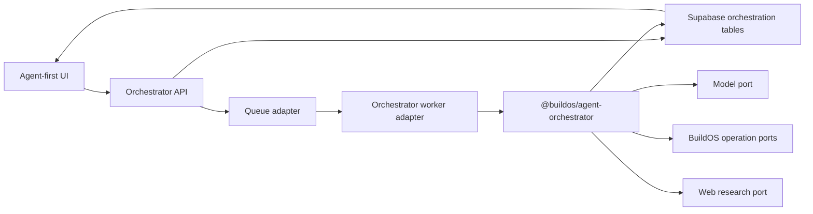
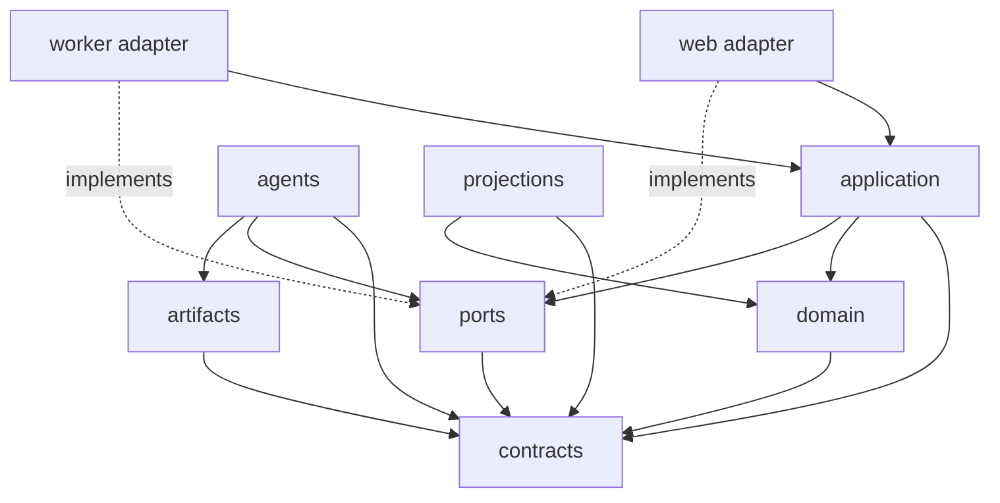

<!-- docs/architecture/agent-first-orchestration/V0_ARCHITECTURE_PLAN.md -->

# Agent-First Orchestration V0 Architecture Plan

**Status:** Draft for architecture review
**Date:** 2026-07-24
**Revised:** 2026-07-24 per [AUDIT_2026-07-24](./AUDIT_2026-07-24.md) — Phase A falsification now
precedes the durable kernel; the substrate-reuse boundary is redrawn; contract holes closed
**Depends on:** [Agent-First Orchestration System](./README.md)
**Scope:** Architecture skeleton only; no implementation is authorized by this document

## 1. Architecture Objective

The [system overview](./README.md) documents the path from the GBrain investigation to this
agent-first experiment. This plan isolates the orchestration workstream: it does not require a new
knowledge graph, universal memory layer, or complete skill-system redesign before the control plane
can be tested.

Create a small, independently testable orchestration kernel that can:

1. route a request to the CEO direct lane or a specialist workflow;
2. compile simple stage declarations into a validated dependency graph;
3. schedule independent steps concurrently and dependent steps sequentially;
4. persist assignments, state, artifacts, receipts, events, and user signals;
5. wake the CEO at explicit decision gates with a compact digest;
6. let the CEO append the next stage based on completed work;
7. recover safely from retries, worker loss, partial results, and reconnects.

The kernel must remain independent of the current Agentic Chat, Agent Run, Deep Research, Project
Review, and retired Tree Agent runtimes.

## 2. Decisions to Lock Before Implementation

### 2.1 Separate control plane for cognition

Use a new runtime namespace for cognition and control flow: contracts, prompts, routing,
scheduling policy, state machines, and projection logic. The existing systems' _reasoning layers_
are comparison lanes, not libraries to extend. The durable-execution substrate is different: it is
reused or schema-copied, not redesigned (§2.9). Whether orchestration state lives in new
`orchestrator_*` tables or extends `agent_runs` scaffolding is settled by a one-day spike at the
start of Phase B (§16); the default is separate tables with schemas and RLS copied from their
`agent_run_*` analogs.

### 2.2 Shared platform ports only

The new runtime may call canonical BuildOS services through interfaces, but domain code cannot
import their implementations. Initial ports are:

```text
IdentityPort
ProjectAuthorizationPort
BuildosReadPort
BuildosOperationPort
WebResearchPort
ModelPort
QueuePort
ClockPort
IdGeneratorPort
EventSinkPort
```

V0 uses read-only BuildOS and web ports. `BuildosOperationPort` exists so proposed/staged execution
can be added without changing the orchestration domain.

Several ports already have production implementations to wrap rather than design:

| Port                                       | Existing implementation                                                                                                                                                                                                                                                                               |
| ------------------------------------------ | ----------------------------------------------------------------------------------------------------------------------------------------------------------------------------------------------------------------------------------------------------------------------------------------------------- |
| `WebResearchPort`                          | Exists under this exact name: interface in `packages/shared-agent-ops/src/gateway/op-execution.ts`; hardened Tavily-backed implementation in `apps/worker/src/workers/agent-run/webResearchPort.ts` (SSRF-safe fetch, size caps, untrusted-content notice). Reuse it; do not define a competing type. |
| `ModelPort`                                | Thin wrapper over `packages/smart-llm` (`SmartLLMService`), which already provides complexity-based model selection and per-user USD usage logging (`llm_usage_logs`).                                                                                                                                |
| `BuildosReadPort` / `BuildosOperationPort` | Wrap the `shared-agent-ops` gateway: `executeGatewayOp` for reads/commits; `stageGatewayWriteOp` → `ProposedChange` (approved/rejected/pending) for propose/stage modes. The staged-mutation mechanism already exists in production.                                                                  |
| `QueuePort`                                | Wrap the existing Supabase queue RPCs (`add_queue_job` dedup, claim/complete/fail, stalled reclaim).                                                                                                                                                                                                  |
| `EventSinkPort`                            | Schema-copy of `agent_run_events` semantics.                                                                                                                                                                                                                                                          |

Genuinely new port implementations: `WorkflowRepositoryPort`, `ArtifactStorePort`, and
`AgentExecutorPort`.

### 2.3 CEO plus non-delegating leaves

Only the CEO may create stages. Specialist agents execute one immutable assignment and cannot spawn
children. V0 has a maximum agent depth of one.

### 2.4 Stage authoring, DAG execution

The CEO authors sequential stages with tasks. A compiler turns those declarations into dependency
edges. This provides an understandable model-facing grammar while preserving a general scheduling
foundation.

### 2.5 Receding-horizon planning

The CEO creates the current stage, not a speculative complete workflow. A `decision_gate` causes a
new CEO turn after the stage joins.

### 2.6 State rows are authoritative

Run, stage, and step rows hold current state. Append-only events provide audit history and frontend
projection input. Reconstructing the authoritative state must not require replaying the entire event
log.

### 2.7 Runtime-owned artifacts

Artifacts are immutable orchestration records, not ontology documents or chat messages. Promotion
into BuildOS data is a separate, explicit future action.

### 2.8 No hidden reasoning persistence

Persist route decisions, assignments, artifact content, transition reasons, progress, usage, and
receipts. Do not persist or expose private model chain-of-thought.

### 2.9 Substrate reuse, cognition isolation

The no-import rule targets the existing cognition layer: prompt builders, context loaders, tool
selection, supervisors, and agent loops — including the Deep Research orchestrator, which is a
mode inside the Agent Run worker, not a peer runtime. The durable-execution substrate is reused:
execution-generation fencing (`20260723020000`), atomic run+job dispatch
(`create_agent_run_with_job`, `20260723030000`), the advisory-lock concurrency-cap trigger, queue
leases/heartbeats/stalled reclaim, AbortSignal cancellation, and the
`agent_run_events` / `agent_run_signals` / `agent_tool_executions` / `agent_run_cost_entries`
schema and RLS shapes. These are one-table, hand-coded implementations today; extracting them into
reusable form is budgeted Phase B work, not assumed to be free.

### 2.10 Run ≈ turn

A run is one bounded objective and always reaches a terminal or resting state; it does not stay
alive across user replies. Runs attach to a session. `clarify` (and `request_user_input`) end the
run in `waiting / user_input` with a checkpoint artifact capturing state and questions; the user's
answer starts a new run that receives the checkpoint artifact as input. This mirrors the
production `chat_turn_checkpoints` pattern and removes any need to mutate immutable assignments.

### 2.11 Budgets are USD with reservation

`StepBudget` and run budgets are denominated in USD. Cost is reserved before dispatch and settled
on completion with an `attempt_key` idempotency key, following the production
`agent_run_cost_entries` ledger. Reservation — not just accounting — is required: N parallel steps
can each individually fit the remaining budget and collectively exceed it. Hard caps:
`max_replans_per_run = 2`, `max_stages_per_run = 5`, persisted as counters on the run.

### 2.12 Every V0 stage joins into a CEO decision gate

Under receding-horizon planning the next stage does not exist when a stage joins, so a non-gated
stage has nothing to continue to. In V0 `decision_gate` is therefore effectively always true, and
each stage join costs one CEO model call — a known, accepted cost. The deterministic-continuation
branch is deferred until a later version defines when a pre-declared next stage may start without
a CEO turn.

### 2.13 No new end-user surface in V0

Progress projection renders on an internal admin/debug route. A winning architecture is adopted
inside the existing chat entry point as a routing decision. (The retired Tree Agent —
structurally ~80% of this proposal — died as an orphaned fifth surface, not from its technical
design.)

## 3. System Context



The initial implementation can be hosted by the existing web and worker deployments through thin
adapters. The core package must not depend on either app, allowing a dedicated deployment later
without rewriting orchestration behavior.

## 4. Proposed Code Organization

```text
packages/agent-orchestrator/
  src/
    contracts/
      route-decision.ts
      workflow-stage.ts
      step-spec.ts
      step-assignment.ts
      context-packet.ts
      agent-result.ts
      artifact.ts
      transition-decision.ts
      progress-event.ts
      permission-grant.ts
    domain/
      run-state.ts
      stage-state.ts
      step-state.ts
      readiness.ts
      joins.ts
      budgets.ts
      errors.ts
    application/
      route-request.ts
      create-stage.ts
      dispatch-ready-steps.ts
      complete-step.ts
      evaluate-stage.ts
      build-workflow-digest.ts
      apply-transition.ts
      handle-signal.ts
      reconcile-stalled-work.ts
    agents/
      catalog.ts
      ceo/
        manifest.ts
        prompt.ts
        route.ts
        transition.ts
      librarian/
        manifest.ts
        prompt.ts
        execute.ts
      researcher/
        manifest.ts
        prompt.ts
        execute.ts
    artifacts/
      registry.ts
      context-packet-codec.ts
      research-packet-codec.ts
      final-report-codec.ts
    policy/
      permissions.ts
      workflow-limits.ts
      agent-selection.ts
      direct-lane.ts
    ports/
      identity.port.ts
      authorization.port.ts
      workflow-repository.port.ts
      artifact-store.port.ts
      agent-executor.port.ts
      buildos-read.port.ts
      buildos-operation.port.ts
      model.port.ts
      queue.port.ts
      web-research.port.ts
      event-sink.port.ts
      clock.port.ts
      id-generator.port.ts
    projections/
      progress-projection.ts
      workflow-summary.ts
    testing/
      simulator.ts
      fixtures.ts
      harness/            # Phase A falsification harness (route eval + in-process workflow)

apps/web/src/lib/server/agent-orchestrator/
  orchestrator-api.adapter.ts
  orchestrator-repository.adapter.ts
  orchestrator-realtime.adapter.ts

apps/worker/src/workers/agent-orchestrator/
  index.ts
  orchestrator-job.adapter.ts
  specialist-step-job.adapter.ts
  platform-ports.ts
```

The app folders are composition roots. They construct dependencies and translate transport or
database data. They do not contain workflow decisions, model prompts, agent policies, or state
machines.

## 5. Dependency Rules



Enforced rules:

- `contracts` imports no runtime modules.
- `domain` is pure and imports only contracts and domain modules.
- `application` depends on ports, never concrete adapters.
- `application` does not import concrete agents; agent execution is behind `AgentExecutorPort`.
- `agents` implement bounded execution behind that port, use only provided ports, and do not
  schedule work directly.
- `artifacts` validate and normalize payloads; they do not decide workflow transitions.
- web and worker adapters may depend on the package; the package may not depend on the apps.
- no module imports from current agentic-chat, agent-run, deep-research, project-loop, or tree-agent
  paths.
- model-provider and Supabase clients appear only in adapters/composition roots.

Add architecture fitness tests for these dependency rules before feature work expands.

## 6. Core Contracts

Every contract has an explicit `schema_version`. Persist the validated form, not raw model output.

### 6.1 RouteDecision

```ts
type RouteDecision = {
	schema_version: 1;
	route: 'direct' | 'workflow' | 'clarify' | 'capability_gap';
	objective: string;
	reason_code: string;
	project_ids: string[];
	risk: 'low' | 'medium' | 'high';
	confidence: number;
	direct_action?: DirectActionSpec;
	initial_stage?: WorkflowStageSpec;
	questions?: string[];
	gap?: CapabilityGap;
};
```

The model may recommend scope. Authorization policy resolves the actual allowed project IDs and
operations.

`reason_code` is a closed union (e.g. `simple_read`, `multi_source_research`, `ambiguous_scope`,
`unsupported_capability`, …), not free text — route reason codes are a measured evaluation
metric, and free text cannot be aggregated.

`DirectActionSpec` executes as an implicit single stage containing one CEO-executed step, so
direct work shares the same lifecycle, receipts, events, and evaluation shape as workflow steps:

```ts
type DirectActionSpec = {
	schema_version: 1;
	operations: DirectOperation[]; // pre-authorized, low-risk canonical operation IDs + arguments
	user_visible_label: string;
};
```

The direct lane is a declarative operation list, not a mini agent loop. If direct execution
discovers material complexity, its step result may propose an `initial_stage`; the engine
validates it and promotes the run to a workflow. This is the direct→workflow promotion contract.

`clarify` ends the run in `waiting / user_input` with a checkpoint artifact (§2.10); the answer
arrives as a new run carrying that artifact as input. There is no in-place resume.

### 6.2 WorkflowStageSpec

```ts
type WorkflowStageSpec = {
	schema_version: 1;
	client_stage_key: string;
	label: string;
	purpose: string;
	steps: StepSpec[];
	join_policy: 'all' | 'best_effort';
	decision_gate: boolean;
	failure_policy: 'replan' | 'complete_partial' | 'fail';
};
```

Each step may reference earlier steps in the same stage. The compiler also adds dependencies from
the previous sequential stage. It rejects duplicate keys, unknown agents, cycles, invalid artifact
bindings, permission escalation, and policy-limit violations.

`StepSpec` is the model-authored step declaration. The compiler and policy derive the executable
`StepAssignment` from it; the model never authors permissions, budgets, or timeouts.

```ts
type StepSpec = {
	schema_version: 1;
	client_step_key: string;
	agent_id: string;
	goal: string;
	non_goals: string[];
	input_artifact_ids: string[];
	depends_on_step_keys: string[]; // same-stage dependencies only
	deliverable_type: string;
	acceptance_criteria: AcceptanceCriterion[];
	user_visible_label: string;
};
```

| Field                                                                                                                            | Authored by        |
| -------------------------------------------------------------------------------------------------------------------------------- | ------------------ |
| `goal`, `non_goals`, `agent_id`, `deliverable_type`, `acceptance_criteria`, `input_artifact_ids`, `depends_on_step_keys`, labels | Model (`StepSpec`) |
| `step_id`, dependency edges (including previous-stage edges)                                                                     | Compiler           |
| `permission_grant` (§10 intersection), `budget` (USD, §2.11), `timeout_ms` (agent-manifest policy)                               | Policy             |

### 6.3 StepAssignment

```ts
type StepAssignment = {
	schema_version: 1;
	step_id: string;
	agent_id: string;
	goal: string;
	non_goals: string[];
	input_artifact_ids: string[];
	deliverable_type: string;
	acceptance_criteria: AcceptanceCriterion[];
	permission_grant: PermissionGrant;
	budget: StepBudget;
	timeout_ms: number;
	user_visible_label: string;
};
```

Assignments become immutable when queued. A materially changed assignment creates a replacement
step with lineage rather than mutating an in-flight step.

```ts
type StepBudget = {
	max_usd: number; // reserved before dispatch, settled on completion (attempt_key idempotent)
	max_tool_calls: number;
	max_wall_clock_ms: number;
};
```

There is deliberately no `context_packet_id` field. A context packet is an ordinary artifact
consumed through `input_artifact_ids` (§6.4); binding it as a special assignment field would
force librarian-first serialization into every workflow and contradict per-agent context
builders.

### 6.4 ContextPacket

```ts
type ContextPacket = {
	schema_version: 1;
	objective: string;
	project_scope: ProjectScope[];
	facts: ProvenancedFact[];
	excerpts: ProvenancedExcerpt[];
	artifact_refs: ArtifactReference[];
	constraints: string[];
	intentionally_excluded: string[];
	retrieval_options: RetrievalOption[];
	as_of: string;
};
```

No full chat history is included by default. Every project fact or excerpt has an entity/source ID
and freshness timestamp.

A context packet is an artifact (`artifact_type: 'context_packet'`), not a separate channel. In
V0 the default context builder is **deterministic code** — the librarian manifest's builder
assembles scope, entity summaries, and provenance without a model call. An LLM librarian step is
scheduled only when the CEO explicitly needs judgment-based curation; if deterministic packets
already win the evaluation, the LLM librarian stays out.

### 6.5 AgentResult

```ts
type AgentResult = {
	schema_version: 1;
	status: 'completed' | 'partial' | 'failed';
	summary: string;
	artifact_drafts: ArtifactDraft[];
	acceptance_results: AcceptanceResult[];
	open_questions: string[];
	assumptions: string[];
	residual_risks: string[];
	confidence: number | null;
	capability_gaps: CapabilityGap[];
};
```

The worker persists accepted artifact drafts before completing the step. Artifact persistence
failure prevents a `completed` step status.

### 6.6 ArtifactEnvelope

```ts
type ArtifactEnvelope<T = unknown> = {
	schema_version: 1;
	artifact_type: string;
	artifact_version: number;
	run_id: string;
	producer_step_id: string;
	supersedes_artifact_id: string | null;
	summary: string;
	payload: T;
	provenance: ArtifactProvenance[];
	created_at: string;
};
```

Artifacts are immutable. A new version points to the artifact it supersedes. Payload size is
bounded by artifact type; larger source material remains behind references.

### 6.7 WorkflowStateDigest

The digest given to the CEO contains:

- the objective and current stage;
- the reason the CEO was awakened;
- completed, partial, failed, active, and blocked steps;
- artifact IDs and bounded summaries;
- acceptance failures, contradictions, and open questions;
- user signals since the last decision;
- elapsed time, spend, and remaining budgets;
- current project and permission envelope;
- allowed transition types.

The digest is hard-bounded: a fixed token ceiling (initially 4,000 tokens), per-artifact
summaries capped at 1,000 characters, and a deterministic overflow order — acceptance failures
first, then failed/partial steps, then user signals, then artifacts from the most recent stage,
then older stages. Overflow is marked explicitly in the digest so the CEO knows to load artifacts
rather than assume completeness. Without this bound the digest regrows exactly the
context-saturation problem this system exists to escape.

The CEO loads full artifacts selectively through `artifact.load`.

### 6.8 TransitionDecision

```ts
type TransitionDecision = {
	schema_version: 1;
	action:
		| 'continue_existing_graph'
		| 'append_stage'
		| 'request_user_input'
		| 'complete'
		| 'complete_partial'
		| 'capability_gap'
		| 'fail';
	reason_code: string;
	next_stage?: WorkflowStageSpec;
	questions?: string[];
	final_artifact_ids?: string[];
	gap?: CapabilityGap;
};
```

Policy validates transitions. The CEO cannot use a transition to raise limits or permissions.
`append_stage` is rejected once `max_stages_per_run` (5) is reached, and an `append_stage` issued
in response to a stage failure counts against `max_replans_per_run` (2). Exhausting either cap
forces `complete_partial`, `capability_gap`, or `fail`.

## 7. Runtime State Model

Use a small status vocabulary plus explicit wait reasons.

### Run

```text
status: queued | running | waiting | completed | partial | failed | cancelled
wait_reason: null | specialist_steps | ceo_decision | user_input | budget | capacity
```

A run is one turn (§2.10). `waiting / user_input` is a resting state ended by a **new** run that
carries the checkpoint artifact — not an in-place resume.

### Stage

```text
draft -> ready -> running -> waiting_decision -> completed | partial | failed | cancelled
```

In V0 every stage traverses `waiting_decision` — decision gates are effectively always on
(§2.12).

### Step

```text
queued -> running -> completed | partial | failed | cancelled
```

There is no step-level `needs_input`: only the CEO talks to the user, and assignments are
immutable, so a step cannot pause for an answer and resume. A specialist that cannot proceed
without input returns `partial` with `open_questions`; the CEO escalates at the decision gate
(run-level `waiting / user_input`). The existing system places `needs_input` at run level for the
same reason.

Pure transition functions define permitted moves. Persistence adapters use compare-and-swap
generation values so an expired worker cannot update a reclaimed step.

## 8. Scheduling and Join Semantics

A step is ready when:

1. its run and stage are active;
2. it has not already been dispatched;
3. all required dependencies are terminal and acceptable under the join policy;
4. run, user, agent, and provider capacity is available;
5. its budget and permissions still validate;
6. no pause or cancel signal is active.

Scheduling requirements:

- Persist stage, steps, dependencies, and queue jobs atomically.
- Use stable run, stage, step, and attempt IDs.
- Claim work with a lease, heartbeat, and execution-generation fence.
- Queue the CEO decision exactly once when a decision gate becomes ready.
- Never keep a worker or web request open while waiting for sibling completion.
- Reconciliation may recover stalled work but cannot blindly replay a confirmed side effect.
- Enforce per-user and per-run concurrency caps independently of model output.

For V0, joins and failure policies resolve deterministically:

| join_policy   | Settled outcome                         | failure_policy                         | Stage result                                                                        |
| ------------- | --------------------------------------- | -------------------------------------- | ----------------------------------------------------------------------------------- |
| `all`         | every step completed                    | —                                      | `completed` → decision gate                                                         |
| `all`         | any step failed or unacceptably partial | `replan`                               | `failed` → decision gate with replan context (counts against `max_replans_per_run`) |
| `all`         | any step failed or unacceptably partial | `complete_partial`                     | `partial` → decision gate with surviving artifacts                                  |
| `all`         | any step failed or unacceptably partial | `fail`                                 | `failed` → run `failed`; CEO wakes once for failure synthesis                       |
| `best_effort` | at least one step completed             | —                                      | `completed` (partials/failures visible in the digest) → decision gate               |
| `best_effort` | zero steps completed                    | `replan` / `complete_partial` / `fail` | treated as stage failure; resolves per the three `all`-failure rows above           |

Both policies wait for every step to settle before joining; `best_effort` never joins early.

Concurrency caps (locked for V0): at most **3 concurrently running steps per run** and **1 active
run per user**, enforced in the domain scheduler and re-enforced with an advisory-lock database
trigger (following `agent_run_enforce_deep_research_capacity`). Rationale: production runs a
single worker process with ~10 global job slots shared across all job types — a wide fan-out
would starve the rest of the platform.

Known queue behaviors the scheduler must design around rather than inherit blindly:

- A completion-RPC failure can re-execute an already-successful job (audit finding N8).
  Decision-gate wakes must therefore be idempotent at the domain level — dedup on
  `(run_id, decision_generation)` in addition to the queue `dedup_key`.
- `complete_queue_job` / `fail_queue_job` accept a NULL processing token (fence bypass). New
  orchestrator RPCs must require the token/generation unconditionally.
- Claiming is strict-priority with no aging; orchestrator jobs run at default priority so they
  neither starve the platform nor get silently starved.

## 9. Persistence Skeleton

Use a separate table namespace:

### `orchestrator_runs`

Workflow objective, route, project scope, status/wait reason, current decision generation, root
budgets, usage totals, final artifact IDs, error, and timestamps.

### `orchestrator_stages`

Run ID, ordinal, label/purpose, join and failure policy, decision-gate flag, status, generation,
summary, and timestamps.

### `orchestrator_steps`

Run/stage IDs, stable client key, agent ID/version, immutable assignment JSON, status, attempt and
execution generation, lease/heartbeat, result summary, usage, error, and timestamps.

### `orchestrator_step_dependencies`

Explicit prerequisite and dependent step IDs with a uniqueness constraint and same-run validation.

### `orchestrator_artifacts`

Run and producer-step IDs, artifact type/schema/version, lineage, bounded summary, validated payload,
provenance, and timestamps. Artifacts are insert-only except for retention metadata. Payloads are
JSONB with a hard cap (256 KB per artifact, summaries ≤ 1 KB); larger source material stays behind
references. Object storage is deferred. A retention job ships with the schema — `agent_run_events`
and `chat_turn_runs` are already unbounded in production, and this namespace must not repeat that.

### `orchestrator_events`

Append-only, monotonically sequenced run events for audit and frontend projection. Events are not
the sole authoritative workflow state. Schema and RLS are copied from `agent_run_events` (unique
`(run_id, seq)`), not redesigned.

### `orchestrator_tool_receipts`

Step/attempt identity, port and operation, sanitized arguments/result, scope, success/error, entity
touches, mutation mode, timing, usage, and idempotency data.

### `orchestrator_signals`

Pause, resume, cancel, and user-guidance signals with source, payload, and consumption timestamp.
Schema and RLS are copied from `agent_run_signals`, including the `source = 'user'` insert gate.
V0 consumes only `cancel`; the other kinds are reserved.

Whether these are new tables or an extension of `agent_runs` scaffolding is settled by the
Phase B substrate spike (§16). Default: new tables, with schemas copied from their `agent_run_*`
analogs where noted above.

Agent definitions remain code-defined and version-controlled in V0. Capability gaps are emitted as
artifacts and events; a separate aggregate table is deferred until the evaluation shows useful gap
volume.

RLS and service-role policies must be designed with the schema, not added after implementation.

## 10. Permission Model

Effective permission is the intersection of:

```text
authenticated user grant
∩ project membership
∩ CEO requested scope
∩ agent-manifest ceiling
∩ assignment grant
∩ runtime risk policy
```

`PermissionGrant` includes:

```text
mode: read_only | propose | stage | commit
project_ids: exact UUIDs
operations: exact canonical operation IDs
network: none | web_read
artifact_types_read/write
expires_at
```

The workflow compiler checks the grant before dispatch. The operation adapter checks it again on
every call. Model text is never an authorization source.

Prompt-injection containment is architectural, not merely an evaluation scenario:

- All artifact-derived text entering a CEO digest is delimited as untrusted content and tagged
  with its provenance; researcher output is never concatenated bare into CEO instructions.
- The user's original `objective` is immutable for the life of the run. No transition, artifact,
  or digest content can rewrite it.
- The server-side grant intersection above is _the_ escalation defense: injected text that
  persuades a model changes nothing about what the runtime permits.
- Web content enters only through the hardened `WebResearchPort` implementation (SSRF-safe
  fetch, size caps, injected untrusted-content notice).

V0 specialist permissions are read-only. Any mutation comparison produces a proposal artifact.

## 11. Agent Runtime

Each `AgentManifest` declares:

```text
agent_id and version
role and capability cards
supported artifact inputs and outputs
skills and references
context builder
tool/port surface
permission ceiling
model and effort policy
default and maximum budget
result schema
retry and escalation policy
evaluation suite
```

Each agent execution receives only:

- its immutable assignment;
- its context packet;
- explicitly bound artifact inputs;
- allowed tool schemas;
- budget and permission envelope;
- a progress-event sink.

It does not receive the CEO transcript, sibling transcripts, unused agents, or unrestricted BuildOS
context.

Acceptance criteria must be machine-checkable wherever possible, and machine-checkable criteria
are validated by runtime code at step completion — not by the specialist's self-report.
`AgentResult.acceptance_results` is advisory; the deterministic validator's verdict is
authoritative. (Precedent: the deep-research evidence normalizer rejects claims citing URLs the
agent never visited.)

## 12. CEO Runtime

The CEO has two prompt modes with separate result schemas:

1. **Route mode** consumes the user request and lightweight world card and returns `RouteDecision`.
2. **Transition mode** consumes `WorkflowStateDigest` and selectively loaded artifacts and returns
   `TransitionDecision`.

The lightweight world card contains:

- BuildOS object types and relationship summary;
- current project identity when resolved;
- concise direct-capability cards;
- concise agent-catalog cards;
- workflow grammar and policy limits;
- current user permission ceiling;
- artifact types the CEO may request.

The CEO does not receive a global list of every tool or skill. Direct tools and agent details are
materialized only when the selected route needs them.

## 13. Frontend Projection

User-facing progress is derived from validated events and current-state rows. Initial event types:

```text
workflow.routed
workflow.started
stage.created
stage.started
step.queued
step.started
step.progress
artifact.created
step.completed
step.partial
step.failed
stage.joined
workflow.waiting_for_ceo
workflow.waiting_for_user
workflow.replanned
workflow.completed
workflow.partial
workflow.failed
workflow.cancelled
```

Every step assignment has a bounded `user_visible_label`. Progress events describe observable work
or state and may not include private reasoning. The UI groups steps by stage, displays parallel work
concurrently, and reconstructs the same projection after reconnect.

The projection implementation parameterizes the existing production pattern — the dual
realtime-plus-poll store (`agentRunsRealtime.service.ts`), a per-run broadcast topic
(`orchestrator-run:<run_id>`), and the replica-identity/publication migration pattern — rather
than designing a new transport. In V0 this projection renders only on an internal admin/debug
route (§2.13).

## 14. Failure and Recovery Policy

- A retry creates a new attempt identity under the same step.
- Provider or transient infrastructure failures may retry within the assignment budget.
- Schema-invalid model output gets one bounded repair attempt, then becomes partial or failed.
- A persisted successful tool receipt is never blindly replayed.
- An artifact persistence failure prevents successful step completion.
- A partial step retains its useful artifacts and explicit missing criteria.
- `all` and `best_effort` stages apply their declared failure policy deterministically.
- User cancellation cascades to queued work and stops new calls; already accepted provider calls may
  still settle usage.
- Reconciliation recovers expired leases and stranded decision gates with generation fencing.
- Terminal states win races: a cancel arriving during or after a join does not un-settle
  completed steps or suppress an already-enqueued decision wake; run cancellation supersedes
  pending decision gates for future work only.
- A project freshness mismatch before a future staged action returns control to the CEO for re-read
  or replan.

## 15. Testing Strategy

### Contract tests

- every schema accepts valid examples and rejects malformed, oversized, or unknown-version data;
- persisted values round-trip without losing IDs, permissions, provenance, or lineage;
- raw model output is never trusted before validation.

### Pure domain tests

- run, stage, and step transition matrices;
- stage-to-DAG compilation and cycle rejection;
- ready-set calculation;
- `all` and `best_effort` joins;
- decision-gate wake behavior;
- permission intersections;
- budget reservation and exhaustion;
- artifact version lineage.

### Simulator tests

Before database or model integration, a deterministic fake-agent simulator proves:

- two independent steps start together;
- a dependent step never starts early;
- a failed best-effort child reaches the CEO digest;
- a failed all-required child invokes the stage failure policy;
- one stage can append another after a CEO decision;
- pause, cancel, user guidance, and restart preserve correct state;
- duplicate delivery does not duplicate a step or decision wake.

### Persistence and queue integration tests

- atomic run/stage/step/job creation;
- unique deduplication and exactly-once decision enqueue;
- lease expiry, heartbeat, reclaim, and stale-generation rejection;
- RLS and cross-user/project isolation;
- artifact and receipt durability;
- reconnect projection from rows and events.

### Agent evaluations

- CEO route accuracy and unnecessary delegation;
- valid workflow construction;
- parallel versus sequential dependency judgment;
- context-packet relevance and freshness;
- research evidence validity and synthesis faithfulness;
- recovery, clarification, and capability-gap behavior;
- old-system, CEO-direct, specialist-workflow, and sequential-baseline comparison.

### Architecture fitness tests

- forbidden imports from existing agent runtimes;
- no concrete adapter imports in contracts/domain/application modules;
- no direct provider or database clients outside composition roots/adapters;
- module-cycle detection;
- source-file size warning at 300 lines and required architecture review above 400;
- every registered agent has versioned schemas, permission ceiling, budget, and tests.

## 16. Implementation Phases and Slices

Phase A tests the hypothesis with disposable in-process code. Phase B builds the durable system
and is gated on Phase A's recorded go/change/stop decision. See
[PHASE_A_FALSIFICATION_PLAN](./PHASE_A_FALSIFICATION_PLAN.md) for the executable Phase A spec.

### Phase A — falsification harness (no database, no queue, no UI)

**Slice A0 — Corpus, baselines, decision rule.**

- Extract ~8 scenarios from real production chat sessions plus a frozen project snapshot.
- Hand-label expected routes and machine-checkable acceptance checks.
- Measure control-lane latency/cost baselines; finalize the pre-registered thresholds.
- Define the minimal contracts as plain types (`RouteDecision`, `StepSpec`, `AgentResult`,
  `ArtifactEnvelope`) in `packages/agent-orchestrator/src/contracts`.
- Pin the CEO evaluation model (§18 Q5).

**Slice A1 — Route mode.**

- World card v0 plus the route function; score route accuracy against labels across repeated
  runs; record latency and cost per route call.

**Slice A2 — In-process workflow lane.**

- Specialists as plain async functions: deterministic librarian; researcher over the existing
  `WebResearchPort`.
- `Promise.all` fan-out, digest builder, transition and synthesis calls, typed artifacts held in
  memory.
- Run the comparison against the control lane (the existing `pnpm test:agentic` harness drives
  the real v2 stream endpoint) and record the go/change/stop decision.

### Phase B — durable system (only on a recorded go)

**Slice B0 — Contracts, state machines, simulator.**

- Full schemas, pure transition matrices, the stage compiler, ready-set calculation, and joins
  per the §8 truth table.
- Fake ports and a deterministic simulator (~6 fixtures: parallel start, dependency blocking,
  best-effort failure, all-failure policy, replan append, duplicate-delivery idempotency).
- Run the substrate spike: attempt an orchestrated run on `agent_runs` scaffolding plus the four
  genuinely new tables without touching existing deep-research constraints; record the outcome as
  an ADR choosing reuse vs. separate namespace.

**Slice B1 — Persistence and durable scheduling.**

- Tables and RLS (copying `agent_run_*` analog schemas where §9 notes), atomic stage/step/job
  creation modeled on `create_agent_run_with_job`, leases/generations/heartbeats/reconciler —
  extracting the production fencing pattern into reusable form is budgeted work here, not assumed
  free.
- Repository and queue adapters; simulator fixtures through real persistence with fake agents.

**Slice B2 — CEO direct and route modes, durable.**

- World card, code-defined agent catalog, route validation, the direct read-only lane as an
  implicit stage+step, and route/latency/usage/reason-code telemetry.

**Slice B3 — Librarian, researcher, artifacts, decision gates.**

- Bounded context packets (deterministic builder) and research packets.
- Real sequential and parallel specialist steps, decision-gate digests, selective artifact
  loading, CEO synthesis, and one replan cycle.

**Slice B4 — Projection and cancellation.**

- Admin-route progress projection via the existing realtime pattern; cancel signal.
- Verify displayed progress matches durable state under failure and retry. (Pause/resume/guidance
  deferred; no end-user UI.)

**Slice B5 — Full parallel evaluation.**

- All four lanes over the frozen corpus with repeated runs; blind review; inspect evidence,
  routes, costs, latency, artifacts, and violations.
- Produce a go/change/stop decision for planner/staged-executor/reviewer expansion and controlled
  writes.

## 17. Historical Lessons Applied

The retired Tree Agent work explored sequential bands, parallel children, result artifacts, and live
events. Those ideas remain useful, but this V0 is not a revival:

- Tree Agent allowed recursive planner/executor behavior; V0 has one CEO and non-delegating leaves.
- Tree Agent coupled substantial orchestration behavior into a worker; V0 puts pure contracts,
  state, scheduling, agents, and policies in separate modules behind ports.
- Tree Agent treated the event stream as the source of truth; V0 uses authoritative state rows plus
  append-only audit events.
- Tree Agent used ontology documents as scratchpads; V0 uses bounded runtime-owned artifacts.
- Tree Agent's code shape implied long-job heartbeat, duplicate-execution, scoping, and
  side-effect replay risks (this is inference from the deleted implementation, not documented
  history); V0 requires leases, generation fencing, atomic enqueue, exact permission grants, and
  receipt-aware retries before real agent work.
- The decisive lesson is not technical. The 2026-07-01 worker audit recorded Tree Agent as an
  **orphaned experiment** — a fifth surface linked from nowhere, superseded by Agent Run. It died
  of non-adoption. Hence §2.13: no new end-user surface until the evaluation is won, and adoption
  happens inside the existing chat entry point.
- Tree Agent's retirement was also incomplete. The Phase 1 schema lean-up now contains the
  guarded removal of its empty `tree_agent_*` tables and dead shared-types module; production
  application is tracked in `docs/operations/security/PHASE1_SCHEMA_LEANUP_2026-07-30.md`.
  This experiment defines its teardown path (code, types, tables) up front and must not cite
  Tree Agent removal as precedent until that migration is applied.

## 18. Open Architecture Questions

Locked by the 2026-07-24 revision (previously open):

1. **Queue job types:** one job type with a discriminated payload, matching the existing
   single-table queue pattern.
2. **Artifact storage:** JSONB with a hard 256 KB cap and ≤1 KB summaries; object storage
   deferred (§9).
3. **Concurrency caps:** 3 concurrent steps per run, 1 active run per user (§8).
4. **User guidance timing:** guidance waits for the next declared checkpoint — this is already
   how production signals drain between iterations; V0 additionally defers guidance entirely
   (cancel only).

Also locked elsewhere in this revision: budget units (USD reserve/settle, §2.11), the
session/clarify model (run ≈ turn, §2.10), the join/failure truth table (§8), digest bounding
(§6.7), the direct-lane shape and receipts (implicit stage+step, §6.1), and the pre-registered
evaluation decision rule (README).

Still open — resolve as small ADRs before the affected slice:

3. **Exact low-risk direct operations for the CEO V0 fast lane** (ADR before Slice B2, informed
   by Phase A route labels).
4. **Pinned model for CEO route and transition evaluations** (decide at Slice A0 so Phase A and
   Phase B measure the same brain).
5. **Substrate spike outcome** — reuse `agent_runs` scaffolding vs. a separate namespace (ADR at
   Slice B0).

These questions must not block Phase A. Their answers become small ADRs before the affected
implementation slice.

## 19. Exit Criteria for Architecture Planning

Architecture planning is complete and **Phase A may start** when:

- the core contract shapes — including `StepSpec` and `StepBudget` — are reviewed and versioning
  rules are agreed;
- the dependency rules and proposed package layout are accepted;
- run, stage, and step transition tables have no ambiguous transitions;
- the §8 join/failure truth table and the stage compiler are specified well enough for
  deterministic fixtures;
- the Phase A corpus sources, control lane, and pre-registered decision rule are frozen;
- V0 permission ceilings and direct-lane boundaries are explicit.

**Phase B may start** only when Phase A has produced a recorded **go** decision, and:

- the persistence skeleton supports atomic dispatch, leasing, recovery, artifacts, receipts, and
  projection;
- the substrate-spike ADR is written;
- Slice B0 can be assigned without asking an implementer to invent architecture inside a worker
  file.
