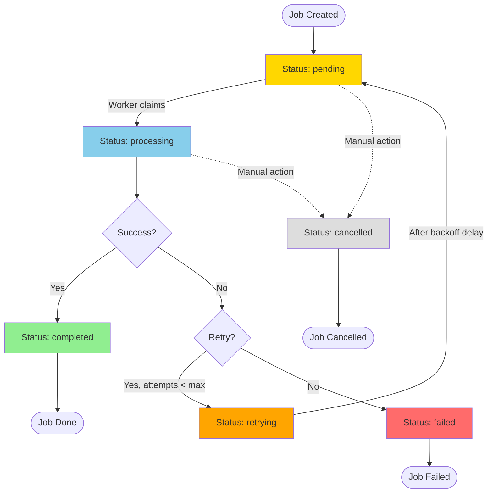
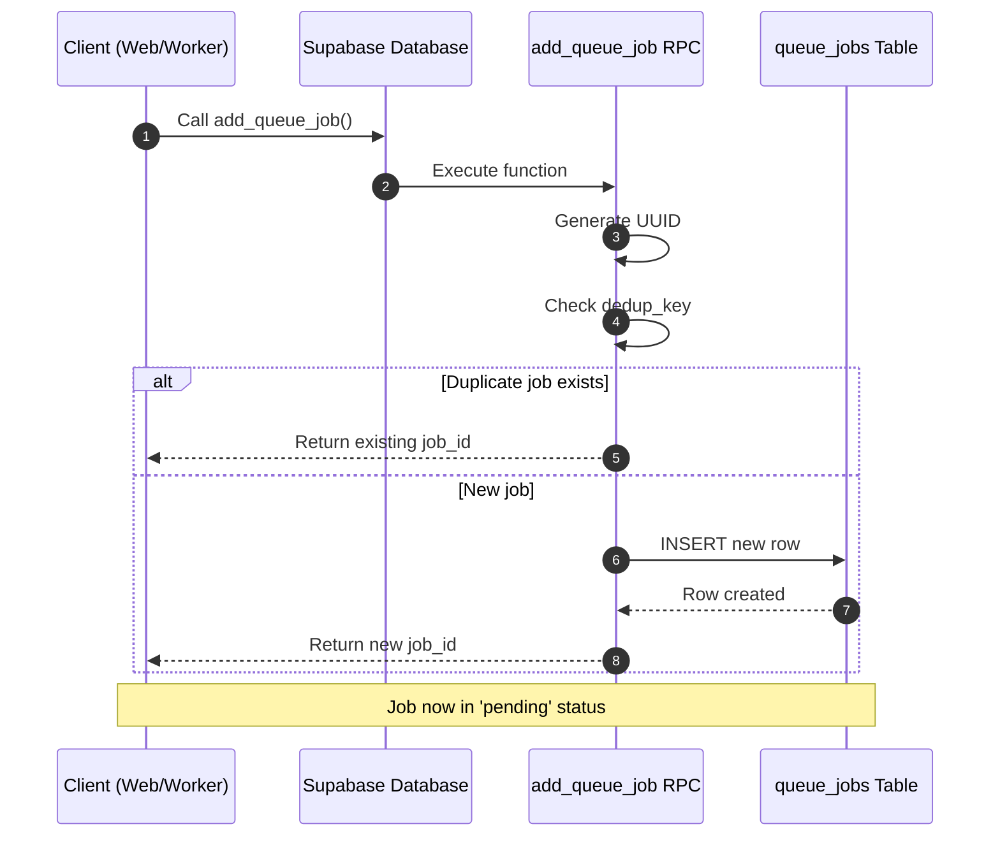
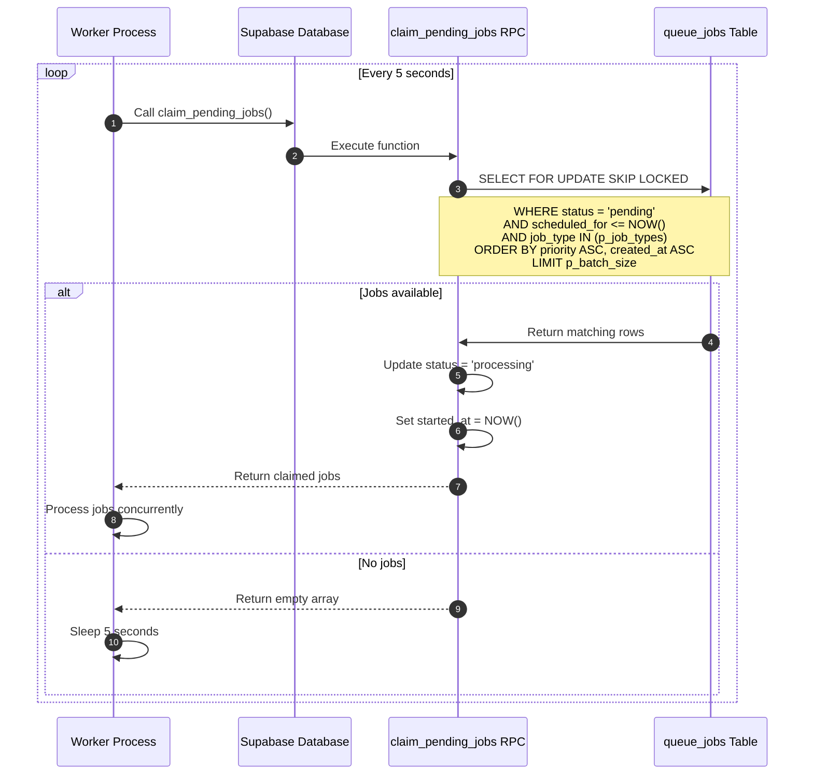
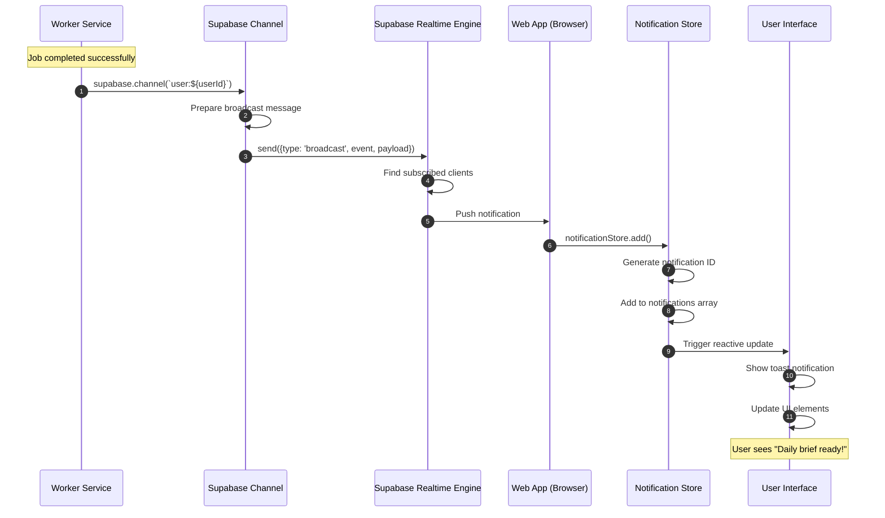
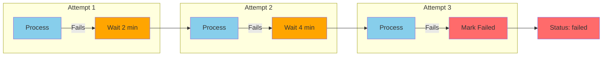
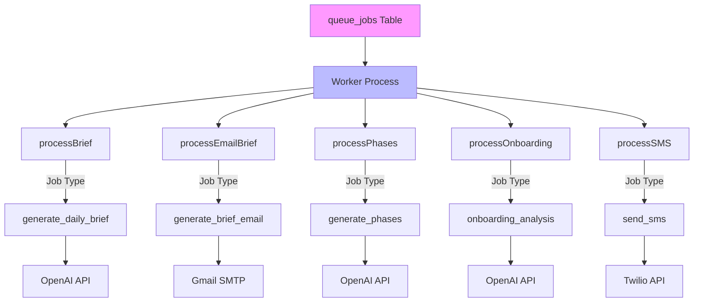
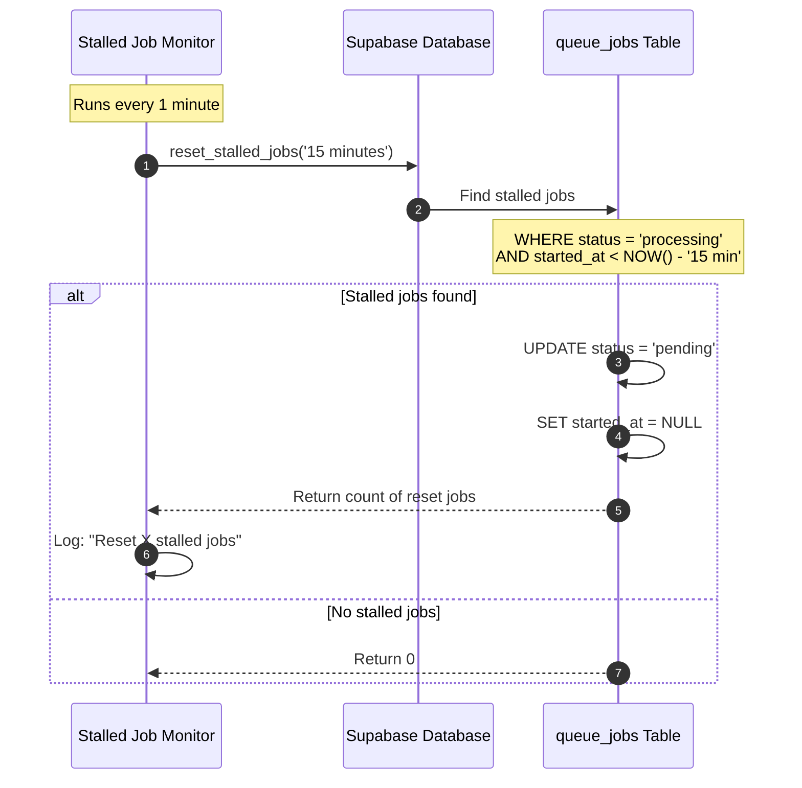
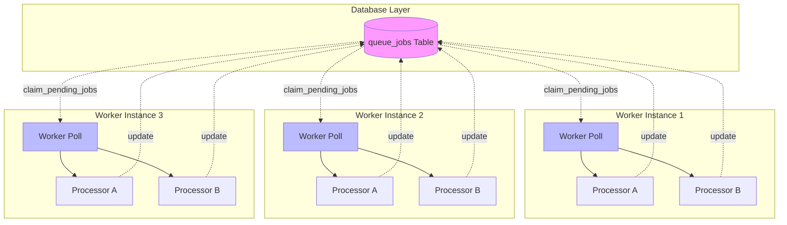
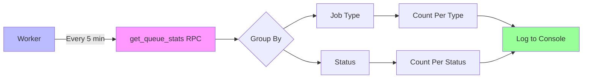

# Queue System Flow Diagrams

**Purpose:** Visual reference for BuildOS queue-based job processing
**Related:** [Web-Worker Architecture](./WEB-WORKER-ARCHITECTURE.md)

---

## Job Lifecycle Overview



---

## Queue Job Creation



**Parameters:**

```typescript
add_queue_job(
  p_user_id: UUID,
  p_job_type: 'generate_daily_brief' | 'send_sms' | ...,
  p_metadata: JSONB,
  p_priority: 1-20 (default 10),
  p_scheduled_for: TIMESTAMP (default NOW()),
  p_dedup_key: TEXT (optional)
)
```

---

## Job Claiming (Worker Poll)



**Key Points:**

- **Atomic claiming:** `SELECT FOR UPDATE SKIP LOCKED` prevents race conditions
- **Priority-based:** Lower priority number = higher priority
- **Batch processing:** Claims up to 5 jobs per poll
- **Concurrent processing:** Uses `Promise.allSettled` for parallel execution

---

## Job Processing Flow

```mermaid
flowchart TD
    START[Worker Claims Job] --> VALIDATE{Metadata Valid?}

    VALIDATE -->|No| FAIL1[Mark Failed: Invalid metadata]
    VALIDATE -->|Yes| PROCESS[Execute Job Processor]

    PROCESS --> CHECK{Processor Type}

    CHECK -->|Brief Generation| BRIEF[Generate Daily Brief]
    CHECK -->|Email Sending| EMAIL[Send Email]
    CHECK -->|SMS Sending| SMS[Send SMS]
    CHECK -->|Phase Generation| PHASES[Generate Phases]

    BRIEF --> LLM1[Call OpenAI API]
    EMAIL --> SMTP[Send via SMTP]
    SMS --> TWILIO[Call Twilio API]
    PHASES --> LLM2[Call OpenAI API]

    LLM1 --> RESULT
    SMTP --> RESULT
    TWILIO --> RESULT
    LLM2 --> RESULT{Success?}

    RESULT -->|Yes| COMPLETE[complete_queue_job]
    RESULT -->|No| ERROR{Retryable?}

    COMPLETE --> UPDATE1[Update status = 'completed']
    UPDATE1 --> SAVE[Save result to JSONB]
    SAVE --> NOTIFY1[Broadcast notification]
    NOTIFY1 --> END1([Done])

    ERROR -->|Yes| RETRY[fail_queue_job retry=true]
    ERROR -->|No| FAIL2[fail_queue_job retry=false]

    RETRY --> BACKOFF[Calculate backoff: 2^attempts * 60min]
    BACKOFF --> REQUEUE[Set scheduled_for = NOW() + backoff]
    REQUEUE --> CHECK_MAX{attempts < max_attempts?}

    CHECK_MAX -->|Yes| STATUS_RETRY[status = 'retrying']
    CHECK_MAX -->|No| STATUS_FAIL[status = 'failed']

    FAIL1 --> END2([Done])
    FAIL2 --> END2
    STATUS_RETRY --> END2
    STATUS_FAIL --> END2

    style COMPLETE fill:#90ee90
    style FAIL1 fill:#ff6b6b
    style FAIL2 fill:#ff6b6b
    style STATUS_FAIL fill:#ff6b6b
    style STATUS_RETRY fill:#ffa500
```

---

## Real-Time Notification Flow



**Notification Events:**

| Event              | Triggered By | Payload Example                  |
| ------------------ | ------------ | -------------------------------- |
| `brief_completed`  | Brief worker | `{briefId, briefDate, timezone}` |
| `brief_email_sent` | Email worker | `{emailId, briefId, trackingId}` |
| `phases_completed` | Phase worker | `{projectId, phaseCount}`        |
| `brief_failed`     | Brief worker | `{error, jobId}`                 |

---

## Retry Logic Visualization



**Backoff Calculation:**

```typescript
const delayMinutes = Math.pow(2, attemptCount) * 60;

// Attempt 1: 2^1 = 2 minutes
// Attempt 2: 2^2 = 4 minutes
// Attempt 3: 2^3 = 8 minutes
```

---

## Job Types & Processors



**Processor Registration:**

```typescript
// File: /apps/worker/src/worker.ts
queue.process("generate_daily_brief", processBrief);
queue.process("generate_brief_email", processEmailBrief);
queue.process("generate_phases", processPhases);
queue.process("onboarding_analysis", processOnboarding);
queue.process("send_sms", processSMS);
```

---

## Stalled Job Recovery



**Causes of Stalled Jobs:**

- Worker crash during processing
- Network timeout
- Out-of-memory errors
- Deployment during processing

**Recovery Strategy:**

- Reset to `pending` after 15 minutes
- Allows automatic retry
- Prevents permanent job loss

---

## Multi-Worker Horizontal Scaling



**Key Features:**

- **No coordination needed:** Each worker polls independently
- **Atomic claiming:** Database prevents duplicate processing
- **Automatic load balancing:** Jobs distributed by availability
- **Fault tolerant:** Other workers continue if one crashes

---

## Queue Statistics Query



**Sample Output:**

```
📊 Queue Statistics:
   generate_daily_brief - pending: 12
   generate_daily_brief - processing: 3
   generate_daily_brief - completed: 1,204
   send_sms - pending: 0
   send_sms - processing: 1
   send_sms - completed: 3,456
```

---

## Related Documentation

- [Web-Worker Architecture](./WEB-WORKER-ARCHITECTURE.md) - Complete architecture overview
- [Deployment Topology](/docs/DEPLOYMENT_TOPOLOGY.md) - System deployment
- [Worker Service Docs](/apps/worker/docs/README.md) - Worker implementation details

---

## Summary

The BuildOS queue system provides:

✅ **Atomic Job Claiming:** No duplicate processing
✅ **Priority-Based Processing:** Critical jobs processed first
✅ **Automatic Retries:** Exponential backoff for transient failures
✅ **Stalled Job Recovery:** Automatic cleanup of stuck jobs
✅ **Horizontal Scalability:** Multiple workers without coordination
✅ **Real-Time Feedback:** Instant notifications to web app
✅ **Type Safety:** Strongly typed job metadata

This architecture ensures reliable, scalable background job processing for the BuildOS platform.
