# Web-Worker Architecture Documentation

**Last Updated:** 2025-10-05
**Status:** Active
**Scope:** Cross-service communication and integration patterns

---

## Overview

BuildOS Platform uses a **dual-service architecture** with clear separation of concerns:

- **Web App** (Vercel): User-facing SvelteKit application for real-time interactions
- **Worker Service** (Railway): Background processing service for asynchronous operations

Communication between these services happens **exclusively through Supabase PostgreSQL** using a queue-based architecture with real-time subscriptions.

---

## System Architecture

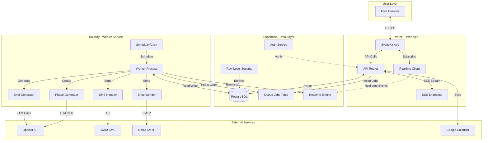

---

## Communication Patterns

### 1. Queue-Based Communication (Web → Worker)

**Pattern:** Asynchronous job queuing through database

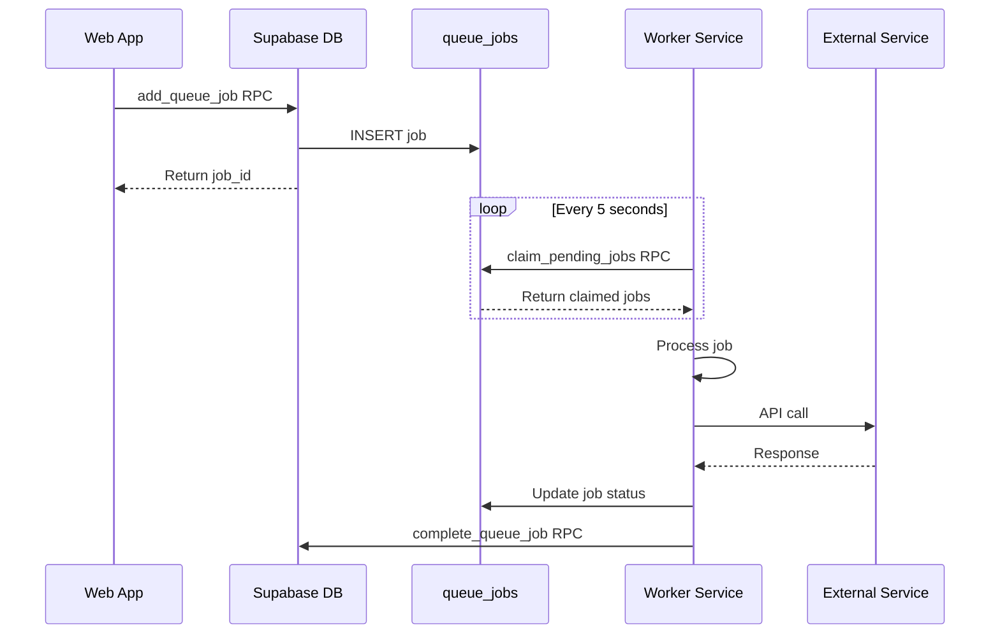

**Key Characteristics:**

- **No Direct HTTP:** Web and worker never communicate via HTTP
- **Atomic Claiming:** Database RPC ensures no duplicate processing
- **Type-Safe:** Typed metadata per job type
- **Retryable:** Exponential backoff with attempt tracking
- **Priority-Based:** Jobs processed by priority (1=highest, 10=default)

**Job Types:**

| Job Type               | Created By               | Processed By      | Purpose                         |
| ---------------------- | ------------------------ | ----------------- | ------------------------------- |
| `generate_daily_brief` | Scheduler (Worker)       | Brief Worker      | Generate AI-powered daily brief |
| `generate_brief_email` | Brief Worker             | Email Worker      | Send brief via email            |
| `generate_phases`      | Web API                  | Phases Worker     | Generate project phases         |
| `onboarding_analysis`  | Web API                  | Onboarding Worker | Analyze user onboarding         |
| `send_sms`             | Web API / Twilio Webhook | SMS Worker        | Send SMS via Twilio             |
| `sync_calendar`        | (Future)                 | (Future)          | Background calendar sync        |
| `process_brain_dump`   | (Future)                 | (Future)          | Async brain dump processing     |

### 2. Real-Time Updates (Worker → Web)

**Pattern:** Broadcast notifications through Supabase Realtime

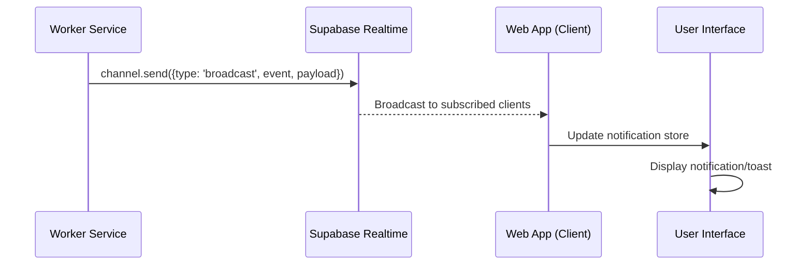

**Implementation:**

```typescript
// Worker: Send notification
const channel = supabase.channel(`user:${userId}`);
await channel.send({
  type: "broadcast",
  event: "brief_completed",
  payload: {
    briefId: "uuid",
    briefDate: "2025-10-05",
    timezone: "America/New_York",
  },
});

// Web: Subscribe to notifications
const channel = supabase.channel(`user:${userId}`);
channel.on("broadcast", { event: "brief_completed" }, (payload) => {
  notificationStore.add({
    type: "success",
    message: "Your daily brief is ready!",
  });
});
```

**Notification Events:**

- `brief_completed` - Daily brief generation complete
- `brief_failed` - Brief generation error
- `brief_email_sent` - Email successfully sent
- `phases_completed` - Phase generation complete
- `onboarding_completed` - Onboarding analysis complete

### 3. Status Polling (Web → Database)

**Pattern:** Database queries for job status

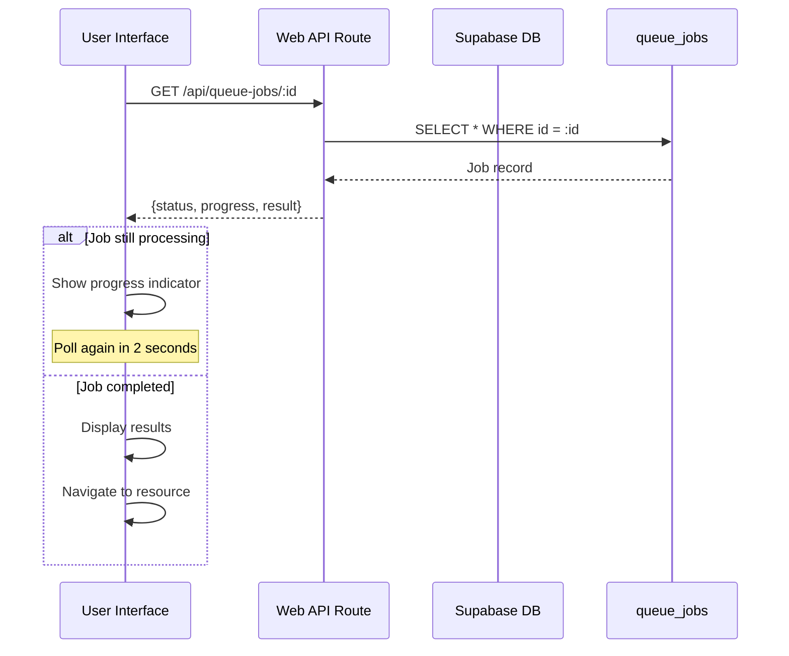

**Job Status Flow:**

```
pending → processing → completed
                    ↘ failed
                    ↘ retrying → pending (re-queued)
```

---

## Feature-Specific Flows

### Daily Briefs (Fully Worker-Based)

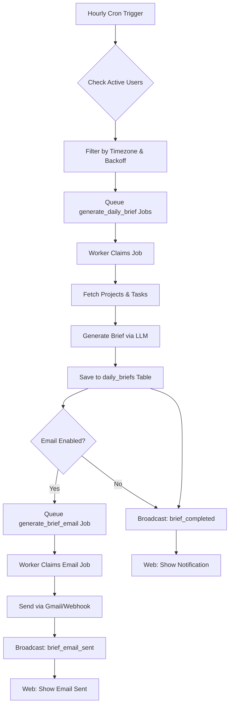

**Characteristics:**

- **100% Worker-Based:** No web app involvement in generation
- **Cascading Jobs:** Brief job creates email job
- **Non-Blocking:** Email sending doesn't block brief completion
- **Real-Time Feedback:** Web receives notifications via Realtime

### Brain Dump Processing (100% Web-Based)

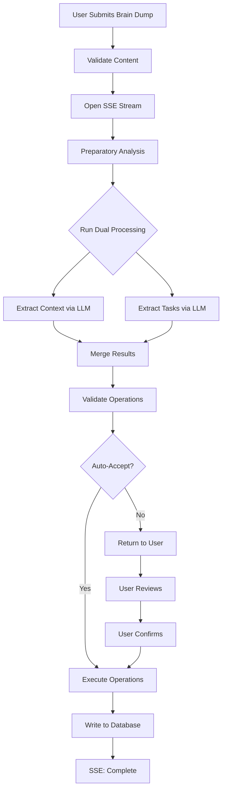

**Characteristics:**

- **Synchronous:** All processing in API route
- **SSE Streaming:** Real-time progress updates
- **No Worker:** Processing happens in web app (Vercel serverless)
- **Typical Duration:** 8-14 seconds total

**Why Not Worker?**

1. **Real-time UX:** Users expect immediate feedback
2. **Streaming Required:** Token-by-token LLM responses
3. **Transaction Integrity:** Atomic success/rollback
4. **Fits Serverless:** Under 60-second timeout

### Calendar Sync (100% Web-Based)

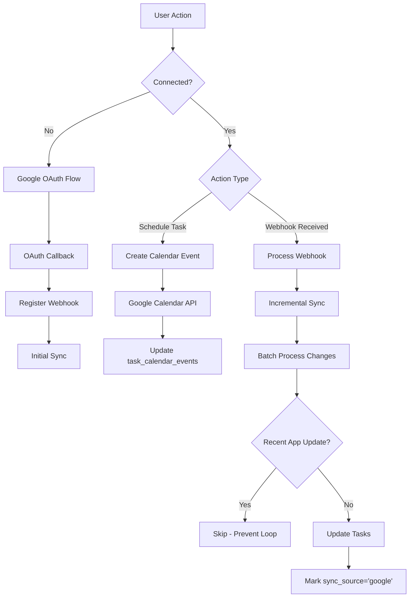

**Characteristics:**

- **Bidirectional:** App ↔ Google Calendar
- **Webhook-Based:** Real-time sync via Google notifications
- **Loop Prevention:** 5-minute window to prevent echo
- **No Worker:** All sync happens in web app

### SMS Notifications (Web + Worker)

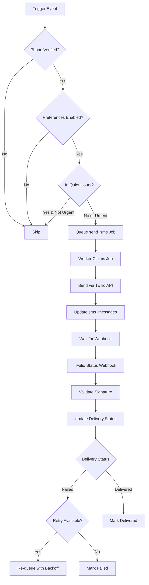

**Characteristics:**

- **Hybrid:** Web queues, Worker processes
- **Webhook Callbacks:** Delivery status from Twilio
- **Retry Logic:** Exponential backoff for failures
- **Preference-Aware:** Respects quiet hours and opt-out

### Phase Generation (Web + Worker)

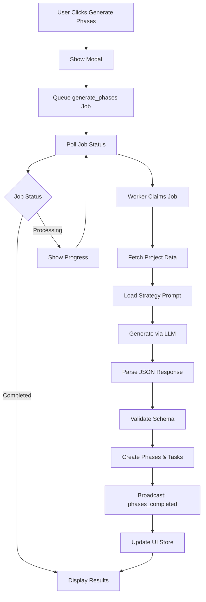

**Characteristics:**

- **User-Initiated:** Web app queues job
- **Worker Processing:** Heavy LLM work in worker
- **Polling + Realtime:** Hybrid status updates
- **Notification Bridge:** Custom store for UI updates

---

## Database Communication Layer

### Queue Jobs Table Schema

```sql
queue_jobs (
  id UUID PRIMARY KEY,
  queue_job_id TEXT UNIQUE,
  user_id UUID REFERENCES users,
  job_type queue_type,
  status queue_status,
  scheduled_for TIMESTAMP,
  metadata JSONB,
  result JSONB,
  attempts INTEGER DEFAULT 0,
  max_attempts INTEGER DEFAULT 3,
  priority INTEGER DEFAULT 10,
  error_message TEXT,
  created_at TIMESTAMP,
  updated_at TIMESTAMP,
  started_at TIMESTAMP,
  processed_at TIMESTAMP,
  completed_at TIMESTAMP
)
```

**Indexes:**

- `idx_queue_jobs_user_status` - User-specific queries
- `idx_queue_jobs_processing` - Worker job claiming
- `idx_queue_jobs_scheduled` - Scheduled job processing

### RPC Functions (Database API)

#### `add_queue_job()`

**Purpose:** Atomic job creation with deduplication

```sql
add_queue_job(
  p_user_id UUID,
  p_job_type TEXT,
  p_metadata JSONB,
  p_priority INTEGER DEFAULT 10,
  p_scheduled_for TIMESTAMP DEFAULT NOW(),
  p_dedup_key TEXT DEFAULT NULL
) RETURNS UUID
```

**Features:**

- Deduplication via unique `dedup_key`
- Returns `job_id` for tracking
- Sets initial status to `pending`
- Idempotent (won't create duplicates)

#### `claim_pending_jobs()`

**Purpose:** Atomic batch job claiming for workers

```sql
claim_pending_jobs(
  p_job_types TEXT[],
  p_batch_size INTEGER DEFAULT 5
) RETURNS SETOF queue_jobs
```

**Features:**

- Atomic `SELECT FOR UPDATE SKIP LOCKED`
- Updates status to `processing`
- Sets `started_at` timestamp
- Prevents race conditions between workers

#### `complete_queue_job()`

**Purpose:** Mark job as successfully completed

```sql
complete_queue_job(
  p_job_id UUID,
  p_result JSONB DEFAULT NULL
) RETURNS VOID
```

**Updates:**

- `status = 'completed'`
- `completed_at = NOW()`
- `processed_at = NOW()`
- `result = p_result`

#### `fail_queue_job()`

**Purpose:** Mark job as failed with retry support

```sql
fail_queue_job(
  p_job_id UUID,
  p_error_message TEXT,
  p_retry BOOLEAN DEFAULT FALSE
) RETURNS VOID
```

**Logic:**

- Increments `attempts`
- If `p_retry` and `attempts < max_attempts`:
  - Sets `status = 'retrying'`
  - Calculates retry delay: `2^attempts * 60 minutes`
  - Updates `scheduled_for`
- Else:
  - Sets `status = 'failed'`
  - Sets `error_message`

---

## Job Lifecycle

### State Machine

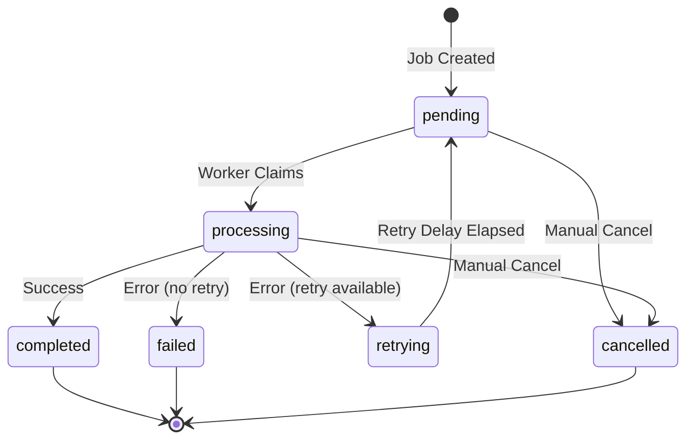

### Detailed Flow

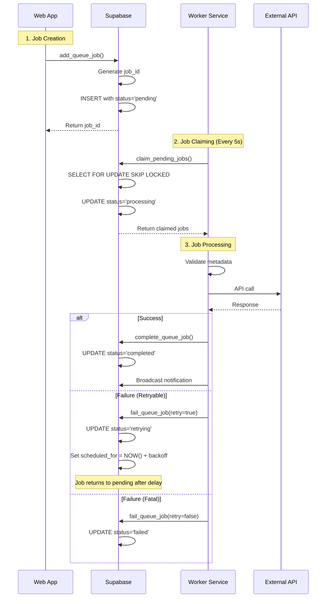

---

## Error Handling & Reliability

### Retry Strategy

**Exponential Backoff:**

```typescript
const retryDelay = Math.pow(2, attemptCount) * 60 * 1000; // minutes

// Attempt 1: 2^1 * 60 = 2 minutes
// Attempt 2: 2^2 * 60 = 4 minutes
// Attempt 3: 2^3 * 60 = 8 minutes
```

**Max Attempts:** 3 (configurable per job type)

**Non-Retryable Errors:**

- Invalid metadata (schema validation failure)
- Invalid user ID (user not found)
- Permission errors (RLS violations)
- Invalid phone numbers (SMS)

### Stalled Job Recovery

**Problem:** Worker crashes mid-processing

**Solution:** Stalled job monitor

```typescript
// Worker startup: Reset stalled jobs
await supabase.rpc("reset_stalled_jobs", {
  p_stall_timeout: "15 minutes",
});

// Logic:
// UPDATE queue_jobs
// SET status = 'pending', started_at = NULL
// WHERE status = 'processing'
//   AND started_at < NOW() - INTERVAL '15 minutes'
```

### Error Logging

**Worker-Side:**

```typescript
try {
  await processJob(job);
} catch (error) {
  console.error(`Job ${job.id} failed:`, error);
  await failJob(job.id, error.message, shouldRetry(error));

  // Log to error tracking service
  await errorLogger.log({
    jobId: job.id,
    jobType: job.job_type,
    error: error,
    userId: job.user_id,
  });
}
```

**Web-Side:**

- Failed jobs visible in UI
- Error messages displayed to users
- Retry button for manual retry

---

## Performance & Scalability

### Current Metrics

**Web App (Vercel):**

- **Deployment:** Serverless functions
- **Scaling:** Auto-scales per request
- **Timeout:** 60 seconds max (extendable)
- **Concurrent:** Unlimited (Vercel scales)

**Worker Service (Railway):**

- **Deployment:** Single long-running process
- **Polling Interval:** 5 seconds
- **Batch Size:** 5 jobs per claim
- **Concurrency:** `Promise.allSettled` for parallel processing

**Database (Supabase):**

- **Connection Pooling:** PgBouncer (100 connections)
- **Query Performance:** Indexed on status, user_id, job_type
- **Atomic Operations:** RPC functions prevent race conditions

### Scaling Strategies

**Horizontal Worker Scaling:**

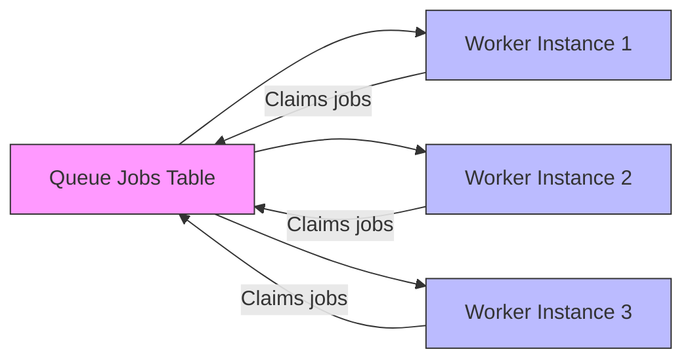

**Key Points:**

- Multiple workers can run simultaneously
- `claim_pending_jobs()` ensures no duplicate processing
- Each worker polls independently
- Jobs distributed by availability

**Future Optimizations:**

1. **Job Priority Queues:** Separate queues for urgent vs. normal
2. **Worker Specialization:** Dedicated workers per job type
3. **Database Partitioning:** Partition queue_jobs by user_id or date
4. **Read Replicas:** Offload read queries to replicas

---

## Monitoring & Observability

### Queue Statistics

```typescript
// Worker: Log queue stats every 5 minutes
const stats = await supabase.rpc("get_queue_stats");

// Returns:
// [
//   { job_type: 'generate_daily_brief', status: 'pending', count: 45 },
//   { job_type: 'generate_daily_brief', status: 'processing', count: 3 },
//   { job_type: 'send_sms', status: 'completed', count: 1204 }
// ]
```

### Health Checks

**Worker Health Endpoint:**

```typescript
// GET /health
{
  "status": "healthy",
  "uptime": 86400,
  "queues": {
    "generate_daily_brief": { "processing": 2, "pending": 10 },
    "send_sms": { "processing": 0, "pending": 0 }
  },
  "lastPoll": "2025-10-05T12:34:56Z"
}
```

**Database Queries:**

```sql
-- Jobs waiting too long
SELECT job_type, COUNT(*), MIN(created_at)
FROM queue_jobs
WHERE status = 'pending'
  AND created_at < NOW() - INTERVAL '1 hour'
GROUP BY job_type;

-- Failed jobs in last hour
SELECT job_type, COUNT(*), array_agg(error_message)
FROM queue_jobs
WHERE status = 'failed'
  AND updated_at > NOW() - INTERVAL '1 hour'
GROUP BY job_type;

-- Average processing time
SELECT
  job_type,
  AVG(EXTRACT(EPOCH FROM (completed_at - started_at))) as avg_duration_seconds
FROM queue_jobs
WHERE status = 'completed'
  AND completed_at > NOW() - INTERVAL '24 hours'
GROUP BY job_type;
```

---

## Security Considerations

### Row Level Security (RLS)

**Queue Jobs:**

```sql
-- Users can only see their own jobs
CREATE POLICY "Users see own jobs"
ON queue_jobs FOR SELECT
USING (auth.uid() = user_id);

-- Service role bypasses RLS
CREATE POLICY "Service role full access"
ON queue_jobs FOR ALL
USING (auth.role() = 'service_role');
```

**Realtime Channels:**

```typescript
// Web: Subscribe with user ID
const channel = supabase.channel(`user:${userId}`, {
  config: {
    broadcast: { self: false },
    presence: { key: userId }
  }
});

// Worker: Only broadcast to specific user's channel
await supabase.channel(`user:${userId}`).send({ ... });
```

### Service Role Usage

**Worker Service:**

- Uses `PRIVATE_SUPABASE_SERVICE_KEY`
- Bypasses RLS policies
- Required for claiming jobs across users (scheduler)
- Logs all operations for audit trail

**Web App:**

- Uses `PUBLIC_SUPABASE_ANON_KEY` for user sessions
- Enforces RLS policies
- Service key only for specific operations (email tracking, admin)

---

## Deployment Considerations

### Environment Variables

**Web App (.env):**

```bash
PUBLIC_SUPABASE_URL=https://xxx.supabase.co
PUBLIC_SUPABASE_ANON_KEY=eyJhbGc...
PRIVATE_SUPABASE_SERVICE_KEY=eyJhbGc...  # Limited use
OPENAI_API_KEY=sk-...
PUBLIC_GOOGLE_CLIENT_ID=xxx.apps.googleusercontent.com
GOOGLE_CLIENT_SECRET=GOCSPX-...
```

**Worker Service (.env):**

```bash
PUBLIC_SUPABASE_URL=https://xxx.supabase.co
PRIVATE_SUPABASE_SERVICE_KEY=eyJhbGc...  # Primary key
OPENAI_API_KEY=sk-...
EMAIL_HOST=smtp.gmail.com
EMAIL_USER=noreply@build-os.com
EMAIL_PASS=app-specific-password
PRIVATE_TWILIO_ACCOUNT_SID=ACxxx
PRIVATE_TWILIO_AUTH_TOKEN=xxx
PUBLIC_RAILWAY_WORKER_URL=https://worker.railway.app
```

### Deployment Flow

**Web App (Vercel):**

1. Push to GitHub main branch
2. Vercel auto-deploys
3. Runs `pnpm build --filter=web`
4. Deploys to Vercel Edge Network
5. Environment variables from Vercel dashboard

**Worker Service (Railway):**

1. Push to GitHub main branch
2. Railway auto-deploys
3. Runs `pnpm build --filter=worker`
4. Restarts worker process
5. Environment variables from Railway dashboard
6. Zero-downtime: Drains existing jobs before restart

---

## Testing Strategy

### Unit Tests

**Web App:**

```bash
cd apps/web
pnpm test                    # Unit tests
pnpm test:llm                # LLM integration tests (costs money)
```

**Worker Service:**

```bash
cd apps/worker
pnpm test                    # Unit tests
pnpm test:scheduler          # Scheduler tests
```

### Integration Tests

**Queue System:**

```typescript
// Test job creation
const jobId = await queue.add("test_job", userId, { test: true });
expect(jobId).toBeDefined();

// Test job claiming
const jobs = await queue.claim(["test_job"], 1);
expect(jobs).toHaveLength(1);

// Test job completion
await queue.complete(jobId, { success: true });
const job = await queue.getJob(jobId);
expect(job.status).toBe("completed");
```

**Realtime Notifications:**

```typescript
// Subscribe to test channel
const messages = [];
const channel = supabase.channel("test:user123");
channel.on("broadcast", { event: "*" }, (msg) => {
  messages.push(msg);
});

// Trigger notification
await notifyUser("user123", "test_event", { data: "test" });

// Verify received
await sleep(1000);
expect(messages).toContainEqual({
  event: "test_event",
  payload: { data: "test" },
});
```

---

## Migration Path (Future Considerations)

### Potential Evolution: From Supabase Queue to BullMQ/Redis

**Current:** Supabase-based queue (no Redis)

**Future:** Redis-backed BullMQ (if scaling requires)

**Benefits:**

- Higher throughput (Redis optimized for queues)
- Built-in job prioritization
- Advanced retry strategies
- Job scheduling with cron
- Multi-queue support

**Migration Strategy:**

1. Run both systems in parallel
2. Use `JobAdapter` pattern (already in codebase)
3. Gradual migration by job type
4. Monitor performance and costs
5. Complete cutover when stable

**Current `JobAdapter` (already implemented):**

```typescript
// File: /apps/worker/src/workers/shared/jobAdapter.ts
export class JobAdapter<T = any> {
  constructor(processingJob: ProcessingJob<T>) {
    this.legacyJob = this.createLegacyInterface();
  }

  // Converts new queue job format to old BullMQ format
  private createLegacyInterface(): LegacyJob<T> { ... }
}
```

---

## Related Documentation

**Architecture:**

- [Deployment Topology](/docs/DEPLOYMENT_TOPOLOGY.md)
- [Monorepo Guide](/docs/MONOREPO_GUIDE.md)

**App-Specific:**

- [Web App Documentation](/apps/web/docs/README.md)
- [Worker Service Documentation](/apps/worker/docs/README.md)

**Features:**

- [Daily Briefs](/apps/worker/docs/features/daily-briefs/README.md)
- [Brain Dump System](/apps/web/docs/features/brain-dump/README.md)
- [Calendar Integration](/apps/web/docs/features/calendar-integration/README.md)
- [Notification System](/apps/web/docs/features/notifications/README.md)

**Operations:**

- [Environment Variables Checklist](/docs/operations/environment/DEPLOYMENT_ENV_CHECKLIST.md)

---

## Summary

BuildOS Platform achieves reliable cross-service communication through:

✅ **Queue-Based Architecture:** Supabase PostgreSQL for job management
✅ **Real-Time Synchronization:** Supabase Realtime for instant updates
✅ **Atomic Operations:** Database RPCs prevent race conditions
✅ **Type Safety:** Shared types package ensures consistency
✅ **Error Recovery:** Automatic retries with exponential backoff
✅ **Scalability:** Horizontal worker scaling with no coordination needed
✅ **Security:** RLS policies and service role separation
✅ **Monitoring:** Built-in health checks and statistics

This architecture provides a solid foundation for current scale while supporting future growth through horizontal scaling and potential migration to specialized queue systems if needed.
