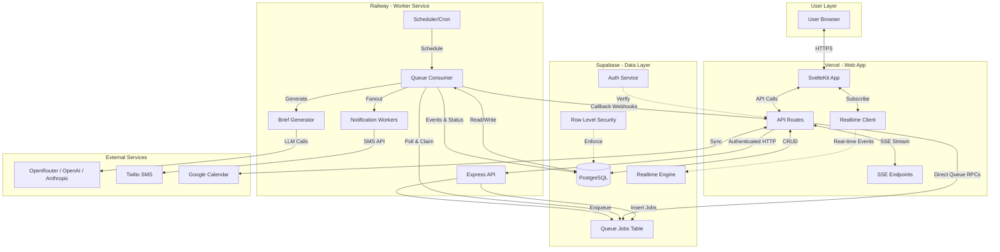
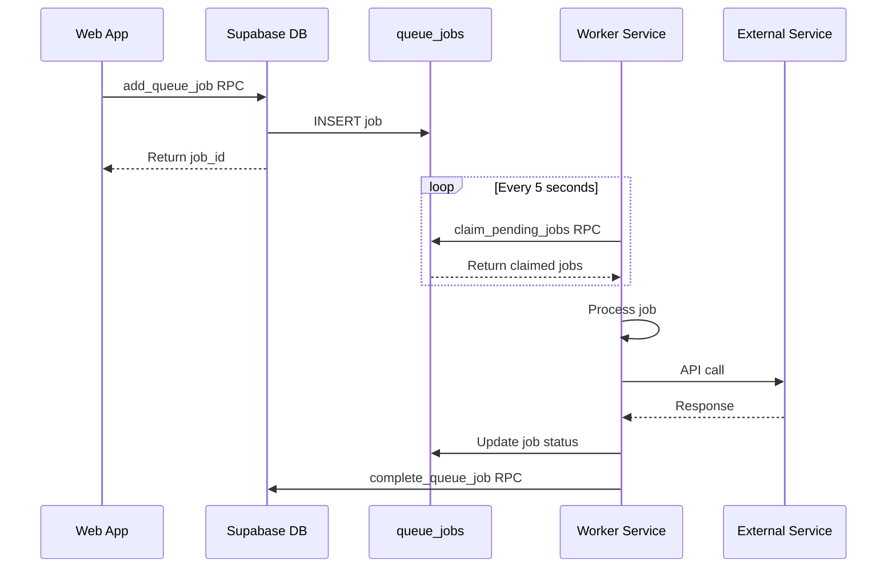
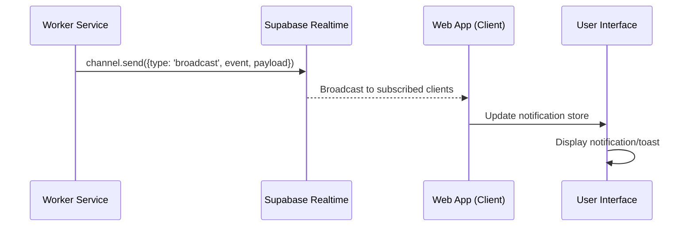
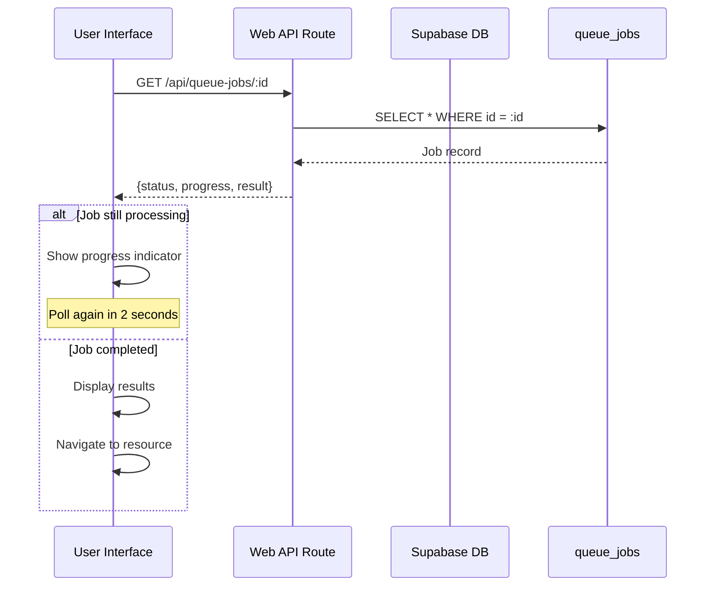
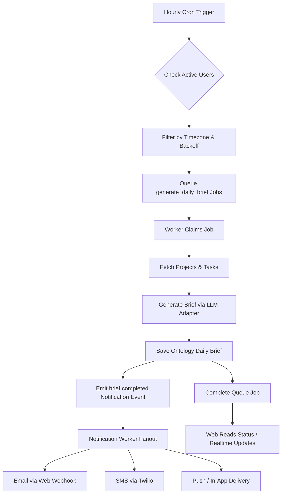
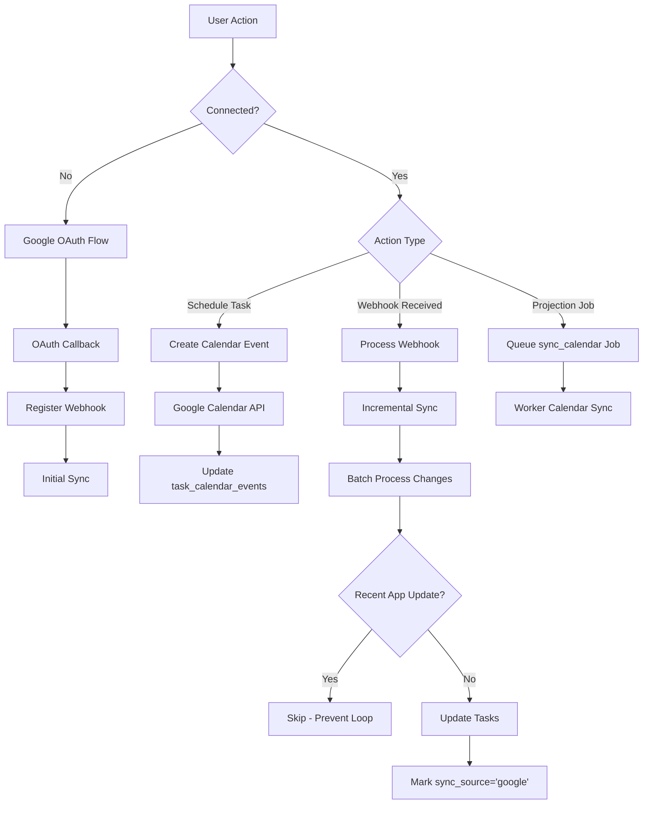
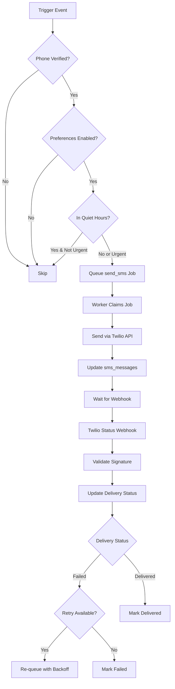
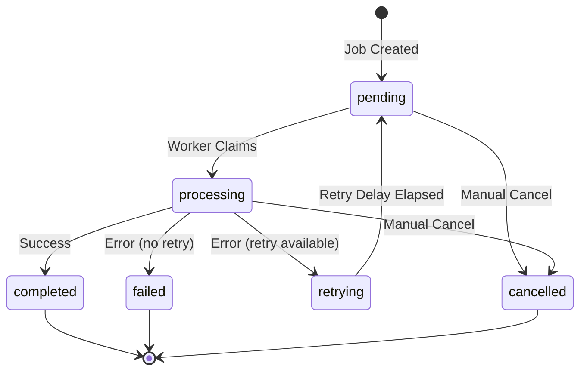
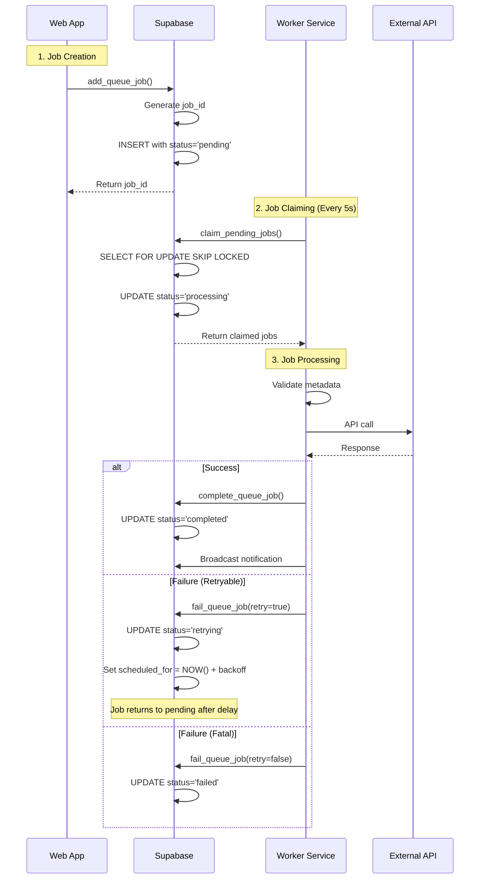
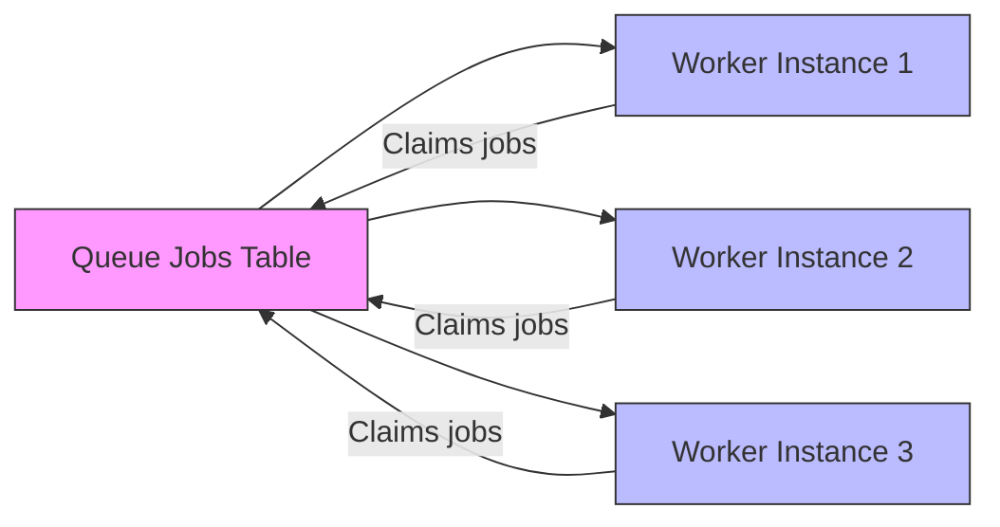

<!-- docs/architecture/diagrams/WEB-WORKER-ARCHITECTURE.md -->

# Web-Worker Architecture Documentation

**Last Updated:** 2026-07-14
**Status:** Active
**Scope:** Cross-service communication and integration patterns

---

## Overview

BuildOS Platform uses a **dual-service architecture** with clear separation of concerns:

- **Web App** (Vercel): User-facing SvelteKit application for real-time interactions
- **Worker Service** (Railway): Express API, queue consumer, and scheduler for asynchronous operations

The primary async path is still the Supabase-backed queue, but web and worker also use
authenticated HTTP for enqueue/status/classification routes and worker-to-web webhook callbacks.
Realtime subscriptions handle supported live UI updates.

> Current-state note: this document has some historical detail below. Treat
> `apps/worker/src/worker.ts` and `apps/worker/docs/README.md` as the active
> source of truth for registered worker jobs.

---

## System Architecture


```mermaid
graph TB
    subgraph "User Layer"
        U[User Browser]
    end

    subgraph "Vercel - Web App"
        WEB[SvelteKit App]
        API[API Routes]
        SSE[SSE Endpoints]
        RT[Realtime Client]
    end

    subgraph "Supabase - Data Layer"
        DB[(PostgreSQL)]
        QUEUE[Queue Jobs Table]
        RLS[Row Level Security]
        REALTIME[Realtime Engine]
        AUTH[Auth Service]
    end

    subgraph "Railway - Worker Service"
        HTTP[Express API]
        WORKER[Queue Consumer]
        BRIEF[Brief Generator]
        NOTIFY[Notification Workers]
        CRON[Scheduler/Cron]
    end

    subgraph "External Services"
        LLM[OpenRouter / OpenAI / Anthropic]
        TWILIO[Twilio SMS]
        GCAL[Google Calendar]
    end

    U <-->|HTTPS| WEB
    WEB <-->|API Calls| API
    API <-->|SSE Stream| SSE
    WEB <-->|Subscribe| RT

    API -->|Authenticated HTTP| HTTP
    HTTP -->|Insert Jobs| QUEUE
    API -->|Direct Queue RPCs| QUEUE
    API <-->|CRUD| DB
    RT -.->|Real-time Events| REALTIME

    WORKER -->|Poll & Claim| QUEUE
    WORKER <-->|Read/Write| DB
    WORKER -->|Events & Status| DB
    WORKER -->|Callback Webhooks| API

    CRON -->|Schedule| WORKER
    HTTP -->|Enqueue| QUEUE
    WORKER -->|Generate| BRIEF
    WORKER -->|Fanout| NOTIFY

    API <-->|Sync| GCAL
    BRIEF -->|LLM Calls| LLM
    NOTIFY -->|SMS API| TWILIO

    AUTH -.->|Verify| API
    RLS -.->|Enforce| DB
```

---

## Communication Patterns

### 1. Queue-Based Communication (Web → Worker)

**Pattern:** Asynchronous job queuing through database


```mermaid
sequenceDiagram
    participant Web as Web App
    participant DB as Supabase DB
    participant Queue as queue_jobs
    participant Worker as Worker Service
    participant External as External Service

    Web->>DB: add_queue_job RPC
    DB->>Queue: INSERT job
    DB-->>Web: Return job_id

    loop Every 5 seconds
        Worker->>Queue: claim_pending_jobs RPC
        Queue-->>Worker: Return claimed jobs
    end

    Worker->>Worker: Process job
    Worker->>External: API call
    External-->>Worker: Response
    Worker->>Queue: Update job status
    Worker->>DB: complete_queue_job RPC
```

**Key Characteristics:**

- **Hybrid control plane:** Web uses authenticated worker HTTP routes for selected enqueue,
  status, and synchronous classification paths, while long-running work is processed from
  Supabase queue rows
- **Atomic Claiming:** Database RPC ensures no duplicate processing
- **Type-Safe:** Typed metadata per job type
- **Retryable:** Exponential backoff with attempt tracking
- **Priority-Based:** Jobs processed by priority (1=highest, 10=default)

**Active Job Types:**

The live source of truth is `queue.process(...)` registration in
`apps/worker/src/worker.ts`.

| Job Type                         | Created By                        | Processed By             | Purpose                              |
| -------------------------------- | --------------------------------- | ------------------------ | ------------------------------------ |
| `generate_daily_brief`           | Scheduler or worker API           | Brief worker             | Generate ontology daily brief        |
| `generate_brief_audio`           | Brief worker or web audio flow    | Brief audio worker       | Generate brief narration             |
| `onboarding_analysis`            | Worker API / web service          | Onboarding worker        | Analyze onboarding input             |
| `send_notification`              | Notification event fanout         | Notification worker      | Deliver email, SMS, push, in-app     |
| `project_activity_batch_flush`   | Project activity batching         | Notification worker      | Flush project activity notifications |
| `schedule_daily_sms`             | Scheduler                         | Daily SMS worker         | Schedule SMS reminders               |
| `send_sms`                       | SMS scheduler / notification SMS  | SMS worker               | Send SMS via Twilio                  |
| `classify_chat_session`          | Worker API / web service          | Chat classifier          | Classify chat sessions               |
| `process_onto_braindump`         | Worker API / web service          | Braindump processor      | Process ontology braindumps          |
| `transcribe_voice_note`          | Voice note upload flow            | Voice note worker        | Transcribe voice notes               |
| `extract_onto_asset_ocr`         | Ontology asset flow               | Asset OCR worker         | Extract OCR from assets              |
| `agent_run`                      | Chat/manual/scheduled Operatives  | Agent-run worker         | Run scheduled or manual Operatives   |
| `build_project_context_snapshot` | Web project context service       | Ontology snapshot worker | Build project context snapshots      |
| `generate_project_icon`          | Project icon/snapshot flow        | Project icon worker      | Generate project icons               |
| `buildos_project_loop`           | Project Review services/scheduler | Project Review worker    | Generate Project Review suggestions  |
| `sync_calendar`                  | Calendar projection services      | Calendar sync worker     | Sync calendar projection work        |

### 2. Real-Time Updates (Worker → Web)

**Pattern:** Broadcast notifications through Supabase Realtime


```mermaid
sequenceDiagram
    participant Worker as Worker Service
    participant RT as Supabase Realtime
    participant Web as Web App (Client)
    participant UI as User Interface

    Worker->>RT: channel.send({type: 'broadcast', event, payload})
    RT-->>Web: Broadcast to subscribed clients
    Web->>UI: Update notification store
    UI->>UI: Display notification/toast
```

**Implementation:**

```typescript
// Worker: Send notification
const channel = supabase.channel(`user:${userId}`);
await channel.send({
	type: 'broadcast',
	event: 'brief_completed',
	payload: {
		briefId: 'uuid',
		briefDate: '2025-10-05',
		timezone: 'America/New_York'
	}
});

// Web: Subscribe to notifications
const channel = supabase.channel(`user:${userId}`);
channel.on('broadcast', { event: 'brief_completed' }, (payload) => {
	notificationStore.add({
		type: 'success',
		message: 'Your daily brief is ready!'
	});
});
```

**Notification Events:**

- Queue job status changes in `queue_jobs`
- Notification events such as `brief.completed`
- Delivery records for email, SMS, push, and in-app notifications
- Realtime broadcasts for UI flows that subscribe to project/user channels

### 3. Status Polling (Web → Database)

**Pattern:** Database queries for job status


```mermaid
sequenceDiagram
    participant UI as User Interface
    participant API as Web API Route
    participant DB as Supabase DB
    participant Queue as queue_jobs

    UI->>API: GET /api/queue-jobs/:id
    API->>Queue: SELECT * WHERE id = :id
    Queue-->>API: Job record
    API-->>UI: {status, progress, result}

    alt Job still processing
        UI->>UI: Show progress indicator
        Note over UI: Poll again in 2 seconds
    else Job completed
        UI->>UI: Display results
        UI->>UI: Navigate to resource
    end
```

**Job Status Flow:**

```
pending → processing → completed
                    ↘ failed
                    ↘ retrying → pending (re-queued)
```

---

## Feature-Specific Flows

### Daily Briefs (Fully Worker-Based)


```mermaid
flowchart TD
    START[Hourly Cron Trigger] --> CHECK{Check Active Users}
    CHECK --> FILTER[Filter by Timezone & Backoff]
    FILTER --> QUEUE[Queue generate_daily_brief Jobs]

    QUEUE --> WORKER1[Worker Claims Job]
    WORKER1 --> FETCH[Fetch Projects & Tasks]
    FETCH --> LLM[Generate Brief via LLM Adapter]
    LLM --> SAVE[Save Ontology Daily Brief]
    SAVE --> EVENT[Emit brief.completed Notification Event]
    EVENT --> FANOUT[Notification Worker Fanout]
    FANOUT --> EMAIL[Email via Web Webhook]
    FANOUT --> SMS[SMS via Twilio]
    FANOUT --> PUSH[Push / In-App Delivery]
    SAVE --> STATUS[Complete Queue Job]
    STATUS --> WEB[Web Reads Status / Realtime Updates]
```

**Characteristics:**

- **Worker-Based Generation:** The worker owns brief generation and persistence
- **Separate Delivery Pipeline:** Notification fanout handles email, SMS, push, and in-app
- **Webhook Email:** Worker calls the web email webhook when email delivery is needed
- **Status Visibility:** Web reads queue status and notification state from API/database paths

### Brain Dump Processing

> **Updated 2026-04-17.** The original 100%-web-based SSE brain-dump flow described here was
> deprecated (see `docs/architecture/decisions/2026-04-17-deprecate-brain-dump.md`). Brain dumps
> now process through the worker via the `process_onto_braindump` job into the ontology pipeline.
> The historical web-SSE flow diagram is preserved in `docs/archive/brain-dump/`.

### Calendar Sync (Web + Worker)


```mermaid
flowchart TD
    START[User Action] --> OAUTH{Connected?}
    OAUTH -->|No| AUTH[Google OAuth Flow]
    AUTH --> CALLBACK[OAuth Callback]
    CALLBACK --> WEBHOOK[Register Webhook]
    WEBHOOK --> SYNC[Initial Sync]

    OAUTH -->|Yes| ACTION{Action Type}

    ACTION -->|Schedule Task| CREATE[Create Calendar Event]
    CREATE --> GCAL[Google Calendar API]
    GCAL --> UPDATE_DB[Update task_calendar_events]

    ACTION -->|Webhook Received| PROCESS[Process Webhook]
    PROCESS --> INCREMENTAL[Incremental Sync]
    INCREMENTAL --> BATCH[Batch Process Changes]
    BATCH --> LOOP_CHECK{Recent App Update?}

    LOOP_CHECK -->|Yes| SKIP[Skip - Prevent Loop]
    LOOP_CHECK -->|No| UPDATE_TASKS[Update Tasks]

    UPDATE_TASKS --> MARK[Mark sync_source='google']
    ACTION -->|Projection Job| QUEUE_SYNC[Queue sync_calendar Job]
    QUEUE_SYNC --> WORKER_SYNC[Worker Calendar Sync]
```

**Characteristics:**

- **Bidirectional:** App ↔ Google Calendar
- **Webhook-Based:** Google notifications enter through the web app
- **Worker-Assisted:** `sync_calendar` jobs handle background calendar projection work
- **Loop Prevention:** 5-minute window to prevent echo
- **Shared Secret:** Worker-to-web callbacks use `PRIVATE_BUILDOS_WEBHOOK_SECRET`

### SMS Notifications (Web + Worker)


```mermaid
flowchart TD
    START[Trigger Event] --> CHECK{Phone Verified?}
    CHECK -->|No| END[Skip]
    CHECK -->|Yes| PREFS{Preferences Enabled?}

    PREFS -->|No| END
    PREFS -->|Yes| QUIET{In Quiet Hours?}

    QUIET -->|Yes & Not Urgent| END
    QUIET -->|No or Urgent| QUEUE[Queue send_sms Job]

    QUEUE --> WORKER[Worker Claims Job]
    WORKER --> TWILIO[Send via Twilio API]
    TWILIO --> UPDATE[Update sms_messages]
    UPDATE --> WEBHOOK_WAIT[Wait for Webhook]

    WEBHOOK_WAIT --> TWILIO_WEBHOOK[Twilio Status Webhook]
    TWILIO_WEBHOOK --> VERIFY[Validate Signature]
    VERIFY --> UPDATE_STATUS[Update Delivery Status]

    UPDATE_STATUS --> STATUS{Delivery Status}
    STATUS -->|Failed| RETRY_CHECK{Retry Available?}
    RETRY_CHECK -->|Yes| REQUEUE[Re-queue with Backoff]
    RETRY_CHECK -->|No| MARK_FAILED[Mark Failed]

    STATUS -->|Delivered| COMPLETE[Mark Delivered]
```

**Characteristics:**

- **Hybrid:** Web queues, Worker processes
- **Webhook Callbacks:** Delivery status from Twilio
- **Retry Logic:** Exponential backoff for failures
- **Preference-Aware:** Respects quiet hours and opt-out

### Phase Generation

`generate_phases` is a retired or compatibility-only worker job value in the current worker
docs. Do not treat this as an active flow unless it is re-registered in
`apps/worker/src/worker.ts`.

---

## Database Communication Layer

### Queue Jobs Table Schema

```sql
queue_jobs (
  id UUID PRIMARY KEY,
  queue_job_id TEXT UNIQUE,
  user_id UUID REFERENCES users,
  job_type queue_type,
  status queue_status,
  scheduled_for TIMESTAMP,
  metadata JSONB,
  result JSONB,
  attempts INTEGER DEFAULT 0,
  max_attempts INTEGER DEFAULT 3,
  priority INTEGER DEFAULT 10,
  error_message TEXT,
  created_at TIMESTAMP,
  updated_at TIMESTAMP,
  started_at TIMESTAMP,
  processed_at TIMESTAMP,
  completed_at TIMESTAMP
)
```

**Indexes:**

- `idx_queue_jobs_user_status` - User-specific queries
- `idx_queue_jobs_processing` - Worker job claiming
- `idx_queue_jobs_scheduled` - Scheduled job processing

### RPC Functions (Database API)

#### `add_queue_job()`

**Purpose:** Atomic job creation with deduplication

```sql
add_queue_job(
  p_user_id UUID,
  p_job_type TEXT,
  p_metadata JSONB,
  p_priority INTEGER DEFAULT 10,
  p_scheduled_for TIMESTAMP DEFAULT NOW(),
  p_dedup_key TEXT DEFAULT NULL
) RETURNS UUID
```

**Features:**

- Deduplication via unique `dedup_key`
- Returns `job_id` for tracking
- Sets initial status to `pending`
- Idempotent (won't create duplicates)

#### `claim_pending_jobs()`

**Purpose:** Atomic batch job claiming for workers

```sql
claim_pending_jobs(
  p_job_types TEXT[],
  p_batch_size INTEGER DEFAULT 5
) RETURNS SETOF queue_jobs
```

**Features:**

- Atomic `SELECT FOR UPDATE SKIP LOCKED`
- Updates status to `processing`
- Sets `started_at` timestamp
- Prevents race conditions between workers

#### `complete_queue_job()`

**Purpose:** Mark job as successfully completed

```sql
complete_queue_job(
  p_job_id UUID,
  p_result JSONB DEFAULT NULL
) RETURNS VOID
```

**Updates:**

- `status = 'completed'`
- `completed_at = NOW()`
- `processed_at = NOW()`
- `result = p_result`

#### `fail_queue_job()`

**Purpose:** Mark job as failed with retry support

```sql
fail_queue_job(
  p_job_id UUID,
  p_error_message TEXT,
  p_retry BOOLEAN DEFAULT FALSE
) RETURNS VOID
```

**Logic:**

- Increments `attempts`
- If `p_retry` and `attempts < max_attempts`:
    - Sets `status = 'retrying'`
    - Calculates retry delay: `2^attempts * 60 minutes`
    - Updates `scheduled_for`
- Else:
    - Sets `status = 'failed'`
    - Sets `error_message`

---

## Job Lifecycle

### State Machine


```mermaid
stateDiagram-v2
    [*] --> pending: Job Created
    pending --> processing: Worker Claims

    processing --> completed: Success
    processing --> failed: Error (no retry)
    processing --> retrying: Error (retry available)

    retrying --> pending: Retry Delay Elapsed

    completed --> [*]
    failed --> [*]

    pending --> cancelled: Manual Cancel
    processing --> cancelled: Manual Cancel
    cancelled --> [*]
```

### Detailed Flow


```mermaid
sequenceDiagram
    participant Web as Web App
    participant DB as Supabase
    participant Worker as Worker Service
    participant External as External API

    Note over Web: 1. Job Creation
    Web->>DB: add_queue_job()
    DB->>DB: Generate job_id
    DB->>DB: INSERT with status='pending'
    DB-->>Web: Return job_id

    Note over Worker: 2. Job Claiming (Every 5s)
    Worker->>DB: claim_pending_jobs()
    DB->>DB: SELECT FOR UPDATE SKIP LOCKED
    DB->>DB: UPDATE status='processing'
    DB-->>Worker: Return claimed jobs

    Note over Worker: 3. Job Processing
    Worker->>Worker: Validate metadata
    Worker->>External: API call
    External-->>Worker: Response

    alt Success
        Worker->>DB: complete_queue_job()
        DB->>DB: UPDATE status='completed'
        Worker->>DB: Broadcast notification
    else Failure (Retryable)
        Worker->>DB: fail_queue_job(retry=true)
        DB->>DB: UPDATE status='retrying'
        DB->>DB: Set scheduled_for = NOW() + backoff
        Note over DB: Job returns to pending after delay
    else Failure (Fatal)
        Worker->>DB: fail_queue_job(retry=false)
        DB->>DB: UPDATE status='failed'
    end
```

---

## Error Handling & Reliability

### Retry Strategy

**Exponential Backoff:**

```typescript
const retryDelay = Math.pow(2, attemptCount) * 60 * 1000; // minutes

// Attempt 1: 2^1 * 60 = 2 minutes
// Attempt 2: 2^2 * 60 = 4 minutes
// Attempt 3: 2^3 * 60 = 8 minutes
```

**Max Attempts:** 3 (configurable per job type)

**Non-Retryable Errors:**

- Invalid metadata (schema validation failure)
- Invalid user ID (user not found)
- Permission errors (RLS violations)
- Invalid phone numbers (SMS)

### Stalled Job Recovery

**Problem:** Worker crashes mid-processing

**Solution:** Stalled job monitor

```typescript
// Worker startup: Reset stalled jobs
await supabase.rpc('reset_stalled_jobs', {
	p_stall_timeout: '15 minutes'
});

// Logic:
// UPDATE queue_jobs
// SET status = 'pending', started_at = NULL
// WHERE status = 'processing'
//   AND started_at < NOW() - INTERVAL '15 minutes'
```

### Error Logging

**Worker-Side:**

```typescript
try {
	await processJob(job);
} catch (error) {
	console.error(`Job ${job.id} failed:`, error);
	await failJob(job.id, error.message, shouldRetry(error));

	// Log to error tracking service
	await errorLogger.log({
		jobId: job.id,
		jobType: job.job_type,
		error: error,
		userId: job.user_id
	});
}
```

**Web-Side:**

- Failed jobs visible in UI
- Error messages displayed to users
- Retry button for manual retry

---

## Performance & Scalability

### Current Metrics

**Web App (Vercel):**

- **Deployment:** Serverless functions
- **Scaling:** Auto-scales per request
- **Timeout:** 60 seconds max (extendable)
- **Concurrent:** Unlimited (Vercel scales)

**Worker Service (Railway):**

- **Deployment:** Single long-running process
- **Polling Interval:** 5 seconds
- **Batch Size:** 5 jobs per claim
- **Concurrency:** `Promise.allSettled` for parallel processing

**Database (Supabase):**

- **Connection Pooling:** PgBouncer (100 connections)
- **Query Performance:** Indexed on status, user_id, job_type
- **Atomic Operations:** RPC functions prevent race conditions

### Scaling Strategies

**Horizontal Worker Scaling:**


```mermaid
graph LR
    Q[Queue Jobs Table] --> W1[Worker Instance 1]
    Q --> W2[Worker Instance 2]
    Q --> W3[Worker Instance 3]

    W1 --> |Claims jobs| Q
    W2 --> |Claims jobs| Q
    W3 --> |Claims jobs| Q

    style Q fill:#f9f,stroke:#333
    style W1 fill:#bbf,stroke:#333
    style W2 fill:#bbf,stroke:#333
    style W3 fill:#bbf,stroke:#333
```

**Key Points:**

- Multiple workers can run simultaneously
- `claim_pending_jobs()` ensures no duplicate processing
- Each worker polls independently
- Jobs distributed by availability

**Future Optimizations:**

1. **Job Priority Queues:** Separate queues for urgent vs. normal
2. **Worker Specialization:** Dedicated workers per job type
3. **Database Partitioning:** Partition queue_jobs by user_id or date
4. **Read Replicas:** Offload read queries to replicas

---

## Monitoring & Observability

### Queue Statistics

```typescript
// Worker: Log queue stats every 5 minutes
const stats = await supabase.rpc('get_queue_stats');

// Returns:
// [
//   { job_type: 'generate_daily_brief', status: 'pending', count: 45 },
//   { job_type: 'generate_daily_brief', status: 'processing', count: 3 },
//   { job_type: 'send_sms', status: 'completed', count: 1204 }
// ]
```

### Health Checks

**Worker Health Endpoint:**

```typescript
// GET /health
{
  "status": "healthy",
  "uptime": 86400,
  "queues": {
    "generate_daily_brief": { "processing": 2, "pending": 10 },
    "send_sms": { "processing": 0, "pending": 0 }
  },
  "lastPoll": "2025-10-05T12:34:56Z"
}
```

**Database Queries:**

```sql
-- Jobs waiting too long
SELECT job_type, COUNT(*), MIN(created_at)
FROM queue_jobs
WHERE status = 'pending'
  AND created_at < NOW() - INTERVAL '1 hour'
GROUP BY job_type;

-- Failed jobs in last hour
SELECT job_type, COUNT(*), array_agg(error_message)
FROM queue_jobs
WHERE status = 'failed'
  AND updated_at > NOW() - INTERVAL '1 hour'
GROUP BY job_type;

-- Average processing time
SELECT
  job_type,
  AVG(EXTRACT(EPOCH FROM (completed_at - started_at))) as avg_duration_seconds
FROM queue_jobs
WHERE status = 'completed'
  AND completed_at > NOW() - INTERVAL '24 hours'
GROUP BY job_type;
```

---

## Security Considerations

### Row Level Security (RLS)

**Queue Jobs:**

```sql
-- Users can only see their own jobs
CREATE POLICY "Users see own jobs"
ON queue_jobs FOR SELECT
USING (auth.uid() = user_id);

-- Service role bypasses RLS
CREATE POLICY "Service role full access"
ON queue_jobs FOR ALL
USING (auth.role() = 'service_role');
```

**Realtime Channels:**

```typescript
// Web: Subscribe with user ID
const channel = supabase.channel(`user:${userId}`, {
  config: {
    broadcast: { self: false },
    presence: { key: userId }
  }
});

// Worker: Only broadcast to specific user's channel
await supabase.channel(`user:${userId}`).send({ ... });
```

### Service Role Usage

**Worker Service:**

- Uses `PRIVATE_SUPABASE_SERVICE_KEY`
- Bypasses RLS policies
- Required for claiming jobs across users (scheduler)
- Logs all operations for audit trail

**Web App:**

- Uses `PUBLIC_SUPABASE_ANON_KEY` for user sessions
- Enforces RLS policies
- Service key only for specific operations (email tracking, admin)

---

## Deployment Considerations

### Environment Variables

**Web App (.env):**

```bash
PUBLIC_SUPABASE_URL=https://xxx.supabase.co
PUBLIC_SUPABASE_ANON_KEY=eyJhbGc...
PRIVATE_SUPABASE_SERVICE_KEY=eyJhbGc...  # Limited use
PRIVATE_OPENROUTER_API_KEY=sk-or-...
PRIVATE_OPENAI_API_KEY=sk-...
PUBLIC_GOOGLE_CLIENT_ID=xxx.apps.googleusercontent.com
PRIVATE_GOOGLE_CLIENT_SECRET=GOCSPX-...
PUBLIC_RAILWAY_WORKER_URL=https://worker.railway.app
PRIVATE_RAILWAY_WORKER_TOKEN=worker-token
PRIVATE_BUILDOS_WEBHOOK_SECRET=webhook-secret
```

**Worker Service (.env):**

```bash
PUBLIC_SUPABASE_URL=https://xxx.supabase.co
PRIVATE_SUPABASE_SERVICE_KEY=eyJhbGc...  # Primary key
PRIVATE_OPENROUTER_API_KEY=sk-or-...
PRIVATE_OPENAI_API_KEY=sk-...
PRIVATE_RAILWAY_WORKER_TOKEN=worker-token
PRIVATE_BUILDOS_WEBHOOK_SECRET=webhook-secret
PUBLIC_APP_URL=https://build-os.com
PRIVATE_TWILIO_ACCOUNT_SID=ACxxx
PRIVATE_TWILIO_AUTH_TOKEN=xxx
PRIVATE_TWILIO_MESSAGING_SERVICE_SID=MGxxx
```

### Deployment Flow

**Web App (Vercel):**

1. Push to GitHub main branch
2. Vercel auto-deploys
3. Runs `pnpm build --filter=@buildos/web`
4. Deploys to Vercel Edge Network
5. Environment variables from Vercel dashboard

**Worker Service (Railway):**

1. Push to GitHub main branch
2. Railway auto-deploys
3. From repository root `/`, Nixpacks provisions Node 22 and installs the frozen
   pnpm 11 lockfile with development dependencies
4. Turbo builds `@buildos/worker` and its workspace dependencies; the worker
   itself is compiled with native TypeScript 7
5. Railway starts `node apps/worker/dist/index.js` and checks `/health`
6. Environment variables come from the Railway dashboard; graceful shutdown
   handling drains active worker jobs when Railway sends a termination signal

---

## Testing Strategy

### Unit Tests

**Web App:**

```bash
cd apps/web
pnpm test                    # Unit tests
pnpm test:llm                # LLM integration tests (costs money)
```

**Worker Service:**

```bash
cd apps/worker
pnpm test                    # Unit tests
pnpm test:scheduler          # Scheduler tests
```

### Integration Tests

**Queue System:**

```typescript
// Test job creation
const jobId = await queue.add('test_job', userId, { test: true });
expect(jobId).toBeDefined();

// Test job claiming
const jobs = await queue.claim(['test_job'], 1);
expect(jobs).toHaveLength(1);

// Test job completion
await queue.complete(jobId, { success: true });
const job = await queue.getJob(jobId);
expect(job.status).toBe('completed');
```

**Realtime Notifications:**

```typescript
// Subscribe to test channel
const messages = [];
const channel = supabase.channel('test:user123');
channel.on('broadcast', { event: '*' }, (msg) => {
	messages.push(msg);
});

// Trigger notification
await notifyUser('user123', 'test_event', { data: 'test' });

// Verify received
await sleep(1000);
expect(messages).toContainEqual({
	event: 'test_event',
	payload: { data: 'test' }
});
```

---

## Queue Design Note

**Current (and intended):** Supabase-based queue, **no Redis**. This is a deliberate architectural
choice — not a transitional state. Jobs are rows in `queue_jobs` claimed atomically via PostgreSQL
RPCs (`FOR UPDATE SKIP LOCKED`).

The `JobAdapter` bridges this Supabase queue to the legacy **BullMQ-style** processor interface the
domain workers expect, so processors stay portable without running Redis or BullMQ in production.

**`JobAdapter` (implemented):**

```typescript
// File: /apps/worker/src/workers/shared/jobAdapter.ts
export class JobAdapter<T = any> {
  constructor(processingJob: ProcessingJob<T>) {
    this.legacyJob = this.createLegacyInterface();
  }

  // Converts new queue job format to old BullMQ format
  private createLegacyInterface(): LegacyJob<T> { ... }
}
```

---

## Related Documentation

**Architecture:**

- [Deployment Topology](/docs/DEPLOYMENT_TOPOLOGY.md)
- [Monorepo Guide](/docs/MONOREPO_GUIDE.md)

**App-Specific:**

- [Web App Documentation](/apps/web/docs/README.md)
- [Worker Service Documentation](/apps/worker/docs/README.md)

**Features:**

- [Daily Briefs](/apps/worker/docs/features/daily-briefs/README.md)
- [Brain Dump System](/apps/web/docs/features/braindump-context/README.md)
- [Calendar Integration](/apps/web/docs/features/calendar-integration/README.md)
- [Notification System](/apps/web/docs/features/notifications/README.md)

**Operations:**

- [Environment Variables Checklist](/docs/operations/environment/DEPLOYMENT_ENV_CHECKLIST.md)

---

## Summary

BuildOS Platform achieves reliable cross-service communication through:

✅ **Queue-Based Architecture:** Supabase PostgreSQL for job management
✅ **Real-Time Synchronization:** Supabase Realtime for instant updates
✅ **Atomic Operations:** Database RPCs prevent race conditions
✅ **Type Safety:** Shared types package ensures consistency
✅ **Error Recovery:** Automatic retries with exponential backoff
✅ **Scalability:** Horizontal worker scaling with no coordination needed
✅ **Security:** RLS policies and service role separation
✅ **Monitoring:** Built-in health checks and statistics

This architecture provides a solid foundation for current scale while supporting future growth through horizontal scaling and potential migration to specialized queue systems if needed.
