<!-- docs/architecture/native-web-search/BUILDOS_NATIVE_WEB_SEARCH_PLAN.md -->

# BuildOS Native Web Search Architecture Plan

**Date:** 2026-08-04  
**Status:** Phase 0 deployed; Phase 1 complete; Phase 2 query cache and immutable evidence store deployed  
**Decision:** Build the BuildOS-owned research pipeline. Keep Tavily Advanced as the discovery
adapter initially; own query normalization, caching, page retrieval, extraction, evidence,
reranking, citations, and final synthesis.

## What “native search” means for BuildOS

BuildOS does not need to crawl and index the general web to own its search experience. The useful
product boundary is an internal search contract whose behavior, data, cost controls, and evidence
quality are controlled by BuildOS. Tavily is initially one replaceable discovery dependency behind
that contract.

This is the chosen path:

1. Tavily Advanced returns a small ranked candidate set.
2. BuildOS fetches the best two of the top four candidates concurrently.
3. BuildOS extracts and caches the underlying source pages.
4. BuildOS reranks evidence and synthesizes the answer itself.
5. BuildOS emits citations tied to fetched source evidence, not provider-generated prose.

Do not scrape Google result pages or Google AI Overviews. Recreate the answer experience from
licensed discovery results and directly fetched sources. Scraping Google is brittle, creates terms
and blocking risk, and would make a core capability depend on markup BuildOS does not control.

## Baseline quick wins

The initial slice keeps Tavily discovery at `advanced` and makes the following changes:

- Provider answer synthesis defaults off. An explicit `include_answer: true` remains available for
  exceptional callers, but the normal BuildOS path does not pay the token/latency cost of carrying
  a second synthesized answer.
- Search defaults to four candidates.
- Normalized query keys include the query, depth, result count, answer flag, and sorted domain
  filters.
- A bounded five-minute in-process cache deduplicates completed searches and coalesces identical
  concurrent searches.
- Cached durable Agent Run results do not produce another Tavily reservation or settlement.
- The two highest-ranked valid URLs among the first four results are fetched concurrently.
- Persistent page-cache entries have a 15-minute freshness TTL and store `ETag`, `Last-Modified`,
  and `last_fetched_at`.
- Stale pages use `If-None-Match` and/or `If-Modified-Since`; an HTTP 304 refreshes freshness without
  re-downloading or re-extracting the page.
- A stale page can be served when revalidation fails, with that state explicitly marked.

The query cache is intentionally process-local in this slice. It immediately removes repeated work
inside a hot web or worker process, but it is not the final cross-instance cache.

### Production migration receipt

- Applied: 2026-08-02
- Project: `iwifjtlebphefldmwbkh` (`build_os`)
- Version: `20260802010000`
- Exact-file SHA-256: `2338aff58d274902a2a84364c4db381cf7ff5d89ded0877f3c33c94c0993f368`
- Apply method: transaction-wrapped exact file through the linked Supabase database query path;
  repository-wide migration push was not used.
- Verification: `etag`, `last_modified`, and `last_fetched_at` exist; all 45 existing rows were
  backfilled; `last_fetched_at` is `NOT NULL` with a default; the exact version is present in the
  remote migration ledger.
- Scope guard: unrelated pending migration `20260801041100` was not applied or ledger-repaired.

### Phase 1 progress — 2026-08-02

The first shared-core slice is implemented:

- `@buildos/shared-agent-ops/web/native-search` now owns request validation and normalization,
  Advanced/default-four policy, best-two-of-top-four page selection, concurrent enrichment, and
  global page-cache URL policy.
- Interactive chat and durable Agent Runs both use that shared normalization and enrichment code.
- Signed, tokenized, credential-bearing, and authenticated URLs are excluded from the global page
  cache. The web cache checks requested, final, canonical, and already-stored URLs defensively.
- Tracking-only query parameters are removed from page-cache keys without removing ordinary content
  parameters.
- Shared-core, web, worker, billing/cache, deep-research evidence, and type-contract tests pass.

The second shared-core slice is also implemented:

- Tavily request shaping, dispatch timeout, error handling, response validation, result bounds, and
  provider diagnostics now live behind the injected, versioned `tavily-v1` discovery adapter.
- Web and worker consume the same provider-neutral discovery result. Their remaining runtime code
  supplies secrets, fetch/clock implementations, page persistence, and Agent Run billing hooks.
- Provider answers are discarded unless explicitly requested. Provider credits and billing appear
  only on actual cache misses, while the originating adapter/request ID remain available for
  provenance.
- User-facing result messages no longer name the active provider; the provider stays in internal
  diagnostics so another discovery adapter can replace Tavily without changing the product
  contract.

The Phase 1 response and Agentic Chat integration slice is now implemented:

- Agentic Chat and durable Agent Runs use one provider-neutral response and cache-state wrapper.
- Agentic Chat compaction preserves bounded fetched-page evidence and page provenance while
  removing provider billing details from the model-facing payload.
- Tool definitions accurately describe Advanced/default-four discovery, best-two page retrieval,
  BuildOS-owned synthesis, domain limits, and the untrusted-evidence boundary.
- Shared contract tests and both runtime integration suites cover the response shape, cache-state
  behavior, page enrichment, billing semantics, and model-facing evidence payload.

This satisfies the Phase 1 shared-contract exit gate. Runtime adapters retain only environment-
specific fetch, page persistence, security, and Agent Run billing behavior. Phase 2 begins with a
durable cross-instance query cache, followed by immutable page/evidence versions.

### Phase 2 query-cache progress — 2026-08-02

The first Phase 2 slice is implemented behind a rollout flag:

- Migration `20260802032000_native_search_query_cache.sql` adds a service-only, versioned discovery
  cache keyed by a SHA-256 digest rather than plaintext query text.
- Atomic claim/complete/release RPCs use a bounded owner lease, so paid provider network I/O occurs
  outside database transactions while crashed owners remain recoverable.
- Agentic Chat and durable Agent Runs retain L1 caches in front of the shared L2 store. Both cache
  the provider-neutral discovery snapshot and preserve its original fetch time.
- Actual Agent Run provider dispatch rechecks the remaining cost budget after the cache claim, which
  closes the race between a preflight cache probe and cache expiry.
- Cache/RPC failures fail open to live discovery; provider failures release the claim and are never
  cached. Malformed stored payloads are invalidated. A durable hit keeps provenance but strips
  miss-only credits and billing.
- Shared, web, and worker integration tests cover L2 hit, miss, cross-instance sharing, release,
  malformed payload rejection, billing, and page-enrichment behavior. The SQL permission, claim,
  ownership, version invalidation, release, hit-count, probe, and crashed-owner recovery contract
  passes in disposable PostgreSQL.

Hosted migration application completed on 2026-08-02. A receipt-isolated workdir contained the 41
exact hosted receipts plus only `20260802032000`; the dry run named only the native-search cache
migration, application succeeded, the linked ledger recorded the receipt, and the post-apply dry run
reported the remote database up to date. Live PostgREST verification exposes the table and all five
RPCs to `service_role`, returns `false` for a read-only empty-cache probe, and denies both table and
RPC access to anonymous clients with `401`. Generated types/schema now align at 241 tables / 13
views and RPC drift is clean at 217 function names. Applied migration SHA-256:
`6dc6b5c12d5141f82478697c707c78c86c2ee043ddf7d33626ccba28fd76395f`.

The binary default remains off for safe fallback. Production web and worker configuration was set
to `NATIVE_SEARCH_DURABLE_CACHE_ENABLED=true` on 2026-08-04 and redeployment was initiated; the
remaining rollout work is traffic-level hit/share/error telemetry rather than implementation.

### Phase 2 immutable-evidence progress — 2026-08-04

The page-version boundary is implemented and deployed:

- `web_page_visits` remains the mutable, globally cache-eligible URL identity and current pointer.
- `web_page_versions` stores immutable, content-addressed extracted snapshots. A trigger rejects
  updates and deletes; `(visit, version_number)` and `(visit, content_hash)` are unique.
- `web_page_evidence_chunks` stores immutable 1,600-character chunks with 200-character overlap,
  zero-based Unicode code-point offsets, `char:<start>-<end>` selectors, and SHA-256 hashes.
- Service-only RPCs atomically validate content/chunk hashes and exact substring coverage, dedupe
  identical content, allocate the next version, insert chunks, and move the current pointer.
- Receipts contain version/chunk references and hashes without duplicating chunk bodies. They also
  identify whether the stored version is Markdown or normalized text.
- The existing 45 non-empty page-cache rows were backfilled as version 1 with authoritative hashes,
  343 evidence chunks, and 45 current pointers.
- Agentic Chat web visits/searches and durable Agent Run visits/searches now persist and return the
  same version/evidence contract. Signed, credential-bearing, or otherwise user-specific URLs still
  bypass global persistence.
- Agentic Chat payload compaction and durable deep-research observations preserve version IDs,
  content hashes, and bounded chunk selectors through synthesis/finalization context.

Hosted application used a receipt-isolated workdir. The dry runs named only
`20260804020000_native_search_page_evidence_versions.sql` and then the small response-contract
follow-up `20260804020100_native_search_evidence_receipt_format.sql`; the unrelated concurrently
added `20260804030000` migration was excluded. Both post-apply dry runs were empty. Anonymous table
and RPC access returns PostgreSQL `42501`, while service-role reads/RPCs succeed. Generated
types/schema align at 243 tables and 13 views. Applied SHA-256 values:

- `20260804020000`: `5a24907259f8a03b04b52abc98024f5d88744b4d698708f29a274134cc3b9bc0`
- `20260804020100`: `6436aadf194a61976fab09e59b67887b82d12bd8372003cd9364d16260a8f872`

## Target architecture

```mermaid
flowchart LR
    A["Agent or product request"] --> B["Search API and policy"]
    B --> C["Query normalizer and distributed cache"]
    C -->|miss| D["Discovery adapter: Tavily Advanced"]
    C -->|hit| H["Ranked candidate set"]
    D --> E["URL canonicalization and source policy"]
    E --> F["Candidate scorer"]
    F --> H
    H --> G["Fetch scheduler: best 2 of top 4"]
    G --> I["HTTP cache and conditional revalidation"]
    I --> J["Static extractor"]
    J -->|JS shell or poor extraction| K["Bounded browser renderer"]
    J --> L["Evidence chunks and page versions"]
    K --> L
    L --> M["Evidence reranker"]
    M --> N["Grounded BuildOS synthesis"]
    N --> O["Answer, citations, provenance, metrics"]
```



### 1. One internal search contract

Create one worker-safe package used by agentic chat and durable Agent Runs. The two current paths
must stop implementing normalization, provider calls, result shaping, extraction, and cache
semantics separately.

Proposed contract:

```ts
type NativeSearchRequest = {
	query: string;
	maxCandidates?: number; // default 4
	maxPages?: number; // default 2, hard bounded
	includeDomains?: string[];
	excludeDomains?: string[];
	freshness?: 'cache_first' | 'revalidate' | 'live';
	render?: 'auto' | 'never' | 'browser';
};

type NativeSearchResponse = {
	query: string;
	normalizedQuery: string;
	results: SearchEvidence[];
	answer?: GroundedAnswer;
	cache: { search: 'miss' | 'hit' | 'shared'; pages: CacheSummary };
	timing: SearchTiming;
	cost: SearchCost;
};
```

The provider name belongs in internal diagnostics, not in the product-level contract.

### 2. Distributed query cache

Move the quick in-process cache behind a two-level cache:

- L1: current process-local TTL and single-flight cache.
- L2: Postgres initially, using a normalized request hash, result JSON, provider, fetched time,
  expiration time, and request/cost metadata.
- Optional later: Redis when database cache latency or write volume becomes measurable.

Use an atomic claim or advisory lock on the normalized hash so two instances do not dispatch the
same paid search simultaneously. Do not cache provider failures. Cache entries should be versioned
by discovery adapter and result-shaping version.

### 3. Retrieval and page-version store

Evolve `web_page_visits` from a latest-markdown cache into page versions plus a current-page
pointer. Store:

- requested, final, canonical, and normalized URLs;
- content hash, raw response metadata, extracted text/markdown, title, JSON-LD, and publish date;
- `ETag`, `Last-Modified`, cache-control metadata, fetched/revalidated timestamps, and status;
- extraction method and version (`static`, `browser`, `pdf`);
- evidence chunks with stable offsets or selectors for citation verification.

Do not globally cache URLs that look signed, tokenized, user-specific, or authenticated. Either
skip persistence or scope those entries to the user/tenant. This must be fixed before the cache is
treated as a general evidence store.

### 4. Browser rendering as an escalation, not a default

Static HTTP retrieval remains the default. Escalate to a pooled Playwright/Chromium worker only
when deterministic signals indicate that static extraction failed, such as:

- a very small body with a large script bundle;
- an empty article/main region;
- framework shell markers with no useful text;
- an explicit caller request for rendered content.

Browser jobs need a separate queue, concurrency cap, per-domain rate limit, request blocking for
ads/media, a wall-clock timeout, and SSRF checks for every browser network request. Cache rendered
output longer than ordinary HTML because it is much more expensive.

### 5. Extraction and evidence

Use deterministic extraction before any model call:

- HTML: metadata, JSON-LD, article/main extraction, cleaned Markdown, outbound links.
- Text/JSON/XML: normalized bounded text.
- PDF: text extraction plus page-number coordinates.
- Unsupported binaries: metadata only unless a dedicated parser exists.

Chunk extracted content by document structure and preserve citation coordinates. Evidence passed to
the synthesizer should contain source IDs, excerpts, locations, timestamps, and retrieval method.

### 6. Candidate and evidence ranking

Keep discovery rank as one feature, not the final decision. Add deterministic scoring for:

- provider relevance score;
- domain/source authority policy;
- primary-source preference;
- recency when the query is time-sensitive;
- duplicate/canonical URL removal;
- extracted evidence overlap with the normalized query;
- penalties for thin pages, blocked content, and low extraction confidence.

Start with a transparent weighted scorer. Add a small reranker only after the evidence corpus and
offline evaluation set exist; otherwise ranking changes cannot be measured.

### 7. Grounded answer synthesis

BuildOS synthesis receives fetched evidence, not a provider answer. Require structured output:

- concise answer;
- claims with supporting source IDs;
- uncertainties or conflicts;
- citation list;
- optional follow-up searches only when evidence is insufficient.

Run a deterministic post-check that every citation refers to a fetched page and that quoted text is
present in the stored page version. Unsupported claims should be removed, softened, or trigger one
bounded follow-up retrieval.

### 8. Policy, observability, and budgets

Every request should record:

- normalized-query hash and cache status;
- discovery request ID, credits, and cost on actual misses only;
- candidate, fetch, extraction, rerank, and synthesis timing;
- attempted/fetched/revalidated/rendered page counts;
- bytes, content types, failure categories, and per-domain outcomes;
- model tokens and cost for synthesis;
- citation coverage and verification failures.

Controls should include per-run search limits, per-user/day budgets, per-domain concurrency and
cooldowns, total bytes, browser-render limits, and a global circuit breaker.

## Delivery sequence

### Phase 0 — Cheapest wins (current slice)

**Estimate:** 1–2 engineering days including migration rollout and production observation.

- Land the quick wins listed above.
- Deploy the page-validator migration before the new cache reader.
- Watch search cache rate, page-fetch success, 304 rate, Tavily credits, and p95 latency.

**Exit gate:** repeated normalized searches make one provider call; only two result pages are
fetched; stale pages either revalidate or are explicitly marked stale; Advanced remains the default.

### Phase 1 — Shared native-search core

**Estimate:** 3–5 engineering days.

- Create `@buildos/shared-agent-ops/web/native-search`.
- Move normalization, provider adapter, result contracts, page selection, cache-state semantics,
  and enrichment orchestration into it.
- Keep environment and cost-ledger hooks injected by web/worker callers.
- Add integration tests proving both surfaces return the same evidence contract.

**Exit gate:** there is one search pipeline implementation and two thin runtime adapters.

### Phase 2 — Cross-instance cache and evidence schema

**Estimate:** 4–7 engineering days.

- Add durable search-request/result cache tables and atomic single-flight claims.
- Split latest page identity from immutable page versions and evidence chunks.
- Add signed/private URL cache policy and retention.
- Backfill existing page-cache rows as version 1.

**Exit gate:** duplicate searches across web/worker instances make one paid discovery call, and each
citation can point to a stored page version.

### Phase 3 — Retrieval completeness

**Estimate:** 5–8 engineering days.

- Add PDF extraction with page coordinates.
- Add browser-render escalation queue and strict resource/network policy.
- Add extraction-quality scoring and versioned parsers.

**Exit gate:** JS-only and PDF sources can be cited without making browser rendering the default.

### Phase 4 — Ranking and grounded answers

**Estimate:** 5–8 engineering days.

- Implement the transparent source/evidence scorer.
- Add structured grounded synthesis and citation validation.
- Add one bounded gap-fill loop.
- Build an offline evaluation set from real BuildOS research queries.

**Exit gate:** the answer layer reports citation coverage, unsupported-claim rate, latency, and cost
against a fixed evaluation corpus.

### Phase 5 — Scale hardening

**Estimate:** 4–7 engineering days after real traffic data exists.

- Add per-domain scheduling, quotas, backpressure, retention, dashboards, and alerts.
- Introduce Redis only if Postgres claims/cache latency is a demonstrated bottleneck.
- Tune TTLs by query/page class rather than applying one duration globally.

**Exit gate:** predictable performance and spend at thousands of daily queries under load tests.

## When to build an actual web index

A general-web crawler and index is a separate program, not the next optimization. It requires crawl
frontier management, robots and abuse handling, continuous recrawling, spam detection, canonical
resolution, large object storage, an inverted index, ranking, and significant operations work.

Build a first-party index only when BuildOS has a concentrated, repeated corpus (for example a
bounded set of domains or sources) where discovery-provider spend and coverage data prove the
investment. A targeted index can be a 6–12 week project. A credible general-web index is a
multi-quarter infrastructure effort and is unlikely to be cheaper at BuildOS's present scale.

## Cost model and success metrics

At the current BuildOS ledger floor, one uncached Tavily Advanced discovery reserves two credits,
or $0.016. One thousand uncached queries therefore expose approximately $16 in discovery cost
before BuildOS model synthesis. A 30% normalized-query hit rate reduces that discovery exposure to
about $11.20; page conditional revalidation primarily reduces bandwidth, extraction work, and
latency rather than Tavily credits.

Initial targets:

| Metric                                              |                     Initial target |
| --------------------------------------------------- | ---------------------------------: |
| Normalized search cache hit + shared rate           | at least 25% on repeated workloads |
| Provider dispatches per normalized concurrent query |                                  1 |
| Pages fetched per default search                    |                          at most 2 |
| Static page extraction success                      |                       at least 85% |
| Page revalidation bytes on HTTP 304                 |                       0 body bytes |
| Citations backed by fetched page versions           |                               100% |
| Unsupported material claims in evaluated answers    |                           below 2% |
| Browser-render escalation                           |         below 15% of fetched pages |

## Immediate next build slice

Query caching and immutable evidence versioning are complete. The next slice is bounded JavaScript
rendering as an explicit extraction escalation:

1. Observe production query-cache hit/share rate, owner recovery, provider dispatch count,
   database latency, and fail-open errors after the configured redeploy receives traffic.
2. Add deterministic static-extraction quality signals; do not render pages that already yielded
   sufficient evidence.
3. Add a separately capped browser-render job path with SSRF checks on every request, blocked
   media/ads, per-domain limits, wall-clock timeout, and a small concurrency pool.
4. Persist browser output through the same immutable version/evidence RPC using a distinct
   extraction method/version.
5. Then add transparent candidate/evidence scoring and grounded citation verification against the
   stored version/chunk coordinates.
