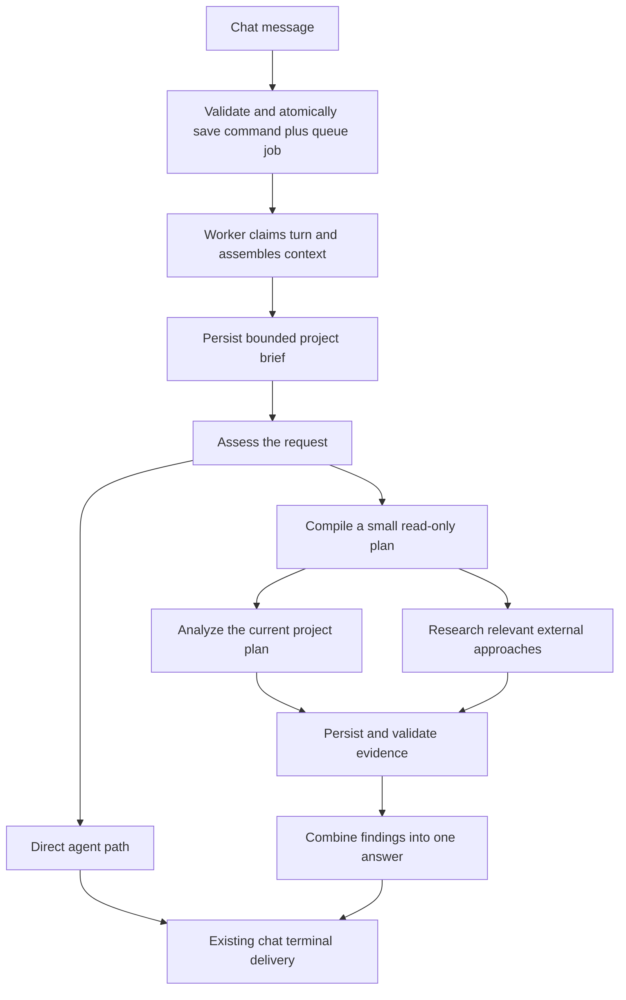

<!-- docs/archive/agentic-chat-djflow/djflow-architecture.md -->

# Chat-first orchestration: proposed architecture and implementation plan

Status: target architecture, 2026-09-12. A smaller runnable pilot now exists;
see [prototype behavior, limits, and local testing](./djflow-prototype.md).
The current [build list](./djflow-build-list.md) orders the next changes, including
streamed synthesis, earlier progress, lightweight submission, restart recovery,
and ordinary-chat integration. Its status distinguishes completed work from proposals.
The checkpoint, cost-reservation, worker-owned admission, and web-research guarantees
below remain proposed. The pilot brings a bounded planner and two saved-context
specialists forward while retaining the existing admission contract.
Companion to [the architecture assessment](./djflow-review.md)
and [DJ's original notes](./djflow.md).

## 1. The decision

Build a bounded workflow inside the existing chat worker. One submitted message
creates one durable chat turn. The worker assembles context, handles the request
directly or runs a small plan, and produces one final answer in the same chat.

**First workflow: two read-only specialists, one queue job, persisted step results.**
Both specialists can run in the same worker process, with separate model contexts.
Multiple agents do not require multiple queue jobs. A restarted read-only workflow
can load completed steps and retry unfinished work within its remaining limits.

This narrows the earlier review's generic scheduler recommendation. For a short,
two-specialist workflow, independently queued children and a coordinator queue add
failure boundaries before they add needed capability. Introduce them when work must
release the parent worker slot, last beyond a bounded invocation, or scale independently.

The first version intentionally holds one chat-worker slot while it executes. It
must prove acceptable latency for other chat requests before a broader rollout.
The current consumer defaults to one turn at a time, with a reviewed maximum of two;
two specialists inside a turn do not create more chat-turn capacity.

| Decision                 | Proposed first version                                                   |
| ------------------------ | ------------------------------------------------------------------------ |
| Entry point              | Existing chat send and worker transport                                  |
| Durable request identity | Existing `chat_turn_runs.id`                                             |
| Context owner            | Worker, through a portable context service                               |
| Workflow ownership       | One queued chat turn; bounded in-process execution                       |
| Agent behavior           | One reusable step runner with narrow capability configurations           |
| Initial plan             | Fixed two-specialist plan; model-authored plans come after proof         |
| Domain permissions       | Read-only for workflow steps, including synthesis                        |
| Persistence              | Immutable input artifact, plan, step checkpoints, dispatch-cost receipts |
| Delivery                 | Existing chat progress/reconciliation and one terminal answer            |
| Initial audience         | Explicit internal pilot cohort                                           |

No project-loop migration, general agent hierarchy, scheduling product, or autonomous
domain writes is required to prove this version.

## 2. The first user experience and workflow

Use a concrete request such as:

> Given the current Cedar House launch plan, research relevant launch approaches
> and recommend the three changes that would make the biggest difference.

The user stays in chat. A compact activity block shows actual persisted progress:

```text
Preparing a recommendation
  Completed: gathered your project brief
  Working: reviewing the current plan
  Working: researching relevant approaches

Stop                                        Show details
```

The final message names the recommendations, explains their connection to the
project, cites the supporting evidence, and identifies missing information.
Recommending a change does not claim the change has been applied.



The shared brief precedes both investigations. The external researcher needs the
project's constraints before choosing useful research. Its public search queries
must pass the existing private-content egress checks; access to a project is not
permission to send all of it to search providers.

Start with two capabilities:

- **Project analyst:** scoped project reads; identifies constraints, gaps, and current
  commitments. Returns evidence references and findings.
- **Researcher:** web search and page retrieval under existing egress and URL-safety
  controls; returns sourced findings, qualifications, and alternatives.

Context assembly is deterministic application code. Synthesis is one final model
pass over accepted results. Neither needs its own autonomous agent persona.

If scope is ambiguous before execution, use the current clarification behavior.
If evidence is missing during the first pilot, return an honest partial result.
Parking a run for a later answer is a later milestone, not an implicit promise of v1.

## 3. Request admission and context ownership

### The boundary we are changing

Today the web route prepares history, context, tools, and the prompt before calling
`create_agentic_chat_turn_with_job`. That RPC requires the prepared artifact, and
the worker's input loader expects it. Moving context is therefore a versioned
admission/input change, not moving a function call after `enqueue`.

Keep authentication, initial scope authorization, attachment-reference validation,
rate limits, and server-owned capability decisions at admission. Move project
context retrieval, prompt assembly, and context compaction into the worker.

The initial pilot supports project-scoped text requests. Other contexts and media
continue through their supported path until the worker-context service has parity.
Web-owned integration discovery remains a trusted server input until portable.

### Proposed command contract

The browser submits message text, session/context references, and its existing
idempotency identifiers. It cannot submit an authoritative user ID, permission
grant, tool list, plan, budget, or workflow-enable flag.

The server persists a versioned command containing:

```ts
type AdmittedChatCommand = {
	version: 'chat_command_v2';
	turnId: string;
	sessionId: string;
	userMessageId: string;
	userId: string; // authenticated server identity
	message: string;
	projectId: string;
	historySnapshot: FrozenHistory; // bounded raw history, before this message
	contextCacheRef: string | null; // optional optimization
	authorityRef: string; // server-owned, versioned policy record
	policyVersion: string;
};
```

`authorityRef` denotes trusted persisted policy, not necessarily a new table: the
existing authenticated admission payload can hold the versioned policy envelope.

The admission transaction creates or resolves the session, freezes a bounded raw
history snapshot, saves the user message and command, creates the queued turn, and
inserts its queue job. Duplicate submissions return the same identity. The frozen
history must be small; it contains no assembled project prompt or model summary.
This preserves the triggering conversation even if a queued request starts later.

Use a new admission contract for worker-prepared input. The current writer uses
`agentic_chat_input_v3` with retained v2 readers. Introduce a distinct v4 request
artifact that contains the admitted request, bounded history, and server-owned policy,
but no prepared model prompt. Keep the existing non-null artifact identity at claim:
it identifies a durable request even while project context is pending. This revises
the earlier nullable-artifact proposal and avoids weakening the general admission
completeness check. Never fabricate an empty v2/v3 prepared artifact.

The worker input type must distinguish prepared ordinary-chat input from an unprepared
workflow request. Only the workflow runner may consume the latter; the direct provider
must reject it. Update SQL version/shape constraints, hashing, lifecycle event handling,
and worker validation together. Deploy compatible readers before enabling the new writer.
The request hash must bind review intent and policy-relevant scope; a repeated client
turn ID with different intent must conflict rather than silently changing modes.

### What the worker does

1. Claim the turn and publish “Gathering project context” through the existing
   durable progress channel. Context loading gets an explicit bounded timeout.
2. Recheck current scope access. Load a compact project overview, relevant records,
   and the frozen history. Record versions/timestamps for the context actually read.
3. Use a valid context-cache reference when available. A miss or stale cache takes
   the ordinary context-load path. Caching does not grant permission or choose tools.
4. Construct and persist an immutable prepared-context checkpoint tied to the admitted
   request hash. Accept it in a short transaction conditional on current ownership.
   A retry reuses that context; it never mutates or replaces the admitted request artifact.
5. Build the provider request from the accepted context. Model dispatch requires both
   the execution fence and a durable dispatch reservation. Context usage is published
   after context exists; pending preparation must not report a fabricated token estimate.

Only the workflow preparation state permits a missing prepared context. Model execution
cannot begin until that context has been committed and validated. The admitted request
always exists. Step evidence records later discoveries separately from the frozen context.

Extract portable context assembly behind a service boundary. The worker must never
import SvelteKit routes, `$lib` aliases, or web application source. Web and worker
can supply authenticated data-access ports to the same assembly logic.

## 4. Components and interfaces

| Component             | Owns                                                                   | Does not decide                                           |
| --------------------- | ---------------------------------------------------------------------- | --------------------------------------------------------- |
| Admission adapter     | Identity, initial authority, command persistence, duplicate handling   | Model reasoning or specialist selection                   |
| Context service       | Bounded history/project context, freshness, immutable input            | Whether to create tasks or spend on a workflow            |
| Acting provider       | Answer, clarify, or propose work using available capabilities          | Permission grants, spending ceilings, execution ownership |
| Workflow runner       | Dependencies, step checkpoints, limits, completion                     | Unbounded replanning or business-domain mutations         |
| Step runner           | Bounded model/tool loop with a specific assignment                     | Other agents' transcripts or new child agents             |
| Cost adapter          | Atomic dispatch reservation, actual/uncertain exposure, reconciliation | User-facing product pricing                               |
| Chat delivery adapter | Ordered progress, reconnect snapshot, final answer                     | Whether a failed investigation counts as success          |

Use the experimental orchestrator's contracts and pure validation where they fit.
Do not import its in-memory engine as if it already supplied durable recovery, or
adopt its fixed-topology route heuristics as the production routing policy.

### Model-facing plan

```ts
type WorkPlanProposal = {
	objective: string;
	steps: Array<{
		key: string;
		capability: 'project_analysis' | 'web_research';
		objective: string;
		boundaries: string[];
		dependsOn: string[];
		expectedOutput: string;
		doneWhen: string[];
	}>;
};
```

The compiler binds exact input references, authoritative tools, budgets, and runtime
validators. It checks known capabilities, unique keys, acyclic dependencies, scope,
step limits, and deliverables. Labels derive from the validated assignments.

For the fixed pilot, code constructs this plan. Later, expose one worker control
such as `propose_workflow` on the eligible acting surface. The existing first pass
can propose it without an extra mandatory router call. Admission to the workflow
requires no domain mutation has been reserved or executed, and freezes the turn's
workflow path as read-only. A turn cannot run both paths concurrently.

Accept workflow control before final-answer text is committed. Opening activity can
use semantic progress events. If an ordinary answer has already started streaming,
finish that direct path rather than retracting it or replaying it as a workflow.

Once a valid plan is persisted, the acting loop hands control to the workflow runner
inside the same executor. It releases any model-capacity lease before children
request model capacity. The plan is an execution control, not a new user-visible
mode or a terminal “I'll do this later” answer.

### Runtime assignment and result

An assignment adds `turnId`, stable `stepId`, plan version/hash, input artifact IDs,
scope, allowed tools, limits, current execution generation, and cancellation signal.
The step runner returns a structured result with status, summary, evidence, unresolved
questions, and output. Runtime validation supplies the accepted completion verdict.

Source references must resolve to records read or pages actually retrieved. A valid
JSON result alone does not satisfy an assignment. A step's self-assessment is evidence
for the runtime, not authority to mark the whole request complete.

Parallel agents have separate message histories. Share only a compact brief and
explicit accepted results. Persisted tool/model observations carry step identity and
attempt identity so parallel calls cannot collide with ordinary per-turn round IDs.

## 5. Durable state and execution

### Proposed persistence delta

Keep the existing chat tables as the request, input, stream, and terminal authority.
Add two narrowly scoped tables for the bounded pilot, plus typed workflow metadata:

| Storage                            | Proposed contents                                                                                                                                                  |
| ---------------------------------- | ------------------------------------------------------------------------------------------------------------------------------------------------------------------ |
| `chat_turn_runs` extension         | Input-preparation mode; workflow version, phase, frozen plan/hash, fixed run deadline, terminal outcome in a versioned bounded metadata field                      |
| `chat_turn_input_artifacts`        | Existing immutable input store, attached after preparation for v2 turns                                                                                            |
| **New `chat_turn_workflow_steps`** | Turn ID, plan version, step key, compiled assignment, dependencies, status, attempt counter, claiming generation, bounded accepted result/evidence and result hash |
| **New `chat_turn_cost_entries`**   | Turn/step identity, unique dispatch-attempt key, reserved amount, actual amount, provider receipt, reconciliation state                                            |
| Existing events/stream state       | Workflow progress projection; reuse ordered delivery and reconcile snapshots                                                                                       |
| Existing model/tool observations   | Add step/attempt correlation where needed; retain prompts, calls, timing, and usage under the same privacy/retention rules                                         |

These names and fields are proposed, not existing schema. Migration review must
verify current constraints, generated types, grants, RLS, and retention/deletion paths.
Derive ownership from the parent turn and enforce it in access and mutation RPCs.

One step row is unique per `(turn_id, plan_version, step_key)`. Checkpoints hold one
accepted result; attempt receipts live in the cost/observation records. Cap each
result at 128 KiB for the pilot and keep context summaries smaller. Large documents
and a general artifact repository are outside this slice.

The Agent Run cost ledger has foreign keys to `agent_runs`. Do not manufacture
headless runs to satisfy those keys. Reuse its calculation and reconciliation logic
through a cost interface, with a chat-owned persistence adapter. Broader accounting
unification can follow proven parity; it is not a prerequisite for the pilot.

### Execution and failure rules

The turn retains its current transport statuses: queued, running, completed, failed,
cancelled. Workflow phase is separate: preparing, assessing, executing, synthesizing,
finished. A delivered answer may have outcome `partial`; its terminal metadata and UI
must distinguish that from a fully satisfied objective. Delivery completion and outcome
quality are separate. Preserve existing direct-turn meanings and terminal validation.

The bounded runner repeats these operations:

1. Read durable plan and accepted results; determine dependency-ready steps in code.
2. Claim up to two steps under the current turn generation using a short transaction.
3. Execute outside the transaction, with per-call cost reservation and shared limits.
4. Commit the accepted result, its status, and progress event together, checking the
   current turn owner, step attempt, plan hash, and cancellation state.
5. When investigations settle, run synthesis once and checkpoint its final text before
   terminal delivery. Re-delivery reuses that text rather than regenerating the answer.

Synthesis is a runtime-owned checkpointed step with no domain tools. There is one
terminal writer. Specialist prose never directly appends to the assistant's answer.
The pilot can buffer final synthesis before delivery to avoid duplicate partial text
across retries; progress remains visible while the answer is being prepared.

| Situation                                | Required behavior                                                                                               |
| ---------------------------------------- | --------------------------------------------------------------------------------------------------------------- |
| Duplicate queue delivery                 | Existing queue/turn claim plus step ownership checks allow one accepted execution                               |
| Worker dies after a step completed       | Reclaim the read-only turn; reuse its accepted result                                                           |
| Worker dies during a step                | Preserve prior cost exposure; retry only unfinished work within durable attempt/call/cost limits                |
| A late worker returns                    | Commit fails if generation, attempt, plan, or cancellation no longer matches                                    |
| Required dependency fails                | Mark dependent work skipped or blocked by failure; never invent its input                                       |
| One independent investigation is partial | Synthesize only supported findings, explicitly naming missing coverage                                          |
| No useful evidence survives              | Deliver a clear failure/limitation through the supported terminal path                                          |
| User stops                               | Fence future dispatch and commits, cancel in-flight calls, terminalize once; reconcile already-incurred charges |
| Browser disconnects                      | Work continues within limits; reconnect reads durable projection and eventual terminal state                    |
| Terminal write response is lost          | Reconcile persisted terminal truth; do not emit another answer                                                  |

This requires a new, explicitly read-only recovery policy. The existing chat recovery
RPCs and input loader must agree with it. A workflow metadata flag alone cannot
override an irreversible-effect boundary. Recovery eligibility requires persisted,
enforced read-only authority and no domain effects; ordinary mutation recovery keeps
its existing policy.

Requeueing and changing recovery state happen in the same database transaction,
using the existing database queue. Reuse only accepted step results. An unfinished
step restarts its bounded investigation; it does not resume an unrecorded model
conversation. Lost provider calls can still cost money and must remain visible as
uncertain exposure.

## 6. Budget, concurrency, and responsiveness

These are initial pilot limits, not measured performance claims or customer pricing:

| Limit                   | Proposal                                                                                |
| ----------------------- | --------------------------------------------------------------------------------------- |
| Specialist concurrency  | At most two per turn; lower when shared capacity is unavailable                         |
| Plan size               | Fixed two investigations plus synthesis; later at most four specialist steps            |
| Step model rounds       | At most four per investigation across retries                                           |
| Tool calls              | At most eight per investigation and sixteen across both, including retries              |
| Step execution attempts | At most two; parent replay does not reset counters                                      |
| Workflow cost           | Configured internal cap, initially $0.25 per turn including all passes and paid tools   |
| Synthesis headroom      | Reserve 20% of the turn cost cap; stop new research in time to produce a result         |
| Worker invocation       | At most the existing configured provider/worker deadlines                               |
| Whole workflow lifetime | Proposed 15 minutes from first execution, persisted once; allows bounded crash recovery |
| Provider call           | At most 60 seconds and always less than remaining invocation/run time                   |

The current defaults are a 300-second provider budget, 360-second worker timeout,
and 420-second stall threshold. Recovery can therefore take minutes. Preserve the
ordinary timeout policy; report actual detection and recovery time in the pilot.
The persisted lifetime is never restarted when a worker retries. Reserve finalization
time within each invocation; a model-free partial summary is the final fallback.

Reserve each dispatch atomically against the turn's remaining budget, including the
opening assessment, repairs, synthesis, provider retries, and paid search calls. A
step allocation is a spending ceiling, not another charge or duplicate reservation.
Uncertain prior charges stay held until reconciled. Actual overruns are recorded and
stop additional spending; the design does not claim that estimates prevent every overrun.

Metering and customer billing remain distinct. The new ledger protects execution
spend; consumption receipts must be idempotent and must not double-charge usage
already recorded by existing model/tool billing.

Bound concurrency across nested work: two agents must not each open four tool calls
and four provider calls unconstrained. Use shared per-turn tool limits and a common
provider-call admission limit. The current provider-capacity class is local and tied
to the reviewed chat concurrency; it is not a distributed specialist scheduler.

Release a parent's provider lease before specialist dispatch. For the internal pilot,
never bypass the existing process-wide cap; if another turn occupies a provider slot,
specialists may execute serially. Add a bounded abortable wait/fairness policy rather
than treating ordinary saturation as provider failure. Restrict pilot workflow admission
across workers by a database-owned user/cohort limit. A later multi-replica rollout must
prove shared capacity enforcement and direct-chat latency before widening concurrency.

## 7. Implementation sequence and completion criteria

Each packet below is a reviewable change set. Do not stack runtime packets across a
failed required gate. Keep the first deliverable small enough to inspect in chat.

| Packet                             | Deliverable                                                                                                              | Completion evidence                                                                                                                                                           |
| ---------------------------------- | ------------------------------------------------------------------------------------------------------------------------ | ----------------------------------------------------------------------------------------------------------------------------------------------------------------------------- |
| **0. Baseline and fixtures**       | A fresh request set, input snapshots, direct-path measurements, and isolated test setup                                  | Current `pnpm agentic:gate` result preserved; fixed workflow input/output oracle written; no claim that old July scores represent today's runtime                             |
| **1. Worker-owned context**        | Versioned command/admission/input contract for project text; shared context assembly; visible context progress           | Same accepted context and supported behavior on cache hit/miss; duplicate send creates one turn; crash before artifact attachment is recoverable; direct path passes the gate |
| **2. Fixed workflow with fakes**   | Step schema/store, pure scheduler, checkpointed synthesis, existing progress projection; internal-only fixed-plan switch | Fake steps prove parallel execution, dependency failure, cancellation, stale-result rejection, one final answer, and completed-step reuse without paid model calls            |
| **3. Metering and recovery**       | Chat cost adapter, durable limits, read-only replay, concurrency admission, retention/deletion rules                     | Reservation races cannot oversubscribe a turn; unknown charges survive restart; one completed step is not rerun; deployed worker restart reports real recovery latency        |
| **4. Two real specialists**        | Project analyst and web researcher using the same bounded runner and existing trusted read adapters                      | Evidence resolves; one combined answer; no domain writes; current gate passes; side-by-side evaluation and contention measurements captured                                   |
| **5. Bounded model planning**      | Acting control proposes plans; compiler validates; safe direct path remains available                                    | Fresh direct/ambiguous/complex cases select useful behavior; no extra mandatory router pass; one bounded plan repair; failed planning does not trigger duplicate execution    |
| **6. Resume and proposed changes** | A separately versioned waiting/input contract, then proposed-change integration                                          | Correct question/answer binding, no repeated successful work, current-permission checks, and the existing reviewed mutation gates preserved                                   |

Packet 4 is the first real multi-agent milestone. Packet 5 adds planned decomposition.
Packet 6 expands the lifecycle and mutation scope only after that result is useful.
Packet 2's fake-only path remains unavailable for ordinary production requests.

### Test and evaluation plan

Start with ten fresh scenarios: six complex read/research requests, two simple direct
questions, one ambiguous-scope request, and one edit request that must retain the
existing reviewed path. Repeat each three times. Compare complex cases against a
working single-agent baseline using matched context, tool access, models, and limits;
also retain the end-to-end current-chat comparison. Report both scenarios and repetitions
so thirty runs are not mistaken for thirty independent problems.

Keep these separate:

- **Correctness:** required deliverables, grounded project references, citations,
  truthful partial results, no unauthorized writes, no duplicate final answers.
- **Reliability:** lifecycle fault matrix above, actual restart recovery, deterministic
  cost/capacity races, reconnect and cancellation.
- **Value:** useful-result latency, direct-chat contention, model/tool cost, repeated
  evidence collection, unnecessary questions, outcome quality.

Proposed pilot decision rule: require all lifecycle/authority checks, unchanged
correctness for direct/edit controls, and at least five of six complex scenarios
meeting their required outcomes on every repetition. Expand only if the workflow
also improves useful outcomes or meaningfully reduces latency at an acceptable cost.
Use 2x mean baseline cost and a 20% median latency reduction as initial comparison
targets, not a reason to hide failures; a quality-driven exception needs its concrete
improved outcomes and measured cost written into the decision record. A small pilot
is evidence for the next experiment, not proof of broad generalization.

Run the narrowest relevant tests under the repository's `test-gate` limits. After
each runtime Agentic Chat change set, run `pnpm agentic:gate` and preserve its scorecard.
Missing isolated database or Calendar connection is a blocked/failed gate. Svelte
edits require the web check specified by `apps/web/AGENTS.md`. This document runs no
model evaluation, changes no code, and claims no test pass.

## 8. Code boundaries, rollout, and later expansion

### Implementation map

| Existing area                                                                       | Planned change                                                                                                                              |
| ----------------------------------------------------------------------------------- | ------------------------------------------------------------------------------------------------------------------------------------------- |
| `apps/web/src/routes/api/agent/v2/turns/` and worker admission/preparation services | Select server-authorized v1/v2 admission; remove heavy context preparation only for supported v2 requests                                   |
| `packages/shared-types/src/agentic-chat-worker-contract.ts`                         | Versioned command/input and workflow projection contracts; explicit partial outcome; step/attempt correlation                               |
| `packages/agentic-chat-runtime`                                                     | Portable context assembly with injected access ports, if its package boundary remains suitable                                              |
| `packages/agent-orchestrator/src/contracts/` and pure compilation functions         | Reuse dependency/result validation; keep eval harnesses out of production imports                                                           |
| `apps/worker/src/workers/agentic-chat/turn/execution-input.ts`                      | Load command first; prepare and attach immutable input when pending                                                                         |
| `turn-executor.ts`, `executionControl.ts`, `stalledRecovery.ts`                     | Compose workflow execution and enforce the new read-only checkpoint recovery contract                                                       |
| **Proposed `agentic-chat/workflow/`**                                               | Small runner, compiler adapter, step store, capability registry, cost adapter; avoid growing the main executor with agent-specific branches |
| Existing provider and read-tool adapters                                            | Reuse transport, URL safety, private-data egress, access checks, compaction; add scoped execution identity and shared capacity              |
| `streamPublisher.ts` and stream reconciliation                                      | Project checkpointed work status; one terminal writer; recover accepted output                                                              |
| Chat activity/message UI                                                            | Render one activity block from durable projection; Stop, reconnect, details                                                                 |
| Supabase migrations and generated types                                             | Versioned atomic admission, context attachment, step claim/commit, cost reserve/settle, read-only recovery                                  |

The proposed store API stays small: `attachInput`, `installPlan`, `claimStep`,
`commitStepResult`, `reserveDispatch`, `settleDispatch`, and `recoverReadOnlyTurn`.
These are conceptual operations, not seven required services. Transactional database
operations receive trusted identities and validate ownership internally.

### Rollout and retirement

Persist execution/contract version at admission. Ship readers and recovery support
before admitting the new version. Use independent internal flags for worker context,
fixed workflows, and model planning so each packet has a measurable effect.

Turning a flag off stops new admissions to that feature; active versioned work finishes
or is explicitly cancelled through its own lifecycle. Never route a half-executed
workflow back to the ordinary acting path. Old and new input versions coexist until
their jobs and retention windows drain. Remove obsolete web context preparation only
after all supported request types have parity and evidence of use confirms retirement.

The old unused supervisor, Project Loops, headless Agent Runs, and historical evals
are not prerequisites to delete. Preserve the active terminal-text guard and reviewed
mutation policy. Delete only superseded pieces within a proven migration boundary.

### How this grows after the pilot

**Resumable input:** add a durable question with turn ID, plan version, question ID,
expiry, and answered-by message ID. A versioned waiting state releases worker capacity.
Answering atomically records the input and queues continuation of the same objective.
Update active-turn conflict rules so this answer is accepted as a continuation. General
steering and unrelated new messages need explicit routing; do not silently blend them
into an old input snapshot. No `done` event represents unresolved waiting as success.

**Proposed changes:** a read-only workflow produces a proposal artifact. A separate
commit boundary resolves current entity versions, rechecks authority, and binds review
to the exact operations and content hash. Commit uses stable effect identities and the
existing reviewed mutation path. User approval is required where policy or the request
requires it; independent model review is not itself user authorization.

**Independent child jobs:** when measurements show slot occupancy or workflow duration
is the limiting factor, keep the step contract and replace the local execution driver
with step jobs plus short coordinator ticks. Step completion and coordinator wake-up
commit atomically. A waiting coordinator owns no execution slot. This expansion also
needs versioned claim, stream-authority, recovery, and cancellation contracts; it is
not achieved by only changing the queue adapter.

**Additional entry points:** reuse proven execution contracts only after chat works.
Scheduled project reviews can supply a different delivery/interaction policy later.
Their migration should have its own cost, freshness, and user-value evaluation.

The immediate implementation target is **Packet 1: one accepted project-chat message,
context prepared by the worker, and a correct visible answer through the existing chat
delivery contract.** The fixed two-specialist workflow builds directly on that boundary.
