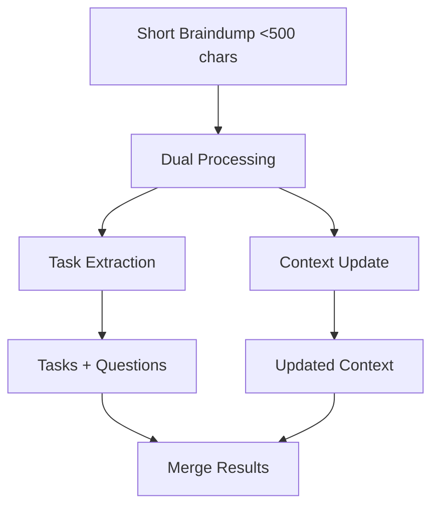

# Existing Project - Short Braindump Prompt (<500 chars)

## Overview

Short braindumps (<500 chars) for existing projects trigger **dual processing mode**, which runs two separate prompts:

1. **Task Extraction** - Extract tasks and generate questions
2. **Context Update** - Update project context if needed

## Processing Flow

## Prompts Used

### Part 1: Task Extraction

See `/docs/prompts/dual-processing/dual-processing-task-extraction.md`

### Part 2: Context Update

**For dual processing**: See `/docs/prompts/dual-processing/dual-processing-context-update.md`
**For stream processing**: See `/docs/prompts/existing-project/existing-project-short-context-update.md`

## Key Characteristics

- **Parallel Execution**: Both prompts run simultaneously for existing projects
- **Question Generation**: Only happens in task extraction
- **Context Decision**: Context update may return null if no update needed
- **Threshold-Based**: Automatically triggered for short content
