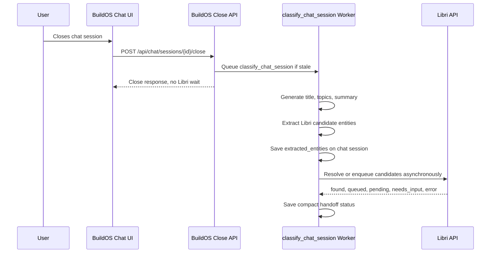

<!-- docs/integrations/libri/session-synthesis-entity-handoff.md -->

# BuildOS Libri Session Synthesis Entity Handoff

Date: 2026-04-15
Status: BuildOS slice implemented; real Libri smoke pending environment wiring
Audience: Agents working in BuildOS and Libri

## Progress Update: 2026-04-15

BuildOS-side session synthesis handoff work is implemented in
`/Users/djwayne/buildos-platform` and the Supabase migration has been applied.

Implemented:

- Added nullable `chat_sessions.extracted_entities` JSONB storage via
  `supabase/migrations/20260429000005_add_chat_session_extracted_entities.sql`.
- Updated shared database/session types for `extracted_entities` and the
  `SessionExtractedEntities` contract.
- Extended `apps/worker/src/workers/chat/chatSessionClassifier.ts` so
  classification now asks for title, topics, summary, and Libri entity
  extraction.
- Included source message IDs and turn indices in the classifier prompt input.
- Added fallback and insufficient-message extraction output with an empty
  `libri_candidates` array.
- Added sanitizer/canonicalization helpers in
  `apps/worker/src/workers/chat/libriSessionEntities.ts`.
- Added a worker-side Libri batch handoff client in
  `apps/worker/src/workers/chat/libriEntityHandoffClient.ts`.
- Calls `POST /api/v1/entity-handoffs` with
  `Idempotency-Key:
buildos-session-entity-handoff:<sessionId>:<stable-entity-hash>`.
- Stores compact handoff status under
  `chat_sessions.agent_metadata.libri_handoff` using the existing metadata merge
  RPC.
- Keeps Libri disabled/unavailable/API errors non-fatal after the session
  synthesis save.
- Updated the close API to queue classification for sessions that have older
  title/summary synthesis but no `extracted_entities` artifact.

Verification run:

- `pnpm --filter=@buildos/worker test:run tests/chatSessionLibriEntities.test.ts tests/libriEntityHandoffClient.test.ts tests/chatSessionClassifierLibri.test.ts`
  passed.
- `pnpm --filter=@buildos/worker typecheck` passed.
- `pnpm --filter=@buildos/worker lint` passed.
- `pnpm --filter=@buildos/shared-types typecheck` passed.

Current blocker:

- BuildOS local `.env` does not yet have `LIBRI_INTEGRATION_ENABLED`,
  `LIBRI_API_BASE_URL`, or `LIBRI_API_KEY` configured, so a real handoff smoke
  cannot run from BuildOS yet.

Libri-side status observed locally:

- `/Users/djwayne/Desktop/book-pics/library-app/convex/http.ts` now routes
  `POST /api/v1/entity-handoffs`.
- `/Users/djwayne/Desktop/book-pics/library-app/convex/resourceResolver.ts`
  includes batch handoff/resource request/ingestion job behavior.
- `/Users/djwayne/Desktop/book-pics/library-app/convex/lib/entityHandoffs.ts`
  accepts the shared entity field shape and normalizes people, books, YouTube
  videos, and YouTube channels.

Next recommended work:

1. Complete the BuildOS hardening milestone in
   `docs/integrations/libri/buildos-hardening-next-milestone.md`.
2. Configure BuildOS worker env with `LIBRI_INTEGRATION_ENABLED=true`,
   `LIBRI_API_BASE_URL`, and `LIBRI_API_KEY` scoped for `search:all` and
   `queue:ingestion`.
3. Run the shared fixture through a real closed-session smoke and verify
   `chat_sessions.extracted_entities` plus
   `chat_sessions.agent_metadata.libri_handoff`.
4. Rerun classification for the same session and confirm the idempotency key is
   stable and Libri returns `found` or `pending`, not duplicate `queued`.
5. Add admin visibility for extracted entities and handoff status, plus a manual
   retry action for failed/not-configured handoffs.

## Parallel Agent Handoffs

Use these two implementation handoffs for parallel work:

- `docs/integrations/libri/buildos-session-synthesis-agent-instructions.md`
  for the BuildOS-side agent.
- `/Users/djwayne/Desktop/book-pics/library-app/docs/BUILDOS_ENTITY_HANDOFF_AGENT_INSTRUCTIONS.md`
  for the Libri-side agent.

## Direction Update

Do not implement "BuildOS: Add Libri Turn Routing" as a hard-coded turn router.

BuildOS should not scan every live chat turn with deterministic keyword rules and
force a Libri lookup whenever it sees a person, book, or YouTube mention. During
live chat, the BuildOS agent may use the Libri skill and Libri tools when it
judges that Libri is the right knowledge source. That remains agent-authored
tool use.

The systematic integration point for this round is session-close synthesis:
when a chat session closes, BuildOS already queues background chat analysis.
Extend that analysis to extract Libri-relevant entities and hand them to Libri
asynchronously. Libri owns resolving, deduping, and deciding whether to enqueue
research or ingestion.

## Goals

- Keep live chat behavior agent-directed, not keyword-routed.
- Extend BuildOS chat analysis with a structured `extracted_entities` field.
- Extract people, authors, books, YouTube videos, YouTube channels, and other
  clearly Libri-relevant resources from the closed session.
- Send extracted Libri candidates to Libri after synthesis, without blocking chat
  close or the user response.
- Let Libri return `found`, `queued`, `pending`, `needs_input`, or `error` for
  each entity.
- Store enough BuildOS-side status to audit what was sent and avoid duplicate
  handoffs from the same chat session.
- Preserve the separation of concerns: BuildOS captures session context and
  provenance; Libri owns library records and enrichment jobs.

## Non-Goals

- No deterministic "if name/book/video then call Libri" router in the live chat
  loop.
- No BuildOS-owned search-plus-enqueue compatibility flow for missing Libri
  records.
- No waiting for Libri enrichment jobs to finish.
- No automatic BuildOS ontology/project mutations from extracted entities.
- No mirroring full Libri research data into BuildOS.
- No sending every capitalized phrase or incidental mention to Libri.

## Current BuildOS Integration Points

The existing close path already gives this work a good seam:

- `apps/web/src/lib/components/agent/AgentChatModal.svelte`
    - `finalizeSession()` calls:
        - `POST /api/chat/sessions/{sessionId}/close`
        - fallback `POST /api/chat/sessions/{sessionId}/classify`
- `apps/web/src/routes/api/chat/sessions/[id]/close/+server.ts`
    - updates session context fields,
    - decides whether classification is stale,
    - queues `classify_chat_session`.
- `apps/web/src/routes/api/chat/sessions/[id]/classify/+server.ts`
    - explicitly queues `classify_chat_session`.
- `apps/web/src/lib/server/chat-classification.service.ts`
    - queues through the Railway worker when configured,
    - falls back to a direct `queue_jobs` insert.
- `apps/worker/src/workers/chat/chatSessionClassifier.ts`
    - generates `auto_title`, `chat_topics`, and `summary`,
    - updates `chat_sessions.last_classified_at`,
    - runs non-fatal post-classification processors for project activity, profile
      signals, and contact signals.

This round should extend the worker classification/synthesis path. The browser
close handler should remain small and fast.

## Desired Flow



## Live Chat Policy

Live chat keeps the current agent-discretion model:

- The base system should not include a hard-coded Libri router.
- The `libri_knowledge` skill can teach the agent when Libri is useful.
- `resolve_libri_resource` and `query_libri_library` remain normal tools the
  agent may choose.
- If the user asks about stable personal-library knowledge, the agent can call
  Libri.
- If the user asks for current facts, news, prices, laws, schedules, or other
  time-sensitive web knowledge, the agent can choose web search instead.

This is separate from session-close entity handoff. The handoff is background
library enrichment, not an answer-generation path.

## Session Synthesis Output

Add a structured `extracted_entities` field to the chat analysis result.

Recommended BuildOS storage:

- Add nullable `chat_sessions.extracted_entities` JSONB as the durable session
  analysis artifact.
- Keep handoff attempt/status data separately, either in:
    - `chat_sessions.agent_metadata.libri_handoff` for the first small slice, or
    - a dedicated `chat_session_entity_handoffs` table if retry/audit querying is
      part of the implementation slice.

Recommended shape:

```ts
type SessionExtractedEntities = {
	libri_candidates: ExtractedLibriEntity[];
	ignored_candidates?: IgnoredEntityCandidate[];
	extraction_version: 'libri_session_synthesis_v1';
	extracted_at: string;
};

type ExtractedLibriEntity = {
	entity_type: 'person' | 'book' | 'youtube_video' | 'youtube_channel';
	display_name: string;
	canonical_query: string;
	url?: string;
	youtube_video_id?: string;
	authors?: string[];
	aliases?: string[];
	confidence: number;
	relevance: 'primary' | 'supporting' | 'incidental';
	recommended_action: 'resolve_or_enqueue' | 'search_only' | 'ignore';
	user_requested_research: boolean;
	extraction_reason: string;
	source_message_ids: string[];
	source_turn_indices: number[];
	evidence_snippets: string[];
};

type IgnoredEntityCandidate = {
	display_name: string;
	reason: string;
	evidence_snippets?: string[];
};
```

Rules:

- Only `recommended_action: "resolve_or_enqueue"` candidates should be passed to
  Libri automatically.
- `search_only` is for entities the synthesis thinks might be useful to mention
  later, but should not start enrichment.
- `ignore` and `ignored_candidates` are for audit/debugging; they should not
  trigger Libri calls.
- Deterministic parsing is acceptable for canonicalization after extraction,
  such as normalizing a YouTube URL or trimming a title. Do not use deterministic
  parsing to decide whether the agent must call Libri.

## Extraction Prompt Requirements

The classifier/synthesis prompt should be expanded from title/topics/summary to
also produce `extracted_entities`.

The prompt should tell the model to include a Libri candidate only when:

- a person, author, thinker, creator, or public figure is explicitly discussed,
- a book title, ISBN, or title-plus-author is explicitly discussed,
- a YouTube URL, video title, channel, or creator is explicitly discussed,
- the entity was central enough that the user's future library should know about
  it,
- the user asked to analyze, add, research, preserve, or revisit the resource.

The prompt should tell the model to exclude:

- BuildOS project names, task names, internal documents, or teammates unless
  they are also public Libri resources,
- vague topics with no concrete entity,
- incidental examples that were not relevant to the session outcome,
- uncertain book titles without enough context,
- private contact details or user-private facts that should not become public
  library research targets.

The worker should preserve message IDs and short evidence snippets so Libri can
understand why BuildOS sent the candidate without receiving the entire chat.

## Libri Handoff Contract

Preferred Libri endpoint for this round:

```text
POST /api/v1/entity-handoffs
Authorization: Bearer <LIBRI_API_KEY>
Content-Type: application/json
Idempotency-Key: buildos-session-entity-handoff:<sessionId>:<hash>
```

Preferred request:

```json
{
	"source": {
		"system": "buildos",
		"reason": "session_close_synthesis",
		"sessionId": "buildos-chat-session-id",
		"contextType": "project",
		"projectId": "optional-project-id"
	},
	"entities": [
		{
			"entityType": "person",
			"displayName": "James Clear",
			"canonicalQuery": "James Clear",
			"confidence": 0.96,
			"evidenceSnippets": ["We discussed James Clear and Atomic Habits."]
		},
		{
			"entityType": "book",
			"displayName": "Atomic Habits",
			"canonicalQuery": "Atomic Habits James Clear",
			"authors": ["James Clear"],
			"confidence": 0.94,
			"evidenceSnippets": ["The user asked how Atomic Habits applies here."]
		}
	]
}
```

Preferred response:

```json
{
	"status": "accepted",
	"results": [
		{
			"entityType": "person",
			"canonicalQuery": "James Clear",
			"status": "found",
			"resourceKey": "person:james-clear",
			"job": null,
			"message": "Existing Libri person matched."
		},
		{
			"entityType": "book",
			"canonicalQuery": "Atomic Habits James Clear",
			"status": "queued",
			"resourceKey": "book:atomic-habits:james-clear",
			"job": {
				"jobId": "libri-job-id",
				"kind": "book.discovery",
				"status": "queued"
			},
			"message": "No existing Libri book record was found, so enrichment was queued."
		}
	]
}
```

If Libri does not add a batch handoff endpoint yet, BuildOS can call
`POST /api/v1/resolve` once per candidate as a compatibility step, but only for
types the resolver explicitly supports. BuildOS should not emulate missing book
or video resolver behavior by calling Libri ingestion endpoints directly.

Libri-side requirement:

- For each entity, Libri searches existing resources.
- If found, return `found`.
- If a matching request or job already exists, return `pending`.
- If missing and sufficiently clear, create a resource request or ingestion job
  and return `queued`.
- If ambiguous, return `needs_input`.
- Repeated BuildOS handoffs for the same session/entity must be idempotent.

## BuildOS Handoff Status

BuildOS should store compact status for observability and idempotency.

Minimum shape:

```ts
type LibriEntityHandoffStatus = {
	status: 'not_configured' | 'sent' | 'partial' | 'failed';
	attempted_at: string;
	idempotency_key: string;
	results: Array<{
		entity_type: ExtractedLibriEntity['entity_type'];
		canonical_query: string;
		status: 'found' | 'queued' | 'pending' | 'needs_input' | 'error';
		resource_key?: string | null;
		job_id?: string | null;
		message?: string;
	}>;
};
```

The first slice can keep this in `chat_sessions.agent_metadata.libri_handoff`.
If retries, dashboards, or admin filtering are in scope, use a dedicated table
with a unique key on:

```text
(session_id, target_system, entity_type, normalized_entity_key)
```

## Failure Handling

- Chat close must succeed even if Libri is disabled or unreachable.
- Classification should still save title/topics/summary if entity extraction or
  Libri handoff fails.
- Libri handoff failures are non-fatal worker warnings.
- Never expose `LIBRI_API_KEY` in logs, chat transcripts, tool outputs, or model
  prompts.
- If `LIBRI_INTEGRATION_ENABLED` is false, still save `extracted_entities` but
  mark handoff as `not_configured` or skip the handoff entirely.
- A duplicate close/classify for the same session must not create duplicate
  Libri jobs.

## BuildOS Implementation Plan

1. Rename the work conceptually from "Libri turn routing" to "Libri session
   synthesis entity handoff."
2. Add the `extracted_entities` contract to BuildOS shared/session types.
3. Add a Supabase migration for `chat_sessions.extracted_entities` JSONB, unless
   the implementation explicitly chooses an `agent_metadata` MVP.
4. Extend `ChatClassificationResponse` in
   `apps/worker/src/workers/chat/chatSessionClassifier.ts`.
5. Update the classification prompt to request title, topics, summary, and
   extracted Libri candidates.
6. Add sanitization for extracted entities:
    - limit candidate count,
    - clamp confidence,
    - trim evidence snippets,
    - remove unsupported entity types,
    - only pass `resolve_or_enqueue` candidates to Libri.
7. Save `extracted_entities` along with `auto_title`, `chat_topics`, `summary`,
   and `last_classified_at`.
8. Add a server/worker Libri handoff client that uses server-side Libri config.
9. Call Libri after the session update succeeds; treat the call as non-fatal.
10. Store compact handoff status.
11. Add tests for parsing, sanitization, idempotency, disabled config, and Libri
    response handling.

## Libri Implementation Plan

1. Add or expand a resolver-style endpoint that accepts people, books, YouTube
   videos, and YouTube channels from BuildOS.
2. Prefer a batch endpoint for session handoffs, because one chat can mention
   several resources.
3. Normalize each entity into a deterministic resource/request key.
4. Search existing Libri tables first.
5. Check existing resource requests and ingestion jobs before creating new ones.
6. Queue enrichment only when the candidate is clear enough.
7. Return structured per-entity statuses.
8. Store BuildOS source provenance in a sanitized allowlist:
    - `system`,
    - `sessionId`,
    - `contextType`,
    - `projectId`,
    - `reason`,
    - compact evidence snippets.

## First Test Milestone

The first milestone should be a session-close vertical slice with mocked Libri,
then a real Libri smoke test.

Test conversation:

```text
User: I am thinking about James Clear and Atomic Habits for this project.
User: Also remind me to process this video: https://www.youtube.com/watch?v=dQw4w9WgXcQ
Assistant: ...
```

Expected BuildOS behavior:

- Closing the chat queues `classify_chat_session`.
- The worker saves normal title/topics/summary.
- The worker also saves `extracted_entities.libri_candidates` with:
    - `person`: James Clear,
    - `book`: Atomic Habits,
    - `youtube_video`: the YouTube URL/video ID.
- No live-turn hard-coded Libri router is involved.
- BuildOS sends eligible candidates to Libri asynchronously.
- Libri returns per-entity `found`, `queued`, or `pending`.
- BuildOS stores compact handoff status.
- Re-running close/classification for the same session does not duplicate Libri
  jobs.

Reevaluate after this milestone before adding UI, external-agent gateway
behavior, richer sync, or broader Libri research automation.

## Acceptance Criteria

- BuildOS chat close remains fast and does not wait on Libri enrichment.
- The session analysis artifact includes `extracted_entities`.
- Libri receives only model-selected, high-confidence Libri candidates.
- Books and YouTube resources are not dropped from the extraction contract, even
  if Libri needs endpoint work before it can resolve them.
- BuildOS does not implement Libri's resolver semantics itself.
- Duplicate session close/classify attempts are idempotent.
- Existing live chat Libri tool use remains agent-directed.
- No Libri credentials are exposed to the browser or model-visible text.
