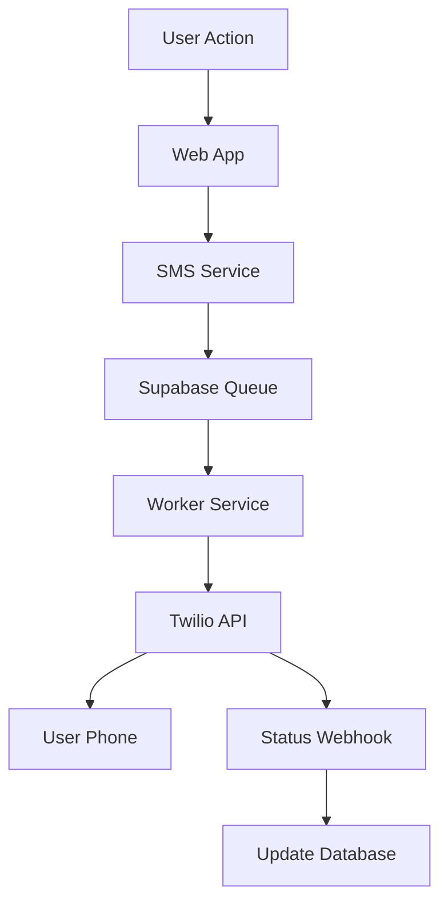

<!-- docs/integrations/twilio/README.md -->

# SMS Integration Documentation

## Overview

BuildOS includes a comprehensive SMS notification system powered by Twilio that enables real-time text message notifications for tasks, daily briefs, and urgent alerts. The integration follows a queue-based architecture for reliability and scalability.

## Architecture



### Key Components

1. **Twilio Service Package** (`packages/twilio-service/`)
    - `TwilioClient`: Wrapper around Twilio SDK
    - `SMSService`: Business logic for SMS operations
    - Template rendering and message formatting
    - Phone number formatting and validation

2. **Database Tables**
    - `sms_templates`: Reusable message templates
    - `sms_messages`: Message history and status tracking
    - `user_sms_preferences`: User notification settings
    - Integration with existing `queue_jobs` table

3. **Worker Integration** (`apps/worker/src/workers/smsWorker.ts`)
    - Processes SMS jobs from queue
    - Handles retries with exponential backoff
    - Updates message status in real-time

4. **Web App Integration**
    - Frontend SMS service (`apps/web/src/lib/services/sms.service.ts`)
    - Phone verification components
    - SMS preferences UI
    - API endpoints for verification and webhooks

## Features

### 🔐 Phone Verification

- Secure phone number verification using Twilio Verify
- One-time codes sent via SMS
- Prevents duplicate phone numbers across users
- Required before enabling SMS notifications

### 📱 Notification Types

- **Calendar Event Reminders**: Automated reminders for calendar events (working feature)
- **Daily Brief Notifications**: Alert when AI-generated brief is ready (via notification system)
- **Morning Kickoff**: Start your day with a summary (future feature - UI ready)
- **Evening Recap**: End of day recap (future feature - UI ready)
- **Custom Messages**: Support for ad-hoc SMS sending

**Note**: Daily brief SMS is now managed through the unified notification system (`user_notification_preferences.should_sms_daily_brief`), not via SMS preferences.

### ⚙️ User Preferences

- Enable/disable specific notification types
- Quiet hours configuration (no messages during sleep)
- Daily SMS limits to prevent spam
- One-click opt-out support
- Timezone-aware scheduling

### 🔄 Reliability Features

- Queue-based processing for guaranteed delivery
- Automatic retry with exponential backoff
- Delivery status tracking via webhooks
- Failed message recovery
- Rate limiting support

### 📝 Template System

- Reusable message templates with variables
- Dynamic content rendering
- Character limit enforcement (160 chars)
- Usage tracking and analytics
- Admin-only template management

## Database Schema

### SMS Templates Table

```sql
sms_templates
├── id (UUID, PK)
├── template_key (VARCHAR, UNIQUE)
├── name (VARCHAR)
├── message_template (TEXT)
├── template_vars (JSONB)
├── is_active (BOOLEAN)
└── usage_count (INTEGER)
```

### SMS Messages Table

```sql
sms_messages
├── id (UUID, PK)
├── user_id (UUID, FK)
├── phone_number (TEXT)
├── message_content (TEXT)
├── status (ENUM: pending|queued|sent|delivered|failed)
├── priority (ENUM: low|normal|high|urgent)
├── twilio_sid (TEXT)
├── attempt_count (INTEGER)
└── queue_job_id (UUID, FK)
```

### User SMS Preferences Table

```sql
user_sms_preferences
├── id (UUID, PK)
├── user_id (UUID, FK, UNIQUE)
├── phone_number (TEXT)
├── phone_verified (BOOLEAN)
├── phone_verified_at (TIMESTAMP)
├── event_reminders_enabled (BOOLEAN)        -- Calendar event reminders (working)
├── event_reminder_lead_time_minutes (INT)
├── morning_kickoff_enabled (BOOLEAN)        -- Future feature
├── morning_kickoff_time (TIME)
├── evening_recap_enabled (BOOLEAN)          -- Future feature
├── quiet_hours_start (TIME)
├── quiet_hours_end (TIME)
├── opted_out (BOOLEAN)
├── opted_out_at (TIMESTAMP)
├── opt_out_reason (TEXT)
├── daily_sms_limit (INTEGER)
├── daily_sms_count (INTEGER)
└── daily_count_reset_at (TIMESTAMP)
```

**DEPRECATED FIELDS** (removed as of 2025-10-29):

- `daily_brief_sms` - Replaced by `user_notification_preferences.should_sms_daily_brief`
- `task_reminders` - Never implemented
- `next_up_enabled` - Never implemented

See [SMS Deprecation Migration](/thoughts/shared/research/2025-10-13_17-40-27_sms-flow-deprecation-migration-plan.md) for details.

## API Endpoints

### Phone Verification

#### Start Verification

```http
POST /api/sms/verify
Content-Type: application/json

{
  "phoneNumber": "+15551234567"
}

Response:
{
  "success": true,
  "verificationSent": true,
  "verificationSid": "VA..."
}
```

#### Confirm Verification

```http
POST /api/sms/verify/confirm
Content-Type: application/json

{
  "phoneNumber": "+15551234567",
  "code": "123456"
}

Response:
{
  "success": true,
  "verified": true,
  "message": "Phone number verified successfully"
}
```

### Webhook Endpoints

#### Twilio Status Callback

```http
POST /api/webhooks/twilio/status
X-Twilio-Signature: [signature]

MessageSid=SM...&MessageStatus=delivered&...
```

## Usage Examples

### Frontend Usage

#### Send Task Reminder

```typescript
import { smsService } from '$lib/services/sms.service';

// Send a task reminder
const result = await smsService.sendTaskReminder(taskId);

if (result.success) {
	console.log('Reminder sent:', result.data.messageId);
}
```

#### Verify Phone Number

```typescript
// Start verification
const verifyResult = await smsService.verifyPhoneNumber('+15551234567');

// Confirm with code
const confirmResult = await smsService.confirmVerification('+15551234567', '123456');
```

#### Update Preferences

```typescript
await smsService.updateSMSPreferences(userId, {
	event_reminders_enabled: true,
	quiet_hours_start: '22:00',
	quiet_hours_end: '08:00',
	daily_sms_limit: 10
});
```

**Note**: Daily brief SMS is now controlled via notification preferences, not SMS preferences. Use the `/api/notification-preferences` endpoint to enable daily brief SMS.

### Backend Usage

#### Queue an SMS Message

```sql
-- Using the database function
SELECT queue_sms_message(
  p_user_id := 'user-uuid',
  p_phone_number := '+15551234567',
  p_message := 'Your task is due soon!',
  p_priority := 'high',
  p_scheduled_for := NOW() + INTERVAL '1 hour'
);
```

#### Send via Worker

```typescript
import { TwilioClient, SMSService } from '@buildos/twilio-service';

const twilioClient = new TwilioClient({
	accountSid: process.env.PRIVATE_TWILIO_ACCOUNT_SID,
	authToken: process.env.PRIVATE_TWILIO_AUTH_TOKEN,
	messagingServiceSid: process.env.PRIVATE_TWILIO_MESSAGING_SERVICE_SID
});

const smsService = new SMSService(twilioClient, supabase);

await smsService.sendTaskReminder({
	userId: 'user-uuid',
	phoneNumber: '+15551234567',
	taskName: 'Complete report',
	dueDate: new Date('2024-12-25T14:00:00')
});
```

## Configuration

### Environment Variables

#### Web App (.env)

```bash
# Required
PRIVATE_TWILIO_ACCOUNT_SID=ACxxxxxxxxxxxxxxxxxxxxxxxxxxxxxxxx
PRIVATE_TWILIO_AUTH_TOKEN=your_auth_token
PRIVATE_TWILIO_MESSAGING_SERVICE_SID=MGxxxxxxxxxxxxxxxxxxxxxxxxxxxxxxxx

# Optional
PRIVATE_TWILIO_VERIFY_SERVICE_SID=VAxxxxxxxxxxxxxxxxxxxxxxxxxxxxxxxx
PRIVATE_TWILIO_STATUS_CALLBACK_URL=https://your-domain.com/api/webhooks/twilio/status
PRIVATE_SMS_RATE_LIMIT_PER_MINUTE=10
PRIVATE_SMS_RATE_LIMIT_PER_HOUR=100
```

#### Worker Service (.env)

```bash
TWILIO_ACCOUNT_SID=ACxxxxxxxxxxxxxxxxxxxxxxxxxxxxxxxx
TWILIO_AUTH_TOKEN=your_auth_token
TWILIO_MESSAGING_SERVICE_SID=MGxxxxxxxxxxxxxxxxxxxxxxxxxxxxxxxx
TWILIO_STATUS_CALLBACK_URL=https://your-domain.com/api/webhooks/twilio/status
```

### Twilio Setup

1. **Create Twilio Account**
    - Sign up at [twilio.com](https://twilio.com)
    - Note your Account SID and Auth Token

2. **Create Messaging Service**
    - Navigate to Messaging > Services
    - Create a new Messaging Service
    - Add your phone numbers to the sender pool
    - Configure opt-out keywords (STOP, UNSUBSCRIBE)

3. **Create Verify Service** (Optional)
    - Navigate to Verify > Services
    - Create a new Verify Service
    - Configure SMS channel settings

4. **Configure Webhooks**
    - Set status callback URL in Messaging Service
    - Point to: `https://your-domain.com/api/webhooks/twilio/status`

## Security Considerations

### Phone Verification

- Required before sending any SMS messages
- Prevents phone number spoofing
- One phone number per user enforcement

### Webhook Security

- Validates Twilio signature on all webhooks
- Prevents replay attacks
- Secure HTTPS endpoints only

### Rate Limiting

- Per-user daily limits
- Per-minute rate limits
- Prevents SMS bombing attacks

### Data Privacy

- Phone numbers encrypted at rest
- RLS policies enforce data isolation
- Audit trail for all SMS operations

### Opt-out Compliance

- STOP keyword handling
- One-click opt-out in UI
- Compliance with SMS regulations

## Monitoring & Analytics

### Key Metrics

```sql
-- Daily SMS volume
SELECT
  DATE(created_at) as date,
  COUNT(*) as total_messages,
  COUNT(*) FILTER (WHERE status = 'delivered') as delivered,
  COUNT(*) FILTER (WHERE status = 'failed') as failed
FROM sms_messages
WHERE created_at >= NOW() - INTERVAL '30 days'
GROUP BY DATE(created_at);

-- Template usage
SELECT
  t.name,
  t.usage_count,
  COUNT(m.id) as messages_sent
FROM sms_templates t
LEFT JOIN sms_messages m ON m.template_id = t.id
GROUP BY t.id;

-- User engagement
SELECT
  COUNT(DISTINCT user_id) as active_users,
  AVG(daily_sms_count) as avg_daily_messages
FROM user_sms_preferences
WHERE opted_out = false;
```

### Error Tracking

- Failed message monitoring
- Retry attempt tracking
- Error code analysis
- Delivery rate monitoring

## Troubleshooting

### Common Issues

#### Phone Verification Fails

- Check Twilio Verify Service configuration
- Ensure phone number format is correct (+1 for US)
- Verify API credentials are correct

#### Messages Not Sending

- Check worker service is running
- Verify queue processing is active
- Check Twilio account balance
- Review error logs in `sms_messages` table

#### Delivery Failures

- Check phone number validity
- Review Twilio error codes
- Ensure message content complies with regulations
- Check carrier filtering rules

### Debug Queries

```sql
-- Check recent failures
SELECT * FROM sms_messages
WHERE status = 'failed'
AND created_at > NOW() - INTERVAL '1 hour';

-- Check queue status
SELECT * FROM queue_jobs
WHERE job_type = 'send_sms'
AND status IN ('pending', 'processing');

-- Check user preferences
SELECT * FROM user_sms_preferences
WHERE user_id = 'user-uuid';
```

## Best Practices

### Message Content

- Keep messages under 160 characters
- Use clear, actionable language
- Include opt-out instructions
- Avoid spam trigger words

### Scheduling

- Respect user quiet hours
- Consider timezone differences
- Batch non-urgent messages
- Use appropriate priority levels

### Template Design

- Use descriptive variable names
- Keep templates flexible
- Test with various data inputs
- Document required variables

### Error Handling

- Implement proper retry logic
- Log all errors for debugging
- Alert on repeated failures
- Have fallback communication methods

## Future Enhancements

### Planned Features

- WhatsApp Business API support
- MMS capabilities for rich media
- International phone number support
- Advanced analytics dashboard
- A/B testing for message optimization
- Smart scheduling based on user engagement

### Integration Points

- Calendar event reminders
- Project milestone notifications
- Team collaboration alerts
- Payment reminder messages
- Onboarding welcome series

## Support

For issues or questions:

- Check error logs in Supabase dashboard
- Review Twilio console for API errors
- Contact support with message IDs for investigation
- See [Twilio documentation](https://www.twilio.com/docs) for API details
