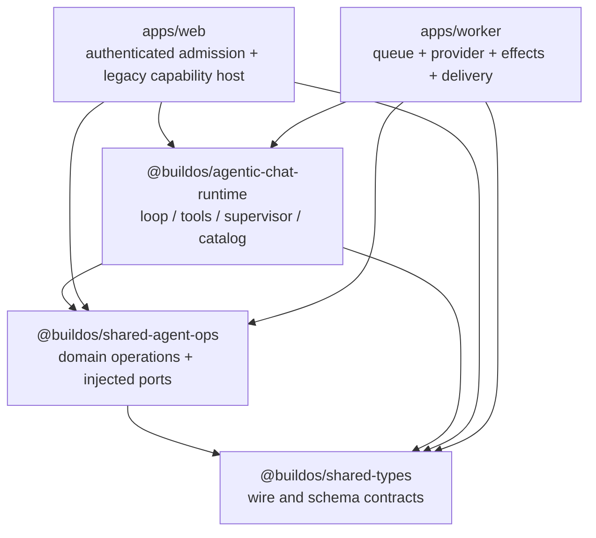

<!-- docs/plans/AGENTIC_CHAT_SEPARATION_OF_CONCERNS_PLAN_2026-08-25.md -->

# Agentic Chat separation-of-concerns architecture and migration plan

**Date:** 2026-08-25  
**Status:** Proposed for review; no implementation authorized by this document  
**Scope:** Agentic Chat catalog ownership, web admission, shared contracts, shared operations, queued worker execution, compatibility shims, and production naming  
**Primary decision:** Move the canonical tool catalog from `apps/web` into a focused `@buildos/agentic-chat-runtime/catalog` package entry point without changing the tool surface or runtime behavior.

## Executive summary

The queue migration has produced a sound runtime boundary:

```text
authenticated web admission
    -> immutable, hashed turn-input artifact
        -> minimal queue job reference
            -> isolated worker execution
```

The worker does not import the web application, shared packages do not import application code, and the queue payload is intentionally small. The worker reloads and validates the immutable input artifact before provider work. Those are strong separation-of-concerns choices and should remain intact.

The organizational problem is that the canonical Agentic Chat catalog still appears to be web-owned even though both the web admission path and the worker execution path depend on its meaning. Tool definitions, registry construction, static tool-surface profiles, and legacy configuration helpers remain under `apps/web/src/lib/services/agentic-chat`, while tool metadata, deterministic control behavior, and shared read implementations now live in `@buildos/agentic-chat-runtime`. One tool identity is therefore split across multiple owners.

The recommended correction is:

1. Keep wire types and validators in `@buildos/shared-types`.
2. Put canonical definitions, metadata, registry taxonomy, and static surface profiles in `@buildos/agentic-chat-runtime/catalog`.
3. Keep reusable database/domain operations in `@buildos/shared-agent-ops`.
4. Keep authenticated context construction and per-turn admission policy in `apps/web`.
5. Keep provider transport, the active worker capability projection, effect fencing, retries, recovery, billing, and delivery in `apps/worker`.
6. Treat the full catalog, an admitted tool surface, and an executable worker surface as three distinct concepts.

This does **not** justify creating a new package yet. Both runtime hosts already depend on `@buildos/agentic-chat-runtime`, and a focused subpath gives the catalog an explicit public boundary without adding another workspace dependency or build unit.

## Documents reconciled during this review

This plan extends rather than replaces the existing migration record:

- [`AGENTIC_CHAT_RUNTIME_WORKER_DEDUPLICATION_PLAN_2026-08-22.md`](./AGENTIC_CHAT_RUNTIME_WORKER_DEDUPLICATION_PLAN_2026-08-22.md) established `@buildos/agentic-chat-runtime` as the owner of deterministic host-neutral semantics and intentionally deferred web deletion.
- [`AGENTIC_CHAT_WORKER_REALTIME_MIGRATION_PLAN_2026-07-29.md`](./AGENTIC_CHAT_WORKER_REALTIME_MIGRATION_PLAN_2026-07-29.md) established immutable admission artifacts, minimal queued execution references, execution fencing, and mode-specific rollout.
- [`AGENTIC_CHAT_WORKER_PHASE_4_S3_EXTRACTION_MAP_2026-08-08.md`](./AGENTIC_CHAT_WORKER_PHASE_4_S3_EXTRACTION_MAP_2026-08-08.md) extracted shared read implementations and recorded why the gateway surface stayed in web at that time.
- [`AGENTIC_CHAT_WORKER_FULL_CUTOVER_EXTERNAL_ACCOUNTS_PLAN_2026-08-24.md`](./AGENTIC_CHAT_WORKER_FULL_CUTOVER_EXTERNAL_ACCOUNTS_PLAN_2026-08-24.md) records the current public worker cutover and the intentional explicit legacy path for Gmail, Calendar, OAuth handoff, and worker-disabled image capabilities.
- [`SHARED_AGENT_OPS_EXTRACTION_PLAN.md`](../../apps/web/docs/technical/architecture/agent-work/SHARED_AGENT_OPS_EXTRACTION_PLAN.md) documents the earlier extraction tactic of leaving compatibility shims for later cleanup.

### Corrections to historical premises

Some older decisions were correct for their source state but are no longer current constraints:

- The August read-tool extraction map said `gateway-surface.ts` could not move because it used `$lib` and `process.env`. The current file has no environment dependency; its remaining `$lib` import points only to another catalog helper. Moving those helpers together removes the alias.
- The runtime/worker deduplication plan correctly made the global tool-catalog provider a non-goal absent a demonstrated co-hosting or test-isolation problem. This plan retains that restraint. Canonical catalog ownership and active-surface injection are different concerns; moving the former does not require redesigning the latter.
- The old worker phases described a read-only or fixture runtime. The production worker now exposes reviewed mutations, but filenames and comments still retain `Phase3`, `ReadOnly`, and `Fixture` terminology.
- External-account legacy execution is currently intentional capability routing, not abandoned dead code. It must not be deleted as part of a catalog move.

## Current architecture: what is already correct

### 1. The queue handoff is a reference, not a serialized runtime

`AgenticChatTurnJobV1` contains only `turnRunId` and `correlationId`. The job does not carry clients, functions, request objects, or a mutable provider context.

The worker then loads the associated turn and input artifact, checks ownership and identity, validates the artifact version/hash/size, and rejects expired or inconsistent input before starting provider work.

**Decision:** Preserve this design. Do not move authenticated turn preparation into the worker merely because execution happens there.

### 2. Admission freezes the behavior-bearing surface

Web admission selects the final worker-compatible tools, rejects unavailable capabilities through explicit transport renegotiation, and stores names plus exact provider definitions in the immutable artifact. The worker intersects that frozen surface with its reviewed executable capabilities and narrows mutation arguments before advertising them.

This provides replayability across deploys: an already-admitted turn executes against the definitions frozen for that turn rather than silently adopting a later catalog.

**Decision:** The catalog package supplies definitions; web admission remains responsible for selecting and freezing a per-turn surface.

### 3. The dedicated consumer is isolated

The Agentic Chat runtime creates a dedicated `SupabaseQueue` that registers only `agentic_chat_turn`. The dedicated Railway service starts `chat-worker.js`, while the general Railway service starts `index.js`. Production evidence records the general service with Agentic Chat disabled and the dedicated service enabled.

**Decision:** Preserve the dedicated service. Retain the general-process bootstrap only for the documented rollback window, then remove it in a separate operational cleanup.

### 4. The shared runtime package has a portability guard

The runtime recursively rejects SvelteKit aliases, application-host imports, deployment primitives, global admin clients, and `process.env` from production package sources.

**Decision:** Extend this guard to the new `catalog` sources automatically by placing them under the existing package source tree. Add a direct catalog-specific import check for clarity.

## Current ownership problems

### Finding A — canonical tool identity is split across owners

Today a tool can have:

- its provider definition under `apps/web/.../definitions`;
- its category, contexts, summary, and discovery state in `packages/agentic-chat-runtime/src/loop/tool-metadata.ts`;
- its op taxonomy in the web `tool-registry.ts`;
- its shared implementation in `@buildos/agentic-chat-runtime/tools` or `@buildos/shared-agent-ops`;
- its worker capability decision and narrowed mutation projection in `apps/worker`.

The execution adapter should remain host-owned, but the definition, metadata, and canonical op identity should be one catalog unit.

The web definition cluster is pure TypeScript data. The production definition files import only `ChatToolDefinition` from `@buildos/shared-types`; they do not import SvelteKit, environment values, Supabase, browser APIs, or web services.

### Finding B — standard control schemas have two sources

The runtime defines the four standard semantic controls beside the deterministic executors:

- `declare_turn_contract`
- `declare_read_only_turn`
- `request_turn_clarification`
- `cancel_turn_contract`

Web independently defines the same controls in `definitions/gateway.ts`. Their parameter structures are similar, but the function and nested descriptions differ. The compatibility test removes every `description` before comparing the schemas.

This is behavior-bearing drift. Tool descriptions are part of the model-facing instruction surface; official tool APIs describe them as guidance used by the model to decide when and how to call a function. A schema test that ignores them cannot establish behavioral equivalence.

**Recommendation:** Make one full definition canonical. In the final shape, control schemas live in `catalog/definitions/controls.ts`, deterministic executors import those names/types, and web compatibility exports point to the same objects.

### Finding C — the artifact contract does not type or validate its tool surface

The shared worker contract types `prepared.toolSurface` as a generic `JsonObject`. Web constructs it from `unknown[]` and round-trips it through `JSON.stringify`/`JSON.parse`. The shared artifact validator validates the artifact hash and many prepared fields but does not validate tool-surface names or definition structure. The worker later performs a second manual parse inside `readOnlyProvider.ts`.

Consequences:

- name/definition mismatches are discovered late;
- the worker owns a decoder for a shared wire contract;
- duplicate names and unsupported schema shapes are not rejected at the shared boundary;
- TypeScript cannot prove that admission wrote what execution expects.

The overall artifact content hash is already a SHA-256 and remains the integrity authority. Prepared-prompt and prompt-snapshot paths also persist hashes of the actual tool definitions. A new catalog version should therefore be observability metadata, not a substitute integrity fence.

### Finding D — registry types are structurally duplicated

The web registry defines `RegistryOp` with `parameters_schema: Record<string, any>`. `@buildos/shared-agent-ops` carries a structural mirror because it cannot depend upward on the web registry. If the registry implementation moves into `@buildos/agentic-chat-runtime`, `@buildos/shared-agent-ops` still must not import the runtime package because the runtime already depends on shared operations.

**Recommendation:** Put the small serializable registry-entry contract and JSON-schema value types in `@buildos/shared-types`. Let both the catalog and shared operation gateway depend downward on that contract. Keep registry construction and values in the runtime catalog.

### Finding E — `tools.config.ts` mixes live primitives, legacy grouping, and dead exports

`tools.config.ts` currently contains:

- canonical name/definition lookup helpers;
- context defaults and static groups;
- read/write and execution-category lookup;
- token estimates and prompt-formatting helpers;
- several precomputed arrays;
- compatibility behavior for legacy shapes.

Static usage inspection found 15 importing files, but many exported symbols have no consumer outside their defining file. The move should not preserve unused API merely because it exists.

**Recommendation:** Split before moving:

- Catalog indexes and lookup helpers move to `catalog/indexes.ts`.
- Execution/discovery taxonomy moves to `catalog/taxonomy.ts`.
- Static surface profiles move to `catalog/surfaces.ts`.
- Prompt-only presentation helpers stay with the prompt host if still used.
- Zero-consumer exports are deleted after an all-file search and focused tests.

### Finding F — registry versioning omits discovery behavior

The registry exposes `chat_discoverable`, but `metadataForRegistryVersion` deliberately omits `chatDiscovery`. A change that hides or reveals a tool can therefore change registry behavior without changing the reported version.

The existing version uses 32-bit FNV-1a. That is adequate as a compact cache/display identifier but should not be treated as a collision-resistant correctness or security boundary.

**Recommendation:** Decide explicitly between:

1. include `chatDiscovery` and version every behavior-bearing registry field; or
2. expose separate `definitionHash` and `discoveryPolicyVersion` values.

Do not use the FNV value to authorize execution. The immutable artifact hash and worker capability checks already serve that purpose.

### Finding G — compatibility shims obscure current ownership

There are about 29 web files of 20 lines or fewer whose primary purpose is forwarding runtime exports. Additional catalog shims include `tool-definitions.ts`, `definitions/field-metadata.ts`, `definitions/tool-metadata.ts`, and `definitions/types.ts`.

The shim tactic reduced blast radius during extraction, but leaving shims indefinitely makes code search and ownership unclear.

**Recommendation:** Every new shim introduced by this plan gets an expiry phase and a zero-consumer deletion gate.

### Finding H — production worker names describe an obsolete phase

The production composition root instantiates `AgenticChatFixtureTurnExecutor` and `AgenticChatFixtureMutationExecutor`. The real provider class is `AgenticChatOpenRouterReadOnlyClient`, and the 5,345-line provider coordinator is `readOnlyProvider.ts`, even though reviewed write tools are active.

The naming is now materially misleading, not merely cosmetic. It makes it difficult to distinguish test fixtures from production runtime code and encourages additions to an already broad provider module.

### Finding I — the worker provider coordinator has several separable responsibilities

`readOnlyProvider.ts` currently contains:

- provider request/response contracts;
- the active loop catalog installation;
- independent reviewer tool definitions;
- supervisor runtime coordination;
- streamed tool-call assembly;
- allowlist enforcement and repair;
- semantic disposition, contract, and mutation-batch review prompts;
- contract authorization and validation repair;
- provider-step construction;
- prompt snapshots and hashes;
- artifact tool-surface parsing and mutation projection;
- usage normalization and error mapping.

This should be split by behavior seam after the catalog migration, not moved wholesale into the shared runtime merely because it is large.

### Finding J — documentation and diagnostics are stale

- `apps/worker/README.md` describes only the API, general worker, and scheduler; it omits the dedicated chat process and `agentic_chat_turn` job.
- `apps/worker/package.json` still describes the package as a daily-brief worker.
- Several Phase 3 comments say modules are absent from production even though `chat-worker.ts` imports them.
- `pnpm --filter @buildos/web report:agentic-tools` currently fails while loading a skill `SKILL.md` through the TSX path. The equivalent focused Vitest size-report tests pass, but the operator-facing report command is not usable as a migration baseline until repaired.

## Target ownership model

| Concern                                                                                                              | Canonical owner                                 | Notes                                                       |
| -------------------------------------------------------------------------------------------------------------------- | ----------------------------------------------- | ----------------------------------------------------------- |
| JSON values, schema shapes, `ChatToolDefinition`, registry-entry wire types                                          | `@buildos/shared-types`                         | Types and validation contracts only; no catalog values      |
| Tool definitions, metadata, canonical op taxonomy, static surface profiles, registry builder/version                 | `@buildos/agentic-chat-runtime/catalog`         | Host-neutral BuildOS Agentic Chat semantics                 |
| Deterministic loop, turn contracts, repair, supervisor, shared reads                                                 | Existing runtime subpaths                       | Import catalog types/values as needed                       |
| Ontology/calendar/email operations over injected clients/ports                                                       | `@buildos/shared-agent-ops`                     | No chat prompt, tool-selection, or host lifecycle ownership |
| Authentication, user/session access, context, history, prompt/skill preload, per-turn selection, immutable admission | `apps/web`                                      | This is admission policy, not queued execution              |
| Legacy SSE external-account execution                                                                                | `apps/web` while capability routing requires it | Explicitly fenced and documented                            |
| Queue claim, provider transport, executable capability projection, mutation adapters, recovery, billing, events      | `apps/worker`                                   | Worker-only review controls stay here                       |

### Target dependency graph



Forbidden dependency directions:

```text
packages -> apps/*
apps/worker -> apps/web
apps/web -> apps/worker
shared-agent-ops -> agentic-chat-runtime
shared-types -> runtime values or host code
```

## Three catalog concepts that must remain separate

### 1. Canonical catalog

The complete BuildOS Agentic Chat vocabulary: definitions, metadata, op identities, and surface-profile policy. It answers, “What tools does this product know about?”

### 2. Admitted surface

The exact ordered subset selected for one turn by authenticated web admission and frozen into the immutable artifact. It answers, “What tools was this turn promised?”

### 3. Executable worker surface

The admitted surface intersected with reviewed worker capabilities and, for mutations, narrowed to worker-supported argument projections. It answers, “What can this deployed worker safely advertise and execute?”

The worker must never infer capability solely because a definition exists in the canonical catalog. Catalog sharing must not weaken the current fail-closed worker policy.

## Proposed source-to-target move map

| Current source                                               | Target                                                                            | Action                                                                                      |
| ------------------------------------------------------------ | --------------------------------------------------------------------------------- | ------------------------------------------------------------------------------------------- |
| `apps/web/.../definitions/ontology-read.ts`                  | `packages/agentic-chat-runtime/src/catalog/definitions/ontology-read.ts`          | Move unchanged                                                                              |
| `apps/web/.../definitions/ontology-write.ts`                 | `.../catalog/definitions/ontology-write.ts`                                       | Move unchanged                                                                              |
| `apps/web/.../definitions/utility.ts`                        | `.../catalog/definitions/utility.ts`                                              | Move unchanged                                                                              |
| `apps/web/.../definitions/calendar.ts`                       | `.../catalog/definitions/calendar.ts`                                             | Move unchanged                                                                              |
| `apps/web/.../definitions/email.ts`                          | `.../catalog/definitions/email.ts`                                                | Move unchanged                                                                              |
| `apps/web/.../definitions/gateway.ts`                        | `.../catalog/definitions/discovery.ts` plus `controls.ts`                         | Split discovery tools from standard controls; preserve exact definitions during the move    |
| `packages/agentic-chat-runtime/src/loop/definition-types.ts` | `.../catalog/types.ts`                                                            | Move catalog types; keep temporary loop re-export                                           |
| `packages/agentic-chat-runtime/src/loop/tool-metadata.ts`    | `.../catalog/metadata.ts`                                                         | Move; keep temporary loop re-export                                                         |
| `apps/web/.../registry/tool-registry.ts`                     | `.../catalog/registry.ts`                                                         | Move builder, taxonomy, cache, and version                                                  |
| `apps/web/.../core/tools.config.ts`                          | Split between `catalog/indexes.ts`, `catalog/taxonomy.ts`, and web prompt helpers | Do not move zero-consumer exports blindly                                                   |
| `apps/web/.../core/gateway-surface.ts`                       | `.../catalog/surfaces.ts`                                                         | Move static profiles and materialization; normalize `$lib` imports to package-local imports |
| `apps/web/.../v2/tool-selector.ts`                           | `apps/web/.../admission/tool-selector.ts` eventually                              | Keep web-owned per-turn heuristics and capability renegotiation                             |
| `apps/web/.../registry/tool-search.ts`                       | Remain web adapter                                                                | It binds canonical registry search to web skill/capability catalogs                         |
| `apps/worker/.../mutationToolCatalog.ts`                     | Remain worker                                                                     | It is reviewed executable capability policy, not the canonical provider schema              |
| `apps/worker/.../readOnlyTool.ts` reviewer controls          | Remain worker                                                                     | Promote only if another host adopts the review protocol                                     |
| `packages/shared-agent-ops/.../RegistryOp` structural mirror | Shared contract in `@buildos/shared-types`                                        | Removes `any` duplication without reversing package dependencies                            |

### Proposed catalog entry point

```text
packages/agentic-chat-runtime/src/catalog/
├── index.ts
├── types.ts
├── metadata.ts
├── indexes.ts
├── taxonomy.ts
├── registry.ts
├── surfaces.ts
└── definitions/
    ├── index.ts
    ├── controls.ts
    ├── discovery.ts
    ├── ontology-read.ts
    ├── ontology-write.ts
    ├── utility.ts
    ├── calendar.ts
    └── email.ts
```

Public import:

```ts
import {
	AGENTIC_CHAT_TOOL_DEFINITIONS,
	AGENTIC_CHAT_TOOL_METADATA,
	getAgenticChatToolRegistry,
	getAgenticChatSurfaceForProfile
} from '@buildos/agentic-chat-runtime/catalog';
```

Use an explicit package subpath rather than exporting the whole catalog from the runtime root. Node's `exports` contract makes the public entry point explicit and prevents consumers from reaching internal source paths.

## Phased implementation plan

Each phase is independently reviewable. A move phase must not also rewrite tool descriptions, change parameter schemas, alter ordering, add capabilities, or change routing.

### Phase 0 — baseline, working-tree stabilization, and migration guardrails

**Objective:** Establish exact before-state evidence so structural moves cannot hide behavior changes.

Work:

1. Reconcile or finish the current in-flight edits in definitions, worker tool projection, and provider assembly before moving files.
2. Repair `report:agentic-tools` so it can load skill Markdown under the current TSX/runtime configuration, or replace it with a script that imports only the catalog and receives skills through an injected adapter.
3. Record for every static profile:
    - ordered tool names;
    - serialized definitions;
    - total characters and estimated tokens;
    - current registry version;
    - definition SHA-256 where already available.
4. Add a pre-move catalog-fitness test in the current location:
    - direct definition names are unique;
    - metadata names and direct definitions match exactly;
    - control and discovery definitions are unique across the total vocabulary;
    - registry op names do not collide;
    - surface profiles reference real definitions;
    - worker executable/unavailable policy names reference known definitions or explicit controls;
    - shared-read names reference known definitions;
    - worker reviewed mutation argument names exist in the canonical parameter schema;
    - all definitions are JSON-serializable and use a top-level object parameter schema.
5. Capture the focused and full test baselines.

Exit gate:

- The report command works.
- The catalog-fitness test passes before any file move.
- Current profile names, order, sizes, and hashes are committed as reviewable fixtures.
- No provider calls, database mutations, routing changes, or deploy changes occur.

Rollback: none required; this phase adds diagnostics only.

### Phase 1 — shared contract types and the `/catalog` package entry point

**Objective:** Create the destination and dependency direction without changing consumers.

Work:

1. Add JSON-compatible recursive schema types to `@buildos/shared-types` and replace `Record<string, any>` in `ChatToolDefinition` and the registry-entry contract.
2. Move the serializable `RegistryOp` shape into shared types so `shared-agent-ops` and the runtime catalog share one contract without a dependency cycle.
3. Add `src/catalog/index.ts`, package build input, and explicit `./catalog` conditional exports for CJS, ESM, and types.
4. Add web and worker Vitest aliases for `@buildos/agentic-chat-runtime/catalog`.
5. Add catalog portability tests and CJS/ESM import smoke tests.
6. Do not expose catalog internals through wildcard source imports.

Exit gate:

- `@buildos/shared-types` typecheck/tests pass.
- `@buildos/shared-agent-ops` build/typecheck/tests pass using the shared registry-entry type.
- Runtime build emits both module formats and declarations for `/catalog`.
- CJS and ESM consumers import `/catalog` successfully.
- No workspace dependency cycle is introduced.

Rollback: remove the unused entry point and shared contract additions; no runtime consumer has moved yet.

### Phase 2 — canonical definitions, metadata, and standard controls

**Objective:** Establish one source of truth for behavior-bearing tool definitions.

Work:

1. Move the five direct definition families unchanged using `git mv` where possible.
2. Split `gateway.ts` into canonical standard controls and discovery definitions.
3. Move tool metadata and definition types from the loop folder into the catalog.
4. Make loop control executors import canonical control names/definitions from the catalog.
5. Replace web definitions with temporary re-export shims.
6. Change the control compatibility test from “parameters without descriptions” to full canonical equality.
7. Preserve existing array membership:
    - direct definitions remain the existing `CHAT_TOOL_DEFINITIONS` compatibility set;
    - discovery definitions remain separate;
    - standard controls remain separate;
    - a new explicit total-vocabulary export may combine them for integrity tests only.

Exit gate:

- Every pre-move definition deep-equals its post-move definition.
- Every profile has identical ordered names and serialized JSON.
- Tool-surface size reports have an exact zero delta.
- Runtime, focused web schema, worker policy, and provider-surface tests pass.
- Package source has zero `$lib`, `$app`, `$env`, application, or deployment imports.

Rollback: web shims can temporarily point back to the old definitions if a packaging issue is discovered. No artifact format changes yet.

### Phase 3 — registry, indexes, taxonomy, and static surface profiles

**Objective:** Move the remaining pure catalog policy while keeping per-turn admission in web.

Work:

1. Move the registry builder, op mappings, taxonomy, and singleton cache into the catalog.
2. Split `tools.config.ts` by responsibility; delete confirmed zero-consumer exports rather than migrate them.
3. Move static gateway profile definitions and materialization helpers to `catalog/surfaces.ts`.
4. Keep `tool-selector.ts`, living-workspace enrichment, lexical/situational capability detection, and transport renegotiation in web admission.
5. Keep `tool-search.ts` and `tool-schema.ts` as web discovery adapters initially; repoint them to the catalog registry.
6. Decide and document registry version semantics:
    - include `chatDiscovery`, or
    - publish a separate discovery-policy version.
7. Retain active-surface injection for loop classification. Do not replace the global provider in this phase.

Exit gate:

- The op map and registry payload deep-equal the baseline.
- Every static surface has identical ordered tool definitions.
- Skill related-op resolution remains complete.
- Prompt and tool-surface size budgets remain at or below baseline.
- Web admission still rejects worker-unavailable tools before admission.

Rollback: temporary web registry/surface shims point to `/catalog`; restoring imports does not require restoring duplicate values.

### Phase 4 — versioned shared tool-surface contract and reader-first rollout

**Objective:** Make the queue boundary typed and fail closed without invalidating retained artifacts.

Work:

1. Add `AgenticChatToolSurfaceV1` to shared types with:
    - `version: 1` for new writes;
    - `surfaceProfile`;
    - ordered `toolNames`;
    - typed `definitions`;
    - optional registry/catalog observability version.
2. Add one shared decoder/validator that enforces:
    - unique, canonical names;
    - exact name/definition agreement;
    - bounded tool count and serialized bytes;
    - non-empty descriptions;
    - top-level object parameter schemas;
    - JSON-compatible values;
    - no malformed or duplicate definitions.
3. Make the worker use the shared decoder instead of manually parsing the surface in `readOnlyProvider.ts`.
4. Preserve the worker-reviewed mutation projection after shared decoding.
5. Support retained unversioned surfaces by normalizing them to V1 during the seven-day artifact-retention window.
6. After the reader is deployed, make web admission write `version: 1` and the typed surface.
7. Do not add a database migration solely for this nested JSON change unless database constraints are later desired.
8. Keep the artifact content SHA-256 authoritative. Do not treat the compact registry version as an integrity proof.

Deployment order:

1. Deploy a worker that reads both legacy and V1 surfaces.
2. Verify worker health and one admitted legacy-shape fixture.
3. Deploy web admission that writes V1.
4. Verify new worker turns, explicit legacy external-account routing, and rollback.
5. Remove legacy decoding only after retention has elapsed and no queued/running legacy artifact remains.

Exit gate:

- Shared contract tests cover valid, legacy-normalized, malformed, oversized, duplicate, mismatch, and unsupported-schema cases.
- Old worker fixtures remain executable by the new reader.
- New V1 fixtures round-trip through admission, database representation, worker decoding, and prompt-snapshot hashing.
- No additional network or database round trip is introduced.

Rollback: stop the web writer from emitting the version field. The backward-compatible worker remains safe.

### Phase 5 — consumer cutover and shim deletion

**Objective:** Make repository navigation reflect actual ownership.

Work:

1. Update imports to the package entry point across the observed consumer groups:
    - approximately 37 definition-path consumers;
    - 15 `tools.config` consumers;
    - 24 surface consumers;
    - 18 registry consumers.
2. Update web and worker tests to import canonical package paths.
3. Delete catalog shims once `rg` confirms zero consumers.
4. Delete the small runtime forwarding shims under web once their direct imports are updated.
5. Add an import-boundary test that fails if new web code imports the deleted catalog paths.
6. Add short READMEs at the web admission, legacy execution, runtime catalog, and worker composition roots describing their ownership.

Exit gate:

- No production import references the old definition, registry, configuration, or surface paths.
- No compatibility shim lacks an explicit retained consumer.
- Web, worker, and runtime tests import public package subpaths, not package source files.
- Full typechecks and builds pass.

Rollback: restore only the re-export shims, not duplicate implementations.

### Phase 6 — worker production naming and provider decomposition

**Objective:** Remove obsolete migration terminology and separate the production worker coordinator into reviewable units.

Do this as two independently reviewable changes.

#### Phase 6A — rename only

Suggested renames:

| Current                       | Target                                           |
| ----------------------------- | ------------------------------------------------ |
| `phase3Bootstrap.ts`          | `bootstrap.ts`                                   |
| `phase3Config.ts`             | `config.ts`                                      |
| `phase3Assembly.ts`           | `composition-root.ts`                            |
| `fixtureTurnExecutor.ts`      | `turn-executor.ts`                               |
| `fixtureMutationExecutor.ts`  | `mutation-executor.ts`                           |
| `openRouterReadOnlyClient.ts` | `provider/openrouter-client.ts`                  |
| `readOnlyTool.ts`             | `tools/execution-adapter.ts`                     |
| `readOnlyProvider.ts`         | `provider/turn-provider.ts` before decomposition |

Rename exported symbols and tests consistently. Preserve compatibility aliases only if another package imports them; tests inside the worker should move immediately.

#### Phase 6B — split provider responsibilities

Suggested seams based on the current file:

```text
provider/
├── contracts.ts                 # provider messages, tools, events, client port
├── turn-provider.ts             # main adapter and round coordinator
├── stream-tool-calls.ts         # streamed call assembly and finish validation
├── feedback.ts                  # read/write feedback normalization and memoization
├── request-builders.ts          # synthesis, continuation, repair, base requests
├── tool-surface.ts              # shared decode + worker capability projection
├── steps.ts                     # provider/read/planning step construction
├── validation.ts                # contract authorization and call validation
├── supervisor-runtime.ts        # worker supervisor coordination
└── review/
    ├── controls.ts              # worker-only reviewer tool definitions
    ├── disposition.ts
    ├── turn-contract.ts
    └── mutation-batch.ts
```

Rules:

- Keep OpenRouter HTTP and usage observation worker-owned.
- Keep worker-only review tools worker-owned.
- Keep effect identities, capability projection, and mutation adapters worker-owned.
- Move an algorithm into the shared runtime only if it is host-neutral, has injected ports, and is required by another host or by deterministic parity—not merely because the worker file is large.
- Do not combine structural decomposition with model-guidance or retry-policy changes.

Exit gate:

- The production composition root contains no `Fixture`, `Phase3`, or misleading `ReadOnly` names.
- Existing worker tests pass with no expectation changes.
- Provider request JSON, prompt snapshots, tool ordering, hashes, usage, and terminal envelopes are unchanged.
- The largest provider module has one primary responsibility and materially fewer imports.

Rollback: renames are separately revertible; decomposition uses pure moves/extractions with behavior-pinning tests.

### Phase 7 — web legacy boundary, operational cleanup, and conditional DI work

**Objective:** Finish cleanup only when capability and rollback prerequisites are satisfied.

Work:

1. Keep Gmail, Calendar, OAuth handoff, and worker-disabled image execution in the explicit legacy capability host until their reviewed worker ports are complete or the product intentionally retires them.
2. Group the remaining legacy SSE runtime under an explicit `legacy-execution` namespace after import churn from earlier phases settles.
3. When rollback support is retired:
    - remove the Agentic Chat bootstrap from the general worker process;
    - enforce that only `chat-worker.ts` can start the chat consumer in production;
    - remove obsolete environment gates and phase comments;
    - update deployment and rollback documentation.
4. Revisit `globalThis` catalog-provider injection only if one of these triggers exists:
    - a test proves import-order leakage;
    - two catalog instances must coexist in one process;
    - a host needs request-scoped catalog behavior;
    - composition cannot be made explicit at one root.
5. If triggered, replace the service locator with a runtime factory or explicit `ToolCatalogPort`. Otherwise leave the known, tested mechanism in place.

Exit gate:

- No active capability relies accidentally on deleted legacy code.
- Rollback documentation matches deployed process ownership.
- Worker README and package description describe the dedicated Agentic Chat service.
- Any DI redesign has a demonstrated failing case and an explicit parity test.

## Validation matrix

### Package gates

```bash
pnpm --filter @buildos/shared-types typecheck
pnpm --filter @buildos/shared-types test:run

pnpm --filter @buildos/shared-agent-ops build
pnpm --filter @buildos/shared-agent-ops typecheck
pnpm --filter @buildos/shared-agent-ops test:run

pnpm --filter @buildos/agentic-chat-runtime build
pnpm --filter @buildos/agentic-chat-runtime typecheck
pnpm --filter @buildos/agentic-chat-runtime test:run
```

Add CJS and ESM smoke tests for `@buildos/agentic-chat-runtime/catalog` after the package build.

### Web focused gates

- full-definition schema compatibility;
- gateway surface profiles and materialization;
- tool selector;
- worker turn preparation and unavailable-capability renegotiation;
- prepared-prompt cache and tool-definition hashes;
- tool-surface size budgets;
- tool search/schema and skill related-op integrity;
- legacy external-account routing.

Then run:

```bash
pnpm --filter @buildos/web check
pnpm --filter @buildos/web build
```

### Worker focused gates

- runtime boundary and isolated queue registration;
- execution-input artifact validation;
- worker tool policy and mutation-surface audit;
- provider tool-surface projection;
- standard controls;
- prompt snapshot exact replay/hash;
- mutation adapter coverage;
- bootstrap/composition health;
- legacy/V1 artifact compatibility.

Then run:

```bash
pnpm --filter @buildos/worker check
pnpm --filter @buildos/worker test:run
```

### Repository gates

```bash
pnpm --filter @buildos/web report:agentic-tools
git diff --check
```

Add import-boundary scans for:

- package-to-app imports;
- worker-to-web imports;
- runtime host/deployment imports;
- old catalog path imports after shim deletion;
- workspace dependency cycles in the affected package graph.

### Current audit evidence

Against the current working tree, the focused baseline passed:

- runtime: 36 files, 268 tests;
- web admission/schema/surface: 3 files, 28 tests;
- worker runtime boundary/policy/provider/bootstrap: 4 files, 98 tests.

Total: 43 test files and 394 assertions passed.

The operator-facing `report:agentic-tools` command failed while importing a Markdown skill resource and must be repaired in Phase 0.

## Risks and mitigations

| Risk                                                          | Mitigation                                                                                                           |
| ------------------------------------------------------------- | -------------------------------------------------------------------------------------------------------------------- |
| Tool descriptions or ordering change during moves             | Freeze serialized definitions and ordered profile fixtures; require zero delta in Phases 2–3                         |
| New web writer deploys before old worker can read the surface | Reader-first rollout with legacy normalization and retention window                                                  |
| Shared catalog accidentally grants worker capability          | Preserve admitted-surface intersection and reviewed worker capability projection; test unavailable names fail closed |
| Runtime package starts pulling web/host code                  | Existing recursive portability test plus catalog-specific import scan                                                |
| Package cycle through `shared-agent-ops`                      | Put structural registry wire types in `shared-types`; operations package never imports runtime                       |
| Shims remain permanently                                      | Give every shim a named deletion phase and zero-consumer gate                                                        |
| Large worker rename hides behavior changes                    | Separate rename-only and extraction-only changes; pin provider JSON/hashes                                           |
| Legacy external-account behavior is deleted too early         | Treat it as an explicit capability host until the full-cutover plan closes each capability                           |
| Compact registry version is treated as a security hash        | Keep artifact SHA-256 authoritative; document registry version as cache/observability metadata                       |
| Current uncommitted schema work conflicts with moves          | Phase 0 stabilizes and snapshots current definitions before `git mv` operations                                      |

## Non-goals

- Moving authenticated request/session preparation into the worker.
- Sending full tool definitions in the queue job payload.
- Moving provider transport, retries, billing, realtime delivery, or queue lifecycle into the shared runtime.
- Moving worker-only semantic reviewer controls into the shared runtime without a second host.
- Making `@buildos/shared-agent-ops` depend on the Agentic Chat runtime.
- Putting tool-definition arrays or runtime singleton values in `@buildos/shared-types`.
- Deleting the explicit legacy Gmail/Calendar/OAuth/image path before capability parity or a product retirement decision.
- Creating `@buildos/agentic-chat-catalog` before an actual consumer needs the catalog without the existing runtime dependency.
- Introducing a database or network round trip as part of a code-ownership cleanup.
- Combining structural moves with model prompt, tool schema, capability, or routing changes.

## Review decisions requested

1. **Catalog home:** Approve `@buildos/agentic-chat-runtime/catalog` instead of a new package.
2. **Static surfaces:** Approve moving static profiles/materialization to the catalog while keeping per-turn selection and transport renegotiation in web admission.
3. **Unused exports:** Approve deleting confirmed zero-consumer `tools.config.ts` APIs rather than preserving them through another shim layer.
4. **Surface contract:** Approve reader-first `AgenticChatToolSurfaceV1` rollout with legacy normalization and no database migration.
5. **Registry version:** Choose whether `chatDiscovery` joins the current registry version or receives a separate policy version.
6. **Worker cleanup:** Approve production renaming as a separate change before provider decomposition.
7. **Global catalog provider:** Confirm it remains deferred unless a concrete isolation failure is demonstrated.

## External technical references

These references support the implementation mechanics, not the product-specific ownership decisions:

- [Node.js package entry points and subpath exports](https://nodejs.org/api/packages.html#package-entry-points): explicit `exports` define a package's public interface and encapsulate other subpaths.
- [TypeScript project references](https://www.typescriptlang.org/docs/handbook/project-references.html): separate projects can enforce logical grouping and build order. This plan does not require introducing project references in the first phases; the existing workspace package remains the build unit.
- [pnpm workspace protocol](https://pnpm.io/workspaces#workspace-protocol-workspace): `workspace:*` guarantees resolution to a local workspace package, matching the current web/worker dependencies on the runtime package.
- [JSON Schema Draft 2020-12 core](https://json-schema.org/draft/2020-12/json-schema-core) and [validation vocabulary](https://json-schema.org/draft/2020-12/json-schema-validation): tool parameters should be represented through JSON-compatible schema values rather than `any`.
- [OpenAI function calling guide](https://platform.openai.com/docs/guides/function-calling): function descriptions and parameter schemas are model-facing behavior, which is why canonical equality must include descriptions.

## Recommended first implementation change

The first implementation PR should stop after Phase 0 and Phase 1:

1. repair the catalog report;
2. add baseline catalog-fitness fixtures;
3. add strict shared schema/registry-entry types;
4. add the empty, buildable `/catalog` entry point with import smoke tests.

That PR proves the destination and guardrails without moving a single behavior-bearing definition. The following PR can move definitions and controls with an exact zero-delta requirement.
