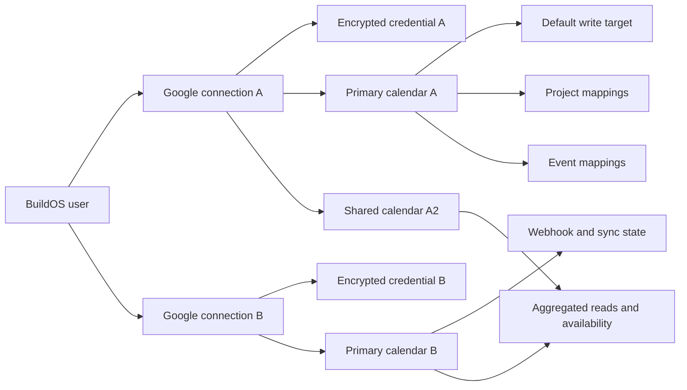

<!-- docs/plans/MULTI_GOOGLE_CALENDAR_CONNECTIONS_SPEC_2026-08-11.md -->

# Multi-Google-Calendar Connections — Architecture and Implementation Plan

**Date:** 2026-08-11  
**Status:** Implementation in progress — re-audited 2026-08-12; production schema migrations
applied; runtime slices remain behind an exact-user server gate  
**Owner:** BuildOS web, integrations, and worker runtime  
**Primary decision:** One BuildOS user may connect up to five Google accounts. Each Google account
owns one OAuth connection and may expose multiple calendar resources. Every Google Calendar read,
write, webhook, and sync mapping must resolve through a specific BuildOS calendar source rather than
through `user_id` alone.

## Audit note (2026-08-11)

This plan was reviewed against the live codebase before implementation. Every structural claim it
made about current BuildOS behavior was verified as accurate. The review added the following
requirements, all of which are now inline in the relevant sections rather than in a separate list:

1. Calendar currently shares the Google **login** OAuth client. A dual-client credential model is
   now mandatory so migration does not invalidate every existing refresh token (decisions 19–20,
   §Target data model 2, §OAuth connection lifecycle, §Legacy migration Phase B).
2. `onto_event_sync.calendar_id` is `NOT NULL` today, which makes user-scope sync rows impossible.
   Phase A must relax it (§7, §Legacy migration Phase A).
3. `time_blocks` carries a Google event ID with no calendar identity at all. It needs a source
   column or its writes will hit the wrong account (§7, decision 21).
4. Merged reads must deduplicate on `iCalUID`, not only on `(provider_calendar_id, event_id)`
   (decision 22, §Read aggregation).
5. Slice 0 preflight must verify credential _decryptability_ and detect duplicate Google `sub`
   values across BuildOS users, because both can hard-fail the backfill (§Slice 0).
6. The webhook renewal cron exists but is not scheduled, and webhook repair currently runs on the
   authenticated user's Supabase client. Both must be fixed inside this work (§Webhook and
   incremental-sync architecture, §Slice 5).

## Implementation checkpoint (2026-08-11)

Implemented locally:

- Slice 1 connection/source schema, ownership constraints, RLS, lifecycle RPCs, downstream source
  identity columns, and the `onto_event_sync.project_calendar_id` clarification;
- versioned connection-bound credential encryption and dual OAuth client resolution;
- stored OAuth state with PKCE and nonce verification, stable Google `sub` identity checks, source
  discovery, default-source reconciliation, refresh isolation, revocation, and account deletion;
- feature-gated connection/source APIs and the callback compatibility branch;
- dry-run-first legacy connection migration tooling that preserves `google_shared_login` as the
  credential issuer until reconnect;
- generated database type/schema projections and compatibility fixes in web, worker, ontology, and
  agent-calendar consumers exposed by the column rename.
- Slice 3 target resolution and source-aware authenticated clients, aggregated event reads,
  per-connection FreeBusy batching, partial-result budgets, source-qualified identities, and
  cross-account `iCalUID` deduplication;
- the first Slice 4 vertical: source-aware create/get/update/delete primitives, safe existing-event
  resolution, default and explicit writes, source-qualified ontology/task mappings, idempotent
  deletes, bounded create compensation, and service-only orphan repair receipts;
- exact-user canary routing for merged reads, availability, scheduling, updates, and deletes, plus a
  feature-gated profile account/source manager for connect, reconnect, label, discovery, source
  selection, default-write selection, and per-account disconnect.
- production application of exact migration receipt `20260811235000` and source-aware time-block
  creation, update, delete, compensation, and API routing.
- source-qualified project-calendar link/create/update/delete routing, including explicit provider
  ownership provenance so existing user-owned calendars are unlink-only while calendars created by
  BuildOS remain eligible for provider deletion;
- source-qualified ontology event creation and queued/inline update/delete routing. New mappings
  persist both the opaque source and canonical provider calendar ID, and existing-event mutations
  resolve the original stored source rather than the current default account.
- project Calendar settings now let canary users either create a dedicated calendar under a chosen
  connected Google account or link any writable discovered source. The UI distinguishes safe
  unlinking from provider deletion using the stored ownership provenance.
- project calendar sharing now resolves the stored source and authenticates through its owning
  connection rather than the singleton Calendar credential.
- provider calendar deletion is retry-safe when Google reports that the calendar was already
  deleted, while non-404 provider failures continue to surface;
- legacy connection backfill retries now rediscover sources for an already-created connection, so
  a partial attempt cannot be mistaken for a complete migration.
- source-qualified webhook registration, notification processing, sync-token recovery, atomic
  renewal, repair, disconnect/account-deletion cleanup, and service-role reconciliation. Renewal is
  scheduled hourly in both Vercel manifests, and root-layout request-time repair has been removed;
- Calendar analysis over analysis-enabled sources with connection-isolated reads, `iCalUID`
  collapse, source/event provenance for snapshots and suggestions, task provenance, persisted
  partial-coverage diagnostics, and user-visible partial coverage warnings.

Not yet complete: legacy mapping/source backfills, the remaining worker/agent direct-calendar
paths, deployment/canary verification of webhooks and analysis, and rollout operations. The
exact-user feature gate must remain limited to deliberate canary users until those paths land and
pass canary; broad enablement remains unsafe.

### Production foundation receipt (2026-08-11)

- Target: linked Supabase project `build_os` (`iwifjtlebphefldmwbkh`).
- Exact file: `20260811235000_multi_google_calendar_connections_foundation.sql`.
- SHA-256: `6e6e33df3a9565f3bc40e62eb61b66056f0e65dc66d3d6f54fbd460096a9d641`.
- Protocol: fetched the hosted migration receipts into an isolated temporary Supabase workdir,
  copied only the exact file above, and used `--include-all` because the hosted ledger already
  contained the later `20260812000000` receipt. The dry-run named only `20260811235000`.
- Preflight: the receipt and all six new relations were absent; every required legacy relation was
  present; `onto_event_sync.calendar_id` and its expected FK were present; nine legacy
  `user_calendar_tokens` rows remained available for the compatibility backfill.
- Apply: the exact migration completed transactionally and the hosted ledger recorded version
  `20260811235000` with name `multi_google_calendar_connections_foundation`.
- Verification at the foundation receipt: all six relations and all 14 downstream source columns
  existed; the misleading `onto_event_sync.calendar_id` was renamed; RLS, nine policies, two
  validation triggers, eight hardened RPCs, grants, and credential-table isolation matched the
  migration; every new relation was empty, so no legacy row was mutated by the foundation apply.
- Parity: the post-apply dry-run reports the remote database is up to date. Fresh linked type
  generation matches every new table block exactly. The checked-in RPC argument projections retain
  deliberate nullable refinements where PostgreSQL accepts null and the application sends it, which
  the generator does not infer from function bodies.

### Deploy-compatibility receipt (`20260812001500`, applied 2026-08-11)

The post-apply audit compared the current committed application with the local rollout code and
found a deploy-order hazard: the committed web/worker code still writes
`onto_event_sync.calendar_id`, while the new code writes `project_calendar_id`. The long-term rename
is still correct, but applying it before every runtime deployed would create a temporary production
write failure. The expand/contract correction is now hosted:

- Exact file: `20260812001500_multi_google_calendar_onto_event_sync_compatibility.sql`.
- SHA-256: `56ad9592f0cb29d7aae4824a28c557b4231e6b86544e128cd3a157d3f90819d7`.
- Behavior: restores nullable `calendar_id` as a deprecated FK alias, backfills it from
  `project_calendar_id`, and synchronizes either old-name or new-name inserts/updates through a
  hardened trigger. A validated equality constraint rejects divergent identities.
- Local proof: a disposable PostgreSQL contract passed old insert, new insert, old update, new
  update, mismatch rejection, and rollback checks.
- Hosted proof: all 146 existing mappings have equal alias/canonical IDs; the old FK, equality
  constraint, trigger, and hardened trigger function are present; the exact receipt is recorded;
  the post-apply dry-run is empty.
- Removal gate: do not drop `calendar_id` until every web and worker deployment plus all queued
  calendar jobs use `project_calendar_id`. That removal must be a separate exact migration.

### Project resource provenance receipt (`20260812020000`, applied 2026-08-11)

- Exact file: `20260812020000_multi_google_calendar_project_resource_provenance.sql`.
- SHA-256: `68174069fc78d11d6658148f6c2e189d7662c1f6916c969c024a4677babdbe34`.
- Behavior: adds non-null `project_calendars.provider_resource_managed` with a conservative false
  default and a validated constraint requiring every managed provider resource to have an opaque
  `calendar_source_id`.
- Safety contract: all legacy and explicitly linked calendars are unlink-only. Only a calendar that
  BuildOS created through a source-qualified connection is marked managed and may be deleted at the
  provider when its project mapping is removed.
- Local proof: the migration and rollback test passed in a disposable PostgreSQL cluster; focused
  service tests cover linking, selected-connection creation, create compensation, safe unlink, and
  managed deletion; Svelte/TypeScript diagnostics report zero errors and warnings.
- Hosted proof: the isolated dry run named only this receipt, the receipt is now recorded, the final
  dry run is empty, the new column is exposed through the production API, and all 14 existing
  project-calendar rows remain `provider_resource_managed = false`.

### Webhook identity receipt (`20260812050000`, applied 2026-08-12)

- Exact file: `20260812050000_multi_google_calendar_webhook_identity.sql`.
- SHA-256: `756162a14a418477b57f1c90dc9ee535e395f8297d281569747e2d509c665115`.
- Behavior: replaces the global `(user_id, calendar_id)` webhook uniqueness constraint with a
  legacy-only partial identity while retaining the source identity index. Source-backed channel
  deletion now cascades with its source instead of becoming a credential-ambiguous legacy row.
- Local proof: the disposable PostgreSQL contract passed legacy/source coexistence, duplicate
  rejection, and source-delete cascade. Service tests prove exact connection authentication,
  source-qualified mapping lookup, constant-time token rejection, and cursor-preserving channel
  rotation.
- Hosted proof: the isolated dry run named only this receipt; the final index inspection shows the
  legacy and source identities and no global user/calendar constraint; the post-apply dry run is
  empty.

### Calendar analysis provenance receipt (`20260812060000`, applied 2026-08-12)

- Exact file: `20260812060000_multi_google_calendar_analysis_provenance.sql`.
- SHA-256: `690383ed1c10b25b255ef154404bfc63f6f6d128f20a6a4645ee2738821ac7d4`.
- Behavior: persists partial-result diagnostics on analysis runs, source/event pairs on suggestions,
  all contributing source/event pairs on deduplicated snapshots, and separate legacy/source event
  identities.
- Local proof: the disposable PostgreSQL contract passed source/legacy coexistence, duplicate
  rejection, diagnostic JSON constraints, and source/event provenance. Focused service/UI tests
  prove analysis-only target selection, cross-account contributor retention, suggestion/task
  provenance, and accessible partial-coverage warnings.
- Hosted proof: the isolated dry run named only this receipt; generated linked types match the
  checked-in Calendar table projections; both analysis identity indexes are live; the post-apply
  dry run is empty.

### Verification checkpoint (2026-08-12)

- The linked migration ledger is current through `20260812060000`; an isolated
  `supabase db push --linked --dry-run` reports `Remote database is up to date`, so there is no
  lingering schema migration to apply.
- All five Calendar SQL contracts pass in disposable PostgreSQL: connection/source ownership and
  limits, the `onto_event_sync` compatibility alias, project resource provenance, webhook identity,
  and analysis provenance.
- Production aggregate checks report zero source/connection ownership mismatches, zero invalid
  default-write sources, zero project/source ownership mismatches, and zero managed project
  calendars without a source.
- The earlier production snapshot that found empty connection/source tables has been superseded by
  the DJ canary setup: `djwayne3@gmail.com` resolves through the new connection model, source
  discovery matched 24 Google calendars, refresh passed, two-way sync produced exactly one healthy
  webhook after its off/on test, and the original primary default was restored. Legacy retirement
  remains separate work; do not infer from the canary that compatibility rows are ready to drop.
- The linked Vercel Production project now contains
  `PRIVATE_GOOGLE_CALENDAR_CLIENT_ID`, `PRIVATE_GOOGLE_CALENDAR_CLIENT_SECRET`,
  `PRIVATE_CALENDAR_TOKEN_ENCRYPTION_KEY_V1`, and both multi-Calendar gate variables. On 2026-08-12,
  the gate values were refreshed to enabled plus the exact BuildOS user UUID for
  `djwayne3@gmail.com`; no deployment was triggered, so the next production deployment is still the
  point at which functions receive the refreshed configuration.
- Ninety-two focused web Calendar tests pass across 16 files; worker Calendar tests, shared
  calendar-port tests, selected ESLint, Prettier, shared package typechecks, the Svelte analyzer,
  and the repository-wide web check pass.

## Executive summary

BuildOS currently supports one Google Calendar OAuth grant per user. It can list or create multiple
calendar resources inside that Google account, but the credential, OAuth callback, authenticated
client cache, webhook registration, project-calendar mapping, agent runtime, and worker bootstrap all
assume there is exactly one Google account behind a BuildOS user.

The implementation must separate two concepts that are currently conflated:

1. A **calendar connection** is one Google identity and OAuth grant.
2. A **calendar source** is one calendar resource visible through that grant.

The target model mirrors the proven Gmail multi-account connection architecture without reusing
Gmail tables or creating a premature generic integration framework. Existing users are migrated to
one connection and one canonical primary source. New users can connect up to five Google accounts,
enable calendars from each account for reads and availability, choose one default write calendar,
and assign a project to any writable source.

The second-account UI must stay feature-gated until all provider writes, event updates/deletes,
project sync, webhooks, and worker execution are connection-aware. A settings-only implementation is
not safe because background work would still select credentials by `user_id`.

## Kernel of the change

The stable provider identity for an operation is not:

```text
BuildOS user + "primary"
```

It is:

```text
BuildOS user + Google connection + canonical provider calendar ID
```

BuildOS should expose an opaque `calendar_source_id` internally and to agent tools. That source ID
resolves ownership, credentials, the canonical Google calendar ID, access role, and user selection
state in one lookup.



## Decisions locked for v1

1. A BuildOS user may have at most **five** active Google Calendar connections.
2. A connection is identified by Google's stable OpenID Connect `sub`; email is mutable display
   metadata and must not be an authorization key.
3. The same Google `sub` may not be attached to two BuildOS users initially. Shared-identity
   semantics require a separate security design.
4. Every connection has an independent credential, refresh lifecycle, status, reconnect flow, and
   revocation workflow.
5. Calendar resources are discovered from `calendarList.list` and stored using the canonical
   `CalendarListEntry.id`. The literal alias `primary` is never stored as global identity.
6. The primary calendar from the first migrated or newly connected account becomes the default
   write target when no default exists.
7. Connecting an additional account does not change the current default write target.
8. On a new connection, only its primary calendar is enabled for event reads, availability,
   analysis, and webhook sync by default. Secondary, shared, holiday, and resource calendars are
   opt-in.
9. A user has at most one default write source, and should have exactly one whenever at least one
   active writable source exists. Users with no writable source may have no default. This is a
   service-level reconciliation enforced at resolve time, not a database invariant — see
   §Default write source.
10. Any source with Google access role `writer`, `writerWithoutPrivateAccess`, or `owner` may be
    selected as the default write target or a project calendar target. Read-only sources may inform
    availability and analysis but may not receive writes.
11. A project maps to at most one calendar source per BuildOS member. Project sync does not
    automatically move to a different account when its connection is disabled.
12. A BuildOS event has at most one Google projection per BuildOS user and provider in v1. Copying
    the same event to multiple Google calendars for the same user is out of scope.
13. Reads and free/busy calculations aggregate enabled sources across active connections. A failure
    in one connection produces a partial-result warning rather than hiding results from healthy
    connections.
14. Creates without an explicit source use the user's default write source. Updates and deletes use
    the source stored with the original event, never the current default.
15. Disconnecting one connection leaves every other connection operational. Local BuildOS events
    remain; provider mappings tied to the disconnected connection become detached or
    reconnect-required.
16. If the disconnected connection owned the default write source, BuildOS promotes the earliest
    connected remaining writable primary source. If none exists, the default is cleared and new
    implicit writes fail with an actionable target-selection error.
17. Existing Calendar OAuth scope and behavior remain write-capable in v1. Scope reduction or
    calendar capability grants are separate product work.
18. Microsoft Outlook, Apple Calendar, CalDAV, generic provider abstraction, and multi-provider
    normalization are out of scope.
19. Calendar OAuth uses **two** client identities during and after migration. Connections migrated
    from `user_calendar_tokens` keep the existing shared login client
    (`oauth_client_kind = 'google_shared_login'`, credentials issued by `PRIVATE_GOOGLE_CLIENT_ID`).
    Every newly created connection uses a dedicated Calendar client
    (`oauth_client_kind = 'google_calendar'`, `PRIVATE_GOOGLE_CALENDAR_CLIENT_ID` /
    `PRIVATE_GOOGLE_CALENDAR_CLIENT_SECRET`). Credential resolution selects the OAuth client from
    the stored `oauth_client_kind`; it never assumes one client.
20. Migration must not force existing users to reconnect. A Google refresh token is bound to the
    OAuth client that issued it, so re-pointing migrated credentials at a new client would
    `invalid_grant` every existing Calendar user on first refresh. Existing connections migrate in
    place on the old client and are only moved to the dedicated client through a normal, user-
    initiated reconnect.
21. Every BuildOS record that stores a Google event ID must also store the source that issued it.
    In v1 that is `onto_event_sync`, `task_calendar_events`, `time_blocks`,
    `recurring_task_instances`, and `scheduled_sms_messages`. A bare Google event ID is never a
    lookup key once a user has more than one connection.
22. Merged reads and analysis deduplicate on `iCalUID` when Google supplies one. Google assigns the
    same event ID to an invitation across attendee calendars, so `(provider_calendar_id, event_id)`
    alone does not collapse the same meeting seen through two connected accounts.
23. Read aggregation has an explicit wall-clock budget. Exceeding it returns a partial result with
    per-source warnings rather than blocking a page load.

## Product outcome

A user can:

- connect personal, BuildOS, client, and other Google or Workspace accounts to one BuildOS account;
- see which Google identity owns each connection;
- label each connection;
- inspect the calendars available through each account;
- opt calendars into reads, availability, analysis, and sync;
- select one default calendar for general scheduling;
- assign a project calendar to a source from any connected account;
- reconnect or disconnect one account without replacing or breaking the others;
- ask the BuildOS agent to inspect multiple calendars and target a specific source safely.

## Non-goals

- Do not merge Calendar credentials into `user_email_connections` or
  `email_connection_credentials`.
- Do not create a generic `integration_connections` table in this project. Reuse the Gmail pattern,
  not its domain tables.
- Do not sync one BuildOS event into multiple Google calendars for the same user.
- Do not automatically enable every calendar returned by Google.
- Do not automatically remap projects when an account disconnects.
- Do not ingest and persist all external Google events as BuildOS ontology events.
- Do not redesign the full Calendar UX, time-block UI, ontology event model, or project-sharing model
  beyond what connection identity requires.
- Do not remove the legacy calendar tables until the migration has passed production gates.

## Terminology

| Term                    | Meaning                                                                                                          |
| ----------------------- | ---------------------------------------------------------------------------------------------------------------- |
| BuildOS user            | One authenticated BuildOS identity.                                                                              |
| Calendar connection     | One Google account, stable Google `sub`, and OAuth grant.                                                        |
| Calendar source         | One canonical Google Calendar resource reachable through a connection.                                           |
| Provider calendar ID    | Google `CalendarListEntry.id`; only meaningful with a credential path.                                           |
| Default write source    | The one source used when a create request does not specify a target.                                             |
| Project calendar        | A BuildOS project-to-source mapping. It may reference an existing Google calendar or a calendar BuildOS created. |
| External event identity | `(calendar_source_id, external_event_id)`.                                                                       |
| Enabled source          | A source the user has opted into at least one BuildOS read/sync behavior.                                        |

## Research: current BuildOS state

### The token model is one-to-one

`user_calendar_tokens` has a one-to-one relationship to `users`, and the generated type exposes one
access token, one refresh token, one Google user ID, and one Google email per BuildOS user.

Current singleton reads and writes include:

- `apps/web/src/lib/services/google-oauth-service.ts`
    - selects, inserts, updates, and deletes `user_calendar_tokens` by `user_id`;
    - caches authenticated clients by `user_id`;
    - preserves the existing refresh token by `user_id` during reconnect;
    - treats connection status as one boolean.
- `apps/web/src/hooks.server.ts`
    - provides one lazy `getCalendarTokens()` value in request locals;
    - selects one token row by `user_id`.
- `apps/worker/src/workers/agent-run/agentRunWorker.ts`
    - checks for one token row by `user_id` before mounting the Calendar port.
- `packages/shared-agent-ops/src/calendar/agent-run-calendar-port.ts`
    - independently loads, decrypts, refreshes, and caches one credential by `user_id`.

Adding more token rows without changing these call sites would cause `.single()` failures,
non-deterministic credential selection, or writes against the wrong account.

### Calendar shares the Google login OAuth client

`resolveGoogleOAuthCredentials()` in `apps/web/src/lib/services/google-oauth-service.ts` resolves
`PRIVATE_GOOGLE_CLIENT_ID` / `PRIVATE_GOOGLE_CLIENT_SECRET`. `.env.example` documents
`PRIVATE_GOOGLE_CLIENT_ID` as identical to `PUBLIC_GOOGLE_CLIENT_ID`, which the login and register
pages use for Google sign-in. Gmail deliberately runs on its own
`PRIVATE_GMAIL_READ_CLIENT_ID`; Calendar does not.

Consequences for this project:

- Every stored Calendar refresh token was issued by the shared login client and is only redeemable
  by that client.
- Introducing a dedicated Calendar client and re-pointing migrated credentials at it would return
  `invalid_grant` for every existing user on first refresh.
- The dedicated Calendar client can live in the same Google Cloud project, so it inherits the
  already-verified consent screen for the sensitive `calendar` scope. Only a new authorized
  redirect URI has to be registered.

The auth URL also currently sets `include_granted_scopes: 'true'`, so a grant can silently carry
previously approved scopes from other BuildOS Google flows. That makes per-connection scope
verification non-deterministic and must be removed.

### Several tables store a Google event ID with no calendar identity

Verified in the generated schema:

- `time_blocks` has `calendar_event_id` and `calendar_event_link` and **no** calendar column at all.
  `time-block.service.ts` calls `updateCalendarEvent` and `deleteCalendarEvent` with `event_id`
  only, so those mutations resolve to `primary`.
- `recurring_task_instances.calendar_event_id`, `scheduled_sms_messages.calendar_event_id`,
  `tasks.source_calendar_event_id`, and `draft_tasks.source_calendar_event_id` are all unqualified.
- `onto_event_sync.calendar_id` is `NOT NULL` and is a foreign key to `project_calendars.id`.

Because Google reuses one event ID across the attendee copies of an invitation, unqualified event-ID
lookups can cross-match between two accounts belonging to the same BuildOS user once a second
connection exists.

### Webhook renewal is not actually scheduled

`apps/web/src/routes/api/cron/renew-webhooks/+server.ts` exists but is absent from `vercel.json`
crons. The only live repair path is `checkAndRegisterWebhookIfNeeded`, fired best-effort from
`apps/web/src/routes/+layout.server.ts` behind an in-memory per-instance throttle, using the
**authenticated user's** Supabase client to read `user_calendar_tokens`.

Both facts matter here. Multiplying channels across five connections makes unrenewed channels fail
more visibly, and the repair path cannot keep reading credentials once they are service-role only.

### Account deletion performs no Calendar cleanup

`apps/web/src/lib/server/account-deletion.ts` revokes and removes Gmail connections only. Calendar
refresh tokens are never revoked at Google and webhook channels are never stopped. This is a
pre-existing defect that this project fixes; it is not caused by multi-account work.

### Calendar resources already exist, but only under one credential

`CalendarService.listUserCalendars()` calls Google's CalendarList API, and the project-calendar flow
can select or create a non-primary calendar. This is calendar-resource support inside the one OAuth
account; it is not multi-account support.

`project_calendars` stores a provider `calendar_id` and is unique on `(project_id, user_id)`, but it
does not record which credential owns or can access that provider calendar.

### `primary` is currently overloaded

The following services default to the literal `primary`:

- event listing;
- event get/create/update/delete;
- free/busy queries;
- OAuth callback webhook registration;
- webhook repair and manual resync;
- agent and API calendar scopes.

`primary` means “the primary calendar for the OAuth credential used for this request.” It cannot
identify a calendar without first identifying a connection.

### Webhooks are user-scoped rather than connection-scoped

`calendar_webhook_channels` currently stores `user_id`, provider `calendar_id`, resource/channel
IDs, a sync token, and a webhook secret. Registration and renewal obtain credentials through
`getAuthenticatedClient(userId)`.

The current unique/upsert key is effectively `(user_id, calendar_id)`. Two accounts both registered
as `primary` would collide, and an incoming webhook would not provide enough information to select
the correct OAuth credential.

The table also contains a webhook token and sync token but currently has authenticated-user CRUD
policy coverage. The multi-account migration must make the table service-only and expose only
non-secret status through a server response if the UI needs it.

### Event mappings lack complete source identity

`onto_event_sync.calendar_id` is currently a foreign key to the internal `project_calendars.id`,
despite the column name sounding like a provider calendar ID. Project-scoped sync can recover a
provider calendar through that row. User-scoped or explicit-calendar sync may store only
`external_event_id` and `external_calendar_id` in `onto_events.props`, without an
`onto_event_sync` row.

`task_calendar_events` stores a provider calendar ID and event ID but no connection ID. These pairs
must be qualified by a source during migration.

### Calendar analysis is singleton

The Calendar analysis service calls `getCalendarEvents(userId, ...)`, which resolves through one
credential. Analysis records store provider calendar IDs without connection/source identity. A
multi-account analysis must select sources explicitly and preserve source IDs on every retained
event reference.

### Agent tools and worker paths are singleton

The web agent executor and the shared worker Calendar port expose scopes named `user`, `project`,
and `calendar_id`. They accept provider calendar IDs but not a connection/source ID. The worker has
its own credential decryption implementation and a legacy fallback encryption secret derived from
unrelated server secrets.

The target work must remove duplicated credential ownership and make the worker call the same
connection-aware auth boundary as the web runtime.

### Profile UX is one connection card

`CalendarTab.svelte` renders a binary connected/disconnected state with one Google email and one
Connect, Reconnect, or Disconnect action. `EmailTab.svelte` already demonstrates the desired
multiple-card interaction model: connection list, account label, status, reconnect, disconnect,
account cap, and “Connect another.”

## Research: Google Calendar and OAuth behavior

The design relies on these current provider facts:

- `calendarList.list` returns the calendars on the authorized account's calendar list and exposes a
  canonical calendar ID, primary flag, timezone, colors, visibility, and effective `accessRole`.
  Results are paginated; the current maximum page size is 250.
- Calendar access roles distinguish free/busy-only, reader, writer, and owner access. BuildOS must
  derive write eligibility from the returned access role instead of assuming every visible calendar
  is writable.
- The FreeBusy endpoint accepts multiple calendar IDs in one request, with a documented maximum of
  50 expanded calendars. A FreeBusy request is still authorized by one credential, so BuildOS must
  group selected sources by connection and issue one request per connection group.
- Google event watches are registered against one `calendarId`. Push channels are associated with
  both the authorized user and the watched resource, so each enabled source needs its own
  connection-aware channel record.
- Incremental event synchronization uses a sync token for one request shape and calendar resource.
  A `410 Gone` response means that sync token must be discarded and a full sync performed.
- Offline access is required for refresh tokens used by workers and scheduled processing.
- Google recommends unique, non-guessable OAuth state, encrypted token storage, and explicit handling
  of refresh-token expiration or revocation.
- OpenID Connect `sub` is the stable account identity. Email is useful display metadata but can
  change.

## Research: reusable Gmail architecture

The Gmail multi-account work provides a proven local pattern:

- `user_email_connections` separates non-secret connection metadata from credentials;
- `email_connection_credentials` is service-role-only and keyed by connection ID;
- `email_oauth_states` stores hashed, expiring, single-use state with nonce and PKCE verifier;
- OAuth callbacks verify stable Google identity and granted scopes;
- credential rotation and reconnect-required transitions are atomic RPCs;
- every Gmail read is keyed by `connection_id`;
- profile UI shows one account card per connection;
- disconnect and account deletion revoke every grant independently.

Calendar should reuse these invariants and implementation techniques, while keeping its own tables,
OAuth scopes, encryption context, sources, webhook lifecycle, and write routing.

## Target data model

### 1. `user_calendar_connections`

Authoritative non-secret metadata for one Google identity.

```sql
id uuid primary key default gen_random_uuid()
user_id uuid not null references users(id) on delete cascade
provider text not null default 'google_calendar'
provider_account_id text not null              -- verified Google OIDC sub
email_address text not null
display_name text null
account_label text not null
status text not null default 'active'
connected_at timestamptz not null default now()
last_verified_at timestamptz null
last_used_at timestamptz null
created_at timestamptz not null default now()
updated_at timestamptz not null default now()
deleted_at timestamptz null
```

Constraints and indexes:

- `provider = 'google_calendar'` in v1;
- status in `active`, `reconnect_required`, `disabled`, `error`;
- account label length 1–60;
- email length 3–320;
- partial unique `(user_id, provider, provider_account_id)` where not deleted;
- initial partial global unique `(provider, provider_account_id)` where not deleted;
- index `(user_id, status, connected_at)` where not deleted;
- unique `(id, user_id)` to support owner-preserving composite foreign keys from sources.

Connection status rules:

- `active`: credential is present and the last permanent auth check passed;
- `reconnect_required`: refresh token is absent, expired, revoked, or scope/identity verification
  failed permanently;
- `disabled`: disconnect has begun or completed; no new provider work may start;
- `error`: persistent policy/configuration failure that is not repaired by a normal refresh;
- transient Google outages, rate limits, and timeouts do not change connection status.

### 2. `calendar_connection_credentials`

Server-only encrypted credential material. There is one active Calendar grant per connection in v1.

```sql
id uuid primary key default gen_random_uuid()
connection_id uuid not null references user_calendar_connections(id) on delete cascade
oauth_client_kind text not null default 'google_calendar'
                                               -- 'google_calendar' = dedicated Calendar client
                                               -- 'google_shared_login' = legacy migrated credential
access_token_ciphertext text not null
refresh_token_ciphertext text not null
access_token_expires_at timestamptz null
refresh_token_expires_at timestamptz null
token_type text not null default 'Bearer'
granted_scopes text[] not null default '{}'
key_version integer not null default 1
last_refreshed_at timestamptz null
revoked_at timestamptz null
created_at timestamptz not null default now()
updated_at timestamptz not null default now()
```

Constraints:

- unique `connection_id`;
- `oauth_client_kind` in `google_calendar`, `google_shared_login`;
- ciphertext must use a versioned `enc:calendar:vN.` envelope;
- key version must be positive;
- an active connection must have a non-revoked credential through service-level invariant checks.

OAuth client resolution:

- `google_calendar` resolves `PRIVATE_GOOGLE_CALENDAR_CLIENT_ID` /
  `PRIVATE_GOOGLE_CALENDAR_CLIENT_SECRET` (new, dedicated, added to `.env.example` in Slice 2);
- `google_shared_login` resolves the existing `PRIVATE_GOOGLE_CLIENT_ID` /
  `PRIVATE_GOOGLE_CLIENT_SECRET` and exists only for credentials migrated from
  `user_calendar_tokens`;
- token exchange, refresh, and revocation all select the client from the stored kind. No code path
  may assume a single Calendar OAuth client;
- new connections and reconnects always write `google_calendar`, so the legacy kind drains
  naturally as users reconnect. Nothing forces a reconnect for the sake of the migration;
- retiring `google_shared_login` is separate future work gated on its remaining count reaching a
  level worth a deliberate migration.

Credential rules:

- use a Calendar-specific encryption key and encryption context bound to user ID, connection ID,
  provider account ID, and OAuth client kind;
- do not derive a fallback key from Supabase or Google client secrets;
- no browser table privileges;
- no token, authorization code, state value, or decrypted credential in logs, traces, jobs, errors,
  or client responses;
- refresh and credential replacement use service-only atomic RPCs;
- cache clients by `connection_id` and invalidate on refresh, reconnect, disable, disconnect, and
  revocation.

### 3. `calendar_oauth_states`

Server-owned, hashed, single-use OAuth state.

```sql
id uuid primary key default gen_random_uuid()
state_hash text not null unique
user_id uuid not null references users(id) on delete cascade
connection_id uuid null references user_calendar_connections(id) on delete cascade
oauth_client_kind text not null default 'google_calendar'
redirect_path text not null
nonce text not null
code_verifier text not null
created_at timestamptz not null default now()
expires_at timestamptz not null
consumed_at timestamptz null
```

Rules:

- only the SHA-256 state hash is stored;
- state expires after ten minutes;
- callback consumption is one atomic `UPDATE ... WHERE consumed_at IS NULL AND expires_at > now()`
  operation exposed through a service-only RPC;
- the callback must match the authenticated BuildOS user and OAuth client kind;
- reconnect state includes the expected connection ID;
- redirect paths are same-origin relative paths from an allowlist.

### 4. `user_calendar_sources`

One row per calendar resource discovered through one connection.

```sql
id uuid primary key default gen_random_uuid()
user_id uuid not null references users(id) on delete cascade
connection_id uuid not null
provider_calendar_id text not null
summary text not null
summary_override text null
description text null
timezone text null
color_id text null
background_color text null
foreground_color text null
access_role text not null
is_primary boolean not null default false
is_hidden boolean not null default false
is_selected_in_google boolean not null default false
read_enabled boolean not null default false
availability_enabled boolean not null default false
analysis_enabled boolean not null default false
sync_enabled boolean not null default false
provider_deleted_at timestamptz null
last_discovered_at timestamptz not null default now()
last_seen_at timestamptz not null default now()
created_at timestamptz not null default now()
updated_at timestamptz not null default now()
deleted_at timestamptz null
```

Foreign key and indexes:

- composite FK `(connection_id, user_id)` to `user_calendar_connections(id, user_id)`;
- partial unique `(connection_id, provider_calendar_id)` where not deleted;
- partial unique `(connection_id)` where `is_primary` and not deleted, so a discovery bug cannot
  produce two primary sources for one account;
- partial index `(user_id, read_enabled)` where not deleted, for active source resolution;
- partial index `(connection_id, sync_enabled)` where not deleted, for webhook lifecycle;
- partial index `(user_id, provider_calendar_id)` where not deleted, to detect the same shared
  calendar exposed by more than one connection.

Access-role check values mirror the current CalendarList resource:

- `freeBusyReader`;
- `reader`;
- `writerWithoutPrivateAccess`;
- `writer`;
- `owner`.

Selection rules:

- the primary source of the first connection defaults to read, availability, analysis, and sync
  enabled;
- the primary source of each later connection defaults to those behaviors enabled after the OAuth
  callback, because connecting the account is the user's explicit request to include it;
- non-primary sources default off;
- a source cannot have `sync_enabled = true` without `read_enabled = true`;
- free/busy-only sources may set only `availability_enabled`;
- a source removed from Google's calendar list is soft-disabled and retained long enough to resolve
  old event mappings;
- the same canonical provider calendar cannot be enabled through two connections for one user at
  the same time. The update endpoint returns a conflict naming the already-enabled account/source.

### 5. `user_calendar_preferences`

Add:

```sql
default_write_calendar_source_id uuid null
  references user_calendar_sources(id) on delete set null
```

The default must be owned by the same user, belong to an active connection, not be provider-deleted,
and have a write-capable access role. Enforce this through a security-definer update RPC or trigger;
do not rely on UI validation.

The existing work hours, timezone, duration, holiday, and scheduling preferences remain user-level.
They do not need to be duplicated per connection.

### 6. `calendar_access_audit_events`

Content-free provider-access audit trail:

```sql
id uuid primary key default gen_random_uuid()
user_id uuid not null references users(id) on delete cascade
connection_id uuid null references user_calendar_connections(id) on delete set null
calendar_source_id uuid null references user_calendar_sources(id) on delete set null
operation text not null
outcome text not null
reason_code text null
metadata jsonb not null default '{}'
created_at timestamptz not null default now()
```

Allowed audit metadata includes counts, duration, source/connection UUIDs, Google status class,
retry count, and stable reason codes. It excludes token data, OAuth URLs, event titles,
descriptions, attendees, provider calendar IDs, email addresses, and sync tokens.

### 7. Downstream schema changes

#### `project_calendars`

- add nullable `calendar_source_id` FK, then make it required for active Google mappings after
  backfill;
- keep `calendar_id` as a provider-ID compatibility snapshot during rollout;
- source ownership must match `user_id`;
- keep unique `(project_id, user_id)` because v1 supports one target per project member;
- all new runtime routing uses `calendar_source_id`.

#### `calendar_webhook_channels`

- add required `calendar_source_id` after backfill;
- source implies connection; the service loads credentials through the source;
- unique one active channel per source;
- retain provider calendar ID as a diagnostic snapshot only;
- revoke all browser privileges because `webhook_token` and `sync_token` are secrets;
- expose redacted health through a server endpoint rather than direct table select.

#### `onto_event_sync`

- add `calendar_source_id`;
- add `external_calendar_id` as a provider-ID snapshot;
- **drop `NOT NULL` on `calendar_id` in Phase A.** The column is currently `NOT NULL` with a foreign
  key to `project_calendars.id`, so user-scope and explicit-source sync rows are impossible until it
  is nullable. Without this change the Slice 4 exit gate "user-scope writes create `onto_event_sync`
  rows" cannot pass;
- rename the misleading internal FK column `calendar_id` to `project_calendar_id`. Do this during
  the main cutover, not the cleanup slice, so the nullable column and its true meaning land
  together;
- create a sync row for user-scope and explicit-source writes, not only project writes;
- retain the v1 uniqueness rule `(event_id, user_id, provider)`;
- Google rows must have `calendar_source_id` once backfill completes.

Target Google event identity is:

```text
(calendar_source_id, external_event_id)
```

#### `task_calendar_events`

- add nullable `calendar_source_id` for legacy rows;
- require it on any new Google write while the table is still active;
- change event lookup and webhook correlation to source plus external event ID;
- audit every existing `.eq('calendar_event_id', ...)` lookup and qualify it by source. Google
  reuses one event ID across the attendee copies of an invitation, so an unqualified lookup can
  match a row belonging to the user's other connected account;
- do not expand this legacy table's responsibilities.

#### `time_blocks`

`time_blocks` stores `calendar_event_id` and `calendar_event_link` and has no calendar column at
all, so `time-block.service.ts` update and delete calls resolve to `primary`. Once the default write
source can move, those mutations would target the wrong account.

- add nullable `calendar_source_id` referencing `user_calendar_sources(id)`;
- backfill every row that has a `calendar_event_id` to the migrated primary source;
- require it on any new time-block calendar write;
- update, delete, and re-sync resolve the source from the row, never from the current default;
- a time block whose source connection is disconnected reports a detached sync status instead of
  writing through another account.

#### `recurring_task_instances`

- add nullable `calendar_source_id`;
- master and exception rows inherit the source of the series;
- webhook correlation matches on source plus event ID, never event ID alone.

#### `scheduled_sms_messages`

- add nullable `calendar_source_id`;
- the worker's "does this calendar event still exist" check
  (`apps/worker/src/workers/smsWorker.ts`) must match on source plus event ID;
- `dailySmsWorker` must carry the source through when it schedules event reminders.

#### `tasks` and `draft_tasks`

`source_calendar_event_id` on both tables records provenance from calendar analysis rather than an
active sync target.

- add nullable `source_calendar_source_id` alongside it so provenance stays resolvable;
- these columns are never used to route a provider write.

#### Calendar analysis tables

- add `calendar_source_id` to `calendar_analysis_events`;
- add `calendar_source_ids uuid[]` to `calendar_analyses` if a quick summary is needed;
- deprecate unqualified `included_calendar_ids`, `excluded_calendar_ids`, and suggestion
  `calendar_ids` as routing identities;
- all analysis outputs retain source UUID and provider event ID together.

## RLS and database API

Browser-readable metadata:

- authenticated users may select their non-deleted `user_calendar_connections`;
- authenticated users may select their `user_calendar_sources`;
- user changes to labels, source selection, and default write target go through server endpoints or
  validated RPCs rather than unrestricted direct table updates.

Service-only data:

- `calendar_connection_credentials`;
- `calendar_oauth_states`;
- `calendar_access_audit_events`;
- `calendar_webhook_channels` and its sync/webhook tokens.

Required service-only RPCs:

- `consume_calendar_oauth_state`;
- `upsert_google_calendar_connection`;
- `rotate_google_calendar_credentials`;
- `mark_calendar_connection_reconnect_required`;
- `set_default_calendar_source`;
- `set_calendar_source_preferences`;
- `disable_calendar_connection` or an equivalent transaction boundary;
- migration-specific source/mapping backfill functions where set-based SQL is safe.

Every service RPC must verify `auth.role() = 'service_role'` or enforce authenticated ownership for
the intentionally user-callable preference RPCs. All security-definer functions set an empty search
path and fully qualify database objects.

## OAuth connection lifecycle

### Start a new connection

1. Require an authenticated BuildOS user.
2. Check the active five-account limit in the database, serialized with a per-user advisory lock.
3. Generate random state, nonce, and PKCE verifier/challenge.
4. Store the state hash and context in `calendar_oauth_states`.
5. Request exactly:
    - `openid`;
    - `email`;
    - `https://www.googleapis.com/auth/calendar`.
6. Request offline access.
7. Use `prompt=consent select_account` and no login hint for “Connect another.”
8. Do **not** send `include_granted_scopes`. The current implementation sets it to `true`, which
   lets a grant silently carry scopes approved in other BuildOS Google flows and makes the
   callback's "exactly these scopes" verification non-deterministic.
9. Every new authorization uses the dedicated Calendar OAuth client
   (`PRIVATE_GOOGLE_CALENDAR_CLIENT_ID`), which is isolated from the login and Gmail clients and
   registers its own redirect URI. It can live in the same Google Cloud project and therefore
   inherits the verified consent screen for the sensitive `calendar` scope.
10. The shared login client is never used to start a new authorization. It is only used to refresh
    and revoke credentials migrated from `user_calendar_tokens`
    (`oauth_client_kind = 'google_shared_login'`).

### Callback

1. Require the same authenticated BuildOS user.
2. Atomically consume state before processing provider success or error.
3. Exchange the code server-side using the stored PKCE verifier.
4. Verify ID-token issuer, audience, nonce, timestamps, `sub`, and verified email.
5. Inspect the actually granted scopes and require full Calendar scope.
6. For a new connection:
    - upsert the same `sub` for the same BuildOS user;
    - reject the same `sub` attached to another BuildOS user;
    - enforce the connection cap;
    - require a refresh token before marking active.
7. For reconnect:
    - lock and load the expected connection;
    - require returned `sub` to match exactly;
    - preserve the old refresh token only when Google omits a replacement and identity verification
      succeeded;
    - do not disable or delete the previous credential until the new grant is verified and ready for
      atomic replacement.
8. Encrypt tokens before database persistence and record
   `oauth_client_kind = 'google_calendar'`. A reconnect of a legacy connection therefore promotes
   it off `google_shared_login` as a natural side effect.
9. Discover all calendar sources and resolve the canonical primary source.
10. Apply default source-selection rules.
11. Register or repair webhooks for newly sync-enabled sources.
12. Redirect with the new connection UUID and a safe result code.

### Refresh

- load by `(user_id, connection_id)`;
- verify connection status and ownership before decrypting;
- select the OAuth client from the credential's `oauth_client_kind`; refreshing a
  `google_shared_login` credential against the dedicated Calendar client returns `invalid_grant`;
- refresh only that connection;
- rotate credentials atomically;
- preserve refresh token if Google returns only a new access token;
- classify `invalid_grant`, revoked credentials, known refresh-token expiry, missing credentials,
  identity mismatch, and missing required scope as reconnect-required;
- treat timeouts, 429s, 5xx errors, and temporary provider failures as transient;
- invalidate only that connection's client cache;
- one account's refresh failure must not invalidate healthy accounts.

### Reconnect attention

Calendar should reuse the Gmail reconnect-attention pattern after the connection table exists:

- one durable AI Inbox item per calendar connection in `reconnect_required`;
- reconnect action targets the exact connection ID;
- successful reconnect resolves the item;
- disconnect retires it;
- a healthy access-token refresh never produces user-facing noise.

This may ship after basic multi-account support if it would expand the first vertical slice, but the
status transitions must be compatible from the start.

## Source discovery and selection

### Discovery

After OAuth and on manual refresh:

1. Call `calendarList.list` through the new connection.
2. Follow every `nextPageToken`; request up to 250 entries per page.
3. Upsert each source by `(connection_id, CalendarListEntry.id)`.
4. Store primary flag, access role, timezone, colors, hidden/selected state, and display names.
5. Update `last_seen_at` for returned sources.
6. Soft-disable previously known sources absent from a completed full discovery.
7. Never overwrite BuildOS selection flags during normal metadata refresh.
8. Revalidate the default write source and project mappings when access role or deletion state
   changes.

CalendarList incremental sync and CalendarList push notifications are follow-up optimizations. A
bounded full list is sufficient for v1 and avoids another sync-token lifecycle.

### Duplicate shared calendar handling

The same shared calendar may be visible through two connected accounts. Keep both source rows
because their access roles and credential paths differ, but allow only one to be enabled for a given
behavior at a time.

The source preference endpoint checks for another enabled source with the same canonical provider
calendar ID and returns a conflict explaining which account already supplies it. This prevents
duplicate event results, duplicate busy intervals, and competing webhook channels.

### Default write source

- the first active writable primary source becomes default when no default exists;
- later connections never replace an existing default automatically;
- only active, writable, non-deleted sources are eligible;
- changing the default affects future implicit creates only;
- existing event mappings and project mappings never follow the new default;
- disconnect promotes the earliest connected remaining writable primary source, but does not remap
  projects.

Decision 9 is a **service-level reconciliation, not a database invariant.** The preference column is
`ON DELETE SET NULL`, and a source can also stop being eligible without being deleted when its
access role is downgraded, its connection goes `reconnect_required`, or Google removes it from the
calendar list. The database enforces only that a _set_ default is owned, active, and writable.

Convergence is therefore enforced at read time:

- `resolveDefaultWriteTarget` validates the stored default on every call;
- if it is missing or no longer eligible, the resolver promotes the earliest connected remaining
  writable primary source and persists the promotion through `set_default_calendar_source`;
- if nothing is eligible it clears the default and returns `CALENDAR_SOURCE_REQUIRED`;
- source discovery revalidates the default whenever access role or deletion state changes.

SQL tests assert the _stored-value_ constraint (owned, active, writable). Promote-or-clear behavior
is covered by service tests, not by a database check.

## Calendar routing contract

Introduce one server-internal target type shared by the web and worker Calendar implementations:

```ts
type CalendarTarget = {
	userId: string;
	connectionId: string;
	calendarSourceId: string;
	providerCalendarId: string;
	accessRole: 'freeBusyReader' | 'reader' | 'writerWithoutPrivateAccess' | 'writer' | 'owner';
};
```

Target resolver operations:

```ts
resolveDefaultWriteTarget(userId);
resolveExplicitSource(userId, calendarSourceId, requiredCapability);
resolveProjectTarget(userId, projectId, requiredCapability);
resolveEventTarget(userId, ontoEventId | externalMapping);
listEnabledReadTargets(userId);
listAvailabilityTargets(userId);
listAnalysisTargets(userId);
```

Rules:

- all resolvers verify source ownership and active connection status;
- write resolvers verify access role;
- no resolver accepts an unqualified provider calendar ID as authoritative identity;
- the legacy `calendar_id` parameter remains temporarily supported only if exactly one owned source
  matches, or if it is `primary` and the user has a valid default source;
- ambiguous legacy input returns `CALENDAR_SOURCE_REQUIRED` rather than guessing;
- provider calls receive the canonical provider ID only after BuildOS source resolution.

## Read aggregation

### Listing events

For a user-scope read:

1. Resolve all active `read_enabled` sources.
2. Group sources by connection.
3. Obtain one authenticated client per connection.
4. List events per source with bounded concurrency, pagination, and the existing time-range limits.
5. Attach `calendarSourceId`, connection label, source summary, provider calendar ID, and provider
   event ID to every normalized result.
6. Deduplicate in two stages:
    - exact duplicates by canonical `(provider_calendar_id, event_id)`, as defense in depth against
      the same calendar being read twice;
    - **cross-account duplicates by `iCalUID`** when Google supplies one. The same meeting seen
      through a personal and a work account has different provider calendar IDs, so stage one does
      not collapse it, and Google reuses one event ID across the attendee copies of an invitation.
      Without this the merged list shows every shared meeting once per connected account.
7. When collapsing by `iCalUID`, keep the copy from the default write source if present, otherwise
   the earliest connected source, and retain the full list of contributing source IDs on the
   surviving result so the UI can show which accounts see the event and mutations still resolve a
   real source.
8. Merge and sort results across sources.
9. Return per-source status and warnings when one source fails.

The response must never silently report a complete result when one selected source failed.

### Latency budget

Today a user-scope read is one provider call. After this change it can be up to five connections
times the enabled sources on each. `hooks.server.ts` already guards the singleton token fetch alone
at 2.5 seconds, so unbounded fan-out would regress `/dashboard` and `/time-blocks`.

- every aggregated read carries a wall-clock budget, initially 4 seconds for interactive page loads
  and 20 seconds for background/analysis work;
- when the budget expires, return what completed as a partial result with a
  `CALENDAR_PARTIAL_RESULT` warning naming the sources that did not finish;
- budget expiry is a partial result, never an error and never a connection status change;
- the partial-result contract is triggered by timeout as well as by provider failure.

### Free/busy and slot finding

1. Resolve `availability_enabled` sources.
2. Group them by connection because one Google credential cannot query calendars available only to
   another account.
3. Batch at most 50 calendars per FreeBusy request.
4. Run connection groups with bounded concurrency.
5. Merge all busy intervals before slot computation.
6. Read the per-calendar `errors` array in the FreeBusy response, not just the transport status. A
   200 response can still report `notFound` or `accessDenied` for individual calendars, and those
   must become source-level warnings rather than being read as "no busy intervals".
7. Preserve source-level errors in warnings while using healthy intervals.
8. A reconnect-required default account does not erase busy data returned by other accounts.

### Calendar analysis

- resolve `analysis_enabled` sources;
- list events per source through the same aggregator, including its `iCalUID` collapse, so one
  meeting visible through two accounts does not produce two project suggestions;
- include source identity in every analysis event record;
- record `calendar_source_ids` used by the run;
- report partial coverage if any source failed;
- never let a provider calendar ID select credentials by itself.

## Write and event identity behavior

### Create

- explicit `calendar_source_id` wins;
- project scope resolves the project's source;
- otherwise resolve the default write source;
- fail before a provider request if no writable target exists;
- persist source identity in the same logical transaction as the external event mapping;
- if provider creation succeeds but local mapping fails, run bounded compensation or record a
  repairable orphan receipt with source/event identity.

### Update and delete

- resolve source from `onto_event_sync` or the legacy mapping;
- never use the current default as fallback for an already-synced event;
- verify the mapping belongs to the acting user;
- use `(calendar_source_id, external_event_id)` for the provider operation;
- preserve idempotent 404 behavior for deletes;
- if the source connection is disconnected, update local sync status with an actionable detached
  reason rather than writing through another account.

### Time blocks

Time blocks write standalone Google events today and store only the returned event ID.

- creates resolve the default write source and persist `time_blocks.calendar_source_id` in the same
  operation as the event ID;
- updates and deletes resolve the source from the row;
- a time block with no `calendar_source_id` after backfill is treated as legacy: resolve it only if
  exactly one owned source matches, otherwise mark it detached rather than guessing.

### Recurring events

Master event and exception rows inherit the same source. Recurrence IDs and instance IDs remain
provider data; source identity is required for every master/exception lookup and mutation. The
`recurring_task_instances` rows written by the webhook processor carry the source of the series.

### Project calendars

- create/select UI first chooses a connection and then a writable source;
- “Create a calendar for this project” creates it through the selected connection;
- store the returned source row and source ID before enabling project sync;
- changing project mapping affects future writes and explicit migration actions, not existing event
  mappings automatically;
- deleting a project calendar uses the credential from its source;
- member-fanout continues to map one source per `(project_id, user_id)`.

## Webhook and incremental-sync architecture

Every sync-enabled source owns one event watch channel.

Registration:

1. Resolve source and connection.
2. Get the authenticated client by connection ID.
3. Call `events.watch` using the canonical provider calendar ID.
4. Store source ID, channel/resource IDs, expiration, webhook secret, and sync token.
5. Perform the initial sync for that source.

The current upsert conflict target is `(user_id, calendar_id)`, which two accounts both registering
`primary` would collide on. It becomes a partial unique on `calendar_source_id` for active
channels, and the upsert conflict target changes with it.

Notification:

1. Resolve channel by channel ID.
2. Constant-time compare the webhook token.
3. Validate resource ID when present.
4. Load source and connection from the channel.
5. Obtain the exact connection's credential.
6. Run incremental sync using the source's provider calendar ID and stored sync token.
7. Correlate external events by source plus event ID.
8. Atomically advance the sync token only after all pages are processed.

Repair and renewal ownership:

Two pre-existing defects must be fixed as part of this work, because multi-account makes both worse:

- `POST /api/cron/renew-webhooks` exists but is **not** scheduled in `vercel.json`. Channels
  therefore expire and sync dies silently. Either add the cron entry or move renewal into a worker
  queue job. Renewal must be scheduled and observable before the connection cap is raised above one
  in production;
- `checkAndRegisterWebhookIfNeeded` runs best-effort from the root `+layout.server.ts` load using
  the **authenticated user's** Supabase client. Once credentials are service-role only, that client
  cannot read them at all. Move repair to a service-role path invoked from the scheduled renewal
  job, and remove the fan-out from the root layout load. Opportunistic repair on every cold-instance
  page load does not scale to five connections times their enabled sources.

Recovery:

- `410 Gone` clears only that source's sync token and performs a full resync;
- permanent auth failure marks only that connection reconnect-required;
- missing/deleted source disables its channel;
- renewal is source-scoped and concurrency-limited;
- disconnect stops every channel for that connection before local credential removal;
- remote stop failures are bounded and logged without blocking local disablement.

Quota controls:

- only `sync_enabled` sources receive channels;
- secondary sources are opt-in;
- renewal and repair process bounded pages;
- source-level metrics surface channel growth before increasing the connection cap.

## Agent and worker contract

### Tool schema

Add `calendar_source_id` to calendar read and write operations. Add a read tool or operation that
lists the user's available sources with:

- opaque source UUID;
- account label;
- calendar summary;
- primary flag;
- access role;
- read/availability/sync selection state;
- whether it is the default write source.

Agent rules:

- user-scope reads aggregate enabled sources;
- project-scope operations resolve the project mapping;
- explicit writes use `calendar_source_id`;
- tool results always return source ID with external event ID;
- mutation by external event ID alone is rejected when source cannot be recovered unambiguously;
- do not expose tokens, connection credentials, or webhook details.

### Shared worker port

- remove the worker's direct singleton `user_calendar_tokens` probe;
- remove duplicate Calendar token crypto from `agent-run-calendar-port.ts`;
- introduce a server-safe connection-auth module shared by the web service and worker package, or a
  narrow injected `CalendarCredentialProvider` interface backed by the same implementation;
- cache clients by connection ID;
- load event/project source mappings before provider calls;
- include source UUIDs—not tokens or provider calendar IDs alone—in durable job payloads;
- a run may mount Calendar capability if at least one active source exists;
- a failure in one account becomes a tool warning unless the requested target specifically requires
  that account.

## API surface

New integration endpoints should mirror Gmail's explicit connection APIs.

### Connections

```text
GET    /api/integrations/google-calendar/connections
POST   /api/integrations/google-calendar/connections
PATCH  /api/integrations/google-calendar/connections/[connectionId]
DELETE /api/integrations/google-calendar/connections/[connectionId]
POST   /api/integrations/google-calendar/connections/[connectionId]/refresh-sources
```

`GET` response shape:

```ts
type CalendarConnectionsPayload = {
	available: boolean;
	maxConnections: number;
	defaultWriteCalendarSourceId: string | null;
	connections: Array<{
		id: string;
		emailAddress: string;
		displayName: string | null;
		accountLabel: string;
		status: 'active' | 'reconnect_required' | 'disabled' | 'error';
		connectedAt: string;
		lastVerifiedAt: string | null;
		lastUsedAt: string | null;
		sources: CalendarSourceSummary[];
	}>;
};
```

`POST` request:

```ts
{
  connectionId?: string | null; // reconnect when present
  redirectPath?: string;
}
```

The response contains only an authorization URL and connection intent metadata.

### Source settings

```text
PATCH /api/integrations/google-calendar/sources/[calendarSourceId]
PATCH /api/integrations/google-calendar/preferences/default-write-source
```

Source patch supports explicit booleans for read, availability, analysis, and sync. The endpoint
validates access role, duplicate shared-calendar activation, connection status, and ownership.

### Existing Calendar APIs

- add optional `calendarSourceId`/`calendar_source_id` to transitional API inputs;
- prefer `calendar_source_id` in new contracts and tool schemas;
- include source identity in event output;
- retain `calendar_id` only as a deprecated provider-ID alias;
- return `CALENDAR_SOURCE_REQUIRED`, `CALENDAR_SOURCE_NOT_WRITABLE`,
  `CALENDAR_CONNECTION_RECONNECT_REQUIRED`, or `CALENDAR_PARTIAL_RESULT` as structured codes.

## Profile UX

The Calendar tab should use the Email tab's connection-card model while preserving Calendar-specific
preferences and analysis.

### Connection section

- heading: **Connected Google accounts**;
- one card per connection with account label, Google email, status, verified date, reconnect,
  rename, refresh calendars, and disconnect;
- **Connect Google account** / **Connect another Google account** action;
- clear five-account cap state;
- explicit copy that adding an account does not replace existing accounts;
- reconnect targets one card and requires the same Google identity.

### Source list inside each card

- primary badge;
- calendar name and optional color;
- access-role/read-only badge;
- toggles for event reads, availability, analysis, and two-way sync;
- default write selector shown only for writable sources;
- duplicate shared-calendar conflict explanation;
- removed/inaccessible source state with remap guidance.

### Existing Calendar sections

- user-level scheduling preferences remain below connections;
- scheduled-task preview includes source/account context where relevant;
- Calendar Intelligence uses all analysis-enabled sources and shows partial coverage warnings;
- connection state becomes `connections.length > 0`, but write-capable state separately requires a
  valid default source;
- a connection still on the legacy OAuth client needs no special UI. It behaves identically and is
  promoted silently the next time the user reconnects it;
- Time Blocks may be used with read-only sources, but scheduling controls require a writable target.

### Disconnect confirmation

Show connection-scoped impact counts:

- enabled calendar sources;
- project mappings;
- webhook channels;
- synchronized ontology events;
- legacy task calendar events;
- time blocks with events on this account;
- whether the account owns the default write source.

Local BuildOS work is preserved by default. The modal explains that provider events remain in
Google unless an explicit, separately confirmed cleanup flow deletes them before revocation.

## Disconnect and account-deletion lifecycle

Disconnect one connection:

1. Mark it disabled in a transaction so no new operations start.
2. Invalidate that connection's client cache.
3. Stop all webhook channels for its sync-enabled sources with bounded retries.
4. Resolve or retire any reconnect-attention item.
5. Attempt Google token revocation.
6. Revoke/delete local credentials regardless of remote outcome.
7. Disable its sources while retaining mapping identity.
8. Mark related project mappings unavailable; do not auto-remap.
9. Mark synced event mappings detached/reconnect-required without deleting local events.
10. Promote a remaining writable primary source if this account owned the default.
11. Soft-delete connection metadata or retain it according to the existing audit-retention policy.
12. Return whether remote revocation succeeded.

BuildOS account deletion performs the same workflow for every Calendar connection, alongside the
existing Gmail cleanup. It must not rely only on database cascade because remote grants and webhook
channels require provider cleanup first.

## Legacy migration strategy

The migration is additive and reversible until final retirement.

### Phase A — schema foundation

1. Create connection, credential, OAuth-state, source, and audit tables.
2. Add nullable source foreign keys to downstream tables, including `time_blocks`,
   `recurring_task_instances`, and `scheduled_sms_messages`.
3. Drop `NOT NULL` on `onto_event_sync.calendar_id` and rename it to `project_calendar_id`, so
   user-scope sync rows become representable.
4. Lock down `calendar_webhook_channels`: it currently grants authenticated CRUD over
   `webhook_token` and `sync_token`. Revoke browser privileges here rather than waiting for
   Slice 5 — the exposure is live today and is independent of multi-account work.
5. Add service-only RPCs, indexes, constraints, and RLS.
6. Regenerate `@buildos/shared-types` from the applied schema in the same change.
7. Add transaction-level SQL tests before moving data.

### Phase B — legacy connection backfill

For every `user_calendar_tokens` row:

1. If `google_user_id` exists, use it as the provider account ID.
2. If it is missing and the credential is still usable, resolve and verify Google identity through a
   controlled server migration job.
3. If identity cannot be verified, create a disabled legacy placeholder keyed to the token row and
   mark it reconnect-required. Never treat email alone as verified identity.
4. If two BuildOS users resolve to the same Google `sub`, the global partial unique index will
   reject the second row. Apply a deterministic tie-break: the earliest `created_at` token row wins
   the connection; every other user gets a disabled `reconnect_required` placeholder and a receipt
   naming the collision. Never let the backfill abort on this.
5. Create one connection with the existing Google email/account label.
6. Decrypt using the existing Calendar key candidates, then re-encrypt into the connection-bound
   versioned envelope. Legacy values that carry no `enc:v1.` prefix are stored in plaintext and must
   be treated as already-decrypted rather than skipped.
7. Persist `oauth_client_kind = 'google_shared_login'`. Migrated refresh tokens were issued by the
   shared login client and can only be redeemed by it. Writing `google_calendar` here would
   `invalid_grant` every existing user on their first refresh.
8. If a credential cannot be decrypted with any available key candidate, create the connection as
   `reconnect_required` with no credential and record the reason code. Do not fabricate, guess, or
   drop the row.
9. Create the new credential atomically.
10. Discover CalendarList resources with that connection.
11. Set the canonical primary source as default write and enable its
    read/availability/analysis/sync flags.
12. Record a content-free migration receipt.

The migration job must be restartable and idempotent by legacy token row ID and connection identity.

### Phase C — mapping backfill

For each migrated user:

- map `project_calendars.calendar_id` to a source under the migrated connection;
- if a project calendar is not present in discovery but the provider ID is syntactically valid,
  create a disabled shadow source so historical identity is not lost;
- map `calendar_webhook_channels` to the canonical source; replace literal `primary` with the
  canonical provider ID;
- map `task_calendar_events` using its provider calendar ID;
- map `time_blocks`, `recurring_task_instances`, and `scheduled_sms_messages` rows that carry a
  Google event ID to the migrated connection's primary source, because those tables record no
  calendar identity of their own and every existing row was necessarily written to `primary`;
- map project-scoped `onto_event_sync` through `project_calendars`;
- recover user-scope event mappings from `onto_events.props.external_calendar_id` only when exactly
  one source matches;
- mark ambiguous/unmatched mappings with a migration reason code rather than guessing;
- create missing `onto_event_sync` rows for safely recovered user-scope mappings.

### Phase D — compatibility window

- new connection tables are authoritative for migrated users;
- the resolver may fall back to `user_calendar_tokens` only when no new connection exists;
- new OAuth connections write only the new model;
- temporarily mirror refresh updates for the migrated original/default connection back to
  `user_calendar_tokens` so an application rollback does not disconnect existing users. The mirror
  must re-encrypt into the **legacy `enc:v1.` envelope** using the existing
  `calendar-token-crypto.ts` key derivation, which is different from the new connection-bound
  `enc:calendar:vN.` envelope. Keep the legacy crypto module alive for the duration of the window
  and cover the dual-format write with a test, or the rollback silently produces rows the previous
  revision cannot decrypt;
- the mirror only applies to connections whose `oauth_client_kind` is `google_shared_login`. A
  connection that has since reconnected onto the dedicated Calendar client cannot be represented in
  the singleton table and stops mirroring;
- never mirror secondary connections into the singleton table;
- emit metrics for every legacy fallback and mirror;
- end the mirror after the production migration and rollback window closes.

### Phase E — retirement

After the exit gates:

- remove request-local `getCalendarTokens()`;
- remove all runtime reads/writes of `user_calendar_tokens`;
- remove duplicate worker token crypto;
- remove legacy `calendar_id` routing aliases where callers have migrated;
- remove the temporary credential mirror;
- archive/export and then drop `user_calendar_tokens` in a separately reviewed destructive
  migration;
- update admin analytics and documentation to use active connection counts.

## Implementation slices

### Slice 0 — fixtures and migration preflight

Deliverables:

- inventory production-safe counts. Never log, print, or persist a credential value;
- **decryptability preflight.** Attempt decryption of every `user_calendar_tokens` row with the
  existing key candidates and report only counts by outcome: decrypted with the configured key,
  decrypted with the server-secret fallback, already plaintext, undecryptable. The current
  implementation derives a fallback key from `PRIVATE_SUPABASE_SERVICE_KEY` plus
  `PRIVATE_GOOGLE_CLIENT_SECRET`, so any rotation of either secret since a row was written has
  already made that row dead. Discovering this mid-backfill is the failure mode this check exists
  to prevent. The check verifies decryptability, not values;
- **duplicate-identity preflight.** Report
  `select google_user_id, count(*) from user_calendar_tokens where google_user_id is not null
group by 1 having count(*) > 1`. The design adds a global partial unique on
  `(provider, provider_account_id)` that nothing enforces today, so any collision would abort
  Phase B on the second row;
- fixture covering one legacy account, two project calendars, a webhook, project sync, user-scope
  sync, a legacy task event, and a time block with a Google event;
- confirm whether any token rows lack `google_user_id` or `google_email`;
- confirm duplicate provider calendar IDs across users/connections in fixture data;
- confirm the dedicated Calendar OAuth client exists in the Google Cloud project with its redirect
  URI registered, and that `PRIVATE_GOOGLE_CALENDAR_CLIENT_ID` / `_SECRET` are provisioned in every
  deployment target before Slice 2 ships;
- reserve migration timestamps at implementation time to avoid conflict with concurrent work.

Exit gate:

- the fixture reproduces every singleton path and has an expected post-migration mapping table;
- decryptability and duplicate-identity counts are known, and any nonzero undecryptable or
  duplicate count has a written disposition before Phase B runs.

### Slice 1 — schema and database safety

Deliverables:

- new tables, constraints, indexes, RPCs, RLS, and grants;
- nullable downstream source keys, including `time_blocks`, `recurring_task_instances`, and
  `scheduled_sms_messages`;
- `onto_event_sync.calendar_id` relaxed to nullable and renamed to `project_calendar_id`;
- `calendar_webhook_channels` browser privileges revoked;
- generated shared types and narrow Calendar database types;
- SQL tests for ownership, account cap, state consumption, credential isolation, default source,
  duplicate source selection, single primary source per connection, and cascades.

Exit gate:

- browser roles cannot read credentials, OAuth state, webhook secrets, or audit rows;
- concurrent sixth-account inserts cannot bypass the cap;
- a set default source is enforced by the database to be owned, active, and writable. Promote-or-
  clear convergence is a service test, not a database check;
- a user-scope `onto_event_sync` row with no project calendar inserts successfully.

### Slice 2 — connection auth and source discovery

Deliverables:

- server-only `GoogleCalendarConnectionService`;
- connection-bound token encryption, decryption, rotation, refresh, caching, and revocation;
- dual OAuth client resolution driven by `oauth_client_kind`, plus the new
  `PRIVATE_GOOGLE_CALENDAR_CLIENT_ID` / `_SECRET` entries in `.env.example`;
- hardened start/callback flow with state, PKCE, nonce, scope, and stable identity validation, and
  with `include_granted_scopes` removed;
- connection/source APIs;
- legacy credential migration job;
- account-deletion Calendar cleanup, which does not exist at all today;
- feature flag and exact-user allowlist for canary use.

Exit gate:

- one test user connects three Google accounts;
- duplicate and wrong-account reconnect cases are blocked;
- each connection refreshes independently;
- a migrated `google_shared_login` credential refreshes successfully against the **old** client, and
  reconnecting it promotes it to `google_calendar` without losing sources or mappings;
- every account discovers its canonical primary source.

### Slice 3 — target resolver and aggregated reads

Deliverables:

- shared `CalendarTarget` and resolver;
- source-aware authenticated Calendar client;
- multi-source event list;
- per-connection FreeBusy batching and merged availability;
- structured partial-result reporting, triggered by wall-clock budget as well as by failure;
- `iCalUID` cross-account collapse for merged reads and analysis;
- deprecated unambiguous `calendar_id` compatibility resolver.

Exit gate:

- events and busy intervals from three accounts appear together;
- one revoked account produces a warning while two healthy accounts still return results;
- duplicate shared calendars are not double-counted;
- one meeting visible through two connected accounts appears once, carries both source IDs, and
  still resolves a single source for mutation;
- a source that exceeds the read budget yields a partial result rather than a failed page load.

### Slice 4 — writes, projects, and event mappings

Deliverables:

- source-aware create/update/delete/get;
- default write source management;
- source identity on all new ontology sync rows;
- source-aware recurring events;
- source-aware time blocks;
- project source selection/create/update/delete;
- legacy task-event qualification, including every unqualified `calendar_event_id` lookup;
- mapping repair and orphan compensation paths.

Exit gate:

- changing the default never moves or mutates an existing event in another account;
- a project mapped to account B always writes through account B;
- disconnecting account B cannot redirect its project writes to account A;
- a time block created on account A is still updated and deleted on account A after the default
  write source moves to account B;
- user-scope writes create `onto_event_sync` rows with a source and no project calendar.

### Slice 5 — webhooks, analysis, and background execution

Deliverables:

- source-scoped webhook registration, notification processing, renewal, repair, and full resync;
- a **scheduled** renewal path. `/api/cron/renew-webhooks` is currently unscheduled; either add it
  to `vercel.json` crons or move renewal into a worker queue job;
- webhook repair moved off the root `+layout.server.ts` load and onto a service-role path invoked by
  the scheduled job;
- Calendar analysis over selected sources;
- agent tool/source contract;
- shared worker credential boundary;
- worker and queued-job source routing, including `calendar_source_id` in
  `OntoProjectEventSyncJobMetadata`;
- source-aware health checks and cron work.

Exit gate:

- two `primary` sources own distinct webhook channels and credentials;
- webhook delivery updates only the correct source mapping;
- renewal runs on a schedule and its results are observable;
- a root page load performs no per-connection webhook work;
- agent and worker operations return source-qualified identities;
- one connection failure is isolated.

### Slice 6 — user-facing connection management

Deliverables:

- multi-account Calendar profile cards;
- nested source controls;
- default write selector;
- account-specific reconnect, rename, refresh sources, and disconnect;
- connection-scoped dependency modal;
- Time Blocks and Calendar Intelligence connection-state updates;
- mobile, loading, empty, cap, partial-error, and accessibility states.

Exit gate:

- a user can connect, label, inspect, configure, reconnect, and disconnect three accounts without a
  page reload or replacement of another account;
- source settings and default write behavior remain correct after refresh/navigation.

### Slice 7 — backfill, canary, rollout, and cleanup

Deliverables:

- idempotent production backfill with receipts;
- DJ-only canary, then bounded cohort, then broad enablement;
- dashboards and alerts;
- account-deletion integration;
- admin/welcome/analytics consumer migration;
- legacy-fallback removal plan and destructive-retirement packet.

Exit gate:

- zero ambiguous active mappings;
- no unexpected legacy fallbacks during the observation window;
- webhook, refresh, and write error rates remain within baseline;
- rollback rehearsal succeeds;
- legacy table retirement receives separate approval.

## File-by-file implementation map

### Database and generated types

- `supabase/migrations/` — new connection/source schema and additive downstream migration.
- `supabase/tests/` — transactional schema, RLS, migration, and lifecycle coverage.
- `packages/shared-types/src/database.types.ts` — regenerated canonical types.
- `packages/shared-types/src/database.schema.ts` — regenerated schema projection.
- `scripts/generate-types.ts` and existing generation commands — no hand-edited schema drift.

### OAuth and credential boundary

- add `apps/web/src/lib/server/google-calendar-connection.service.ts` or equivalent server-only
  module;
- add Calendar-specific database type narrowings beside `gmail-database.types.ts`;
- replace/deprecate connection responsibilities in
  `apps/web/src/lib/services/google-oauth-service.ts`;
- change `apps/web/src/routes/auth/google/calendar-callback/+page.server.ts` to consume stored OAuth
  state and return a connection UUID;
- remove legacy token loading from `apps/web/src/hooks.server.ts` and `apps/web/src/app.d.ts` after
  compatibility closes;
- extend account deletion in `apps/web/src/lib/server/account-deletion.ts`. It currently handles
  Gmail only and performs no Calendar revocation or channel teardown at all, so this is new
  behavior rather than a parameterization.

### Connection and profile APIs

- add routes under `apps/web/src/routes/api/integrations/google-calendar/`;
- move Calendar connect/reconnect/disconnect behavior out of broad Profile form actions;
- update `apps/web/src/routes/profile/calendar/+server.ts` to return connection/source metadata;
- update `apps/web/src/lib/components/profile/CalendarTab.svelte` using the Gmail card pattern;
- reuse appropriate popup/redirect infrastructure from `gmail-oauth.client.ts` without sharing
  provider-specific messages or scopes;
- parameterize `CalendarDisconnectModal.svelte` and
  `calendar-disconnect-service.ts` by connection.

### Core provider operations

- `apps/web/src/lib/services/calendar-service.ts` — target-aware auth, reads, FreeBusy, writes,
  calendar list, project calendar creation, sharing, and errors.
- `apps/web/src/lib/services/calendar-webhook-service.ts` — source-aware channels and sync; change
  the `(user_id, calendar_id)` upsert conflict target to the source.
- `apps/web/src/lib/services/calendar-webhook-check.ts` — connection/source health, moved from the
  authenticated user's Supabase client to a service-role path.
- `apps/web/src/routes/+layout.server.ts` — remove the per-request webhook repair fan-out.
- `apps/web/src/routes/api/cron/renew-webhooks/+server.ts` — source-scoped renewal, and actually
  scheduled.
- `apps/web/scripts/lib/calendar-webhook-migration-service.ts` — connection-aware, or retired.
- `apps/web/src/lib/services/time-block.service.ts` — persist and resolve `calendar_source_id` on
  create, update, and delete.
- `apps/web/src/routes/api/time-blocks/**` — source parameters and output identity.
- `apps/web/src/lib/services/calendar-analysis.service.ts` — selected-source aggregation.
- `apps/web/src/lib/services/overdue-task-reschedule.service.ts` — source-aware reads/writes.
- `apps/web/src/lib/services/time-block.service.ts` — preserve source identity on mutations.
- `apps/web/src/routes/api/calendar/**` — source parameters and output identity.

### Ontology and projects

- `apps/web/src/lib/services/project-calendar.service.ts` — connection/source selection and
  persistence.
- `apps/web/src/lib/services/ontology/onto-event-sync.service.ts` — source-aware mappings and all
  user-scope sync rows.
- `apps/web/src/routes/api/onto/projects/[id]/calendar/+server.ts` — source input/output.
- `apps/web/src/routes/api/onto/projects/[id]/events/+server.ts` — source-aware sync target.
- `apps/web/src/lib/components/project/ProjectCalendarSettingsModal.svelte` — connection then source
  selection.
- ontology migration/repair services that currently read provider calendar IDs.

### Agent and worker

- `apps/web/src/routes/api/agent/google-calendar/+server.ts` — source-aware agent calendar gateway.
- `apps/web/src/lib/services/agentic-chat/tools/core/definitions/calendar.ts` — source schema and
  source-list operation.
- `apps/web/src/lib/services/agentic-chat/tools/core/executors/calendar-executor.ts` — resolver and
  source-qualified output.
- `packages/shared-agent-ops/src/calendar/agent-run-calendar-port.ts` — remove singleton auth and
  duplicated crypto.
- `apps/worker/src/workers/agent-run/agentRunWorker.ts` — active-source capability bootstrap.
- `apps/worker/src/workers/calendar/calendarSyncWorker.ts` and the
  `OntoProjectEventSyncJobMetadata` type in `@buildos/shared-types` — carry `calendarSourceId` in
  the durable job payload.
- `apps/worker/src/workers/smsWorker.ts` and `apps/worker/src/workers/dailySmsWorker.ts` — qualify
  `calendar_event_id` correlation by source.
- relevant shared gateway contracts and calendar tests.

### Secondary consumers

The following consumers must switch from token-row existence to active connection/source state:

- admin user list and dashboard analytics;
- welcome-sequence eligibility;
- email-generation activity context;
- admin security analysis;
- admin SMS calendar preview;
- Calendar connected flags in Time Blocks and onboarding/help copy;
- webhook renewal/health cron;
- worker brief and scheduled notification paths that correlate calendar events.

For backward-compatible reporting, `calendar_connected` means at least one active connection with at
least one readable source. Add `calendar_connection_count` and `calendar_source_count` where useful
instead of changing the boolean's meaning silently.

## Testing matrix

### Database and RLS

- first through fifth connection succeed; sixth concurrent connection fails;
- duplicate Google `sub` for same user upserts/reconnects rather than duplicates;
- same Google `sub` for another BuildOS user is blocked;
- authenticated user can read only their connection/source metadata;
- browser cannot read credentials, OAuth state, webhook tokens, sync tokens, or audit rows;
- source user must match connection user;
- default source must be owned, active, and writable;
- duplicate enabled shared source is blocked;
- disconnect cascades or soft-disables only intended rows;
- account deletion covers all connections.

### OAuth

- first account, second account, and fifth account;
- account-cap error;
- duplicate selection;
- tampered, expired, replayed, missing, and wrong-user state;
- callback under the wrong BuildOS session;
- wrong OAuth client/audience;
- nonce mismatch;
- unverified email;
- missing Calendar scope;
- missing refresh token on first connect;
- reconnect with same `sub` and omitted refresh token;
- reconnect with different `sub`;
- changed email with stable `sub`;
- reconnect of a `google_shared_login` connection promotes it to `google_calendar` and keeps its
  sources, project mappings, and webhook channels;
- authorization requests do not send `include_granted_scopes`;
- atomic failure leaves the old credential active;
- no OAuth secrets appear in logs.

### Credential lifecycle

- independent refresh for three accounts;
- simultaneous refreshes serialize per connection;
- refresh-token rotation preserves source identity;
- one `invalid_grant` marks one connection reconnect-required;
- 429/5xx/timeout remains transient;
- cache invalidation is connection-specific;
- ciphertext differs from plaintext and is bound to the intended connection context;
- legacy token re-encryption is idempotent;
- a `google_shared_login` credential refreshes against the legacy client and a `google_calendar`
  credential refreshes against the dedicated client;
- refreshing a `google_shared_login` credential against the dedicated client is never attempted;
- the Phase D rollback mirror writes the legacy `enc:v1.` envelope and the previous revision's
  decryptor can read it;
- Calendar key absence fails closed.

### Source discovery

- paginated CalendarList response;
- primary source canonicalization;
- writer versus reader behavior;
- hidden and removed sources;
- metadata refresh preserves user selection flags;
- same shared calendar visible through two accounts;
- source becomes read-only after project mapping;
- default source becomes unavailable.

### Reads and availability

- merged events from three connections;
- deterministic sort and pagination across sources;
- source identity present on every external event;
- duplicate event defense;
- partial result when one connection fails;
- partial result when the read budget expires with sources still in flight;
- one meeting with a shared `iCalUID` across two accounts collapses to one result carrying both
  source IDs;
- an event with no `iCalUID` is never collapsed;
- FreeBusy grouped by connection;
- FreeBusy per-calendar `errors` entries in a 200 response become source warnings, not empty busy
  lists;
- more than 50 sources chunked safely;
- busy interval merge correctness;
- explicit-source and project-source reads;
- ambiguous legacy provider calendar ID rejected.

### Writes and sync

- implicit create uses default source;
- explicit create uses requested source;
- reader source rejects writes before provider call;
- update/delete use stored source after default changes;
- project event uses project source;
- disconnected project source does not fall through to default;
- recurring master and exception use same source;
- provider success plus local mapping failure creates repairable receipt;
- legacy task events route through backfilled source;
- time-block update and delete use the stored source after the default write source changes;
- an unqualified `calendar_event_id` lookup cannot match a row from the user's other connection when
  both accounts hold the same invitation event ID;
- user-scope writes create `onto_event_sync` rows with a source and a null project calendar.

### Webhooks

- two primary sources produce distinct channels;
- incoming channel selects correct source and credential;
- invalid token/resource ID blocked;
- sync token isolated per source;
- 410 resets only one source;
- renewal and unregister by source;
- disconnect stops every channel for one connection only;
- one source failure does not stop renewal for others;
- two accounts registering `primary` do not collide on the channel upsert conflict target;
- webhook table remains unreadable and unwritable to browser roles;
- webhook repair runs without an authenticated user session.

### UI

- zero, one, and five account states;
- connect another does not replace existing cards;
- rename, reconnect, refresh sources, and disconnect target one card;
- default write selector and read-only source state;
- duplicate shared-source conflict;
- connection-specific dependency counts;
- partial read/analysis warnings;
- keyboard, focus, labels, status announcements, mobile layout, and loading states;
- callback popup and full-page fallback if popup flow is reused.

### Agent and worker

- source-list result includes opaque IDs and safe metadata;
- user-scope read aggregates enabled sources;
- exact source write;
- external event mutation requires recoverable source;
- project scope resolves connection correctly;
- worker starts with multiple active connections;
- one revoked connection returns an isolated warning;
- no credential data enters prompts, tool results, queues, or traces.

### Migration

- full legacy fixture maps exactly as expected;
- missing Google identity becomes reconnect-required without fabricated authorization;
- unmatched project calendar creates a disabled shadow source;
- ambiguous event mapping is reported and not guessed;
- migration rerun makes no duplicate rows or provider calls;
- an undecryptable legacy credential produces a `reconnect_required` connection with no credential
  and a reason code, never a dropped or fabricated row;
- a plaintext (never-encrypted) legacy token migrates correctly;
- two BuildOS users sharing one Google `sub` resolve by the documented tie-break instead of aborting
  the backfill;
- migrated credentials carry `oauth_client_kind = 'google_shared_login'`;
- `time_blocks`, `recurring_task_instances`, and `scheduled_sms_messages` rows with Google event IDs
  are backfilled to the migrated primary source;
- compatibility fallback and temporary refresh mirror work;
- rollback keeps existing singleton user functional;
- final migration audit has zero unresolved active mappings.

### Required implementation verification

Run focused tests while each slice is being built, then run the full affected-package gates before
canary deployment:

```bash
pnpm gen:all
pnpm --filter @buildos/web check
pnpm --filter @buildos/web lint
pnpm --filter @buildos/web test:run
pnpm --filter @buildos/web guardrails:supabase-selects
pnpm --filter @buildos/web guardrails:server-routes
pnpm --filter @buildos/shared-agent-ops typecheck
pnpm --filter @buildos/shared-agent-ops test:run
pnpm --filter @buildos/worker check
pnpm --filter @buildos/worker test:run
pnpm check:supabase-rpc-drift
```

Also run the repository's Supabase SQL test workflow against a disposable local database after all
new migrations are applied. The implementation PR must record the exact command and results because
the repository does not currently expose that workflow as a root package script.

## Observability

Metrics:

- active/reconnect-required connection counts;
- connections per user distribution;
- enabled sources per connection/user;
- source discovery duration and failures;
- credential refresh success, permanent failure, and transient failure per connection;
- event-list and FreeBusy provider calls per user request;
- partial-result rate;
- default-source resolution failures;
- write attempts by explicit/default/project target;
- webhook channels active, expiring, renewed, failed, and 410-reset;
- mapping backfill matched, shadowed, ambiguous, and failed;
- legacy fallback and mirror counts;
- connections still on `oauth_client_kind = 'google_shared_login'`, which should trend down as users
  reconnect and which gates retiring the legacy client;
- read-budget expiries and the sources that most often exceed it;
- `iCalUID` collapses per read, which reveals how much cross-account overlap real users have;
- webhook renewal runs, and channels renewed versus expired without renewal;
- disconnect remote-revocation outcome.

Logs and traces contain BuildOS UUIDs and stable reason codes, not provider emails, provider calendar
IDs, event content, attendees, tokens, OAuth codes, state, webhook tokens, or sync tokens.

Alerts:

- spike in `CALENDAR_SOURCE_REQUIRED` after rollout;
- any cross-user ownership rejection from a normal runtime path;
- webhook renewal failure rate above baseline;
- credential refresh permanent failures above baseline;
- nonzero legacy fallback after the migration window;
- writes attempted against disabled/read-only sources;
- mapping ambiguity after backfill completion;
- any refresh attempted with the wrong OAuth client for a credential's `oauth_client_kind`;
- webhook renewal not running for a full expected cycle;
- read-budget expiry rate above baseline on interactive routes.

## Performance and quota controls

- cache authenticated clients by connection ID for at most ten minutes and re-check connection
  status before provider work;
- resolve all required source/connection metadata in one query per operation when possible;
- group FreeBusy by connection and batch up to the provider's 50-calendar maximum;
- cap provider concurrency per request, initially three connections and five source requests, under
  an overall wall-clock budget that yields a partial result on expiry;
- paginate CalendarList and Events rather than assuming one page;
- use partial results for read operations instead of serially failing after healthy work completed;
- do not register webhooks for disabled sources;
- avoid repeated discovery on every request; refresh after OAuth, on explicit user action, and through
  a bounded health cadence;
- measure provider-call count before increasing the five-account cap.

## Feature flags and rollout

New environment variables (add to `.env.example` in Slice 2):

- `PRIVATE_GOOGLE_CALENDAR_CLIENT_ID` — dedicated Calendar OAuth client, isolated from the login and
  Gmail clients, registered in the same Google Cloud project so it inherits the verified consent
  screen for the sensitive `calendar` scope;
- `PRIVATE_GOOGLE_CALENDAR_CLIENT_SECRET`;
- `PRIVATE_CALENDAR_TOKEN_ENCRYPTION_KEY_V1` — dedicated versioned key for the new connection-bound
  envelope, with **no** unrelated-secret fallback, matching the Gmail convention. The existing
  `PRIVATE_CALENDAR_TOKEN_ENCRYPTION_KEY` and its server-secret fallback remain only for reading
  legacy rows during migration and for the Phase D rollback mirror.

Recommended controls:

- server kill switch: `PRIVATE_MULTI_CALENDAR_CONNECTIONS_ENABLED`;
- exact-user allowlist for the first canary;
- optional read-aggregation flag separate from connection-management visibility;
- optional worker source-routing flag until parity is proven.

Rollout sequence:

1. Run the Slice 0 decryptability and duplicate-identity preflights and record their dispositions.
2. Apply additive schema and run content-free verification.
3. Backfill a local/ephemeral database fixture.
4. Backfill production metadata/credentials with the feature disabled, then confirm every existing
   user still refreshes on the legacy client without reconnecting.
5. Verify mapping counts, RLS, encryption envelopes, and no ambiguous active mappings.
6. Enable for DJ only and connect at least three accounts.
7. Exercise read aggregation, FreeBusy, default writes, project writes, agent writes, time-block
   writes, webhook updates, reconnect, and single-account disconnect.
8. Observe refresh and webhook renewal through at least one scheduled cycle. Renewal must be
   scheduled before the cap is raised above one account in production.
9. Enable a small cohort.
10. Expand only after error, quota, partial-result, and legacy-fallback metrics are stable.
11. End compatibility mirroring.
12. Prepare a separate, explicitly approved legacy-table retirement change.

## Rollback

Before broad enablement:

- disable the feature flag to hide additional connection actions;
- keep additive tables and migrated connection data intact;
- continue serving the migrated original connection through the new resolver;
- during the time-boxed compatibility window, the original singleton token row remains refreshed, in
  the legacy `enc:v1.` envelope, so the prior application revision can still serve existing users;
- because migrated credentials stay on the shared login client, a rolled-back revision can still
  redeem them. This is the main reason the dual-client model is not optional;
- secondary connections remain stored but are not used by the legacy application;
- do not delete sources, mappings, or credentials during rollback;
- stop source-specific webhooks that the rolled-back runtime cannot process, or keep the new webhook
  receiver deployed as an isolated compatibility endpoint;
- investigate using connection/source IDs from receipts rather than provider content.

Dropping new tables or restoring the singleton as authoritative is not the normal rollback. The
schema is additive; rollback means disabling multi-account behavior while preserving data.

## Acceptance criteria

### User-visible

- one BuildOS user connects and labels three distinct Google accounts;
- each account displays its own calendars and status;
- the user selects calendars from multiple accounts for availability and analysis;
- the user chooses one default write source;
- the user maps a project to a different account's writable calendar;
- reconnecting or disconnecting one account does not change another account;
- events created, updated, and deleted through BuildOS always affect the intended source;
- partial provider failure is explained without discarding healthy-account results.

### Data integrity

- every active credential belongs to one connection;
- every active external event mapping has a source;
- every active project calendar has a source;
- every webhook channel has a source;
- every row storing a Google event ID also stores the source that issued it, including time blocks,
  recurring instances, and scheduled SMS;
- no runtime provider call chooses credentials using `user_id` alone;
- no external event mutation relies on external event ID alone;
- no local lookup keyed on a bare Google event ID survives;
- no ambiguous migration row is silently assigned.

### Security

- OAuth state is stored hashed, single-use, and user-bound;
- every credential records the OAuth client that issued it, and refresh/revocation use that client;
- `calendar_webhook_channels` is unreadable and unwritable by browser roles;
- account deletion revokes Calendar grants and stops Calendar webhook channels;
- reconnect verifies the same Google `sub`;
- credential ciphertext is browser-inaccessible and connection-bound;
- no fallback token key is derived from unrelated secrets;
- one user's source cannot select another user's connection;
- webhook and sync tokens are service-only;
- disconnect/account deletion attempts remote revocation and always blocks local reuse.

### Operational

- independent refresh works for three accounts;
- two primary calendars maintain distinct webhook channels;
- worker and web paths produce the same routing behavior;
- full focused tests and Svelte checks pass;
- migration receipts reconcile source/mapping counts;
- legacy fallback reaches zero before retirement.

## Risks and mitigations

| Risk                                              | Consequence                                   | Mitigation                                                                                        |
| ------------------------------------------------- | --------------------------------------------- | ------------------------------------------------------------------------------------------------- |
| UI ships before background paths                  | Worker writes through the wrong account       | Keep connection addition behind a gate until Slices 3–5 pass.                                     |
| Literal `primary` stored for multiple accounts    | Colliding channels and wrong target           | Canonicalize through CalendarList and store source UUID.                                          |
| External event ID treated as global               | Wrong update/delete                           | Require source plus event ID everywhere.                                                          |
| Shared calendar visible through multiple accounts | Duplicate reads/webhooks                      | Permit both metadata rows but only one enabled source per canonical calendar and behavior.        |
| Default source changes                            | Existing events move accounts                 | Existing mappings always win over default.                                                        |
| Reconnect chooses wrong Google account            | Credential takeover/cross-account access      | Expected connection ID plus exact `sub` match.                                                    |
| One revoked account fails whole calendar          | Lost healthy results                          | Connection-grouped calls and partial-result contract.                                             |
| Webhook table exposes secrets                     | Channel spoofing/information leak             | Service-only table; redacted endpoint.                                                            |
| Legacy encrypted tokens cannot be migrated        | Existing user disconnected                    | Runtime migration with old key candidates; reconnect-required fallback without guessing identity. |
| Project source disappears                         | Writes redirect unexpectedly                  | Mark unavailable; require explicit remap.                                                         |
| Provider call growth                              | Quota/latency regression                      | Defaults, opt-in sources, batching, bounded concurrency, metrics.                                 |
| Old revision rollback cannot read new model       | Existing users lose Calendar                  | Time-boxed singleton refresh mirror for original connection, written in the legacy envelope.      |
| Calendar shares the Google login OAuth client     | New client invalidates every refresh token    | Dual-client model keyed by `oauth_client_kind`; migrated credentials stay on the legacy client.   |
| Google secret rotated since token encryption      | Silent undecryptable credentials mid-backfill | Slice 0 decryptability preflight; undecryptable rows become `reconnect_required` with a receipt.  |
| Same meeting seen through two accounts            | Duplicate events and duplicate suggestions    | `iCalUID` collapse in the read aggregator, applied to analysis as well.                           |
| Unqualified `calendar_event_id` lookups           | Cross-account row match for one user          | Source column on every table holding a Google event ID; qualified lookups.                        |
| Webhook renewal never scheduled                   | Sync dies silently, now across N channels     | Schedule renewal and make its results observable before raising the cap in production.            |
| Read fan-out on latency-sensitive pages           | `/dashboard` and `/time-blocks` regress       | Wall-clock read budget with timeout-triggered partial results.                                    |

## Open implementation choices that do not change product behavior

These can be decided during Slice 1 without returning for product approval:

- exact migration timestamps and function names;
- whether Calendar-specific type narrowings live beside the Gmail type module or in a shared package;
- whether source preference writes use one RPC or a server transaction with row locks;
- whether the shared web/worker credential boundary is a concrete package module or an injected
  interface;
- exact bounded concurrency values and read-budget milliseconds after local measurement;
- whether renewal is scheduled through `vercel.json` crons or a worker queue job.

Two items previously listed here have been resolved and moved into the plan proper:

- the OAuth popup versus full-page redirect **does** change product behavior, because it determines
  whether unsaved profile state survives connecting an account. Keep the existing full-page redirect
  for v1 and treat a popup as separate UX work;
- `onto_event_sync.calendar_id` is renamed **during the main cutover**, not in cleanup, because the
  same migration has to drop its `NOT NULL`.

## Explicit future work

- per-connection or per-source Calendar capability grants and reduced OAuth scopes;
- Outlook/Exchange and CalDAV providers;
- cross-account protection/RISC revocation events;
- CalendarList incremental sync/watch;
- one BuildOS event projected to multiple sources for the same user;
- workspace/team-owned shared integrations;
- automated project remapping suggestions after a source disappears;
- higher connection caps after quota and UX evidence.

## Local references

- `apps/web/docs/technical/email/PHASE-1-MULTI-ACCOUNT-READ-CONNECTIONS.md`
- `supabase/migrations/20260722000000_gmail_read_connections.sql`
- `apps/web/src/lib/server/gmail-read-oauth.service.ts`
- `apps/web/src/lib/components/profile/EmailTab.svelte`
- `apps/web/src/lib/services/google-oauth-service.ts`
- `apps/web/src/routes/auth/google/calendar-callback/+page.server.ts`
- `apps/web/src/lib/services/calendar-service.ts`
- `apps/web/src/lib/services/calendar-webhook-service.ts`
- `apps/web/src/lib/services/project-calendar.service.ts`
- `apps/web/src/lib/services/ontology/onto-event-sync.service.ts`
- `packages/shared-agent-ops/src/calendar/agent-run-calendar-port.ts`
- `apps/worker/src/workers/agent-run/agentRunWorker.ts`
- `apps/web/src/lib/components/profile/CalendarTab.svelte`
- `apps/web/src/lib/components/project/ProjectCalendarSettingsModal.svelte`
- `supabase/migrations/20260426000016_project_calendars_unique_project_user.sql`
- `supabase/migrations/20260426000017_onto_event_sync_user_scope.sql`

## External references

- [Google CalendarList list](https://developers.google.com/workspace/calendar/api/v3/reference/calendarList/list)
- [Google CalendarList resource and access roles](https://developers.google.com/workspace/calendar/api/v3/reference/calendarList)
- [Google Calendar FreeBusy query](https://developers.google.com/workspace/calendar/api/v3/reference/freebusy/query)
- [Google Calendar Events watch](https://developers.google.com/workspace/calendar/api/v3/reference/events/watch)
- [Google Calendar push notifications](https://developers.google.com/workspace/calendar/api/guides/push)
- [Google Calendar incremental synchronization](https://developers.google.com/workspace/calendar/api/guides/sync)
- [Google OAuth web-server applications](https://developers.google.com/identity/protocols/oauth2/web-server)
- [Google OAuth security best practices](https://developers.google.com/identity/protocols/oauth2/resources/best-practices)
- [Google OpenID Connect reference](https://developers.google.com/identity/openid-connect/reference)

## Definition of done

This project is complete only when the multi-account UI, web service, project sync, ontology event
mapping, webhooks, analysis, agent tools, and background worker all resolve the same
`calendar_source_id` contract; existing users are migrated without losing their connection; three
accounts have passed a production canary; and no runtime path reads `user_calendar_tokens` or
selects a Google credential by `user_id` alone.

It is additionally not complete while any BuildOS table stores a Google event ID without the source
that issued it, while webhook renewal remains unscheduled, or while account deletion leaves a
Calendar grant live at Google.
