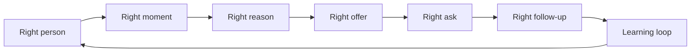

# Internal Cold Outreach Operating System

Status: private internal blueprint. Do not publish publicly without a separate review and redaction pass.

This document turns the master cold email skill into a broader outreach operating system. The system is not a cold email tool. It is a market-learning and relationship-starting system that can use email as one channel.

Core sequence:

```text
right person -> right moment -> right reason -> right offer -> right ask -> right follow-up
```

The goal is not to send more email. The goal is to start qualified conversations while consuming the least possible market trust.

North star:

```text
qualified conversations started per unit of market trust consumed
```

Every cold email spends trust. The best system treats trust as the scarce resource, not inbox volume, automation capacity, or meetings booked.

## Best Taste Decision

Separate scale outreach from relationship outreach. Those are different products hiding inside one category.

High-volume mode should feel like instrumented experimentation.

Strategic mode should feel like an elite chief of staff preparing a note for a founder.

Investor mode should feel like YC discipline: short, factual, no hype.

Recruiting mode should feel candidate-centered.

PR and podcast mode should protect the recipient's audience.

Same engine, different standards.

## Prime Flow



Every stage has a gate. If the gate fails, do not write the email yet.

| Stage           | Question                                                                         | Owned By                      | Output                             | Failure Mode               |
| --------------- | -------------------------------------------------------------------------------- | ----------------------------- | ---------------------------------- | -------------------------- |
| Right person    | Is this recipient plausibly responsible for the pain, decision, or relationship? | ICP and Signal Engine         | Qualified person/account           | Generic list or wrong role |
| Right moment    | Is there a current signal that makes outreach timely?                            | Signal Engine                 | Verified trigger or timing thesis  | Evergreen spam             |
| Right reason    | Can we explain why we are writing this person now?                               | Research Engine + Taste Layer | Research anchor plus bridge        | Decorative personalization |
| Right offer     | What useful artifact can we give before asking for anything?                     | OfferLab                      | Offer hypothesis and artifact spec | Meeting-first pitch        |
| Right ask       | What is the smallest useful yes?                                                 | Outreach Compiler             | CTA matched to trust level         | Too much friction          |
| Right follow-up | What happens after silence, yes, no, objection, or referral?                     | Sequence Engine + Reply OS    | Cadence and reply routes           | Dead thread or pressure    |

## System Shape

The best version has ten layers:

1. Source of Truth Layer
2. ICP and Signal Engine
3. Research Engine
4. OfferLab
5. Outreach Compiler
6. Taste Layer
7. Deliverability Control Plane
8. Sequence and Cadence Engine
9. Reply Operating System
10. Learning Loop

These are not UI sections first. They are responsibility boundaries. A lightweight internal version could live in docs, spreadsheets, CRM fields, and manual review before becoming productized software.

## Evaluation Register

Use this register when testing the system. The point is not to answer everything upfront. The point is to make unknowns visible so a human or agent can convert them into experiments, child skills, templates, or review gates.

### Current Unknowns

| Unknown                            | Why It Matters                                                                | How To Answer It                                                                           |
| ---------------------------------- | ----------------------------------------------------------------------------- | ------------------------------------------------------------------------------------------ |
| ICP and signal quality             | The whole system depends on "right person" and "right moment" being true.     | Score signals before sending and compare against positive replies.                         |
| Artifact-offer resonance by market | OfferLab is only useful if the artifact creates replies for the actual buyer. | Test 2-3 artifact offers per segment and track positive reply rate.                        |
| Research-depth threshold           | Too little research feels generic; too much research does not scale.          | Compare Level 3 vs Level 4/5 anchors by mode and recipient seniority.                      |
| Real deliverability baseline       | The system cannot recommend volume without actual sender health.              | Run a deliverability readiness check before every volume test.                             |
| Artifact production capacity       | If replies ask for the artifact, the sender must deliver fast.                | Time how long each artifact takes to produce and cap sends accordingly.                    |
| Market-trust cost metric           | "Trust consumed" is the north star denominator, but it needs proxies.         | Track negative replies, opt-outs, complaints, ignored follow-ups, and embarrassment score. |
| Approved proof assets              | Unsupported proof creates reputational and legal risk.                        | Build a proof library with claim, evidence, approval, and expiration.                      |
| Human review requirement           | Some modes may need full human approval while others can use lighter review.  | Define approval gates by mode, sender, risk, and audience.                                 |
| Reply automation boundary          | Replies are where trust can be preserved or destroyed.                        | Start with suggested replies only; measure edits and misclassification.                    |
| Compliance boundaries              | Privacy, opt-out, consent, and regulated claims change by market.             | Add a compliance review path before scaling or entering sensitive markets.                 |

### Current Weaknesses

| Weakness                                      | Consequence                                                       | Follow-On Work                                                                                                            |
| --------------------------------------------- | ----------------------------------------------------------------- | ------------------------------------------------------------------------------------------------------------------------- |
| Schemas are still conceptual                  | Agents may improvise fields differently across runs.              | Create templates for market thesis, source of truth, offer hypothesis, campaign bundle, reply route, and learning record. |
| No scoring model yet                          | "Good signal" and "good taste" may stay subjective.               | Build rubrics for signal quality, taste review, bridge quality, and trust cost.                                           |
| OfferLab needs examples by mode               | The offer layer is strong conceptually but thin operationally.    | Build child-skill examples for services, SaaS, investor, recruiting, PR, partnerships, and research.                      |
| Source of Truth is not implemented            | Claims may be hard to trace during real use.                      | Build a spreadsheet/CRM schema and require source URLs for claims.                                                        |
| Reply OS is not operationalized               | Hot replies may sit or get mishandled.                            | Define statuses, owners, SLAs, response templates, and escalation rules.                                                  |
| Deliverability is not connected to monitoring | The skill can state rules but cannot see sender health by itself. | Build a deliverability readiness checklist and data intake format.                                                        |
| Proof governance is missing                   | Teams may overclaim or use stale evidence.                        | Create a proof-asset library with approval status and allowed language.                                                   |
| Stop/recycle rules need detail                | Campaigns may continue after the thesis is already weak.          | Define thresholds for stop, iterate, recycle, or declare a segment dead.                                                  |
| Multi-channel strategy is underdeveloped      | Relationship-building often happens outside email.                | Map LinkedIn, warm intros, content, events, communities, and calls as tangential skills.                                  |
| Human-in-the-loop standards are not formal    | Risky drafts could ship without the right review.                 | Create approval tiers by mode and risk.                                                                                   |

## 1. Source of Truth Layer

Purpose: own durable facts and make every claim in an email traceable.

The system should never say "saw you are hiring RevOps" unless it knows:

- where that signal came from
- when it was captured
- whether it is still current
- how it connects to the reason for outreach

Entities:

- Account
- Person
- Role
- Buying committee
- Public signal
- Research anchor
- Customer-language quote
- Offer hypothesis
- Proof asset
- Outreach draft
- Send plan
- Reply
- Learning record

Minimum fields for a source-of-truth row:

```yaml
account:
    name:
    website:
    industry:
    size_band:
    stage:
person:
    name:
    role:
    seniority:
    function:
    email:
    linkedin:
signal:
    type:
    source_url:
    captured_at:
    freshness:
    why_it_matters:
research_anchor:
    source:
    quote_or_detail:
    specificity_level:
    bridge_to_offer:
proof_asset:
    type:
    claim:
    evidence:
    allowed_to_use: true|false
```

Rules:

- No untraceable claim goes into outreach.
- No stale signal becomes the reason for writing without a freshness note.
- No proof asset is used unless it has evidence and permission.
- Every draft should be reconstructable from source data.

## 2. ICP and Signal Engine

Purpose: turn a market thesis into small, explainable, testable segments.

Bad input:

```text
VPs of Sales at SaaS companies
```

Better input:

```text
Series A B2B SaaS companies hiring their first RevOps leader after adding 10+ AEs.
```

The engine should define:

- persona
- buying committee role
- company type
- trigger or moment
- likely pain
- artifact offer candidate
- disqualification criteria

Segment schema:

```yaml
segment:
    name:
    persona:
    company_filter:
    signal:
    pain_hypothesis:
    timing_thesis:
    artifact_offer:
    disqualifiers:
    expected_objections:
```

Segmentation gates:

- Can this segment be described in one sentence?
- Does every recipient share the same reason for receiving the email?
- Is the signal current enough to matter?
- Would reply data from this segment teach us something clean?
- Are the persona and offer aligned?

Reject:

- mixed functions
- mixed seniority
- mixed company stages
- weak titles with no signal
- lists built because they are easy to buy

## 3. Research Engine

Purpose: find the one anchor that makes the outreach make sense.

The research engine should not dump facts into the draft. It should identify the best usable anchor and the bridge from that anchor to the offer.

Research surfaces:

- LinkedIn posts and profile changes
- company site and product launches
- job posts and hiring patterns
- funding announcements
- podcasts, talks, interviews
- earnings calls and 10-Ks
- customer reviews
- tech stack changes
- competitor movement
- public buyer-language sources

Research output:

```yaml
research_anchor:
    source_url:
    source_type:
    exact_detail:
    date:
    specificity_level: 0-5
    why_it_matters:
    bridge:
    confidence:
```

Taste rule:

```text
The anchor is only useful if it causes the outreach.
```

If the anchor can be removed and the email still makes equal sense, the anchor is decorative. Re-dig or change the offer.

## 4. OfferLab

Purpose: treat offers as hypotheses, not copy choices.

The OfferLab asks:

- Who has this pain?
- What moment makes it urgent?
- What proof do we have?
- What useful artifact can we give first?
- What is the smallest useful yes?
- What would make this worth replying to even if they never buy?

Offer hypothesis schema:

```yaml
offer_hypothesis:
    segment:
    pain:
    desired_outcome:
    artifact:
    artifact_format:
    production_cost:
    proof:
    smallest_yes:
    follow_up_path:
    success_metric:
```

Strong artifact examples:

- teardown
- benchmark
- signal report
- sample list
- diagnosis
- one-page note
- buyer-language audit
- competitor snapshot
- risk map
- candidate slate
- topic angle list
- fundraising deck review note

Offer gates:

- Is this useful before a meeting?
- Can the sender credibly produce it?
- Is it specific to the segment or recipient?
- Does it open the loop to the core offer?
- Is the ask smaller than the trust already earned?

Reject:

- "worth a chat?"
- a calendar link as the offer
- a Loom as the offer
- vague "ideas"
- unsupported ROI claims
- offers that require the recipient to admit an embarrassing problem

## 5. Outreach Compiler

Purpose: convert structured context into a mode-correct outreach bundle.

It is not a template writer. It is a compiler with linting.

Input:

```yaml
mode: strategic-account
recipient:
    name:
    role:
    company:
segment:
    persona:
    signal:
research_anchor:
    exact_detail:
    bridge:
offer:
    artifact:
    smallest_yes:
proof:
    claim:
    evidence:
constraints:
    cadence:
    sender:
    deliverability_status:
```

Output:

- mode and why
- subject
- preview text
- body
- proof slot
- CTA
- cadence
- reply routes
- risk flags
- refusal note if any gate fails

Compiler lint checks:

- missing mode
- mixed persona
- weak or stale signal
- missing research bridge
- fake personalization
- unsupported proof
- too many CTAs
- meeting-first ask
- generic subject
- missing preview
- bad cadence
- deliverability not verified
- investor mode using sales language

## 6. Taste Layer

Purpose: protect the sender's reputation and the recipient's time.

The taste layer is the shame function. It asks whether the outreach would still feel acceptable if the recipient screenshotted it publicly.

Taste questions:

- Would a serious person send this?
- Does it sound like a real human?
- Is the specificity earned?
- Is the ask proportional to the trust level?
- Is this useful even if they never buy?
- Is the proof true and allowed?
- Does the sender have standing to make this offer?
- Would the recipient feel respected if they say no?

Taste failures:

- fake warmth
- brittle personalization
- "just checking in" follow-ups
- inflated claims
- hidden sales pitch
- over-optimized subject lines
- sequence pressure
- flattery pretending to be research

Taste verdict:

```yaml
taste_review:
    verdict: pass|revise|do_not_send
    reason:
    highest_risk_line:
    fix:
```

## 7. Deliverability Control Plane

Purpose: treat sending as infrastructure, not a campaign setting.

Controls:

- domain inventory
- inbox inventory
- SPF/DKIM/DMARC
- warmup status
- inbox rotation
- bounce rate
- spam complaint rate
- daily send caps
- domain reputation
- suppression lists
- unsubscribe and opt-out handling
- throttling rules

Rules:

- Do not send volume campaigns without verified sender health.
- Start around 30 emails per inbox per day.
- Do not exceed 50 per inbox per day without evidence.
- Keep roughly 250 emails per domain per day as the ceiling.
- Max 5 inboxes per domain.
- Spam complaints must stay under 0.1%.
- If sender trust is unknown, send manually or at very low volume.

Deliverability output:

```yaml
deliverability_check:
    status: pass|blocked|manual_only
    domains:
    inboxes:
    daily_cap:
    warmup_status:
    complaint_rate:
    bounce_risk:
    required_fixes:
```

## 8. Sequence and Cadence Engine

Purpose: make follow-up mode-aware.

Cadence by mode:

| Mode                   | Cadence                       | Rule                                       |
| ---------------------- | ----------------------------- | ------------------------------------------ |
| High-volume offer test | Day 0, day +3, stop           | Recycle non-responders into a new angle    |
| Strategic-account      | Day 0, +2, +4, +6             | Follow-ups redirect to original thread     |
| Single-target          | 4 touches max                 | Preserve context, no fresh pitch each time |
| Reply revival          | One numbered fork             | Use after meaningful silence               |
| Investor               | Short initial, slow follow-up | No sales pressure, no meeting-first ask    |

Sequence gates:

- Does every follow-up have a job?
- Does the follow-up redirect rather than re-pitch?
- Is there a stop condition?
- Is there a reply route for each likely response?
- Is the cadence appropriate for sender trust?

## 9. Reply Operating System

Purpose: preserve momentum after the reply.

Reply classes:

- yes / interested
- no
- not now
- wrong person
- already solved
- send info
- objection
- referral
- angry reply
- ambiguous interest
- numbered fork response

Reply route schema:

```yaml
reply_route:
    class:
    intent_level:
    next_action:
    response_template:
    artifact_to_send:
    owner:
    sla:
```

Rules:

- A hot reply should not sit overnight.
- "Send info" gets the promised artifact, not a brochure.
- "Not now" becomes a dated follow-up with context.
- "Wrong person" gets a respectful owner request.
- "No" gets honored.
- Ambiguous replies get a small clarifying question.
- A numbered fork response routes to the matching path.

The reply OS should optimize for preserving trust, not forcing the next sales step.

## 10. Learning Loop

Purpose: make every campaign teach the system something.

Track:

- open rate
- reply rate
- positive reply rate
- objection mix
- meeting conversion
- reply-to-meeting lag
- segment quality
- offer resonance
- proof usefulness
- sender reputation
- time to reply
- buyer language in replies

Learning record:

```yaml
learning_record:
    segment:
    offer:
    send_count:
    open_rate:
    reply_rate:
    positive_reply_rate:
    meeting_rate:
    top_objections:
    buyer_language:
    winning_lines:
    losing_lines:
    next_test:
```

The system should learn statements like:

```text
This persona does not respond to cost savings. They reply when the offer is framed around speed-to-diagnosis.
```

That learning should change the next segment, offer, subject, proof slot, and reply route.

## Product Workspaces

If this becomes software, the product should have five workspaces:

1. Market Map
2. OfferLab
3. Campaign Builder
4. Inbox Command Center
5. Learning Board

### Market Map

Defines ICPs, segments, accounts, signals, people, buying committees, and disqualifiers.

Primary question:

```text
Who should receive outreach, and why now?
```

### OfferLab

Designs and tests artifact offers before copy is written.

Primary question:

```text
What can we give before we ask?
```

### Campaign Builder

Compiles source-of-truth data, mode, offer, proof, and sender constraints into a campaign bundle.

Primary question:

```text
What is the cleanest mode-correct outreach bundle?
```

### Inbox Command Center

Classifies replies, drafts responses, routes owners, and enforces follow-up SLAs.

Primary question:

```text
What is the next trust-preserving action?
```

### Learning Board

Synthesizes what the market is telling us.

Primary question:

```text
What did we learn that should change the next test?
```

## Operating Modes

The system should separate scale outreach from relationship outreach.

| Mode              | Product Feel                        | Primary Standard                                 |
| ----------------- | ----------------------------------- | ------------------------------------------------ |
| High-volume       | Instrumented market experimentation | Clean segment, real artifact, sender health      |
| Strategic         | Elite chief-of-staff note prep      | Real research, strong bridge, credible proof     |
| Single-target     | Relationship opener                 | Specificity, restraint, proportional ask         |
| Investor          | YC-style clarity                    | Short, factual, no meeting-first ask             |
| Recruiting        | Candidate-centered                  | Why this person, why this role, enough detail    |
| PR / podcast      | Audience-protective                 | Fit for their audience before sender credentials |
| Partnership       | Mutual leverage                     | One collaboration idea, not a menu               |
| Customer research | Honest research                     | Disclosed intent and useful counter-gift         |

Same engine, different standards.

## Manual MVP For Testing Now

Use this lightweight workflow before building software.

1. Pick one market thesis.
2. Build a 20-account source-of-truth sheet.
3. Add one persona and one signal per account.
4. Score each signal for freshness and relevance.
5. Write 3 OfferLab hypotheses.
6. Select one artifact offer.
7. Compile 5 strategic emails or 25 volume emails.
8. Run the taste layer before sending.
9. Verify deliverability or send manually from a real sender.
10. Pre-write reply routes.
11. Send only after human confirmation.
12. Log every reply and objection.
13. Run a learning review after the first signal set.

Minimum test artifacts:

- Market thesis
- Segment definition
- Source-of-truth sheet
- Offer hypothesis
- Campaign bundle
- Reply route map
- Learning record

## Build Roadmap

### Phase 1: Internal Docs and Manual Runs

- Use the source-of-truth schema in a spreadsheet.
- Use the master skill to compile bundles.
- Manually run taste review.
- Manually log replies.
- Produce a learning memo after each test.

### Phase 2: Structured Templates

- Create reusable templates for market thesis, segment, offer hypothesis, campaign bundle, reply route, and learning record.
- Add validation rules for missing signals, stale anchors, and unsupported proof.
- Build a small library of artifact-offer examples.

### Phase 3: Semi-Automated System

- Connect CRM/list data.
- Add enrichment and source links.
- Generate draft bundles with explicit citations.
- Add a human approval queue.
- Add reply classification and suggested responses.

### Phase 4: Productized OS

- Entity graph for accounts, people, signals, offers, proof, outreach, replies, and learnings.
- Mode-aware compiler.
- Deliverability control plane.
- Inbox command center.
- Learning board that updates segment and offer recommendations.

## Non-Negotiables

- Do not send without human confirmation.
- Do not fabricate research, proof, metrics, or mutual contacts.
- Do not hide sales intent behind fake warmth.
- Do not publish this blueprint publicly without review.
- Do not optimize for sends.
- Do not treat meetings booked as the only success metric.
- Do not spend market trust casually.
