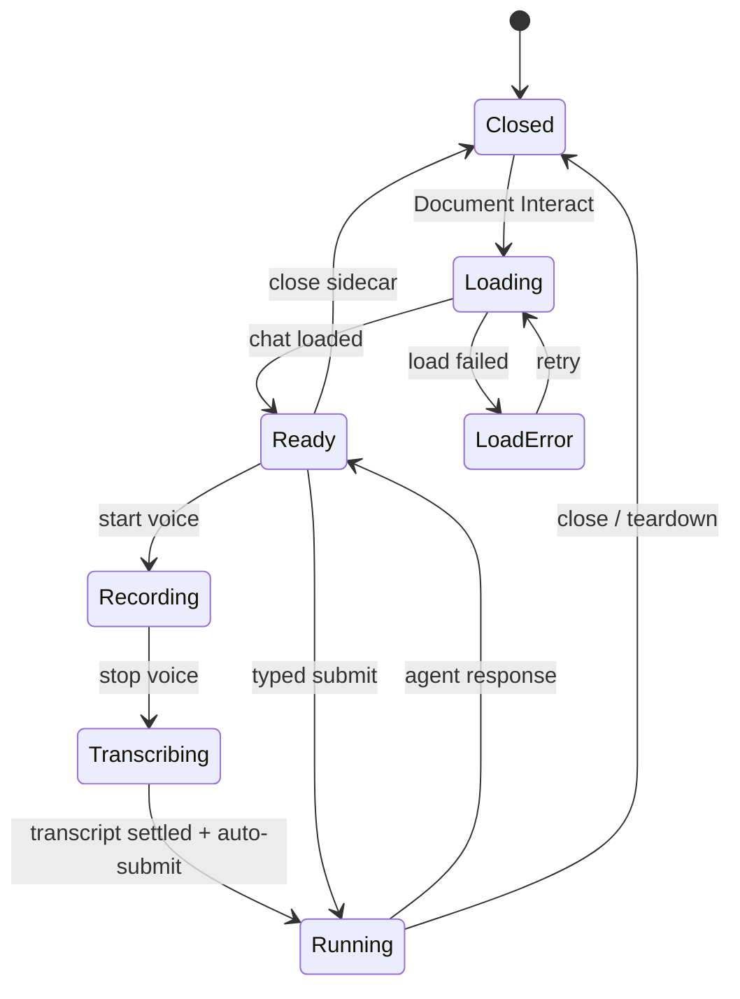

<!-- docs/specs/DOCUMENT_INTERACT_V0_2026-08-04.md -->

# Document Interact v0

**Status:** First vertical slice implemented on the dedicated document workspace  
**Surface:** `/projects/[id]/documents/[document_id]`  
**Date:** 2026-08-04

## Product intent

Document Interact lets someone keep reading or editing a document while they talk to a
document-scoped agent. It is for answering questions already present in the document,
asking questions about the material, and giving revision instructions without moving the
document into a separate chat flow.

The central constraint is continuity: opening, recording, stopping, and reviewing the
agent response must not reset the document's scroll position or replace the workspace with
a modal.

## V0 interaction

1. The sticky document header exposes **Document Interact**.
2. Activating it opens a dismissible sidecar on the left edge. There is no backdrop or
   document scroll lock.
3. The sidecar starts the existing agent chat with a fixed project + document focus.
4. The user may type or record. In this surface, explicitly stopping voice capture marks
   the transcript for submission; the existing transcription lifecycle sends it only after
   recording, media flush, and transcription have all settled.
5. The full agent conversation remains visible in the sidecar. The document remains
   editable and independently scrollable behind it.
6. Closing the sidecar finalizes the chat session. If the agent mutated project data, the
   workspace refreshes. If the document has unsaved local edits, refresh is deferred and a
   conflict warning is shown instead of overwriting local work.

## Interaction states



## Architecture

### UI composition

- `DocumentInteractDock.svelte` owns the non-modal sidecar chrome, lazy loading, document
  focus, and session-close callback.
- `AgentChatModal.svelte` remains the single chat/session/agent runtime. It runs in embedded
  mode rather than being copied into a new document-only chat implementation.
- `AgentComposer.svelte` and `TextareaWithVoice.svelte` expose a narrow
  `onVoiceStopRequested` seam. `autoSendVoiceOnStop` is opt-in at the chat host, so existing
  voice composers keep their current behavior.
- The document focus page owns refresh and local-edit conflict behavior because it owns the
  editor snapshot and `expected_updated_at` value.

### Context contract

Every Document Interact session supplies a `ProjectFocus` with:

```ts
{
  focusType: 'document',
  focusEntityId: document.id,
  focusEntityName: document.title,
  projectId: project.id,
  projectName: project.name
}
```

This reuses the existing document-aware context loader and document read/write tools. No
document body is copied into a second client-side prompt.

### Voice contract

Voice capture remains a three-phase operation:

1. record audio and optional live preview;
2. stop and flush the recorder;
3. transcribe/refine, then return to idle.

The auto-submit flag is set on the user's stop intent, not on a timer and not on a partial
live transcript. The existing pending-send guard waits until `isRecording`, `isStopping`,
`isInitializing`, and `isTranscribing` are all false before submitting.

### Mutation and conflict contract

- Agent writes use the existing ontology tool path and remain auditable chat mutations.
- The document page refreshes only after the sidecar session reports successful mutations.
- A dirty local editor is never silently replaced. The page retains local state and shows a
  warning; the existing `expected_updated_at` guard prevents a later save from silently
  clobbering the agent's version.
- A later iteration should refresh after each completed mutating turn rather than waiting
  for sidecar close.

## Visual system

The sidecar uses one overlay surface only, is explicitly dismissible, and has no backdrop.
Its fixed geometry keeps the document from reflowing. The treatment follows the Inkprint
paper stack and Hyperplexed patterns:

- fixed icon containers and one icon system (`P9`);
- micro-label hierarchy in the compact header (`P5`);
- primitive/focus/touch-target behavior for controls (`P13`);
- reduced-motion fallbacks for entry and loading motion (`P11`);
- explicit overflow and truncation for user-supplied document titles (`P1`).

## Next slices

### 1. Viewport and selection anchors

Capture an optional interaction anchor when recording begins:

```ts
interface DocumentInteractionAnchor {
	documentId: string;
	documentUpdatedAt: string | null;
	selectedText: string | null;
	headingPath: string[];
	cursorOffset: number | null;
	scrollTop: number;
}
```

The agent should receive the selected text plus a bounded surrounding section, not a DOM
coordinate as semantic context. `scrollTop` is only for restoring the user's view after a
refresh.

### 2. Proposal-first document writes

For broad rewrites or ambiguous comments, stage a document diff and show `Apply`, `Revise`,
and `Dismiss` in the sidecar. Direct writes can remain appropriate for explicit, bounded
requests such as “answer the three questions under Decisions.” All applies should include
the source document version.

### 3. Turn-level refresh

Add a typed `onTurnSettled` callback to the chat runtime. Publish mutation summaries per
turn, refresh a clean editor immediately, and preserve selection + scroll across the new
document value. Continue to defer when the local editor is dirty.

### 4. Question awareness

Build a document-question index from headings, checklist items, and question-mark sentences.
Use it for optional navigation chips such as “3 unanswered questions,” not as a required
preprocessing step. The agent remains able to reason over arbitrary document prose.

### 5. Shared entity interaction shell

Once the document behavior is stable, extract only the proven chrome and lifecycle into an
`EntityInteractDock`. Tasks can then supply a task `ProjectFocus`, task-specific anchor data,
and the same voice-stop submission contract without forking the agent runtime.

## Success signals

- percentage of opened sidecars that produce a submitted turn;
- voice-stop-to-turn-start latency;
- percentage of document interactions that lead to a document mutation;
- conflict-deferral rate when local edits exist;
- reopen/resume rate for the same document session;
- user cancellation rate during recording, transcription, and agent execution.
