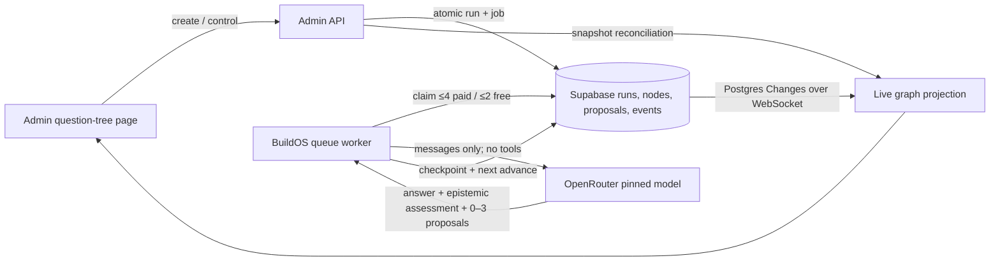
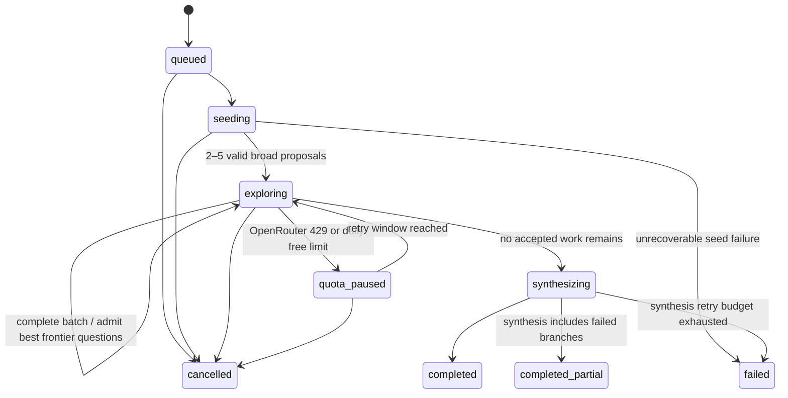

<!-- docs/specs/question-tree-admin-experiment-spec.md -->

# Question Tree Admin Experiment

**Date:** 2026-08-01  
**Status:** Implemented V1; see the adjacent test runbook  
**Surface:** BuildOS admin  
**Working name:** Question Tree

## 1. Decision summary

Build an admin-only experiment that starts with one root question, asks a model for a few broad
research sub-questions, and recursively assigns the most valuable sub-questions to model-only agents.
Each question agent returns:

1. an answer to its assigned question;
2. a compact assessment of what is probably right, probably wrong, and still uncertain;
3. zero to three high-value follow-up questions; and
4. a concise reason for stopping or continuing.

The run has an absolute database-enforced limit of **100 descendant question nodes**. The
original question is visual node `0` and does not consume that budget, so a full graph can
contain 101 visible nodes. After all accepted nodes settle, one final model call receives a
bounded serialization of the entire tree and writes the root synthesis.

Version 1 is deliberately model-only:

- no web search;
- no BuildOS tools;
- no project or workspace mutations;
- no hidden tool schemas in model requests;
- no recursive model-controlled dispatch;
- the application, not the model, owns scheduling and the hard budget.

The technically accurate name is “question tree,” not “decision tree”: edges represent new
lines of inquiry, not conditional choices or outcomes. “Decision Tree” can remain informal
product language if desired.



## 2. Product goal

This experiment is meant to answer two questions:

1. Can many very cheap, narrow model calls explore a question more usefully than one ordinary
   response?
2. Can BuildOS make that exploration legible enough that an admin can understand where the
   final answer came from, inspect weak branches, and search the complete run?

Success is not “the model generated 100 nodes.” Success is a useful, inspectable tree whose
branches stop when there is no meaningful question left to ask.

## 3. Scope

### In scope for V1

- Admin-only create, inspect, pause, resume, cancel, whole-run retry, and failed-node retry controls.
- One root question per run.
- Two to five broad initial questions when the seed call succeeds.
- Zero to three follow-up proposals from every question node.
- Best-first, depth-seeking assignment based on uncertainty reduction and falsification value.
- At most four paid-lane or two free-lane model calls in flight for one run.
- A hard limit of 100 descendant nodes.
- Durable execution across worker restarts.
- Live graph updates through Supabase Realtime Postgres Changes, with a 12-second snapshot
  reconciliation fallback while a run is active.
- Full node inspection: question, answer, and every proposed follow-up.
- Search over questions, answers, and follow-up proposals.
- One final synthesis call after exploration settles.
- Per-node and per-run model, token, latency, and cost telemetry.
- Pinned ultra-cheap paid default and an optional strict free comparison policy.

### Explicitly out of scope

- Web search, URL visits, citations, or external evidence.
- Agent tool calls of any kind.
- BuildOS project context, ontology context, files, or user data beyond the entered question.
- Agents choosing or directly creating child agents.
- Agents messaging one another.
- Human edits to a running branch.
- Semantic embeddings or vector search.
- Exposing the experiment outside the admin panel.
- Treating model answers as verified research.
- Persisting or displaying chain-of-thought/reasoning traces.

The UI must label V1 output as **model-only analysis — not externally verified**. “Research” in
this phase means decomposition and reasoning from model knowledge, not source-backed research.

## 4. Counting and invariants

The count needs to be unambiguous:

| Item                               | Counts toward the 100-node limit? | Maximum successful calls |
| ---------------------------------- | --------------------------------: | -----------------------: |
| Root/original question             |                                No |                        0 |
| Seed decomposition                 |        No; creates root proposals |                        1 |
| Accepted descendant question nodes |                               Yes |                      100 |
| Final synthesis                    |                                No |                        1 |

A cap-filling run therefore uses **102 successful model calls**: one seed call, 100 question-agent
calls, and one synthesis call. Parse retries and provider retries are tracked separately and
are limited by a provider-request budget.

Hard invariants:

1. `node_number = 0` is the single root node.
2. Descendant `node_number` is in `1..100`.
3. `(run_id, node_number)` is unique.
4. A run's configured `node_limit` is in `1..100` and defaults to `100`.
5. A non-root node has exactly one parent in the same run.
6. The root can record at most five seed proposals; a question node can record at most three.
7. Only a service-role database function can convert proposals into child nodes.
8. Failed nodes still consume their assigned node number; retries cannot grow the tree.
9. Synthesis can start only when there are no queued or running question nodes.
10. A cancelled run cannot enqueue or start new model calls.

The absolute 100-node invariant is enforced by the descendant `node_number` check plus the
per-run unique constraint. It does not depend only on an application-side `COUNT(*)` check.

## 5. Run lifecycle



Suggested run statuses:

- `queued`
- `running`
- `quota_paused`
- `paused`
- `synthesizing`
- `completed`
- `completed_partial`
- `cancelled`
- `failed`

The more detailed phase (`seed`, `explore`, `synthesize`) should be a separate field. Keeping
status and phase separate avoids multiplying status combinations.

## 6. Orchestration algorithm

### 6.1 Ownership boundary

The model only proposes content. The deterministic orchestrator owns:

- validation;
- deduplication;
- proposal ranking;
- node-number reservation;
- queueing;
- concurrency;
- rate limits;
- retries;
- cancellation;
- deciding when synthesis may begin.

Calling each model request an “agent” is useful in the UI, but these are logical, one-turn
agents. They are not long-lived processes and do not receive agent tools.

### 6.2 Durable advance jobs

Use a dedicated queue type such as `admin_question_tree`, with job metadata:

```ts
type QuestionTreeJob = {
	run_id: string;
	advance_sequence: number;
};
```

One job performs one bounded advance:

1. Lock and reload the run.
2. Exit idempotently if the run is terminal or the sequence is stale.
3. Recover expired node leases from a previous worker crash.
4. If phase is `seed`, make the one seed call and persist its proposals.
5. If phase is `explore`, claim at most the run's bounded concurrency (four paid or two free)
   and run them concurrently.
6. Persist each result independently as it returns.
7. After the claimed batch settles, deterministically score the complete open proposal frontier.
8. Admit the highest-value questions while preserving limited branch diversity.
9. If work remains, atomically increment `advance_sequence` and enqueue the next advance.
10. If no work remains, transition to `synthesize` and enqueue the next advance.
11. In `synthesize`, build the bounded tree packet, call the final model, and complete the run.

The job should not hold a database transaction while waiting on OpenRouter. Claims use leases;
result persistence uses short service-role RPCs.

Free mode also needs a persistent request-start limiter. Dispatch at most two requests in a
batch and start free batches no more often than every 35 seconds (or use an equivalent durable
token bucket capped below 20 requests/minute). Store `next_batch_not_before` on the run so a
worker restart cannot reset the limiter. Seed and synthesis calls consume the same allowance.
Paid mode retains the four-call concurrency cap even when its provider quota is higher.

Use a unique deduplication key per advance, for example
`question-tree:{runId}:advance:{advanceSequence}`. A constant key would collide with the
currently processing job when it tries to enqueue its continuation.

### 6.3 Epistemic litmus test

A follow-up question is valid only if the node can identify the claim or unknown it targets and
explain how learning the answer could materially change confidence in the current thesis.

Every proposed question must do at least one of these:

1. **Resolve an unknown:** obtain information the agent says it needs but does not currently have.
2. **Strengthen the thesis:** test or support a claim on which the answer materially depends.
3. **Try to disprove the thesis:** look for a counterexample, contradictory fact, failed
   assumption, alternative explanation, or boundary condition.

Canonical prompt heuristic:

> Given the answer you just produced, what are you probably right about, probably wrong about,
> and unsure about? What information would you need to research to know? Propose only the one to
> three questions whose answers would most strengthen the thesis or most credibly disprove it.

“What else is interesting about this topic?” is not enough. If the answer would not strengthen,
weaken, refine, or overturn a material part of the thesis, the question must not be proposed.

### 6.4 Best-first depth-seeking scheduler

The global frontier contains valid, unspawned proposals from every completed node. V1 does not
wait for an entire depth to finish and does not try to fill every branch evenly.

After each model-call batch settles:

1. Add its valid, nonduplicate proposals to the frontier.
2. Calculate a deterministic priority from:
    - model-provided importance and expected information gain;
    - `falsify` or `resolve_unknown` purpose;
    - direct relevance to a material root or ancestor claim;
    - novelty versus questions already answered;
    - a bounded depth bonus so promising chains continue downward;
    - a penalty for repeatedly expanding the same parent or near-identical line of inquiry.
3. Reserve most of the next batch for the highest-scoring questions, including deeper questions.
4. Reserve a small minority of slots for the strongest question from a different root branch so
   one early mistaken thesis cannot consume the entire run.
5. Stop when the frontier is empty or every remaining proposal falls below the minimum value
   threshold.

The scheduler admits at most three children from a normal node and at most five from the root.
It may admit only one. Unspawned proposals remain visible as `not_selected` until the run ends,
then become `budget_exhausted` or `below_threshold`.

This makes 100 a ceiling, not a target. A good run can stop at 17 nodes; a difficult run can use
all 100. Depth emerges from successive high-value unknowns rather than from forcing a particular
tree shape.

### 6.5 Deduplication without another model call

Normalize each proposal by:

- Unicode normalization;
- lowercase conversion;
- whitespace and punctuation normalization;
- removing a trailing question mark;
- collapsing common stop words only for the similarity comparison.

Reject exact normalized duplicates with a unique `(run_id, normalized_question)` index. Use a
deterministic token-set/Jaccard or trigram threshold for near duplicates. Store duplicates as
proposals with `status = 'duplicate'` and a pointer to the matching node/proposal.

Do not use an embedding model in V1; it adds cost and another unbounded inference path.

### 6.6 Retry and failure behavior

- Locally clean and parse the first JSON object, then use the shared deterministic truncated-JSON
  repairer before failing the node. Repair does not spend another model call.
- Allow transient HTTP retries only when the provider definitively did not generate a response,
  or when retry metadata makes duplicate billing impossible to avoid.
- Honor `Retry-After` on `429` and `503`.
- A daily free-quota failure moves the run to `quota_paused`; it never switches to a paid model
  unless the run was explicitly created with a paid policy.
- A terminal node failure is visible and produces no child proposals. Other branches continue.
- An admin can atomically requeue one failed question node without changing its node number or
  retrying successful siblings.
- Synthesis runs when all admitted nodes are terminal, even if some failed, and reports coverage.

Default logical provider-request budget: `125`. It includes seed, exploration, and synthesis.
Transient transport attempts are additionally bounded to three total attempts per logical call.
This is separate from the 100-node budget.

## 7. Model contracts

All contracts are parsed and validated locally before persistence. Unknown keys are ignored and
required values receive character, enum, and numeric bounds.

### 7.1 Seed output

The seed model sees the root question and returns two to five broad lines of inquiry. It should
choose the smallest set that covers the major unknowns, assumptions, and plausible ways the
eventual thesis could be wrong:

```ts
type SeedOutput = {
	questions: Array<{
		question: string;
		unknownAddressed: string;
		whyItMatters: string;
		purpose: 'frame' | 'resolve_unknown' | 'falsify';
		expectedInformationGain: 'medium' | 'high';
	}>;
};
```

Requirements:

- two to five items, never padded to reach five;
- every question stands alone without relying on “this” or “it” ambiguously;
- questions cover meaningfully different, broad aspects of the root;
- each names the uncertainty or assumption it is meant to expose;
- no answer is generated during seeding;
- each question is at most 300 characters;
- `unknownAddressed` and `whyItMatters` are each at most 240 characters.

### 7.2 Question-agent output

```ts
type QuestionNodeOutput = {
	answer: string;
	thesis: string;
	confidence: number;
	claims: Array<{
		statement: string;
		status: 'probably_right' | 'probably_wrong' | 'unsure';
		basis: string;
	}>;
	followUpQuestions: Array<{
		question: string;
		purpose: 'strengthen' | 'falsify' | 'resolve_unknown';
		targetClaim: string;
		whyItMatters: string;
		expectedInformationGain: 'low' | 'medium' | 'high';
		priority: number;
	}>;
	stopReason:
		| 'sufficiently_answered'
		| 'remaining_unknowns_not_material'
		| 'no_nonduplicate_followups'
		| 'uncertain_without_external_evidence'
		| 'followups_proposed';
};
```

Requirements:

- directly answer the assigned question first;
- state the node's current thesis in one concise sentence;
- classify one to six material claims as probably right, probably wrong, or unsure, with a short
  basis; do not invent claims merely to populate all three categories;
- never claim to have searched or consulted sources;
- return zero to three follow-ups and never pad the list;
- every follow-up must target a named claim or unknown and say whether it would strengthen,
  falsify, or resolve uncertainty in the thesis;
- `priority` must be between 0 and 1 and is advisory; the scheduler recalculates final priority;
- prefer a disconfirming question when the thesis depends on an untested assumption;
- avoid ancestors supplied in the prompt;
- answer target: no more than 350 words, with a 1,200–1,800 token output envelope including the
  epistemic assessment and follow-ups;
- no citations, URLs, tool requests, or hidden reasoning.

The node prompt contains only:

- the root question;
- the assigned question;
- its ancestor question path;
- short ancestor theses and epistemic assessments when available;
- remaining global slots as a hint, not authority;
- the output schema and model-only limitations.

It does not contain sibling branches or the full tree. That keeps calls small and branches
independent.

### 7.3 Synthesis output

```ts
type SynthesisOutput = {
	answer: string;
	finalThesis: string;
	keyFindings: string[];
	probablyRight: string[];
	probablyWrong: string[];
	stillUnsure: string[];
	disagreements: string[];
	unresolvedQuestions: string[];
	coverage: {
		completedNodes: number;
		failedNodes: number;
		deepestLevel: number;
	};
	confidence: number;
};
```

The final model receives a deterministic, preorder tree packet containing node number, parent
number, depth, question, answer, thesis, claim assessments, and the statuses and purposes of
every proposal. It must explain which branches strengthened the final thesis, which challenged
it, and which uncertainties remain. It does not receive provider reasoning tokens.

The per-node bounds keep a 100-node packet comfortably inside the candidate models' context
windows. Before dispatch, the worker must still calculate the packet size and fail closed rather
than silently omit nodes. If trimming is ever required, it must be recorded in `coverage` and the
run must complete as partial.

## 8. OpenRouter model research and routing policy

This model snapshot is current as of **2026-08-01** and must not be treated as permanent
configuration. OpenRouter model availability and pricing change frequently.

### 8.1 Current candidates

| Purpose                     | Model                             | Input / output per 1M | Context | Structured JSON                                       | ZDR-compatible endpoint observed            | Recommendation                    |
| --------------------------- | --------------------------------- | --------------------: | ------: | ----------------------------------------------------- | ------------------------------------------- | --------------------------------- |
| Deterministic cheapest paid | `inclusionai/ling-2.6-flash`      |         $0.01 / $0.03 |    262K | Yes                                                   | Yes                                         | Default experiment lane           |
| Optional free comparison    | `inclusionai/ling-3.0-flash:free` |               $0 / $0 |    262K | No advertised `response_format`; prompt + local parse | Yes, Novita endpoint in current ZDR catalog | Bakeoff/zero-cost comparison lane |
| Optional stronger synthesis | `deepseek/deepseek-v4-flash`      |   about $0.09 / $0.18 |      1M | Yes                                                   | Yes, through eligible endpoints             | Later quality toggle, off in V1   |

Sources:

- [Ling 3.0 Flash free model page](https://openrouter.ai/inclusionai/ling-3.0-flash%3Afree)
- [Ling 2.6 Flash model page](https://openrouter.ai/inclusionai/ling-2.6-flash/performance)
- [DeepSeek V4 Flash model page](https://openrouter.ai/deepseek/deepseek-v4-flash/api)
- [OpenRouter model catalog API](https://openrouter.ai/api/v1/models)
- [OpenRouter ZDR endpoint catalog](https://openrouter.ai/api/v1/endpoints/zdr)
- [OpenRouter Zero Data Retention documentation](https://openrouter.ai/docs/guides/features/zdr)

The free Ling endpoint is the notable fit for BuildOS because it was the only free text-generation
model found in the current ZDR endpoint catalog; most other free candidates would be rejected by
BuildOS's existing strict ZDR request policy.

### 8.2 Free option and funded-account assumption

OpenRouter currently documents:

- 50 free-model requests per day when the account has purchased less than $10 of credits;
- 1,000 free-model requests per day after at least $10 in lifetime credit purchases; and
- 20 free-model requests per minute.

Sources:

- [OpenRouter FAQ](https://openrouter.ai/docs/faq)
- [OpenRouter pricing](https://openrouter.ai/pricing)
- [OpenRouter free-model router](https://openrouter.ai/docs/guides/routing/routers/free-router)

The experiment owner already has a funded OpenRouter account, so the 50-request free-account
limit is not an expected blocker if the documented purchased-credit threshold has been met. The
ultra-cheap paid model remains the default because it provides deterministic structured output
without depending on free capacity and costs far below one cent for the illustrative cap-filling run.

If free mode is selected and a quota is nevertheless reached, the correct behaviors are:

1. show a preflight warning;
2. run until the provider returns its quota response;
3. persist `quota_paused` and the next retry time; and
4. continue later.

Do not use `openrouter/free` for this experiment. It intentionally chooses a random eligible
model, which makes output quality and JSON validity impossible to compare cleanly. Pin the exact
model slug and store both the requested and actual response model.

### 8.3 Strict model policies with same-model provider recovery

Expose two run policies:

```ts
type ModelPolicy = 'free_strict' | 'paid_floor_strict';
```

- `paid_floor_strict` is the default: every call uses only `inclusionai/ling-2.6-flash`, with a
  provider price ceiling and a run cost ceiling.
- `free_strict` is optional: every call uses only `inclusionai/ling-3.0-flash:free`; unavailable or
  rate-limited means pause/retry, not paid fallback.

The model ID never changes silently. OpenRouter may try another eligible provider for that same
model when the first provider is unavailable or rate-limited; the paid lane's provider price cap
still applies. This preserves comparability while avoiding a single-provider outage.

The existing `SmartLLMService.getJSONResponse()` currently appends profile models after an
explicit model. That is useful for normal reliability but violates the experiment's cost and
comparability requirements. The experiment therefore uses a small adapter that sends exactly one
allowed model ID while permitting OpenRouter's same-model provider recovery.

Every OpenRouter request must keep BuildOS's current privacy policy:

```json
{
	"provider": {
		"data_collection": "deny",
		"zdr": true,
		"require_parameters": true
	}
}
```

For the free model, omit `response_format` because the current endpoint does not advertise it.
Explicitly disable the free model's default reasoning mode so its reasoning tokens cannot consume
the short JSON output budget. For the paid model, require structured output support. Do not use the existing
evaluation-only non-ZDR escape hatch for arbitrary admin questions.

### 8.4 Cost estimate

Illustrative cap-filling envelope if all 100 node slots are used:

- roughly 200K total input tokens across seed, nodes, and synthesis;
- roughly 90K total output tokens;
- 102 successful requests;
- no format retries.

At Ling 2.6 Flash's current price, that is approximately **$0.0047 for a cap-filling run**. Most adaptive
runs should stop below 100 nodes and cost less. Even allowing
for larger prompts, retries, and price movement, a default hard cost ceiling of **$0.02 per run**
is reasonable for the pinned paid lane. The free lane is $0 in token charges but remains subject
to quota and availability.

The run-start screen should show a calculated maximum, not only an average estimate.

### 8.5 Model bakeoff before defaulting broadly

“Somewhat performant” needs evidence from this exact job. Before calling V1 stable, run a small
fixed corpus against the free and paid candidates and measure:

- valid output rate without repair;
- answer relevance;
- useful follow-up rate;
- duplicate follow-up rate;
- fraction of follow-ups tied to a specific claim or unknown;
- disconfirmation-question quality;
- depth reached before the frontier becomes low-value;
- early-stop quality;
- synthesis coverage;
- tokens, latency, and cost;
- blind admin preference on the final synthesis.

Use the same prompts and scheduler for both lanes. Store prompt version, model slug, and model
response slug with every result so model changes remain auditable.

## 9. Persistence design

The January 2026 `tree_agent_*` tables and runtime are not reusable. They were explicitly removed
as a retired/orphaned experiment by `20260730040000_phase1_retired_schema_cleanup.sql`; the old
`buildos_tree_agent` queue enum value remains only as inert compatibility residue. Create a clean,
narrow schema and do not resurrect the old planner/executor/scratchpad semantics.

### 9.1 `question_tree_runs`

Key columns:

```text
id uuid primary key
created_by uuid -> auth.users
root_node_id uuid
root_question text
status question_tree_run_status
phase question_tree_phase
model_policy text
explorer_model_requested text
synthesis_model_requested text
prompt_version text
node_limit smallint default 100 check (1..100)
nodes_created smallint default 0 check (0..100) -- excludes root
nodes_completed smallint default 0
nodes_failed smallint default 0
deepest_depth smallint default 0
frontier_count smallint default 0
advance_sequence integer default 0
max_provider_requests smallint default 125
provider_requests integer default 0
config jsonb -- immutable run snapshot
usage jsonb -- aggregate tokens/cost/latency
synthesis jsonb null
pause_reason text null
next_retry_at timestamptz null
next_batch_not_before timestamptz null
started_at / completed_at / created_at / updated_at
```

`config` snapshots concurrency, traversal policy, temperature, token caps, pricing cap, and model
slugs. A run never changes behavior because a deploy changes defaults halfway through it.

### 9.2 `question_tree_nodes`

```text
id uuid primary key
run_id uuid -> question_tree_runs on delete cascade
parent_node_id uuid null -> question_tree_nodes
node_kind root | question
node_number smallint check (0..100)
depth smallint
sibling_index smallint null check (0..4)
status queued | running | completed | failed | cancelled
question text
normalized_question text
answer text null
thesis text null
epistemic_assessment jsonb null
confidence numeric null
stop_reason text null
model_requested text null
model_used text null
provider_request_id text null
attempt_count smallint default 0
prompt_tokens / completion_tokens / reasoning_tokens
cost_usd numeric
lease_owner text null
lease_expires_at timestamptz null
error_code / error_message
started_at / completed_at / created_at / updated_at
```

Indexes and constraints:

- unique `(run_id, node_number)`;
- unique `(run_id, normalized_question)` for question nodes;
- `(run_id, parent_node_id, sibling_index)`;
- `(run_id, status, node_number)`;
- `(run_id, depth, status)`;
- full-text/search document over question and answer.

The root node stores `root_question` in `question` and the final synthesis answer in `answer`.

### 9.3 `question_tree_proposals`

Keep proposals first-class so the UI can show questions a node produced even when they were not
spawned:

```text
id uuid primary key
run_id uuid
source_node_id uuid
rank smallint check (0..4)
question text
normalized_question text
purpose strengthen | falsify | resolve_unknown | frame
target_claim text null
why_it_matters text
expected_information_gain low | medium | high
model_priority numeric null
scheduler_score numeric null
status proposed | not_selected | spawned | duplicate | invalid | below_threshold | budget_exhausted | cancelled
child_node_id uuid null
duplicate_of_node_id uuid null
validation_error text null
created_at / updated_at
```

Unique `(source_node_id, rank)` plus service-role validation limits the root to five proposals
and normal question nodes to three.

### 9.4 `question_tree_events`

Use a small append-only event log for live projection and debugging:

```text
id uuid primary key
run_id uuid
node_id uuid null
seq bigint
event_type text
payload jsonb
created_at timestamptz
unique (run_id, seq)
```

Minimum event types:

- `run.created`
- `run.phase_changed`
- `run.quota_paused`
- `node.created`
- `node.started`
- `node.completed`
- `node.failed`
- `proposal.recorded`
- `proposal.spawned`
- `proposal.rejected`
- `run.usage_updated`
- `run.completed`
- `run.failed`

Assign `seq` under a per-run advisory transaction lock. `question_tree_runs`,
`question_tree_nodes`, `question_tree_proposals`, and `question_tree_events` are members of the
`supabase_realtime` publication. A database trigger writes `node.started` in the same transaction
that claims a question node, while the seed transition writes the equivalent root event. The admin
client receives those durable changes over a WebSocket and uses the detail API only for initial load
and recovery reconciliation.

### 9.5 Security

- Enable RLS on all four tables.
- Select access requires an authenticated current BuildOS admin.
- Browser roles receive no insert/update/delete policies.
- All mutations use the server or worker service role. Orchestration RPCs have explicit privilege
  revocation from `public`, `anon`, and `authenticated`.
- The API independently verifies admin access; it does not rely only on the parent layout.
- Escape node text in Svelte. If answers render as Markdown, use the existing sanitized renderer.
- Never store provider reasoning content.

Implemented orchestration RPCs:

- `create_question_tree_run_with_job(...)`
- `enqueue_question_tree_advance(...)`
- `claim_question_tree_batch(...)`
- `admit_question_tree_proposals(...)`
- `control_question_tree_run(...)`
- `complete_question_tree_run(...)`

Creation must insert the run, root node, initial queue job, and event in one transaction, following
the repository's `create_agent_run_with_job` precedent.

## 10. BuildOS integration

### 10.1 Implemented file map

```text
apps/web/src/routes/admin/experiments/question-tree/
  +page.svelte
  [runId]/+page.ts
  [runId]/+page.svelte

apps/web/src/routes/api/admin/experiments/question-tree/
  runs/+server.ts
  runs/[runId]/+server.ts
  runs/[runId]/control/+server.ts

apps/web/src/lib/components/admin/question-tree/
  QuestionTreeCanvas.svelte
  QuestionTreeNode.svelte
  QuestionTreeInspector.svelte

apps/web/src/lib/services/question-tree/
  types.ts

apps/web/src/lib/server/
  question-tree-admin.ts

apps/worker/src/workers/question-tree/
  questionTreeWorker.ts
  questionTreePrompts.ts
  questionTreeContracts.ts
  questionTreeScheduler.ts
  questionTreeModelAdapter.ts
  questionTreeRepository.ts

packages/shared-types/src/queue-types.ts
supabase/migrations/20260801040000_admin_question_tree_queue_type.sql
supabase/migrations/20260801040100_admin_question_tree_experiment.sql
```

The route should be added as a wide-content admin route and placed in a new **Experiments** admin
navigation group. The admin landing page should also include a compact navigation card.

### 10.2 Reuse versus isolation

Reuse:

- generic queue infrastructure and `add_queue_job`;
- worker error logging and correlation IDs;
- OpenRouter transport, ZDR provider policy, and usage logging from `@buildos/smart-llm`;
- Supabase Broadcast event pattern;
- admin shell, cards, buttons, and Inkprint tokens;
- installed `@xyflow/svelte` and `@dagrejs/dagre` packages.

Keep isolated:

- question-tree prompts and schemas;
- scheduling and node-budget logic;
- tables and RPCs;
- run/node statuses;
- synthesis packet;
- admin APIs and UI projection.

Do not implement this as a `deep_research` `agent_run`. That runtime is deliberately capped at two
web-enabled children, reserves all three active Agent Run slots, and has a different permission,
budget, and result contract. Do not implement it inside `packages/agent-orchestrator` either; that
package's architecture fitness rules intentionally forbid coupling to tree-agent cognition
runtimes.

## 11. Admin experience

### 11.1 Run list and create state

`/admin/experiments/question-tree` contains:

- root-question textarea;
- model policy selector (`Paid floor, strict` default; `Free, strict` optional);
- immutable preview of model, node cap, request cap, concurrency, and maximum cost;
- “No web or BuildOS tools” notice;
- sub-cent expected-cost estimate and $0.02 hard-cap notice for the default model;
- create button;
- recent runs with status, node progress, model, cost, duration, and creator.

Advanced settings can be collapsed. V1 should keep the 100-node cap fixed in the primary flow,
though tests and internal config may use smaller limits.

### 11.2 Run view

Desktop layout:

```text
+-----------------------------------------------------------------------+
| Root question | status | 73/100 | 10 active | $0.00 | pause/cancel   |
+----------------------+--------------------------------+---------------+
| Run history / search | Zoomable question tree         | Node detail   |
| filters              | active agents visibly pulsing  | Q / A / next  |
|                      |                                | questions     |
+----------------------+--------------------------------+---------------+
```

At narrower widths, history/search becomes a sheet and the inspector becomes a bottom drawer.

### 11.3 Graph rendering

Use `@xyflow/svelte` with Dagre layout for this experiment:

- the graph is a true directed tree;
- 101 nodes is small enough for rich Svelte node components;
- custom cards, selection, zoom, fit-view, keyboard navigation, and minimap behavior are easier
  than with canvas-only Cytoscape nodes;
- the dependency already exists in the web app.

Svelte Flow is still experimental in the ontology surface, so keep this component scoped to the
experiment and validate performance with a synthetic 101-node fixture before treating it as a
shared graph abstraction.

Compact graph cards show:

- node number and depth;
- queued/running/completed/failed status;
- question, clamped to a few lines;
- thesis or answer preview when complete;
- `n proposed / n spawned`;
- model badge on hover or selection.

Edges should carry a small purpose marker—strengthen, falsify, or resolve unknown—so the graph
shows why a branch exists, not only that it exists. Falsification branches should remain visually
distinct without implying that they are failures.

The selected-node inspector shows the full required contract:

1. question asked;
2. full answer;
3. current thesis and confidence;
4. probably-right, probably-wrong, and unsure claims;
5. all produced questions with purpose, target claim, expected information gain, and status;
6. child links for spawned questions;
7. model, tokens, cost, latency, attempt count, and any failure.

The root inspector shows the original question, its two to five broad seed questions, and the
final synthesis.

### 11.4 Showing agents at work

Running nodes receive a restrained pulse/ring animation and a small “Agent N analyzing” label.
Queued nodes use a neutral dashed state. Newly created edges animate once, then become static.

Respect `prefers-reduced-motion`; status color is never the only status indicator. Do not animate
fake token-by-token reasoning. Only show durable lifecycle states.

### 11.5 Search

Because a run has at most 101 nodes, load the run snapshot and search locally for immediate
interaction. Search matches:

- root and node questions;
- answers;
- all proposals, including duplicate and budget-exhausted proposals.

Matches should highlight, nonmatches should dim, and Enter/Shift+Enter should move and fit the
next/previous match. Persist a database search document as well so run history can later search
across multiple runs without redesigning the schema.

### 11.6 Realtime and recovery

The create response contains the durable run and root-node rows. The create page stores that small
bootstrap in session storage before navigation, so the run canvas renders node `0` immediately.
The run page then:

1. subscribes to filtered Postgres Changes for the run, node, proposal, and event tables;
2. immediately fetches a full snapshot after subscription to close the subscribe race;
3. applies inserts and updates immutably to ID-keyed collections;
4. reconciles fetches by `updated_at` so an older response cannot overwrite a newer socket event;
5. adds and animates durable node changes without changing the user's zoom; if Dagre moves the
   selected node, compensate the pan so that card remains at the same screen position;
6. falls back to a 12-second active-run snapshot reconciliation when the socket disconnects.

Use `$state.raw` for large graph snapshots that are replaced as a unit, keyed each blocks for
lists, `$derived` for filters/statistics, and effects only for the external graph/realtime
subscriptions.

## 12. Observability

Per node, record:

- requested and actual model;
- provider and provider request ID;
- prompt version;
- prompt, completion, reasoning, and cached tokens;
- provider-reported cost when available;
- total latency and time to first token when available;
- parse status and repair count;
- attempt count and error classification;
- queue wait and execution duration.

Per run, show:

- nodes created/completed/failed;
- proposals by status;
- deepest level and branch distribution;
- average follow-ups per node;
- proposal purposes and expected-information-gain distribution;
- probably-right/probably-wrong/unsure claim distribution;
- duplicate rate;
- provider requests versus successful node calls;
- aggregate tokens and cost;
- quota-paused duration;
- total wall time;
- synthesis coverage.

Use `operationType` values such as `question_tree_seed`, `question_tree_node`, and
`question_tree_synthesis` in the existing LLM usage log. Add first-class `question_tree_run_id`
and `question_tree_node_id` attribution if metadata-only querying proves awkward.

## 13. Testing plan

### Unit tests

- Seed output accepts two to five broad questions and rejects padded or oversized lists.
- Node output accepts valid zero- and three-follow-up cases.
- More than three node follow-ups are rejected, not truncated silently.
- Every follow-up names a purpose, target claim, and material reason.
- Normalization and duplicate matching are deterministic.
- Best-first frontier scoring and tie-breaking are stable.
- Depth bonus cannot overwhelm the minimum relevance threshold.
- Branch-diversity reserve cannot force a below-threshold question.
- Failed nodes never create children.
- Synthesis packet includes every terminal node once.
- Strict model policy never adds a paid or alternate model.
- Cost estimator matches fixed token fixtures.

### Property tests

Generate arbitrary trees, completion orders, duplicate proposals, and retries. Assert:

- descendant nodes never exceed 100;
- node numbers never repeat;
- every spawned proposal has exactly one child;
- completion order within one claimed batch cannot change the selected next frontier;
- cancellation prevents future claims;
- synthesis cannot begin while a node is active.

### PostgreSQL tests

- Atomic run and first-job creation.
- Concurrent frontier admissions cannot cross the configured or absolute cap.
- Direct browser-role writes are denied.
- Non-admin reads are denied.
- Event sequences remain unique under concurrency.
- Queue continuation deduplication works.

### Worker tests

- Fake-model end-to-end run with a small configurable node limit.
- Crash after provider response but before persistence.
- Lease expiry and idempotent retry.
- `429 Retry-After` produces `quota_paused` and a scheduled continuation.
- Free policy never invokes the paid adapter.
- One malformed branch does not fail healthy branches.
- Cancel during an in-flight batch aborts requests and prevents admission.

### UI tests

- 101-node synthetic graph remains interactive.
- Snapshot plus missed-event recovery produces no duplicates.
- Search finds question, answer, and rejected proposal text.
- Inspector exposes all three required node sections.
- Reduced-motion and keyboard navigation work.
- Mobile inspector does not cover the selected node without a way to return.

Any future Svelte implementation must run the Svelte autofixer on every touched component and
pass `pnpm --filter @buildos/web check`.

## 14. Phased implementation plan

### Phase 0 — prompt and model bakeoff

1. Freeze seed, node, and synthesis schemas and prompt version.
2. Build a local fake-or-small-limit harness.
3. Compare Ling 3.0 free and Ling 2.6 paid on a fixed question corpus.
4. Confirm strict ZDR routing and output repair behavior.
5. Select default output bounds and stop prompt.

Exit: a model/prompt packet with measured validity, relevance, duplicate rate, latency, and cost.

### Phase 1 — durable data and scheduler

1. Add enums, tables, constraints, indexes, RLS, events, and service-role RPCs.
2. Add the new queue enum/type and shared metadata/results.
3. Implement deterministic best-first frontier admission and 100-node property tests.
4. Implement atomic run/job admission.

Exit: database tests prove that concurrent work cannot create node 101.

### Phase 2 — worker and model adapter

1. Add the strict pinned-model adapter while retaining privacy and usage logging.
2. Implement seed, batch exploration, quota pause, continuation, and synthesis phases.
3. Add leases, cancellation, retries, provider-request cap, and cost cap.
4. Add fake-provider integration tests.

Exit: a 100-node non-web run survives a forced worker restart and completes or pauses safely.

### Phase 3 — admin APIs and live UI

1. Add admin-authenticated create/list/detail/control routes.
2. Add run list/create state and admin navigation.
3. Add Svelte Flow tree, inspector, search, legend, and controls.
4. Add filtered Postgres Changes subscriptions, optimistic root bootstrap, live activity, and
   snapshot reconciliation.

Exit: an admin can run, watch, search, inspect, cancel, and revisit a full experiment.

### Phase 4 — evaluation and hardening

1. Run the fixed corpus at small and full limits.
2. Review tree depth, epistemic-question quality, falsification rate, duplicate rate, early
   stopping, final utility, latency, and cost.
3. Tune prompts and concurrency without changing old run snapshots.
4. Decide whether stronger synthesis or web-enabled V2 merits a separate follow-up spec.

Exit: a written go/no-go decision for continuing the experiment.

## 15. Acceptance criteria

V1 is complete when:

1. An admin can submit a root question and receive two to five broad initial child questions
   without padding to a fixed count.
2. Each successful question node visibly contains its question, answer, thesis, epistemic
   assessment, and zero to three produced questions.
3. Every produced question identifies a material unknown or claim and explains how it could
   strengthen, weaken, refine, or disprove the thesis.
4. Active logical agents are visible without exposing chain-of-thought.
5. The scheduler can follow a valuable line deeper without first filling every shallower branch.
6. The database makes a 101st descendant node impossible.
7. The run may stop below 100 when no high-value frontier questions remain.
8. The run survives worker restarts without losing completed nodes or double-spawning children.
9. Free mode never incurs a paid fallback.
10. Paid mode cannot exceed its stored per-run cost ceiling.
11. No request contains tools, web plugins, `:online`, project context, or mutation capabilities.
12. The final synthesis is produced by one model call over the complete bounded tree packet.
13. Search can locate text in questions, answers, and produced-but-unspawned proposals.
14. Every run is inspectable later with model, prompt version, usage, and failure telemetry.
15. Admin auth and RLS tests pass.

## 16. Product decisions to validate after the first prototype

These do not block the architecture:

1. Whether the user-facing name should be “Question Tree,” “Decision Spider,” or another label.
2. What frontier score and depth bonus produce useful depth without locking onto a mistaken branch.
3. Whether three follow-up candidates per node is the right maximum after the first runs.
4. Whether synthesis quality justifies the optional DeepSeek finalizer.
5. Whether arbitrary admin questions are allowed, or the experiment should warn against secrets
   despite enforced ZDR routing.
6. Whether follow-up V2 should add read-only web search with citations. That must be a separate
   permission, prompt, budget, evidence, and UI design rather than a flag silently added to V1.
