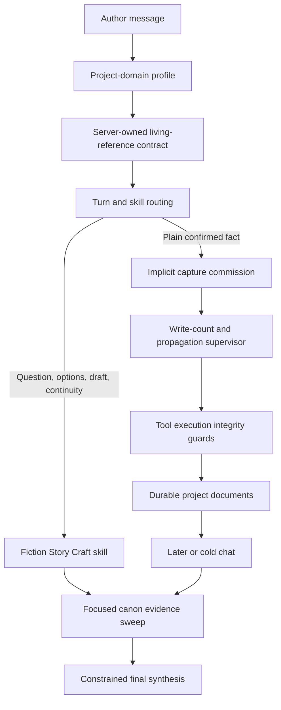

<!-- docs/technical/agentic-chat-book-writing-implementation-review-2026-07-30.md -->

# Agentic Chat Book-Writing Workflow — Implementation and Review Record

- Date: 2026-07-30
- Status: implemented and passing the real-model hosted journey
- Scope: BuildOS agentic chat, project creation, living-reference capture, fiction-specific reasoning, document writes, cold retrieval, and regression coverage
- Explicitly out of scope: agent-to-agent communication and a full-book prose-generation benchmark
- Original baseline: [`agentic-chat-book-writing-eval-2026-07-29.md`](./agentic-chat-book-writing-eval-2026-07-29.md)

## Executive summary

This work used book writing as a stress test for BuildOS agentic chat. The important product question was not simply whether a model could generate prose. It was whether an ordinary chat model could maintain a growing, durable creative workspace across many turns:

- turn an opening brain dump into useful character, world, and story-structure references;
- update the correct reference when the author adds a fact;
- propagate one confirmed beat into every materially affected artifact without spraying duplicates;
- retrieve the right canon in a new chat with no conversational memory;
- generate grounded options without silently converting those proposals into canon; and
- do all of this with the normal lightweight model lanes already used by agentic chat.

The first executable baseline demonstrated useful decomposition, character continuity, and cold retrieval, but it also exposed fundamental reliability and modeling problems. Narrative parts became dated BuildOS milestones, no story-structure document existed initially, a later plot artifact used a product-spec type, tool routing sometimes selected a generic non-fiction skill, durable capture could stop in prose without writing, multi-document propagation was not enforced, specific canon facts could disappear during summarization, and weak-model recovery answers could miss an exact option count or omit the named character and chapter.

The current implementation addresses those problems in four deliberately separate layers:

1. **General runtime integrity:** complete commissioned writes, count multi-document projections, prevent accidental same-title document duplication, preserve explicit response constraints, and recover from weak-model stops.
2. **Lightweight project-domain policy:** recognize a fiction workspace, persist a server-owned living-reference contract, keep narrative structure out of project-management entities, and preserve clearly recognized author source statements.
3. **Fiction Story Craft skill:** supply the creative judgment that should not be universal policy—canon classification, CAPTURE/EXPLORE/DRAFT/RECONCILE modes, evidence selection, propagation rules, causal option quality, and continuity handling.
4. **Executable test infrastructure:** run a real four-turn journey against the production stream path, hosted database, normal model routing, durable rows, tool telemetry, and a cold session.

The final hosted journey passed every checkpoint in 4 minutes 33 seconds. The broader local agentic-chat suite passed 1,192 tests across 131 files, and Svelte/type validation reported zero errors and zero warnings.

### Repository-state note

This work was performed in an already dirty shared worktree. No files were staged or committed as part of this handoff, and unrelated changes were intentionally left untouched. Some shared files—especially the E2E telemetry helper—also contain concurrent work outside this book-writing effort, so reviewers should inspect the relevant hunks rather than attributing every current-worktree change in those files to this implementation.

## Product context and desired behavior

The motivating workflow was an author who starts a chat with an unstructured book idea and continues using that project over time. The expected experience was:

1. The opening brain dump naturally becomes a lightweight book reference rather than remaining trapped in chat history.
2. A central character receives one durable reference sheet.
3. High-level plot, named parts, chapter beats, and the emotional spine receive a story-structure artifact.
4. World rules receive an appropriate world reference.
5. Later character facts update the existing character sheet.
6. Later story beats update the structure and, when the beat changes a character's motivation, knowledge, relationship, choice, or arc position, also update that character's sheet.
7. A new chat can ask, “What should happen with this character next?” and receive several canon-grounded options.
8. Options remain proposals until the author accepts one.

The solution also needed to stay lightweight. It should not require a frontier model, a universal story template, a heavyweight schema for every book, or an ever-growing system prompt. It should allow document organization to emerge as the project grows.

## The previous state

The initial real-model baseline was useful because it showed both capabilities and failure modes.

### What already worked

- The model decomposed the opening into several useful documents instead of one giant note.
- It created dedicated references for major characters.
- A later character detail updated the existing Ilyan document in the first successful baseline.
- A later story beat eventually reached both character and plot-related content.
- A cold chat found relevant documents by exact IDs, outlines, and targeted section reads.
- The option turn remained read-only and grounded several suggestions in stored facts.

### What did not work reliably

| Area                | Previous behavior                                                                                                                   | Why it mattered                                                                                                              |
| ------------------- | ----------------------------------------------------------------------------------------------------------------------------------- | ---------------------------------------------------------------------------------------------------------------------------- |
| Initial structure   | The three named story parts became dated milestones; a plot/structure document did not exist at creation time.                      | Narrative structure was confused with project delivery structure, and the workspace lacked an obvious story source of truth. |
| Grounding           | The model invented dates for parts even though the author supplied no schedule.                                                     | Fabricated commitments corrupt project truth and make the workspace less trustworthy.                                        |
| Semantic typing     | A later plot outline used `document.spec.product`.                                                                                  | Creative retrieval and future UI behavior could be degraded by a product/software type.                                      |
| Skill routing       | Fiction option requests could resemble generic content-strategy work and preload the wrong skill.                                   | The project could lose its creative reasoning contract despite having a known fiction identity.                              |
| Durable capture     | A declarative canon turn could end with a helpful prose acknowledgment and no document write.                                       | The living workspace promise was not actually enforced.                                                                      |
| Propagation         | One story beat could require a structure update and a character update, but the runtime considered one successful write sufficient. | One source of truth would remain stale.                                                                                      |
| Source preservation | Character or structure documents could paraphrase the brain dump and drop a controlling fact.                                       | Later cold reasoning would be grounded in incomplete canon.                                                                  |
| Duplication         | A weak model could ignore a visible document ID and call `create_onto_document` with the same character-sheet title.                | Canon split across duplicate references.                                                                                     |
| Option synthesis    | A recovery answer could produce fewer options than requested or refer only to “him” and “the next chapter.”                         | The answer technically resembled guidance but did not satisfy the explicit request.                                          |
| Reliability         | One provider attempt reasoned for roughly two minutes without emitting the first tool call.                                         | High latency and cost could prevent project creation entirely.                                                               |

### Important harness corrections

The baseline also exposed two assertions that were too prescriptive:

- The cold turn originally required `search_project`, even when the knowledge map already supplied exact document IDs. That assertion was removed because direct outline and section reads are more efficient.
- Story-source discovery originally matched titles only. The managed project context can be a legitimate high-level source, so the harness was corrected to evaluate actual content and semantic document roles.

This distinction was important: tests should enforce outcomes and integrity, not force redundant tool choreography.

## Design decision: policy, runtime, and skill are different things

A central concern was whether a “creative project organization policy” would become a rigid, non-scalable rule. The implementation deliberately avoids that.

### General runtime invariants

These apply beyond books:

- a server-commissioned durable mutation cannot be satisfied by prose alone;
- an explicit exact-count request should remain exact through recovery synthesis;
- a create call should not silently duplicate an existing same-title document unless the user asked for a copy;
- an explicit project scope and exact entity IDs must be respected; and
- retry and finalization paths must preserve user-visible constraints.

### Lightweight fiction project policy

The project-domain profile handles only small, lossless distinctions needed before or outside a full skill load:

- this is a fiction project;
- this project is an ongoing living reference when the author commissioned that behavior;
- parts, acts, chapters, scenes, and beats are narrative structure, not deadlines;
- fiction artifacts should use creative document types;
- unrequested goals, plans, tasks, milestones, and dates should not be invented; and
- clearly recognized source statements should survive creation and structural capture.

It does not impose three-act structure, Hero's Journey, Save the Cat, folders, chapter counts, or a universal story bible.

### Fiction-specific skill behavior

The full story-craft procedure belongs in the skill because it is domain judgment, not global chat policy:

- how to distinguish canon from proposals;
- which story references to read;
- when a beat should propagate to another artifact;
- what makes options causally distinct;
- how to evaluate character-arc effects;
- when tension is productive versus contradictory; and
- how to draft or reconcile without promoting inventions into canon.

This separation keeps the base chat lightweight while letting a known fiction project activate richer reasoning only when the turn needs it.

## Current architecture



The workspace contract stored in project context is intentionally small:

```json
{
	"agent_workspace": {
		"mode": "living_reference",
		"domain_profile": "fiction_story",
		"domain_affinity": "writing.fiction"
	}
}
```

These values are server-selected and sanitized. Model-supplied workspace metadata is stripped before persistence so content cannot promote itself into system behavior.

## Work implemented

### 1. Fiction project identity and living-reference persistence

The project-domain profile recognizes strong fiction signals from the user message or project type. When the author requests an ongoing workspace, creation persists the living-reference mode and fiction affinity.

Later chats use the persisted identity instead of rediscovering the domain from isolated keywords. This is what allows a terse follow-up such as “give me three options” to remain attached to `writing.fiction` without globally treating every use of “chapter” or “character” as fiction.

The tool-execution context now carries the server-approved workspace contract from START HERE into the bounded execution context. This was necessary because prompt rendering knew the project was a living fiction workspace, while execution guards initially could not see that identity.

### 2. Skill and domain routing corrections

Fiction was kept as a specific child domain rather than broadening the generic writing domain. Routing now favors the strong primary domain's skill when a weaker secondary domain exposes a generic outcome-card default.

This fixed a concrete failure where a character-arc/options request resembled content strategy and could preload a marketing-oriented skill even though `writing.fiction` ranked first.

For an established fiction project, the project-specific matcher can override a conflicting lexical preload and select `fiction_story_craft`. Plain implicit capture turns remain lightweight and do not need the full creative reasoning procedure merely to store a confirmed fact.

### 3. Fiction Story Craft skill

The skill establishes four mutually distinct turn modes:

1. **CAPTURE:** store author-confirmed facts in the smallest complete set of existing canonical references.
2. **EXPLORE:** read canon and generate proposals with zero durable writes.
3. **DRAFT:** generate requested prose from canon, but do not save it unless asked.
4. **RECONCILE:** surface hard contradictions and resolution choices without silently rewriting canon.

It also adds:

- a canon ledger separating hard canon, working canon, open questions, and proposals;
- a Character–Arc–Scene evidence sweep using exact knowledge-map IDs when available;
- a propagation matrix for character, structure, scene, and world facts;
- continuity checks for identity, chronology, location, knowledge, relationships, motivation, consequences, and world rules;
- a causal option schema requiring meaningful differences in choice, pressure, information, relationship, or cost;
- explicit write/no-write receipts; and
- a prohibition on silently treating generated options or draft prose as established canon.

The Option Forge was tightened after live testing:

- cards must be visibly labeled `Option 1`, `Option 2`, and so on;
- an exact requested count must be honored;
- all core moves must appear before extended elaboration;
- the focal character and requested chapter/scene/part must be stated explicitly; and
- a best-fit recommendation is omitted when the author said not to choose.

### 4. Project-creation normalization and grounding

Creation now uses deterministic server preprocessing for the small lossless portion of the fiction contract.

For a canon-only fiction brain dump, the server:

- removes unrequested goal, plan, task, and milestone entities;
- removes relationships that referenced those removed temporary entities;
- strips project start/end dates when the author supplied no schedule;
- preserves recognized full character-introduction sentences in the matching `document.creative.character` sheet under `Author canon`; and
- preserves a complete sentence that names a structural sequence in a `document.creative.structure` artifact.

Validators remain as backstops. They reject a creation payload when a clearly introduced central character has no matching character sheet, when the source sentence is absent, or when an explicitly named part/act/chapter sequence has no structure artifact.

This is intentionally conservative. The server does not invent character interpretations or choose a plot structure; it copies recognized author source into the artifact the model already proposed.

### 5. Living-workspace capture commissions

A plain declarative message in a living-reference project is treated as an implicit capture commission unless it is a question, brainstorming request, generated-content request, or casual acknowledgment.

For such a turn, direct document create/update tools are materialized without forcing redundant tool discovery. The orchestrator receives trusted server-derived write alternatives rather than relying on the model to declare its own mutation intent.

The write floor is:

- one successful document write for an ordinary durable addition; or
- two successful writes when a fiction message contains a structural signal such as a part, chapter, scene, or beat and therefore needs both a story-structure projection and another materially affected reference.

If the model stops in prose, completes only one of two required writes, or spends its normal tool budget reading, the supervisor opens a restricted write-only recovery pass. It tells the model exactly how many distinct durable projections remain and prevents repeated identical writes from satisfying the count.

### 6. Tool-execution integrity

Several protections now live at execution time, where model compliance is no longer the only defense.

#### Duplicate document guard

Before `create_onto_document` executes, the service compares a normalized title against current-project documents and document-tree nodes. Unicode punctuation and dash differences normalize to the same identity.

When a match exists, the create call returns a repairable validation error containing the exact existing document ID and directs the model to `update_onto_document`. The guard is bypassed only when the latest user message explicitly asks for a duplicate, copy, clone, second version, or separate version.

This is a general project-chat integrity rule, not a fiction-only rule.

#### Structural source preservation

For a confirmed capture turn in a living fiction workspace, an update targeting a structure/story/plot/chapter document receives the complete author source statement under `Author canon` when it is not already present.

This was added after a live run updated both required documents but paraphrased away the controlling fact that Ilyan “chooses not to report Mara.” The runtime now preserves the source before execution rather than hoping a weak model's paraphrase remains complete.

#### Grounding before project creation

Project creation applies the domain defaults, normalizes the payload, and then runs schedule, scaffolding, character-source, and structure-source validation before any hosted write occurs.

### 7. Forced synthesis and exact response contracts

Weak-model recovery can be required after tool limits, output limits, or a failed synthesis pass. Previously, the recovery lane knew that it needed final prose but not that the user requested exactly three options.

The synthesis context now extracts conservative exact-count requests from numeric and number-word forms while ignoring approximate qualifiers such as “at least,” “up to,” or “roughly.” It requires visibly numbered labels and keeps the entire set compact enough to fit before elaboration.

For exact option requests, it also extracts bounded explicit anchors:

- a proper-name subject in patterns such as “what should happen with Ilyan”; and
- story/work positions such as `chapter 4`, `chapter 5`, `Part II`, or `scene 3`.

Finalization counts visible option labels and checks those anchors. One retry is allowed when the answer has the wrong count or omits an explicit anchor. The retry remains tool-free and uses only bounded tool evidence.

Although motivated by the book scenario, exact-count preservation is implemented in the general synthesis layer.

### 8. Provider retry and observability behavior

The initial baseline exposed a model pass that consumed its timeout without producing a tool call. The runtime's model routing and application-level retry path were exercised and verified so a transient provider or model failure can rotate through the configured lightweight candidates instead of retrying the same failed route blindly.

Turn attribution records requested model lists, selected model/provider, stream retry count, retry-model rotation, pass roles, finished reasons, and supervisor interventions. This made it possible to distinguish native completion from a repaired but valid result.

The final test intentionally used the normal lightweight routes, primarily:

- `tencent/hy3` for initial planning; and
- `deepseek/deepseek-v4-flash` for balanced follow-up and synthesis passes.

No frontier model was substituted to make the scenario pass.

## Test infrastructure

### The four-turn hosted journey

The scenario runs through the production `POST /api/agent/v2/stream` path with a dedicated test user and hosted database.

#### Turn 1: create the living book workspace

The author supplies:

- the Bellwether world rule;
- Mara Venn, Ilyan Rook, and Archivist Senn;
- three named parts; and
- the emotional spine.

Assertions verify:

- one dedicated reference for each central character;
- useful confirmed facts in each sheet;
- a creative world document;
- a creative story-structure document containing all named parts and the emotional spine;
- no product/software type on story artifacts;
- no unrequested goals, plans, tasks, milestones, or dates; and
- one exact project, safely captured for later turns.

#### Turn 2: add one character detail

The author adds Ilyan's contraband brass whistle, where he keeps it, and how he uses customs procedure under stress.

Assertions verify:

- the existing Ilyan sheet is updated;
- its document ID remains unchanged;
- earlier brother/customs canon remains present;
- the new facts are stored; and
- no duplicate character sheet appears.

#### Turn 3: propagate one story beat

The author establishes that Ilyan catches Mara with a forbidden map, chooses not to report her, lets Mara interpret that as loyalty, secretly uses her to reach the Salt Archive, and opens Part II in Chapter 5 the next morning.

Assertions verify:

- at least two document writes occur;
- the original Ilyan sheet receives the changed motivation/relationship projection;
- the story structure contains Chapter 4, the non-report choice, Mara's misreading, the Salt Archive motive, and the Chapter 5/Part II transition;
- no duplicate sheet is created; and
- creative document types remain in the correct domain.

#### Turn 4: cold-session story guidance

The harness destroys the chat session and asks from a new session:

> I'm at the end of chapter 4. What should happen with Ilyan in chapter 5? Give me three distinct options and explain how each one moves his character arc without breaking what is already true. Do not choose one for me yet.

Assertions verify:

- the turn reads the original Ilyan sheet and at least one structure/story artifact;
- focused outlines and sections are used rather than relying on prior chat memory;
- the answer explicitly names Ilyan and Chapter 5;
- exactly three visibly labeled options are present;
- multiple stored character/plot signals ground the advice;
- the options remain proposals; and
- the document fingerprint is unchanged after the EXPLORE turn.

### Hosted-data safety

- Every test project begins with the prefix `AE2E ·`.
- Project names include a random suffix.
- Teardown deletes only exact captured project IDs.
- An orphan sweep is restricted to the dedicated test actor and the `AE2E ·` prefix.
- Child ontology rows disappear through project cascade deletion.
- The temporary local server is stopped after the run.

## Problems encountered during implementation and how they were resolved

The live reruns were treated as diagnostic probes, not just pass/fail ceremonies.

### Baseline run: useful behavior but wrong initial ontology

The first executable baseline produced characters and setting but represented story parts as dated milestones and lacked an initial structure document. It also showed provider timeout risk and a product-spec story artifact.

**Resolution:** introduce/persist the fiction domain profile, creative type guidance, schedule grounding, fiction skill, and a stronger creation scenario.

### Early rerun: incomplete source capture and optional writes

Weak creation output could preserve a fact in START HERE while omitting it from a dedicated character sheet. Declarative additions could also finish in prose without writing, and a structural beat could stop after only one affected document changed.

**Resolution:** add source-coverage normalizers and validators, living-workspace write commissions, a one-write default, and a two-write minimum for structural fiction signals.

### Hosted verification pass: duplicate Ilyan sheet

The prompt contained the exact original Ilyan document ID, but the weak model first used an invalid shortened project ID and then retried with `create_onto_document`, producing a same-title duplicate. The later propagation updates themselves were otherwise useful.

**Resolution:** add a generic execution-time same-title duplicate guard that returns the exact update target, plus tests for both accidental duplication and an explicitly requested copy.

### Same pass: cold answer had three options but weak framing

The cold turn performed correct focused reads and generated three options, but the prose relied on implicit context and did not explicitly say `Ilyan` or `Chapter 5`.

**Resolution:** preserve explicit subject/story-position anchors in the synthesis prompt, validate them in finalization, and add the same requirement to the fiction skill's Option Forge.

### Next hosted pass: two writes succeeded but one canon fact disappeared

The propagation turn updated both Ilyan and the structure artifact. The structure contained the chapter transition, Mara's loyalty interpretation, and Salt Archive motive, but it omitted the exact fact that Ilyan chose not to report Mara.

This was a more subtle failure than missing a write: the operation completed, yet the durable projection was semantically incomplete.

**Resolution:** carry the living-workspace contract into execution context and deterministically include the full structural source statement under `Author canon` for the structure update.

### Final hosted run: all checkpoints passed

The final run completed all four turns. It demonstrated:

- correct initial fiction workspace creation;
- no operational scaffolding;
- one Ilyan sheet updated in place;
- complete two-document propagation;
- exact source retention;
- cold retrieval from durable state;
- exactly three grounded Ilyan/Chapter 5 options; and
- zero writes during exploration.

## Before and current state

| Capability              | Before                                                                              | Current state                                                                                                                                 |
| ----------------------- | ----------------------------------------------------------------------------------- | --------------------------------------------------------------------------------------------------------------------------------------------- |
| Project identity        | Depended heavily on current-message lexical cues.                                   | Fiction affinity and living-reference mode persist as a sanitized server-owned contract.                                                      |
| Initial structure       | Parts could become milestones; plot reference could be absent.                      | Named narrative structure must land in `document.creative.structure`; unrequested operational entities are removed.                           |
| Scheduling integrity    | Story parts could receive invented due dates.                                       | Dates and milestones require explicit schedule evidence.                                                                                      |
| Character capture       | Useful but could omit a source fact or duplicate a sheet.                           | Recognized source sentences are retained; same-title creates are blocked unless a copy was requested.                                         |
| Follow-up capture       | A declarative turn could answer without writing.                                    | Living-reference capture is a server-commissioned mutation with a repair path.                                                                |
| Beat propagation        | One write could satisfy a multi-artifact change.                                    | Structural fiction signals require two distinct successful document projections.                                                              |
| Skill routing           | A secondary generic domain could displace fiction.                                  | Strong primary fiction affinity can select `fiction_story_craft` over conflicting generic preloads.                                           |
| Option quality          | Grounded options were possible but output shape was not guaranteed.                 | The skill enforces canon-aware causal cards; runtime preserves exact counts and explicit anchors through recovery.                            |
| Proposal/canon boundary | Mostly model-instruction dependent.                                                 | EXPLORE/DRAFT are explicitly read-only, tested by durable document fingerprints.                                                              |
| Cold continuity         | Demonstrated in the baseline but not connected to the full corrected creation flow. | The final corrected project passes a new-session character/structure/world evidence sweep.                                                    |
| Test coverage           | Initial scenario exposed problems but did not assert all ontology pollution.        | The scenario checks goals, plans, tasks, milestones, types, duplicate IDs, source facts, writes, reads, option shape, and no-write restraint. |

## Key files for review

### Project identity and creation policy

- [`apps/web/src/lib/services/agentic-chat/project-domain-profiles.ts`](../../apps/web/src/lib/services/agentic-chat/project-domain-profiles.ts)
- [`apps/web/src/lib/services/agentic-chat/project-domain-profiles.test.ts`](../../apps/web/src/lib/services/agentic-chat/project-domain-profiles.test.ts)

### Domain and skill routing

- [`apps/web/src/lib/services/agentic-chat/tools/domains/domain-sensing.ts`](../../apps/web/src/lib/services/agentic-chat/tools/domains/domain-sensing.ts)
- [`apps/web/src/lib/services/agentic-chat-v2/tool-selector.ts`](../../apps/web/src/lib/services/agentic-chat-v2/tool-selector.ts)
- [`apps/web/src/routes/api/agent/v2/stream/+server.ts`](../../apps/web/src/routes/api/agent/v2/stream/+server.ts)

### Runtime mutation and execution integrity

- [`apps/web/src/lib/services/agentic-chat-v2/stream-orchestrator/index.ts`](../../apps/web/src/lib/services/agentic-chat-v2/stream-orchestrator/index.ts)
- [`apps/web/src/lib/services/agentic-chat-v2/stream-orchestrator/repair-instructions.ts`](../../apps/web/src/lib/services/agentic-chat-v2/stream-orchestrator/repair-instructions.ts)
- [`apps/web/src/lib/services/agentic-chat/execution/tool-execution-service.ts`](../../apps/web/src/lib/services/agentic-chat/execution/tool-execution-service.ts)
- [`apps/web/src/lib/services/agentic-chat-v2/tool-execution-context.ts`](../../apps/web/src/lib/services/agentic-chat-v2/tool-execution-context.ts)

### Story skill and final-answer constraints

- [`apps/web/src/lib/services/agentic-chat/tools/skills/definitions/fiction_story_craft/SKILL.md`](../../apps/web/src/lib/services/agentic-chat/tools/skills/definitions/fiction_story_craft/SKILL.md)
- [`apps/web/src/lib/services/agentic-chat/tools/skills/definitions/fiction_story_craft/evals.md`](../../apps/web/src/lib/services/agentic-chat/tools/skills/definitions/fiction_story_craft/evals.md)
- [`apps/web/src/lib/services/agentic-chat-v2/stream-orchestrator/synthesis-context.ts`](../../apps/web/src/lib/services/agentic-chat-v2/stream-orchestrator/synthesis-context.ts)
- [`apps/web/src/lib/services/agentic-chat-v2/stream-orchestrator/finalization-runner.ts`](../../apps/web/src/lib/services/agentic-chat-v2/stream-orchestrator/finalization-runner.ts)

### End-to-end scenario

- [`apps/web/src/lib/tests/agentic-e2e/scenarios/book-writing-journey.scenario.ts`](../../apps/web/src/lib/tests/agentic-e2e/scenarios/book-writing-journey.scenario.ts)
- [`apps/web/src/lib/tests/agentic-e2e/harness/telemetry.ts`](../../apps/web/src/lib/tests/agentic-e2e/harness/telemetry.ts)

## Verification evidence

### Focused tests

The final focused boundary set passed 114 tests across five files, covering:

- project-domain defaults and grounding;
- tool execution, duplicate prevention, and structural-source augmentation;
- execution-context propagation of the workspace contract;
- option-count and anchor extraction; and
- finalization retries.

### Full local agentic-chat suite

```text
Test Files  131 passed (131)
Tests       1192 passed (1192)
```

Command:

```bash
pnpm --filter @buildos/web exec vitest run \
  src/lib/services/agentic-chat \
  src/lib/services/agentic-chat-v2 \
  src/routes/api/agentic-chat
```

### Svelte and TypeScript validation

```text
svelte-check found 0 errors and 0 warnings
```

Command:

```bash
pnpm --filter @buildos/web check
```

### Real-model hosted journey

```text
Scenario: book-writing-journey
Scenario result: passed
Scenario time: 272.857 seconds
Harness suite: 38 passed, 10 intentionally skipped
Total harness duration: 285.30 seconds
```

Command, with the dev server running on the configured base URL:

```bash
AGENTIC_E2E_BASE_URL=http://127.0.0.1:5188 \
VITEST_SILENT=false \
pnpm --filter @buildos/web test:agentic:book
```

The final run's pass attribution was informative:

- Turn 1: recovered from an initial tool-execution problem and created the correct single project.
- Turn 2: completed natively and updated the original Ilyan sheet.
- Turn 3: the write-intent supervisor completed the second required projection.
- Turn 4: the read-loop supervisor ended further reads and the model self-repaired into the final three-option answer.

No checkpoint miss was reported in the final run.

## Current limitations and residual risks

The workflow is now a strong infrastructure test, but it is not the end of book support.

1. **Initial hierarchy is intentionally not forced.** The current policy requires stable semantic homes but permits initial documents to remain at the project root. Folder/grouping behavior should emerge only when document density justifies it. A separate long-project test is needed before enforcing hierarchy.
2. **Source extraction is conservative.** Initial character coverage recognizes clear English patterns such as “Full Name is a/an …,” and structure coverage recognizes named parts/acts/chapters/scenes. This avoids speculative NLP but will not capture every phrasing or language.
3. **Duplicate prevention is exact-title based after normalization.** It catches punctuation and casing variants but not semantically similar titles such as `Ilyan Notes` versus `Ilyan Character Bible`.
4. **Provider latency remains variable.** Recovery is better, but the final realistic journey still took over four minutes. This is acceptable for a stress harness, not necessarily the desired interactive latency.
5. **The test is deterministic, not judge-scored.** This avoids paying a strong-model judge and makes failures inspectable, but prose quality beyond the asserted grounding and causal signals is not exhaustively measured.
6. **Local Vite telemetry emits a soft finalization warning.** `chat_turn_runs.status` can still appear as `running` briefly under local dev even when the stream and functional assertions have completed. The harness treats this as soft telemetry; production finalization behavior should continue to be monitored separately.
7. **Long-form drafting is not covered.** The current journey tests workspace creation, capture, propagation, retrieval, and option generation. It does not yet test drafting and revising a full chapter while preserving voice and continuity.
8. **Agent-to-agent communication remains out of scope.** Nothing in this work depends on it, and no claims are made about multi-agent coordination.

## Suggested reviewer checklist

Another agent reviewing this work should pay particular attention to these boundaries:

- Confirm the project-domain profile remains small and does not absorb the full story skill.
- Confirm `agent_workspace` remains server-owned and cannot be promoted through arbitrary model content.
- Verify the two-write commission is limited to structural fiction signals and does not force unnecessary writes on ordinary facts.
- Verify successful commissioned writes are counted by actual execution outcome and that duplicate/skipped writes cannot satisfy the floor.
- Review title-normalization and explicit-copy intent for false positives and false negatives.
- Review source augmentation to ensure it is lossless and limited to the intended living-fiction structure target.
- Confirm EXPLORE turns cannot create durable writes merely because a living-reference agreement exists.
- Confirm exact option-count logic ignores approximate requests rather than overconstraining them.
- Confirm the E2E assertions test durable database state and do not mandate redundant searches.
- Re-run the hosted journey after any change to project creation, tool selection, skill preload, write repair, document execution, or forced synthesis.

## Conclusion

The initial book-writing test showed that BuildOS already had promising pieces—document decomposition, character continuity, and cold retrieval—but lacked dependable boundaries between narrative structure, project operations, durable canon, and generated proposals.

The current system is materially different. A fiction workspace now has a persistent identity, a lightweight server-enforced integrity contract, a domain-specific creative skill, mutation completion guarantees, duplicate protection, source preservation, constrained recovery synthesis, and an executable four-turn regression journey.

Most importantly, the implementation does not solve book writing by hard-coding one book structure into global policy. It establishes durable, testable invariants in the runtime; keeps fiction-specific judgment in a skill; and leaves the author's chosen form, cadence, and structure open.

---

## Post-review corrections (2026-07-30, second pass)

A four-reviewer adversarial audit of this implementation confirmed the architecture but found real defects. All were fixed the same day; this section records what changed so the claims above read correctly.

### Runtime fixes

1. **Canon augmentation could destroy content (was: "lossless").** When the model supplied its update under a nested alias (`document.body_markdown` etc.), the augmentation wrote a canon-only top-level body that replaced the model's content under the default `replace` strategy. Fixed twice over: the `update_onto_document` alias hoist now covers all nested content aliases, and `applyFictionStructureUpdateSourceDefault` refuses to augment unless the content is in a top-level field it writes back to.
2. **`agent_workspace` was stripped at creation only (was: "stripped before persistence").** `update_onto_document`, `update_onto_project`, and `create_onto_document` props merges could persist a model-supplied workspace contract that later turns trusted, flipping a project into living-reference fiction mode. Now stripped in the tool-execution service for those tools, in `sanitizeProjectPropsPatchInput`, and in the documents PATCH route. Residual: worker-side agent-run writes that bypass these web paths are not covered by this strip.
3. **The two-write floor had a model-text escape hatch.** A failure-word match on final prose ("Ilyan didn't report Mara") waived the outstanding commissioned write with no actual failed execution. The waiver now requires a genuinely failed write. This is the third recurrence of the `looksLike*`-on-model-output escape-hatch class in this codebase; check waiver paths, not just triggers.
4. **The structural two-write signal fired on bare words.** "Part of her legacy", "skips a beat", "makes a scene" forced a second document write under `tool_choice: required`, manufacturing content. The signal now requires a numbered/qualified unit ("chapter 5", "final act") or an explicit structure compound ("story beats").
5. **The floor counted write calls, not distinct projections.** Two updates to the same document — or a stray non-commissioned write — satisfied a two-projection commission. The floor now counts distinct successful write targets restricted to the commissioned tools.
6. **The forced `tool_choice: required` repair pass had silently widened** to every gateway-mutation prose stop. It is now scoped to commission turns; ordinary mutation stops keep the instruction-only repair so the model can still ask a blocker question.
7. **Capture/count/anchor heuristics over- and under-fired.** Question-mark-free speculation ("Do you think Mara would forgive him") no longer becomes a forced write; "chapter 12 options" and "the two options" are no longer read as exact counts; only positions in the asking sentence anchor the answer (naming any one suffices, with digit/word/roman equivalence); top-level numbered lists count as visibly labeled options.
8. **Duplicate guard hardening.** Negated phrasing ("don't create a duplicate document") no longer disables the guard; bare "copy" near "page" no longer bypasses it; documents created earlier in the same turn are now tracked, closing the same-turn double-create window. Remaining known limits: the turn-start snapshot is capped at ~20 documents, and focused (non-project-document) chats load no candidates.
9. **Fiction skill preload on marketing phrasing.** Alias matching is order-free bag-of-words, so "brand story development and character arc for the customer journey" preloaded `fiction_story_craft`. The `writing.fiction` aliases now all carry an unambiguous fiction token.
10. **Character-source extraction demanded character sheets for places.** "The Salt Archive is a forbidden vault." matched the introduction pattern. Determiner-led and determiner-preceded proper nouns are now excluded. Residual: bare multi-word place names ("Salt Harbor was a free port") still match; that ambiguity is not resolvable without NLP and the failure mode is a repairable validation error.

### Test-instrument fixes

- **Turn 4 now asserts exactly three options** with the runtime's em-dash-safe `Option N` counting (numbered-list fallback, no generic bullet fallback). The previous check was a minimum-3 with a bullet fallback that a single option card could satisfy.
- **Turn 3 write counting is now database ground truth** — at least two distinct documents whose content actually changed — instead of tool-call counting, which a rejected create plus one update could satisfy.
- **A new turn-3 checkpoint requires model-authored beat projection** outside the injected `## Author canon` sections, so the deterministic server floor cannot silently become the only thing the journey measures.
- **Operational-scaffolding restraint is now asserted after turn 3** as well as turn 1.

### Documentation corrections to the sections above

- Turn 1 does not assert a dedicated world document, the emotional spine, or a sheet for Archivist Senn (he is mentioned, not introduced with facts — grouping him is legitimate); project-level date stripping is enforced server-side but not separately asserted.
- "Exactly three visibly labeled options" is enforced at runtime only in the recovery-synthesis lane; a natively completed turn is governed by the skill contract and the (now exact) e2e assertion.
- Story-source discovery in the harness is title-keyword plus context-document-type selection with content-level assertions — "semantic document roles" overstated it.

### Verification after fixes

- Focused suites and the full local agentic-chat suite pass (see repository test run records).
- The hosted four-turn journey was re-run after these changes; see the run log referenced in the repository state at commit time.
