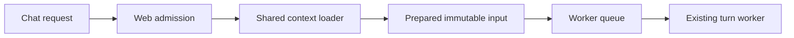

<!-- docs/technical/reviews/DJFLOW_CONTEXT_EXTRACTION_2026-09-12.md -->

# Djflow implementation: shared context foundation

Status: the shared context boundary is implemented and locally verified. The full
Agentic Chat release gate is pending. Worker-owned preparation and multi-agent
execution are not enabled by this change.

This starts Packet 1 of the [companion architecture](../../../docs/archive/agentic-chat-djflow/djflow-architecture.md).
The packet is split at the existing web dependency boundary so that moving context
ownership does not also introduce a second implementation of context selection.

## What changed

The web context loader now delegates to
`@buildos/agentic-chat-runtime/context/loader`. The shared package owns the data
loading, project/entity projections, context models, scope normalization, focused
document handling, and the existing pure project-domain profile functions. The
old web import paths remain thin compatibility adapters.

The loader receives host logging through `createFastChatContextLoader({ logger })`.
The Supabase client, trusted user identity, scope, and error reporter remain inputs
to each load. Lightweight context helpers and types are exported separately from
the database loader, so importing continuity helpers does not initialize database
loading dependencies.

Preserved behavior includes project RPC authorization failures returning no project
data, timezone fallback, bounded Start Here content, entity relevance ordering,
membership summaries, total/truncated scope metadata, and global/daily-brief
compatibility. This extraction adds no model call or database round trip.

The shared loader does not itself authorize arbitrary service-role use. A worker
adapter must use the admitted turn's trusted identity and enforce current scope
permissions before treating a context snapshot as executable input.

## Current flow and next boundary

The web app still performs preparation before admission. The next parts of Packet 1
are portable prompt assembly and a versioned admission command that the worker can
prepare after claiming the queued turn. That requires generation-fenced input
attachment, fixed history boundaries, cancellation, and recovery before model
dispatch. A fake empty v1 input artifact is not an acceptable shortcut.

| Stage                                          | State                             | Evidence needed before advancing                                                                       |
| ---------------------------------------------- | --------------------------------- | ------------------------------------------------------------------------------------------------------ |
| 1a. Shared context boundary                    | Implemented; release gate pending | Complete isolated gate on frozen source                                                                |
| 1b. Portable prompt assembly                   | Planned                           | Equivalent prompt/context on prepared-cache hit and miss                                               |
| 1c. Worker-owned preparation                   | Planned                           | Versioned admission, one turn per duplicate send, recoverable preparation, visible progress, full gate |
| 2–4. Fixed workflow, metering, two specialists | Planned                           | Checkpoint/retry correctness, enforced budgets, useful combined answer                                 |

## Verification

The final extraction was checked in a frozen checkout at
`/tmp/buildos-djflow-gate`, using local workspace packages and the installed
third-party dependencies. Its build outputs are separate from the working checkout.

| Check                                                                                      | Result                                                                                           |
| ------------------------------------------------------------------------------------------ | ------------------------------------------------------------------------------------------------ |
| Existing web context, scope, cache, admission preparation, domain-profile and prompt tests | 187 passed                                                                                       |
| Runtime context, source-entrypoint, portability and continuity tests                       | 13 passed                                                                                        |
| Gate oracle/harness tests                                                                  | 99 passed                                                                                        |
| Serial worker dependency build                                                             | All 7 packages built successfully, including type declarations                                   |
| Built loader imports                                                                       | CommonJS and ESM passed; lightweight helpers do not load the database loader                     |
| Mechanical extraction review                                                               | All 135 existing function bodies have identical syntax trees, ignoring source locations/comments |

These are 299 unit/harness checks, not 299 live chat turns. No Svelte component was
changed. The new runtime tests cover import portability, closed project-access
failure paths, per-host logging isolation, and a failing error reporter.

The clean checkout initially exposed a missing source alias for the shared date
helper before dependency builds. The loader now has a separate package entry, and
the relevant test configurations resolve its shared dependencies from source. The
corrected oracle run passes. An unrelated existing preparation-test dependency
also required the normal shared-package build; the complete targeted web run passes
after that build.

## Gate evidence and remaining blocker

The pre-change Cedar House run recorded **47/52**, with a missing dependency edge
and an incorrect calendar-coverage answer. It also failed source provenance because
the working checkout changed while services were running. It is not a passing or
fully attributable baseline:

- [Baseline gate](../../../output/agentic-gate/2026-09-12T20-28-40-987Z/gate.json)
- [Baseline scorecard](../../../output/agentic-gate/2026-09-12T20-28-40-987Z/scorecard.json)

The first extraction gate stopped at the clean-build import issue; its evidence is
retained in [the first attempt](../../../output/agentic-gate/djflow-context-2026-09-12/gate.json).
The corrected attempt passed all 99 oracle checks. It was interrupted during the
dependency phase after another full battery was found using the same isolated
database. Its chat services had not started. No completed release scorecard is
claimed for the extraction.

- [Corrected oracle log](../../../output/agentic-gate/djflow-context-2026-09-12-r2/oracle.log)
- [Final web compatibility tests](../../../output/agentic-gate/djflow-context-2026-09-12-r2/context-web-tests.log)
- [Verification manifest](../../../output/agentic-gate/djflow-context-2026-09-12-r2/context-extraction-verification.json)

Before advancing to the next runtime change, run the full three-repetition gate
when the isolated database is free, using the frozen checkout or a new verified
snapshot of the intended source. Keep the scorecard and resolve failures as required
by [the repository gate contract](../../testing/agentic-chat-gate.md). This change
does not claim that the earlier live failures are fixed.
