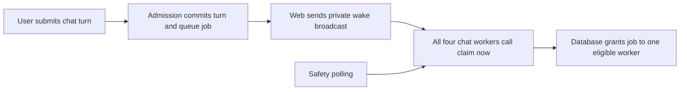

<!-- docs/technical/reviews/SUPABASE_WORK_ORDER_AND_QUEUE_WAKE_2026-09-24.md -->

# Supabase work order and queue-wake investigation

**Implementation update:** DJ removed the mandatory per-change-set gate requirement after this
work order. The five-second polling change is now implemented and freely tested locally;
security containment is prepared but unapplied. See the [current implementation notes](SUPABASE_CONTAINMENT_IMPLEMENTATION_2026-09-24.md).
The audit and initial ordering below are retained as the original proposal.

**Tasker 104 · Owner: Codex · Follow-up observed 2026-09-24, 17:40–17:45 UTC**

DJ's decision: **keep the existing QA branch**. Deletion, pausing and ephemeral replacement are no longer proposed immediate actions. No resizing, runtime changes, RPC mutations, deployments or paid tests were performed in this follow-up.

**Recommendation:** contain the three confirmed security exposures first; finish the chat reliability work and its validation; then replace continuous one-second chat polling with wake-driven claims plus a bounded safety poll. Do not remove polling entirely or change the general worker's polling as part of that change.

This follow-up updates the [original audit](SUPABASE_FITNESS_AUDIT_2026-09-24.md). The maintenance RPC failure window has ended. The audit's statement that failures were recorded earlier today must not be read as a claim that they are still failing now.

## Sequence and completion criteria

| Order                                   | Work                                                                                                                                                                                                                                                                                  | Why now / completion evidence                                                                                                                                                                                                                |
| --------------------------------------- | ------------------------------------------------------------------------------------------------------------------------------------------------------------------------------------------------------------------------------------------------------------------------------------- | -------------------------------------------------------------------------------------------------------------------------------------------------------------------------------------------------------------------------------------------- |
| **1 — Security containment**            | Tasker 76: prepare a focused migration for the three RPCs below, after mapping callers. Validate allowed/denied roles in disposable local Postgres; record rollback grants; apply only through the approved production process.                                                       | Current live `anon` and `authenticated` grants and elevated bodies still expose these operations. Complete when client calls fail closed, legitimate admin/server paths pass, and live grant receipts match the intended contract.           |
| **2 — Recovery deployment assurance**   | Preserve the now-working recovery/reaper RPCs; add deployment preflight checks for exact signatures, service-only grants and required migrations. Alert on failed cron receipts and prolonged absence of success. Reconcile relevant QA schema/ledger before relying on gate results. | 1,753 earlier 404s stopped at 15:03 UTC. The new window has only successful responses. This is prevention/verification work, not another emergency redeploy.                                                                                 |
| **3 — Chat reliability**                | Close current Taskers 101/102 changes with the required approved gate; finish remaining prompt-snapshot lock/write-amplification follow-ups as a separate change set. Investigate the stream broadcaster's recorded failures described below.                                         | Known snapshot tail reached 11.85 s on QA. One worker reports 331 recorded stream-broadcast failures even while its queue wake is healthy. Confirm user-visible delivery behavior rather than treating an HTTP health 200 as an all-clear.   |
| **4 — Polling efficiency**              | Implement the narrow chat-only wake-aware policy below, add deterministic tests, then validate the changed behavior with an explicitly approved gate and deployment measurements.                                                                                                     | Four production chat workers still poll at 1 s despite working wakes. Target an 80% reduction in their idle poll component without normal admission delay. Do not stack this change before closing the current Agentic Chat validation lane. |
| **5 — Retention and expensive queries** | Coordinate with Tasker 103, verify actual cleanup success/backlog drainage; review the stream `updated_at` index, semantic-search plans and full `agent_runs` projection.                                                                                                             | QA artifacts occupy 192 MiB; stream state has zero HOT updates; semantic-search shapes reach several seconds. Avoid duplicate cleanup systems and bulk index deletion.                                                                       |
| **6 — Infrastructure sizing**           | Keep production Micro and the existing QA branch for now; decide separately whether QA should move to the already-billed Micro size. Capture a real busy interval before deciding production Small. Schedule the production security patch separately under Tasker 76.                | Production thrashing was not established. Small is an optional ~$5.23/730 h headroom choice, not a repair for grants, missing functions, locks or notifications.                                                                             |

The broad privilege audit and a safe Postgres patch remain important after immediate containment. The other thousands of advisor records are individually tracked triage leads, not thousands of confirmed exploitable holes.

## The three security exposures, in plain terms

`SECURITY DEFINER` lets a function execute with its owner's elevated privileges. Protecting the web admin route does not protect a separately exposed Supabase RPC. Live catalog and source inspection reconfirmed:

| RPC                               | What an unauthorized caller can reach                                                                                                                                                        | Intended fix / caller evidence                                                                                                                                                                                                    |
| --------------------------------- | -------------------------------------------------------------------------------------------------------------------------------------------------------------------------------------------- | --------------------------------------------------------------------------------------------------------------------------------------------------------------------------------------------------------------------------------- |
| `batch_update_phase_dates`        | Changes legacy project phase dates using caller-supplied project/phase IDs, without checking project membership. This is the direct data-integrity exposure.                                 | No application call site was found in the TS source search; confirm legacy consumers, then remove client execution or restore it only with invoker/RLS or explicit membership checks.                                             |
| `acquire_migration_platform_lock` | Acquires/changes the application migration-platform lock or reads its holder. This could obstruct the legacy-to-ontology migration process; it is not arbitrary schema-migration permission. | The [admin migration start route](../../../apps/web/src/routes/api/admin/migration/start/+server.ts) checks admin access and uses a service client. Make the RPC service-only; include internal role checks if elevation remains. |
| `get_subscription_overview`       | Reads global subscriber counts and revenue aggregates such as MRR/ARR. It does not need to reveal individual records to be an inappropriate public endpoint.                                 | The [subscription overview route](../../../apps/web/src/routes/api/admin/subscriptions/overview/+server.ts) checks admin access and uses a service client. Restrict RPC execution to that server path.                            |

All three are currently definer functions, lack a fixed function search path, and are executable by both `anon` and `authenticated`. Source review confirms no internal caller/membership check in these bodies. Revoke inherited `PUBLIC` execution as well as explicit client grants in the eventual reviewed migration; a revoke from only one role can leave another grant path open. Pin safe search paths and review all affected callers. No live mutation/exploit probe was performed, and this investigation establishes **exposure, not evidence of exploitation**.

See [Tasker 76](../../../tasker/76-production-database-security-containment.md) for the existing containment plan. Catalog/source receipts: [follow-up status](supabase-health/2026-09-24/followup-status.json.gz), [redacted function bodies](supabase-health/2026-09-24/followup-wake.json.gz). Full-definition string comparison differs for two stored copies because of formatting/line endings; the source bodies were inspected directly rather than treating a hash mismatch as an authorization finding.

## The maintenance RPCs are working now

These are background repair operations:

- `recover_dead_agentic_chat_turns`: resolves turns whose worker lease expired, safely requeuing eligible work or ending a turn with its durable partial output. It also coordinates workflow finalization.
- `reap_stranded_queued_agentic_chat_turns`: ends turns that stayed queued without starting for ten minutes, so users do not remain in an indefinite “Thinking” state.

Earlier 404s meant those expected RPC requests were unavailable to callers; missing/mismatched deployed functions or API schema-cache state are possible causes. The logs alone do not establish which. The migrations are present now, both functions have the expected signatures, and both deny client execution while allowing `service_role`.

**From 15:04 to 17:40 UTC (11:04 a.m.–1:40 p.m. Eastern):**

| Signal                 | New evidence                                                             |
| ---------------------- | ------------------------------------------------------------------------ |
| Recovery RPC           | **2,575 HTTP 200 responses**, p95 origin time **24 ms**                  |
| Queued-turn reaper RPC | **156 HTTP 200 responses**, p95 **28 ms**                                |
| Cron receipts          | **157 success records**, no error/warning records in this bounded window |
| Worker recovery health | All four observed worker instances report healthy recovery               |

Log ingestion timing explains the one-request difference between the final cron receipt and the reaper edge-log aggregate. Successful empty sweeps prove current endpoint availability; they do not prove every recovery scenario or the paid gate passes. Four 15-second worker sweeps plus one per-minute web sweep explain ~17 recovery calls/min. The web sweep provides coverage when all workers are down, and workers handle workflow handoffs. Do not delete this redundancy solely to reduce calls. A later leader/lease design could consolidate work if measurement warrants it.

## Two different “enqueue from chat” paths

### Normal chat turn: durable admission plus immediate notification

The [turn admission route](../../../apps/web/src/routes/api/agent/v2/turns/+server.ts) calls `wakeAgenticChatWorkerQueue()` only after `newly_admitted` succeeds. The [publisher](../../../apps/web/src/lib/services/agentic-chat-v2/worker-queue-wake.server.ts) sends a private Realtime message containing only a version marker. It waits at most **150 ms** during admission, then keeps a slow request alive in the background for up to **5 s**. A timeout at 150 ms does **not** establish that delivery failed.

The [worker listener](../../../apps/worker/src/workers/agentic-chat/host/queue-wake-listener.ts) invokes the normal atomic claim method immediately. It coalesces bursts per process and performs a catch-up claim after reconnection. Initial subscription currently does not perform that catch-up, so a job admitted between startup's initial claim and subscription readiness still needs the safety poll.

**Live verification:** startup logs show four instances using **1,000 ms**. Six read-only health samples reached all four distinct worker start times; all four were subscribed, had zero queue-wake failures, and had received the same **17:02:39 UTC** notification. Three Realtime REST broadcast requests since 15:04 received HTTP 202; an HTTP 202 alone is not proof of delivery, but the per-worker counters corroborate the latest wake. No new job was submitted to obtain this evidence.

The [queue implementation](../../../apps/worker/src/lib/supabaseQueue.ts) still has a fixed interval. It skips claims when all slots are occupied, refills immediately when a job completes, and uses atomic database claiming to prevent competing workers from owning the same job. The wake feature was added **alongside** polling; it did not change the idle timer.

### Delegated background work: a different consumer

`delegate_task` uses [the delegation adapter](../../../apps/worker/src/workers/agentic-chat/mutations/delegate-task-adapter.ts) to call `create_agent_run_with_job`. That atomically creates the Agent Run and its `agent_run` queue job. The **general worker**, not the chat-turn worker, handles it.

Production general-worker startup logs show **5,000 ms polling**. The live `create_agent_run_with_job` and `add_queue_job` bodies enqueue durably without publishing this chat wake. The only ordinary trigger on `queue_jobs` updates `updated_at`; there is no universal queue-wake trigger. Thus “can enqueue directly” does not itself mean “the consumer is notified immediately.” Do not apply chat wake assumptions to delegated Agent Runs, calendar sync or other general jobs. [General-worker producer evidence](supabase-health/2026-09-24/followup-general.json.gz).

## Proposed polling policy

Use a narrow first step rather than replacing the queue architecture:

| Situation                                     | Proposed behavior                                                   |
| --------------------------------------------- | ------------------------------------------------------------------- |
| New chat notification                         | Claim immediately using the existing atomic claim                   |
| Worker slot becomes free                      | Refill immediately, as today                                        |
| Startup / initial subscription / reconnect    | Perform an immediate catch-up claim                                 |
| Healthy wake channel, idle/free capacity      | Safety poll about **every 5 seconds**, with small per-worker jitter |
| Wake disabled, connecting, retrying or failed | Retain **1-second** fallback polling                                |
| All execution slots occupied                  | No extra claim RPC; completion triggers refill                      |

Coalesce wake and timer claims, and reset the idle deadline after a claim so a successful wake is not immediately followed by a redundant timer claim. Keep cancellation, lease renewal and stalled-turn recovery cadences unchanged. Update health/log descriptions that currently hard-code “one-second” fallback.

Why keep the safety poll:

1. A worker can miss a broadcast during disconnect/restart; a sender can fail after durable admission commits.
2. Recovery updates jobs back to pending without calling the web admission emitter.
3. Generic jobs may become due when `scheduled_for` passes; passage of time produces no insert notification. A future all-queue event design needs a due-time scheduler as well.
4. The web publisher and worker subscriber have separate kill switches. A subscribed worker cannot infer that every producer successfully emitted a wake.

With four idle chat workers, **240 polls/min becomes roughly 48/min: 192 fewer/min, or ~8.41 million/730 h**. This is an **80% reduction in the chat idle polling component**, not in every Supabase call, and not a promised invoice reduction. Normal successfully notified turns should still start immediately. A silently missed wake can add up to about five seconds plus jitter/claim duration; an observed transport outage uses the faster fallback. This latency trade must be explicit in validation.

Do not start with 30–60-second polling or zero polling. Consider a longer backoff only after measuring lost-wake rates and covering all producers. A database-side post-commit wake or common enqueue notifier is a later coverage improvement, not necessary to capture the initial 80% reduction.

Validation for the implementation: deterministic tests for lost/late/duplicate wakes, failed initial subscription, reconnect, disable switches, recovery requeue, future-due jobs, wake/claim overlap, full capacity and shutdown. Existing wake-listener and queue-refill tests provide a base. Measure claims by **reason** (timer/wake/refill/startup), empty-claim fraction, admission-to-claim p95/p99, oldest runnable job, and wake failure/outage duration. Compare matched workload windows. Restore the previous cadence if queue latency or recovery bounds regress. A paid Agentic Chat gate remains separately approval-required.

## Additional reliability signal found during this follow-up

One of the four workers reports **stream broadcaster `degraded`, 331 consecutive recorded failures**, while its **queue-wake listener remains subscribed and healthy**. Its last state transition was 17:33:22 UTC; no turns were active at inspection. These are separate transports/health fields.

The stream adapter keeps its last failure state while idle, so this snapshot is not proof of an ongoing outage. Its counter resets only on a later successful broadcast, and the overall process intentionally remains healthy when delivery degrades to avoid destructive restart loops. Investigate the next active delivery trace and durable catch-up behavior, with a specific stream-delivery alert. Do not interpret a healthy `/health` response as proof that live response delivery is healthy, or use this separate field to conclude that queue wakes failed.

Evidence: [live status](supabase-health/2026-09-24/followup-status.json.gz), [four-instance wake samples and startup logs](supabase-health/2026-09-24/followup-wake.json.gz). Runtime code was not changed and no paid validation was run for this read-only follow-up.
