<!-- docs/technical/reviews/agentic-chat-turn-executor-audit-2026-09-02/lane-E-harness.md -->

<!-- doc-status: point-in-time -->

> **Point-in-time appendix.** Lane report for the 2026-09-02 turn executor audit, written against commit `53a77af1f`. Line numbers drift; verify before acting. Parent: [AGENTIC_CHAT_TURN_EXECUTOR_AUDIT_2026-09-02.md](../AGENTIC_CHAT_TURN_EXECUTOR_AUDIT_2026-09-02.md).

# Lane E — Agentic Chat Worker Harness / Orchestration Audit

Date: 2026-09-02. Read-only audit of `apps/worker/src/workers/agentic-chat/` at HEAD `53a77af1f` plus uncommitted tree. Every claim below was verified in source; line numbers are from the current working tree.

Abbreviations: TP = `provider/turn-provider.ts`, TE = `turn-executor.ts`, RB = `provider/request-builders.ts`, DISP = `provider/review/disposition.ts`, WR = `provider/write-routing.ts`, TS = `provider/tool-surface.ts`, ORC = `provider/openrouter-client.ts`, PP = `provider/provider-pass.ts`.

---

## 0. Orientation: the two nested loops

There are two loops, not one:

1. **Executor loop** (TE:568-964). Drives a single-use prepared provider invocation. Consumes provider steps; executes `read_tool` / `mutating_tool` / `pre_execution_tool_failure` steps as one batched execution graph per provider response (TE:1233-1470); returns feedback through `continueWithToolResults` (TE:895-914). Budgets: 300s provider wall (TE:127, timer at TE:519-527), 16 continuation rounds (TE:131, check TE:886-892), 40 tool calls (TE:132; TE:690-699, 747-753, 814-820), 10s per control-plane RPC (TE:128), 30s per read tool / 60s web (`tools/execution-adapter.ts:77-78`).
2. **Provider pass state machine** (TP). Owns everything model-facing: which surface is mounted, whether prose is withheld, disposition gate, reviewer passes, mutation withhold/review/release, repairs, forced synthesis. State is ~25 mutable `let`s captured in a closure (TP:293-326) plus a `ToolRoundStreamState` interface (TP:179-219).

**Key fact that shapes the whole analysis:** every control-tool call — `declare_turn_contract`, `request_turn_clarification`, `cancel_turn_contract`, and the reviewer's `approve_turn_contract_review` / `approve_mutation_batch_review` / `request_proposal_revision` — is executed as a **read tool** through the executor (`tools/execution-adapter.ts:164-170` puts standard + review controls in `AGENTIC_CHAT_PRODUCTION_READ_TOOL_NAMES_V1`; `provider/steps.ts:60-72` gives them `kind:'read'`). Consequences: each control decision is a full executor tool round (consumes the 16-round and 40-call budgets, does a claim-fence RPC at TE:2158 → TE:2639, persists a tool row, publishes two semantic events), and it counts as a **read-only round in the read-loop escalation ladder** (see §2.4).

---

## 1. Pass state machine, drawn

### 1.1 Surfaces (what "tools" means on each pass)

| Surface                           | Built by                                                                | Contents                                                                                                                                                                                                                                                                                                                              |
| --------------------------------- | ----------------------------------------------------------------------- | ------------------------------------------------------------------------------------------------------------------------------------------------------------------------------------------------------------------------------------------------------------------------------------------------------------------------------------- |
| **artifact**                      | web admission; decoded in TS:127                                        | whatever the web selected + signed                                                                                                                                                                                                                                                                                                    |
| **admittedTools**                 | `productionToolsFor` TS:127-176                                         | artifact ∩ (production read allowlist ∪ enabled mutation caps); `declare_read_only_turn` **removed** (TS:139); standard controls (`declare_turn_contract`, `request_turn_clarification`, `cancel_turn_contract`) mounted only if ≥1 mutation tool present and reviewer configured (TS:155-174). Reviewer controls never mounted here. |
| **opening pass**                  | `deferComplexWriteContractForInitialPass` TS:104-120, called RB:186-190 | admittedTools minus `declare_turn_contract` on the 7 versioned profiles (TS:57-65), except `project_create`                                                                                                                                                                                                                           |
| **disposition gate**              | `buildSemanticTurnDispositionGateRequest` DISP:45-93                    | `declare_turn_contract` + `request_turn_clarification` (+ pure reads unless `allowReads:false`); `toolChoice:'required'`; `semanticDispositionGate:true`                                                                                                                                                                              |
| **post-disposition**              | `buildPostSemanticDispositionRequest` DISP:95-124                       | contract → full admittedTools; read-only → pure reads only; clarification → no tools                                                                                                                                                                                                                                                  |
| **contract review (reviewer)**    | `review/turn-contract.ts:34-140`                                        | `approve_turn_contract_review` (SHA const) + `declare_read_only_turn` (only if no revision yet) + `request_proposal_revision` (if revisions remain) + `request_turn_clarification` (taken from admittedTools)                                                                                                                         |
| **batch review (reviewer)**       | `review/mutation-batch.ts:56-170`                                       | `approve_mutation_batch_review` (SHA const) + `request_proposal_revision` (if remain) + `request_turn_clarification`                                                                                                                                                                                                                  |
| **write carve-out**               | `review/contract-execution.ts:70-104`                                   | only `getSafeWriteToolNamesForTurnContract(contract)`; project_create first phase = `create_onto_project` only                                                                                                                                                                                                                        |
| **contract completion**           | `review/contract-execution.ts:11-68`                                    | safe write tools for the _unfinished_ outcomes only                                                                                                                                                                                                                                                                                   |
| **forced synthesis**              | `forceToolFreeRequest` RB:60-70                                         | no tools                                                                                                                                                                                                                                                                                                                              |
| **worker surface override prose** | TS:76-101                                                               | a system message listing callable names when artifact ≠ callable                                                                                                                                                                                                                                                                      |

That is seven derived surfaces plus a prose override, all computed from `admittedTools`.

### 1.2 Per-class pass sequence (current code)

Notation: A = acting model pass, R = reviewer pass, X = executor tool round (no model call), F = forced tool-free synthesis (A with no tools). "min/max model calls" excludes transport retries (each pass may run ×2 via PP:13 and cycle through routes ORC:406-460).

| Class                                             | Sequence in current code                                                                                                                                                                                                               | Branch points (file:line)                                                                                                                                                                                                                                                                                                                                                                | Surface per pass                                                                                       | Model calls min / typical / max                                                                                                                                                                                                                                                                                                                                                             |
| ------------------------------------------------- | -------------------------------------------------------------------------------------------------------------------------------------------------------------------------------------------------------------------------------------- | ---------------------------------------------------------------------------------------------------------------------------------------------------------------------------------------------------------------------------------------------------------------------------------------------------------------------------------------------------------------------------------------- | ------------------------------------------------------------------------------------------------------ | ------------------------------------------------------------------------------------------------------------------------------------------------------------------------------------------------------------------------------------------------------------------------------------------------------------------------------------------------------------------------------------------- |
| **(a) pure read / answer**                        | A1 → [X reads → A2]\* → finish                                                                                                                                                                                                         | reads emitted TP:1304-1325 (`stageMutationBatchReview` returns null for non-mutations TP:612-617); continuation TP:1027-1101; escalation forces F at ≥8 read rounds or ≤2 rounds remaining (`read-loop-escalation.ts:27-37`, TP:1045-1056, 1068-1072)                                                                                                                                    | opening (no `declare_turn_contract` on lazy profiles); continuation keeps `request.tools` (RB:281-283) | **1** (direct answer) / **2** / ~11 (1 + 8 read rounds + F + 1 F retry). **0 reviewer passes.** Exception: if final prose looks like a mutation claim or a "which one?" question on a write-capable surface, `takeReceiptGroundedFinalDispositionGate` (TP:537-558, called TP:1341, TP:1973) adds a gate pass + post-disposition pass (+2).                                                 |
| **(b) simple direct write ≤3 ops**                | A1 (proposes ≤3 ordinary mutations) → X (execute, no review) → F                                                                                                                                                                       | `assessDirectWriteBatch` WR:41-122 returns `simple` → `takePreMutationSemanticDispositionGate` returns null (TP:518) and `stageMutationBatchReview` returns null (TP:619-621); `validateApprovedMutations` skips (TP:596-599); after execution `directSimpleMutationCompleted` (TP:750-756) → `forceNoToolSynthesis` (TP:1068-1072) → `streamForcedSynthesis` (TP:1099)                  | opening; then no tools                                                                                 | **2** / 3 (one read first, cf. tasker 70 §3) / ~6 (reads + 2 validation repairs + F + retry). **0 reviewer passes.**                                                                                                                                                                                                                                                                        |
| **(c) complex write via `declare_turn_contract`** | A1 (proposes complex batch → withheld) → A2 gate (`declare_turn_contract`) → X (control executes) → R1 contract review → X → A3 propose batch → R2 batch review → X → X execute → A4 answer (or A4 proposes batch 2 → R3 → X → A5 …)   | withhold TP:510-535 (WR reason ≠ simple); gate request DISP:45-93; contract review dispatched TP:970-989 (`streamTurnContractReview` TP:1422-1546); approval handling TP:873-935 → full surface DISP:97-104; batch staged TP:609-648, reviewed TP:1548-1653; approval → `streamApprovedMutationBatch` TP:990-1024, 1696-1717; completion continuation TP:578-592 / 1083-1088 / 2001-2013 | opening → gate → (reviewer) → full admitted → (reviewer) → full admitted / carve-out / completion      | **5** (contract declared in A1 on a non-lazy surface, one batch) / **6** (lazy profile: 1+gate+R+propose+R+final) / ~28 before budgets bite (see §2.5). **Reviewer: 1 + 1 per batch, +≤2 revisions each.** Compiled-schedule shortcut (149587286): A1 withheld `update_onto_task` → R1 (contract from compiler, TP:482-509, 1219-1235) → compiled call (no A) → R2 → X → A2 answer = **4**. |
| **(d) clarification**                             | A1 (`request_turn_clarification`) → X (control executes, `requiresUserAction`) → F                                                                                                                                                     | acting call is a normal read step TP:1304-1325; on continuation `clarificationRequiresToolFreeSynthesis` TP:1073-1074, 1097-1099; post-disposition request strips tools DISP:118-123                                                                                                                                                                                                     | opening (clarify is mounted on write-capable surfaces only, TS:155-174) → no tools                     | **2** / 3 (via gate: A1 withheld → gate → F) / 4+ via reviewer fallback (R fails closed → `buildReviewFallbackClarification` `decision-handling.ts:31-49` → X → F). **0 reviewer passes on the acting path** (matches ADR). On read-only surfaces the control is **not mounted**, so a needed clarification becomes plain prose.                                                            |
| **(e) project-create (contract-first)**           | A1 = gate (declare only, no reads) → X → R1 contract review → X → A2 carve-out (`create_onto_project` only) → R2 batch review → X → X execute shell → A3 completion (child creates only) → R3 batch review → X → X execute → A4 answer | initial request replaced by gate at prepare TP:277-279 (DISP:27-43, `allowReads:false`); shell validation `validation.ts:158-241`; explicit-name check `validation.ts:73-131`; approval → carve-out TP:897-912 (`contract-execution.ts:82-88` restricts to shell); post-shell completion TP:815-821                                                                                      | gate → reviewer → shell-only → reviewer → child tools → reviewer → full                                | **5** (shell-only contract) / **7** (shell + children) / ~15                                                                                                                                                                                                                                                                                                                                |

### 1.3 Mermaid state diagram (acting + reviewer + executor)

```mermaid
stateDiagram-v2
    direction TB
    [*] --> Prepare: prepare() TP:263
    Prepare --> Opening: streamInitial TP:1119 (project_create ⇒ Gate instead, TP:277)

    state "Acting pass" as Opening
    Opening --> Answer: text only, no claim/question shape (TP:1341,1355)
    Opening --> ReceiptGate: prose = mutation claim or "which one?" (TP:537-558)
    Opening --> ExecReads: pure reads / clarification / cancel (TP:1304-1325)
    Opening --> ExecSimple: ≤3 ordinary mutations, simple (WR:41-122)
    Opening --> Gate: complex batch withheld (TP:510-535)
    Opening --> CompiledReview: withheld single-task schedule (TP:482-509)
    Opening --> ValidationRepair: schema/scope issues (TP:1264-1303) ≤2 (TP:1908)
    Opening --> Dead: non-allowlisted work tool / prose on required gate / 2 dispositions (TP:1826,1971; DISP:126-145)

    state "Disposition gate (required)" as Gate
    Gate --> ContractReview: declare_turn_contract (TP:970-989)
    Gate --> ClarifyExec: request_turn_clarification
    Gate --> Gate: pure reads (DISP:130-134)
    Gate --> Dead: prose / mutation call

    state "Reviewer: contract" as ContractReview
    ContractReview --> Approved: approve (SHA) TP:873-935
    ContractReview --> ContractReview: request_proposal_revision + corrected_contract (typed, TP:838-857) ≤2
    ContractReview --> Gate: prose-only revision (TP:858-871) ≤2
    ContractReview --> ReadOnlyCont: declare_read_only_turn (TP:948-967)
    ContractReview --> ClarifyExec: clarify / fallback / candidate gate (decision-completion.ts:52-112)

    state "Acting pass (full surface / carve-out / completion)" as Approved
    Approved --> BatchReview: mutation batch staged (TP:609-648)
    Approved --> CompiledReview2: compiled schedule (TP:922-935)
    Approved --> ExecReads: reads
    Approved --> Answer: prose (carve-out/completion may force one more pass TP:1987-2013)

    state "Reviewer: exact batch" as BatchReview
    BatchReview --> ExecMutations: approve (SHA) TP:990-1024
    BatchReview --> Approved: request_proposal_revision (acting repairs) ≤2
    BatchReview --> ClarifyExec: clarify / fallback

    CompiledReview --> ContractReview
    CompiledReview2 --> BatchReview

    state "Executor tool round" as ExecReads
    state "Executor tool round" as ExecMutations
    state "Executor tool round (direct)" as ExecSimple
    ExecReads --> Opening: continueWithToolResults (TP:722)
    ExecMutations --> Approved: continuation; completion pass if untouched outcomes (TP:1083-1088)
    ExecSimple --> Forced: directSimpleMutationCompleted (TP:750-756)
    ClarifyExec --> Forced: tool-free question (TP:1097)
    ReadOnlyCont --> Answer

    state "Forced synthesis (no tools, 1 retry)" as Forced
    Forced --> Answer
    Forced --> Dead: provider_forced_synthesis_failed (TP:2133)

    ReceiptGate --> Gate

    Answer --> Finalize: terminal text integrity (TE:1029-1051)
    Dead --> Recover: permanent (TE:966-1005)
    Finalize --> [*]
    Recover --> [*]
```

### 1.4 Where code and docs disagree

| Doc claim                                                                                                                                            | Code                                                                                                                                                                                                                                                                                                                                  | Verdict                                                                                                           |
| ---------------------------------------------------------------------------------------------------------------------------------------------------- | ------------------------------------------------------------------------------------------------------------------------------------------------------------------------------------------------------------------------------------------------------------------------------------------------------------------------------------- | ----------------------------------------------------------------------------------------------------------------- |
| ADR §Decision: four internal controls incl. `declare_read_only_turn`; "a true read-only worker turn adds one independent read-only review"           | `declare_read_only_turn` is stripped from the acting surface (TS:139, TS:165); read-only review removed (tasker 65 WP-3.2). It survives only as a reviewer-side downgrade (`review/turn-contract.ts:41-56`, TP:948-967)                                                                                                               | **ADR stale**; README + tasker 65 are current                                                                     |
| ADR: "gate runs at most once and only when all three disposition controls are callable"                                                              | Gate needs two controls (DISP:52-55); "once" is reset by a contract revision (TP:437) so the gate can run again after a prose-only revision                                                                                                                                                                                           | Minor drift                                                                                                       |
| ADR "Main implementation boundaries": `readOnlyTool.ts`, `readOnlyProvider.ts`, `phase3Bootstrap.ts`, `phase3Assembly.ts`, `fixtureTurnExecutor.ts`  | None exist; renamed to `tools/execution-adapter.ts`, `turn-provider.ts`, `bootstrap.ts`, `composition-root.ts`, `turn-executor.ts`. PC1 memo cites `readOnlyProvider.ts:4533`                                                                                                                                                         | Stale paths in the load-bearing ADR                                                                               |
| ADR: reviewer is "a distinct reviewed tool-capable model"                                                                                            | `bootstrap.ts:354-392`: prefers `openai/gpt-5.6-luna`, excludes acting models, **but** if every candidate is an acting model it falls back to `fallbackCandidates` which may include the acting model (bootstrap.ts:376-380)                                                                                                          | Independence is configuration-dependent, not asserted                                                             |
| README "Provider ownership": `steps.ts` "planning ... step construction"; tasker 65 WP-3.5 "generic first-tool cue is no longer an activity-log row" | `buildPlanningStep` still emits an `agent_state` 'Working...' semantic step on every tool round (`steps.ts:25-45`, TP:1322, 1533, 1640, 1708) — suppression is on the web presenter side only                                                                                                                                         | Consistent once presenter is included; worker still pays a publish per round                                      |
| tasker 65 WP-3.1 "direct lane = at most three independent target-free creates or an update to the already focused project"                           | WR:83-110 additionally allows `delegate_task` (new_entity) and blocks `update_onto_task`, `tag_onto_entity`, `link_onto_entities`, `create_task_document`, `update_onto_document` (all `resolved_existing`) even though they are `directWriteClass:'ordinary'` (`mutationToolCatalog.ts:102-107, 146-151, 157-162, 219-224, 267-272`) | Consistent in effect; the `'ordinary'` label on those entries is misleading — they can never take the direct lane |
| tasker 70 "Commit `149587286` adds the final ... pre-contract schedule compiler" (for the 8-attempt defect)                                          | `149587286` = `compileSingleTaskScheduleContractFromMutation` + `takePreMutationContractReview` — only `update_onto_task` with `due_at`/`start_at`. The general repair-loop fix is the typed `corrected_contract` path (TP:838-857, `controls.ts:150-183`), shipped in `b879d3fb7`                                                    | See §2.3                                                                                                          |

---

## 2. Loops and budgets

### 2.1 Every retry / repair / continuation loop

| Loop                              | Where                                                                                                           | Budget                                                                                                                                                                                                      | Reset / scope                                                                                                                                                                 | Model calls it adds                           |
| --------------------------------- | --------------------------------------------------------------------------------------------------------------- | ----------------------------------------------------------------------------------------------------------------------------------------------------------------------------------------------------------- | ----------------------------------------------------------------------------------------------------------------------------------------------------------------------------- | --------------------------------------------- |
| Transport retry inside one pass   | PP:13, PP:22-70                                                                                                 | 1 retry (`MAX_RETRYABLE_PROVIDER_PASS_RETRIES=1`), only before any event is buffered                                                                                                                        | per pass                                                                                                                                                                      | +1 (same logical round, `providerAttempt+1`)  |
| Route fallback inside one attempt | ORC:406-460                                                                                                     | all configured routes (1 route in prod: `config.ts:296-306`; model fallbacks ≤3 via OpenRouter `models` list); per-turn pin ORC:731-770                                                                     | per turn (`turnRouteHealth`, 256 entries)                                                                                                                                     | 0 extra logical calls; extra network attempts |
| Request timeout                   | ORC:35 `DEFAULT_REQUEST_TIMEOUT_MS=90_000`; covers headers **and** body via `abortableProviderRead` ORC:475-481 | 90s per attempt                                                                                                                                                                                             | per attempt                                                                                                                                                                   | —                                             |
| Executor continuation rounds      | TE:886-892                                                                                                      | 16 (`CHAT_MAX_TOOL_ROUNDS`)                                                                                                                                                                                 | per turn; **counts control rounds**                                                                                                                                           | —                                             |
| Tool-call budget                  | TE:690-699, 747-753, 814-820                                                                                    | 40; counts control calls and validation-failure steps                                                                                                                                                       | per turn                                                                                                                                                                      | —                                             |
| Provider wall budget              | TE:519-527                                                                                                      | 300s from `begin`                                                                                                                                                                                           | per turn; **never resets**                                                                                                                                                    | —                                             |
| Validation repair                 | TP:1264-1303 (initial, enters with `validationRepairRounds=1`), TP:1878-1932                                    | `MAX_VALIDATION_REPAIR_ROUNDS=2` (TP:163) → `provider_tool_validation_repair_exhausted` permanent                                                                                                           | per streamContinuation recursion chain; **resets to 0 on every fresh continuation** from `continueWithToolResults` (TP:871, 1100 call with default 0)                         | +1 each                                       |
| Unavailable-skill repair          | `repair-policy.ts:21-66`                                                                                        | 1 (`unavailableSkillRepairAttempted`)                                                                                                                                                                       | per request lineage                                                                                                                                                           | +1                                            |
| Reviewer-mimicry repair           | `repair-policy.ts:69-97`                                                                                        | shares the same 1-shot flag                                                                                                                                                                                 | per lineage                                                                                                                                                                   | +1                                            |
| Contract revisions                | TP:171, TP:1434; counted TP:428-439                                                                             | 2 per turn; third review offers only approve / read-only / clarify                                                                                                                                          | per turn                                                                                                                                                                      | typed: +1 R each; prose-only: +1 A +1 R each  |
| Mutation-batch revisions          | TP:172, TP:1555; counted TP:422-427                                                                             | 2 per turn                                                                                                                                                                                                  | per turn                                                                                                                                                                      | +1 A +1 R each                                |
| Pre-mutation disposition gate     | TP:510-535                                                                                                      | once (`semanticTurnDispositionGateUsed`) — **reset by a contract revision** (TP:437)                                                                                                                        | per contract attempt                                                                                                                                                          | +1 A                                          |
| Receipt-grounded final gate       | TP:537-558                                                                                                      | once (same flag)                                                                                                                                                                                            | per turn                                                                                                                                                                      | +1 A (+1 post-disposition)                    |
| Write carve-out                   | TP:559-577                                                                                                      | once (`contractWriteCarveOutUsed`)                                                                                                                                                                          | per turn                                                                                                                                                                      | +1 A                                          |
| Contract completion continuation  | TP:578-592, TP:318-352                                                                                          | once (`contractCompletionContinuationUsed`); only outcomes with **zero** successful touching writes                                                                                                         | per turn                                                                                                                                                                      | +1 A                                          |
| Forced synthesis                  | TP:2050-2150                                                                                                    | 1 retry (`MAX_FORCED_SYNTHESIS_RETRIES=1`) → `provider_forced_synthesis_failed` permanent                                                                                                                   | per forced pass                                                                                                                                                               | +1                                            |
| Read-loop escalation ladder       | `read-loop-escalation.ts:27-37`; applied TP:1045-1056                                                           | nudge ≥3, stop_and_answer ≥6, must_synthesize ≥8 read-only rounds or ≤2 rounds remaining; monotonic rank (TP:1048)                                                                                          | per turn, **never resets on a write** (contrary to the file's own comment "Reset to 0 on any write round" — TP never decrements `readOnlyRoundCount` or `readLoopRepairRank`) | forces F                                      |
| Context-gathering ledger          | `context-gathering-ledger.ts` via TP:1025-1044                                                                  | payload-chars/novelty → narrowing/saturated/must_synthesize                                                                                                                                                 | per turn                                                                                                                                                                      | forces F                                      |
| Mutation adapter attempts         | `mutation-executor.ts:200-247`                                                                                  | 2 if `downstreamIdempotencySupported`, else 1                                                                                                                                                               | per effect                                                                                                                                                                    | 0                                             |
| Queue retry (recover RPC)         | `20260802031000…recovery.sql:472-520`                                                                           | only `transient_infra` / `provider_throttle` / `timeout_pre_start`, only when `execution_started_at IS NULL` and zero effects, attempts < max (3), backoff `LEAST(2^attempts,16)` **minutes** + ≤60s jitter | per queue job                                                                                                                                                                 | whole turn re-runs                            |
| Stalled sweep                     | `stalledRecovery.ts:151+`; `consumer.ts:13-14`                                                                  | fires after 420s (> 360s worker timeout > 300s provider budget)                                                                                                                                             | —                                                                                                                                                                             | terminalizes only                             |
| Supervisor (flag-gated)           | `deterministic-supervisor.ts:47-56`                                                                             | force_synthesis after 10 tool calls w/ 0 writes or 8 read rounds; ask_user after 2 validation + 2 repeated failures                                                                                         | per turn; **off by default** (`config.ts:83-87`, `.env.example:126`)                                                                                                          | forces F / terminal                           |

### 2.2 Do budgets compose to 300s?

Yes, easily. Per pass: 90s × up to 2 attempts (PP) = 180s, and the reviewer client uses the same 90s (bootstrap.ts:306-311 passes no `requestTimeoutMs`). A complex write needs ≥5-6 logical passes (§1.2c). Two slow passes (a 60s acting pass with 4k-token reasoning + a 60s reviewer pass) plus normal ones reach the 300s wall; the executor then aborts with `provider_budget_exhausted` / `timeout_post_start` (TE:519-527), which `classifyAgenticChatRetryV1` maps to **permanent** (`shared-types/agentic-chat-worker-contract.ts:503-513`) and the SQL never retries post-start (`v_safe_pre_start`, recovery.sql:476-480). Result: a failed terminal with whatever prose leaked, after any number of durable writes. ADR canaries already hit the former 270s wall after all writes completed; the fix was +30s, not per-pass deadlines derived from remaining budget. There is no "remaining budget" input to `createAttemptSignal` (ORC:1436-1478).

### 2.3 Tasker 70's "8 attempts correcting its internal contract"

Mechanism (verified against the pre-typed-correction control flow, still present for the prose path TP:858-871): A1 declare → R1 `request_proposal_revision` (prose) → `setPendingToolRound` voids the contract and resets the gate (TP:428-439) → A2 re-declare (gate/`buildContractRevisionRequest` `decision-handling.ts:170-193`) → R2 revision → A3 re-declare → R3 with `allowRevision=false` (TP:1434, `MAX_CONTRACT_REVISIONS_PER_TURN=2`) → reviewer can only approve / read-only / clarify → clarification → F. That is 1 + 3×(A+R) + F = 8 attempts, the model regenerating the whole JSON each time and repeating the omission.

What closes it:

- **Typed correction** (`b879d3fb7`, not `149587286`): `CONTRACT_PROPOSAL_REVISION_TOOL` now _requires_ `corrected_contract` (`review/controls.ts:150-183`); `completeTurnContractReviewDecision` normalizes/validates it (`decision-completion.ts:52-112`); TP:838-857 records it as the contract and re-reviews the new SHA **without** an acting pass. Bounded at 2 typed re-reviews. Northwind trace: 1 A + 2-3 R instead of 8.
- **`149587286`** removes the acting _declaration_ pass for exactly one shape (single existing task, `due_at`/`start_at`, canonical UUID, RFC-3339). It does not touch the revision loop. Tasker 70's own status says the first receipt was still 7 passes (an extra read).

Residue not closed: (i) mutation-batch revisions still round-trip through the acting model (`decision-handling.ts:195-217`, TP:862-871) up to 2×; (ii) deterministic **validation** failures on `declare_turn_contract` (project-organize: 3 declarations, 2 rejected for labelled creates missing titles) still cost an acting regeneration each (`validation.ts:26-71`, TP:1878-1932) — the reviewer never sees these, so no typed correction is possible; (iii) the counter bookkeeping only tracks reviewer revisions, so validation repairs (2) + contract revisions (2) + batch revisions (2) can all be spent in one turn.

### 2.4 "Control-round tool call = permanent turn kill" — in code, and is it fixed?

Located. Three distinct kill paths, none with a repair:

1. `assertAllowlistedCall` (TP:1207 initial / TP:1826 continuation) → `provider_tool_not_allowlisted` **permanent** when the model calls an advertised-elsewhere work tool on a reduced surface: the disposition gate (declare+clarify+reads only), the post-read-only surface (reads only), a carve-out/completion surface (specific writes only), or a forced tool-free pass routed through `streamContinuation` (only `streamForcedSynthesis` tolerates tool calls, TP:2078-2083). The two one-shot repairs (`repair-policy.ts:21-97`) fire only for `skill_*` and reviewer-only names.
2. `provider_missing_tool_call` **permanent** when a `toolChoice:'required'` pass (gate, skill repair, validation repair of a required pass) returns prose (TP:1970-1972).
3. `provider_semantic_disposition_invalid` **permanent** for two dispositions in one pass or a gate pass mixing reads with a disposition (DISP:126-145).

Status: the _specific_ PC1 trigger (post-shell round with a fulfilled contract and control-only surface) is mitigated because the contract may now carry goal/task outcomes (`validation.ts:180-196`) and the post-shell continuation mounts child write tools (TP:815-821). The _class_ is **not fixed**: tasker 70 (line ~339) records a 08-28 production turn ending `provider_tool_not_allowlisted` after six control rounds when the reviewer's read-only downgrade left the acting model on an 8-tool read-only surface and it proposed `update_onto_task`. Tasker 70 §"Kernel" then declares this fail-closed behaviour correct and says "do not fix it by remounting mutation tools". The user still sees "An error occurred while streaming." (TE:993) after 6 paid passes — and, in the PC1 case, after a durable project create. PC1 fix direction (b) "one-shot repair when the model calls an advertised work tool in a control-only round" is not implemented.

### 2.5 Control rounds are read rounds (undocumented budget interaction)

`buildRoundToolPattern` (`round-analysis.ts:89-135`) classifies via `isLikelyReadToolName` (`tool-classification.ts:163-175`), which returns true for any worker-catalog entry with `kind:'read'` — and TS:26-31 registers **every** production read name, including `declare_turn_contract`, `request_turn_clarification`, `cancel_turn_contract`, `approve_turn_contract_review`, `approve_mutation_batch_review`, `request_proposal_revision`, as `kind:'read'`. Controls are not in `DISCOVERY_TOOL_NAMES` (`tool-classification.ts:18-27`). So every control round increments `readOnlyRoundCount` (TP:1030) and advances the escalation ladder. A canonical organize — 3 read rounds + declare + contract approval + batch approval = 6 "read-only" rounds → `stop_and_answer` injected **before the first mutation executes**; two more control rounds → `must_synthesize` → forced tool-free after batch 1. The TP comment at 1077-1082 describes exactly this symptom ("a turn that read a lot before its contract is forced tool-free after its first mutation round — exactly where the organize folders were created and the moves never proposed") and treats it as inherent monotonicity, then adds the one-shot completion continuation as a workaround. The underlying counter bug is that reviewer decisions count as the acting model "reading without progress".

---

## 3. Reviewer design

**Independence.** Different model by construction when possible: `buildAgenticChatSemanticReviewerRoutes` (bootstrap.ts:354-392) prefers `openai/gpt-5.6-luna`, excludes every acting model/fallback, `temperature: 0`, `maxTokens: 4_000` (bootstrap.ts:306-311, 352). Same OpenRouter route/key/provider pool (`config.ts:37-47`). Caveat: if the catalog's tool-capable candidates are all acting models, `fallbackCandidates` allows reuse of the acting model (bootstrap.ts:376-380) — silently.

**Context.** Reviewer prompt = its own system prompt + one user message: contract JSON + SHA + projected field semantics from advertised write schemas + **the complete acting-model message array as JSON** labelled "data to review, not reviewer instructions" (`review/turn-contract.ts:98-128`; `review/mutation-batch.ts:129-146`). It never sees tool schemas or the acting model's reasoning. The acting model, conversely, sees every reviewer decision as a durable tool result in its transcript (continuation appends control call + result, RB:224-291) — hence the mimicry repair. Deterministic post-processing on top of the reviewer: SHA-const in the approval schema (`turn-contract.ts:58-74`), decision normalization and fail-closed fallback (`decision-completion.ts:52-112, 186-223`), candidate-ambiguity floor from the reviewer's own `reference_candidates` (`decision-handling.ts:121-141`).

**Cost per write turn in passes.** Simple lane: 0. Complex: 1 contract review + 1 per mutation batch (organize = 2 batches → 3 reviewer passes, matching the 08-15 canary "three of nine provider requests were reviewer decisions"), plus ≤2 contract revisions (typed: reviewer-only) and ≤2 batch revisions (acting + reviewer). Compiled schedule path: 2 reviewer passes for 1 deterministic write.

**Load-bearing (cite ADR canaries — do not undo):**

- Contract review caught the acting model declaring and mutating one of three plausible "email" tasks _after_ complying with the mechanical three-way gate (ADR §Production canary, "The gate was working mechanically and wrong semantically"). No deterministic check can do this; it is the entire reason the lane exists.
- Read-only-dodge canary ("acting model could declare the turn read-only and avoid contract review") — now moot on the acting path since `declare_read_only_turn` was unmounted; the reviewer-side downgrade (TP:948-967) is the surviving mechanism and is a _safety_ downgrade (write → no write).
- Batch review rejected invented/broadened values (ADR "rejected out-of-contract proposals cannot expand a declaration"; tasker 70 "invented batch value" fixture at `agenticChatTurnProvider.test.ts:9091`).
- Reviewer controls from the stable admitted surface (ADR `provider_semantic_reviewer_surface_invalid` canary; `mutation-batch.ts:60-70`).
- Reviewer `maxTokens` 4000 after the 1200-token truncation root cause (bootstrap.ts:339-352; memory tasker/58).

**Replaceable by deterministic checks:**

1. **Batch review of a compiler-produced batch** (TP:1655-1694 → `streamMutationBatchReview`). The batch is a pure function of the approved contract (`contract-mutation-compiler.ts:24-83`); its SHA can be proven equal to `sha(compile(approvedContract))` in code. Paying a temperature-0 LLM to confirm a deterministic transform is a second review of the same approval. Keep the executor fences; drop the LLM pass (or make it a sampled audit).
2. **Batch review when every call is a `new_entity` create inside the focused project with no existing-entity references** and the contract has matching create outcomes: `validateApprovedTurnContractMutations` (`validation.ts:249-360`) already proves scope; the remaining reviewer judgment is "are the free-text values reasonable", which the reviewer prompt explicitly tells it _not_ to litigate (`mutation-batch.ts:105-107`). Candidate for deterministic approval with sampled audit.
3. **Validation-class contract defects** (missing titles on labelled creates, `required_fields` omitted when `changes` present, project-outcome fields) are already caught deterministically in `validation.ts`; they should be _auto-normalized_ (tasker 70 WP-3 bullet "deterministic normalization … for exact corrections") rather than round-tripped to the acting model — the reviewer never gets a chance to type-correct them because validation runs first.

Where it is genuinely load-bearing and must stay LLM: target resolution for descriptive references, uncommissioned-outcome detection, scope broadening. Everything else the reviewer does today is either already backed by code or could be.

---

## 4. Supervisor

Two components:

- `workerSupervisor.ts` (`AgenticChatWorkerSupervisorBridge`) adapts the shared `createDeterministicTurnSupervisor` (`packages/agentic-chat-runtime/src/supervisor/deterministic-supervisor.ts`) to the worker: side-effect-free construction, `start()` only at the execution-start fence (TP:668), decision records with stable transition ids. `workerSupervisorDecisions.ts` reduces decisions to effects: status semantic steps, injected system instructions, `forceSynthesis`, blocked tool calls (exact retry of a failed write), `ask_user` terminal, `stop` terminal. `provider/supervisor-runtime.ts` buffers and applies them; `stop_with_message` is mapped to `provider_supervisor_stop_required` **permanent error** (supervisor-runtime.ts:145-147) — but `decide()` never emits `stop_with_message` (deterministic-supervisor.ts:262-320), so it is dead.
- `deterministic-supervisor.ts` fires on: `tool_call_emitted` (block exact retry of a previously failed write, :322-341), `tool_result_received` (inject failed-write recovery instruction, :343-368), `tool_round_completed` (`ask_user` after ≥2 validation failures and ≥2 repeated failures with zero successful writes, :370-418; `force_synthesis` after 10 tool calls with 0 writes, 8 read rounds, or low novelty, :445+), long-silence status (max 3), `flag_eval` on empty final after tool work.

**When does it fire in prod?** `supervisorFactory` is wired only when `supervisorEnabled` (composition-root.ts:305-307), read from `AGENTIC_CHAT_WORKER_SUPERVISOR_ENABLED`, default `false` (config.ts:83-87), documented as default-off for Railway (`apps/worker/docs/deployment/RAILWAY_DEPLOYMENT.md:92,124`, `.env.example:126`). Cannot verify the live Railway value from the repo; assuming docs are followed, **`supervisor_question` is unreachable in production**. The executor keeps ~120 lines of checkpoint-persist + waiting-state + validation for it (TE:617-668, TE:3803-3860) and a dedicated `supervisorCheckpoint.ts` (316 lines) + RPC.

**Overlap with reviewer/repair logic (all of these are duplicated concerns when the flag is on):**

- `force_synthesis` at 8 read rounds ≡ `selectReadLoopRepairEscalation` must_synthesize at 8 (both would fire; TP:1058-1067 merges by rank).
- Blocked exact retry ≡ the executor's known-mutation-failure feedback + `buildValidationRepairRequest`; also the reviewer's batch revision.
- `ask_user` ≡ `request_turn_clarification` but produces a different terminal (`finishedReason:'supervisor_question'`, contract outcome `'blocked'` per `turn-contract.ts:1381-1386`, checkpoint row, no `requires_user_action` tool row) — a second clarification protocol the web must also understand.
- Status emission ≡ `buildPlanningStep` 'Working...' + publisher lifecycle events.

Net: the supervisor is a pre-reviewer safety net (Phase 3 era) whose responsibilities were each re-implemented deterministically or via the reviewer, and it is now off. Either turn it on and delete the ladders it duplicates, or delete it and its checkpoint plumbing.

---

## 5. Failure handling and safety

### 5.1 Error taxonomy → retry → user-visible outcome

Retry mapping is two-layered: `classifyAgenticChatRetryV1` (`agentic-chat-worker-contract.ts:503-513`) and the recover RPC (`recovery.sql:472-490`). The RPC is stricter: it retries only `transient_infra | provider_throttle | timeout_pre_start`, **only if `execution_started_at IS NULL`** and zero effects, ≤3 attempts, with a backoff of `LEAST(2^attempts,16)` **minutes** (+≤60s jitter) (recovery.sql:513-515). Every other class → `finalize_failed` → status `failed`, `publicError:'An error occurred while streaming.'` (TE:993), streamed prefix retained but out of assistant history (test TE-suite "keeps a post-start timeout partial reconnectable but out of assistant history").

| Code (file)                                                                                                                                                                                                                                                                                                                               | failureClass                   | Effective disposition                                 | User sees                                                                                                                                                                                             |
| ----------------------------------------------------------------------------------------------------------------------------------------------------------------------------------------------------------------------------------------------------------------------------------------------------------------------------------------- | ------------------------------ | ----------------------------------------------------- | ----------------------------------------------------------------------------------------------------------------------------------------------------------------------------------------------------- |
| `provider_capacity_unavailable` (TP:288-294)                                                                                                                                                                                                                                                                                              | provider_throttle (pre-start)  | requeued, **≥1 min** later                            | queued spinner for a minute+                                                                                                                                                                          |
| `provider_stream_error` retryable after PP retry (TP:1177, 1773, 2089, 2217)                                                                                                                                                                                                                                                              | provider_throttle (post-start) | **not retried** (post-start) → failed                 | error after partial text                                                                                                                                                                              |
| `provider_stream_error` non-retryable                                                                                                                                                                                                                                                                                                     | unknown → permanent            | failed                                                | error                                                                                                                                                                                                 |
| `provider_budget_exhausted` (TE:519-527)                                                                                                                                                                                                                                                                                                  | timeout_post_start → permanent | failed; writes stay                                   | error, possibly after durable writes                                                                                                                                                                  |
| `provider_missing_done`, `provider_event_after_done`, `provider_empty_text`, `provider_tool_finish_reason_invalid`, `provider_invalid_usage`, `provider_aggregate_usage_invalid`, `provider_read_*`, `provider_invocation_*`, `provider_supervisor_*` (unknown-class)                                                                     | unknown → **permanent**        | failed                                                | error. Note `provider_tool_finish_reason_invalid` (stream-tool-calls.ts:175-177) fires when a provider returns tool calls with `finish_reason:'stop'` — a provider quirk killing a turn with no retry |
| `provider_tool_not_allowlisted`, `provider_missing_tool_call`, `provider_semantic_disposition_invalid`, `provider_tool_call_disabled`, `provider_tool_validation_repair_exhausted`, `provider_forced_synthesis_failed`, `provider_tool_call_incomplete/_id_invalid/_count_exceeded/_arguments_too_large`, `provider_pass_buffer_exceeded` | permanent                      | failed                                                | error — the "model misbehaved" family; §2.4                                                                                                                                                           |
| `provider_turn_contract_review_identity_mismatch`, `provider_mutation_batch_review_identity_mismatch`, `provider_mutation_review_reused`, `provider_mutation_review_without_contract`, `provider_compiled_mutation_review_missing`, `provider_semantic_reviewer_unavailable/_surface_invalid`                                             | permanent                      | failed                                                | error — harness invariant violations (good: fail closed)                                                                                                                                              |
| `provider_round_budget_exceeded` (TE:886-892), `provider_tool_call_budget_exceeded`                                                                                                                                                                                                                                                       | permanent                      | failed                                                | error                                                                                                                                                                                                 |
| `provider_live_vision_*`, `attachment_contract_mismatch`, `attachments_missing_artifact_evidence`, `provider_not_configured`                                                                                                                                                                                                              | permanent                      | failed                                                | error                                                                                                                                                                                                 |
| `read_tool_timeout` (30s/60s), `read_tool_execution_failed` (`execution-adapter.ts:331, 370, 388`)                                                                                                                                                                                                                                        | transient_infra                | post-start → **not retried** → failed                 | error                                                                                                                                                                                                 |
| `AgenticChatEffectExecutionError` uncertain (`mutation-executor.ts:157-166, 296-309`)                                                                                                                                                                                                                                                     | uncertain_external_commit      | `effect_reconciliation_required`; queue not completed | turn stuck until reconciliation; no retry (correct)                                                                                                                                                   |
| Cancellation (`AgenticChatCancellationError`)                                                                                                                                                                                                                                                                                             | cancelled                      | `finalize_cancelled` with partial text if any         | interrupted message                                                                                                                                                                                   |
| Publisher overload                                                                                                                                                                                                                                                                                                                        | publisher_overload → permanent | failed partial                                        | error                                                                                                                                                                                                 |

Reviewer-side transport errors are _not_ turn errors: `event.type==='error'` → `fallbackReason` → durable `request_turn_clarification` by `harness_review_fallback` (TP:1490-1495, 1610-1615; `decision-handling.ts:31-49`). The user gets a generic "which exact item…?" question instead of an error — arguably worse than a retry when the cause was a 502.

### 5.2 Durable write without ledger/fulfillment seeing it

1. **Effect committed, tool row not persisted.** TE:1609-1636 calls `persistMutation` _after_ `mutation.execute` reconciled the effect to `succeeded` (`mutation-executor.ts:169-176`). If the RPC throws, the error propagates as `unknown` → failed turn. The effect exists in `chat_turn_effects`; the tool-execution row does not; the terminal trigger recomputes pending contract from **tool rows** (ADR §Runtime flow 9) → the outcome is "unfulfilled" → next turn may be told to redo it. Since `effectId` is scoped to `turnRunId` (`effectIdentity.ts` via `mutation-executor.ts:107-113`), the next turn's identical call is a **new** effect → duplicate write. Same shape for `persistSessionHandoff` failing after a project create (TE:1671-1674; fresh signal, throws on RPC error).
2. **Cancellation racing the same layer.** Reads in the same graph layer as a mutation run on the pre-mutation snapshot (TE:1640-1645 epoch); acceptable. Mutation adapters with `downstreamIdempotencySupported:false` (all but `create_onto_task`, `create_task_document`) get exactly one attempt; an abort mid-call becomes `outcome_uncertain` → reconciliation (mutation-executor.ts:200-247). Correct fail-safe.
3. **Reviewer fallback clarification on abort?** No: client abort throws (`ORC:635-637, 720`) rather than yielding `error`, so cancellation cannot mint a durable clarification.

### 5.3 "Completed" with unfinished commissioned work

Yes, by design and silently. `finalize` (TE:2939-2955) computes `turnOutcome.status` (`fulfilled|unfulfilled|blocked`) and stores it **only in message metadata**; `status` stays `'completed'`, `finishedReason` stays `'stop'`. The only harness pushes are: one carve-out pass (TP:559-577), one completion pass restricted to outcomes with **zero** successful touching writes (TP:318-352 `touched`), and the terminal-text guard which flips `finishedReason` to `mutation_unfulfilled` only when `successfulWrites === 0 && failedWrites === 0` (`finalization-guard.ts:346-352`) because `enforceAgenticChatTerminalTextIntegrityV1` never passes `expectedWriteToolNames` (TE-side `terminalTextIntegrity.ts:41-52`). So: organize with 6 declared moves, model executes 2 and writes prose → `completed`, `finished_reason:'stop'`, `outcome_status:'unfulfilled'` in metadata, pending contract persisted for next turn by trigger, `enforceMutationOutcomeIntegrity` (`repair-instructions.ts:815-855`) cannot add a partial-disclosure line because `expectedWriteToolNames` is empty. Whether the user learns 4 moves are pending depends entirely on model prose.

### 5.4 Cancellation / abort correctness

Sound. `combined` = job signal + cancellation observer + publisher overload + provider budget (TE:410-415); `iterateWithAbort` (TE:4053-4067) wraps every provider step; every pass checks `throwIfAborted` per event; the provider capacity lease is released in `finally` on every stream path (TP:1367, 1544, 1651, 1692, 1716, 2046, 2148, 2176, 2253) and again by `preparedProvider.release()` (TE:1008); mutation receipt persistence, known-failure persistence, and session handoff deliberately use a fresh signal (TE:1636, 1795, 3117-3119) so cancellation cannot hide a committed effect; the read-tool fence claim (TE:2639-2673) re-verifies generation before every executed step. Buffered prose held by `holdAssistantText` is dropped on abort — fine. One nit: `enqueueAssistantText` detaches delivery (TE:3156-3167) and `flushTurn` is the fence — correct, and this is the WP-1 fix.

### 5.5 Idempotency of mutation adapters on retry

- Effect identity = sha(turnRunId, logicalOperationId=(turnRunId, logicalProviderRound, callIndex), toolName, op, args) (`mutation-executor.ts:107-113`; `steps.ts:73-84`). Reserve/begin replay a `succeeded` effect (mutation-executor.ts:125-136). The compiled-contract call has a stable synthetic id (`contract-mutation-compiler.ts:74-83`).
- Cross-generation retry is impossible after start (recovery.sql:476-490), so replay only matters within a generation — where the executor never re-dispatches a step. Within-adapter retry: 2 attempts only when idempotent, recovery signal detached after an ambiguous attempt (mutation-executor.ts:200-247). Correct.
- Gap: identity is per-turn, so the cross-turn duplicate in §5.2(1) is not covered.

---

## 6. Architecture fitness

**Numbers.** Worker agentic-chat dir: 29,868 lines / 84 files; TE 4,130; TP 2,256; ORC 1,980; publisher 1,299; executionControl 947. Executor takes 25 ports (TE:266-303), 9 of them `on*Error` callbacks each wrapped in its own try/catch swallow. Provider tests: 10,643 lines / 90 `it`s; executor tests: 5,625 / 69 `it`s; all fixture-driven (scripted client events); only two `*.live.test.ts` files and both exercise the tool-execution graph, not the reviewer loop. Production verification is manual canaries recorded in tasker files.

**Boundaries that earn their keep**

- `executionControl` / effect ledger / `mutation-executor`: reserve→begin→reconcile with stable ids and post-start no-retry. This is the correctness core; leave it.
- `provider-pass.ts` atomic buffered pass: no partial text can be replayed against a second provider. Small and load-bearing.
- `write-routing.ts`: 143 lines that delete two LLM passes from every simple write. Best ROI module in the tree.
- `review/decision-completion.ts` + `decision-handling.ts`: fail-closed reviewer decoding with typed corrections and the candidate floor.
- `toolExecutionGraph.ts` + `toolExecutionPolicy.ts`: batch scheduling; measured savings are logged (TE:1409-1450).

**Ceremony / duplication**

1. **Legacy single-read `synthesize` protocol** is still threaded through the executor (`preparedProvider.synthesize && !continueWithToolResults` branches at TE:676-686, 736-746, 796-806, 848-858, 916-947; TP:672-721 `synthesize`, TP:2180-2255 `streamSynthesis`; codes `provider_read_round_limit_exceeded`, `provider_pre_execution_failure_bridge_disabled`). Production always has `continueWithToolResults`. ~350 lines of dead dual-path logic and a test ("keeps the Phase 3 single-read fence") pinning it.
2. **`streamInitial` and `streamContinuation` are the same function** (TP:1119-1368 vs 1719-2048): identical event loop, identical validation/repair/batch-review branch. Differences are three optional behaviours (mimicry repair, repair cap, carve-out/completion on finish) that are parameters, not a second 250-line copy. Live vision resolution is the only initial-only step.
3. **State machine as flag soup.** 25 closure `let`s + 8 `take*` methods with interlocking preconditions (`semanticTurnDispositionGateUsed || turnContract || mutationRoundReached` repeated four times). There is no named phase; the "current phase" must be inferred from which flags are set. This is why every new fix (completion continuation, carve-out, compiled review, receipt gate) adds another flag and another `take*` with a bespoke precondition, and why the escalation-counter interaction in §2.5 went unnoticed.
4. **Three modules named for the contract**: runtime `loop/turn-contract.ts` (parse/normalize/ledger match, 1,398 lines), worker `review/turn-contract.ts` (reviewer prompt), worker `review/contract-execution.ts` (carve-out/completion), plus `validation.ts` (approved-contract scope), `contract-mutation-compiler.ts`. Two files literally share the name `turn-contract.ts`.
5. **Surfaces**: seven derived tool lists (§1.1) plus a prose override telling the model which of them it is looking at. Each `take*` recomputes its own subset from `admittedTools`. A single `surfaceFor(phase)` function would replace six call sites and make the §2.4 kill class visible (a phase whose surface excludes work tools needs a repair, not a throw).
6. **Control tools as read tools**: every reviewer decision costs a claim-fence RPC, a tool row, two semantic publishes, a round-budget tick, and a read-escalation tick. Durability of the decision is the goal; the executor tool-round machinery is the wrong vehicle (a dedicated `control_decision` step persisted via the same RPC would avoid four of the five costs).
7. **Fixture-shape validation** (`canonicalUuid`/`canonicalText` on every step field, `validateReadToolExecution`, `validateMemoServedExecution`, `validateSupervisorQuestion` — ~300 lines of TE) guards against an in-process provider it composes itself. One `assertProviderStep` at the iterator boundary would do.
8. **Web vs worker**: `apps/web/.../stream-orchestrator/` is a second orchestrator (index.ts 2,978 + llm-pass-runner 1,168 + tool-round-runner 676 + finalization-runner 678 ≈ 5,500 lines) with **no reviewer**. Helpers are shared via re-export shims to the runtime package (`round-analysis.ts`, `repair-instructions.ts` re-export), so the _policy_ is deduped but the _loop_ is not. The ADR's rollout boundary ("do not describe the system as universally review-gated") still applies; the routing flag name it cites (`AGENTIC_CHAT_WORKER_ROUTING_ENABLED`) no longer appears in `apps/web/src` — verify what the live default is.
9. **Observability ports**: `promptSnapshots`, `executionObservations`, `researchCapture`, `statedFutureCapture`, `consumptionBilling`, `onTimingSnapshot`, `onPromptSnapshotError`, `onExecutionObservationError`, `onResearchCaptureError`, `onStatedFutureCaptureError`, `onConsumptionBillingError`, `onTerminalControlError` — 12 ports for "best-effort side effects that must never change the turn". One `sideEffects` port with a uniform swallow.

**Coupling that will hurt the next feature (multi-agent / long-running work)**

- The entire pass state lives in one closure of a single-use invocation (`provider_invocation_reused`, TP:658-664). Nothing mid-turn is resumable: a worker restart mid-contract loses the approved SHA, label bindings, and revision counters; stalled recovery can only terminalize (`stalledRecovery.ts`). The DB trigger's "pending contract carries to next turn" is the only persistence, and it is a _new turn_ semantics, not a resume.
- Reviewer and acting passes share one `providerPass` path and one capacity lease; there is no notion of a sub-agent with its own budget, and the 300s wall is per turn.
- The executor's step protocol (`AgenticChatProviderStepV1`) is a flat union of 8 step types with the executor switching on `type` inline in a 400-line loop; adding a `delegate` step means editing that loop and three budget counters.

**"If you were to simplify, cut here first"**

1. Delete the `synthesize` single-read bridge (executor + provider + its test).
2. Merge `streamInitial`/`streamContinuation` into one `streamActingPass(request, state, opts)`.
3. Introduce an explicit `TurnPhase` enum with a pure `next(phase, event) → {phase, request}` reducer (unit-testable without fixtures); make the `stream*` generators thin IO around it. Fold the eight `take*` methods into it.
4. `surfaceFor(phase)` — one function, one place where "which tools" is decided; make "work tool on a reduced surface" a phase transition (repair), not a throw.
5. Give control decisions their own durable step kind; stop counting them as tool rounds and read rounds.
6. Decide the supervisor: on (and delete the read-loop ladder + candidate `ask_user` duplication) or off (delete bridge, decisions, checkpoint port, `supervisor_question` step). Today it is 900+ lines of off-by-default.
7. Collapse the 12 side-effect ports into one.
8. Move fixture-shape assertions to the step boundary.
9. Deterministic approval for compiler-produced batches (§3).

---

## 7. Findings ranked

No P0 (no security/data-loss defect found; write fences are correct). Highest impact is user-visible reliability and cost.

### P1

**F1 — Control-round work-tool call / prose-on-required-gate still kills the turn permanently.** TP:1826 (`assertAllowlistedCall`), TP:1970-1972 (`provider_missing_tool_call`), DISP:126-145. Production receipt 08-28 (tasker 70 ~line 339): six paid control rounds → `provider_tool_not_allowlisted` → "An error occurred while streaming." Can occur after durable writes (PC1 08-24). Fix: extend `buildReviewerMimicryRepairRequest` pattern (`repair-policy.ts:69-97`) to "advertised-elsewhere work tool on a reduced surface" — one-shot restore of the appropriate surface (post-read-only → clarify-or-answer instruction; post-approval → full admitted) — and treat prose on a `required` gate as a withheld candidate routed to `streamForcedSynthesis`, never a throw. Keep fail-closed for _unknown_ names.

**F2 — Partial contract fulfilment finalizes as `completed` with no disclosure.** TE:2939-2955 (metadata only), TP:318-352 (completion only for untouched outcomes), `terminalTextIntegrity.ts:41-52` (never passes `expectedWriteToolNames`), `finalization-guard.ts:346-352`. Fix: pass the unfulfilled outcomes (with `missingTargetIds`, already computed) into `enforceAgenticChatTerminalTextIntegrityV1` so `enforceMutationOutcomeIntegrity` (`repair-instructions.ts:844-855`) appends the partial disclosure and `finishedReason` becomes `mutation_unfulfilled`; allow the completion continuation for partially-touched outcomes by sending only `missingTargetIds` (dedupe is already guaranteed by ledger matching).

**F3 — Reviewer decisions advance the read-loop escalation ladder.** TS:26-31 + `tool-classification.ts:163-175` + `round-analysis.ts:89-135` + TP:1030, 1045-1056. A canonical organize reaches `stop_and_answer` before its first mutation and `must_synthesize` after batch 1; the completion continuation (TP:1077-1088) is a one-shot patch over this. Fix: exclude control names in `buildRoundToolPattern` (add to a `CONTROL_TOOL_NAMES` set alongside `DISCOVERY_TOOL_NAMES`) and reset `readLoopRepairRank` when a mutation round executes (the file's own comment promises this).

**F4 — Budgets compose so a complex write can hit the 300s wall with no retry.** TE:127, 519-527; ORC:35; PP:13; reviewer client shares the 90s (bootstrap.ts:306-311); recovery.sql:472-480 never retries post-start. Fix: derive each attempt's timeout from remaining budget (`min(90s, budgetRemaining - reserve)`), give reviewer passes a shorter timeout (they emit ≤4k tokens), and on `provider_budget_exhausted` after ≥1 successful write finalize as `completed`+`mutation_unfulfilled` with the pending contract instead of `failed`.

### P2

**F5 — Committed effect + failed tool-row persist → failed turn and cross-turn duplicate risk.** TE:1609-1636, TE:1671-1674; effect identity per turn (`mutation-executor.ts:107-113`). Fix: make `persistMutation` retry-once with backoff, and on final failure finalize the turn as `effect_reconciliation_required` (the effect row is the source of truth) rather than `unknown`; or include a session-scoped idempotency key in `createStableAgenticChatEffectIdentityV1` for contract-driven writes.

**F6 — Pre-start throttle retry waits ≥1 minute.** recovery.sql:513-515 `LEAST(POWER(2, attempts), 16) minutes`. A provider-capacity blip (`provider_capacity_unavailable`, TP:288-294) parks the user for 60-120s. Fix: seconds-scale backoff for `provider_throttle`/`timeout_pre_start` (e.g. 5s·2^n, cap 60s); keep minutes for `transient_infra`.

**F7 — Reviewer may equal the acting model.** bootstrap.ts:376-380 fallback. Fix: throw at startup instead of silently degrading; or at minimum log and set `passRole` telemetry.

**F8 — Compiled batch pays a reviewer pass for a deterministic transform.** TP:1655-1694. Fix: deterministic approval when `sha(compile(approvedContract)) === batchSha` with sampled audit; keeps both executor fences.

**F9 — `unknown`-class protocol errors are permanent with no retry.** `stream-tool-calls.ts:175-177` (`finish_reason:'stop'` with tool calls), TP `provider_missing_done`, etc. → `classifyAgenticChatRetryV1` permanent. Fix: for pre-text passes (no `text_delta` yielded), allow one route-fallback retry inside PP for these codes.

**F10 — Reviewer transport failure becomes a user clarification, not a retry.** TP:1490-1495, 1610-1615. A 5xx from the reviewer route produces "Which exact item should I change?" Fix: one PP-level retry already exists for retryable events; add a second route attempt for the reviewer before fallback, and word the fallback as a system hiccup rather than a target question.

**F11 — Supervisor is 900+ lines off-by-default, with a dead `stop_with_message` → permanent error path.** supervisor-runtime.ts:145-147; config.ts:83-87. Decide on/off (§6 item 6).

**F12 — Validation-class contract defects still require acting-model regeneration.** `validation.ts:26-71, 158-241` run before the reviewer; tasker 70 project-organize spent 2 acting passes on "labelled create missing title". Fix: normalize (title from `changes`, `required_fields` from `changes`) at parse time in `parseDeclaredTurnContract`, or route the validation issue into the typed-correction path.

### P3

**F13 — ADR and PC1 memo cite files that no longer exist; ADR describes a read-only review that no longer runs.** Update or add a "superseded by tasker 65" header.
**F14 — `streamInitial`/`streamContinuation` duplication and flag-soup state** (§6 items 2-3).
**F15 — Every control decision costs a claim-fence RPC + tool row + 2 publishes + round/call budget** (§6 item 6).
**F16 — `'ordinary'` `directWriteClass` on `resolved_existing` tools is unreachable** (`mutationToolCatalog.ts:102-107` etc.); rename or drop the class to reflect the real lane.
**F17 — 12 side-effect ports** (§6 item 9).

### What's right (do not undo)

- Independent SHA-bound reviewer at the contract and exact-batch boundaries, fail-closed to clarification, controls from the stable admitted surface (ADR canaries: three-email-task guess after a mechanically-correct gate; `provider_semantic_reviewer_surface_invalid`; invented descriptions).
- Deterministic direct-write floor (`write-routing.ts`): simple writes with zero reviewer passes (tasker 70 receipts 1, 3; 65 WP-3.7 $0.0005 read turn).
- Typed reviewer corrections re-reviewed without acting regeneration (TP:838-857) — this, not the compiler, is what killed the 8-attempt loop.
- Candidate-ambiguity floor from the reviewer's own enumeration (`decision-handling.ts:121-141`) and its "≥2 covered means a set" exception (organize false-clarification fix).
- Effect ledger reserve/begin/reconcile; post-start no-retry (recovery.sql:472-480); fresh signals on receipt persistence.
- Atomic buffered provider pass (PP) and per-turn route pin (ORC:731-770; WP-2).
- Reviewer `maxTokens` 4,000 with `temperature:0` (bootstrap.ts:339-352; tasker 58).
- Prose withheld on disposition passes (TP:1128-1134) — fixed the doubled reply.
- Tool execution graph with worker-owned conflict serialization.

### Open questions needing telemetry

1. Pass-count distribution per turn class in prod now that `llm_pass_count` reconciles (tasker 70 WP-6) — confirms the §1.2 min/typical columns.
2. Frequency of `provider_tool_not_allowlisted` / `provider_missing_tool_call` / `provider_semantic_disposition_invalid` terminals, split by whether ≥1 write had committed (F1 severity).
3. Share of complex-write turns finishing `completed` with `outcome_status:'unfulfilled'` (F2 severity).
4. Reviewer decision mix (approve / revise / clarify / fallback) by `passRole`, and the fraction of clarifications the user answers with the "obvious" candidate (false-clarification rate).
5. Batch-review rejection rate on `proposalSource:'contract_compiler'` batches (if ≈0, F8 is safe).
6. p95 latency by `passRole` and by route/provider (sizes F4; WP-2 cache-hit gate still open).
7. How often the read-loop ladder fires on turns whose "read rounds" were majority control rounds (F3).
8. Live Railway values of `AGENTIC_CHAT_WORKER_SUPERVISOR_ENABLED` and the web worker-routing default.
9. Count of pre-start `provider_throttle` requeues and their realized delay (F6).
