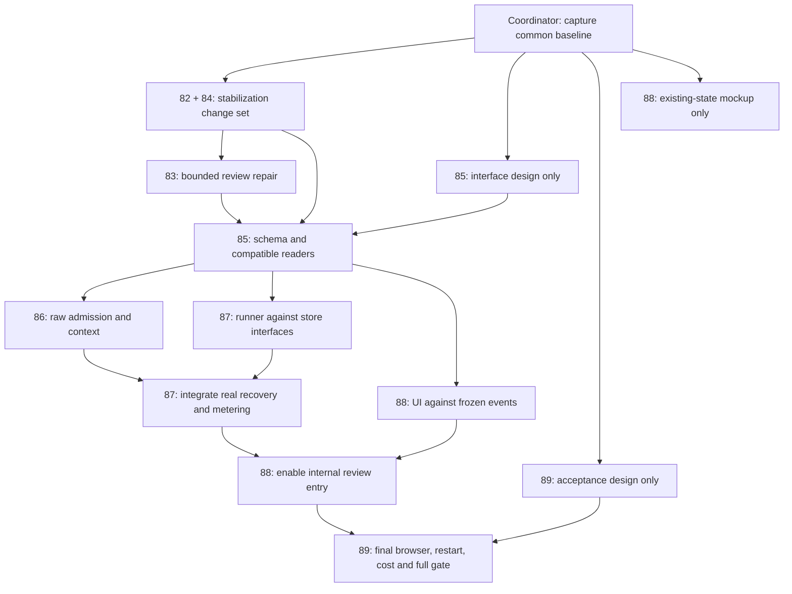

<!-- tasker/81-chat-workflow-implementation-program.md -->

# 81 — Chat workflow implementation program

**Created:** 2026-09-12  
**Status:** Implementation and verification remain open. The 82/84 stabilization gate is not accepted: the September 14 isolated run scored **45/52**, with Case 8 latency and Case 9/10/14 content/quality failures. Source provenance was stable. See [Task 90 closeout](../docs/technical/reviews/CHAT_WORKFLOW_TASK90_CLOSEOUT_2026-09-14.md).

**September 14 validation:** The provider/reviewer repairs passed 392 focused tests, worker source/test types, and changed-runtime lint. DJ then authorized one full gate; it failed and was classified without an unchanged rerun. See the [complete receipt and next repairs](../docs/technical/reviews/CHAT_WORKFLOW_TASK90_GATE_RESULT_2026-09-14.md). Earlier scorecards remain preserved.

**Current sequencing decision (September 14):** DJ closed Task 90 after the further
focused repair batch and deferred calendar work so the program can move on. The
latest batch passed 371 focused worker tests and 12/12 selected live turns. Proceed
with 83's bounded-review and prompt-snapshot implementation from this recorded
baseline; 82 retains the grounding follow-up and 89 retains acceptance debt. This
supersedes the requirement below to wait for a new full stabilization gate before
starting 83. It does not mark that gate passed, enable new writers, or authorize
production deployment. See the [closeout and ownership](../docs/technical/reviews/CHAT_WORKFLOW_TASK90_CLOSEOUT_2026-09-14.md).

**Task 83 closed (September 14):** DJ closed bounded reviews and prompt snapshots
after:

- 146 focused tests;
- a real-Postgres reproduction and fix of the snapshot rejection;
- one live QA replay that completed both specialists with a valid prewarmed snapshot.

Residuals moved to three owners:

- 85: the production migration before deploy.
- 87: physical request metering and a reasoning bound.
- 89: the full gate and a live intentional-partial check.

The workflow provider now belongs to 87. See the
[Task 83 receipt](../docs/technical/reviews/CHAT_WORKFLOW_TASK83_BOUNDED_REVIEWS_2026-09-14.md).

**September 18 decision:** DJ waived the per-change-set full gate. 86 and 87 are built and
merged on `main` behind default-off switches, with focused and local real-Postgres proof.
One full gate plus the live browser/restart acceptance runs once at 89. All work now
happens directly on `main`; there are no worktrees or integration branches.

**Owner:** One coordinator/integrator. Assign the implementation packages below to other agents.

## Outcome

A user requests a project review in ordinary chat, immediately gets a durable queued
turn, sees the worker gather context and run two bounded investigations, and receives
one streamed answer. A restart reuses accepted work. Stop, partial results, failures,
and reconnects are clear. The pilot remains explicitly enabled, project-scoped,
text-only, and read-only.

This program implements the remaining [workflow build list](../apps/worker/src/workers/agentic-chat/djflow-build-list.md).
It does not authorize production deployment, general autonomous writes, web research,
a new queue, or a general-purpose agent platform.

## Read the baseline correctly

Read the [architecture](../apps/worker/src/workers/agentic-chat/djflow-architecture.md),
[prototype guide](../apps/worker/src/workers/agentic-chat/djflow-prototype.md),
[startup-stall report](../docs/technical/reviews/DJFLOW_STARTUP_STALL_2026-09-12.md),
and [mandatory gate](../docs/testing/agentic-chat-gate.md).

As recorded on September 12:

- The queued fixed workflow, progress card, cancellation, saved findings, read-only
  boundary, and incremental final synthesis already exist. Preserve them.
- The concurrent Realtime subscription startup race has a tested fix. The replay
  completed in 34.46 seconds after admission, about 38.27 seconds after the observed
  click. It ended **Partial review ready** because the risk reviewer hit its output
  limit. This is one observation, not a first-token benchmark or a latency guarantee.
- Prewarmed workflow prompt capture logged
  `agentic_chat_prompt_snapshot_invalid_runtime_augmentation`.
- The latest complete gate **failed at 44/52**: missing task dependencies,
  model-authored HTML escaping in verbatim document content, and status quality,
  latency, and read-count failures. An earlier 52/52 behavior score still failed timing.
- Worker-owned admission, durable step recovery, and durable cost reservations are
  not implemented. Ordinary chat still needs an explicit review entry.

Retain `output/agentic-gate/djflow-subscription-race-2026-09-12/` and
`output/workflow-startup-stall-2026-09-12/`. These are ignored local evidence, not
files guaranteed to exist in a fresh worktree. The coordinator supplies a private
copy or a redacted evidence packet to each relevant owner; never copy credentials
into a tasker, patch, or handoff. Verify the actual checkout before relying on these
point-in-time findings.

## Assignable packages

| Task                                                                                                                                         | Deliverable                                                                  | Can begin                                                                                                                                                                                        | Integration prerequisite                                                                         |
| -------------------------------------------------------------------------------------------------------------------------------------------- | ---------------------------------------------------------------------------- | ------------------------------------------------------------------------------------------------------------------------------------------------------------------------------------------------ | ------------------------------------------------------------------------------------------------ |
| [82 — Regression repairs](82-chat-workflow-regression-repairs.md)                                                                            | Reliable dependencies, exact text, grounded status and bounded reads         | Immediately after baseline capture                                                                                                                                                               | Together with 84 as the stabilization change set                                                 |
| 83 — Complete bounded reviews: **done 2026-09-14** ([receipt](../docs/technical/reviews/CHAT_WORKFLOW_TASK83_BOUNDED_REVIEWS_2026-09-14.md)) | Bounded specialist outputs and valid prewarmed prompt snapshots              | Closed by DJ                                                                                                                                                                                     | 89 holds the gate debt and the live intentional-partial check; 85 ships the production migration |
| [84 — Delivery and stall visibility](84-chat-workflow-delivery-and-stall-visibility.md)                                                      | Model work independent of slow live delivery; truthful per-turn progress age | Immediately, alongside 82                                                                                                                                                                        | Together with 82 as the stabilization change set                                                 |
| [85 — Durable contracts and storage](85-chat-workflow-durable-contracts.md)                                                                  | Frozen interfaces, v4 readers, context/step/cost RPCs and isolated SQL proof | Interface frozen and storage/readers implemented 2026-09-14 (stabilization prerequisite waived by DJ; [receipt](../docs/technical/reviews/CHAT_WORKFLOW_TASK85_DURABLE_CONTRACTS_2026-09-14.md)) | QA migrations applied; combined gate and production migrations owed; new writers remain off      |
| [86 — Lightweight submission](86-chat-workflow-lightweight-submission.md)                                                                    | Atomic raw admission and worker context preparation                          | After 85 interface freeze; integration after its schema/readers                                                                                                                                  | 85 accepted; exercise raw path with fake provider until 87                                       |
| [87 — Recoverable steps and budgets](87-chat-workflow-recoverable-steps.md)                                                                  | Persistent runner, physical dispatch reservations, fenced recovery           | Pure runner against 85 interfaces; parallel with 86                                                                                                                                              | 85 and 86 accepted; then enable raw workflow model execution in QA                               |
| [88 — Ordinary-chat experience](88-chat-workflow-ordinary-chat.md)                                                                           | Review entry, progress, findings, reconnect and terminal UX                  | Existing-state mockup now; new-state implementation after 85 freeze                                                                                                                              | 86 and 87 accepted before live review entry is enabled                                           |
| [89 — Integration and acceptance](89-chat-workflow-integration-acceptance.md)                                                                | Fault harness, measured browser journey, comparison and evidence packet      | Test design now; fixtures after interface freeze                                                                                                                                                 | Final acceptance after 82–88                                                                     |

**Recommended staffing:** one coordinator and up to three implementation agents.
Use isolated worktrees for parallel coding. Share one test schedule across all of
them; parallel coding does not mean parallel heavy validation or competing workers.
The coordinator can own 89 rather than creating a separate QA agent.

## Order and parallel work

Arrows describe integration dependencies. 85 implementation may be developed while
83 is being finished, but its migration/reader change set integrates after 83.
86 and 87 may implement against frozen interfaces concurrently; 87's real wiring
and restart test follow 86. UI fixtures can proceed without the real worker.

1. **Prepare the common baseline.** The current workspace contains staged,
   unstaged, and untracked changes from several efforts. Record the selected source
   and explicit path manifest. Supply an inspectable snapshot containing the actual
   prototype to every worktree; starting from HEAD alone loses uncommitted work.
   Do not blanket stage, restore, reset, or copy private env files. If a source
   snapshot commit is needed, use only an explicitly reviewed path list.
2. **Stabilize first.** Assign 82 and 84 in parallel with separate file ownership.
   Assign 85 interface design as the third lane. Integrate 82/84 as one coordinated
   repair change set and run the complete gate. Repair failures within that set;
   do not stack new architecture on a failed baseline.
3. **Make the existing review dependable.** Integrate 83 and gate it. During this,
   85 can implement its frozen schema/readers in isolation. Integrate and gate 85
   next, with new writers and recovery activation disabled.
4. **Build the new path in parallel.** Assign 86 admission/context, 87 runner/budget,
   and 88 UI. Each uses 85's interfaces. Integrate and gate **86 → 87 → 88**.
   86 proves preparation using fakes in the isolated environment; do not send a v4
   request to a model before 87 supplies durable dispatch reservation.
5. **Prove the whole journey.** Finish 89 after the last integration. Report a
   working local/internal pilot only after its browser and fault criteria pass.

Every runtime change set needs the full gate before the next is stacked. A failed
gate keeps that change set open; the coordinator returns the failure to its owner.
Code waiting in another worktree may continue, but is not integrated or called done.

## Freeze these decisions before dependent work

85 publishes the definitive wire/storage interfaces, examples, and error outcomes.
It incorporates requirements from 84, 86, 87, and 88 before marking **interface
freeze ready**. The coordinator records that receipt; this is an engineering
handoff, not a request for DJ to approve routine details.

- Input is a distinct `agentic_chat_input_v4` request artifact, alongside current
  v3 and retained v2 prepared-input readers. Keep a non-null immutable request ID;
  never fake an empty v2/v3 prompt. Hash binds review intent, scope, and policy.
- Frozen raw history is captured at admission. Prepared context is a separate,
  immutable, request-hash-bound checkpoint. Reuse it on recovery; recheck current
  access before execution without silently replacing the frozen evidence.
- Fixed planner, analyst, risk-reviewer, and editor workflow; zero model tools in
  this pilot. The risk reviewer is a workflow role, distinct from the ordinary
  mutation safety reviewer. Do not change that safety reviewer's model policy here.
- Preserve incremental final synthesis. Older architecture text allowing buffered
  synthesis is superseded by the implemented streaming requirement. Define durable
  answer offsets/checkpoints so retry cannot duplicate visible text.
- At most two simultaneous specialist calls within existing shared capacity. Set
  finite per-step output/attempt limits, dispatch limits, a configured spend cap,
  synthesis headroom, and a persisted whole-run deadline. Starting proposals in
  the architecture are $0.25/run, 20% synthesis headroom, two step attempts, and
  15 minutes total lifetime; validate and freeze exact values with model pricing.
  They are engineering limits, not customer pricing or promised completion times.
- Separate the per-invocation provider deadline, stalled-worker detection, artifact
  retention, and whole-workflow lifetime. Current defaults are five minutes for
  provider work and seven minutes for stale detection. Current recovery expiry uses
  `retain_until`; do not reintroduce an obsolete five-minute queue-age rule.
- One terminal authority, server-owned per-turn review policy, monotonic durable
  event sequence, cancellation fencing, and unchanged ordinary mutation recovery.

## File ownership and integration locks

| Surface                                                                                 | Owner / handoff                                                                                                                        |
| --------------------------------------------------------------------------------------- | -------------------------------------------------------------------------------------------------------------------------------------- |
| Ordinary prompts, mutation review, Cedar correctness fixtures                           | 82; coordinate with 65/67/70/80                                                                                                        |
| Workflow role prompts, bounded output, prompt-snapshot correction                       | 87 (inherited `workflow/prototype-provider.ts` and `workflow/role-report.ts` when 83 closed on 2026-09-14); migration shipping with 85 |
| `streamPublisher.ts`, `supabaseStreamPublisherAdapters.ts`, delivery health             | 84; later changes go through its interface                                                                                             |
| Shared wire types, SQL migrations/RPCs, generated DB types                              | 85 throughout the program; consumers request amendments instead of inventing schemas                                                   |
| `executionInput.ts`                                                                     | 85 reader contract, then explicit handoff to 86; 87 consumes its result                                                                |
| Web admission/preparation, shared context, workflow context loader                      | 86; preserve Tasker 75's ordinary prepared lane                                                                                        |
| Workflow scheduler/store adapters, cost adapter, recovery handlers, dispatch hook       | 87 after 83/85 handoffs                                                                                                                |
| Chat components, session controller, SSE projection                                     | 88; coordinate with 62                                                                                                                 |
| Live harness, evidence capture, test schedule                                           | 89/coordinator; product oracles stay strict                                                                                            |
| `turn-executor.ts`, `bootstrap.ts`, `composition-root.ts`, `config.ts`, package scripts | **Coordinator integration lock**: one owner edits at a time                                                                            |

For shared composition files, each task supplies a small proposed wiring diff.
The coordinator applies it sequentially or explicitly grants that task temporary
ownership. Never have two agents refactor the executor concurrently. Avoid shared
dependency/lockfile upgrades unless a reproduced constraint requires one.

## Validation and handoff protocol

- Each agent runs narrow, relevant tests through `test-gate`, honoring root AGENTS.
  No root `pnpm test:run`, `pnpm verify`, broad suite fan-out, or worker-limit overrides.
  On resource refusal, wait at least 60 seconds, retry once, then report the block.
- One coordinator owns the isolated QA database and full `pnpm agentic:gate` runs.
  Stop any Workflow Lab runner attached to that database first; port differences
  do not isolate queues. At handoff, the known lab uses 5188/5189. Identify the
  process and its source before stopping it; never kill unrelated workers by name.
- Use the private `AGENTIC_GATE_ENV_FILE`; never print its values. Calendar and
  isolated DB prerequisites are mandatory. Preserve provenance and all three
  repetitions. 52/52 without the timing/read limits is still a failure.
- Preserve every failure and its original output directory. Diagnostics cannot
  replace the full gate, and repeatedly sampling until a favorable answer appears
  does not establish a fix.
- A task agent reports **ready for integration**, listing source identity, owned
  paths, contract changes, tests, evidence, limitations, and remaining wiring.
  The coordinator records **accepted** only after integrated validation passes.

Use this assignment message with any package:

> Read tasker/81-chat-workflow-implementation-program.md and tasker/NN-TASK.md.
> Implement only that package from the coordinator's supplied baseline, respecting
> its start conditions and file ownership. Preserve unrelated changes. Do not deploy
> or run a competing QA worker. Return an inspectable diff, focused validation,
> evidence paths, and any integration steps. If a prerequisite is not ready, finish
> the independent design/fixture work and report the exact missing interface.

## Existing tracker boundaries

82 owns the named September 12 isolated gate failures; [70](70-agentic-chat-production-battery-remediation.md)
and [80 WP-7](80-agentic-chat-post-audit-follow-through.md) keep their distinct production
battery obligations. Share fixes and evidence, do not launch competing prompt changes.
[67](67-agentic-chat-redundant-read-round-planning.md) retains exact-read telemetry:
11 reads alone does not prove duplicate reads. [75](75-agentic-chat-prepared-admission-lease.md)
keeps ordinary prepared-admission measurement. [80 WP-3](80-agentic-chat-post-audit-follow-through.md)
keeps ordinary/mutating-turn recovery; 87 owns only the enforced read-only workflow.
[61](61-agentic-chat-multi-replica-capacity-observability.md) keeps fleet capacity;
84 owns per-turn delivery/progress health. [62](62-agent-chat-modal-state-orchestration-decomposition.md)
keeps broader modal decomposition. [34](34-project-review-holistic-synthesis.md)
keeps scheduled Project Review synthesis; this program is explicit conversational review.

## Coordinator checklist and exit

- [ ] Common source/evidence snapshot distributed; ownership and QA slot recorded.
- [ ] 82 + 84 stabilization accepted; original scorecards preserved.
- [x] 83 closed by DJ on 2026-09-14. A complete review was proven live, and partial reviews with fakes; 89 holds the gate and the live partial check ([receipt](../docs/technical/reviews/CHAT_WORKFLOW_TASK83_BOUNDED_REVIEWS_2026-09-14.md)).
- [x] 85 interface freeze and compatible schema/readers integrated (migrations committed `bd356380b`; consumers 86/87 needed no amendment).
- [x] 86 worker preparation integrated on `main` (`a8521ae14`), switches off; live acceptance moved to 89.
- [x] 87 runner, dispatch metering, recovery and slice C integrated on `main`, execution switch off; local real-process restart proven. Real OpenRouter/Railway kill moved to 89.
- [ ] 88 reshaped by DJ on 2026-09-18 into the Jev freshness radar (see 88); browser journey pending.
- [ ] 89 final full gate, real restart, timing/cost comparison and residual report accepted.

Put final evidence in durable feature/testing docs and update the workflow build
list. Before deleting completed taskers under the folder maintenance rule, replace
their dependency links here with the durable completion receipt. This tracker exits
when the bounded pilot is testable and every package has that receipt; production
rollout is a separately scoped task.
