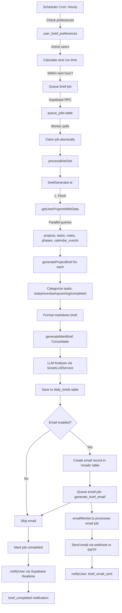

# Daily Brief Generation and Notification System Research

## Executive Summary

This document provides a comprehensive analysis of the daily brief generation system in the BuildOS worker service, including job processing, scheduling, notification delivery, and user preference handling.

**Key Finding:** Daily briefs are generated via a sophisticated cron-based scheduler that triggers queue jobs processed by a Supabase-based worker system. After brief completion, two separate notification mechanisms are used:

1. **Real-time Supabase notifications** via `notifyUser()` for instant UI updates
2. **Asynchronous email delivery** via a separate job queue for email notifications

## Table of Contents

1. [Architecture Overview](#architecture-overview)
2. [Daily Brief Generation Flow](#daily-brief-generation-flow)
3. [Scheduler & Cron System](#scheduler--cron-system)
4. [Database Tables](#database-tables)
5. [Notification System](#notification-system)
6. [User Preferences](#user-preferences)
7. [Email Delivery Mechanism](#email-delivery-mechanism)
8. [SMS Capabilities](#sms-capabilities)
9. [Key Integration Points](#key-integration-points)

---

## Architecture Overview

### Core Components

The daily brief system consists of four main components:

```
┌─────────────────────────────────────────────────────────────┐
│                    Scheduler (Cron)                          │
│         /apps/worker/src/scheduler.ts                        │
│  - Runs hourly: "0 * * * *"                                  │
│  - Checks user_brief_preferences                             │
│  - Queues jobs via Supabase queue                            │
└────────────────────────┬────────────────────────────────────┘
                         │
                         ▼
┌─────────────────────────────────────────────────────────────┐
│              Queue System (Supabase-based)                   │
│         /apps/worker/src/lib/supabaseQueue.ts                │
│  - No Redis dependency                                       │
│  - Atomic job claiming                                       │
│  - Priority-based processing                                 │
└────────────────────────┬────────────────────────────────────┘
                         │
                         ▼
┌─────────────────────────────────────────────────────────────┐
│                   Worker Processors                          │
│         /apps/worker/src/worker.ts                           │
│  - processBrief() → briefWorker.ts                           │
│  - processEmailBrief() → emailWorker.ts                      │
└────────────────────────┬────────────────────────────────────┘
                         │
                         ▼
┌─────────────────────────────────────────────────────────────┐
│              Brief Generation Logic                          │
│    /apps/worker/src/workers/brief/briefGenerator.ts         │
│  - Fetches user data (projects, tasks, notes, phases)       │
│  - Generates markdown briefs                                 │
│  - Creates LLM analysis (DeepSeek via OpenRouter)            │
└──────────────────────────────────────────────────────────────┘
```

---

## Daily Brief Generation Flow

### Complete Pipeline (End-to-End)



### Step-by-Step Breakdown

#### 1. **Scheduler Trigger** (`/apps/worker/src/scheduler.ts`)

**Cron Pattern:** `"0 * * * *"` (every hour)

```typescript
// Runs every hour
cron.schedule('0 * * * *', async () => {
	console.log('🔍 Checking for scheduled briefs...');
	await checkAndScheduleBriefs();
});
```

**What it does:**

- Fetches all users with `is_active = true` in `user_brief_preferences`
- Calculates next run time based on user timezone, time_of_day, and frequency
- Batches engagement checks (if `ENGAGEMENT_BACKOFF_ENABLED=true`)
- Filters users needing briefs within the next hour
- Checks for existing jobs to prevent duplicates
- Queues jobs in parallel via `queueBriefGeneration()`

#### 2. **Job Queuing** (`/apps/worker/src/scheduler.ts#queueBriefGeneration`)

**Key Logic:**

- Fetches latest timezone from `user_brief_preferences`
- Calculates brief date in user's timezone
- Creates deduplication key: `brief-${userId}-${briefDate}`
- Adds job to Supabase queue with priority (1=immediate, 10=scheduled)

```typescript
const job = await queue.add('generate_daily_brief', userId, jobData, {
	priority,
	scheduledFor,
	dedupKey: isImmediate ? `${dedupKey}-${Date.now()}` : dedupKey
});
```

#### 3. **Worker Processing** (`/apps/worker/src/worker.ts`)

**Registered Processors:**

```typescript
queue.process('generate_daily_brief', processBrief);
queue.process('generate_brief_email', processEmailBrief);
queue.process('generate_phases', processPhases);
queue.process('onboarding_analysis', processOnboarding);
queue.process('send_sms', processSMS);
```

#### 4. **Brief Generation** (`/apps/worker/src/workers/brief/briefWorker.ts`)

**Execution Flow:**

1. **Update job status to "processing"**
2. **Fetch user timezone** from `user_brief_preferences`
3. **Calculate brief date** in user's timezone
4. **Call `generateDailyBrief()`** (core generation logic)
5. **Create email record** (if user has `email_daily_brief = true`)
6. **Queue email job** (non-blocking, separate job)
7. **Update job status to "completed"**
8. **Send real-time notification** via `notifyUser()`

#### 5. **Core Brief Generation** (`/apps/worker/src/workers/brief/briefGenerator.ts`)

**Data Fetching (Parallel):**

```typescript
const [tasksResponse, notesResponse, phasesResponse, phaseTasksResponse, calendarEventsResponse] =
	await Promise.all([
		supabase.from('tasks').select('*').in('project_id', projectIds),
		supabase.from('notes').select('*').in('project_id', projectIds),
		supabase.from('phases').select('*').in('project_id', projectIds),
		supabase.from('phase_tasks').select('*'),
		supabase.from('task_calendar_events').select('*').eq('user_id', userId)
	]);
```

**Project Brief Processing:**

```typescript
// Parallel project brief generation
const projectBriefPromises = projects.map(async (project) => {
	return await generateProjectBrief(project, briefDateInUserTz, userTimezone);
});

const projectBriefResults = await Promise.allSettled(projectBriefPromises);
```

**Task Categorization (per project):**

- **Today's tasks**: Tasks with `start_date` within today (user timezone)
- **Overdue tasks**: Tasks with `start_date` before today, not done
- **Upcoming tasks**: Next 10 tasks (phased or unphased projects)
- **Next 7 days tasks**: Tasks starting within next week
- **Recently completed**: Tasks completed in last 24 hours

**Main Brief Consolidation:**

```typescript
const mainBriefContent = generateMainBrief(projectBriefs, briefDateInUserTz, userTimezone);
const priorityActions = extractPriorityActions(mainBriefContent);
```

**LLM Analysis:**

- Uses `SmartLLMService` with DeepSeek Chat V3 (via OpenRouter)
- Cost: $0.14/1M tokens
- Temperature: 0.4 (standard), 0.7 (re-engagement)
- Max tokens: 2200 (standard), 1500 (re-engagement)

**Re-engagement Logic:**

```typescript
if (isReengagement && daysSinceLastLogin > 0) {
	// Generate re-engagement email with custom subject line
	llmAnalysis = await llmService.generateText({
		prompt: ReengagementBriefPrompt.buildUserPrompt(reengagementPrompt),
		systemPrompt: ReengagementBriefPrompt.getSystemPrompt(daysSinceLastLogin)
	});
}
```

**Database Update:**

```typescript
await supabase.from('daily_briefs').update({
	summary_content: mainBriefContent,
	priority_actions: priorityActions,
	project_brief_ids: projectBriefs.map((b) => b.id),
	llm_analysis: llmAnalysis,
	generation_status: 'completed',
	metadata: {
		is_reengagement: isReengagement,
		days_since_last_login: daysSinceLastLogin,
		email_subject: isReengagement ? customSubject : undefined
	}
});
```

---

## Scheduler & Cron System

### Cron Configuration

**File:** `/apps/worker/src/scheduler.ts`

**Schedule:** Hourly check (`"0 * * * *"`)

**Startup Behavior:**

- Runs once 5 seconds after startup
- Then runs every hour on the hour

```typescript
export function startScheduler() {
	console.log('📅 Starting scheduler...');

	// Run every hour to check for scheduled briefs
	cron.schedule('0 * * * *', async () => {
		console.log('🔍 Checking for scheduled briefs...');
		await checkAndScheduleBriefs();
	});

	// Also run once at startup
	setTimeout(() => {
		checkAndScheduleBriefs();
	}, 5000);
}
```

### Scheduling Logic

**Three-Phase Process:**

1. **Phase 1: Batch Engagement Checks** (if enabled)
    - Fetches engagement data for ALL active users
    - Uses `BriefBackoffCalculator.shouldSendDailyBrief()`
    - Creates decision map: `{ userId → { shouldSend, isReengagement, daysSinceLastLogin } }`

2. **Phase 2: Calculate Next Run Times**
    - Calculates next run time for each user
    - Filters users whose next run is within the next hour
    - Applies engagement backoff filter

3. **Phase 3: Batch Job Queuing**
    - Single database query to check existing jobs
    - Filters out users with existing jobs (30-minute tolerance window)
    - Queues remaining jobs in parallel

### Timezone Handling

**Key Functions:**

```typescript
// Calculate daily run time in user's timezone
function calculateDailyRunTime(
	now: Date,
	hours: number,
	minutes: number,
	seconds: number,
	timezone: string
): Date {
	const nowInUserTz = utcToZonedTime(now, timezone);
	let targetInUserTz = setHours(nowInUserTz, hours);
	targetInUserTz = setMinutes(targetInUserTz, minutes);
	targetInUserTz = setSeconds(targetInUserTz, seconds);

	// If target time has passed today, schedule for tomorrow
	if (isBefore(targetInUserTz, nowInUserTz)) {
		targetInUserTz = addDays(targetInUserTz, 1);
	}

	return zonedTimeToUtc(targetInUserTz, timezone);
}
```

**Supported Frequencies:**

- `daily`: Runs at specified time_of_day in user's timezone
- `weekly`: Runs on specified day_of_week at time_of_day
- `custom`: Treated as daily (future enhancement)

### Engagement Backoff

**Feature Flag:** `ENGAGEMENT_BACKOFF_ENABLED` (default: `false`)

**Purpose:** Reduce brief fatigue for inactive users

**Logic:** (`/apps/worker/src/lib/briefBackoffCalculator.ts`)

- Standard users: Send daily briefs as scheduled
- Inactive users (>3 days): Throttle to 4 emails over 60 days
- Re-engagement emails have custom subject lines

**Implementation:**

```typescript
const backoffDecision = await backoffCalculator.shouldSendDailyBrief(userId);

if (!backoffDecision?.shouldSend) {
	console.log(`⏸️ Skipping brief for user ${userId}: ${backoffDecision?.reason}`);
	continue;
}

const briefType = backoffDecision.isReengagement ? 're-engagement' : 'standard';
```

---

## Database Tables

### Core Tables

#### 1. **`user_brief_preferences`**

**Purpose:** Store user scheduling preferences for daily briefs

**Schema:**

```typescript
{
	id: string; // UUID primary key
	user_id: string; // FK to users.id
	is_active: boolean | null; // Enable/disable briefs
	frequency: string | null; // "daily" | "weekly" | "custom"
	time_of_day: string | null; // "09:00:00" (HH:MM:SS)
	timezone: string | null; // "America/New_York"
	day_of_week: number | null; // 0 (Sunday) to 6 (Saturday)
	email_daily_brief: boolean | null; // Enable email delivery
	created_at: string;
	updated_at: string;
}
```

**Key Fields:**

- `is_active`: Master switch for brief generation
- `email_daily_brief`: Separate toggle for email delivery
- `timezone`: IANA timezone string (e.g., "America/Los_Angeles")
- `time_of_day`: Time in 24-hour format

#### 2. **`queue_jobs`**

**Purpose:** Supabase-based job queue (replaces Redis/BullMQ)

**Schema:**

```typescript
{
	queue_job_id: string; // UUID primary key
	user_id: string; // FK to users.id
	job_type: string; // "generate_daily_brief" | "generate_brief_email" | ...
	status: QueueJobStatus; // "pending" | "processing" | "completed" | "failed"
	priority: number; // 1 (high) to 10 (low)
	metadata: JSONB; // Job-specific data
	scheduled_for: timestamp; // When to run
	created_at: timestamp;
	started_at: timestamp | null;
	completed_at: timestamp | null;
	processed_at: timestamp | null;
	error_message: text | null;
	attempts: number; // Retry count
	dedup_key: string | null; // For deduplication
}
```

**Job Types:**

- `generate_daily_brief`: Main brief generation
- `generate_brief_email`: Email delivery (separate job)
- `generate_phases`: Phase generation
- `onboarding_analysis`: Onboarding questionnaire
- `send_sms`: SMS delivery

#### 3. **`daily_briefs`**

**Purpose:** Store generated daily brief content

**Schema:**

```typescript
{
  id: string;                           // UUID primary key
  user_id: string;                      // FK to users.id
  brief_date: string;                   // "YYYY-MM-DD" in user timezone
  summary_content: string;              // Markdown main brief
  priority_actions: string[] | null;    // Extracted priority tasks
  project_brief_ids: string[] | null;   // FK to project_daily_briefs.id
  llm_analysis: string | null;          // AI-generated analysis
  generation_status: string;            // "processing" | "completed" | "failed"
  generation_started_at: timestamp | null;
  generation_completed_at: timestamp | null;
  generation_progress: JSONB | null;    // { step, progress }
  generation_error: string | null;
  metadata: JSONB | null;               // Custom metadata (re-engagement, etc.)
  created_at: timestamp;
  updated_at: timestamp;
}
```

**Key Fields:**

- `brief_date`: Always in user's timezone (not UTC!)
- `summary_content`: Full markdown brief with project breakdowns
- `llm_analysis`: AI-generated insights (displayed in email/UI)
- `metadata`: Can include re-engagement flags, custom subject lines

#### 4. **`project_daily_briefs`**

**Purpose:** Per-project brief details

**Schema:**

```typescript
{
	id: string;
	project_id: string; // FK to projects.id
	user_id: string; // FK to users.id
	brief_date: string; // "YYYY-MM-DD"
	brief_content: string; // Markdown project brief
	generation_status: string;
	generation_started_at: timestamp | null;
	generation_completed_at: timestamp | null;
	metadata: JSONB | null; // Task counts, phase info
	created_at: timestamp;
	updated_at: timestamp;
}
```

**Metadata Structure:**

```typescript
{
	current_phase_name: string | null;
	current_phase_id: string | null;
	todays_task_count: number;
	overdue_task_count: number;
	upcoming_task_count: number;
	next_seven_days_task_count: number;
	recently_completed_count: number;
	recent_notes_count: number;
}
```

#### 5. **`emails`**

**Purpose:** Email tracking and delivery

**Schema:**

```typescript
{
	id: string; // UUID primary key
	created_by: string; // FK to users.id
	from_email: string; // "noreply@build-os.com"
	from_name: string; // "BuildOS"
	subject: string;
	content: string; // Full HTML email
	category: string; // "daily_brief"
	status: string; // "pending" | "sent" | "failed" | "cancelled"
	tracking_enabled: boolean | null;
	tracking_id: string | null; // UUID for tracking pixel
	template_data: JSONB | null; // { brief_id, brief_date, user_id }
	created_at: timestamp;
	updated_at: timestamp;
}
```

#### 6. **`email_recipients`**

**Purpose:** Per-recipient email tracking

**Schema:**

```typescript
{
	id: string;
	email_id: string; // FK to emails.id
	recipient_email: string;
	recipient_type: string; // "to" | "cc" | "bcc"
	status: string; // "pending" | "sent" | "delivered" | "failed" | "bounced"
	sent_at: timestamp | null;
	opened_at: timestamp | null;
	clicked_at: timestamp | null;
	error_message: text | null;
	created_at: timestamp;
	updated_at: timestamp;
}
```

#### 7. **`user_sms_preferences`**

**Purpose:** SMS notification preferences

**Schema:**

```typescript
{
	id: string;
	user_id: string; // FK to users.id
	daily_brief_sms: boolean | null; // Enable SMS for briefs
	event_reminders_enabled: boolean | null;
	evening_recap_enabled: boolean | null;
	daily_sms_limit: number | null; // Rate limiting
	daily_sms_count: number | null;
	daily_count_reset_at: timestamp | null;
	created_at: timestamp | null;
	updated_at: timestamp | null;
}
```

#### 8. **`user_notifications`**

**Purpose:** In-app notification system

**Schema:**

```typescript
{
	id: string;
	user_id: string; // FK to users.id
	type: string; // "brief_completed" | "brief_email_sent" | ...
	title: string;
	message: string;
	action_url: string | null;
	priority: string | null; // "low" | "medium" | "high"
	read_at: timestamp | null;
	dismissed_at: timestamp | null;
	expires_at: timestamp | null;
	created_at: timestamp | null;
}
```

### Database Procedures (RPCs)

**File:** Supabase SQL migrations

**Key RPCs:**

1. **`add_queue_job`**: Atomic job insertion with deduplication

    ```sql
    add_queue_job(
      p_user_id uuid,
      p_job_type text,
      p_metadata jsonb,
      p_priority integer DEFAULT 10,
      p_scheduled_for timestamp DEFAULT now(),
      p_dedup_key text DEFAULT NULL
    )
    ```

2. **`claim_pending_jobs`**: Atomic batch job claiming

    ```sql
    claim_pending_jobs(p_batch_size integer DEFAULT 5)
    ```

3. **`complete_queue_job`**: Mark job as completed

    ```sql
    complete_queue_job(p_job_id uuid, p_result jsonb)
    ```

4. **`fail_queue_job`**: Mark job as failed with retry logic

    ```sql
    fail_queue_job(p_job_id uuid, p_error_message text)
    ```

5. **`reset_stalled_jobs`**: Recover stuck jobs

    ```sql
    reset_stalled_jobs(p_stalled_timeout_ms integer DEFAULT 300000)
    ```

6. **`cancel_brief_jobs_for_date`**: Atomic brief cancellation
    ```sql
    cancel_brief_jobs_for_date(p_user_id uuid, p_brief_date text)
    ```

---

## Notification System

### Dual Notification Architecture

BuildOS uses **two separate notification mechanisms** after brief completion:

1. **Real-time Notifications** (Supabase Realtime)
    - Instant UI updates
    - No persistence (ephemeral)
    - Delivered via WebSocket

2. **Email Notifications** (Asynchronous queue job)
    - Persistent email records
    - Separate job queue
    - Tracking and delivery confirmation

### Real-time Notifications (Supabase Realtime)

**File:** `/apps/worker/src/workers/shared/queueUtils.ts`

**Function:**

```typescript
export async function notifyUser(
  userId: string,
  event: string | { type: string; ... },
  payload?: any
) {
  try {
    const actualEvent = typeof event === "string" ? event : event.type;
    const actualPayload = typeof event === "string" ? payload : event;

    // Send realtime notification
    const channel = supabase.channel(`user:${userId}`);
    await channel.send({
      type: "broadcast",
      event: actualEvent,
      payload: actualPayload,
    });

    console.log(`📢 Sent notification to user ${userId}: ${actualEvent}`);
  } catch (error) {
    console.error("Failed to send notification:", error);
  }
}
```

**Notification Types:**

1. **`brief_completed`** (from `briefWorker.ts`)

    ```typescript
    await notifyUser(job.data.userId, 'brief_completed', {
    	briefId: brief.id,
    	briefDate: brief.brief_date,
    	timezone: timezone,
    	message: `Your daily brief for ${briefDate} is ready!`,
    	emailRecordCreated: !!emailRecordId
    });
    ```

2. **`brief_email_sent`** (from `emailWorker.ts`)

    ```typescript
    await notifyUser(userId, {
    	type: 'brief_email_sent',
    	emailId,
    	briefId,
    	briefDate,
    	trackingId: email.tracking_id ?? undefined
    });
    ```

3. **`brief_failed`**

    ```typescript
    await notifyUser(job.data.userId, 'brief_failed', {
    	error: errorMessage,
    	jobId: job.id,
    	message: 'Brief generation failed. Click to retry.'
    });
    ```

4. **`email_cancelled`**

    ```typescript
    await notifyUser(userId, {
    	type: 'email_cancelled',
    	emailId,
    	briefId,
    	briefDate
    });
    ```

5. **`brief_email_failed`**
    ```typescript
    await notifyUser(failedEmail.created_by, {
    	type: 'brief_email_failed',
    	emailId: job.data.emailId,
    	briefId: failedTemplateData?.brief_id,
    	briefDate: failedTemplateData?.brief_date,
    	error: error.message
    });
    ```

### Email Notification Flow

**Two-Phase Email System:**

#### Phase 1: Brief Completion → Email Record Creation

**Location:** `/apps/worker/src/workers/brief/briefWorker.ts` (lines 94-250)

**Process:**

1. Check if user has `email_daily_brief = true`
2. Fetch user email
3. Generate tracking ID
4. Format email content (HTML + plain text)
5. Create record in `emails` table (status: "pending")
6. Create record in `email_recipients` table
7. Queue email job: `generate_brief_email`
8. Continue with brief completion (non-blocking)

```typescript
// Create email record (status='pending')
const { data: emailRecord } = await supabase.from('emails').insert({
	created_by: job.data.userId,
	from_email: 'noreply@build-os.com',
	from_name: 'BuildOS',
	subject: subject,
	content: emailHtmlForStorage,
	category: 'daily_brief',
	status: 'pending', // ← Not sent yet!
	tracking_enabled: true,
	tracking_id: trackingId,
	template_data: {
		brief_id: brief.id,
		brief_date: briefDate,
		user_id: job.data.userId
	}
});

// Queue email job with emailId (not briefId!)
const { data: emailJob } = await supabase.rpc('add_queue_job', {
	p_user_id: job.data.userId,
	p_job_type: 'generate_brief_email',
	p_metadata: { emailId: emailRecord.id }, // ← Just emailId!
	p_priority: 5,
	p_scheduled_for: new Date().toISOString(),
	p_dedup_key: `email-${emailRecord.id}`
});
```

#### Phase 2: Email Job → Actual Email Delivery

**Location:** `/apps/worker/src/workers/brief/emailWorker.ts`

**Process:**

1. Fetch email record from `emails` table
2. Extract brief info from `template_data`
3. Re-check user preferences (may have changed)
4. Send email via webhook or SMTP
5. Update email status to "sent"
6. Update recipient status to "sent"
7. Send `brief_email_sent` notification

```typescript
export async function processEmailBriefJob(job: LegacyJob<EmailBriefJobData>) {
  const { emailId } = job.data;

  // 1. Fetch email record
  const { data: email } = await supabase
    .from("emails")
    .select("*, email_recipients(*)")
    .eq("id", emailId)
    .single();

  // 2. Extract brief info
  const briefId = email.template_data?.brief_id;
  const userId = email.created_by;

  // 3. Check preferences (may have changed)
  const { data: preferences } = await supabase
    .from("user_brief_preferences")
    .select("email_daily_brief, is_active")
    .eq("user_id", userId)
    .single();

  if (!preferences?.email_daily_brief) {
    // Mark as cancelled
    return;
  }

  // 4. Send email
  await emailService.sendEmail({ ... });

  // 5. Update status
  await supabase.from("emails").update({ status: "sent" }).eq("id", emailId);

  // 6. Notify user
  await notifyUser(userId, { type: "brief_email_sent", emailId, briefId });
}
```

---

## User Preferences

### Brief Scheduling Preferences

**Table:** `user_brief_preferences`

**Key Fields:**

1. **`is_active`**: Master switch
    - `true`: User receives scheduled briefs
    - `false`: No briefs generated

2. **`email_daily_brief`**: Email delivery toggle
    - `true`: Send email after brief generation
    - `false`: Brief generated but no email

3. **`frequency`**: Schedule type
    - `"daily"`: Every day at `time_of_day`
    - `"weekly"`: On `day_of_week` at `time_of_day`
    - `"custom"`: Reserved for future use

4. **`time_of_day`**: When to send (24-hour format)
    - Example: `"09:00:00"`
    - Interpreted in user's timezone

5. **`timezone`**: IANA timezone string
    - Example: `"America/New_York"`
    - Used for all date/time calculations

6. **`day_of_week`**: For weekly frequency
    - `0` = Sunday
    - `1` = Monday
    - ...
    - `6` = Saturday

### Preference Validation

**File:** `/apps/worker/src/scheduler.ts`

```typescript
export function validateUserPreference(preference: Partial<UserBriefPreference>): string[] {
	const errors: string[] = [];

	// Validate frequency
	if (preference.frequency && !['daily', 'weekly', 'custom'].includes(preference.frequency)) {
		errors.push('Invalid frequency. Must be daily, weekly, or custom');
	}

	// Validate time_of_day
	if (preference.time_of_day) {
		const timeParts = preference.time_of_day.split(':');
		if (timeParts.length < 2) {
			errors.push('Invalid time_of_day format. Expected HH:MM:SS');
		} else {
			const hours = parseInt(timeParts[0], 10);
			const minutes = parseInt(timeParts[1], 10);
			const seconds = parseInt(timeParts[2] || '0', 10);

			if (isNaN(hours) || hours < 0 || hours > 23) {
				errors.push('Invalid hours in time_of_day');
			}
			if (isNaN(minutes) || minutes < 0 || minutes > 59) {
				errors.push('Invalid minutes in time_of_day');
			}
			if (isNaN(seconds) || seconds < 0 || seconds > 59) {
				errors.push('Invalid seconds in time_of_day');
			}
		}
	}

	// Validate day_of_week
	if (preference.day_of_week !== undefined && preference.day_of_week !== null) {
		if (preference.day_of_week < 0 || preference.day_of_week > 6) {
			errors.push('Invalid day_of_week. Must be between 0 (Sunday) and 6 (Saturday)');
		}
	}

	return errors;
}
```

### SMS Preferences

**Table:** `user_sms_preferences`

**Key Fields:**

1. **`daily_brief_sms`**: Enable SMS for briefs
    - `true`: Send SMS notification when brief is ready
    - `false`: No SMS sent

2. **`event_reminders_enabled`**: Calendar event reminders

3. **`evening_recap_enabled`**: Evening summary SMS

4. **`daily_sms_limit`**: Rate limiting
    - Default: 10 messages per day
    - Prevents SMS spam

5. **`daily_sms_count`**: Current daily count

6. **`daily_count_reset_at`**: When count resets

**Note:** SMS functionality is **optional** and requires Twilio configuration.

---

## Email Delivery Mechanism

### Dual Email Transport

BuildOS supports **two email delivery methods**:

1. **Webhook to Main App** (preferred in production)
2. **Direct SMTP** (fallback or development)

### Configuration

**Environment Variables:**

```bash
# Method 1: Webhook to main app
USE_WEBHOOK_EMAIL=true
BUILDOS_WEBHOOK_URL=https://build-os.com/webhooks/daily-brief-email
PRIVATE_BUILDOS_WEBHOOK_SECRET=your_webhook_secret

# Method 2: Direct SMTP via Gmail
GMAIL_USER=your-gmail@gmail.com
GMAIL_APP_PASSWORD=your_app_password
GMAIL_ALIAS=noreply@build-os.com
EMAIL_FROM_NAME=BuildOS
```

### Email Sender Service

**File:** `/apps/worker/src/lib/services/email-sender.ts`

**Class:** `DailyBriefEmailSender`

**Key Methods:**

1. **`shouldSendEmail(userId: string): Promise<boolean>`**
    - Checks `user_brief_preferences.email_daily_brief`
    - Returns `true` if user opted in

2. **`getUserEmail(userId: string): Promise<string | null>`**
    - Fetches email from `users` table

3. **`formatBriefForEmail(brief, briefDate): { htmlContent, plainText }`**
    - Transforms relative URLs to absolute (`/projects/123` → `https://build-os.com/projects/123`)
    - Renders markdown to HTML
    - Adds tracking pixel
    - Wraps in email template

4. **`sendDailyBriefEmail(userId, briefDate, brief): Promise<boolean>`**
    - Main email sending method
    - Creates email record in database
    - Sends via webhook or SMTP
    - Updates tracking status

### Email Content Formatting

**URL Transformation:**

```typescript
private transformMarkdownUrls(markdown: string): string {
  // Transform markdown links: [text](/path) -> [text](https://build-os.com/path)
  let transformed = markdown.replace(
    /\[([^\]]+)\]\(\/([^)]+)\)/g,
    `[$1](${this.baseUrl}/$2)`
  );

  // Transform HTML links: <a href="/path"> -> <a href="https://build-os.com/path">
  transformed = transformed.replace(/href="\/([^"]+)"/g, `href="${this.baseUrl}/$1"`);

  // Transform image sources:  -> 
  transformed = transformed.replace(/!\[([^\]]*)\]\(\/([^)]+)\)/g, ``);

  return transformed;
}
```

**Email Template:**

```typescript
formatBriefForEmail(brief: DailyBriefResult, briefDate: string) {
  const hasAnalysis = Boolean(brief.llm_analysis && brief.llm_analysis.trim().length > 0);
  const sourceContent = hasAnalysis ? brief.llm_analysis : fallbackAnalysis;
  const transformedContent = this.transformMarkdownUrls(sourceContent || "");
  const htmlContent = renderMarkdown(transformedContent);

  const wrappedContent = `
<h1>📊 Your Daily Brief</h1>
<p style="...">${formattedDate}</p>
<div>${htmlContent}</div>
<hr />
<p>This daily brief was generated by BuildOS...</p>
<p>
  <a href="https://build-os.com/briefs/${brief.id}">View in BuildOS</a> •
  <a href="https://build-os.com/settings">Manage Email Preferences</a>
</p>
`.trim();

  return { htmlContent: wrappedContent, plainText };
}
```

### Email Tracking

**Tracking Pixel:**

```typescript
const trackingId = crypto.randomUUID();
const trackingPixel = ``;
```

**Tracking Flow:**

1. Email sent with unique `tracking_id`
2. User opens email → browser loads tracking pixel
3. Main app's `/api/email-tracking/{trackingId}` endpoint receives request
4. Updates `email_recipients.opened_at`
5. Creates event in `email_tracking_events` table

**Tracking Tables:**

- `emails.tracking_id`: Unique ID for tracking
- `emails.tracking_enabled`: Whether to track opens
- `email_recipients.opened_at`: When email was opened
- `email_recipients.clicked_at`: When links were clicked
- `email_tracking_events`: Granular tracking log

---

## SMS Capabilities

### SMS Worker

**File:** `/apps/worker/src/workers/smsWorker.ts`

**Job Type:** `send_sms`

**Dependencies:**

- Twilio (via `@buildos/twilio-service` package)
- Supabase (for SMS message tracking)

### SMS Configuration

**Environment Variables:**

```bash
PRIVATE_TWILIO_ACCOUNT_SID=your_account_sid
PRIVATE_TWILIO_AUTH_TOKEN=your_auth_token
PRIVATE_TWILIO_MESSAGING_SERVICE_SID=your_messaging_service_sid
PRIVATE_TWILIO_STATUS_CALLBACK_URL=https://build-os.com/api/twilio/status
```

**Note:** SMS is **optional**. If Twilio credentials are not configured, SMS jobs will fail gracefully.

### SMS Job Processing

```typescript
export async function processSMSJob(job: LegacyJob<any>) {
	if (!twilioClient || !smsService) {
		throw new Error('SMS service not available - Twilio credentials not configured');
	}

	const { message_id, phone_number, message } = job.data;

	// Send via Twilio
	const twilioMessage = await twilioClient.sendSMS({
		to: phone_number,
		body: message,
		metadata: { message_id, user_id: job.data.user_id }
	});

	// Update message status
	await supabase
		.from('sms_messages')
		.update({
			status: 'sent',
			twilio_sid: twilioMessage.sid,
			sent_at: new Date().toISOString()
		})
		.eq('id', message_id);

	// Notify user
	await notifyUser(job.data.user_id, 'sms_sent', { message_id, phone_number });
}
```

### SMS Retry Logic

**Exponential Backoff:**

```typescript
// Check if we should retry
const { data: message } = await supabase
	.from('sms_messages')
	.select('attempt_count, max_attempts')
	.eq('id', message_id)
	.single();

if (message && message.attempt_count < message.max_attempts) {
	// Re-queue with exponential backoff
	const delay = Math.pow(2, message.attempt_count) * 60; // minutes

	await supabase.rpc('add_queue_job', {
		p_job_type: 'send_sms',
		p_metadata: job.data,
		p_scheduled_for: new Date(Date.now() + delay * 60000).toISOString()
	});
}
```

**Rate Limiting:**

- `user_sms_preferences.daily_sms_limit`: Max messages per day
- `user_sms_preferences.daily_sms_count`: Current count
- `user_sms_preferences.daily_count_reset_at`: Reset timestamp

---

## Key Integration Points

### 1. **Perfect Place to Trigger Notification**

**Location:** `/apps/worker/src/workers/brief/briefWorker.ts` (line 255)

**After brief completion, before job completion:**

```typescript
// Brief generation completed successfully
await updateJobStatus(job.id, 'completed', 'brief');

// 👉 PERFECT PLACE TO TRIGGER NOTIFICATION 👈
await notifyUser(job.data.userId, 'brief_completed', {
	briefId: brief.id,
	briefDate: brief.brief_date,
	timezone: timezone,
	message: `Your daily brief for ${briefDate} is ready!`,
	emailRecordCreated: !!emailRecordId
});

// Additional notification types can be added here:
// - Push notification
// - In-app notification
// - SMS notification (if enabled)
```

**Why this is the perfect spot:**

1. ✅ Brief is fully generated and saved
2. ✅ Email record created (if enabled)
3. ✅ Email job queued (non-blocking)
4. ✅ Job is about to be marked completed
5. ✅ All data is available for notification

**Additional notification opportunities:**

```typescript
// After email is actually sent (in emailWorker.ts, line 146)
await notifyUser(userId, {
	type: 'brief_email_sent',
	emailId,
	briefId,
	briefDate,
	trackingId: email.tracking_id ?? undefined
});
```

### 2. **Email Delivery Hooks**

**Webhook Endpoint:** `/webhooks/daily-brief-email` (in main app)

**HMAC Authentication:**

```typescript
// Worker sends webhook with HMAC signature
const signature = crypto
	.createHmac('sha256', process.env.PRIVATE_BUILDOS_WEBHOOK_SECRET!)
	.update(JSON.stringify(payload))
	.digest('hex');

await fetch(webhookUrl, {
	method: 'POST',
	headers: {
		'Content-Type': 'application/json',
		'X-Webhook-Signature': signature
	},
	body: JSON.stringify(payload)
});
```

**Main app validates signature:**

```typescript
// In /apps/web/src/routes/webhooks/daily-brief-email/+server.ts
const receivedSignature = request.headers.get('X-Webhook-Signature');
const expectedSignature = crypto
	.createHmac('sha256', WEBHOOK_SECRET)
	.update(bodyString)
	.digest('hex');

if (receivedSignature !== expectedSignature) {
	return json({ error: 'Invalid signature' }, { status: 401 });
}
```

### 3. **Queue Job Lifecycle Hooks**

**Job Status Updates:** `/apps/worker/src/workers/shared/queueUtils.ts`

```typescript
export async function updateJobStatus(
	queueJobId: string,
	status: QueueJobStatus,
	jobType: string,
	errorMessage?: string
) {
	const updateData: any = {
		status: status,
		processed_at: new Date().toISOString(),
		updated_at: new Date().toISOString()
	};

	if (errorMessage) {
		updateData.error_message = errorMessage;
	}

	if (status === 'processing') {
		updateData.started_at = new Date().toISOString();
	} else if (status === 'completed') {
		updateData.completed_at = new Date().toISOString();
	}

	await supabase.from('queue_jobs').update(updateData).eq('queue_job_id', queueJobId);
}
```

**Progress Tracking:**

```typescript
// In briefGenerator.ts
async function updateProgress(
	briefId: string,
	progress: { step: string; progress: number },
	jobId?: string
) {
	// Update daily brief progress
	await supabase.from('daily_briefs').update({ generation_progress: progress }).eq('id', briefId);

	// Also update job metadata
	if (jobId) {
		await supabase
			.from('queue_jobs')
			.update({
				metadata: { ...currentMetadata, generation_progress: progress },
				updated_at: new Date().toISOString()
			})
			.eq('queue_job_id', jobId);
	}
}
```

### 4. **User Preference Change Hooks**

**API Endpoint:** `/apps/web/src/routes/api/brief-preferences/+server.ts`

**When user updates preferences:**

1. Update `user_brief_preferences` table
2. Cancel existing jobs if `is_active` set to `false`
3. Reschedule jobs if time/frequency changed
4. Update email preferences for queued email jobs

**Example cancellation logic:**

```typescript
// Cancel existing jobs for this user
const { count } = await supabase
	.from('queue_jobs')
	.update({ status: 'cancelled' })
	.eq('user_id', userId)
	.eq('job_type', 'generate_daily_brief')
	.in('status', ['pending', 'processing'])
	.select();

console.log(`Cancelled ${count} existing jobs for user ${userId}`);
```

### 5. **Real-time Listeners (Client-side)**

**Web App Listener:** (Future integration)

```typescript
// Subscribe to user notifications
const channel = supabase.channel(`user:${userId}`);

channel.on('broadcast', { event: 'brief_completed' }, (payload) => {
	console.log('Brief completed:', payload);
	// Update UI, show notification, etc.
});

channel.on('broadcast', { event: 'brief_email_sent' }, (payload) => {
	console.log('Email sent:', payload);
	// Show email confirmation
});

channel.subscribe();
```

---

## Summary & Recommendations

### Current System Strengths

1. ✅ **Robust Scheduler**: Hourly cron with timezone support
2. ✅ **Atomic Queue Operations**: Supabase-based queue with no Redis dependency
3. ✅ **Dual Notification System**: Real-time + Email notifications
4. ✅ **Separate Email Jobs**: Non-blocking email delivery
5. ✅ **Comprehensive Tracking**: Email opens, clicks, delivery status
6. ✅ **User Preferences**: Granular control over brief timing and delivery
7. ✅ **Engagement Backoff**: Intelligent throttling for inactive users
8. ✅ **Re-engagement Emails**: Custom content for returning users
9. ✅ **Timezone-aware**: All dates/times in user's timezone

### Notification Integration Points

**For adding new notification types (e.g., push notifications, in-app alerts):**

1. **After Brief Completion** (`briefWorker.ts` line 255)
    - Add notification logic after `notifyUser("brief_completed")`
    - Example: Send push notification, create in-app alert

2. **After Email Sent** (`emailWorker.ts` line 146)
    - Add notification logic after `notifyUser("brief_email_sent")`
    - Example: Update notification count, show confirmation

3. **On Brief Failure** (`briefWorker.ts` line 276)
    - Add error notification logic
    - Example: Create error alert, log to monitoring system

4. **On Email Opened** (Main app webhook)
    - Listen to tracking pixel endpoint
    - Example: Update user engagement metrics

### Recommended Enhancements

1. **In-app Notification System**
    - Create notifications in `user_notifications` table
    - Display in UI notification center
    - Mark as read/dismissed

2. **Push Notifications** (Web Push API)
    - Subscribe users to push notifications
    - Send via web push after brief completion
    - Include deep links to brief page

3. **SMS Integration Enhancement**
    - Add SMS notification after brief completion (if opted in)
    - Respect `daily_sms_limit` in preferences
    - Send link to view brief online

4. **Webhook Extension**
    - Add webhooks for third-party integrations
    - Allow users to configure custom webhooks
    - Send brief data to Slack, Discord, etc.

5. **Notification Preferences UI**
    - Add UI to manage all notification types
    - Per-channel preferences (email, SMS, push, in-app)
    - Quiet hours configuration

---

## Related Files & Documentation

### Key Implementation Files

**Scheduler & Cron:**

- `/apps/worker/src/scheduler.ts` - Main scheduler logic
- `/apps/worker/src/lib/briefBackoffCalculator.ts` - Engagement backoff

**Workers & Jobs:**

- `/apps/worker/src/worker.ts` - Worker registration
- `/apps/worker/src/workers/brief/briefWorker.ts` - Brief job processor
- `/apps/worker/src/workers/brief/briefGenerator.ts` - Core generation logic
- `/apps/worker/src/workers/brief/emailWorker.ts` - Email job processor
- `/apps/worker/src/workers/smsWorker.ts` - SMS job processor

**Notifications:**

- `/apps/worker/src/workers/shared/queueUtils.ts` - `notifyUser()` function

**Email Services:**

- `/apps/worker/src/lib/services/email-sender.ts` - Email sender service
- `/apps/worker/src/lib/services/email-service.ts` - SMTP service
- `/apps/worker/src/lib/services/webhook-email-service.ts` - Webhook service

**Queue System:**

- `/apps/worker/src/lib/supabaseQueue.ts` - Supabase queue implementation
- `/apps/worker/src/config/queueConfig.ts` - Queue configuration

### Documentation References

**Worker Service Docs:**

- `/apps/worker/docs/README.md` - Worker overview
- `/apps/worker/docs/features/daily-briefs/README.md` - Daily briefs feature
- `/apps/worker/CLAUDE.md` - Worker service guide

**System Architecture:**

- `/docs/DEPLOYMENT_TOPOLOGY.md` - Full system topology
- `/thoughts/shared/research/2025-09-30_worker-brief-generation-flow.md` - Detailed flow analysis

**Database Schema:**

- `/packages/shared-types/src/database.schema.ts` - Complete schema
- `/packages/shared-types/src/queue-types.ts` - Queue job types

---

## Conclusion

The BuildOS daily brief system is a well-architected, multi-stage pipeline that:

1. **Schedules** briefs via cron (hourly checks)
2. **Queues** jobs via Supabase-based queue (no Redis)
3. **Generates** briefs via parallel data fetching and LLM analysis
4. **Notifies** users via real-time channels and email
5. **Tracks** delivery via comprehensive email tracking

**Key Takeaway for Notification Integration:**

The perfect place to add new notification types is **immediately after brief completion** in `/apps/worker/src/workers/brief/briefWorker.ts` at line 255, where the existing `notifyUser()` call occurs. This ensures the brief is fully generated, email is queued, and all data is available for any notification mechanism.

Additionally, email delivery notifications can be added in `/apps/worker/src/workers/brief/emailWorker.ts` after the email is successfully sent, providing confirmation that the email was delivered.

The system's modular design makes it straightforward to extend with additional notification channels (push, in-app, SMS) while maintaining the existing robust infrastructure.
