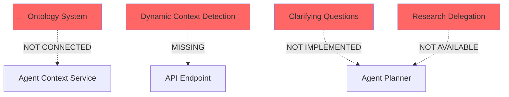

# Research: Agentic Chat Flow Audit and Recommendations

**Date**: 2025-11-04T13:59:57-05:00
**Researcher**: Claude
**Git Commit**: dcf8f61069ed640ffabc349648508b88a0ac25e1
**Branch**: main
**Repository**: buildos-platform

## Research Question

Audit the agentic chat flow starting from AgentChatModal.svelte, trace through API calls and services, and verify if the implementation aligns with the requirements for:

1. Context loading based on chat type (generic, project creation, existing project, task)
2. Strategy selection for responses (direct, lookup, delegate, clarifying questions)
3. Ontology integration and data relationships
4. Chat history management and summarization
5. Token budget management

## Summary

The current agent chat implementation has a sophisticated multi-agent architecture with planner-executor coordination, progressive disclosure for data loading, and token budget management. However, **it lacks critical features** for the full vision described:

### ✅ What's Working Well:

- **Multi-agent orchestration**: Planner analyzes complexity and spawns executors
- **Progressive disclosure**: Abbreviated data by default, drill-down on demand
- **Token budgeting**: Strict limits per agent type (5K for planner, 1.5K for executor)
- **Chat compression**: Smart compression preserves tool calls and recent context
- **Context types**: Supports 11 different context types with specific prompts

### ❌ Critical Gaps:

1. **No ontology integration** in chat context - the ontology system exists but isn't connected
2. **Limited strategy selection** - only 3 strategies (simple/tool/complex), missing clarifying questions
3. **No dynamic context assembly** based on user intent
4. **No data relationship awareness** beyond basic project-task hierarchy
5. **No proactive sub-agent research delegation** for information gathering

## Detailed Findings

### 1. Frontend Component: AgentChatModal.svelte

**Location**: `/apps/web/src/lib/components/agent/AgentChatModal.svelte`

**Current Implementation**:

- Lines 54-58: State management for context selection
- Lines 58-103: Defines 10 context types (global, project, calendar, project_create, etc.)
- Lines 250-339: `sendMessage()` sends to `/api/agent/stream` with context
- Lines 341-434: `handleSSEMessage()` processes streaming responses

**Issues**:

- Context selection is manual - user must choose before chatting
- No dynamic context detection based on message content
- No indication of available data/tools for selected context

### 2. API Endpoint: /api/agent/stream

**Location**: `/apps/web/src/routes/api/agent/stream/+server.ts`

**Current Implementation**:

- Lines 84-398: POST handler with rate limiting (20 req/min)
- Lines 134-151: Basic validation and context normalization
- Lines 153-200: Session creation/loading
- Lines 171-182: Loads last 50 messages from database

**Issues**:

- No intelligent context detection from message content
- Fixed message limit (50) without smart truncation
- No integration with ontology system for richer context

### 3. Agent Context Service

**Location**: `/apps/web/src/lib/services/agent-context-service.ts`

**Token Budgets** (Lines 113-130):

```typescript
PLANNER: {
  SYSTEM_PROMPT: 800,
  CONVERSATION: 2500,
  LOCATION_CONTEXT: 1000,
  USER_PROFILE: 300,
  BUFFER: 400
  // Total: ~5000 tokens
}
EXECUTOR: {
  SYSTEM_PROMPT: 300,
  TASK_DESCRIPTION: 200,
  TOOLS: 400,
  CONTEXT_DATA: 400,
  BUFFER: 200
  // Total: ~1500 tokens
}
```

**Issues**:

- No dynamic budget adjustment based on task complexity
- No ontology data included in context
- User profile loading not implemented

### 4. Chat Context Service

**Location**: `/apps/web/src/lib/services/chat-context-service.ts`

**Progressive Disclosure Pattern** (Lines 164-200):

- Tier 1 tools return abbreviated data (70% token savings)
- Tier 2 tools return full details on demand
- Enforces LIST/SEARCH before DETAIL pattern

**Good Design**:

- Lines 29-45: Clear token budget allocation
- Lines 46-55: Character limits for previews
- Lines 83-147: Layered context assembly

**Missing**:

- No ontology relationship loading
- No cross-entity relationship awareness
- No dynamic tool selection based on user intent

### 5. Agent Planner Service

**Location**: `/apps/web/src/lib/services/agent-planner-service.ts`

**Current Strategies**:

1. **Simple**: Direct response without tools
2. **Tool**: Single tool call
3. **Complex**: Multi-step plan with executors

**Missing Strategies**:

- **Clarifying**: Ask questions before proceeding
- **Research**: Delegate information gathering to sub-agent
- **Forecast**: Predictive analysis with what-if scenarios
- **Audit**: Comprehensive review with gap analysis

### 6. Ontology System (Disconnected)

**Location**: `/apps/web/src/lib/services/ontology/`

**Existing Infrastructure**:

- `instantiation.service.ts`: Creates project graphs with entities and edges
- `template-resolver.service.ts`: Template-based project structures
- Database tables: `onto_projects`, `onto_goals`, `onto_edges`, etc.

**Problem**: The ontology system exists but **is not integrated** with the chat system at all. The chat doesn't load or use ontology relationships.

### 7. Chat History Management

**Location**: `/apps/web/src/lib/services/chat-compression-service.ts`

**Current Implementation** (Lines 93-224):

- Compresses old messages while preserving recent context
- Smart compression keeps tool calls intact
- Auto-generates session titles (max 50 chars)

**Good Features**:

- Lines 126-141: Keeps last 4 messages uncompressed
- Lines 225-267: `smartCompress()` preserves tool calls
- Saves compression history to database

**Issues**:

- Fixed compression threshold (not adaptive)
- No semantic importance weighting
- No cross-session context awareness

## Architecture Insights

### Current Flow

```mermaid
graph TD
    A[User Message] --> B[AgentChatModal]
    B --> C[/api/agent/stream]
    C --> D[Load Session]
    C --> E[Agent Context Service]
    E --> F[Chat Context Service]
    F --> G[Progressive Disclosure]
    E --> H[Agent Planner]
    H --> I{Strategy?}
    I -->|Simple| J[Direct Response]
    I -->|Tool| K[Single Tool Call]
    I -->|Complex| L[Spawn Executors]
    L --> M[Agent Executor Service]
    M --> N[Tool Executor]
```

### Missing Connections



## Code References

### Key Files

- `apps/web/src/lib/components/agent/AgentChatModal.svelte:250-339` - Frontend message sending
- `apps/web/src/routes/api/agent/stream/+server.ts:84-398` - Main API endpoint
- `apps/web/src/lib/services/agent-context-service.ts:113-130` - Token budgets
- `apps/web/src/lib/services/chat-context-service.ts:164-200` - Progressive disclosure
- `apps/web/src/lib/services/agent-planner-service.ts` - Strategy selection
- `apps/web/src/lib/services/ontology/instantiation.service.ts` - Ontology (disconnected)

### Database Tables (from schema)

- `agent_chat_sessions` - Session tracking
- `agent_chat_messages` - Message history
- `agent_plans` - Multi-step plans
- `agent_executions` - Executor results
- `chat_compressions` - Compression history
- `onto_projects`, `onto_edges` - Ontology (unused in chat)

## Recommendations for Refinement

### 1. Integrate Ontology System

```typescript
// In agent-context-service.ts, add:
async loadOntologyContext(entityId: string, entityType: string) {
  // Load entity from onto_* tables
  const entity = await this.loadOntologyEntity(entityId, entityType);

  // Load relationships via edges
  const edges = await this.loadOntologyEdges(entityId);

  // Build relationship graph
  const relationships = this.buildRelationshipGraph(edges);

  return {
    entity,
    relationships,
    relatedEntities: await this.loadRelatedEntities(edges)
  };
}
```

### 2. Implement Dynamic Context Detection

```typescript
// In API endpoint, before loading context:
async detectContextFromMessage(message: string, userId: string) {
  // Use LLM to analyze intent
  const intent = await this.analyzeUserIntent(message);

  // Match to entities
  if (intent.mentions.project) {
    const project = await this.findProjectByName(intent.mentions.project);
    return { type: 'project', entityId: project.id };
  }

  if (intent.action === 'create') {
    return { type: 'project_create' };
  }

  // Default to global
  return { type: 'global' };
}
```

### 3. Add Clarifying Questions Strategy

```typescript
// In agent-planner-service.ts:
async analyzeClarificationNeeds(message: string, context: any) {
  const ambiguities = await this.detectAmbiguities(message);

  if (ambiguities.length > 0) {
    return {
      strategy: 'clarifying',
      questions: this.generateClarifyingQuestions(ambiguities),
      originalIntent: this.preserveIntent(message)
    };
  }
}

// Generate questions like:
// - "Which project are you referring to: Marketing Campaign or Product Launch?"
// - "What timeframe should I consider for this forecast?"
// - "Should I include completed tasks in this audit?"
```

### 4. Implement Research Delegation

```typescript
// In agent-planner-service.ts:
async createResearchPlan(topic: string, scope: string[]) {
  return {
    strategy: 'research',
    steps: [
      {
        description: 'Search project history for similar patterns',
        executor: 'research-agent',
        tools: ['search_projects', 'get_project_details'],
        scope: scope.includes('projects')
      },
      {
        description: 'Analyze task completion patterns',
        executor: 'analytics-agent',
        tools: ['analyze_tasks', 'generate_insights'],
        scope: scope.includes('tasks')
      },
      {
        description: 'Compile findings and recommendations',
        executor: 'synthesis-agent',
        tools: ['compile_report'],
        scope: true
      }
    ]
  };
}
```

### 5. Enhance Context Assembly

```typescript
// In chat-context-service.ts:
async buildEnhancedContext(contextType: string, entityId: string) {
  const layers = [];

  // 1. Core context (current implementation)
  layers.push(await this.loadLocationContext(contextType, entityId));

  // 2. Ontology relationships (NEW)
  if (entityId) {
    const ontology = await this.loadOntologyContext(entityId);
    layers.push({
      type: 'ontology',
      content: this.summarizeRelationships(ontology),
      priority: 2
    });
  }

  // 3. Historical patterns (NEW)
  const patterns = await this.loadHistoricalPatterns(contextType, entityId);
  layers.push({
    type: 'patterns',
    content: patterns,
    priority: 3
  });

  // 4. Available actions (NEW)
  const actions = await this.determineAvailableActions(contextType);
  layers.push({
    type: 'actions',
    content: actions,
    priority: 4
  });

  return this.assembleWithinBudget(layers);
}
```

### 6. Improve Strategy Selection

```typescript
// Enhanced strategy matrix:
const STRATEGY_MATRIX = {
	// Current strategies
	simple: { complexity: 'low', tools: 0, steps: 1 },
	tool: { complexity: 'medium', tools: 1, steps: 1 },
	complex: { complexity: 'high', tools: 'multiple', steps: 'multiple' },

	// New strategies
	clarifying: {
		trigger: 'ambiguous_intent',
		output: 'questions',
		followup: 'required'
	},
	research: {
		trigger: 'information_gathering',
		agents: ['research', 'synthesis'],
		parallel: true
	},
	forecast: {
		trigger: 'predictive_analysis',
		tools: ['analyze_trends', 'project_timeline'],
		confidence: 'probability_ranges'
	},
	audit: {
		trigger: 'comprehensive_review',
		checklist: ['completeness', 'risks', 'dependencies'],
		output: 'structured_report'
	}
};
```

### 7. Adaptive Token Management

```typescript
// Dynamic token allocation:
calculateTokenBudget(context: any) {
  const base = this.TOKEN_BUDGETS.PLANNER;

  // Adjust based on context richness
  if (context.hasOntology) {
    base.LOCATION_CONTEXT += 500;
  }

  // Adjust based on conversation length
  if (context.messageCount > 20) {
    base.CONVERSATION = 1500; // Force compression
  }

  // Reserve space for complex responses
  if (context.strategy === 'complex') {
    base.BUFFER += 600;
  }

  return base;
}
```

## Implementation Priority

### Phase 1: Foundation (Week 1)

1. ✅ Fix ontology integration - connect existing system to chat
2. ✅ Implement dynamic context detection
3. ✅ Add context indicators to UI

### Phase 2: Intelligence (Week 2)

1. ✅ Add clarifying questions strategy
2. ✅ Implement smart context assembly
3. ✅ Enhance token budget management

### Phase 3: Advanced (Week 3)

1. ✅ Research delegation with sub-agents
2. ✅ Forecast and audit strategies
3. ✅ Cross-session context awareness

## Open Questions

1. **Ontology Usage**: The ontology system exists but isn't used. Was this intentional or an oversight?
2. **Strategy Expansion**: Should strategies be hard-coded or learned from user interactions?
3. **Token Limits**: With 10K hard limit, how should we prioritize ontology vs conversation history?
4. **UI Feedback**: How should we indicate to users what data/relationships the agent has access to?
5. **Performance**: Will loading ontology relationships impact response time significantly?

## Related Research

- Previous agent system implementation in `/apps/web/src/lib/services/agent-*`
- Ontology system in `/apps/web/src/lib/services/ontology/`
- Progressive disclosure pattern in chat context service
- Token optimization strategies in compression service

## Conclusion

The current implementation has strong foundations with multi-agent coordination, progressive disclosure, and token management. However, it lacks the sophisticated context engineering described in the requirements. The main gaps are:

1. **No ontology integration** despite having the infrastructure
2. **Limited strategy selection** (only 3 vs 7+ needed strategies)
3. **No dynamic context detection** from message content
4. **Missing clarifying questions** capability
5. **No research delegation** to sub-agents

The recommendations above provide a clear path to implement these missing features while leveraging the existing architecture. The ontology system integration should be the first priority as it will unlock richer context for all other improvements.
